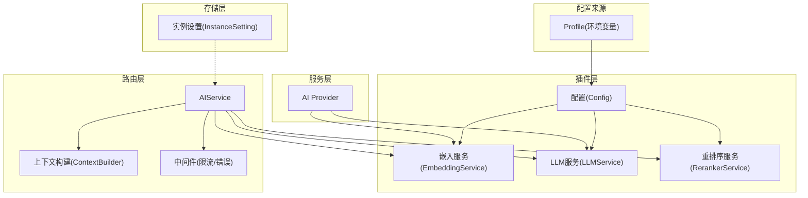
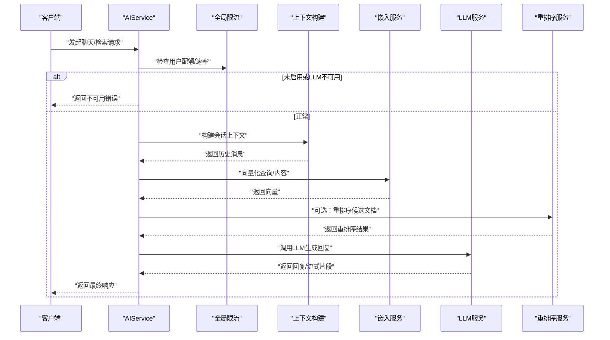
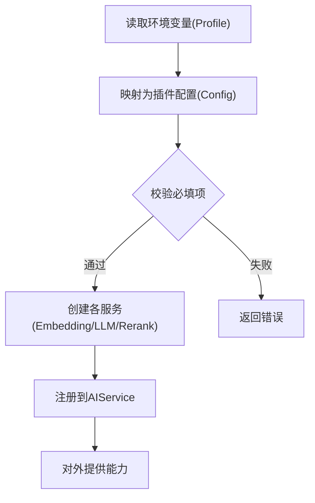
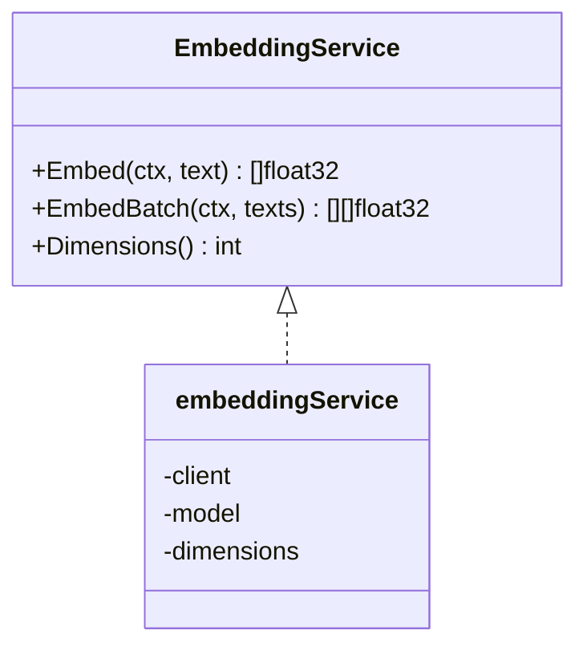
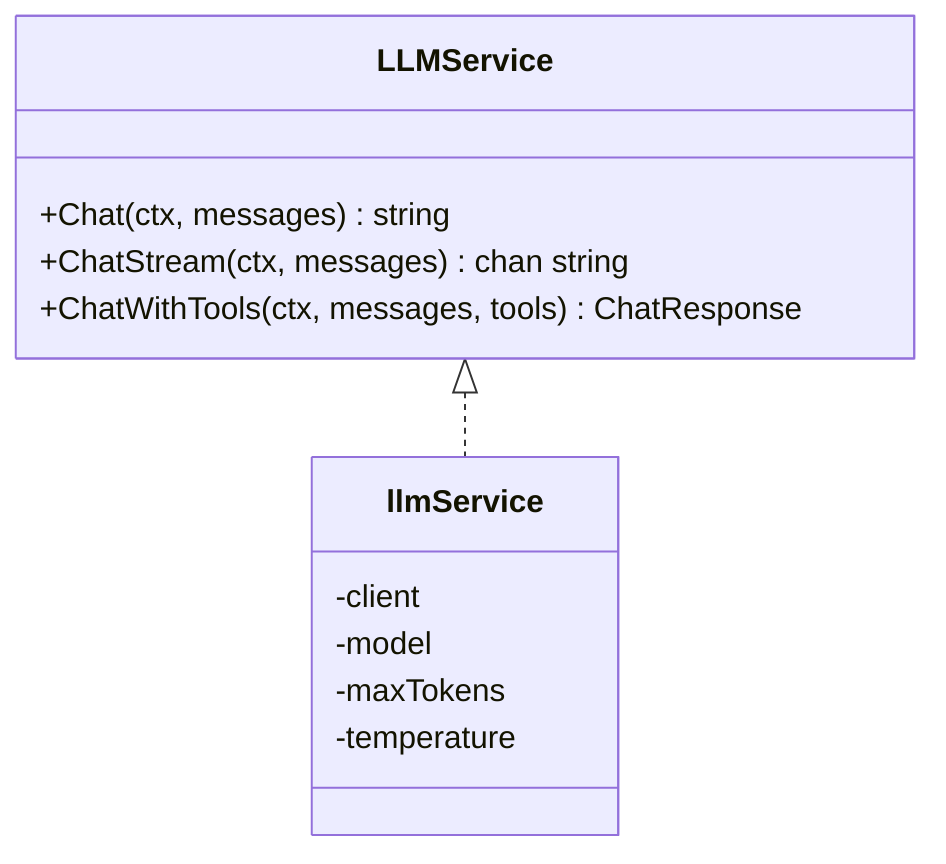
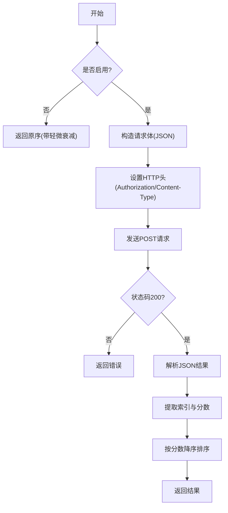
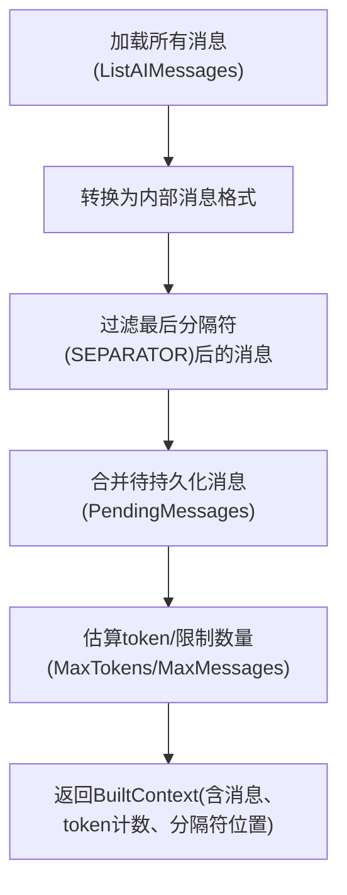
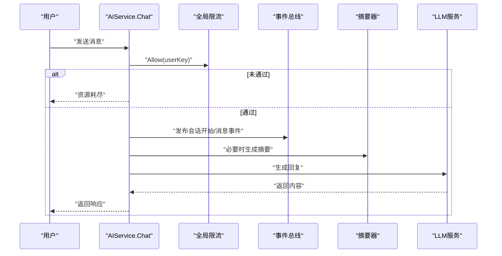
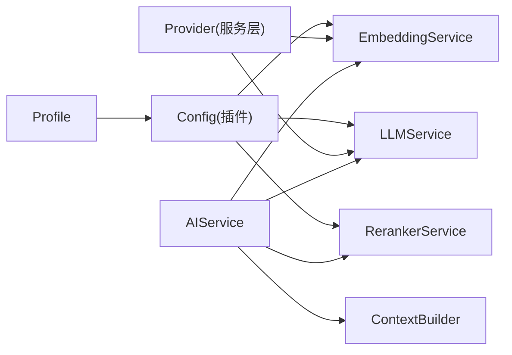

# AI 功能配置与管理

<cite>
**本文引用的文件**
- [README.md](file://README.md)
- [.env.example](file://.env.example)
- [deploy/aliyun/README.md](file://deploy/aliyun/README.md)
- [deploy/aliyun/.env.prod.example](file://deploy/aliyun/.env.prod.example)
- [docker/README.md](file://docker/README.md)
- [docker/compose/prod.yml](file://docker/compose/prod.yml)
- [docker/compose/dev.yml](file://docker/compose/dev.yml)
- [plugin/ai/config.go](file://plugin/ai/config.go)
- [plugin/ai/embedding.go](file://plugin/ai/embedding.go)
- [plugin/ai/llm.go](file://plugin/ai/llm.go)
- [plugin/ai/reranker.go](file://plugin/ai/reranker.go)
- [internal/profile/profile.go](file://internal/profile/profile.go)
- [server/ai/provider.go](file://server/ai/provider.go)
- [server/router/api/v1/ai_service.go](file://server/router/api/v1/ai_service.go)
- [server/router/api/v1/ai_service_chat.go](file://server/router/api/v1/ai_service_chat.go)
- [server/router/api/v1/ai/context_builder.go](file://server/router/api/v1/ai/context_builder.go)
- [server/router/api/v1/ai/middleware.go](file://server/router/api/v1/ai/middleware.go)
- [store/instance_setting.go](file://store/instance_setting.go)
- [plugin/ai/config_test.go](file://plugin/ai/config_test.go)
- [plugin/ai/embedding_test.go](file://plugin/ai/embedding_test.go)
- [plugin/ai/llm_test.go](file://plugin/ai/llm_test.go)
- [plugin/ai/reranker_test.go](file://plugin/ai/reranker_test.go)
- [internal/profile/profile_test.go](file://internal/profile/profile_test.go)
</cite>

## 更新摘要
**变更内容**
- 新增详细的环境变量配置说明和部署要求
- 补充多种配置方案和最佳实践指导
- 增加生产环境部署指南和故障排除
- 完善 AI 功能启用步骤和验证方法

## 目录
1. [简介](#简介)
2. [项目结构](#项目结构)
3. [核心组件](#核心组件)
4. [架构总览](#架构总览)
5. [详细组件分析](#详细组件分析)
6. [依赖关系分析](#依赖关系分析)
7. [性能考量](#性能考量)
8. [故障排除指南](#故障排除指南)
9. [结论](#结论)
10. [附录](#附录)

## 简介
本指南面向运维与开发人员，系统化讲解 Memos 中 AI 功能的配置与管理，覆盖以下主题：
- AI 插件配置项：嵌入模型、LLM 提供商、重排序器参数
- 运行时配置管理：动态参数调整与配置热更新
- 成本控制策略：令牌限制、并发控制、缓存策略
- 监控与日志：性能指标采集与错误追踪
- 最佳实践与故障排除：常见配置错误与解决方案

## 项目结构
AI 能力由"插件层"与"服务层"协同实现：
- 插件层（plugin/ai）：定义配置结构、服务接口与具体实现（嵌入、LLM、重排序）
- 服务层（server/ai）：提供统一 Provider，支持环境变量初始化与连通性校验
- 路由层（server/router/api/v1/ai_*）：对外暴露 AI 能力的 API 与中间件
- 配置来源（internal/profile）：从环境变量加载实例级 AI 配置
- 存储层（store）：实例设置持久化与缓存



**图表来源**
- [plugin/ai/config.go](file://plugin/ai/config.go#L9-L44)
- [plugin/ai/embedding.go](file://plugin/ai/embedding.go#L11-L21)
- [plugin/ai/llm.go](file://plugin/ai/llm.go#L20-L30)
- [plugin/ai/reranker.go](file://plugin/ai/reranker.go#L20-L27)
- [server/ai/provider.go](file://server/ai/provider.go#L14-L40)
- [server/router/api/v1/ai_service.go](file://server/router/api/v1/ai_service.go#L20-L43)
- [server/router/api/v1/ai/context_builder.go](file://server/router/api/v1/ai/context_builder.go#L12-L27)
- [internal/profile/profile.go](file://internal/profile/profile.go#L35-L49)
- [store/instance_setting.go](file://store/instance_setting.go#L12-L16)

**章节来源**
- [plugin/ai/config.go](file://plugin/ai/config.go#L1-L129)
- [internal/profile/profile.go](file://internal/profile/profile.go#L1-L153)
- [server/ai/provider.go](file://server/ai/provider.go#L1-L221)
- [server/router/api/v1/ai_service.go](file://server/router/api/v1/ai_service.go#L1-L74)
- [server/router/api/v1/ai/context_builder.go](file://server/router/api/v1/ai/context_builder.go#L1-L130)
- [store/instance_setting.go](file://store/instance_setting.go#L1-L200)

## 核心组件
- 配置结构
  - 全局开关与子模块配置：启用状态、嵌入、重排序、LLM
  - 嵌入配置：提供商、模型、维度、API 密钥、基础地址
  - 重排序配置：启用、提供商、模型、API 密钥、基础地址
  - LLM 配置：提供商、模型、API 密钥、基础地址、最大令牌数、温度
- 服务接口
  - 嵌入服务：单文本与批量向量化、返回维度
  - LLM 服务：同步对话、流式对话、带工具调用的对话
  - 重排序服务：按相关性重排文档、返回索引与分数
- Provider（服务层）
  - 支持环境变量初始化、默认值填充、连通性校验、指数退避重试

**章节来源**
- [plugin/ai/config.go](file://plugin/ai/config.go#L9-L44)
- [plugin/ai/embedding.go](file://plugin/ai/embedding.go#L11-L21)
- [plugin/ai/llm.go](file://plugin/ai/llm.go#L20-L30)
- [plugin/ai/reranker.go](file://plugin/ai/reranker.go#L20-L27)
- [server/ai/provider.go](file://server/ai/provider.go#L14-L40)

## 架构总览
AI 能力通过"配置 → 服务 → API"的链路对外提供。Profile 从环境变量读取配置，生成插件层配置；插件层根据配置创建具体服务；路由层在请求到达时进行鉴权、限流与上下文构建，并调用相应服务。



**图表来源**
- [server/router/api/v1/ai_service_chat.go](file://server/router/api/v1/ai_service_chat.go#L58-L200)
- [server/router/api/v1/ai_service.go](file://server/router/api/v1/ai_service.go#L17-L55)
- [server/router/api/v1/ai/context_builder.go](file://server/router/api/v1/ai/context_builder.go#L95-L130)
- [plugin/ai/embedding.go](file://plugin/ai/embedding.go#L71-L98)
- [plugin/ai/llm.go](file://plugin/ai/llm.go#L106-L128)
- [plugin/ai/reranker.go](file://plugin/ai/reranker.go#L59-L126)

## 详细组件分析

### 配置与初始化
- Profile 从环境变量读取 AI 相关键值，包含提供商、模型、密钥与基础地址等
- 插件层 Config 将 Profile 映射为嵌入、LLM、重排序的具体配置，并进行必填项校验
- 服务层 Provider 支持从环境变量创建，默认值填充与连通性校验



**图表来源**
- [internal/profile/profile.go](file://internal/profile/profile.go#L76-L99)
- [plugin/ai/config.go](file://plugin/ai/config.go#L46-L103)
- [plugin/ai/config.go](file://plugin/ai/config.go#L105-L128)
- [server/ai/provider.go](file://server/ai/provider.go#L202-L221)

**章节来源**
- [internal/profile/profile.go](file://internal/profile/profile.go#L35-L99)
- [plugin/ai/config.go](file://plugin/ai/config.go#L46-L128)
- [server/ai/provider.go](file://server/ai/provider.go#L202-L221)

### 嵌入服务（EmbeddingService）
- 支持 SiliconFlow/OpenAI 接口兼容的提供商
- 批量向量化，返回固定维度向量
- 错误处理：空输入、空响应、创建失败



**图表来源**
- [plugin/ai/embedding.go](file://plugin/ai/embedding.go#L11-L21)
- [plugin/ai/embedding.go](file://plugin/ai/embedding.go#L23-L57)

**章节来源**
- [plugin/ai/embedding.go](file://plugin/ai/embedding.go#L1-L103)
- [plugin/ai/embedding_test.go](file://plugin/ai/embedding_test.go#L1-L105)

### LLM 服务（LLMService）
- 支持 DeepSeek、OpenAI、SiliconFlow
- 提供同步对话、流式对话、带工具调用的对话
- 超时保护与日志记录



**图表来源**
- [plugin/ai/llm.go](file://plugin/ai/llm.go#L20-L30)
- [plugin/ai/llm.go](file://plugin/ai/llm.go#L58-L63)

**章节来源**
- [plugin/ai/llm.go](file://plugin/ai/llm.go#L1-L326)
- [plugin/ai/llm_test.go](file://plugin/ai/llm_test.go#L1-L167)

### 重排序服务（RerankerService）
- 可选启用，调用 SiliconFlow 的 rerank API
- 返回相关性分数与原始索引，按分数降序排序
- 禁用时返回原始顺序（带轻微衰减）



**图表来源**
- [plugin/ai/reranker.go](file://plugin/ai/reranker.go#L59-L126)

**章节来源**
- [plugin/ai/reranker.go](file://plugin/ai/reranker.go#L1-L127)
- [plugin/ai/reranker_test.go](file://plugin/ai/reranker_test.go#L1-L85)

### 上下文构建与会话管理
- ContextBuilder 从存储加载消息，过滤分隔符，估算 token 数量，合并待持久化的消息
- 用于聊天 API 构建对话上下文，确保 SEPARATOR 过滤与令牌上限控制



**图表来源**
- [server/router/api/v1/ai/context_builder.go](file://server/router/api/v1/ai/context_builder.go#L95-L130)

**章节来源**
- [server/router/api/v1/ai/context_builder.go](file://server/router/api/v1/ai/context_builder.go#L1-L130)

### API 与中间件
- AIService 对外提供 AI 能力，包含全局限流、用户鉴权、事件总线与会话持久化
- 中间件负责速率限制、错误转换与日志截断



**图表来源**
- [server/router/api/v1/ai_service_chat.go](file://server/router/api/v1/ai_service_chat.go#L58-L200)
- [server/router/api/v1/ai/middleware.go](file://server/router/api/v1/ai/middleware.go#L105-L147)

**章节来源**
- [server/router/api/v1/ai_service.go](file://server/router/api/v1/ai_service.go#L17-L74)
- [server/router/api/v1/ai_service_chat.go](file://server/router/api/v1/ai_service_chat.go#L1-L200)
- [server/router/api/v1/ai/middleware.go](file://server/router/api/v1/ai/middleware.go#L105-L147)

## 依赖关系分析
- 配置来源：Profile → 插件 Config → 各服务初始化
- 服务依赖：AIService 依赖嵌入、LLM、重排序服务；ContextBuilder 依赖存储层
- 外部依赖：OpenAI 兼容客户端、SiliconFlow API、HTTP 客户端



**图表来源**
- [internal/profile/profile.go](file://internal/profile/profile.go#L76-L99)
- [plugin/ai/config.go](file://plugin/ai/config.go#L46-L103)
- [server/ai/provider.go](file://server/ai/provider.go#L42-L73)
- [server/router/api/v1/ai_service.go](file://server/router/api/v1/ai_service.go#L20-L43)
- [server/router/api/v1/ai/context_builder.go](file://server/router/api/v1/ai/context_builder.go#L19-L27)

**章节来源**
- [plugin/ai/config.go](file://plugin/ai/config.go#L1-L129)
- [server/ai/provider.go](file://server/ai/provider.go#L1-L221)
- [server/router/api/v1/ai_service.go](file://server/router/api/v1/ai_service.go#L1-L74)

## 性能考量
- 令牌与上下文长度
  - ContextBuilder 提供 MaxTokens 与 MaxMessages 控制，避免过长上下文导致延迟与成本上升
  - Token 计数采用字符估算，建议结合实际模型进行更精确统计
- 并发与限流
  - 全局限流基于用户键，防止滥用；可在 AIService 层扩展用户级配额
- 缓存策略
  - 嵌入向量与重排序结果可引入缓存（如 Redis/Tiered），减少重复计算
  - 会话摘要可缓存以降低后续对话成本
- 超时与重试
  - LLM 与重排序均设置超时；Provider 支持指数退避重试，提升稳定性

**章节来源**
- [server/router/api/v1/ai/context_builder.go](file://server/router/api/v1/ai/context_builder.go#L24-L49)
- [plugin/ai/llm.go](file://plugin/ai/llm.go#L106-L128)
- [plugin/ai/reranker.go](file://plugin/ai/reranker.go#L37-L53)
- [server/ai/provider.go](file://server/ai/provider.go#L177-L200)

## 故障排除指南
- 常见配置错误
  - 未启用 AI 或缺少 API Key/BaseURL：Profile 的 IsAIEnabled 与 Config.Validate 会拒绝无效配置
  - 不支持的提供商：嵌入服务不支持 Ollama；LLM 服务支持 DeepSeek/OpenAI/SiliconFlow/Ollama
  - 空输入/空响应：嵌入服务对空文本切片与空响应进行显式错误处理
- 日志与调试
  - LLM 流式对话记录起止与错误；Provider 的 Validate 输出关键信息
  - AIService.Chat 对会话事件与上下文构建过程进行调试日志
- 单元测试参考
  - 配置映射与校验、服务创建与行为、禁用重排序的行为均可通过测试用例验证

**章节来源**
- [internal/profile/profile.go](file://internal/profile/profile.go#L63-L66)
- [plugin/ai/config.go](file://plugin/ai/config.go#L105-L128)
- [plugin/ai/embedding.go](file://plugin/ai/embedding.go#L71-L98)
- [plugin/ai/llm.go](file://plugin/ai/llm.go#L217-L265)
- [server/ai/provider.go](file://server/ai/provider.go#L158-L175)
- [plugin/ai/config_test.go](file://plugin/ai/config_test.go#L145-L239)
- [plugin/ai/embedding_test.go](file://plugin/ai/embedding_test.go#L86-L104)
- [plugin/ai/llm_test.go](file://plugin/ai/llm_test.go#L131-L167)
- [plugin/ai/reranker_test.go](file://plugin/ai/reranker_test.go#L28-L61)
- [internal/profile/profile_test.go](file://internal/profile/profile_test.go#L143-L206)

## 结论
本指南梳理了 Memos 中 AI 功能的配置与运行机制，强调了从环境变量到服务层再到 API 的完整链路。通过合理的令牌与上下文控制、并发与缓存策略以及完善的日志与校验，可以在保证性能与成本可控的前提下稳定地提供 AI 能力。

## 附录

### 配置项清单与建议
- 嵌入模型
  - 提供商：siliconflow/openai/ollama
  - 模型：如 BAAI/bge-m3
  - 维度：按模型确定，嵌入服务返回
  - 基础地址：可选覆盖
- LLM 提供商
  - 提供商：deepseek/openai/ollama/siliconflow
  - 模型：如 deepseek-chat/gpt-4
  - 最大令牌数：依据模型与任务调整
  - 温度：0.0~1.0，影响创造性
- 重排序器
  - 启用：依赖 SiliconFlow API Key
  - 模型：如 BAAI/bge-reranker-v2-m3
  - 基础地址：可选覆盖

**章节来源**
- [plugin/ai/config.go](file://plugin/ai/config.go#L18-L44)
- [plugin/ai/embedding.go](file://plugin/ai/embedding.go#L29-L58)
- [plugin/ai/llm.go](file://plugin/ai/llm.go#L65-L104)
- [plugin/ai/reranker.go](file://plugin/ai/reranker.go#L37-L53)

### 环境变量配置详解

#### 基础配置
- MEMOS_AI_ENABLED=true/false - 启用/禁用 AI 功能
- MEMOS_DRIVER=postgres - 数据库驱动（必须为 postgres）
- MEMOS_DSN=postgres://... - PostgreSQL 连接字符串

#### API 密钥配置
- MEMOS_AI_SILICONFLOW_API_KEY - SiliconFlow API 密钥
- MEMOS_AI_DEEPSEEK_API_KEY - DeepSeek API 密钥
- MEMOS_AI_OPENAI_API_KEY - OpenAI API 密钥（可选）

#### 模型配置
- MEMOS_AI_EMBEDDING_PROVIDER - 嵌入模型提供商（siliconflow/openai/ollama）
- MEMOS_AI_LLM_PROVIDER - LLM 模型提供商（deepseek/openai/ollama/siliconflow）
- MEMOS_AI_EMBEDDING_MODEL - 嵌入模型名称（默认 BAAI/bge-m3）
- MEMOS_AI_LLM_MODEL - LLM 模型名称（默认 deepseek-chat）
- MEMOS_AI_RERANK_MODEL - 重排模型名称（默认 BAAI/bge-reranker-v2-m3）

#### 服务配置
- MEMOS_AI_SILICONFLOW_BASE_URL - SiliconFlow 基础地址（默认 https://api.siliconflow.cn/v1）
- MEMOS_AI_DEEPSEEK_BASE_URL - DeepSeek 基础地址（默认 https://api.deepseek.com）
- MEMOS_AI_OPENAI_BASE_URL - OpenAI 基础地址（默认 https://api.openai.com/v1）
- MEMOS_AI_OLLAMA_BASE_URL - Ollama 基础地址（默认 http://localhost:11434）

**章节来源**
- [.env.example](file://.env.example#L14-L139)
- [deploy/aliyun/.env.prod.example](file://deploy/aliyun/.env.prod.example#L34-L174)
- [internal/profile/profile.go](file://internal/profile/profile.go#L35-L99)

### 部署配置方案

#### 方案 A: SiliconFlow + DeepSeek（推荐）
- 成本最优，国内访问稳定
- MEMOS_AI_SILICONFLOW_API_KEY=sk-xxx
- MEMOS_AI_DEEPSEEK_API_KEY=sk-xxx

#### 方案 B: 纯 SiliconFlow
- 单一供应商，管理简单
- MEMOS_AI_LLM_PROVIDER=siliconflow
- MEMOS_AI_SILICONFLOW_API_KEY=sk-xxx
- MEMOS_AI_LLM_MODEL=Qwen/Qwen2.5-72B-Instruct

#### 方案 C: OpenAI 全家桶
- 海外用户，追求效果
- MEMOS_AI_EMBEDDING_PROVIDER=openai
- MEMOS_AI_LLM_PROVIDER=openai
- MEMOS_AI_OPENAI_API_KEY=sk-xxx
- MEMOS_AI_EMBEDDING_MODEL=text-embedding-3-small
- MEMOS_AI_LLM_MODEL=gpt-4o

#### 方案 D: 本地 Ollama
- 完全离线，数据私密
- MEMOS_AI_EMBEDDING_PROVIDER=ollama
- MEMOS_AI_LLM_PROVIDER=ollama
- MEMOS_AI_OLLAMA_BASE_URL=http://localhost:11434
- MEMOS_AI_EMBEDDING_MODEL=nomic-embed-text
- MEMOS_AI_LLM_MODEL=llama3.1

**章节来源**
- [.env.example](file://.env.example#L109-L139)
- [deploy/aliyun/.env.prod.example](file://deploy/aliyun/.env.prod.example#L144-L174)

### 生产环境部署指南

#### 系统要求
- 2核2G 服务器配置
- PostgreSQL 16+ (pgvector 扩展)
- Docker 环境

#### 部署步骤
1. **准备环境**
   ```bash
   # 上传部署文件
   scp -r deploy/aliyun user@your-server:/root/memos-deploy
   scp -r docker/compose user@your-server:/root/memos-deploy/docker/
   scp -r store/migration user@your-server:/root/memos-deploy/store/
   ```

2. **配置环境变量**
   ```bash
   # 复制并编辑配置文件
   cp .env.prod.example .env.prod
   vi .env.prod  # 修改密码和 API Keys
   ```

3. **部署应用**
   ```bash
   # 方式 1: 使用预构建镜像（推荐）
   ./deploy.sh pull       # 拉取镜像
   ./deploy.sh deploy     # 部署
   
   # 方式 2: 本地构建
   ./deploy.sh build      # 构建镜像
   ./deploy.sh deploy     # 部署
   ```

4. **验证部署**
   ```bash
   ./deploy.sh status     # 查看服务状态
   ./deploy.sh logs       # 查看日志
   ```

**章节来源**
- [deploy/aliyun/README.md](file://deploy/aliyun/README.md#L38-L91)
- [deploy/aliyun/README.md](file://deploy/aliyun/README.md#L212-L224)

### 开发环境配置

#### Docker Compose 配置
- 开发环境使用 PostgreSQL + Memos
- 支持快速启动和开发调试
- 端口映射：25432:5432

#### 环境变量说明
| 变量 | 默认值 | 说明 |
|------|--------|------|
| POSTGRES_DB | memos | 数据库名 |
| POSTGRES_USER | memos | 用户名 |
| POSTGRES_PASSWORD | memos | 密码 |

**章节来源**
- [docker/README.md](file://docker/README.md#L1-L64)
- [docker/compose/dev.yml](file://docker/compose/dev.yml#L1-L49)

### 配置验证与测试

#### 基础验证
1. **检查服务状态**
   ```bash
   ./deploy.sh status
   ```

2. **查看日志输出**
   ```bash
   ./deploy.sh logs
   ```

3. **数据库连接测试**
   ```bash
   # 检查 pgvector 扩展
   docker exec memos-postgres psql -U memos -d memos -c "SELECT extname FROM pg_extension WHERE extname = 'vector';"
   
   # 验证数据库版本
   docker exec memos-postgres psql -U memos -d memos -c "SELECT value FROM system_setting WHERE name = 'schema_version';"
   ```

#### AI 功能测试
1. **配置验证**
   - 确认 MEMOS_AI_ENABLED=true
   - 验证至少一个 API Key 已配置
   - 检查模型配置正确性

2. **功能测试**
   - 启动应用后访问 http://localhost:25173
   - 测试 AI 聊天功能
   - 验证语义搜索功能

**章节来源**
- [deploy/aliyun/README.md](file://deploy/aliyun/README.md#L292-L307)
- [internal/profile/profile.go](file://internal/profile/profile.go#L63-L66)

### 常见问题解决

#### 部署问题
- **pgvector 拉取失败**：运行 `./deploy.sh setup` 配置镜像加速
- **构建超时**：Dockerfile 已配置 GOPROXY=goproxy.cn 和 npmmirror.com
- **依赖缺失**：使用预构建镜像替代本地构建

#### 运行问题
- **服务无法启动**：检查日志输出，确认数据库连接正常
- **AI 功能不可用**：验证 API Key 配置和网络连接
- **性能问题**：调整模型配置和资源限制

#### 数据库迁移
- 首次部署自动执行 `LATEST.sql`
- 升级时按版本号顺序执行增量迁移脚本
- 支持自动备份和回滚机制

**章节来源**
- [deploy/aliyun/README.md](file://deploy/aliyun/README.md#L137-L145)
- [deploy/aliyun/README.md](file://deploy/aliyun/README.md#L257-L262)
- [deploy/aliyun/README.md](file://deploy/aliyun/README.md#L299-L314)

### 最佳实践建议

#### 配置管理
- 使用环境变量管理敏感信息
- 为不同环境准备独立的配置文件
- 定期轮换 API Key 以提高安全性

#### 性能优化
- 根据业务需求选择合适的模型
- 合理设置最大令牌数和温度参数
- 启用适当的缓存策略

#### 监控与维护
- 定期检查服务日志和性能指标
- 建立备份和恢复机制
- 制定应急预案和故障处理流程

**章节来源**
- [.env.example](file://.env.example#L1-L139)
- [README.md](file://README.md#L29-L46)
- [deploy/aliyun/README.md](file://deploy/aliyun/README.md#L318-L337)