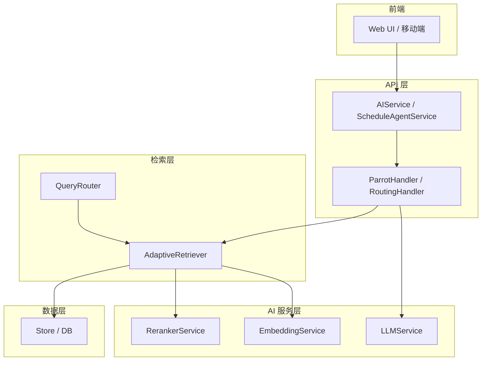
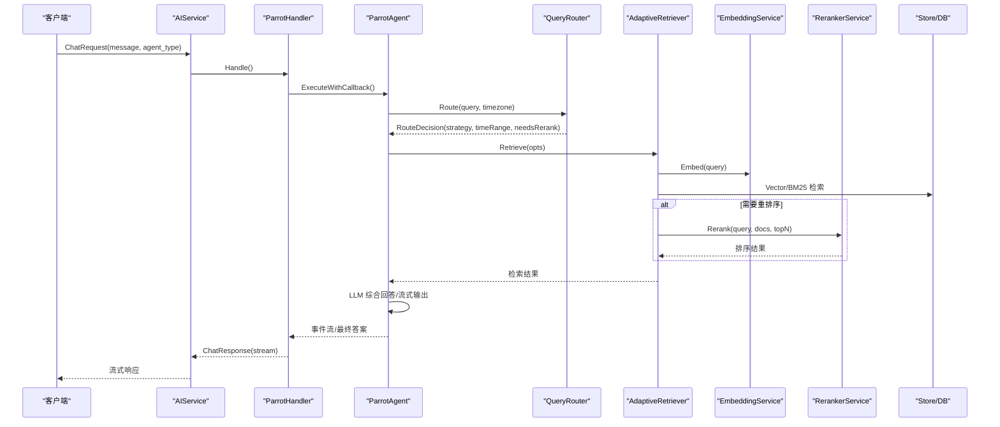
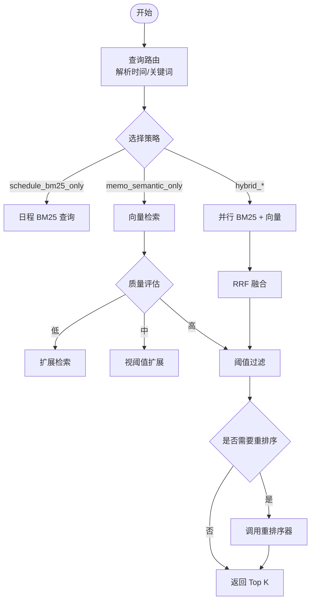
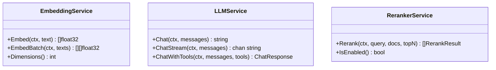
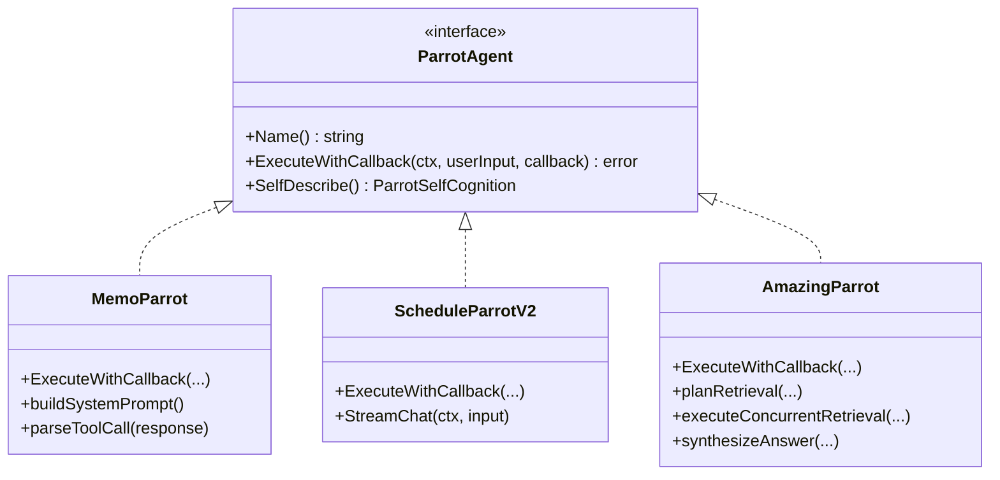
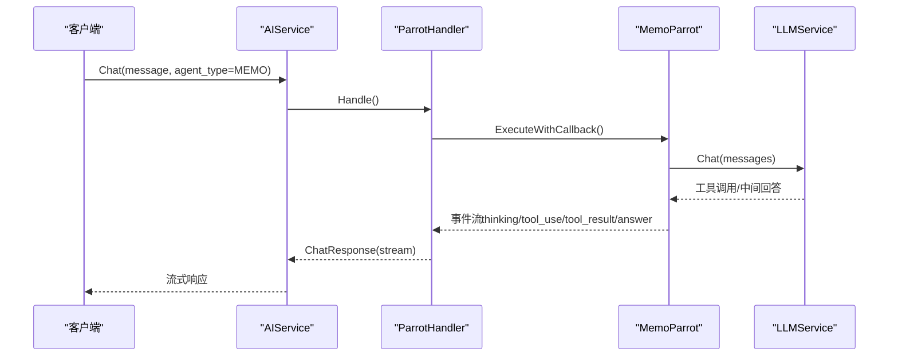
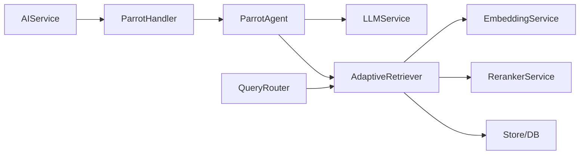

# AI 增强系统

<cite>
**本文档引用的文件**
- [plugin/ai/config.go](file://plugin/ai/config.go)
- [plugin/ai/embedding.go](file://plugin/ai/embedding.go)
- [plugin/ai/llm.go](file://plugin/ai/llm.go)
- [plugin/ai/reranker.go](file://plugin/ai/reranker.go)
- [server/ai/provider.go](file://server/ai/provider.go)
- [plugin/ai/agent/amazing_parrot.go](file://plugin/ai/agent/amazing_parrot.go)
- [plugin/ai/agent/memo_parrot.go](file://plugin/ai/agent/memo_parrot.go)
- [plugin/ai/agent/schedule_parrot_v2.go](file://plugin/ai/agent/schedule_parrot_v2.go)
- [plugin/ai/agent/types.go](file://plugin/ai/agent/types.go)
- [plugin/ai/agent/context.go](file://plugin/ai/agent/context.go)
- [server/queryengine/query_router.go](file://server/queryengine/query_router.go)
- [server/retrieval/adaptive_retrieval.go](file://server/retrieval/adaptive_retrieval.go)
- [server/router/api/v1/ai/handler.go](file://server/router/api/v1/ai/handler.go)
- [store/db/postgres/memo.go](file://store/db/postgres/memo.go)
- [proto/api/v1/ai_service.proto](file://proto/api/v1/ai_service.proto)
</cite>

## 更新摘要
**所做更改**
- 移除了实验性的 AI 代理聊天功能和复杂的自然语言处理能力
- 简化了对话历史跟踪机制，移除了最多 5 轮对话的历史限制
- 移除了 Markdown 渲染支持和自动日程解析功能
- 更新了多代理系统的架构说明，强调核心功能的简化和专注

## 目录
1. [简介](#简介)
2. [项目结构](#项目结构)
3. [核心组件](#核心组件)
4. [架构总览](#架构总览)
5. [详细组件分析](#详细组件分析)
6. [依赖关系分析](#依赖关系分析)
7. [性能考量](#性能考量)
8. [故障排查指南](#故障排查指南)
9. [结论](#结论)
10. [附录](#附录)

## 简介
本文件面向"AI 增强系统"的综合技术文档，围绕智能 RAG 管道与 Parrot 多代理 AI 系统进行深入解析。系统通过查询路由、缓存检查、自适应检索与结果融合，实现向量搜索、BM25 全文搜索与重排序器的协同工作；并通过多代理（Memo、Schedule、Amazing）实现不同场景下的智能交互与协作。

**更新** 系统现已简化为专注于核心功能，移除了实验性的聊天功能、复杂的自然语言处理能力和历史对话跟踪机制。

## 项目结构
系统采用分层与功能域划分：
- 插件层（plugin/ai）：AI 配置、嵌入、LLM、重排序服务及代理框架
- 服务层（server）：查询路由、自适应检索、API 路由与处理器
- 数据层（store）：数据库访问与检索接口
- 协议层（proto/api/v1）：AI 服务与消息协议定义

**图表来源**
- [server/router/api/v1/ai/handler.go](file://server/router/api/v1/ai/handler.go#L25-L78)
- [plugin/ai/llm.go](file://plugin/ai/llm.go#L20-L30)
- [plugin/ai/embedding.go](file://plugin/ai/embedding.go#L11-L21)
- [plugin/ai/reranker.go](file://plugin/ai/reranker.go#L20-L27)
- [server/queryengine/query_router.go](file://server/queryengine/query_router.go#L18-L40)
- [server/retrieval/adaptive_retrieval.go](file://server/retrieval/adaptive_retrieval.go#L24-L30)
- [store/db/postgres/memo.go](file://store/db/postgres/memo.go#L51-L196)

## 核心组件
- AI 配置与服务
  - 配置结构：嵌入、重排序、LLM 的提供商、模型、密钥与基础地址
  - 服务接口：EmbeddingService、LLMService、RerankerService
- 查询路由与检索
  - QueryRouter：根据查询内容与时间关键词选择检索策略
  - AdaptiveRetriever：混合检索（BM25 + 向量）与 RRF 融合、重排序
- 多代理系统（Parrot）
  - MemoParrot：ReAct 循环 + 工具调用（memo_search）
  - ScheduleParrotV2：日程代理（封装 SchedulerAgentV2）
  - AmazingParrot：两阶段并发检索（意图分析 + 并发检索 + 综合回答）
  - 代理通用接口与事件流
- API 与协议
  - AIService / ScheduleAgentService 协议与流式响应
  - ChatRequest/ChatResponse、AgentType、ScheduleQueryMode 等

**章节来源**
- [plugin/ai/config.go](file://plugin/ai/config.go#L9-L44)
- [plugin/ai/embedding.go](file://plugin/ai/embedding.go#L11-L21)
- [plugin/ai/llm.go](file://plugin/ai/llm.go#L20-L30)
- [plugin/ai/reranker.go](file://plugin/ai/reranker.go#L20-L27)
- [server/queryengine/query_router.go](file://server/queryengine/query_router.go#L18-L59)
- [server/retrieval/adaptive_retrieval.go](file://server/retrieval/adaptive_retrieval.go#L24-L53)
- [plugin/ai/agent/types.go](file://plugin/ai/agent/types.go#L10-L23)
- [proto/api/v1/ai_service.proto](file://proto/api/v1/ai_service.proto#L13-L110)

## 架构总览
系统通过"查询路由 → 自适应检索 → 结果融合/重排序 → LLM 综合回答"的流水线，结合多代理的工具调用与事件流，实现端到端的智能增强体验。

**更新** 架构已简化，移除了复杂的对话历史管理和多轮对话处理机制，专注于单一查询的快速响应。

**图表来源**
- [server/router/api/v1/ai/handler.go](file://server/router/api/v1/ai/handler.go#L40-L78)
- [plugin/ai/agent/amazing_parrot.go](file://plugin/ai/agent/amazing_parrot.go#L106-L184)
- [server/queryengine/query_router.go](file://server/queryengine/query_router.go#L449-L465)
- [server/retrieval/adaptive_retrieval.go](file://server/retrieval/adaptive_retrieval.go#L68-L115)
- [plugin/ai/embedding.go](file://plugin/ai/embedding.go#L60-L98)
- [plugin/ai/reranker.go](file://plugin/ai/reranker.go#L59-L126)

## 详细组件分析

### 智能 RAG 管道
- 查询路由（QueryRouter）
  - 时间关键词解析、相对/绝对时间识别、日程查询模式（标准/严格）
  - 快速规则匹配（<10ms），默认混合检索策略
- 自适应检索（AdaptiveRetriever）
  - 并行执行向量与 BM25 检索，RRF 融合
  - 质量评估与扩展检索、阈值过滤、可选重排序
  - 内存优化：预分配、截断、及时释放
- 结果融合与重排序
  - RRF 融合公式与权重平衡
  - 重排序器按需启用，避免简单查询的额外开销

**更新** 移除了复杂的对话历史跟踪和多轮对话处理，简化了检索流程。

**图表来源**
- [server/queryengine/query_router.go](file://server/queryengine/query_router.go#L449-L552)
- [server/retrieval/adaptive_retrieval.go](file://server/retrieval/adaptive_retrieval.go#L68-L115)
- [server/retrieval/adaptive_retrieval.go](file://server/retrieval/adaptive_retrieval.go#L409-L491)
- [server/retrieval/adaptive_retrieval.go](file://server/retrieval/adaptive_retrieval.go#L686-L712)

**章节来源**
- [server/queryengine/query_router.go](file://server/queryengine/query_router.go#L449-L552)
- [server/retrieval/adaptive_retrieval.go](file://server/retrieval/adaptive_retrieval.go#L68-L115)
- [server/retrieval/adaptive_retrieval.go](file://server/retrieval/adaptive_retrieval.go#L409-L491)
- [server/retrieval/adaptive_retrieval.go](file://server/retrieval/adaptive_retrieval.go#L686-L712)

### 嵌入服务、LLM 服务与重排序服务
- 嵌入服务（EmbeddingService）
  - 支持 SiliconFlow/OpenAI/Ollama 提供商
  - 维度与批量嵌入、错误处理
- LLM 服务（LLMService）
  - 同步/流式对话、函数调用（工具）
  - 超时保护与消息格式转换
- 重排序服务（RerankerService）
  - HTTP 客户端、超时与连接池
  - 启用状态判断与降级逻辑

**更新** 移除了复杂的多轮对话处理和历史管理功能。

**图表来源**
- [plugin/ai/embedding.go](file://plugin/ai/embedding.go#L11-L21)
- [plugin/ai/llm.go](file://plugin/ai/llm.go#L20-L30)
- [plugin/ai/reranker.go](file://plugin/ai/reranker.go#L20-L27)

**章节来源**
- [plugin/ai/embedding.go](file://plugin/ai/embedding.go#L11-L21)
- [plugin/ai/llm.go](file://plugin/ai/llm.go#L20-L30)
- [plugin/ai/reranker.go](file://plugin/ai/reranker.go#L20-L27)

### Parrot 多代理系统
- MemoParrot（ReAct 循环）
  - 系统提示构建、工具调用解析、流式最终回答
  - 缓存命中直接返回、结构化结果事件
- ScheduleParrotV2（日程代理）
  - 包装 SchedulerAgentV2，适配回调签名与历史重建
  - 流式输出与 UI 事件（时间槽、冲突解决、快捷动作）
- AmazingParrot（综合代理）
  - 两阶段并发检索：意图分析 + 并发检索 + 综合回答
  - 缓存、事件流、结构化结果（笔记/日程）
- 代理通用接口与事件流
  - 事件类型：thinking、tool_use、tool_result、answer、error
  - UI 工具事件：时间槽选择、冲突解决、快捷动作

**更新** 移除了复杂的对话历史跟踪和多轮对话处理机制，简化了代理的交互模式。

**图表来源**
- [plugin/ai/agent/types.go](file://plugin/ai/agent/types.go#L10-L23)
- [plugin/ai/agent/memo_parrot.go](file://plugin/ai/agent/memo_parrot.go#L26-L66)
- [plugin/ai/agent/schedule_parrot_v2.go](file://plugin/ai/agent/schedule_parrot_v2.go#L9-L24)
- [plugin/ai/agent/amazing_parrot.go](file://plugin/ai/agent/amazing_parrot.go#L19-L31)

**章节来源**
- [plugin/ai/agent/types.go](file://plugin/ai/agent/types.go#L10-L23)
- [plugin/ai/agent/memo_parrot.go](file://plugin/ai/agent/memo_parrot.go#L26-L66)
- [plugin/ai/agent/schedule_parrot_v2.go](file://plugin/ai/agent/schedule_parrot_v2.go#L9-L24)
- [plugin/ai/agent/amazing_parrot.go](file://plugin/ai/agent/amazing_parrot.go#L19-L31)

### API 与协议
- AIService 协议
  - Chat 流式聊天、SemanticSearch 语义检索、SuggestTags 标签建议、RelatedMemos 相关笔记
  - AI 会话管理（创建/读取/更新/删除、消息增量同步）
- ChatRequest/ChatResponse
  - 支持 AgentType（DEFAULT/MEMO/SCHEDULE/AMAZING/CREATIVE）
  - ScheduleQueryMode（AUTO/STANDARD/STRICT）
  - 事件类型与 UI 工具事件数据结构

**更新** 移除了复杂的对话历史字段和多轮对话支持，简化了 API 接口。

**图表来源**
- [proto/api/v1/ai_service.proto](file://proto/api/v1/ai_service.proto#L195-L204)
- [server/router/api/v1/ai/handler.go](file://server/router/api/v1/ai/handler.go#L40-L78)
- [plugin/ai/agent/memo_parrot.go](file://plugin/ai/agent/memo_parrot.go#L74-L289)

**章节来源**
- [proto/api/v1/ai_service.proto](file://proto/api/v1/ai_service.proto#L13-L110)
- [proto/api/v1/ai_service.proto](file://proto/api/v1/ai_service.proto#L195-L204)
- [server/router/api/v1/ai/handler.go](file://server/router/api/v1/ai/handler.go#L40-L78)
- [plugin/ai/agent/memo_parrot.go](file://plugin/ai/agent/memo_parrot.go#L74-L289)

## 依赖关系分析
- 组件耦合
  - ParrotAgent 通过 LLMService 与工具交互，与 AdaptiveRetriever 解耦
  - AdaptiveRetriever 依赖 EmbeddingService 与 RerankerService，与 Store 交互
  - QueryRouter 仅负责策略选择，不直接访问数据
- 外部依赖
  - LLM 提供商（OpenAI/SiliconFlow/DeepSeek/Ollama）
  - 重排序服务（SiliconFlow）
  - 数据库（PostgreSQL/pgvector）

**更新** 移除了复杂的对话历史依赖关系，简化了组件间的耦合。

**图表来源**
- [plugin/ai/agent/types.go](file://plugin/ai/agent/types.go#L10-L23)
- [server/retrieval/adaptive_retrieval.go](file://server/retrieval/adaptive_retrieval.go#L24-L30)
- [server/queryengine/query_router.go](file://server/queryengine/query_router.go#L18-L40)
- [server/router/api/v1/ai/handler.go](file://server/router/api/v1/ai/handler.go#L25-L37)

**章节来源**
- [plugin/ai/agent/types.go](file://plugin/ai/agent/types.go#L10-L23)
- [server/retrieval/adaptive_retrieval.go](file://server/retrieval/adaptive_retrieval.go#L24-L30)
- [server/queryengine/query_router.go](file://server/queryengine/query_router.go#L18-L40)
- [server/router/api/v1/ai/handler.go](file://server/router/api/v1/ai/handler.go#L25-L37)

## 性能考量
- 并发与并行
  - 检索阶段并行执行向量与 BM25 检索，减少等待
  - 代理并发检索（AmazingParrot）提升吞吐
- 内存与网络
  - AdaptiveRetriever 对文档内容进行长度限制与截断，降低内存与 API 成本
  - Reranker HTTP 客户端设置连接池与超时
- 缓存与降级
  - 代理 LRU 缓存与路由缓存（按需）
  - 重排序器禁用时直接返回混合检索结果
- 超时与重试
  - LLM 与重排序器均设置超时保护
  - Provider 层具备指数退避重试机制

**更新** 移除了复杂的对话历史缓存机制，简化了内存管理策略。

**章节来源**
- [server/retrieval/adaptive_retrieval.go](file://server/retrieval/adaptive_retrieval.go#L360-L406)
- [plugin/ai/reranker.go](file://plugin/ai/reranker.go#L37-L53)
- [plugin/ai/llm.go](file://plugin/ai/llm.go#L106-L128)
- [server/ai/provider.go](file://server/ai/provider.go#L177-L200)

## 故障排查指南
- 配置校验
  - AI 配置 Validate：提供商与密钥必填校验
- LLM 与重排序器
  - Chat/ChatStream 超时、流式接收 EOF 处理
  - Reranker 非 200 状态码与降级回退
- 检索与路由
  - QueryRouter 时间解析异常、无效时间范围
  - AdaptiveRetriever 向量/文本检索失败时的降级策略
- 代理执行
  - ParrotError 错误包装与可观测性日志
  - 事件回调错误处理与中止

**更新** 移除了对话历史相关的故障排查项，简化了故障诊断流程。

**章节来源**
- [plugin/ai/config.go](file://plugin/ai/config.go#L105-L128)
- [plugin/ai/llm.go](file://plugin/ai/llm.go#L198-L269)
- [plugin/ai/reranker.go](file://plugin/ai/reranker.go#L93-L126)
- [server/queryengine/query_router.go](file://server/queryengine/query_router.go#L677-L800)
- [server/retrieval/adaptive_retrieval.go](file://server/retrieval/adaptive_retrieval.go#L467-L485)
- [plugin/ai/agent/types.go](file://plugin/ai/agent/types.go#L222-L256)

## 结论
该系统通过"查询路由 + 自适应检索 + 结果融合/重排序 + 多代理工具调用"的闭环，实现了高效、可扩展的 AI 增强体验。其设计强调并发、内存与成本控制，并通过事件流与 UI 工具事件提升交互体验。经过简化后，系统更加专注于核心功能，移除了复杂的对话历史管理和多轮对话处理机制，提升了整体性能和可靠性。

**更新** 系统现已简化为专注于核心功能，移除了实验性的聊天功能和复杂的自然语言处理能力，使系统更加稳定和高效。

## 附录
- 配置项与调优建议
  - 嵌入维度与提供商：根据硬件与供应商 API 选择合适模型
  - LLM 最大令牌与温度：平衡准确性与成本
  - 重排序器开关：仅在复杂查询与结果较多时启用
  - 检索阈值与 TopK：依据业务场景调整
- 协议与前端集成
  - ChatRequest/ChatResponse 的事件类型与 UI 工具事件
  - 会话持久化与增量消息同步

**更新** 移除了对话历史相关的配置项和调优建议，简化了配置管理。

**章节来源**
- [plugin/ai/config.go](file://plugin/ai/config.go#L18-L44)
- [plugin/ai/llm.go](file://plugin/ai/llm.go#L36-L104)
- [plugin/ai/reranker.go](file://plugin/ai/reranker.go#L37-L53)
- [server/retrieval/adaptive_retrieval.go](file://server/retrieval/adaptive_retrieval.go#L734-L754)
- [proto/api/v1/ai_service.proto](file://proto/api/v1/ai_service.proto#L195-L204)
- [proto/api/v1/ai_service.proto](file://proto/api/v1/ai_service.proto#L280-L291)