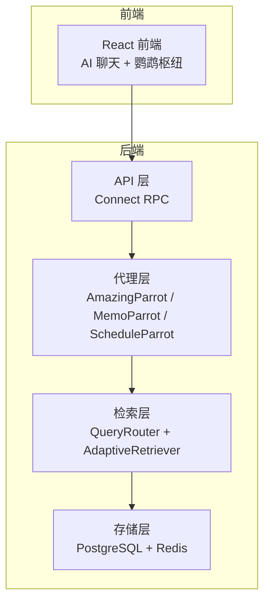
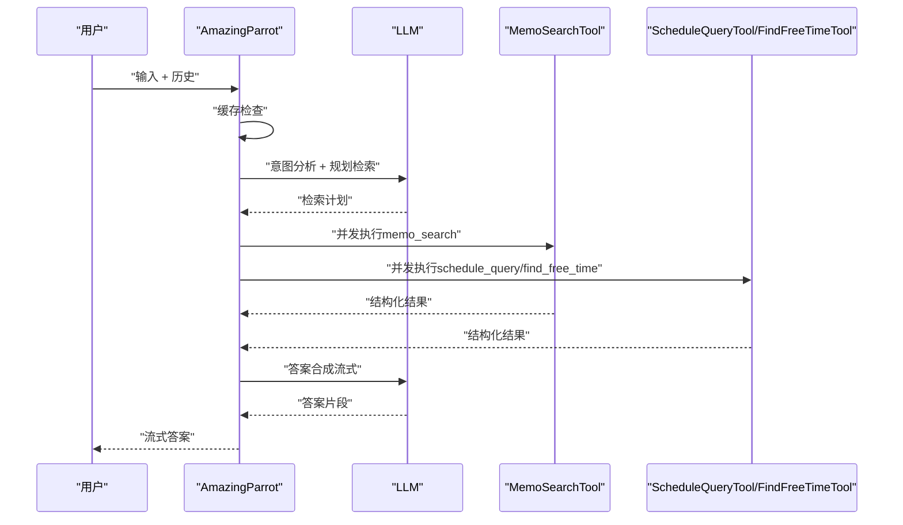
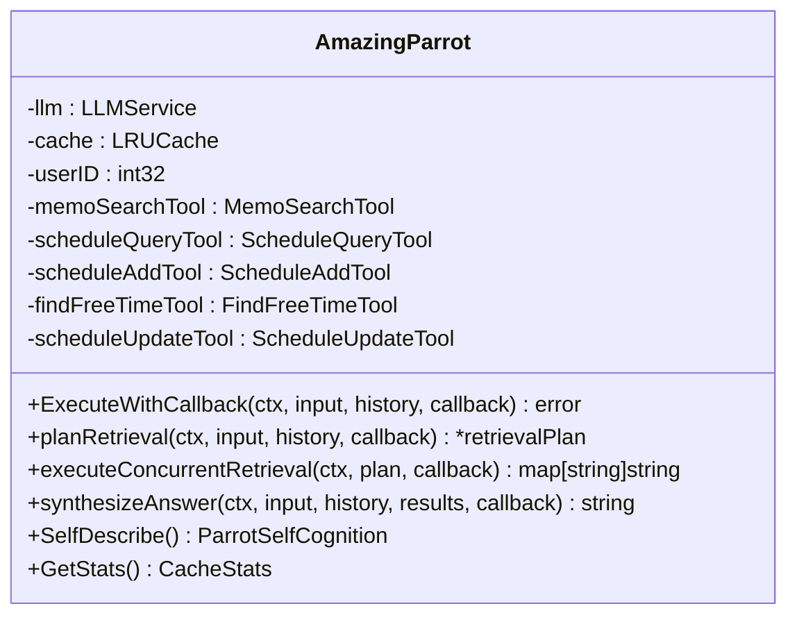
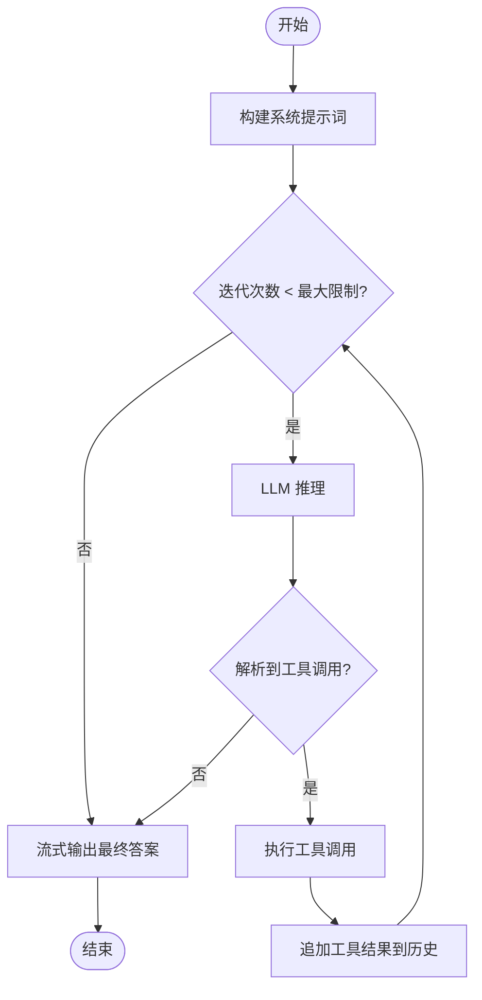
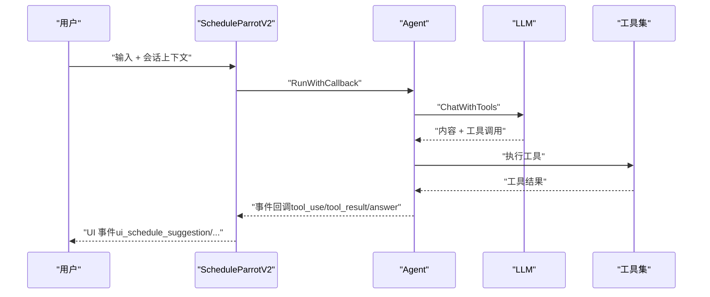
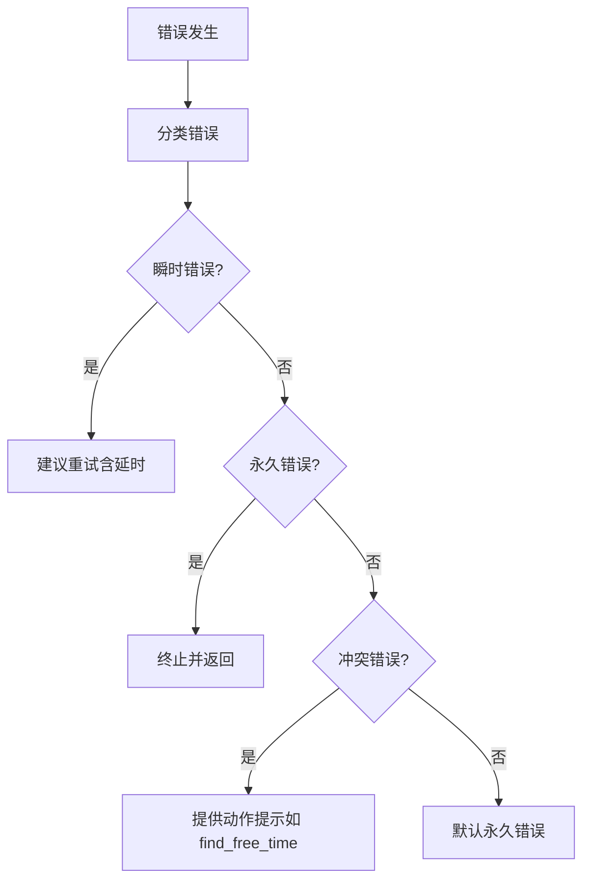
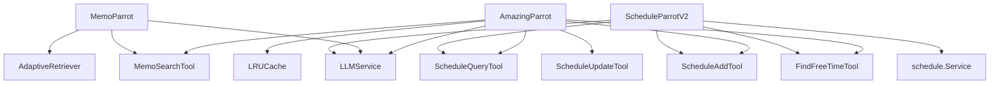

# Amazing Parrot 综合助手代理

<cite>
**本文档引用的文件**
- [amazing_parrot.go](file://plugin/ai/agent/amazing_parrot.go)
- [scheduler_v2.go](file://plugin/ai/agent/scheduler_v2.go)
- [memo_parrot.go](file://plugin/ai/agent/memo_parrot.go)
- [cache.go](file://plugin/ai/agent/cache.go)
- [types.go](file://plugin/ai/agent/types.go)
- [base_tool.go](file://plugin/ai/agent/base_tool.go)
- [tool_adapter.go](file://plugin/ai/agent/tool_adapter.go)
- [util.go](file://plugin/ai/agent/util.go)
- [error_class.go](file://plugin/ai/agent/error_class.go)
- [context.go](file://plugin/ai/agent/context.go)
- [memo_search.go](file://plugin/ai/agent/tools/memo_search.go)
- [scheduler.go](file://plugin/ai/agent/tools/scheduler.go)
- [README.md](file://README.md)
- [SPEC-003-AGENT-AMAZING.md](file://docs/specs/SPEC-003-AGENT-AMAZING.md)
</cite>

## 目录
1. [简介](#简介)
2. [项目结构](#项目结构)
3. [核心组件](#核心组件)
4. [架构总览](#架构总览)
5. [详细组件分析](#详细组件分析)
6. [依赖关系分析](#依赖关系分析)
7. [性能考虑](#性能考虑)
8. [故障排查指南](#故障排查指南)
9. [结论](#结论)
10. [附录](#附录)

## 简介
Amazing Parrot（惊奇）是 Memos 多代理系统中的中枢协调者，负责两阶段并发检索：意图分析阶段与并发执行阶段。它结合笔记检索与日程查询能力，通过 LLM 规划检索计划，使用并发工具调用获取结果，并最终进行答案合成，为用户提供一站式信息助手体验。

## 项目结构
- 后端采用 Go + Echo + Connect RPC 架构，前端使用 React + Vite。
- AI 代理层位于 plugin/ai/agent，包含多代理实现与工具集。
- 查询路由与自适应检索位于 server/queryengine 与 server/retrieval，支撑 RAG 管线。
- 存储层使用 PostgreSQL（生产），Redis 可选作为二级缓存。



图表来源
- [README.md](file://README.md#L157-L198)

章节来源
- [README.md](file://README.md#L1-L365)

## 核心组件
- AmazingParrot：中枢协调者，实现两阶段并发检索与答案合成。
- MemoParrot：笔记检索代理，采用 ReAct 循环与工具调用。
- ScheduleParrotV2：日程管理代理，基于原生 LLM 工具调用框架。
- 工具集：memo_search、schedule_query、schedule_add、find_free_time 等。
- 缓存系统：LRU 缓存，支持 TTL 与命中率统计。
- 错误分类：将错误分为瞬时、永久与冲突三类，指导重试与处理策略。
- 事件与 UI：统一事件类型，支持前端生成式 UI（UI 事件）。

章节来源
- [amazing_parrot.go](file://plugin/ai/agent/amazing_parrot.go#L19-L92)
- [memo_parrot.go](file://plugin/ai/agent/memo_parrot.go#L26-L66)
- [scheduler_v2.go](file://plugin/ai/agent/scheduler_v2.go#L16-L91)
- [cache.go](file://plugin/ai/agent/cache.go#L10-L74)
- [error_class.go](file://plugin/ai/agent/error_class.go#L17-L82)
- [types.go](file://plugin/ai/agent/types.go#L10-L139)

## 架构总览
AmazingParrot 的工作流分为四个阶段：
1. 缓存检查：命中则直接返回，未命中进入规划阶段。
2. 意图分析与检索计划：使用 LLM 生成检索计划（memo_search、schedule_query、find_free_time、direct_answer）。
3. 并发检索执行：按计划并发调用工具，收集结构化结果。
4. 答案合成：将检索结果注入提示词，流式输出最终答案。



图表来源
- [amazing_parrot.go](file://plugin/ai/agent/amazing_parrot.go#L106-L184)
- [amazing_parrot.go](file://plugin/ai/agent/amazing_parrot.go#L186-L225)
- [amazing_parrot.go](file://plugin/ai/agent/amazing_parrot.go#L227-L387)
- [amazing_parrot.go](file://plugin/ai/agent/amazing_parrot.go#L389-L451)

章节来源
- [amazing_parrot.go](file://plugin/ai/agent/amazing_parrot.go#L100-L184)

## 详细组件分析

### AmazingParrot 组件分析
- 结构与职责
  - 持有 LLM、缓存、MemoSearchTool、ScheduleQueryTool、ScheduleAddTool、FindFreeTimeTool、ScheduleUpdateTool。
  - 提供 ExecuteWithCallback、planRetrieval、executeConcurrentRetrieval、synthesizeAnswer、SelfDescribe 等方法。
- 两阶段并发检索
  - 规划阶段：构建系统提示词，附加历史消息，调用 LLM 生成检索计划。
  - 执行阶段：并发调用工具，使用互斥锁保护回调与结果写入，支持 UI 事件（memo_query_result、schedule_query_result）。
  - 合成阶段：将检索结果注入提示词，流式输出最终答案。
- 缓存策略
  - 使用 GenerateCacheKey（SHA256 哈希）避免长输入导致内存问题。
  - 支持 TTL 与命中率统计，便于监控与优化。
- 错误处理
  - 包装 ParrotError，记录阶段与操作。
  - 错误分类（瞬时/永久/冲突），指导重试与处理。



图表来源
- [amazing_parrot.go](file://plugin/ai/agent/amazing_parrot.go#L22-L92)

章节来源
- [amazing_parrot.go](file://plugin/ai/agent/amazing_parrot.go#L19-L92)
- [amazing_parrot.go](file://plugin/ai/agent/amazing_parrot.go#L186-L225)
- [amazing_parrot.go](file://plugin/ai/agent/amazing_parrot.go#L227-L387)
- [amazing_parrot.go](file://plugin/ai/agent/amazing_parrot.go#L389-L451)
- [cache.go](file://plugin/ai/agent/cache.go#L10-L74)
- [types.go](file://plugin/ai/agent/types.go#L334-L342)
- [error_class.go](file://plugin/ai/agent/error_class.go#L214-L231)

### MemoParrot 组件分析
- 工作模式：ReAct 循环（先搜索，后回答），最终答案采用流式输出提升用户体验。
- 工具调用：识别 LLM 输出中的 TOOL/INPUT 标记，调用 memo_search 工具。
- 缓存：独立缓存，支持命中率统计。
- 自我描述：提供元认知自我理解，包含鸟类身份、情感表达、个性与能力等。



图表来源
- [memo_parrot.go](file://plugin/ai/agent/memo_parrot.go#L139-L289)

章节来源
- [memo_parrot.go](file://plugin/ai/agent/memo_parrot.go#L26-L66)
- [memo_parrot.go](file://plugin/ai/agent/memo_parrot.go#L139-L289)
- [memo_parrot.go](file://plugin/ai/agent/memo_parrot.go#L291-L332)

### ScheduleParrotV2 组件分析
- 原生 LLM 工具调用：基于 Agent/ToolWithSchema 框架，无需 LangChainGo 依赖。
- UI 事件：在工具调用过程中注入 UI 事件（如 ui_schedule_suggestion、ui_conflict_resolution），支持生成式 UI。
- 冲突处理：解析工具结果，检测冲突并提供替代时间槽或处理建议。



图表来源
- [scheduler_v2.go](file://plugin/ai/agent/scheduler_v2.go#L175-L196)
- [tool_adapter.go](file://plugin/ai/agent/tool_adapter.go#L129-L207)

章节来源
- [scheduler_v2.go](file://plugin/ai/agent/scheduler_v2.go#L16-L91)
- [scheduler_v2.go](file://plugin/ai/agent/scheduler_v2.go#L175-L196)
- [tool_adapter.go](file://plugin/ai/agent/tool_adapter.go#L79-L117)
- [tool_adapter.go](file://plugin/ai/agent/tool_adapter.go#L129-L207)

### 工具与适配器
- 工具接口：Tool/ToolWithSchema，支持参数 Schema（JSON）。
- 基础工具：BaseTool 提供超时、校验、执行封装。
- 工具适配：NativeTool/ToolFromLegacy 将现有工具适配到新框架。
- 工具集：
  - MemoSearchTool：语义/关键词检索，支持结构化结果。
  - ScheduleQueryTool：按时间范围查询日程，支持结构化结果。
  - ScheduleAddTool：创建日程，内置冲突检测与自动调整。
  - FindFreeTimeTool：查找可用空闲时间（8:00-22:00）。

```mermaid
classDiagram
class Tool {
<<interface>>
+Name() string
+Description() string
+Run(ctx, input) string
}
class ToolWithSchema {
<<interface>>
+Parameters() map[string]interface{}
}
class BaseTool {
-name : string
-description : string
-execute : func
-validate : func
-timeout : time.Duration
+Run(ctx, input) string
}
class NativeTool {
-name : string
-description : string
-execute : func
-params : map[string]interface{}
+Parameters() map[string]interface{}
+Run(ctx, input) string
}
Tool <|.. BaseTool
ToolWithSchema <|.. NativeTool
```

图表来源
- [base_tool.go](file://plugin/ai/agent/base_tool.go#L10-L135)
- [tool_adapter.go](file://plugin/ai/agent/tool_adapter.go#L12-L77)

章节来源
- [base_tool.go](file://plugin/ai/agent/base_tool.go#L10-L135)
- [tool_adapter.go](file://plugin/ai/agent/tool_adapter.go#L12-L77)
- [memo_search.go](file://plugin/ai/agent/tools/memo_search.go#L53-L77)
- [scheduler.go](file://plugin/ai/agent/tools/scheduler.go#L132-L144)

### 缓存与错误分类
- 缓存：LRU + TTL，支持命中/未命中统计，提供 Clear/Size/Stats 等操作。
- 错误分类：瞬时（网络/超时）、永久（校验/权限）、冲突（日程冲突）三类，支持重试延时与动作提示。



图表来源
- [error_class.go](file://plugin/ai/agent/error_class.go#L84-L149)

章节来源
- [cache.go](file://plugin/ai/agent/cache.go#L10-L74)
- [cache.go](file://plugin/ai/agent/cache.go#L178-L197)
- [error_class.go](file://plugin/ai/agent/error_class.go#L17-L82)
- [error_class.go](file://plugin/ai/agent/error_class.go#L214-L231)

## 依赖关系分析
- 组件耦合
  - AmazingParrot 依赖 LLM、缓存、MemoSearchTool、ScheduleQueryTool、ScheduleAddTool、FindFreeTimeTool、ScheduleUpdateTool。
  - MemoParrot 依赖 LLM、AdaptiveRetriever、MemoSearchTool。
  - ScheduleParrotV2 依赖 LLM、ScheduleQueryTool、ScheduleAddTool、FindFreeTimeTool。
- 外部依赖
  - LLMService：提供 Chat/ChatStream/ChatWithTools 等能力。
  - AdaptiveRetriever：提供检索能力（BM25 + 向量 + 重排序）。
  - schedule.Service：提供日程查询/创建/更新/冲突检测。
- 事件与 UI
  - 统一事件类型（thinking/tool_use/tool_result/answer/...），支持 UI 事件（ui_schedule_suggestion/ui_conflict_resolution 等）。



图表来源
- [amazing_parrot.go](file://plugin/ai/agent/amazing_parrot.go#L22-L92)
- [memo_parrot.go](file://plugin/ai/agent/memo_parrot.go#L28-L66)
- [scheduler_v2.go](file://plugin/ai/agent/scheduler_v2.go#L18-L91)

章节来源
- [amazing_parrot.go](file://plugin/ai/agent/amazing_parrot.go#L22-L92)
- [memo_parrot.go](file://plugin/ai/agent/memo_parrot.go#L28-L66)
- [scheduler_v2.go](file://plugin/ai/agent/scheduler_v2.go#L18-L91)

## 性能考虑
- 并发检索：使用 goroutine 并发执行多个工具，显著降低端到端延迟。
- 缓存优化：两层缓存（应用层 LRU + 可选 Redis），命中率高时可减少 LLM 与数据库压力。
- 流式输出：最终答案采用流式输出，提升用户体验。
- 超时与重试：工具层与代理层均设置超时，错误分类指导重试策略。
- 查询路由：QueryRouter 基于意图选择最优检索策略，减少无关计算。

## 故障排查指南
- 常见错误类型
  - 瞬时错误：网络波动、服务不可达、超时。建议短暂延时后重试。
  - 永久错误：输入校验失败、权限不足、资源不存在。需修正输入或权限。
  - 冲突错误：日程冲突。建议使用 find_free_time 或调整时间。
- 排查步骤
  - 检查缓存命中情况（GetStats）与缓存键（GenerateCacheKey）。
  - 查看事件回调（thinking/tool_use/tool_result/answer）定位问题阶段。
  - 分析 LLM 响应与工具调用是否符合预期。
  - 检查数据库连接、索引与检索策略配置。
- 相关实现参考
  - 错误分类与重试：ClassifyError/ShouldRetry/GetRetryDelay/GetActionHint。
  - 缓存统计：LRUCache.Stats。
  - 事件常量：EventType*。

章节来源
- [error_class.go](file://plugin/ai/agent/error_class.go#L84-L149)
- [error_class.go](file://plugin/ai/agent/error_class.go#L214-L231)
- [cache.go](file://plugin/ai/agent/cache.go#L178-L197)
- [types.go](file://plugin/ai/agent/types.go#L117-L139)

## 结论
Amazing Parrot 通过“意图分析 + 并发执行 + 答案合成”的两阶段架构，实现了笔记与日程的跨域协同检索。配合完善的缓存、错误分类与 UI 事件体系，为用户提供了高效、稳定且体验友好的综合信息助手。后续可进一步引入 Reranker 与更精细的路由策略，持续优化检索精度与响应速度。

## 附录

### 使用示例与配置选项
- 使用示例
  - 直接问答：输入“今天有空吗”，代理将自动规划并查询日程。
  - 笔记检索：输入“Python 笔记”，代理将并发检索并合成答案。
  - 混合查询：输入“查找项目相关笔记并查看下周会议”，代理将并行执行两类检索。
- 配置选项
  - 缓存大小与 TTL：可通过构造函数参数调整（默认 100 条，5 分钟）。
  - 工具超时：工具层默认 30 秒，可根据场景调整。
  - 事件回调：支持实时进度反馈与 UI 事件推送。
  - 自我描述：SelfDescribe 提供元认知信息，便于前端展示与交互。

章节来源
- [SPEC-003-AGENT-AMAZING.md](file://docs/specs/SPEC-003-AGENT-AMAZING.md#L1-L100)
- [README.md](file://README.md#L47-L106)
- [amazing_parrot.go](file://plugin/ai/agent/amazing_parrot.go#L49-L92)
- [cache.go](file://plugin/ai/agent/cache.go#L52-L74)
- [base_tool.go](file://plugin/ai/agent/base_tool.go#L38-L53)
- [types.go](file://plugin/ai/agent/types.go#L117-L139)