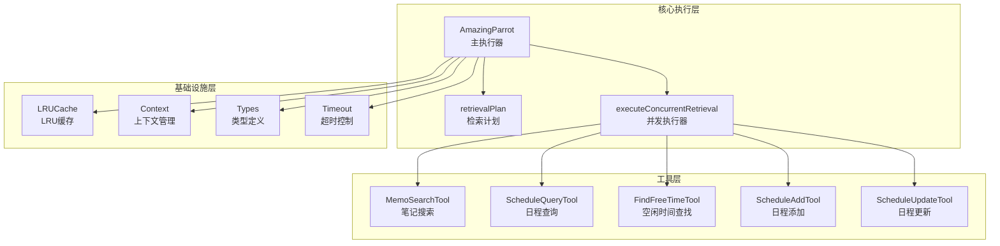
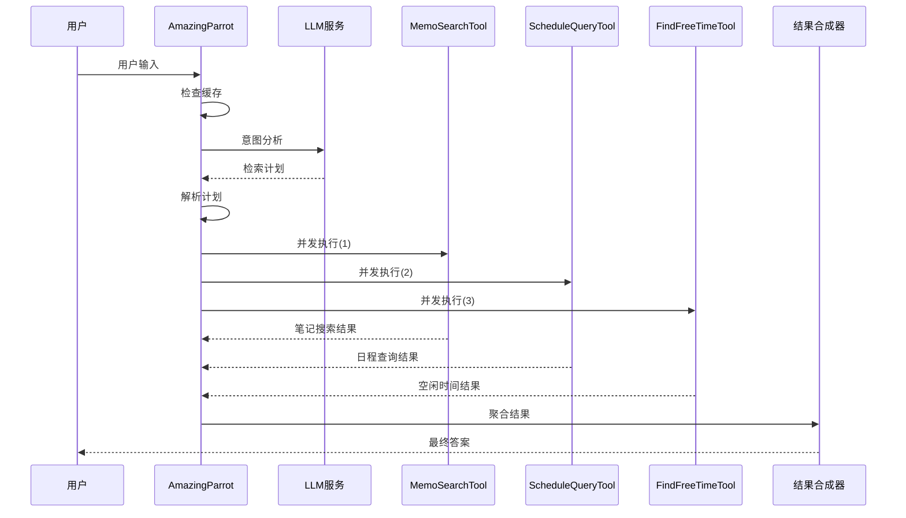
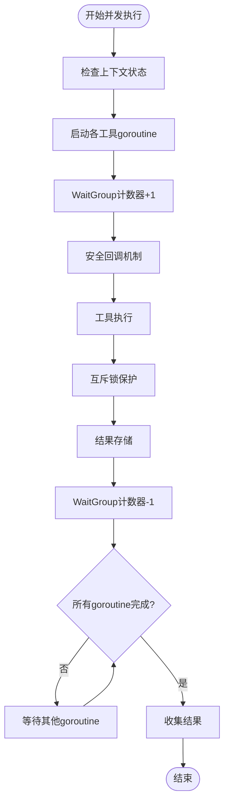
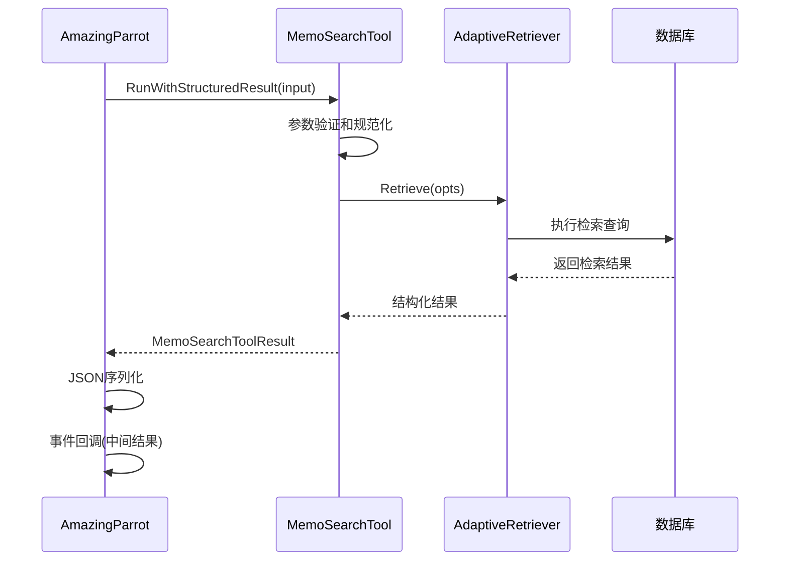
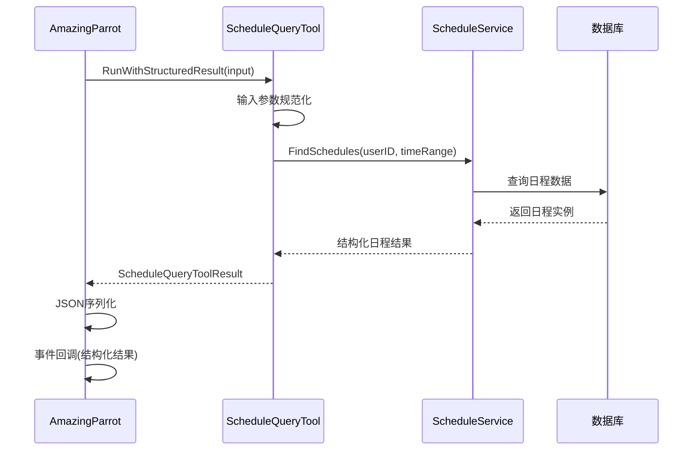
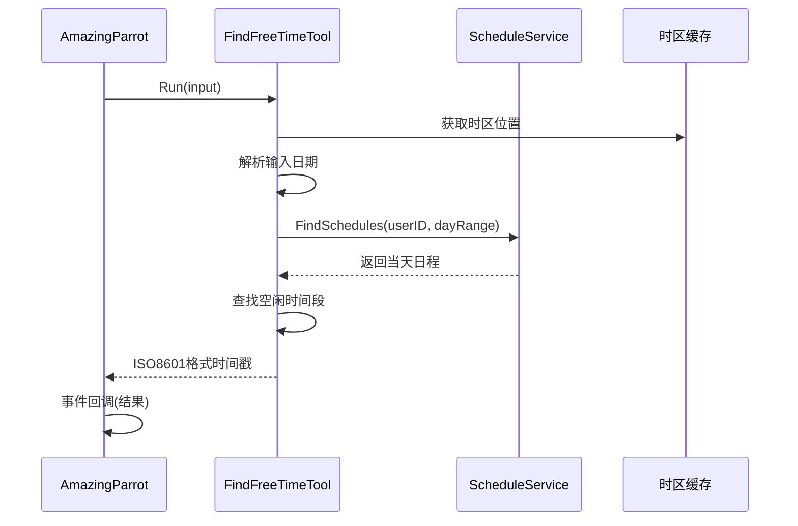
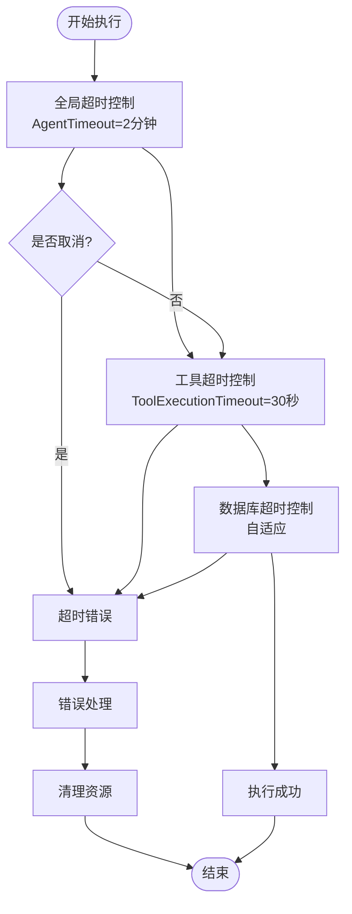
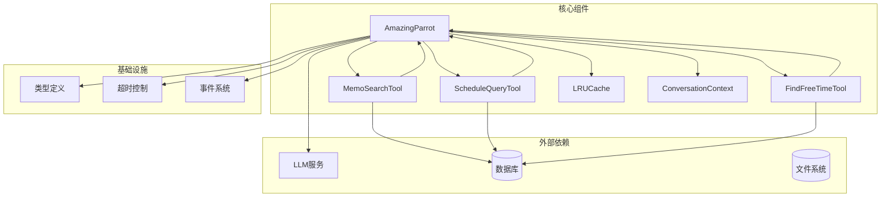
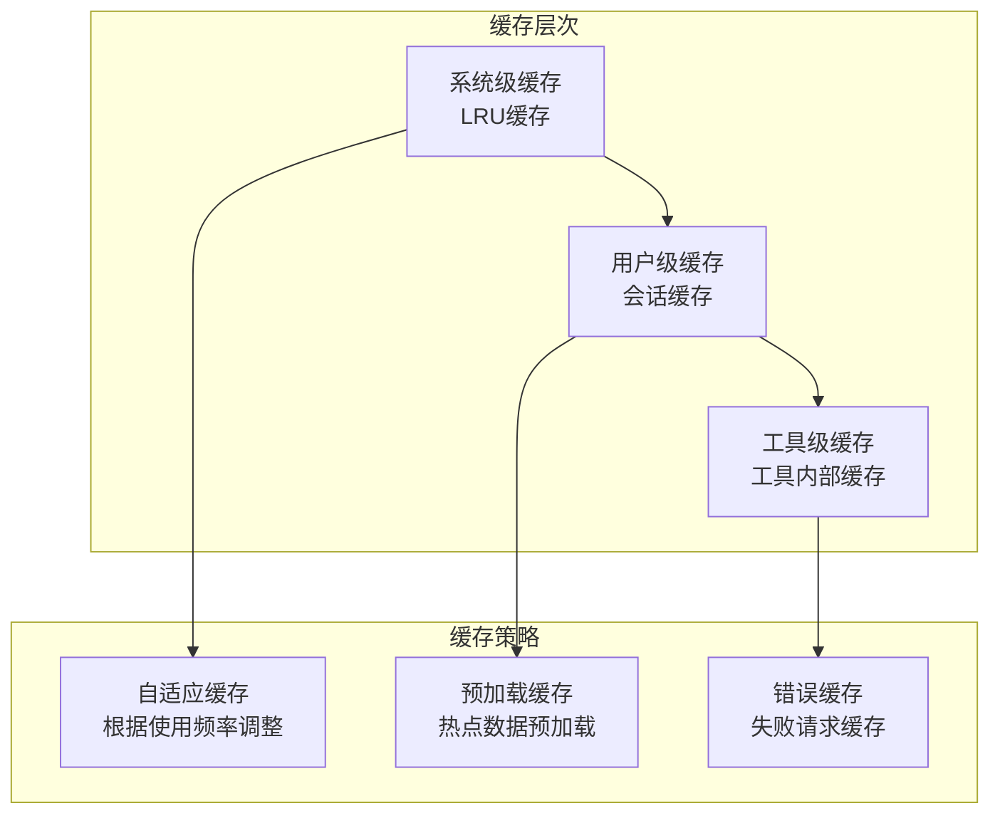

# 并发检索执行

<cite>
**本文档引用的文件**
- [amazing_parrot.go](file://plugin/ai/agent/amazing_parrot.go)
- [memo_search.go](file://plugin/ai/agent/tools/memo_search.go)
- [scheduler.go](file://plugin/ai/agent/tools/scheduler.go)
- [cache.go](file://plugin/ai/agent/cache.go)
- [types.go](file://plugin/ai/agent/types.go)
- [context.go](file://plugin/ai/agent/context.go)
- [timeout.go](file://plugin/ai/timeout/timeout.go)
- [scheduler_v2.go](file://plugin/ai/agent/scheduler_v2.go)
</cite>

## 目录
1. [简介](#简介)
2. [项目结构](#项目结构)
3. [核心组件](#核心组件)
4. [架构概览](#架构概览)
5. [详细组件分析](#详细组件分析)
6. [依赖关系分析](#依赖关系分析)
7. [性能考虑](#性能考虑)
8. [故障排除指南](#故障排除指南)
9. [结论](#结论)

## 简介

Amazing Parrot 是 Memos AI 系统中的综合助手鹦鹉，采用两阶段并发检索执行机制，能够在同一轮对话中同时执行多个工具调用，显著提升响应速度和用户体验。该系统通过 goroutine 管理、工具调用协调、结果聚合和错误处理策略，实现了高效的并发检索执行。

## 项目结构

Amazing Parrot 并发检索执行涉及以下关键模块：



**图表来源**
- [amazing_parrot.go](file://plugin/ai/agent/amazing_parrot.go#L19-L92)
- [memo_search.go](file://plugin/ai/agent/tools/memo_search.go#L53-L77)
- [scheduler.go](file://plugin/ai/agent/tools/scheduler.go#L132-L144)

**章节来源**
- [amazing_parrot.go](file://plugin/ai/agent/amazing_parrot.go#L1-L666)
- [types.go](file://plugin/ai/agent/types.go#L1-L353)

## 核心组件

### AmazingParrot 主执行器

AmazingParrot 是整个并发检索系统的中枢控制器，负责：

- **意图分析与计划制定**：使用 LLM 分析用户输入，生成并发检索计划
- **并发执行协调**：管理多个 goroutine 的生命周期和同步
- **结果聚合与合成**：将各工具的检索结果进行整合，生成最终答案
- **事件流式传输**：实时向前端推送执行进度和中间结果

### 工具调用协调器

系统包含五个核心工具，每个工具都经过精心设计以支持并发执行：

- **MemoSearchTool**：语义和关键词混合搜索笔记
- **ScheduleQueryTool**：查询指定时间范围内的日程
- **FindFreeTimeTool**：查找特定日期的空闲时间段
- **ScheduleAddTool**：创建新的日程事件
- **ScheduleUpdateTool**：更新现有的日程事件

### 缓存与上下文管理

系统采用多层缓存策略和上下文管理机制：

- **LRU缓存**：存储执行结果，避免重复计算
- **会话上下文**：维护多轮对话的状态信息
- **超时控制**：确保长时间运行的任务能够及时取消

**章节来源**
- [amazing_parrot.go](file://plugin/ai/agent/amazing_parrot.go#L22-L91)
- [cache.go](file://plugin/ai/agent/cache.go#L10-L74)
- [context.go](file://plugin/ai/agent/context.go#L19-L73)

## 架构概览

Amazing Parrot 采用两阶段并发执行架构：



**图表来源**
- [amazing_parrot.go](file://plugin/ai/agent/amazing_parrot.go#L106-L184)
- [amazing_parrot.go](file://plugin/ai/agent/amazing_parrot.go#L228-L387)

## 详细组件分析

### 并发执行核心机制

#### goroutine 管理策略

AmazingParrot 采用 WaitGroup 和互斥锁相结合的方式管理并发执行：



**图表来源**
- [amazing_parrot.go](file://plugin/ai/agent/amazing_parrot.go#L228-L387)

#### 线程安全的回调机制

系统实现了双重保护的回调机制：

1. **goroutine内回调保护**：每个 goroutine 内部使用互斥锁保护回调调用
2. **外部回调保护**：主线程使用全局互斥锁保护回调调用

这种设计确保了：
- 避免回调调用的竞态条件
- 保证事件按顺序正确传递
- 支持结构化事件数据的并发访问

#### 结果聚合策略

系统采用分层结果聚合策略：

1. **原始结果存储**：每个工具的原始结果存储在共享 map 中
2. **结构化结果转换**：将原始结果转换为结构化数据格式
3. **事件流式传输**：通过回调机制实时传输中间结果
4. **最终合成**：将所有结果传递给 LLM 进行最终合成

**章节来源**
- [amazing_parrot.go](file://plugin/ai/agent/amazing_parrot.go#L228-L387)

### 工具调用协调机制

#### memo_search 并发执行

memo_search 工具的并发执行过程：



**图表来源**
- [amazing_parrot.go](file://plugin/ai/agent/amazing_parrot.go#L250-L299)
- [memo_search.go](file://plugin/ai/agent/tools/memo_search.go#L212-L282)

#### schedule_query 并发执行

schedule_query 工具的并发执行过程：



**图表来源**
- [amazing_parrot.go](file://plugin/ai/agent/amazing_parrot.go#L302-L357)
- [scheduler.go](file://plugin/ai/agent/tools/scheduler.go#L308-L387)

#### find_free_time 并发执行

find_free_time 工具的并发执行过程：



**图表来源**
- [amazing_parrot.go](file://plugin/ai/agent/amazing_parrot.go#L360-L382)
- [scheduler.go](file://plugin/ai/agent/tools/scheduler.go#L753-L836)

### 结果缓存与事件流式传输

#### LRU缓存机制

系统采用 LRU（最近最少使用）缓存策略：

```mermaid
classDiagram
class LRUCache {
+int maxEntries
+time.Duration ttl
+map[string]*list.Element entries
+list lruList
+sync.RWMutex mutex
+int64 hits
+int64 misses
+Get(key) (interface{}, bool)
+Set(key, value) void
+Delete(key) void
+Clear() void
+Size() int
+Stats() CacheStats
}
class cacheEntry {
+string key
+interface{} value
+time.Time expiration
}
class CacheStats {
+int size
+int maxEntries
+int64 hits
+int64 misses
+float64 hitRate
}
LRUCache --> cacheEntry : "使用"
LRUCache --> CacheStats : "返回"
```

**图表来源**
- [cache.go](file://plugin/ai/agent/cache.go#L10-L74)
- [cache.go](file://plugin/ai/agent/cache.go#L24-L50)

#### 事件流式传输

系统支持多种事件类型的流式传输：

| 事件类型 | 触发时机 | 数据内容 | 用途 |
|---------|---------|---------|------|
| thinking | 意图分析阶段 | "正在分析您的需求..." | 显示思考状态 |
| tool_use | 工具调用开始 | "正在搜索笔记/查询日程..." | 显示工具使用状态 |
| tool_result | 工具调用完成 | 工具执行结果 | 显示中间结果 |
| memo_query_result | 笔记查询完成 | 结构化笔记结果 | Generative UI |
| schedule_query_result | 日程查询完成 | 结构化日程结果 | Generative UI |

**章节来源**
- [types.go](file://plugin/ai/agent/types.go#L117-L139)
- [amazing_parrot.go](file://plugin/ai/agent/amazing_parrot.go#L240-L298)

### 错误处理策略

#### 分层错误处理

系统采用分层错误处理策略：

1. **工具级错误处理**：每个工具独立处理自身错误
2. **并发级错误处理**：goroutine 内部捕获和处理错误
3. **系统级错误处理**：主执行器统一处理和上报错误

#### 超时控制机制

系统实现多层次的超时控制：



**图表来源**
- [amazing_parrot.go](file://plugin/ai/agent/amazing_parrot.go#L112-L114)
- [timeout.go](file://plugin/ai/timeout/timeout.go#L9-L35)

**章节来源**
- [amazing_parrot.go](file://plugin/ai/agent/amazing_parrot.go#L141-L172)
- [timeout.go](file://plugin/ai/timeout/timeout.go#L9-L35)

## 依赖关系分析

### 组件耦合关系



**图表来源**
- [amazing_parrot.go](file://plugin/ai/agent/amazing_parrot.go#L3-L17)
- [memo_search.go](file://plugin/ai/agent/tools/memo_search.go#L3-L11)
- [scheduler.go](file://plugin/ai/agent/tools/scheduler.go#L3-L14)

### 数据流分析

系统的数据流遵循以下模式：

1. **输入流**：用户输入 → LLM意图分析 → 检索计划
2. **执行流**：检索计划 → 并发工具执行 → 结果聚合
3. **输出流**：最终合成 → 缓存存储 → 事件传输

**章节来源**
- [amazing_parrot.go](file://plugin/ai/agent/amazing_parrot.go#L186-L225)
- [amazing_parrot.go](file://plugin/ai/agent/amazing_parrot.go#L389-L451)

## 性能考虑

### 并发执行优化策略

#### 资源管理机制

1. **goroutine池化**：使用 WaitGroup 管理 goroutine 生命周期
2. **内存池化**：复用字符串构建器，减少内存分配
3. **连接池化**：数据库连接复用，避免频繁建立连接

#### 性能监控指标

系统内置多种性能监控指标：

- **缓存命中率**：衡量缓存效率
- **执行时间分布**：分析各阶段耗时
- **并发度统计**：监控同时执行的工具数量
- **错误率统计**：跟踪系统稳定性

#### 资源限制策略

1. **最大并发数限制**：控制同时执行的工具数量
2. **内存使用限制**：防止内存泄漏和过度使用
3. **CPU使用限制**：避免过度消耗系统资源

### 缓存优化策略

#### 多级缓存架构



**图表来源**
- [cache.go](file://plugin/ai/agent/cache.go#L10-L74)

#### 缓存失效策略

1. **TTL失效**：基于时间的缓存失效
2. **容量淘汰**：基于LRU的容量淘汰
3. **手动失效**：基于业务逻辑的手动失效

**章节来源**
- [cache.go](file://plugin/ai/agent/cache.go#L178-L197)
- [context.go](file://plugin/ai/agent/context.go#L404-L463)

## 故障排除指南

### 常见问题诊断

#### 并发执行问题

**问题症状**：工具执行异常、结果丢失、内存泄漏

**诊断步骤**：
1. 检查 goroutine 数量是否超出预期
2. 验证互斥锁使用是否正确
3. 确认 WaitGroup 计数是否平衡
4. 检查回调函数是否阻塞

**解决方案**：
- 使用 race detector 检测数据竞争
- 确保所有 goroutine 都正确调用 Done()
- 验证回调函数的线程安全性

#### 缓存相关问题

**问题症状**：缓存命中率低、内存使用过高、缓存失效异常

**诊断步骤**：
1. 检查缓存键生成是否合理
2. 验证缓存大小配置
3. 监控缓存淘汰策略
4. 检查缓存过期时间设置

**解决方案**：
- 优化缓存键生成算法
- 调整缓存大小和TTL参数
- 实施更精确的缓存失效策略

#### 超时相关问题

**问题症状**：任务执行超时、资源泄露、系统不稳定

**诊断步骤**：
1. 检查全局超时配置
2. 验证工具超时设置
3. 监控数据库查询超时
4. 检查网络请求超时

**解决方案**：
- 调整超时参数以适应实际负载
- 实施渐进式超时策略
- 添加超时重试机制

### 调试工具和技巧

#### 日志记录策略

系统采用结构化日志记录：

```go
slog.Info("AmazingParrot: ExecuteWithCallback started",
    "user_id", p.userID,
    "input", truncateString(userInput, 100),
    "history_count", len(history),
)
```

#### 性能分析工具

推荐使用以下工具进行性能分析：
- **pprof**：CPU和内存性能分析
- **race detector**：并发数据竞争检测
- **heap profiler**：内存使用情况分析

**章节来源**
- [amazing_parrot.go](file://plugin/ai/agent/amazing_parrot.go#L119-L123)
- [util.go](file://plugin/ai/agent/util.go#L3-L13)

## 结论

Amazing Parrot 的并发检索执行机制通过精心设计的架构和优化策略，实现了高效、可靠、可扩展的多工具并发执行。其核心优势包括：

1. **高效的并发执行**：通过 goroutine 并行执行多个工具，显著提升响应速度
2. **完善的错误处理**：多层次的错误处理和超时控制机制
3. **智能缓存策略**：多级缓存架构确保系统性能稳定
4. **实时事件传输**：支持丰富的事件类型和流式传输
5. **可扩展的架构**：模块化设计便于功能扩展和维护

该系统为 Memos AI 生态系统提供了强大的并发检索能力，为用户提供流畅的智能交互体验。通过持续的性能优化和功能增强，Amazing Parrot 将成为企业级 AI 应用的优秀参考实现。