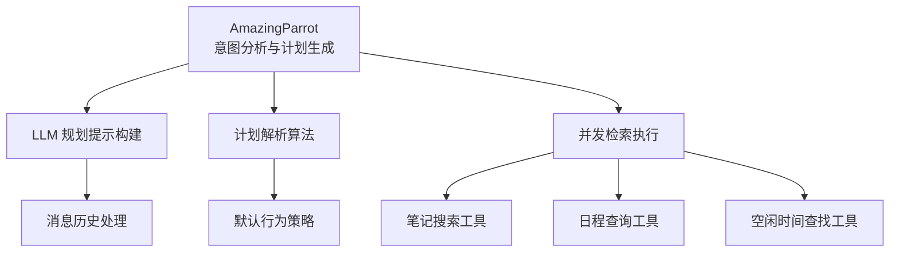
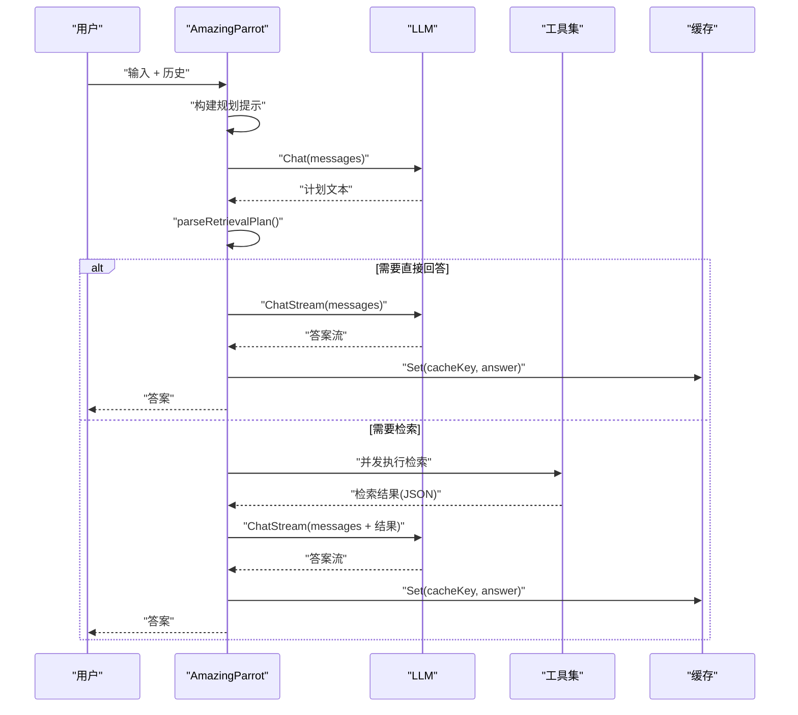
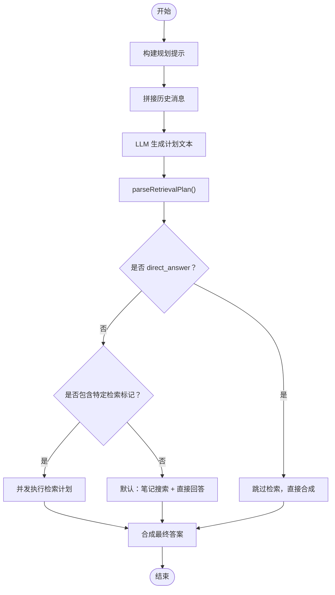
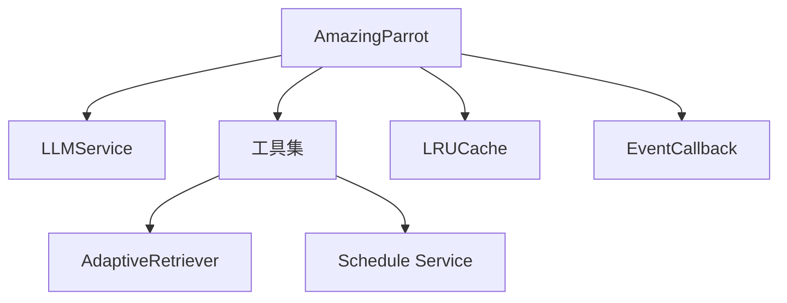

# 意图分析阶段

<cite>
**本文引用的文件**
- [amazing_parrot.go](file://plugin/ai/agent/amazing_parrot.go)
- [types.go](file://plugin/ai/agent/types.go)
- [context.go](file://plugin/ai/agent/context.go)
- [cache.go](file://plugin/ai/agent/cache.go)
- [util.go](file://plugin/ai/agent/util.go)
- [base_tool.go](file://plugin/ai/agent/base_tool.go)
- [tool_adapter.go](file://plugin/ai/agent/tool_adapter.go)
- [memo_search.go](file://plugin/ai/agent/tools/memo_search.go)
- [scheduler.go](file://plugin/ai/agent/tools/scheduler.go)
- [scheduler_test.go](file://plugin/ai/agent/tools/scheduler_test.go)
- [INTENT_DETECTION_OPTIMIZATION.md](file://docs/archived/cleanup_20260123/chat_audit_fixes/specs/INTENT_DETECTION_OPTIMIZATION.md)
- [PERFECT_UNIFIED_SEARCH.md](file://docs/archived/PERFECT_UNIFIED_SEARCH.md)
- [MEMOS_OPTIMAL_RAG_SOLUTION.md](file://docs/archived/cleanup_20260123/optimal_rag/MEMOS_OPTIMAL_RAG_SOLUTION.md)
</cite>

## 目录
1. [简介](#简介)
2. [项目结构](#项目结构)
3. [核心组件](#核心组件)
4. [架构总览](#架构总览)
5. [详细组件分析](#详细组件分析)
6. [依赖关系分析](#依赖关系分析)
7. [性能考量](#性能考量)
8. [故障排查指南](#故障排查指南)
9. [结论](#结论)
10. [附录](#附录)

## 简介
本文件聚焦于 Amazing Parrot 意图分析阶段，即两阶段并发检索的第一阶段：意图分析与检索计划生成。该阶段通过 LLM 对用户输入进行意图识别，输出并发检索计划，决定是否需要执行笔记搜索、日程查询、空闲时间查找等检索动作，并在必要时直接给出答案。文档将深入解释 LLM 规划提示构建、消息历史处理、计划解析算法与默认行为策略，并结合具体示例说明不同检索需求的识别方法。

## 项目结构
Amazing Parrot 的意图分析位于 agent 子模块中，围绕以下关键文件展开：
- 意图分析与计划生成：amazing_parrot.go
- 类型与事件回调：types.go
- 会话上下文与历史：context.go
- 缓存与统计：cache.go
- 工具基类与适配：base_tool.go、tool_adapter.go
- 检索工具实现：memo_search.go、scheduler.go
- 测试与文档参考：scheduler_test.go、INTENT_DETECTION_OPTIMIZATION.md、PERFECT_UNIFIED_SEARCH.md、MEMOS_OPTIMAL_RAG_SOLUTION.md

图表来源
- [amazing_parrot.go](file://plugin/ai/agent/amazing_parrot.go#L186-L225)
- [memo_search.go](file://plugin/ai/agent/tools/memo_search.go#L53-L77)
- [scheduler.go](file://plugin/ai/agent/tools/scheduler.go#L132-L144)

章节来源
- [amazing_parrot.go](file://plugin/ai/agent/amazing_parrot.go#L100-L184)
- [types.go](file://plugin/ai/agent/types.go#L107-L139)

## 核心组件
- AmazingParrot：负责两阶段并发检索的意图分析与计划生成，封装 LLM 规划、历史消息拼接、计划解析、并发检索与最终合成。
- retrievalPlan：检索计划的数据结构，包含是否需要执行各类检索以及对应的参数。
- EventCallback：事件回调机制，用于实时反馈“思考”、“工具使用”、“工具结果”、“答案”等事件。
- 工具层：MemoSearchTool、ScheduleQueryTool、FindFreeTimeTool 等，提供结构化输入与输出，便于 LLM 解析与后续合成。
- 缓存：LRUCache，对意图分析与检索结果进行缓存，提升重复查询性能。
- 会话上下文：ConversationContext，维护多轮对话的历史与工作状态，辅助意图理解与细化。

章节来源
- [amazing_parrot.go](file://plugin/ai/agent/amazing_parrot.go#L22-L47)
- [types.go](file://plugin/ai/agent/types.go#L107-L139)
- [cache.go](file://plugin/ai/agent/cache.go#L10-L50)
- [context.go](file://plugin/ai/agent/context.go#L19-L73)

## 架构总览
AmazingParrot 的意图分析阶段采用“LLM 规划 + 结构化解析 + 并发执行”的模式。其核心流程如下：
- 输入：用户输入 + 历史消息
- 步骤：
  1) 构建规划提示（含时间戳、指令格式、示例）
  2) 拼接历史消息（仅非空消息）
  3) LLM 生成计划文本
  4) 解析计划文本为结构化 retrievalPlan
  5) 若计划标记为直接回答，则跳过检索，直接进入合成阶段
  6) 否则并发执行计划中的检索任务
  7) 合成最终答案并缓存

图表来源
- [amazing_parrot.go](file://plugin/ai/agent/amazing_parrot.go#L186-L225)
- [amazing_parrot.go](file://plugin/ai/agent/amazing_parrot.go#L227-L387)
- [amazing_parrot.go](file://plugin/ai/agent/amazing_parrot.go#L389-L451)

章节来源
- [amazing_parrot.go](file://plugin/ai/agent/amazing_parrot.go#L100-L184)

## 详细组件分析

### 意图分析与检索计划生成
- 角色职责
  - 构建规划提示：包含时间戳、指令格式、示例，强调“PLAN:”标记与“direct_answer”标记，确保 LLM 输出结构化计划。
  - 消息历史处理：按“用户-助手”交替顺序拼接历史，过滤空消息，避免冗余上下文。
  - 计划解析：逐行扫描，识别 PLAN 标记与 direct_answer；解析 memo_search、schedule_query、find_free_time 等字段；若无特定标记，默认执行笔记搜索并将完整响应作为查询词。
  - 默认行为策略：当无法识别明确检索需求时，回退到“笔记搜索 + 直接回答”组合，保证可用性与鲁棒性。

图表来源
- [amazing_parrot.go](file://plugin/ai/agent/amazing_parrot.go#L511-L535)
- [amazing_parrot.go](file://plugin/ai/agent/amazing_parrot.go#L196-L224)
- [amazing_parrot.go](file://plugin/ai/agent/amazing_parrot.go#L453-L509)

章节来源
- [amazing_parrot.go](file://plugin/ai/agent/amazing_parrot.go#L186-L225)
- [amazing_parrot.go](file://plugin/ai/agent/amazing_parrot.go#L453-L509)

### LLM 规划提示构建
- 提示目标：引导 LLM 以“PLAN:”开头的结构化输出，包含检索类型与参数，例如：
  - memo_search: 关键词
  - schedule_query: today/tomorrow
  - find_free_time: YYYY-MM-DD
  - direct_answer
- 示例与约束：提供示例与格式要求，减少歧义，提高解析成功率。
- 时间戳注入：在提示中注入当前时间，帮助 LLM 生成相对时间（如 today/tomorrow）。

章节来源
- [amazing_parrot.go](file://plugin/ai/agent/amazing_parrot.go#L511-L535)

### 消息历史处理
- 历史拼接：按“用户-助手”交替顺序追加，仅保留非空消息，避免噪声。
- 合成阶段复用：在最终合成时同样拼接历史，保持上下文一致性。

章节来源
- [amazing_parrot.go](file://plugin/ai/agent/amazing_parrot.go#L196-L214)
- [amazing_parrot.go](file://plugin/ai/agent/amazing_parrot.go#L398-L412)

### 计划解析算法
- 标记识别：扫描输出行，识别 PLAN: 与 direct_answer 标记，优先直接回答。
- 字段解析：
  - memo_search：提取冒号后的关键词作为查询词。
  - schedule_query：若出现则默认今日时间范围（开始/结束时间），便于后续工具执行。
  - find_free_time：提取日期，若缺失则使用当日日期。
- 默认策略：若未识别到任何标记，则默认执行笔记搜索，并将完整响应作为查询词，确保至少有一次检索。

章节来源
- [amazing_parrot.go](file://plugin/ai/agent/amazing_parrot.go#L453-L509)

### 默认行为策略
- 当无法识别明确检索需求时，系统默认：
  - 执行笔记搜索（memo_search）
  - 将 LLM 响应作为查询词
  - 若仍无结果，直接回答“未找到相关内容”
- 这种策略保证在复杂或模糊输入下仍能提供有用反馈。

章节来源
- [amazing_parrot.go](file://plugin/ai/agent/amazing_parrot.go#L502-L509)

### 检索计划数据结构
retrievalPlan 包含以下字段：
- needsMemoSearch / memoSearchQuery
- needsScheduleQuery / scheduleStartTime / scheduleEndTime
- needsFreeTime / freeTimeDate
- needsDirectAnswer

章节来源
- [amazing_parrot.go](file://plugin/ai/agent/amazing_parrot.go#L33-L47)

### 并发检索执行（与计划生成衔接）
虽然并发执行发生在第二阶段，但其输入完全来自第一阶段的计划解析结果。各工具的输入格式与校验逻辑如下：
- 笔记搜索：memo_search，支持 query、limit、min_score、strategy 等字段。
- 日程查询：schedule_query，必须提供 start_time 与 end_time。
- 空闲时间：find_free_time，提供 date（YYYY-MM-DD）。

章节来源
- [memo_search.go](file://plugin/ai/agent/tools/memo_search.go#L100-L107)
- [scheduler.go](file://plugin/ai/agent/tools/scheduler.go#L165-L181)
- [scheduler.go](file://plugin/ai/agent/tools/scheduler.go#L737-L750)

### 事件回调与 UI 交互
- 事件类型：thinking、tool_use、tool_result、answer、error、memo_query_result、schedule_query_result、schedule_updated、ui_schedule_suggestion、ui_time_slot_picker、ui_conflict_resolution、ui_quick_actions。
- 回调机制：在计划阶段发送“thinking”，在检索阶段发送“tool_use”与“tool_result”，在合成阶段流式发送“answer”。

章节来源
- [types.go](file://plugin/ai/agent/types.go#L117-L139)

### 缓存与统计
- 缓存键：使用 agent 名称、用户 ID 与输入的哈希值，避免长输入导致内存问题。
- 统计：命中数、未命中数、命中率，便于评估缓存效果。

章节来源
- [cache.go](file://plugin/ai/agent/cache.go#L324-L352)
- [types.go](file://plugin/ai/agent/types.go#L334-L342)

### 工具基类与适配
- BaseTool：提供统一的执行框架（校验、超时、结果校验）。
- ToolWithSchema/NativeTool：为新框架提供工具参数 Schema，便于 LLM 工具调用。
- 适配现有工具：通过 ToolFromLegacy 将既有工具（如 ScheduleQueryTool）适配到新框架。

章节来源
- [base_tool.go](file://plugin/ai/agent/base_tool.go#L10-L22)
- [tool_adapter.go](file://plugin/ai/agent/tool_adapter.go#L12-L19)
- [tool_adapter.go](file://plugin/ai/agent/tool_adapter.go#L64-L77)

## 依赖关系分析
- AmazingParrot 依赖 LLM 服务进行规划与合成，依赖工具集执行检索，依赖缓存提升性能。
- 工具层依赖检索器与日程服务，提供结构化输入/输出。
- 事件回调贯穿整个流程，用于前端 UI 的实时反馈。

图表来源
- [amazing_parrot.go](file://plugin/ai/agent/amazing_parrot.go#L22-L91)
- [memo_search.go](file://plugin/ai/agent/tools/memo_search.go#L53-L77)
- [scheduler.go](file://plugin/ai/agent/tools/scheduler.go#L132-L144)

章节来源
- [amazing_parrot.go](file://plugin/ai/agent/amazing_parrot.go#L22-L91)

## 性能考量
- LLM 规划提示最小化：通过精简提示与示例，降低 token 消耗，缩短响应时间。
- 缓存策略：对意图分析与检索结果进行缓存，显著降低重复查询成本。
- 并发执行：在第二阶段并发检索，充分利用工具并行能力。
- 输入校验与超时：工具层内置超时与输入校验，避免异常输入导致长时间阻塞。

## 故障排查指南
- LLM 规划失败
  - 现象：planRetrieval 报错
  - 排查：检查提示构建是否正确、历史消息是否为空、网络与模型服务是否可用
- 计划解析异常
  - 现象：parseRetrievalPlan 未识别到任何标记
  - 排查：确认 LLM 输出是否遵循“PLAN:”格式；必要时增加示例与约束
- 工具执行失败
  - 现象：工具返回错误或空结果
  - 排查：核对输入 JSON 格式、字段命名（驼峰/蛇形兼容）、时间格式与时区
- 缓存命中率低
  - 现象：命中率偏低
  - 排查：检查缓存键生成逻辑、TTL 设置、输入长度与哈希截断策略

章节来源
- [amazing_parrot.go](file://plugin/ai/agent/amazing_parrot.go#L141-L144)
- [amazing_parrot.go](file://plugin/ai/agent/amazing_parrot.go#L216-L219)
- [memo_search.go](file://plugin/ai/agent/tools/memo_search.go#L30-L51)
- [scheduler.go](file://plugin/ai/agent/tools/scheduler.go#L105-L130)

## 结论
Amazing Parrot 的意图分析阶段通过“结构化提示 + 简洁解析 + 默认回退”的策略，实现了对用户输入的高效意图识别与检索计划生成。其设计兼顾准确性与鲁棒性：在明确意图下精确规划，在模糊意图下也能提供合理默认行为。配合并发检索与流式合成，整体用户体验流畅且响应迅速。

## 附录

### 提示工程示例（路径引用）
- 规划提示模板与示例：[amazing_parrot.go](file://plugin/ai/agent/amazing_parrot.go#L511-L535)
- 计划解析规则与默认策略：[amazing_parrot.go](file://plugin/ai/agent/amazing_parrot.go#L453-L509)

### 检索需求识别要点（路径引用）
- 日程查询：包含时间词（today/tomorrow 或具体日期）与日程相关关键词
- 笔记搜索：包含笔记/备忘/记录等关键词
- 空闲时间：包含“何时有空”“空闲”“free”等表达
- 直接回答：无明确检索需求或仅需确认/总结

章节来源
- [INTENT_DETECTION_OPTIMIZATION.md](file://docs/archived/cleanup_20260123/chat_audit_fixes/specs/INTENT_DETECTION_OPTIMIZATION.md#L324-L365)
- [PERFECT_UNIFIED_SEARCH.md](file://docs/archived/PERFECT_UNIFIED_SEARCH.md#L215-L412)
- [MEMOS_OPTIMAL_RAG_SOLUTION.md](file://docs/archived/cleanup_20260123/optimal_rag/MEMOS_OPTIMAL_RAG_SOLUTION.md#L207-L457)

### 工具输入与输出示例（路径引用）
- 笔记搜索输入结构：[memo_search.go](file://plugin/ai/agent/tools/memo_search.go#L100-L107)
- 日程查询输入结构：[scheduler.go](file://plugin/ai/agent/tools/scheduler.go#L165-L181)
- 空闲时间输入结构：[scheduler.go](file://plugin/ai/agent/tools/scheduler.go#L737-L750)