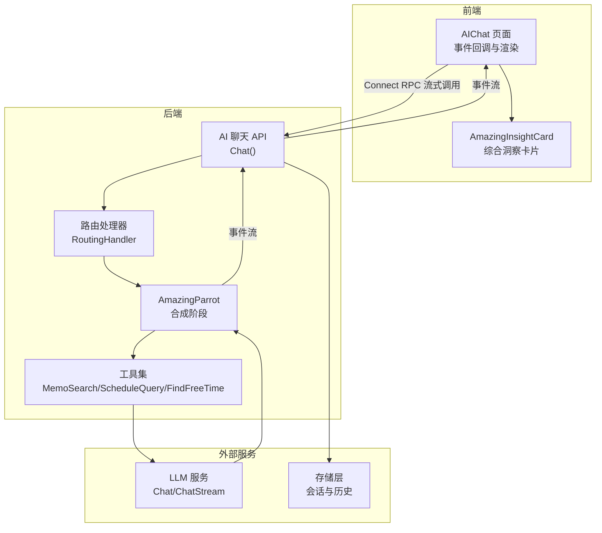
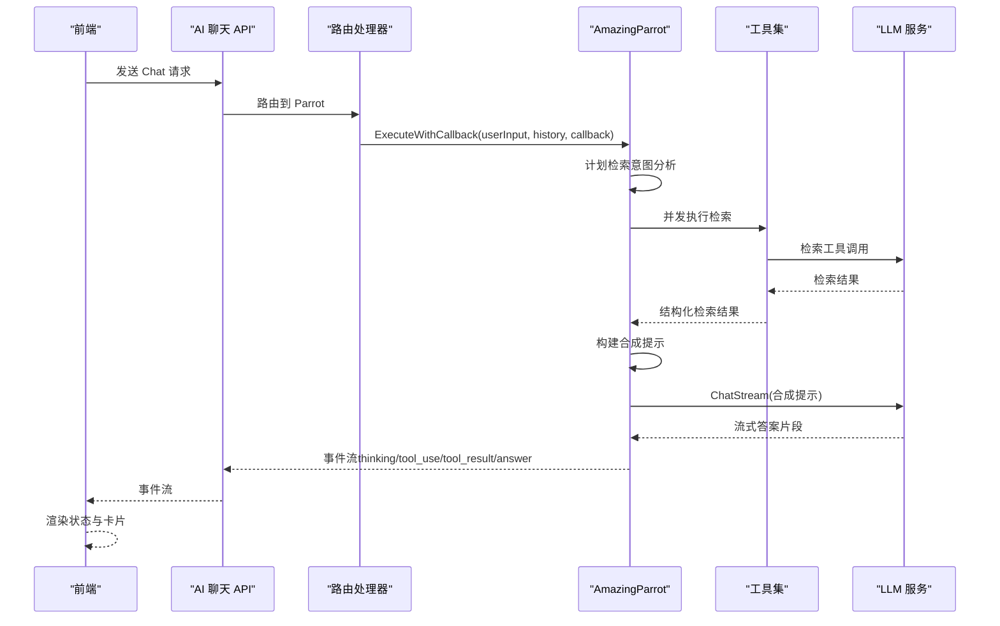
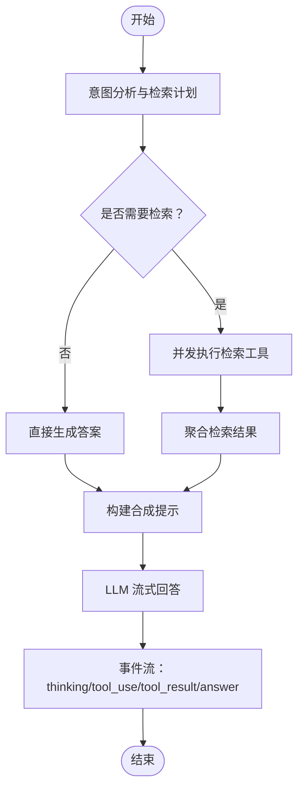
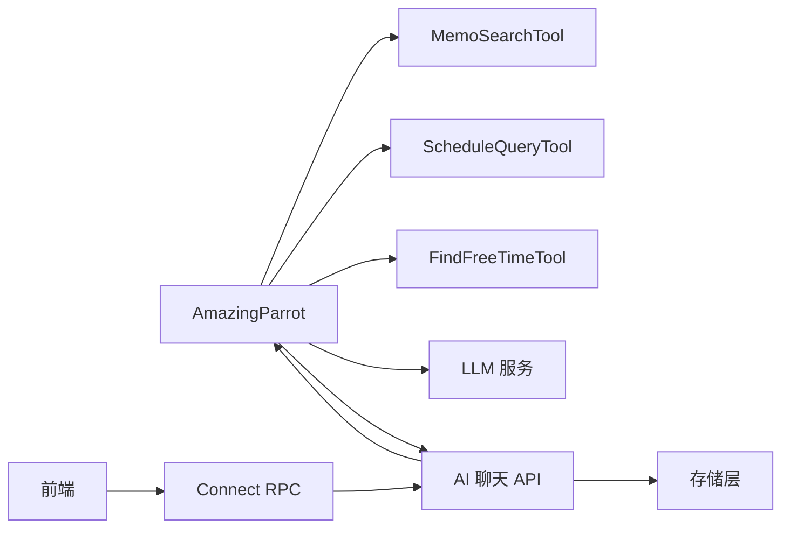

# 答案合成阶段

<cite>
**本文引用的文件列表**
- [amazing_parrot.go](file://plugin/ai/agent/amazing_parrot.go)
- [types.go](file://plugin/ai/agent/types.go)
- [memo_search.go](file://plugin/ai/agent/tools/memo_search.go)
- [scheduler.go](file://plugin/ai/agent/tools/scheduler.go)
- [ai_service_chat.go](file://server/router/api/v1/ai_service_chat.go)
- [useParrotChat.ts](file://web/src/hooks/useParrotChat.ts)
- [AIChat.tsx](file://web/src/pages/AIChat.tsx)
- [AmazingInsightCard.tsx](file://web/src/components/AIChat/AmazingInsightCard.tsx)
- [parrot.ts](file://web/src/types/parrot.ts)
- [parrot-agents-final-technical-spec.md](file://docs/parrot-agents-final-technical-spec.md)
</cite>

## 目录
1. [引言](#引言)
2. [项目结构](#项目结构)
3. [核心组件](#核心组件)
4. [架构总览](#架构总览)
5. [详细组件分析](#详细组件分析)
6. [依赖关系分析](#依赖关系分析)
7. [性能考量](#性能考量)
8. [故障排查指南](#故障排查指南)
9. [结论](#结论)
10. [附录](#附录)

## 引言
本章节聚焦“答案合成阶段”，即在基于检索结果的基础上，由 Amazing Parrot（综合助手鹦鹉）对笔记搜索、日程查询与空闲时间查找等多源数据进行综合分析，生成简洁而有洞察力的最终回答。该阶段包含以下关键环节：
- 合成提示构建：将检索到的笔记、日程与空闲时间信息整合为系统提示，强调“洞察优先、避免重复列举”的回答规则。
- 流式响应处理：通过 LLM 的流式对话接口，边生成边推送事件到前端，实现“正在思考”“工具使用”“结构化结果”“最终答案”等多阶段反馈。
- 多源数据整合策略：在合成阶段仅消费结构化结果，避免重复展示，将重点放在模式发现、关联总结与建议输出上。
- 错误处理与用户体验优化：统一事件类型、错误传播、前端状态管理与视觉反馈，确保流畅的交互体验。

## 项目结构
下图展示了从请求进入、工具执行、到合成与流式返回的端到端路径，以及前端如何接收与渲染事件。

图表来源
- [ai_service_chat.go](file://server/router/api/v1/ai_service_chat.go#L58-L206)
- [amazing_parrot.go](file://plugin/ai/agent/amazing_parrot.go#L100-L184)
- [memo_search.go](file://plugin/ai/agent/tools/memo_search.go#L109-L193)
- [scheduler.go](file://plugin/ai/agent/tools/scheduler.go#L183-L266)

章节来源
- [ai_service_chat.go](file://server/router/api/v1/ai_service_chat.go#L58-L206)
- [amazing_parrot.go](file://plugin/ai/agent/amazing_parrot.go#L100-L184)

## 核心组件
- AmazingParrot：负责两阶段并发检索与合成回答的编排器，提供意图规划、并发检索、合成提示构建与流式回答。
- 工具集：
  - MemoSearchTool：基于自适应检索器的笔记搜索，支持结构化结果与纯文本两种输出。
  - ScheduleQueryTool：按时间范围查询日程，支持结构化结果与纯文本两种输出。
  - FindFreeTimeTool：在指定日期内查找可用时间段，辅助日程冲突后的替代方案。
- 类型与事件：
  - EventCallback：事件回调接口，承载“思考中”“工具使用”“工具结果”“答案”等事件。
  - 事件常量：EventTypeThinking、EventTypeToolUse、EventTypeToolResult、EventTypeAnswer 等。
- 前端集成：
  - useParrotChat：封装 Connect RPC 流式调用，解析事件类型并分发到回调。
  - AIChat 页面：维护消息列表、状态与渲染，结合 AmazingInsightCard 展示综合洞察。

章节来源
- [types.go](file://plugin/ai/agent/types.go#L107-L139)
- [amazing_parrot.go](file://plugin/ai/agent/amazing_parrot.go#L19-L92)
- [memo_search.go](file://plugin/ai/agent/tools/memo_search.go#L53-L98)
- [scheduler.go](file://plugin/ai/agent/tools/scheduler.go#L132-L163)
- [useParrotChat.ts](file://web/src/hooks/useParrotChat.ts#L106-L169)
- [AIChat.tsx](file://web/src/pages/AIChat.tsx#L232-L331)

## 架构总览
下图展示“答案合成阶段”的端到端流程，包括事件类型、数据流向与关键处理点。

图表来源
- [ai_service_chat.go](file://server/router/api/v1/ai_service_chat.go#L58-L206)
- [amazing_parrot.go](file://plugin/ai/agent/amazing_parrot.go#L100-L184)
- [memo_search.go](file://plugin/ai/agent/tools/memo_search.go#L210-L282)
- [scheduler.go](file://plugin/ai/agent/tools/scheduler.go#L306-L387)

章节来源
- [parrot-agents-final-technical-spec.md](file://docs/parrot-agents-final-technical-spec.md#L2060-L2132)

## 详细组件分析

### 合成提示构建
- 目标：将检索到的笔记、日程与空闲时间信息整合为系统提示，强调“洞察优先、避免重复列举”的回答规则。
- 关键点：
  - 仅在合成提示中拼接检索结果字符串，避免在最终答案中重复展示。
  - 明确回答规则：不要重复列举细节；提供简短洞察；如无特别洞察则简单确认。
- 输出形态：系统提示字符串，随后由 LLM 的 ChatStream 接口进行流式回答。

章节来源
- [amazing_parrot.go](file://plugin/ai/agent/amazing_parrot.go#L537-L587)

### 流式响应处理
- 事件类型：
  - thinking：表示正在分析/思考。
  - tool_use：表示正在使用某个工具。
  - tool_result：表示工具执行结果（结构化 JSON）。
  - answer：表示最终答案的流式片段。
  - error：表示错误事件。
- 前端处理：
  - useParrotChat 解析事件类型并调用对应回调（onThinking/onToolUse/onToolResult/onContent/onDone/onError）。
  - AIChat 页面根据回调更新消息列表、状态与卡片展示。
- 后端收集：
  - Chat API 的 eventCollectingStream 在 Done 时汇总 assistant 回复并持久化。

章节来源
- [types.go](file://plugin/ai/agent/types.go#L107-L139)
- [useParrotChat.ts](file://web/src/hooks/useParrotChat.ts#L106-L169)
- [AIChat.tsx](file://web/src/pages/AIChat.tsx#L232-L331)
- [ai_service_chat.go](file://server/router/api/v1/ai_service_chat.go#L232-L295)

### 多源数据整合策略
- 数据来源：
  - 笔记搜索：MemoSearchTool 返回结构化结果（含查询词、数量与摘要列表），用于合成提示与前端卡片。
  - 日程查询：ScheduleQueryTool 返回结构化结果（含时间范围描述、查询类型与日程摘要列表）。
  - 空闲时间：FindFreeTimeTool 返回可用时间段（ISO8601 起始时间）。
- 整合原则：
  - 合成阶段仅消费结构化结果，避免重复展示；前端通过 MemoQueryResult 与 ScheduleQueryResult 事件渲染卡片。
  - 合成提示中仅拼接摘要信息，最终答案聚焦洞察与建议。

章节来源
- [amazing_parrot.go](file://plugin/ai/agent/amazing_parrot.go#L389-L451)
- [memo_search.go](file://plugin/ai/agent/tools/memo_search.go#L210-L282)
- [scheduler.go](file://plugin/ai/agent/tools/scheduler.go#L306-L387)

### 并发检索与合成流程
- 并发检索：
  - AmazingParrot 先通过 LLM 的 Chat 接口进行意图分析，生成检索计划（memo_search/schedule_query/find_free_time/direct_answer）。
  - 根据计划并发执行工具调用，使用 goroutine 与互斥锁保证线程安全与回调顺序。
- 合成阶段：
  - 收集所有检索结果后，构建合成提示并调用 LLM 的 ChatStream 接口，逐段推送 answer 事件。
  - 同时通过 tool_result 事件推送结构化结果，前端渲染卡片与状态。

图表来源
- [amazing_parrot.go](file://plugin/ai/agent/amazing_parrot.go#L186-L387)
- [amazing_parrot.go](file://plugin/ai/agent/amazing_parrot.go#L389-L451)

章节来源
- [amazing_parrot.go](file://plugin/ai/agent/amazing_parrot.go#L186-L387)
- [amazing_parrot.go](file://plugin/ai/agent/amazing_parrot.go#L389-L451)

### 前端渲染与用户体验
- 事件驱动渲染：
  - onThinking：更新“正在思考”状态。
  - onToolUse：更新“工具使用”状态。
  - onMemoQueryResult/onScheduleQueryResult：更新卡片数据并注入到会话引用。
  - onContent：增量更新最终答案。
  - onDone：结束流式，恢复空闲状态。
- 综合洞察卡片：
  - AmazingInsightCard 展示“关键笔记”“即将到来的事件”与“洞察栏”，支持点击跳转与交互。
- 拟声词与口头禅：
  - 前端根据鹦鹉类型映射拟声词与口头禅，增强拟人化体验。

章节来源
- [useParrotChat.ts](file://web/src/hooks/useParrotChat.ts#L106-L169)
- [AIChat.tsx](file://web/src/pages/AIChat.tsx#L232-L331)
- [AmazingInsightCard.tsx](file://web/src/components/AIChat/AmazingInsightCard.tsx#L27-L149)
- [parrot.ts](file://web/src/types/parrot.ts#L56-L88)

## 依赖关系分析
- 组件耦合：
  - AmazingParrot 依赖工具集（MemoSearchTool、ScheduleQueryTool、FindFreeTimeTool）与 LLM 服务。
  - 前端通过 useParrotChat 与 AIChat 页面解耦后端实现细节，仅依赖事件类型约定。
- 外部依赖：
  - LLM 服务提供 Chat 与 ChatStream 接口。
  - 存储层负责会话与历史构建，支撑上下文与摘要功能。

图表来源
- [amazing_parrot.go](file://plugin/ai/agent/amazing_parrot.go#L19-L92)
- [memo_search.go](file://plugin/ai/agent/tools/memo_search.go#L53-L98)
- [scheduler.go](file://plugin/ai/agent/tools/scheduler.go#L132-L163)
- [ai_service_chat.go](file://server/router/api/v1/ai_service_chat.go#L58-L206)

章节来源
- [amazing_parrot.go](file://plugin/ai/agent/amazing_parrot.go#L19-L92)
- [ai_service_chat.go](file://server/router/api/v1/ai_service_chat.go#L58-L206)

## 性能考量
- 并发检索：通过 goroutine 并发执行多个工具，显著降低端到端延迟。
- 流式输出：ChatStream 边生成边推送，减少等待时间，提升感知速度。
- 缓存策略：对合成结果进行缓存，命中时直接返回，避免重复计算。
- 超时与限流：后端对 LLM 与工具调用设置超时，防止阻塞；全局限流保障资源安全。
- 前端增量渲染：仅在 Done 时汇总，其余时间增量更新，降低重绘成本。

章节来源
- [amazing_parrot.go](file://plugin/ai/agent/amazing_parrot.go#L100-L184)
- [ai_service_chat.go](file://server/router/api/v1/ai_service_chat.go#L58-L206)

## 故障排查指南
- 常见错误类型：
  - ParrotError：封装代理内部错误，包含代理名与操作名，便于定位。
  - 工具执行错误：如输入格式错误、权限不足、时间格式不合法等。
  - LLM 错误：Chat/ChatStream 失败或超时。
- 前端处理：
  - onToolResult：记录工具返回的原始 JSON，便于调试。
  - onError：显示通用错误提示并恢复空闲状态。
- 后端处理：
  - Chat API 的 eventCollectingStream 在 Done 时汇总 assistant 回复并持久化。
  - 错误通过事件类型 error 传递到前端，前端据此更新 UI。

章节来源
- [types.go](file://plugin/ai/agent/types.go#L222-L256)
- [useParrotChat.ts](file://web/src/hooks/useParrotChat.ts#L153-L157)
- [ai_service_chat.go](file://server/router/api/v1/ai_service_chat.go#L245-L295)

## 结论
答案合成阶段通过“并发检索 + 流式合成 + 结构化展示”的组合，实现了从多源数据到简洁洞察的高效转换。其关键优势在于：
- 明确的合成提示规则与前端卡片展示，避免重复列举，突出洞察价值。
- 事件驱动的流式输出，提供“正在思考”“工具使用”“结构化结果”“最终答案”等完整反馈链路。
- 前后端解耦的事件约定与统一错误处理，确保稳定与可维护性。

## 附录
- 术语
  - 合成：指将检索结果整合为系统提示并生成最终回答的过程。
  - 并发检索：在同一请求中并行执行多个工具，缩短总耗时。
  - 流式回答：LLM 逐步返回答案片段，前端增量渲染。
- 相关文档
  - 参考技术规范中的“惊奇（Amazing）工作流程”与“数据流”章节，了解端到端场景与事件序列。

章节来源
- [parrot-agents-final-technical-spec.md](file://docs/parrot-agents-final-technical-spec.md#L256-L328)
- [parrot-agents-final-technical-spec.md](file://docs/parrot-agents-final-technical-spec.md#L2060-L2132)