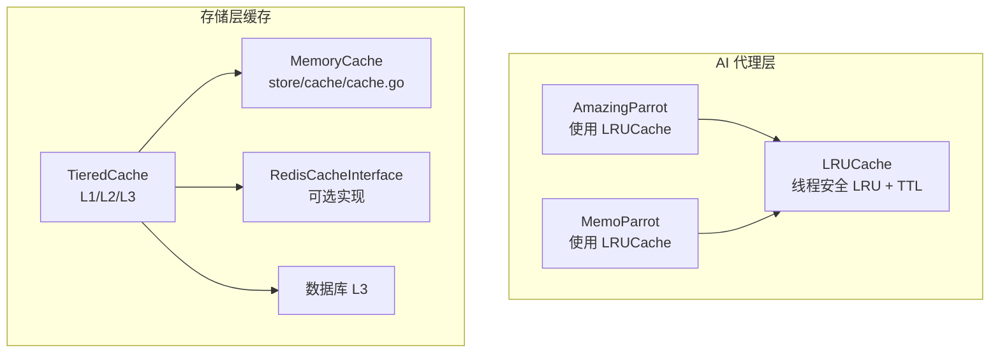
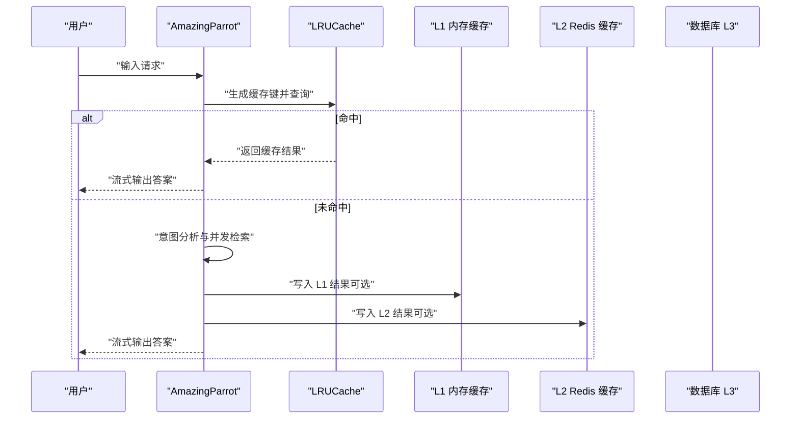
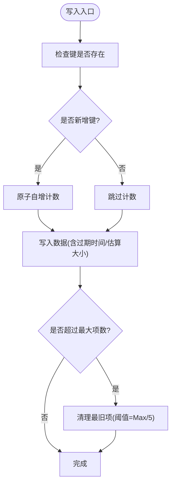
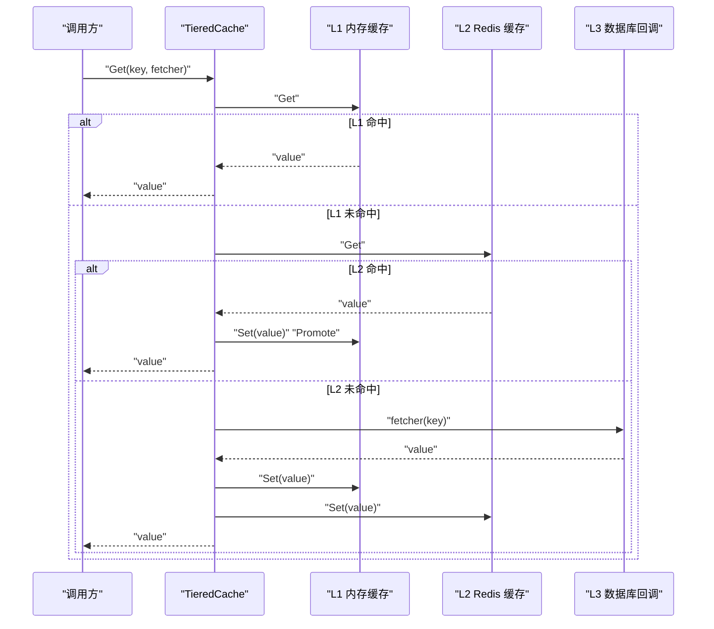
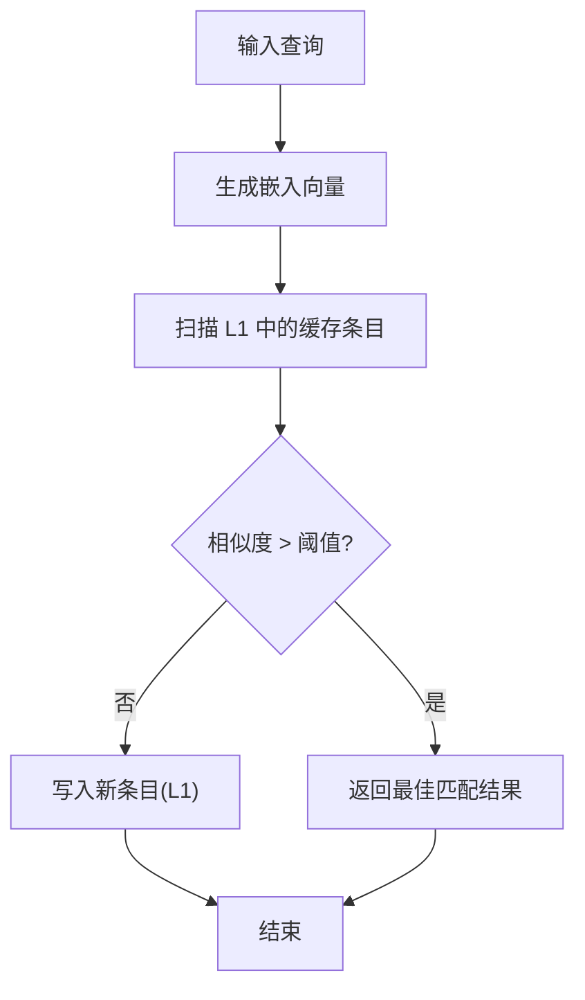
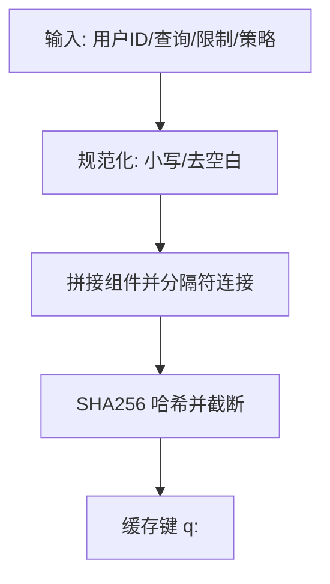
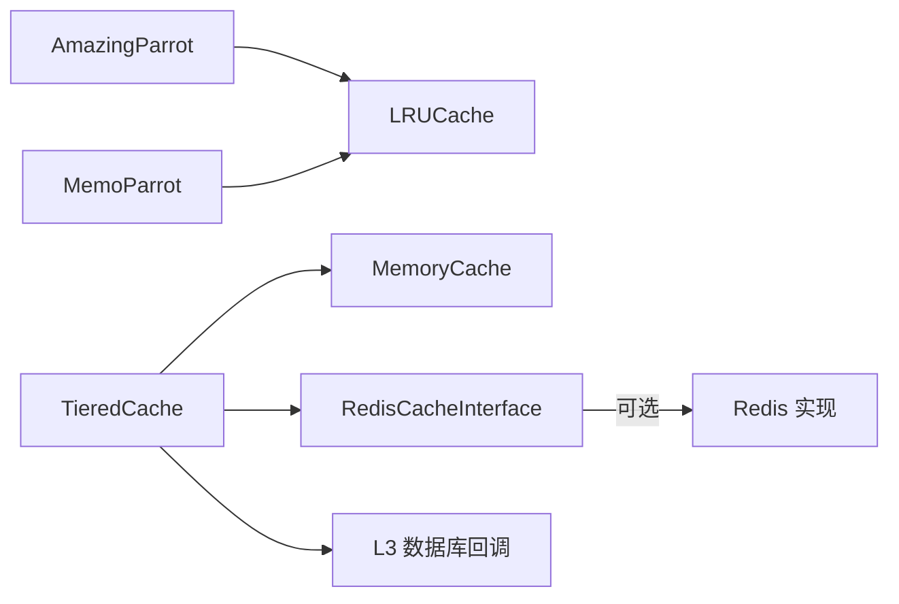

# 缓存管理机制

<cite>
**本文引用的文件**
- [plugin/ai/agent/cache.go](file://plugin/ai/agent/cache.go)
- [plugin/ai/agent/amazing_parrot.go](file://plugin/ai/agent/amazing_parrot.go)
- [plugin/ai/agent/memo_parrot.go](file://plugin/ai/agent/memo_parrot.go)
- [store/cache/cache.go](file://store/cache/cache.go)
- [store/cache/tiered.go](file://store/cache/tiered.go)
- [store/cache/redis.go](file://store/cache/redis.go)
- [store/cache/cache_test.go](file://store/cache/cache_test.go)
- [store/cache.go](file://store/cache.go)
</cite>

## 目录
1. [简介](#简介)
2. [项目结构](#项目结构)
3. [核心组件](#核心组件)
4. [架构概览](#架构概览)
5. [详细组件分析](#详细组件分析)
6. [依赖关系分析](#依赖关系分析)
7. [性能考量](#性能考量)
8. [故障排查指南](#故障排查指南)
9. [结论](#结论)
10. [附录](#附录)

## 简介
本文件系统性梳理 Amazing Parrot 缓存管理机制，覆盖 LRU 缓存实现、缓存键生成策略、缓存统计与监控、命中率优化、TTL 管理、内存使用控制，以及在多代理系统中的作用与成本控制策略。文档面向不同技术背景读者，既提供代码级细节，也给出高层架构与流程图示，帮助快速理解与落地实践。

## 项目结构
与缓存相关的核心代码分布在以下模块：
- 插件 AI 代理层：LRU 缓存与代理缓存使用
  - plugin/ai/agent/cache.go：通用 LRU 缓存实现
  - plugin/ai/agent/amazing_parrot.go：AmazingParrot 使用 LRU 缓存
  - plugin/ai/agent/memo_parrot.go：MemoParrot 使用 LRU 缓存
- 存储层缓存：内存缓存、分层缓存与 Redis 接口
  - store/cache/cache.go：内存缓存（带 TTL 与清理循环）
  - store/cache/tiered.go：三层缓存（L1 内存、L2 Redis、L3 数据库）
  - store/cache/redis.go：Redis 缓存接口与环境变量配置
  - store/cache/cache_test.go：内存缓存单元测试
  - store/cache.go：通用缓存键生成辅助函数



图表来源
- [plugin/ai/agent/amazing_parrot.go](file://plugin/ai/agent/amazing_parrot.go#L19-L31)
- [plugin/ai/agent/memo_parrot.go](file://plugin/ai/agent/memo_parrot.go#L26-L34)
- [plugin/ai/agent/cache.go](file://plugin/ai/agent/cache.go#L10-L22)
- [store/cache/cache.go](file://store/cache/cache.go#L66-L73)
- [store/cache/tiered.go](file://store/cache/tiered.go#L17-L35)

章节来源
- [plugin/ai/agent/cache.go](file://plugin/ai/agent/cache.go#L1-L292)
- [plugin/ai/agent/amazing_parrot.go](file://plugin/ai/agent/amazing_parrot.go#L1-L666)
- [plugin/ai/agent/memo_parrot.go](file://plugin/ai/agent/memo_parrot.go#L15-L214)
- [store/cache/cache.go](file://store/cache/cache.go#L1-L328)
- [store/cache/tiered.go](file://store/cache/tiered.go#L1-L447)
- [store/cache/redis.go](file://store/cache/redis.go#L1-L271)
- [store/cache/cache_test.go](file://store/cache/cache_test.go#L1-L210)
- [store/cache.go](file://store/cache.go#L1-L10)

## 核心组件
- LRU 缓存（代理层）
  - 支持最大条目数与 TTL，线程安全，具备命中/未命中计数与命中率统计
  - 提供泛型包装器以增强类型安全
- 内存缓存（存储层）
  - 基于 sync.Map 的线程安全内存缓存，支持默认 TTL、清理周期、最大项数与逐出回调
  - 后台定时清理过期项；当超过最大项数时触发“清理最旧”策略
- 分层缓存（TieredCache）
  - L1：内存缓存（默认启用）
  - L2：Redis 缓存（可选，通过环境变量启用）
  - L3：数据库回调（持久化数据源）
  - 支持跨层读写与失效刷新
- 语义缓存（SemanticCache）
  - 基于向量相似度的语义匹配缓存，支持阈值控制与嵌入服务集成
- 缓存键生成
  - 代理层：基于输入参数组合并哈希，避免长输入导致内存膨胀
  - 存储层：提供通用键生成与哈希函数

章节来源
- [plugin/ai/agent/cache.go](file://plugin/ai/agent/cache.go#L10-L50)
- [store/cache/cache.go](file://store/cache/cache.go#L10-L64)
- [store/cache/tiered.go](file://store/cache/tiered.go#L17-L60)
- [store/cache/redis.go](file://store/cache/redis.go#L12-L82)

## 架构概览
下图展示了 AmazingParrot 在执行过程中如何利用 LRU 缓存进行结果复用，以及与分层缓存的协同关系（若启用）。



图表来源
- [plugin/ai/agent/amazing_parrot.go](file://plugin/ai/agent/amazing_parrot.go#L106-L184)
- [plugin/ai/agent/cache.go](file://plugin/ai/agent/cache.go#L76-L108)
- [store/cache/tiered.go](file://store/cache/tiered.go#L93-L132)

## 详细组件分析

### LRU 缓存（代理层）
- 设计要点
  - 使用 map + 双向链表维护访问顺序，支持 O(1) 查找、更新与淘汰
  - 支持 TTL 过期检查；过期即移除
  - 线程安全：读写锁保护
  - 统计：命中/未命中计数，计算命中率
  - 泛型封装：保持类型安全
- 关键方法
  - Get/Set/Delete/Clear/Size/Stats/calculateExpiration/evictLRU/removeElement/String
- 复杂度
  - Get/Set/O(1)，删除与清理 O(1) 平均
- 适用场景
  - 代理内部短期结果缓存，避免重复检索与 LLM 调用

```mermaid
classDiagram
class LRUCache {
-int maxEntries
-time.Duration ttl
-map~string,*list.Element~ entries
-list.List* lruList
-RWMutex mutex
-int64 hits
-int64 misses
+Get(key) (interface{}, bool)
+Set(key, value) void
+Delete(key) void
+Clear() void
+Size() int
+Stats() CacheStats
-calculateExpiration() time.Time
-evictLRU() void
-removeElement(elem) void
+String() string
}
class GenericCache~T~ {
-LRUCache* cache
+Get(key) (T,bool)
+Set(key,T) void
+Delete(key) void
+Clear() void
+Size() int
+Stats() CacheStats
}
class CacheStats {
+int size
+int maxEntries
+int64 hits
+int64 misses
+float64 hitRate
}
GenericCache --> LRUCache : "委托"
```

图表来源
- [plugin/ai/agent/cache.go](file://plugin/ai/agent/cache.go#L10-L50)
- [plugin/ai/agent/cache.go](file://plugin/ai/agent/cache.go#L233-L292)

章节来源
- [plugin/ai/agent/cache.go](file://plugin/ai/agent/cache.go#L10-L231)

### 内存缓存（存储层）
- 设计要点
  - 基于 sync.Map 的并发安全存储
  - 默认 TTL、清理周期、最大项数、逐出回调
  - 后台定时器定期清理过期项；超过最大项数时按“最旧优先”批量清理
  - 粗略估算对象大小，用于内存控制
- 关键方法
  - New/NewDefault/Set/SetWithTTL/Get/Delete/Clear/Size/Close/cleanupLoop/cleanup/cleanupOldest/estimateSize
- 复杂度
  - Set/Get/删除近似 O(1)，清理遍历 O(n)
- 适用场景
  - 通用内存缓存，适合高频读取、可容忍过期的数据



图表来源
- [store/cache/cache.go](file://store/cache/cache.go#L97-L120)
- [store/cache/cache.go](file://store/cache/cache.go#L252-L313)

章节来源
- [store/cache/cache.go](file://store/cache/cache.go#L66-L328)

### 分层缓存（TieredCache）
- 设计要点
  - L1：内存缓存（默认开启）
  - L2：Redis 缓存（可选，通过环境变量启用）
  - L3：数据库回调（持久化）
  - 读路径：L1 -> L2 -> L3；命中后可回填上层
  - 写路径：同时写入 L1/L2（若启用）
  - 统计：返回 L1/L2 启用状态与大小（L2 当前接口未暴露 size）
- 关键方法
  - NewTieredCache/Get/Set/SetWithTTL/Delete/Invalidate/Clear/Stats/Close
  - Redis 接口：RedisCacheInterface（可选实现）
- 适用场景
  - 多实例部署、跨进程共享缓存、持久化缓存需求



图表来源
- [store/cache/tiered.go](file://store/cache/tiered.go#L93-L132)

章节来源
- [store/cache/tiered.go](file://store/cache/tiered.go#L17-L231)
- [store/cache/redis.go](file://store/cache/redis.go#L12-L82)

### 语义缓存（SemanticCache）
- 设计要点
  - 基于查询文本的嵌入向量与余弦相似度进行语义匹配
  - 缓存条目包含查询、嵌入、结果与时间戳
  - 支持阈值控制，避免低质量匹配
- 关键方法
  - NewSemanticCache/Get/Set/Delete/hashKey/cosineSimilarity
- 适用场景
  - 查询语义相近但字面不同，提升检索复用效果



图表来源
- [store/cache/tiered.go](file://store/cache/tiered.go#L263-L330)

章节来源
- [store/cache/tiered.go](file://store/cache/tiered.go#L233-L383)

### 缓存键生成策略
- 代理层（AmazingParrot/MemoParrot）
  - 组合：agent 名称、用户 ID、输入文本
  - 哈希：对组合字符串做 SHA256 并截断，避免长输入导致内存膨胀
  - 作用：跨用户隔离、跨输入稳定映射
- 存储层
  - 提供通用键生成与哈希函数，便于统一管理



图表来源
- [store/cache/tiered.go](file://store/cache/tiered.go#L384-L396)

章节来源
- [plugin/ai/agent/amazing_parrot.go](file://plugin/ai/agent/amazing_parrot.go#L125-L136)
- [plugin/ai/agent/memo_parrot.go](file://plugin/ai/agent/memo_parrot.go#L93-L106)
- [store/cache/tiered.go](file://store/cache/tiered.go#L384-L396)

### 缓存统计与监控
- 代理层 LRU
  - CacheStats：size/maxEntries/hits/misses/hitRate
  - Stats() 计算命中率，String() 输出人类可读统计
- 存储层内存缓存
  - Size() 返回当前项数
  - 清理循环与逐出回调可用于外部观测
- 分层缓存
  - Stats() 返回 L1/L2 启用状态与大小（L2 size 通过接口不可见时返回 -1）

章节来源
- [plugin/ai/agent/cache.go](file://plugin/ai/agent/cache.go#L42-L50)
- [plugin/ai/agent/cache.go](file://plugin/ai/agent/cache.go#L178-L197)
- [plugin/ai/agent/cache.go](file://plugin/ai/agent/cache.go#L225-L231)
- [store/cache/cache.go](file://store/cache/cache.go#L181-L184)
- [store/cache/tiered.go](file://store/cache/tiered.go#L189-L208)

## 依赖关系分析
- 代理层依赖
  - AmazingParrot/MemoParrot 直接依赖 LRUCache 实现短期结果复用
- 存储层依赖
  - TieredCache 依赖 MemoryCache 作为 L1，依赖 Redis 接口作为 L2，依赖 L3 回调作为数据源
  - Redis 接口默认为 Nil 实现，可通过环境变量启用真实实现
- 测试依赖
  - 单测覆盖基本操作、逐出、并发与逐出回调



图表来源
- [plugin/ai/agent/amazing_parrot.go](file://plugin/ai/agent/amazing_parrot.go#L22-L31)
- [plugin/ai/agent/memo_parrot.go](file://plugin/ai/agent/memo_parrot.go#L28-L34)
- [store/cache/tiered.go](file://store/cache/tiered.go#L28-L35)
- [store/cache/redis.go](file://store/cache/redis.go#L12-L30)

章节来源
- [plugin/ai/agent/amazing_parrot.go](file://plugin/ai/agent/amazing_parrot.go#L1-L92)
- [plugin/ai/agent/memo_parrot.go](file://plugin/ai/agent/memo_parrot.go#L36-L66)
- [store/cache/tiered.go](file://store/cache/tiered.go#L61-L91)
- [store/cache/redis.go](file://store/cache/redis.go#L78-L82)

## 性能考量
- 命中率优化
  - 代理层：合理设置最大条目数与 TTL，避免频繁过期；对热点输入采用更长 TTL
  - 存储层：增大 MaxItems 与 DefaultTTL，减少清理频率；使用逐出回调进行可观测
  - 分层缓存：L1 作为热数据池，L2 作为跨进程共享层，L3 作为最终一致性来源
- TTL 管理
  - 代理层：TTL 过期即移除，避免陈旧数据占用空间
  - 存储层：后台定时清理与“最旧优先”批量清理相结合
- 内存使用控制
  - 代理层：键哈希避免长输入；命中/未命中计数有助于评估缓存收益
  - 存储层：估算对象大小，结合最大项数与清理周期控制内存
- 并发与吞吐
  - 代理层：读写锁保护，适合高并发场景
  - 存储层：sync.Map 提供更好的并发读性能；清理循环异步执行

[本节为通用性能指导，不直接分析具体文件]

## 故障排查指南
- 缓存未命中
  - 检查缓存键是否正确生成（包含用户 ID 与输入）
  - 确认 TTL 是否过短或已过期
  - 对比命中率统计，评估缓存窗口与容量
- 内存增长异常
  - 检查 MaxItems 与 DefaultTTL 设置
  - 观察清理循环是否正常运行
  - 使用逐出回调记录被驱逐的键值，定位热点
- 分层缓存未生效
  - 确认 L2 Redis 是否启用（环境变量）
  - 检查 Redis 连接与键前缀
- 单元测试参考
  - 基本操作、TTL 过期、逐出、并发与逐出回调均有测试覆盖

章节来源
- [store/cache/cache_test.go](file://store/cache/cache_test.go#L11-L210)
- [store/cache/redis.go](file://store/cache/redis.go#L56-L82)

## 结论
Amazing Parrot 的缓存体系由代理层 LRU 缓存、存储层内存缓存与分层缓存共同构成，分别服务于短期结果复用、通用内存缓存与多实例共享。通过合理的键生成策略、TTL 管理与内存控制，系统在性能与成本之间取得平衡。配合统计与监控，可进一步优化缓存参数，提升命中率与用户体验。

[本节为总结性内容，不直接分析具体文件]

## 附录

### 缓存配置参数与说明
- 代理层 LRU（AmazingParrot/MemoParrot）
  - 最大条目数：默认值来自常量（代理层）
  - TTL：默认值来自常量（代理层）
  - 键生成：组合 agent 名称、用户 ID、输入文本并哈希
- 存储层内存缓存
  - DefaultTTL：默认 10 分钟
  - CleanupInterval：默认 5 分钟
  - MaxItems：默认 1000
  - OnEviction：逐出回调（可选）
- 分层缓存
  - L1MaxItems：默认 1000
  - L1TTL：默认 30 分钟
  - L2TTL：默认 30 分钟
  - EnableL1：默认启用
  - EnableL2：根据环境变量自动判断
- Redis 缓存（可选）
  - 地址、密码、DB、键前缀、默认 TTL、连接池大小等
  - 环境变量：MEMOS_CACHE_REDIS_ADDR、MEMOS_CACHE_REDIS_PASSWORD、MEMOS_CACHE_REDIS_PREFIX

章节来源
- [plugin/ai/agent/memo_parrot.go](file://plugin/ai/agent/memo_parrot.go#L18-L24)
- [store/cache/cache.go](file://store/cache/cache.go#L56-L64)
- [store/cache/tiered.go](file://store/cache/tiered.go#L49-L59)
- [store/cache/redis.go](file://store/cache/redis.go#L32-L76)

### 监控指标与采集
- 代理层 LRU
  - CacheStats：size/maxEntries/hits/misses/hitRate
  - Stats()/String() 输出
- 存储层内存缓存
  - Size()：当前项数
  - 清理循环与逐出回调：可观测过期与驱逐
- 分层缓存
  - Stats()：L1/L2 启用状态与大小（L2 size 不可用时返回 -1）

章节来源
- [plugin/ai/agent/cache.go](file://plugin/ai/agent/cache.go#L42-L50)
- [plugin/ai/agent/cache.go](file://plugin/ai/agent/cache.go#L178-L197)
- [store/cache/cache.go](file://store/cache/cache.go#L181-L184)
- [store/cache/tiered.go](file://store/cache/tiered.go#L189-L208)