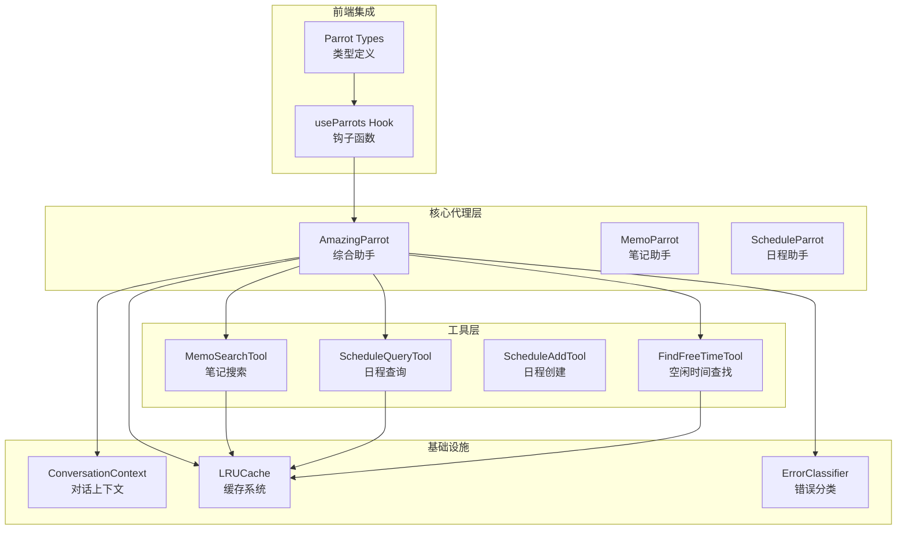
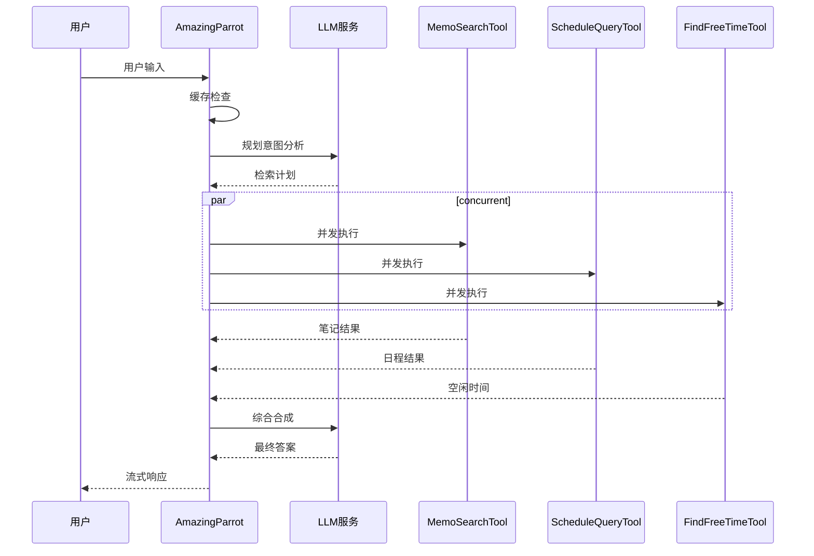
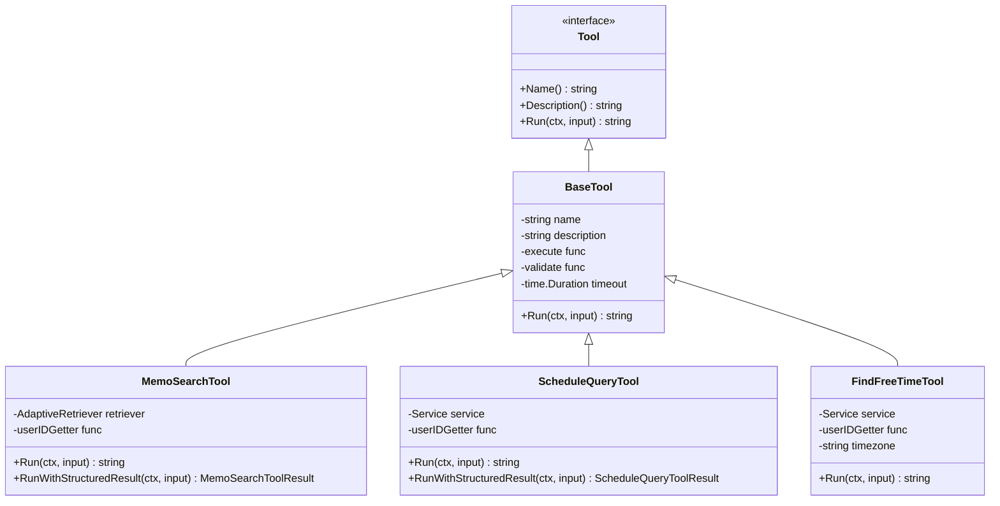
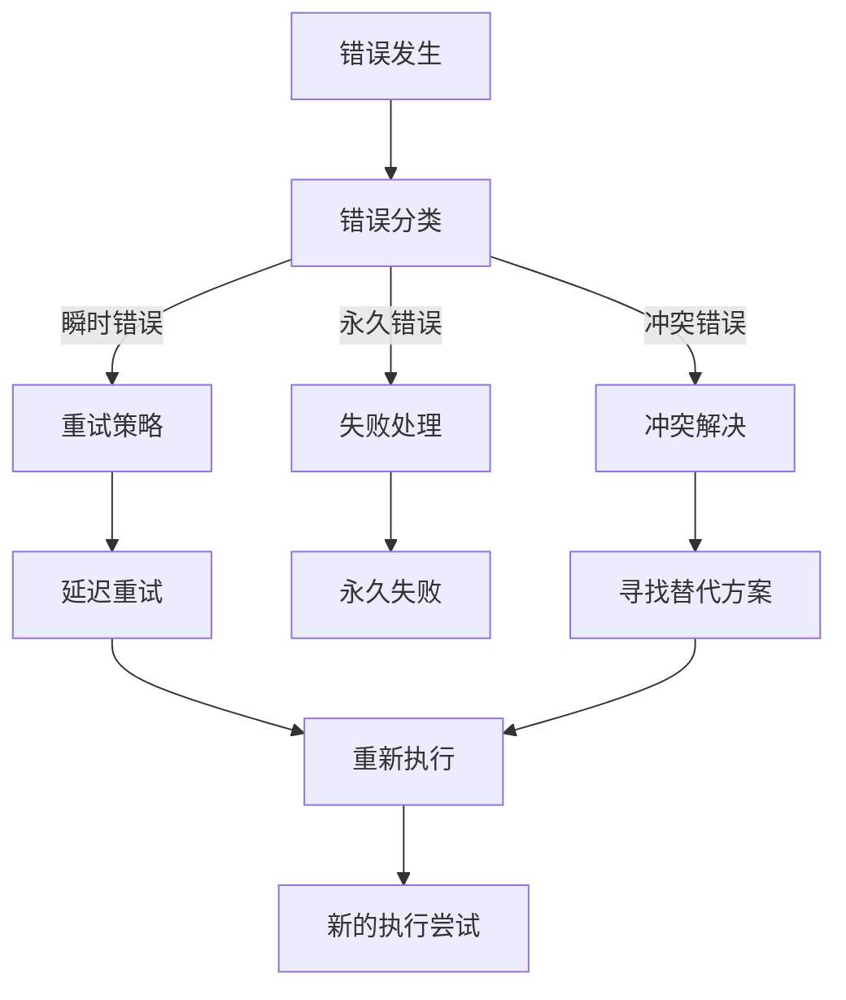
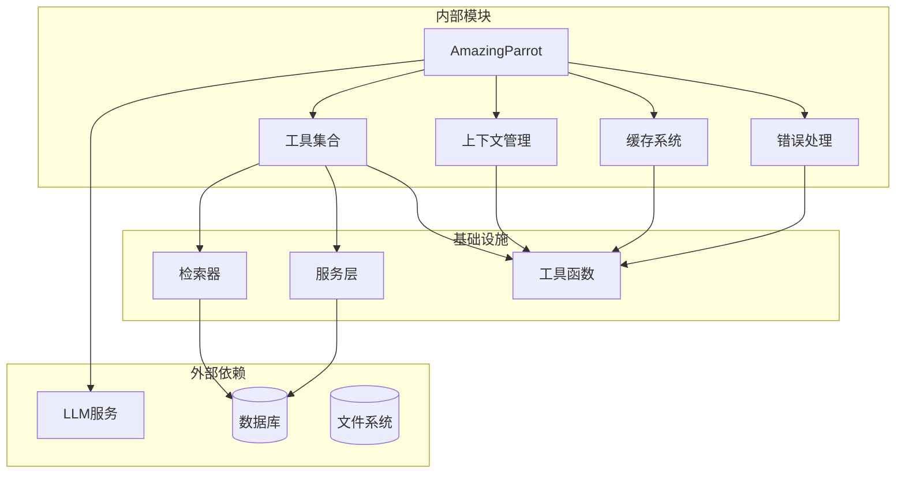

# 自我认知系统

<cite>
**本文档引用的文件**
- [amazing_parrot.go](file://plugin/ai/agent/amazing_parrot.go)
- [types.go](file://plugin/ai/agent/types.go)
- [context.go](file://plugin/ai/agent/context.go)
- [cache.go](file://plugin/ai/agent/cache.go)
- [memo_search.go](file://plugin/ai/agent/tools/memo_search.go)
- [scheduler.go](file://plugin/ai/agent/tools/scheduler.go)
- [base_tool.go](file://plugin/ai/agent/base_tool.go)
- [error_class.go](file://plugin/ai/agent/error_class.go)
- [scheduler_test.go](file://plugin/ai/agent/tools/scheduler_test.go)
- [context_test.go](file://plugin/ai/agent/context_test.go)
- [parrot.ts](file://web/src/types/parrot.ts)
- [useParrots.ts](file://web/src/hooks/useParrots.ts)
</cite>

## 目录
1. [简介](#简介)
2. [项目结构](#项目结构)
3. [核心组件](#核心组件)
4. [架构概览](#架构概览)
5. [详细组件分析](#详细组件分析)
6. [依赖关系分析](#依赖关系分析)
7. [性能考虑](#性能考虑)
8. [故障排除指南](#故障排除指南)
9. [结论](#结论)
10. [附录](#附录)

## 简介

Amazing Parrot 自我认知系统是一个先进的多模态智能助手，专为 Memos 系统设计。该系统通过元认知描述结构、情感表达机制和行为模式识别，为用户提供智能化的笔记管理和日程安排服务。

系统的核心设计理念是"三核心能力"：笔记助手（灰灰 - Memo Parrot）、日程助手（金刚 - Schedule Parrot）和综合助手（惊奇 - Amazing Parrot）。每个组件都具备完整的自我认知能力，能够理解自己的身份、情感状态和行为特征。

## 项目结构



**图表来源**
- [amazing_parrot.go](file://plugin/ai/agent/amazing_parrot.go#L19-L31)
- [types.go](file://plugin/ai/agent/types.go#L10-L23)
- [context.go](file://plugin/ai/agent/context.go#L19-L37)

**章节来源**
- [amazing_parrot.go](file://plugin/ai/agent/amazing_parrot.go#L1-L666)
- [types.go](file://plugin/ai/agent/types.go#L1-L353)

## 核心组件

### 元认知描述结构

系统采用分层的元认知模型，包含以下核心要素：

**AvianIdentity（鸟类身份认知）**
- 物种认知：亚马逊鹦鹉的智慧象征
- 自然能力：语言能力、社会协作、问题解决
- 象征意义：智慧与全能的化身
- 哲学思考：在多维数据世界中翱翔

**EmotionalExpression（情感表达）**
- 默认情感：好奇探索
- 拟声词系统：搜索中"咻..."、发现时"哇哦~"、完成时"噢！"
- 口头禅：综合来看、发现规律了、多维飞行中
- 情感触发：笔记发现兴奋、日程发现快乐、双重发现欢欣

**行为模式识别**
- 多维飞行：同时处理笔记和日程
- 综合视野：跨领域信息整合
- 并发执行：多任务并行处理

**章节来源**
- [amazing_parrot.go](file://plugin/ai/agent/amazing_parrot.go#L596-L664)
- [types.go](file://plugin/ai/agent/types.go#L25-L105)

### 缓存系统

LRU 缓存系统确保高效的数据访问和存储：

```mermaid
classDiagram
class LRUCache {
+int maxEntries
+time ttl
+map[string]*list.Element entries
+List lruList
+int64 hits
+int64 misses
+Get(key) interface{}
+Set(key, value) void
+Stats() CacheStats
}
class CacheEntry {
+string key
+interface{} value
+int64 expiresAt
+int sizeBytes
+int64 accessTime
}
class CacheStats {
+int size
+int maxEntries
+int64 hits
+int64 misses
+float64 hitRate
}
LRUCache --> CacheEntry : "存储"
LRUCache --> CacheStats : "统计"
```

**图表来源**
- [cache.go](file://plugin/ai/agent/cache.go#L10-L50)

**章节来源**
- [cache.go](file://plugin/ai/agent/cache.go#L1-L292)

## 架构概览

系统采用两阶段并发检索架构，实现高效的智能代理服务：



**图表来源**
- [amazing_parrot.go](file://plugin/ai/agent/amazing_parrot.go#L106-L184)
- [amazing_parrot.go](file://plugin/ai/agent/amazing_parrot.go#L228-L387)

**章节来源**
- [amazing_parrot.go](file://plugin/ai/agent/amazing_parrot.go#L100-L184)

## 详细组件分析

### AmazingParrot 主控制器

AmazingParrot 作为综合助手，集成了笔记搜索、日程查询和空闲时间查找三大核心功能：

**执行流程控制**
1. **缓存检查**：优先使用 LRU 缓存减少重复计算
2. **意图分析**：通过 LLM 分析用户需求，制定检索计划
3. **并发执行**：并行执行多个工具，最大化效率
4. **结果合成**：将多源信息整合为统一答案

**错误处理机制**
- 超时保护：全局执行超时控制
- 错误分类：区分瞬时错误、永久错误和冲突错误
- 重试策略：针对不同错误类型实施相应策略

**章节来源**
- [amazing_parrot.go](file://plugin/ai/agent/amazing_parrot.go#L100-L184)
- [error_class.go](file://plugin/ai/agent/error_class.go#L84-L149)

### 工具系统架构



**图表来源**
- [base_tool.go](file://plugin/ai/agent/base_tool.go#L10-L32)
- [memo_search.go](file://plugin/ai/agent/tools/memo_search.go#L53-L77)
- [scheduler.go](file://plugin/ai/agent/tools/scheduler.go#L132-L144)

**章节来源**
- [base_tool.go](file://plugin/ai/agent/base_tool.go#L1-L251)
- [memo_search.go](file://plugin/ai/agent/tools/memo_search.go#L1-L283)
- [scheduler.go](file://plugin/ai/agent/tools/scheduler.go#L1-L800)

### 对话上下文管理系统

系统实现了完整的对话历史管理和工作状态跟踪：

**对话历史管理**
- 最大保留 10 轮对话
- 时间戳记录和更新
- 工具调用记录追踪

**工作状态跟踪**
- 提案日程草稿
- 冲突检测和解决
- 当前工作步骤状态

**章节来源**
- [context.go](file://plugin/ai/agent/context.go#L19-L200)

### 错误分类与处理

系统采用智能错误分类机制，为不同类型的错误提供相应的处理策略：



**图表来源**
- [error_class.go](file://plugin/ai/agent/error_class.go#L84-L149)

**章节来源**
- [error_class.go](file://plugin/ai/agent/error_class.go#L1-L232)

## 依赖关系分析



**图表来源**
- [amazing_parrot.go](file://plugin/ai/agent/amazing_parrot.go#L3-L16)
- [memo_search.go](file://plugin/ai/agent/tools/memo_search.go#L3-L11)

**章节来源**
- [amazing_parrot.go](file://plugin/ai/agent/amazing_parrot.go#L1-L666)

## 性能考虑

### 缓存策略优化

系统采用多层缓存策略确保最佳性能：

**LRU 缓存配置**
- 最大条目数：100 条
- TTL 设置：5 分钟
- 命中率监控：实时统计分析

**内存管理**
- 自动驱逐最久未使用条目
- 过期条目清理
- 内存使用量限制

### 并发执行优化

**goroutine 管理**
- 并发工具执行
- 互斥锁保护共享资源
- 等待组同步

**超时控制**
- 全局执行超时 30 秒
- 单个工具执行超时 10 秒
- 上下文取消支持

## 故障排除指南

### 常见问题诊断

**缓存相关问题**
- 缓存命中率低：检查缓存键生成逻辑
- 内存占用过高：调整最大条目数和 TTL
- 缓存失效异常：验证过期时间计算

**工具执行失败**
- 输入验证错误：检查 JSON 格式和必需字段
- 数据库连接问题：验证连接池配置
- 权限不足：检查用户 ID 和访问权限

**章节来源**
- [context_test.go](file://plugin/ai/agent/context_test.go#L10-L33)
- [scheduler_test.go](file://plugin/ai/agent/tools/scheduler_test.go#L56-L138)

### 调试技巧

**日志分析**
- 关键操作添加详细日志
- 错误堆栈跟踪
- 性能指标监控

**测试覆盖**
- 单元测试验证核心功能
- 集成测试确保组件协同
- 边界条件测试

## 结论

Amazing Parrot 自我认知系统通过精心设计的元认知架构、情感表达机制和行为模式识别，为用户提供了智能化的笔记管理和日程安排服务。系统的核心优势包括：

1. **全面的自我认知**：每个组件都具备完整的元认知能力
2. **高效的任务执行**：两阶段并发检索架构确保最佳性能
3. **智能错误处理**：完善的错误分类和恢复机制
4. **优秀的用户体验**：流畅的交互和丰富的反馈机制

该系统不仅提升了用户的工作效率，更重要的是通过自我认知机制帮助用户更好地理解和预测代理的行为模式，从而优化整体交互体验。

## 附录

### 前端集成要点

系统提供了完整的前端集成方案，包括：

**类型定义**：标准化的鹦鹉代理类型和事件类型
**本地化支持**：多语言界面适配
**主题配置**：三种不同的视觉主题
**快捷操作**：便捷的代理切换和操作

**章节来源**
- [parrot.ts](file://web/src/types/parrot.ts#L1-L361)
- [useParrots.ts](file://web/src/hooks/useParrots.ts#L1-L65)