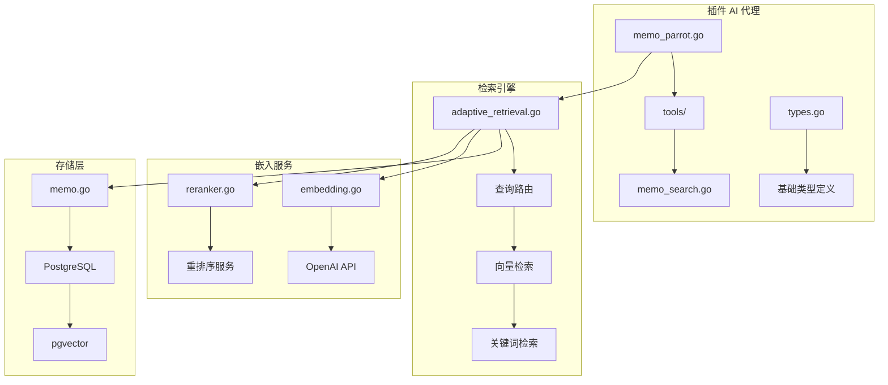
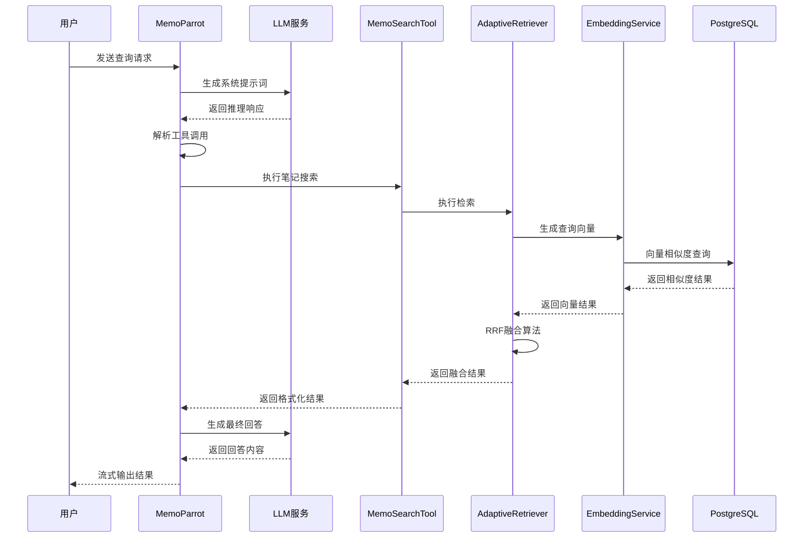
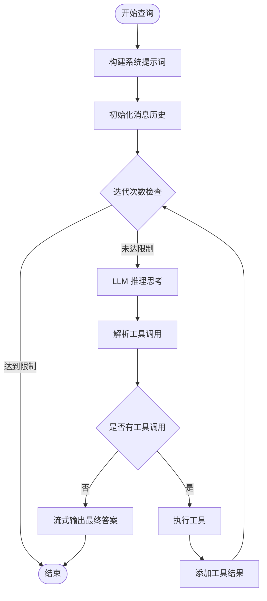
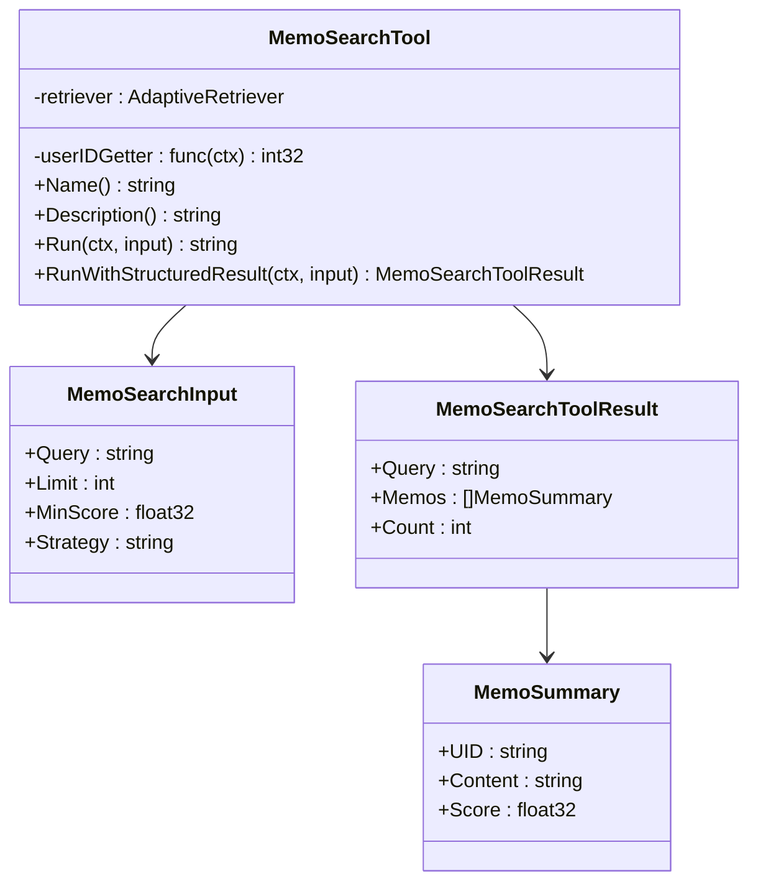
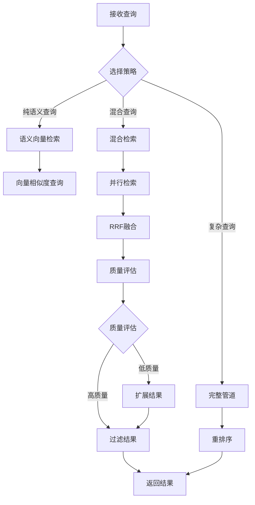
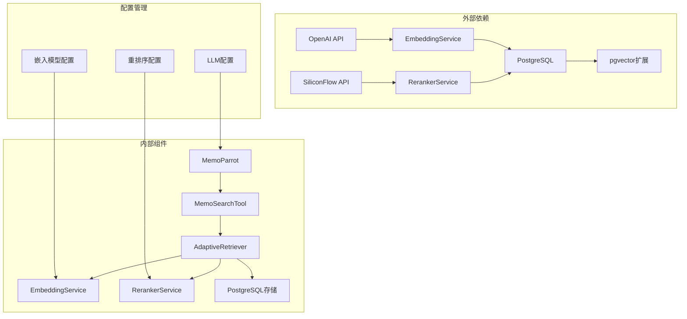

# Memo Parrot 笔记查询代理

<cite>
**本文档引用的文件**
- [memo_parrot.go](file://plugin/ai/agent/memo_parrot.go)
- [memo_search.go](file://plugin/ai/agent/tools/memo_search.go)
- [types.go](file://plugin/ai/agent/types.go)
- [adaptive_retrieval.go](file://server/retrieval/adaptive_retrieval.go)
- [query_router.go](file://server/queryengine/query_router.go)
- [embedding.go](file://plugin/ai/embedding.go)
- [reranker.go](file://plugin/ai/reranker.go)
- [llm.go](file://plugin/ai/llm.go)
- [memo.go](file://store/db/postgres/memo.go)
- [ai_service.go](file://server/router/api/v1/ai_service.go)
</cite>

## 目录
1. [简介](#简介)
2. [项目结构](#项目结构)
3. [核心组件](#核心组件)
4. [架构概览](#架构概览)
5. [详细组件分析](#详细组件分析)
6. [依赖关系分析](#依赖关系分析)
7. [性能考虑](#性能考虑)
8. [故障排除指南](#故障排除指南)
9. [结论](#结论)

## 简介

Memo Parrot 笔记查询代理是一个智能的笔记检索和分析系统，专门负责处理用户的笔记查询请求。该系统采用 ReAct（推理-行动）范式，结合语义搜索和关键词检索，为用户提供准确、高效的笔记查询服务。

该代理系统的核心特点包括：
- **智能查询路由**：根据查询内容自动选择最优的检索策略
- **多模态检索**：结合语义向量检索和传统关键词检索
- **结构化结果输出**：提供标准化的查询结果格式
- **缓存优化**：内置 LRU 缓存机制提升响应速度
- **流式响应**：支持实时的流式结果输出

## 项目结构

Memo Parrot 查询代理位于项目的插件 AI 代理模块中，主要包含以下核心目录：

**图表来源**
- [memo_parrot.go](file://plugin/ai/agent/memo_parrot.go#L1-L459)
- [adaptive_retrieval.go](file://server/retrieval/adaptive_retrieval.go#L1-L762)
- [embedding.go](file://plugin/ai/embedding.go#L1-L103)

**章节来源**
- [memo_parrot.go](file://plugin/ai/agent/memo_parrot.go#L1-L459)
- [memo_search.go](file://plugin/ai/agent/tools/memo_search.go#L1-L283)

## 核心组件

### MemoParrot 主代理

MemoParrot 是整个查询代理的核心控制器，负责协调各个组件的工作流程。

**主要职责**：
- **ReAct 循环管理**：实现推理-行动的循环机制
- **工具调用解析**：从 LLM 响应中提取工具调用指令
- **缓存管理**：提供 LRU 缓存机制
- **事件回调处理**：支持实时的事件通知

**关键特性**：
- 使用系统提示词引导 LLM 进行笔记查询
- 支持工具调用的解析和执行
- 实现流式响应输出
- 提供详细的日志记录

### MemoSearchTool 搜索工具

MemoSearchTool 是专门用于笔记搜索的工具，提供了完整的搜索功能。

**核心功能**：
- **参数规范化**：处理不同格式的 JSON 参数
- **输入验证**：确保查询参数的有效性
- **策略选择**：根据查询内容选择合适的检索策略
- **结果格式化**：提供结构化的搜索结果

**搜索参数**：
- `query`：必需，搜索关键词
- `limit`：可选，默认 10，最大 50
- `min_score`：可选，默认 0.5
- `strategy`：可选，检索策略

### AdaptiveRetriever 自适应检索器

自适应检索器是整个检索系统的核心，能够根据查询复杂度动态选择最优的检索策略。

**检索策略**：
- `memo_semantic_only`：纯语义向量检索
- `hybrid_standard`：标准混合检索（BM25 + 向量）
- `hybrid_bm25_weighted`：BM25 加权混合检索
- `hybrid_with_time_filter`：带时间过滤的混合检索
- `full_pipeline_with_reranker`：完整管道 + 重排序

**优化特性**：
- 并行执行多种检索策略
- RRF（Reciprocal Rank Fusion）融合算法
- 动态质量评估和结果扩展
- 内存优化和性能调优

**章节来源**
- [memo_parrot.go](file://plugin/ai/agent/memo_parrot.go#L26-L66)
- [memo_search.go](file://plugin/ai/agent/tools/memo_search.go#L53-L83)
- [adaptive_retrieval.go](file://server/retrieval/adaptive_retrieval.go#L24-L66)

## 架构概览

Memo Parrot 查询代理采用分层架构设计，各层职责明确，耦合度低。

**图表来源**
- [memo_parrot.go](file://plugin/ai/agent/memo_parrot.go#L74-L289)
- [memo_search.go](file://plugin/ai/agent/tools/memo_search.go#L109-L193)
- [adaptive_retrieval.go](file://server/retrieval/adaptive_retrieval.go#L68-L115)

## 详细组件分析

### ReAct 循环机制

MemoParrot 实现了完整的 ReAct（推理-行动）循环，这是其智能查询的核心机制。

**图表来源**
- [memo_parrot.go](file://plugin/ai/agent/memo_parrot.go#L139-L289)

**执行流程**：
1. **初始化阶段**：构建系统提示词，准备消息历史
2. **推理阶段**：调用 LLM 进行思考和规划
3. **工具解析**：从 LLM 响应中提取工具调用指令
4. **工具执行**：执行相应的工具进行数据检索
5. **结果整合**：将工具结果整合到对话历史中
6. **最终回答**：生成最终的答案并流式输出

### 搜索工具实现

MemoSearchTool 提供了完整的笔记搜索功能，支持多种查询参数和策略。

**图表来源**
- [memo_search.go](file://plugin/ai/agent/tools/memo_search.go#L53-L107)
- [memo_search.go](file://plugin/ai/agent/tools/memo_search.go#L202-L208)

**搜索参数处理**：
- **参数规范化**：自动处理 camelCase 和 snake_case 字段名
- **默认值设置**：合理的默认参数值
- **输入验证**：确保查询参数的有效性
- **策略选择**：根据查询内容选择最优检索策略

### 自适应检索策略

AdaptiveRetriever 根据查询复杂度和结果质量动态选择最优的检索策略。

**图表来源**
- [adaptive_retrieval.go](file://server/retrieval/adaptive_retrieval.go#L68-L115)
- [adaptive_retrieval.go](file://server/retrieval/adaptive_retrieval.go#L523-L602)

**策略选择逻辑**：
1. **纯语义检索**：适用于简单的关键词查询
2. **混合检索**：结合 BM25 和向量检索的优势
3. **完整管道**：适用于复杂的多概念查询
4. **质量评估**：动态评估检索结果质量
5. **结果扩展**：根据质量评估结果扩展搜索范围

### 缓存机制

MemoParrot 实现了 LRU 缓存机制，有效提升重复查询的响应速度。

**缓存特性**：
- **跨用户隔离**：使用用户 ID 防止缓存污染
- **哈希键生成**：使用 SHA256 防止长输入导致的内存问题
- **TTL 管理**：默认 5 分钟的缓存过期时间
- **统计监控**：提供缓存命中率和统计信息

**章节来源**
- [memo_parrot.go](file://plugin/ai/agent/memo_parrot.go#L17-L24)
- [types.go](file://plugin/ai/agent/types.go#L334-L342)

## 依赖关系分析

Memo Parrot 查询代理的依赖关系清晰，各组件职责明确。

**图表来源**
- [embedding.go](file://plugin/ai/embedding.go#L23-L57)
- [reranker.go](file://plugin/ai/reranker.go#L29-L52)
- [ai_service.go](file://server/router/api/v1/ai_service.go#L21-L43)

**依赖层次**：
1. **基础设施层**：数据库、向量服务、API 服务
2. **服务层**：嵌入服务、重排序服务、LLM 服务
3. **业务逻辑层**：检索器、搜索工具、代理控制器
4. **应用层**：前端交互、事件处理、结果展示

**章节来源**
- [ai_service.go](file://server/router/api/v1/ai_service.go#L21-L43)
- [adaptive_retrieval.go](file://server/retrieval/adaptive_retrieval.go#L24-L30)

## 性能考虑

Memo Parrot 查询代理在设计时充分考虑了性能优化，采用了多种策略来提升系统响应速度和资源利用率。

### 查询优化策略

**1. 多策略并行执行**
- 向量检索和 BM25 检索并行执行
- 使用 goroutine 和 channel 实现异步处理
- 自动降级机制，单个策略失败不影响整体性能

**2. RRF 融合算法**
- Reciprocal Rank Fusion 算法融合多种检索结果
- 使用 damping factor 60 优化融合效果
- 动态权重调整，平衡 BM25 和向量检索

**3. 内存优化**
- 预分配切片容量，减少内存重新分配
- 及时释放大对象引用，促进垃圾回收
- 内容截断机制，限制文档长度

### 缓存优化

**1. LRU 缓存**
- 默认 100 个条目的缓存容量
- 5 分钟的 TTL 过期时间
- 哈希键生成防止内存泄漏

**2. 查询结果缓存**
- 基于用户 ID 的缓存隔离
- 支持跨会话的结果缓存
- 缓存统计和监控

### 性能调优建议

**1. 参数调优**
- `limit` 参数：根据使用场景调整默认结果数量
- `min_score` 参数：根据准确性要求调整阈值
- `semanticWeight` 参数：平衡 BM25 和向量检索权重

**2. 硬件资源配置**
- 向量检索服务的 GPU 资源分配
- 数据库连接池大小配置
- 缓存内存大小设置

**3. 监控指标**
- 查询响应时间分布
- 缓存命中率统计
- 检索质量评估指标

## 故障排除指南

### 常见问题及解决方案

**1. 查询无结果**
- 检查查询关键词是否过于具体
- 调整 `min_score` 参数降低阈值
- 确认笔记内容是否包含查询关键词

**2. 响应速度慢**
- 检查网络连接和 API 服务状态
- 调整 `limit` 参数减少结果数量
- 清理缓存或等待缓存过期

**3. 工具调用失败**
- 验证 LLM 配置和 API 密钥
- 检查工具参数格式是否正确
- 确认嵌入服务和重排序服务正常运行

**4. 内存使用过高**
- 检查缓存配置和清理策略
- 监控长时间运行的会话
- 调整结果集大小限制

### 调试方法

**1. 日志分析**
- 启用详细日志记录
- 分析查询路由决策过程
- 监控检索策略执行情况

**2. 性能分析**
- 使用性能分析工具识别瓶颈
- 监控内存使用情况
- 分析 API 调用频率和响应时间

**3. 错误追踪**
- 捕获和记录异常信息
- 分析错误发生的具体位置
- 建立错误报告和修复流程

**章节来源**
- [memo_parrot.go](file://plugin/ai/agent/memo_parrot.go#L164-L172)
- [adaptive_retrieval.go](file://server/retrieval/adaptive_retrieval.go#L78-L81)

## 结论

Memo Parrot 笔记查询代理是一个设计精良的智能查询系统，具有以下显著优势：

**技术优势**：
- 采用 ReAct 范式实现智能推理和行动
- 多策略自适应检索提供最佳查询效果
- 完善的缓存机制提升性能表现
- 流式响应提供良好的用户体验

**架构优势**：
- 清晰的分层设计便于维护和扩展
- 模块化组件支持独立测试和优化
- 配置化设计便于部署和定制
- 异常处理机制保证系统稳定性

**性能优势**：
- 并行执行多种检索策略
- RRF 融合算法优化结果质量
- 内存优化和资源管理
- 缓存机制提升响应速度

该系统为用户提供了高效、准确的笔记查询服务，是现代知识管理系统的重要组成部分。通过持续的优化和改进，Memo Parrot 将能够更好地满足用户的需求，在智能化查询领域发挥更大的作用。