# Parrot 多代理 AI 系统

<cite>
**本文档引用的文件**
- [amazing_parrot.go](file://plugin/ai/agent/amazing_parrot.go)
- [memo_parrot.go](file://plugin/ai/agent/memo_parrot.go)
- [schedule_parrot_v2.go](file://plugin/ai/agent/schedule_parrot_v2.go)
- [tool_adapter.go](file://plugin/ai/agent/tool_adapter.go)
- [context.go](file://plugin/ai/agent/context.go)
- [error_class.go](file://plugin/ai/agent/error_class.go)
- [types.go](file://plugin/ai/agent/types.go)
- [cache.go](file://plugin/ai/agent/cache.go)
- [chat_router.go](file://plugin/ai/agent/chat_router.go)
- [intent_classifier.go](file://plugin/ai/agent/intent_classifier.go)
- [llm_intent_classifier.go](file://plugin/ai/agent/llm_intent_classifier.go)
- [chat_router_test.go](file://plugin/ai/agent/chat_router_test.go)
- [memo_search.go](file://plugin/ai/agent/tools/memo_search.go)
- [scheduler.go](file://plugin/ai/agent/tools/scheduler.go)
- [ai_service.go](file://server/router/api/v1/ai_service.go)
- [config.go](file://plugin/ai/config.go)
- [parrot.ts](file://web/src/types/parrot.ts)
- [ARCHITECTURE.md](file://docs/dev-guides/ARCHITECTURE.md)
- [COLOR_GUIDE.md](file://web/src/themes/COLOR_GUIDE.md)
- [default.css](file://web/src/themes/default.css)
- [default-dark.css](file://web/src/themes/default-dark.css)
- [midnight.css](file://web/src/themes/midnight.css)
- [paper.css](file://web/src/themes/paper.css)
- [whitewall.css](file://web/src/themes/whitewall.css)
</cite>

## 更新摘要
**所做更改**
- 更新架构概览，反映整体代理系统架构简化
- 移除复杂的多代理主题系统描述，采用统一设计语言
- 新增语义化主题令牌章节，详细说明颜色系统设计
- 更新前端主题配置，采用 OKLCH 颜色空间
- 新增主题令牌映射关系，统一各代理的主题风格

## 目录
1. [简介](#简介)
2. [项目结构](#项目结构)
3. [核心组件](#核心组件)
4. [架构概览](#架构概览)
5. [详细组件分析](#详细组件分析)
6. [聊天路由系统](#聊天路由系统)
7. [意图分类系统](#意图分类系统)
8. [语义化主题令牌](#语义化主题令牌)
9. [依赖关系分析](#依赖关系分析)
10. [性能考虑](#性能考虑)
11. [故障排除指南](#故障排除指南)
12. [结论](#结论)

## 简介
Parrot 多代理 AI 系统是一个基于四个专门代理的智能助手平台，每个代理都针对特定领域进行了深度优化。系统的核心设计理念是"专业化分工 + 协同工作"，通过四个不同类型的代理实现全面的个人助理功能。

**架构简化**：系统已完成架构简化，移除了复杂的多代理主题系统，采用统一设计语言和语义化主题令牌，确保三个核心代理（Memo、Schedule、Amazing）在视觉上保持一致的品牌风格。

系统包含四大核心代理：
- **Amazing Parrot（惊奇）**：通用智能助手，具备笔记查询和日程管理的综合能力
- **Memo Parrot（灰灰）**：专注笔记查询和分析的专家代理
- **Schedule Parrot（金刚）**：专业日程管理和冲突检测的调度代理
- **代理协作机制**：实现跨代理的功能调用和上下文传递

该系统采用先进的工具调用架构，支持实时事件回调、智能错误分类和重试机制，以及完善的性能监控和缓存策略。

## 项目结构
系统采用模块化的分层架构设计，主要分为以下几个层次：

```mermaid
graph TB
subgraph "应用层"
UI[前端界面]
API[API 服务]
end
subgraph "路由层"
CR[聊天路由器]
IC[意图分类器]
end
subgraph "代理层"
AP[Amazing Parrot]
MP[Memo Parrot]
SP[Schedule Parrot]
CP[Context Manager]
end
subgraph "工具层"
MT[Memo Tools]
ST[Schedule Tools]
TA[Tool Adapter]
end
subgraph "基础设施层"
LLM[LLM 服务]
DB[(数据库)]
CACHE[缓存系统]
THEME[主题系统]
END
UI --> API
API --> CR
CR --> IC
IC --> AP
IC --> MP
IC --> SP
AP --> MT
AP --> ST
MP --> MT
SP --> ST
MT --> DB
ST --> DB
AP --> LLM
MP --> LLM
SP --> LLM
AP --> CACHE
MP --> CACHE
AP --> THEME
MP --> THEME
SP --> THEME
```

**图表来源**
- [chat_router.go](file://plugin/ai/agent/chat_router.go#L42-L68)
- [intent_classifier.go](file://plugin/ai/agent/intent_classifier.go#L31-L47)
- [amazing_parrot.go](file://plugin/ai/agent/amazing_parrot.go#L19-L31)
- [memo_parrot.go](file://plugin/ai/agent/memo_parrot.go#L26-L34)
- [schedule_parrot_v2.go](file://plugin/ai/agent/schedule_parrot_v2.go#L9-L13)
- [parrot.ts](file://web/src/types/parrot.ts#L298-L350)

**章节来源**
- [amazing_parrot.go](file://plugin/ai/agent/amazing_parrot.go#L1-L666)
- [memo_parrot.go](file://plugin/ai/agent/memo_parrot.go#L1-L459)
- [schedule_parrot_v2.go](file://plugin/ai/agent/schedule_parrot_v2.go#L1-L173)
- [chat_router.go](file://plugin/ai/agent/chat_router.go#L1-L291)
- [intent_classifier.go](file://plugin/ai/agent/intent_classifier.go#L1-L211)

## 核心组件
系统的核心组件围绕四个代理代理展开，每个代理都有其独特的职责和专长：

### Amazing Parrot（惊奇）- 综合智能助手
作为系统的"大脑"，Amazing Parrot 负责：
- **双阶段并发检索**：意图分析 + 并发工具调用
- **多源数据整合**：同时查询笔记和日程信息
- **智能合成回答**：基于检索结果生成综合洞察
- **缓存优化**：LRU 缓存提升响应速度

### Memo Parrot（灰灰）- 笔记查询专家
专注于笔记管理的专业代理：
- **ReAct 循环**：思考 → 工具调用 → 反思的迭代过程
- **语义搜索**：基于向量嵌入的智能笔记检索
- **结构化结果**：提供标准化的查询结果格式
- **实时反馈**：通过事件回调提供执行进度

### Schedule Parrot（金刚）- 日程管理专家
专业的日程调度代理：
- **冲突检测**：自动识别和解决时间冲突
- **空闲时间查找**：智能推荐可用时间段
- **默认参数优化**：1小时默认时长，自动冲突调整
- **框架无关设计**：支持多种前端集成方式

### 工具适配器系统
提供统一的工具调用接口：
- **NativeTool**：原生函数执行的工具包装
- **ToolWithSchema**：支持 JSON Schema 的工具定义
- **Agent 框架**：轻量级无框架代理执行引擎
- **事件回调**：标准化的执行状态通知

**章节来源**
- [amazing_parrot.go](file://plugin/ai/agent/amazing_parrot.go#L19-L92)
- [memo_parrot.go](file://plugin/ai/agent/memo_parrot.go#L26-L66)
- [schedule_parrot_v2.go](file://plugin/ai/agent/schedule_parrot_v2.go#L9-L24)
- [tool_adapter.go](file://plugin/ai/agent/tool_adapter.go#L12-L86)

## 架构概览
系统采用事件驱动的异步架构，通过工具调用实现代理间的协作。新增的聊天路由系统和意图分类系统进一步增强了系统的智能化水平：

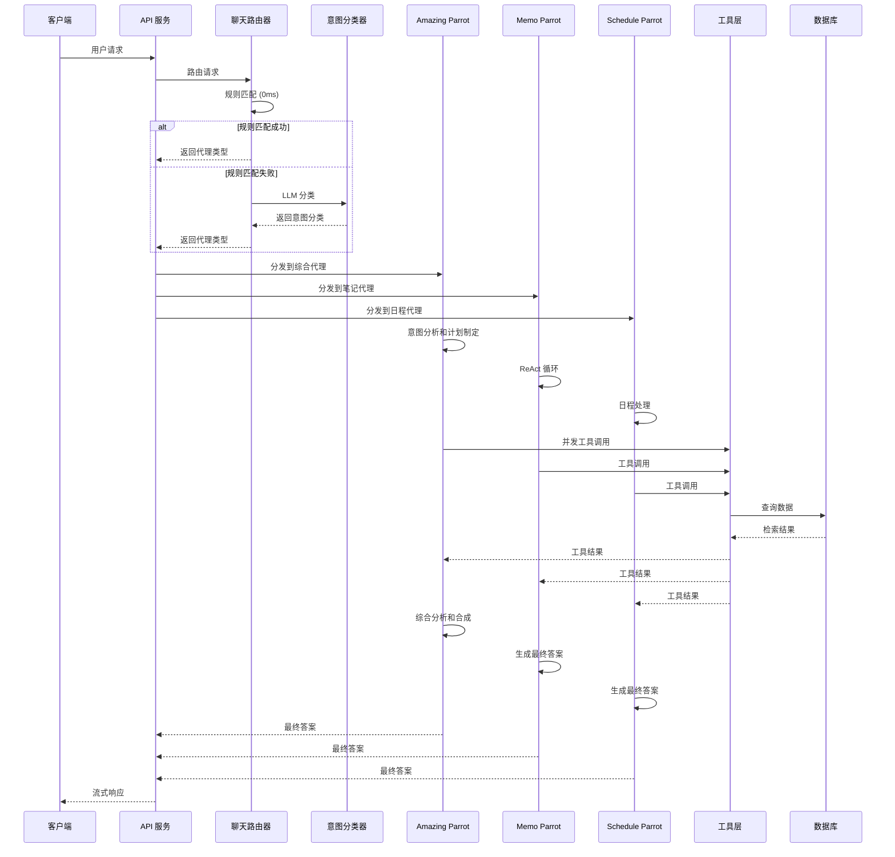

**图表来源**
- [chat_router.go](file://plugin/ai/agent/chat_router.go#L70-L101)
- [intent_classifier.go](file://plugin/ai/agent/intent_classifier.go#L104-L125)
- [amazing_parrot.go](file://plugin/ai/agent/amazing_parrot.go#L106-L184)
- [memo_parrot.go](file://plugin/ai/agent/memo_parrot.go#L111-L213)
- [schedule_parrot_v2.go](file://plugin/ai/agent/schedule_parrot_v2.go#L32-L77)

## 详细组件分析

### Amazing Parrot 组件分析
Amazing Parrot 代表了系统最复杂的代理，实现了两阶段并发检索策略：

#### 核心架构设计
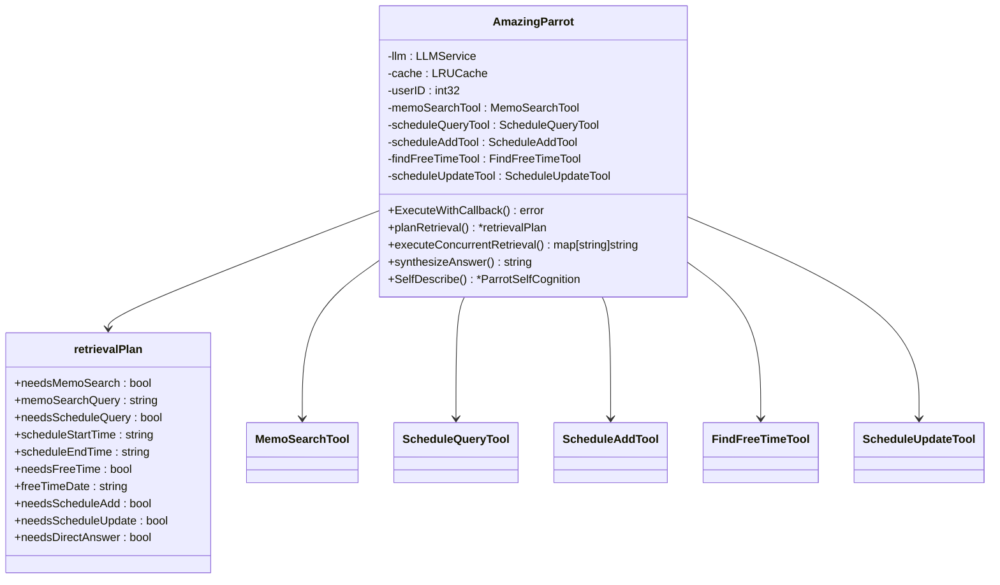

**图表来源**
- [amazing_parrot.go](file://plugin/ai/agent/amazing_parrot.go#L22-L91)
- [amazing_parrot.go](file://plugin/ai/agent/amazing_parrot.go#L33-L47)

#### 并发检索执行流程
Amazing Parrot 的执行流程体现了高度优化的性能设计：

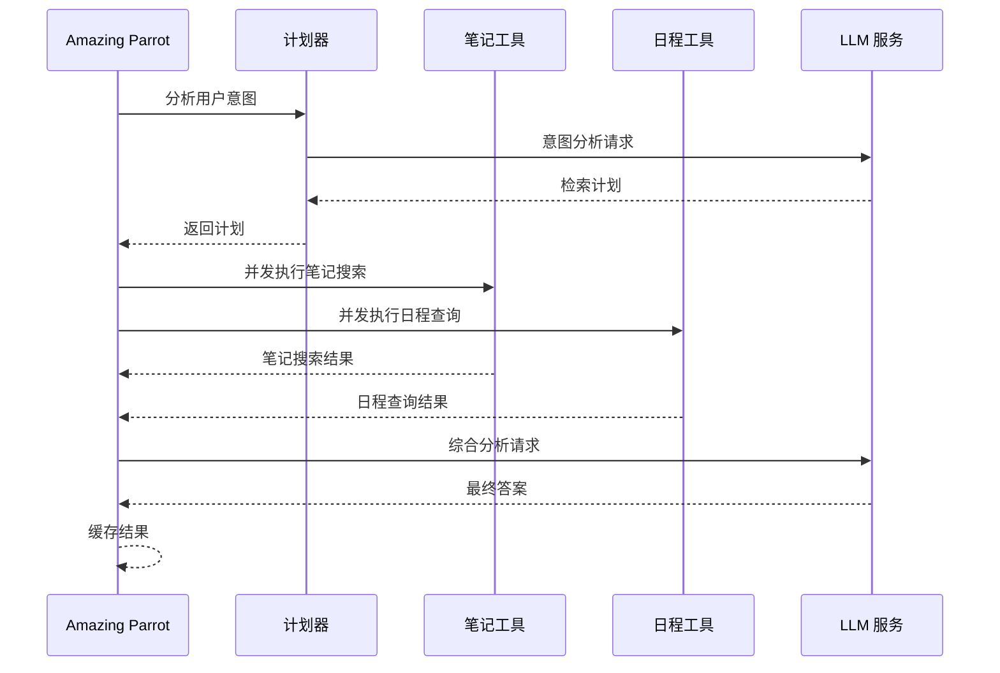

**图表来源**
- [amazing_parrot.go](file://plugin/ai/agent/amazing_parrot.go#L106-L184)
- [amazing_parrot.go](file://plugin/ai/agent/amazing_parrot.go#L227-L387)

**章节来源**
- [amazing_parrot.go](file://plugin/ai/agent/amazing_parrot.go#L19-L666)

### Memo Parrot 组件分析
Memo Parrot 实现了经典的 ReAct（推理-行动）循环模式：

#### ReAct 循环架构
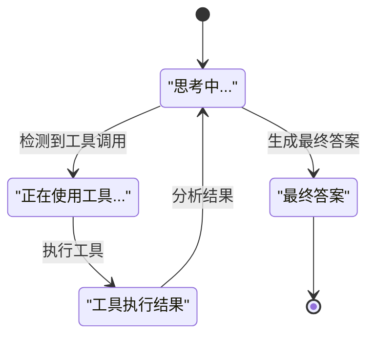

**图表来源**
- [memo_parrot.go](file://plugin/ai/agent/memo_parrot.go#L139-L289)

#### 工具调用解析机制
Memo Parrot 通过智能解析 LLM 响应中的工具调用指令：


**图表来源**
- [memo_parrot.go](file://plugin/ai/agent/memo_parrot.go#L180-L213)
- [memo_parrot.go](file://plugin/ai/agent/memo_parrot.go#L334-L383)

**章节来源**
- [memo_parrot.go](file://plugin/ai/agent/memo_parrot.go#L26-L459)

### Schedule Parrot 组件分析
Schedule Parrot 采用框架无关的设计理念，通过适配器实现与新框架的无缝集成：

#### 代理适配器模式
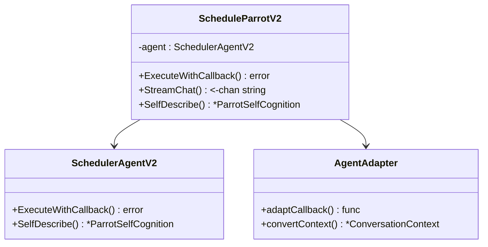

**图表来源**
- [schedule_parrot_v2.go](file://plugin/ai/agent/schedule_parrot_v2.go#L11-L24)
- [schedule_parrot_v2.go](file://plugin/ai/agent/schedule_parrot_v2.go#L31-L77)

#### 时间区缓存优化
Schedule 工具实现了高性能的时间区缓存机制：

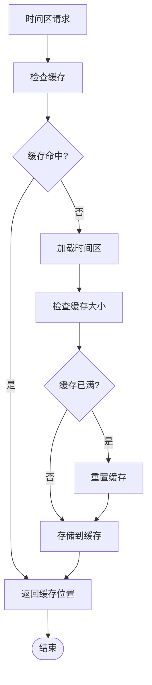

**图表来源**
- [scheduler.go](file://plugin/ai/agent/tools/scheduler.go#L48-L94)

**章节来源**
- [schedule_parrot_v2.go](file://plugin/ai/agent/schedule_parrot_v2.go#L9-L173)
- [scheduler.go](file://plugin/ai/agent/tools/scheduler.go#L30-L94)

### 工具调用系统分析
系统实现了完整的工具调用生态系统，支持多种工具类型和执行模式：

#### 工具适配器架构
```mermaid
classDiagram
class ToolWithSchema {
<<interface>>
+Name() string
+Description() string
+Parameters() map[string]interface{}
+Run() (string, error)
}
class NativeTool {
-name : string
-description : string
-execute : func
-params : map[string]interface{}
+Name() string
+Description() string
+Parameters() map[string]interface{}
+Run() (string, error)
}
class Agent {
-llm : LLMService
-config : AgentConfig
-tools : []ToolWithSchema
-toolMap : map[string]ToolWithSchema
+RunWithCallback() (string, error)
+toolDescriptors() []ToolDescriptor
+executeTool() (string, error)
}
ToolWithSchema <|-- NativeTool
Agent --> ToolWithSchema
```

**图表来源**
- [tool_adapter.go](file://plugin/ai/agent/tool_adapter.go#L12-L86)
- [tool_adapter.go](file://plugin/ai/agent/tool_adapter.go#L79-L117)

#### 事件回调系统
系统提供了丰富的事件类型，支持实时的状态反馈：


**图表来源**
- [types.go](file://plugin/ai/agent/types.go#L117-L139)

**章节来源**
- [tool_adapter.go](file://plugin/ai/agent/tool_adapter.go#L12-L322)
- [types.go](file://plugin/ai/agent/types.go#L10-L353)

## 聊天路由系统
新增的聊天路由系统实现了智能代理选择功能，通过混合规则匹配和 LLM 分类提供高效的用户意图识别。

### 路由器架构设计
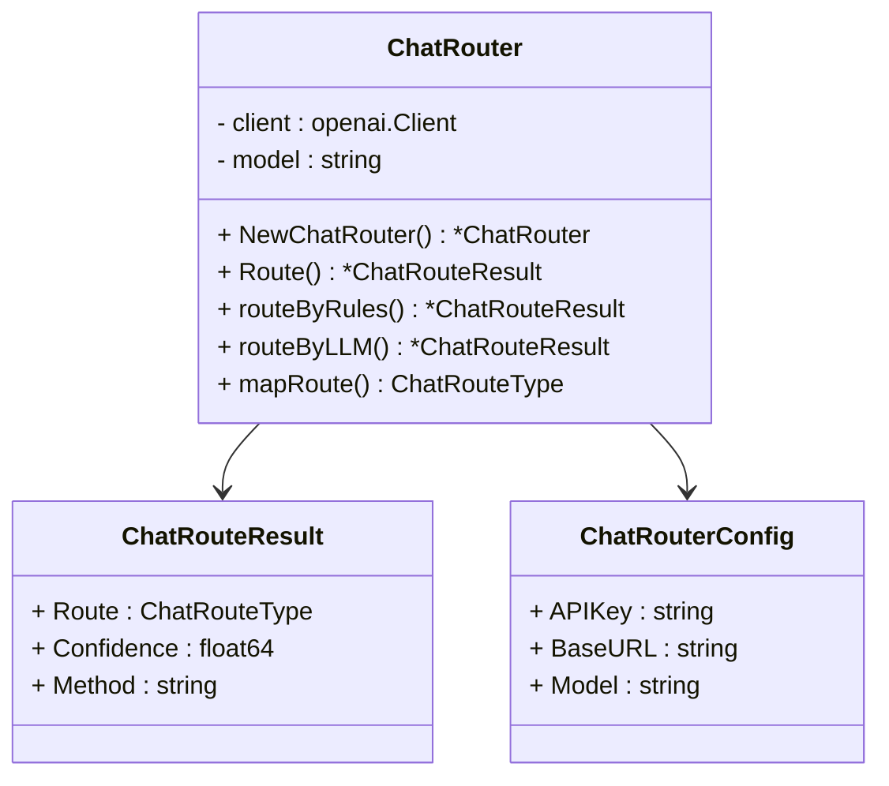

**图表来源**
- [chat_router.go](file://plugin/ai/agent/chat_router.go#L42-L68)
- [chat_router.go](file://plugin/ai/agent/chat_router.go#L28-L33)
- [chat_router.go](file://plugin/ai/agent/chat_router.go#L35-L40)

### 混合路由策略
聊天路由系统采用"规则优先 + LLM 备选"的混合策略：

#### 规则匹配阶段（0ms 延迟）
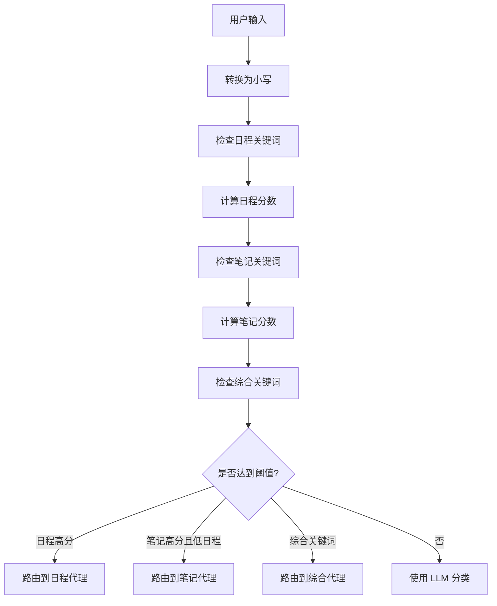

**图表来源**
- [chat_router.go](file://plugin/ai/agent/chat_router.go#L103-L180)

#### LLM 分类阶段（~400ms 延迟）
当规则匹配无法确定时，系统使用 LLM 进行精确分类：

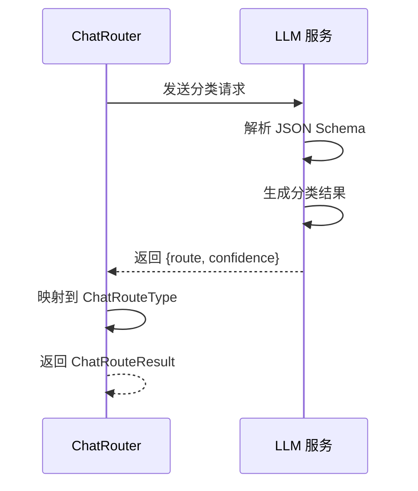

**图表来源**
- [chat_router.go](file://plugin/ai/agent/chat_router.go#L182-L250)

### 路由配置和性能
聊天路由器支持灵活的配置选项：

| 配置项 | 默认值 | 说明 |
|--------|--------|------|
| APIKey | 必需 | LLM 服务认证密钥 |
| BaseURL | https://api.siliconflow.cn/v1 | LLM 服务基础 URL |
| Model | Qwen/Qwen2.5-7B-Instruct | 分类模型名称 |

**章节来源**
- [chat_router.go](file://plugin/ai/agent/chat_router.go#L1-L291)
- [chat_router_test.go](file://plugin/ai/agent/chat_router_test.go#L1-L260)

## 意图分类系统
意图分类系统为日程处理提供了更精细的任务分类能力，支持规则和 LLM 两种分类方式。

### 规则分类器架构
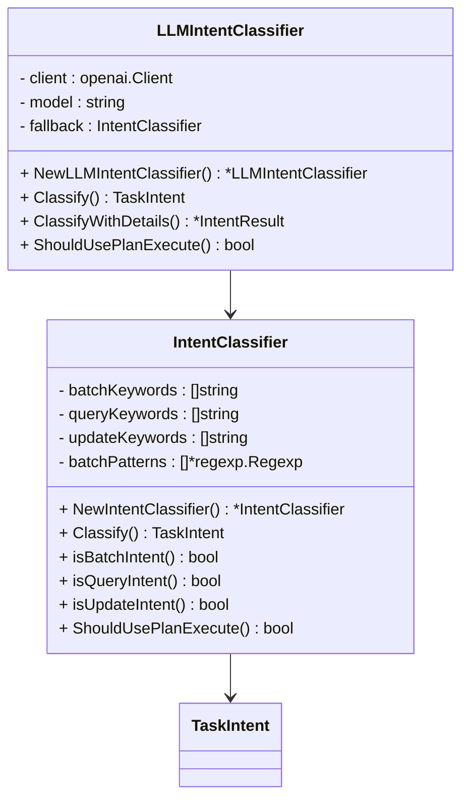

**图表来源**
- [intent_classifier.go](file://plugin/ai/agent/intent_classifier.go#L31-L47)
- [llm_intent_classifier.go](file://plugin/ai/agent/llm_intent_classifier.go#L22-L31)

### 任务意图分类
系统支持六种不同的任务意图：

| 意图类型 | 描述 | 示例 | 执行模式 |
|----------|------|------|----------|
| IntentSimpleCreate | 单个日程创建 | "明天下午3点开会" | ReAct 模式 |
| IntentSimpleQuery | 日程查询 | "今天有什么安排" | ReAct 模式 |
| IntentSimpleUpdate | 日程修改 | "把会议改到4点" | ReAct 模式 |
| IntentBatchCreate | 批量日程创建 | "每天下午2点开会" | 计划-执行模式 |
| IntentConflictResolve | 冲突解决 | "有冲突怎么办" | 计划-执行模式 |
| IntentMultiQuery | 综合查询 | "本周工作汇总" | 计划-执行模式 |

### 分类算法实现
规则分类器采用多层过滤机制：

#### 批量意图检测
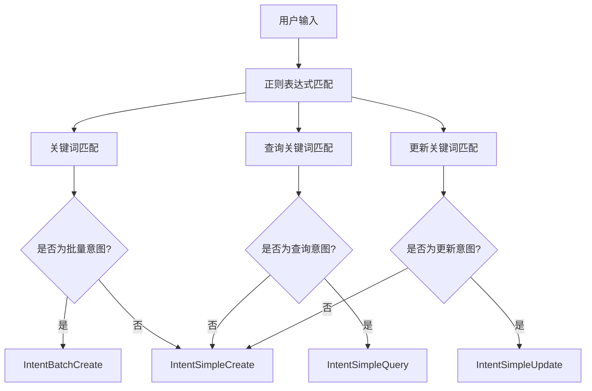

**图表来源**
- [intent_classifier.go](file://plugin/ai/agent/intent_classifier.go#L104-L125)

#### LLM 分类器增强
LLM 分类器提供更高的准确性，支持详细的置信度评估：

```mermaid
sequenceDiagram
participant LLMIC as LLMIntentClassifier
participant LLM : LLM 服务
LLMIC->>LLMIC : 构建分类提示
LLMIC->>LLM : 发送分类请求
LLM->>LLM : 严格 JSON Schema 解析
LLM->>LLM : 生成分类结果
LLM-->>LLMIC : 返回 {intent, confidence, reasoning}
LLMIC->>LLMIC : 解析响应并映射
LLMIC-->>LLMIC : 返回 IntentResult
```

**图表来源**
- [llm_intent_classifier.go](file://plugin/ai/agent/llm_intent_classifier.go#L76-L140)

**章节来源**
- [intent_classifier.go](file://plugin/ai/agent/intent_classifier.go#L1-L211)
- [llm_intent_classifier.go](file://plugin/ai/agent/llm_intent_classifier.go#L1-L286)

## 语义化主题令牌

### 主题系统概述
系统采用统一的语义化主题令牌设计，移除了复杂的多代理主题系统，确保三个核心代理在视觉上保持一致的品牌风格。主题系统基于 OKLCH 颜色空间，提供更好的感知均匀性和可访问性。

### 颜色系统设计
```mermaid
graph TB
subgraph "OKLCH 颜色空间"
Primary[主品牌色 --primary]
Secondary[辅助色 --secondary]
Background[背景色 --background]
Card[卡片色 --card]
Accent[强调色 --accent]
Destructive[危险色 --destructive]
End
subgraph "代理主题映射"
MEMO[灰灰 - 笔记代理]
SCHEDULE[金刚 - 日程代理]
AMAZING[惊奇 - 综合代理]
End
Primary --> MEMO
Primary --> SCHEDULE
Primary --> AMAZING
Secondary --> MEMO
Secondary --> SCHEDULE
Secondary --> AMAZING
Background --> MEMO
Background --> SCHEDULE
Background --> AMAZING
```

**图表来源**
- [COLOR_GUIDE.md](file://web/src/themes/COLOR_GUIDE.md#L1-L122)
- [default.css](file://web/src/themes/default.css#L1-L124)
- [parrot.ts](file://web/src/types/parrot.ts#L298-L350)

### 语义化主题令牌
系统定义了完整的语义化主题令牌体系：

#### 主要品牌令牌
| 令牌名称 | 用途 | 浅色主题 | 深色主题 |
|----------|------|----------|----------|
| `--primary` | 主品牌色，主要操作按钮 | 金黄色 | 更亮的金色 |
| `--primary-foreground` | 主品牌前景色 | 白色 | 白色 |
| `--secondary` | 辅助动作 | 浅灰色 | 很浅灰色 |
| `--secondary-foreground` | 辅助动作前景色 | 深灰色 | 深灰色 |

#### 背景和表面令牌
| 令牌名称 | 用途 | 浅色主题 | 深色主题 |
|----------|------|----------|----------|
| `--background` | 页面背景 | 接近白色 | 深灰色 |
| `--card` | 卡片/容器背景 | 接近白色 | 深灰色 |
| `--card-foreground` | 卡片文本 | 非常深 | 接近白色 |
| `--popover` | 弹出层背景 | 纯白色 | 更深灰色 |

#### 文本和内容令牌
| 令牌名称 | 用途 | 浅色主题 | 深色主题 |
|----------|------|----------|----------|
| `--foreground` | 主要文本颜色 | 深灰色 | 浅灰色 |
| `--muted` | 次要背景区域 | 浅灰色 | 非常深 |
| `--muted-foreground` | 次要文本 | 中灰色 | 中等浅灰色 |

#### 交互元素令牌
| 令牌名称 | 用途 | 浅色主题 | 深色主题 |
|----------|------|----------|----------|
| `--accent` | 悬停状态，选中项 | 浅灰色 | 非常深 |
| `--accent-foreground` | 强调背景文本 | 深灰色 | 浅灰色 |
| `--border` | 分隔线，输入边框 | 中等浅 | 中等深 |
| `--input` | 表单输入背景 | 中等浅 | 中等深 |

#### 反馈颜色令牌
| 令牌名称 | 用途 | 浅色主题 | 深色主题 |
|----------|------|----------|----------|
| `--destructive` | 错误状态，危险操作 | 非常深 | 红色 |
| `--destructive-foreground` | 危险背景文本 | 白色 | 白色 |

### 代理主题映射
系统为三个核心代理定义了统一的主题映射关系：

#### 灰灰（Memo）主题
- **主色调**：slate-800 / slate-300（浅色/深色）
- **强调色**：red-500
- **文本色**：slate-800 / slate-100
- **边框色**：slate-200 / slate-700

#### 金刚（Schedule）主题
- **主色调**：cyan-600 / cyan-500
- **强调色**：cyan-500
- **文本色**：slate-800 / cyan-50
- **边框色**：cyan-200 / cyan-700

#### 惊奇（Amazing）主题
- **主色调**：emerald-600 / emerald-500
- **强调色**：emerald-500
- **文本色**：slate-800 / emerald-50
- **边框色**：emerald-200 / emerald-700

### 主题切换机制
系统支持自动主题切换，基于 `.dark` 类名实现：

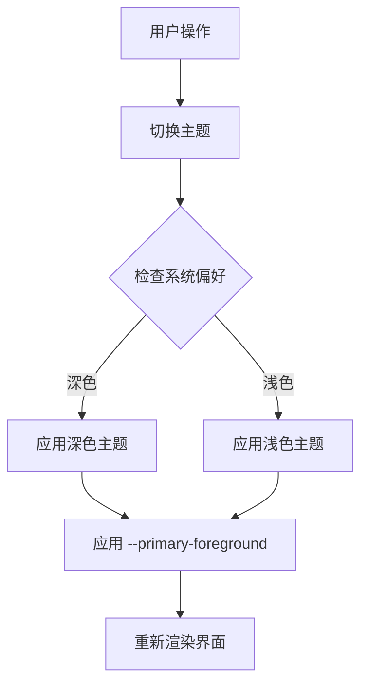

**图表来源**
- [theme.ts](file://web/src/utils/theme.ts#L56-L70)

**章节来源**
- [parrot.ts](file://web/src/types/parrot.ts#L298-L361)
- [COLOR_GUIDE.md](file://web/src/themes/COLOR_GUIDE.md#L1-L259)
- [default.css](file://web/src/themes/default.css#L1-L124)
- [default-dark.css](file://web/src/themes/default-dark.css#L1-L124)
- [midnight.css](file://web/src/themes/midnight.css#L1-L124)
- [paper.css](file://web/src/themes/paper.css#L1-L124)
- [whitewall.css](file://web/src/themes/whitewall.css#L1-L124)
- [theme.ts](file://web/src/utils/theme.ts#L48-L70)

## 依赖关系分析

### 组件耦合度分析
系统采用了松耦合的设计原则，通过接口抽象实现模块间的解耦：

```mermaid
graph TB
subgraph "路由层"
CR[聊天路由器]
IC[意图分类器]
end
subgraph "代理层"
AP[Amazing Parrot]
MP[Memo Parrot]
SP[Schedule Parrot]
end
subgraph "工具层"
MT[Memo Tools]
ST[Schedule Tools]
TA[Tool Adapter]
end
subgraph "服务层"
LLM[LLM Service]
RET[Retriever]
SVC[Schedule Service]
end
subgraph "基础设施"
DB[(Database)]
CACHE[Cache]
LOG[Logger]
THEME[主题系统]
END
CR --> AP
CR --> MP
CR --> SP
IC --> AP
IC --> MP
IC --> SP
AP --> MT
AP --> ST
MP --> MT
SP --> ST
MT --> RET
ST --> SVC
MT --> LLM
ST --> LLM
AP --> CACHE
MP --> CACHE
MT --> DB
ST --> DB
AP --> LOG
MP --> LOG
SP --> LOG
AP --> THEME
MP --> THEME
SP --> THEME
```

**图表来源**
- [chat_router.go](file://plugin/ai/agent/chat_router.go#L1-L12)
- [intent_classifier.go](file://plugin/ai/agent/intent_classifier.go#L1-L7)
- [amazing_parrot.go](file://plugin/ai/agent/amazing_parrot.go#L3-L17)
- [parrot.ts](file://web/src/types/parrot.ts#L298-L350)

### 错误处理依赖链
系统实现了完整的错误分类和处理机制：

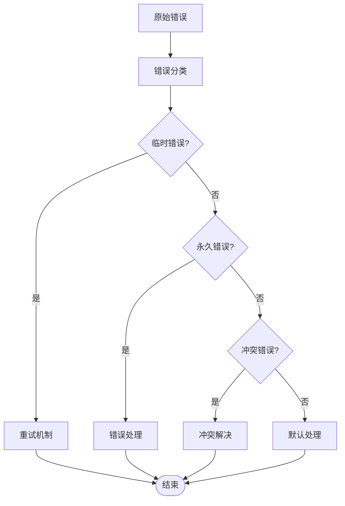

**图表来源**
- [error_class.go](file://plugin/ai/agent/error_class.go#L84-L149)

**章节来源**
- [error_class.go](file://plugin/ai/agent/error_class.go#L17-L232)

## 性能考虑
系统在多个层面实现了性能优化策略：

### 路由系统性能优化
聊天路由系统采用混合策略实现最优性能：

#### 规则匹配优化
- **零延迟路由**：规则匹配在微秒级别完成
- **预编译正则表达式**：减少运行时编译开销
- **多关键词并行检查**：使用计数器避免重复扫描
- **阈值优化**：不同意图类型使用不同阈值

#### LLM 分类优化
- **轻量级模型**：使用 Qwen/Qwen2.5-7B-Instruct 提供快速响应
- **严格 JSON Schema**：确保输出格式一致性，减少解析开销
- **超时控制**：10秒超时防止阻塞
- **降级策略**：LLM 失败时自动回退到规则分类

### 缓存策略
- **LRU 缓存**：支持最大条目数和 TTL 设置
- **哈希键生成**：使用 SHA256 防止内存溢出
- **统计监控**：实时跟踪命中率和性能指标

### 并发优化
- **两阶段并发检索**：先分析后执行，最大化并行度
- **goroutine 管理**：使用 WaitGroup 和互斥锁保证线程安全
- **超时控制**：为每个操作设置合理的超时时间

### 内存管理
- **上下文清理**：定期清理过期的对话上下文
- **工具缓存**：时间区等昂贵资源的缓存复用
- **批量处理**：支持批量工具调用减少开销

### 主题系统优化
- **CSS 自定义属性**：基于 OKLCH 颜色空间，提供更好的感知均匀性
- **主题切换**：通过 `.dark` 类名实现快速主题切换
- **语义化令牌**：统一的颜色令牌命名规范，便于维护和扩展

**章节来源**
- [chat_router.go](file://plugin/ai/agent/chat_router.go#L182-L250)
- [llm_intent_classifier.go](file://plugin/ai/agent/llm_intent_classifier.go#L76-L140)
- [parrot.ts](file://web/src/types/parrot.ts#L298-L361)

## 故障排除指南

### 错误分类和处理策略
系统实现了智能的错误分类机制：

#### 错误类型分类
- **临时错误**：网络超时、服务不可用等，支持自动重试
- **永久错误**：参数验证失败、权限不足等，直接返回错误
- **冲突错误**：日程冲突等特殊场景，提供解决方案建议

#### 重试机制
```mermaid
flowchart TD
Attempt[尝试执行] --> Success{"执行成功?"}
Success --> |是| Complete[完成]
Success --> |否| CheckError[检查错误类型]
CheckError --> Transient{"临时错误?"}
Transient --> |是| Delay[延迟重试]
Transient --> |否| PermanentError[永久错误]
Delay --> Attempt
PermanentError --> Fail[失败]
Complete --> End([结束])
Fail --> End
```

**图表来源**
- [error_class.go](file://plugin/ai/agent/error_class.go#L209-L231)

### 路由系统故障排除
新增的路由系统可能遇到的问题：

#### 路由错误诊断
- **规则匹配失败**：检查关键词列表和阈值设置
- **LLM 分类错误**：验证 API 密钥和模型配置
- **路由结果异常**：监控置信度分数和回退机制

#### 意图分类问题
- **规则分类不准确**：扩展关键词列表和正则表达式
- **LLM 分类不稳定**：检查模型参数和提示工程
- **混合模式失效**：验证回退逻辑和错误处理

### 主题系统故障排除
架构简化后的主题系统可能出现的问题：

#### 主题令牌问题
- **颜色不匹配**：检查 CSS 自定义属性是否正确应用
- **主题切换失败**：验证 `.dark` 类名是否正确切换
- **语义化令牌缺失**：确认主题文件中是否包含完整的令牌定义

#### 代理主题不一致
- **代理颜色差异**：检查 PARROT_THEMES 配置是否正确
- **主题映射错误**：验证代理类型与主题令牌的映射关系
- **响应式主题问题**：测试浅色和深色主题下的显示效果

### 常见问题诊断
- **工具调用失败**：检查工具参数格式和必需字段
- **缓存失效**：监控缓存命中率和内存使用情况
- **并发冲突**：检查 goroutine 数量和资源竞争
- **超时问题**：调整超时配置和网络连接参数
- **主题渲染问题**：验证 CSS 变量继承和主题切换逻辑

**章节来源**
- [error_class.go](file://plugin/ai/agent/error_class.go#L84-L232)
- [chat_router.go](file://plugin/ai/agent/chat_router.go#L70-L101)
- [intent_classifier.go](file://plugin/ai/agent/intent_classifier.go#L104-L125)
- [parrot.ts](file://web/src/types/parrot.ts#L298-L361)

## 结论
Parrot 多代理 AI 系统通过精心设计的架构实现了专业化分工与协同工作的完美平衡。四大代理各司其职，Amazing Parrot 作为大脑负责综合决策，Memo Parrot 专注知识检索，Schedule Parrot 专业日程管理，而工具适配器系统则提供了统一的执行框架。

**架构简化的价值**：
- **统一设计语言**：移除复杂的多代理主题系统，采用语义化主题令牌
- **更好的可访问性**：基于 OKLCH 颜色空间的主题系统提供更佳的感知均匀性
- **简化维护成本**：统一的主题映射减少了代码重复和维护复杂度
- **提升用户体验**：一致的视觉风格增强了产品的专业性和易用性

系统的关键优势包括：
- **模块化设计**：清晰的职责分离和接口抽象
- **性能优化**：多层缓存、并发执行和智能重试
- **可观测性**：完整的事件回调和错误分类机制
- **扩展性**：框架无关的设计支持未来功能扩展
- **主题一致性**：语义化主题令牌确保三个核心代理的视觉统一

通过这种设计，系统不仅能够提供高质量的智能助手体验，还为未来的功能扩展和技术演进奠定了坚实的基础。架构简化后的系统在保持强大功能的同时，显著提升了可维护性和用户体验的一致性。