# Parrot 多代理 AI 系统

<cite>
**本文档引用的文件**
- [amazing_parrot.go](file://plugin/ai/agent/amazing_parrot.go)
- [memo_parrot.go](file://plugin/ai/agent/memo_parrot.go)
- [schedule_parrot_v2.go](file://plugin/ai/agent/schedule_parrot_v2.go)
- [tool_adapter.go](file://plugin/ai/agent/tool_adapter.go)
- [context.go](file://plugin/ai/agent/context.go)
- [error_class.go](file://plugin/ai/agent/error_class.go)
- [types.go](file://plugin/ai/agent/types.go)
- [cache.go](file://plugin/ai/agent/cache.go)
- [memo_search.go](file://plugin/ai/agent/tools/memo_search.go)
- [scheduler.go](file://plugin/ai/agent/tools/scheduler.go)
- [ai_service.go](file://server/router/api/v1/ai_service.go)
- [config.go](file://plugin/ai/config.go)
</cite>

## 目录
1. [简介](#简介)
2. [项目结构](#项目结构)
3. [核心组件](#核心组件)
4. [架构概览](#架构概览)
5. [详细组件分析](#详细组件分析)
6. [依赖关系分析](#依赖关系分析)
7. [性能考虑](#性能考虑)
8. [故障排除指南](#故障排除指南)
9. [结论](#结论)

## 简介
Parrot 多代理 AI 系统是一个基于四个专门代理的智能助手平台，每个代理都针对特定领域进行了深度优化。系统的核心设计理念是"专业化分工 + 协同工作"，通过四个不同类型的代理实现全面的个人助理功能。

系统包含四大核心代理：
- **Amazing Parrot（惊奇）**：通用智能助手，具备笔记查询和日程管理的综合能力
- **Memo Parrot（灰灰）**：专注笔记查询和分析的专家代理
- **Schedule Parrot（金刚）**：专业日程管理和冲突检测的调度代理
- **代理协作机制**：实现跨代理的功能调用和上下文传递

该系统采用先进的工具调用架构，支持实时事件回调、智能错误分类和重试机制，以及完善的性能监控和缓存策略。

## 项目结构
系统采用模块化的分层架构设计，主要分为以下几个层次：

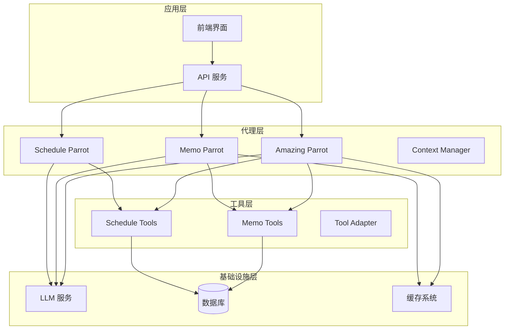

**图表来源**
- [amazing_parrot.go](file://plugin/ai/agent/amazing_parrot.go#L19-L31)
- [memo_parrot.go](file://plugin/ai/agent/memo_parrot.go#L26-L34)
- [schedule_parrot_v2.go](file://plugin/ai/agent/schedule_parrot_v2.go#L9-L13)

**章节来源**
- [amazing_parrot.go](file://plugin/ai/agent/amazing_parrot.go#L1-L666)
- [memo_parrot.go](file://plugin/ai/agent/memo_parrot.go#L1-L459)
- [schedule_parrot_v2.go](file://plugin/ai/agent/schedule_parrot_v2.go#L1-L173)

## 核心组件
系统的核心组件围绕四个代理代理展开，每个代理都有其独特的职责和专长：

### Amazing Parrot（惊奇）- 综合智能助手
作为系统的"大脑"，Amazing Parrot 负责：
- **双阶段并发检索**：意图分析 + 并发工具调用
- **多源数据整合**：同时查询笔记和日程信息
- **智能合成回答**：基于检索结果生成综合洞察
- **缓存优化**：LRU 缓存提升响应速度

### Memo Parrot（灰灰）- 笔记查询专家
专注于笔记管理的专业代理：
- **ReAct 循环**：思考 → 工具调用 → 反思的迭代过程
- **语义搜索**：基于向量嵌入的智能笔记检索
- **结构化结果**：提供标准化的查询结果格式
- **实时反馈**：通过事件回调提供执行进度

### Schedule Parrot（金刚）- 日程管理专家
专业的日程调度代理：
- **冲突检测**：自动识别和解决时间冲突
- **空闲时间查找**：智能推荐可用时间段
- **默认参数优化**：1小时默认时长，自动冲突调整
- **框架无关设计**：支持多种前端集成方式

### 工具适配器系统
提供统一的工具调用接口：
- **NativeTool**：原生函数执行的工具包装
- **ToolWithSchema**：支持 JSON Schema 的工具定义
- **Agent 框架**：轻量级无框架代理执行引擎
- **事件回调**：标准化的执行状态通知

**章节来源**
- [amazing_parrot.go](file://plugin/ai/agent/amazing_parrot.go#L19-L92)
- [memo_parrot.go](file://plugin/ai/agent/memo_parrot.go#L26-L66)
- [schedule_parrot_v2.go](file://plugin/ai/agent/schedule_parrot_v2.go#L9-L24)
- [tool_adapter.go](file://plugin/ai/agent/tool_adapter.go#L12-L86)

## 架构概览
系统采用事件驱动的异步架构，通过工具调用实现代理间的协作：

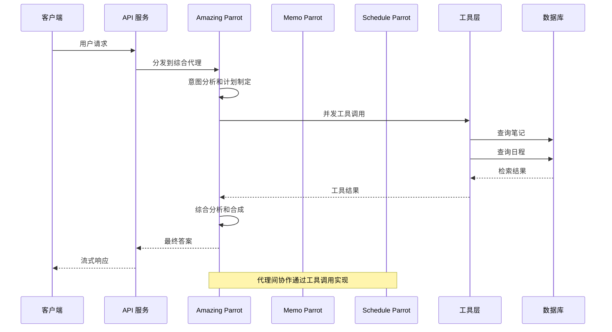

**图表来源**
- [amazing_parrot.go](file://plugin/ai/agent/amazing_parrot.go#L106-L184)
- [tool_adapter.go](file://plugin/ai/agent/tool_adapter.go#L135-L207)

系统还实现了事件驱动的工具调用机制：

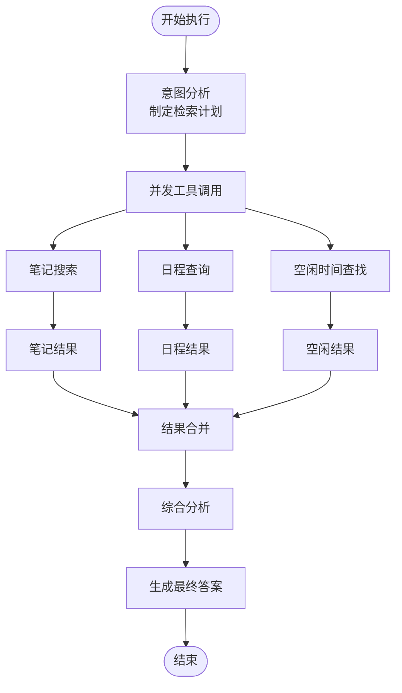

**图表来源**
- [amazing_parrot.go](file://plugin/ai/agent/amazing_parrot.go#L186-L225)
- [amazing_parrot.go](file://plugin/ai/agent/amazing_parrot.go#L227-L387)

## 详细组件分析

### Amazing Parrot 组件分析
Amazing Parrot 代表了系统最复杂的代理，实现了两阶段并发检索策略：

#### 核心架构设计
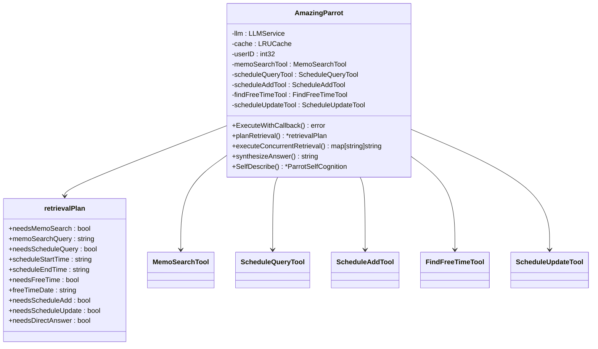

**图表来源**
- [amazing_parrot.go](file://plugin/ai/agent/amazing_parrot.go#L22-L91)
- [amazing_parrot.go](file://plugin/ai/agent/amazing_parrot.go#L33-L47)

#### 并发检索执行流程
Amazing Parrot 的执行流程体现了高度优化的性能设计：

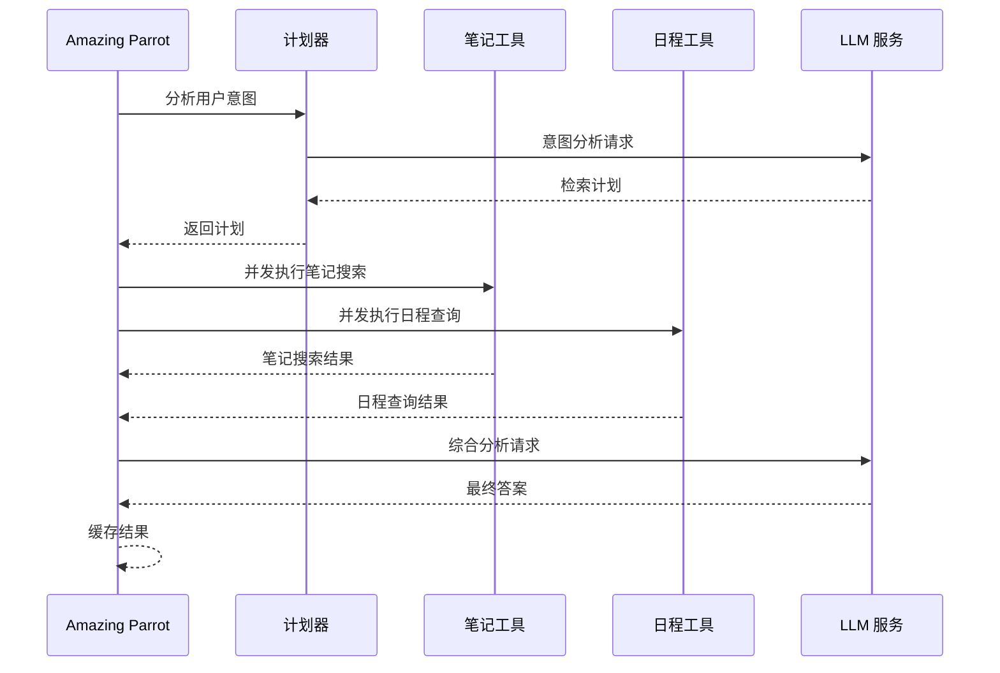

**图表来源**
- [amazing_parrot.go](file://plugin/ai/agent/amazing_parrot.go#L106-L184)
- [amazing_parrot.go](file://plugin/ai/agent/amazing_parrot.go#L227-L387)

**章节来源**
- [amazing_parrot.go](file://plugin/ai/agent/amazing_parrot.go#L19-L666)

### Memo Parrot 组件分析
Memo Parrot 实现了经典的 ReAct（推理-行动）循环模式：

#### ReAct 循环架构
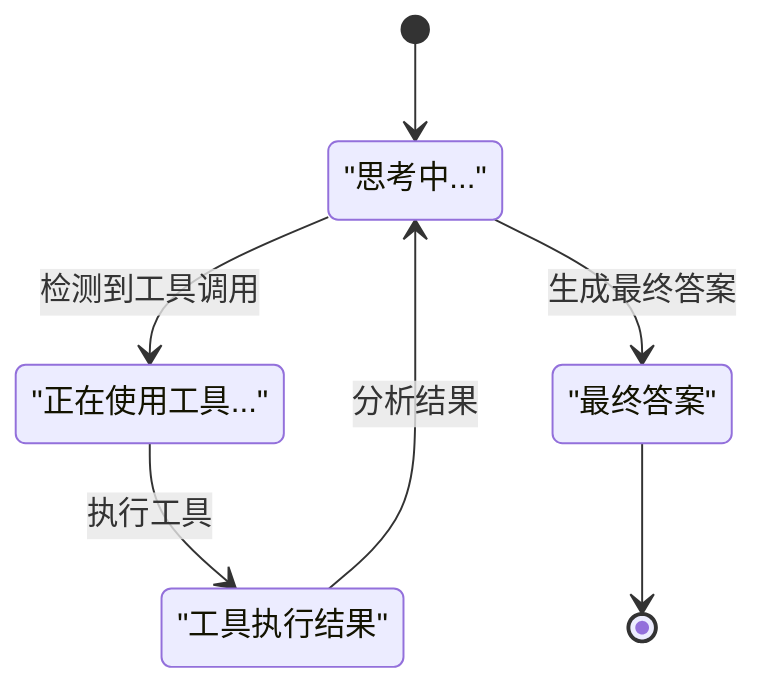

**图表来源**
- [memo_parrot.go](file://plugin/ai/agent/memo_parrot.go#L139-L289)

#### 工具调用解析机制
Memo Parrot 通过智能解析 LLM 响应中的工具调用指令：

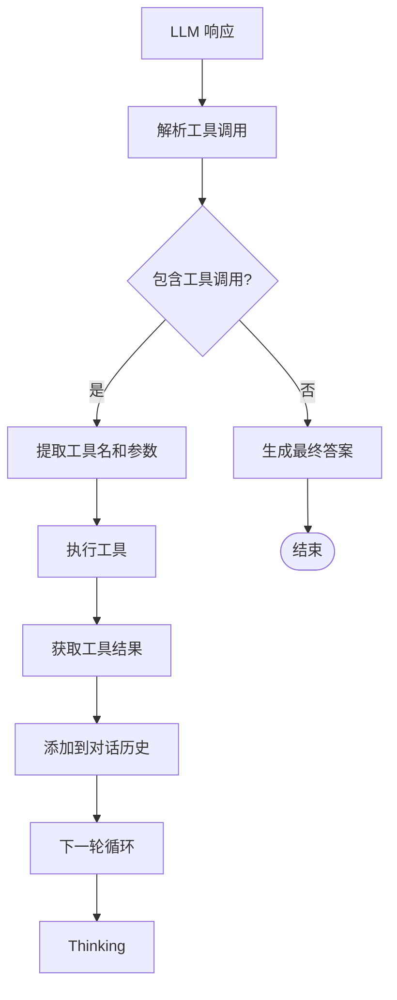

**图表来源**
- [memo_parrot.go](file://plugin/ai/agent/memo_parrot.go#L180-L213)
- [memo_parrot.go](file://plugin/ai/agent/memo_parrot.go#L334-L383)

**章节来源**
- [memo_parrot.go](file://plugin/ai/agent/memo_parrot.go#L26-L459)

### Schedule Parrot 组件分析
Schedule Parrot 采用框架无关的设计理念，通过适配器实现与新框架的无缝集成：

#### 代理适配器模式
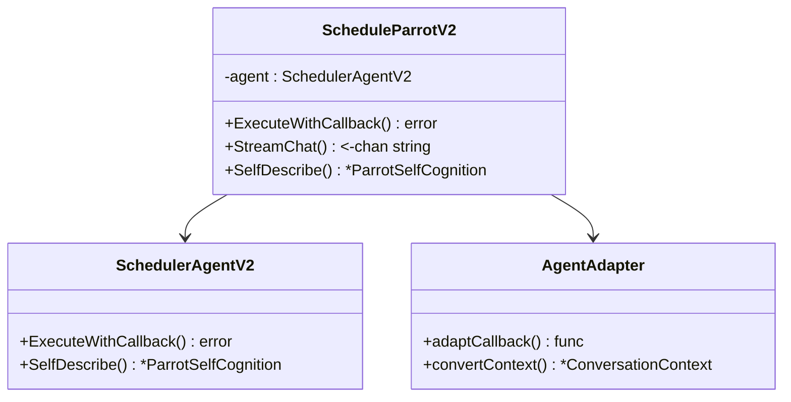

**图表来源**
- [schedule_parrot_v2.go](file://plugin/ai/agent/schedule_parrot_v2.go#L11-L24)
- [schedule_parrot_v2.go](file://plugin/ai/agent/schedule_parrot_v2.go#L31-L77)

#### 时间区缓存优化
Schedule 工具实现了高性能的时间区缓存机制：


**图表来源**
- [scheduler.go](file://plugin/ai/agent/tools/scheduler.go#L48-L94)

**章节来源**
- [schedule_parrot_v2.go](file://plugin/ai/agent/schedule_parrot_v2.go#L9-L173)
- [scheduler.go](file://plugin/ai/agent/tools/scheduler.go#L30-L94)

### 工具调用系统分析
系统实现了完整的工具调用生态系统，支持多种工具类型和执行模式：

#### 工具适配器架构
```mermaid
classDiagram
class ToolWithSchema {
<<interface>>
+Name() string
+Description() string
+Parameters() map[string]interface{}
+Run() (string, error)
}
class NativeTool {
-name : string
-description : string
-execute : func
-params : map[string]interface{}
+Name() string
+Description() string
+Parameters() map[string]interface{}
+Run() (string, error)
}
class Agent {
-llm : LLMService
-config : AgentConfig
-tools : []ToolWithSchema
-toolMap : map[string]ToolWithSchema
+RunWithCallback() (string, error)
+toolDescriptors() []ToolDescriptor
+executeTool() (string, error)
}
ToolWithSchema <|-- NativeTool
Agent --> ToolWithSchema
```

**图表来源**
- [tool_adapter.go](file://plugin/ai/agent/tool_adapter.go#L12-L86)
- [tool_adapter.go](file://plugin/ai/agent/tool_adapter.go#L79-L117)

#### 事件回调系统
系统提供了丰富的事件类型，支持实时的状态反馈：

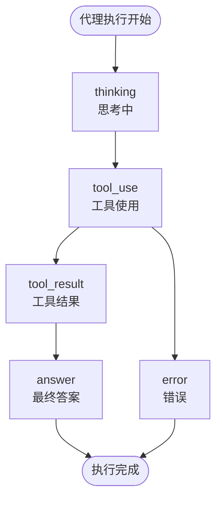

**图表来源**
- [types.go](file://plugin/ai/agent/types.go#L117-L139)

**章节来源**
- [tool_adapter.go](file://plugin/ai/agent/tool_adapter.go#L12-L237)
- [types.go](file://plugin/ai/agent/types.go#L10-L353)

## 依赖关系分析

### 组件耦合度分析
系统采用了松耦合的设计原则，通过接口抽象实现模块间的解耦：

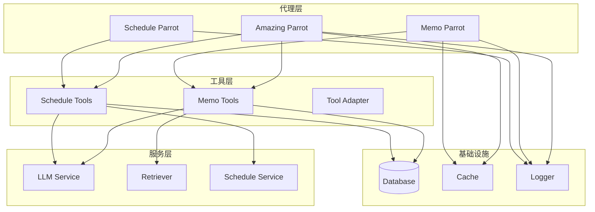

**图表来源**
- [amazing_parrot.go](file://plugin/ai/agent/amazing_parrot.go#L3-L17)
- [memo_parrot.go](file://plugin/ai/agent/memo_parrot.go#L3-L15)

### 错误处理依赖链
系统实现了完整的错误分类和处理机制：


**图表来源**
- [error_class.go](file://plugin/ai/agent/error_class.go#L84-L149)

**章节来源**
- [error_class.go](file://plugin/ai/agent/error_class.go#L17-L232)

## 性能考虑
系统在多个层面实现了性能优化策略：

### 缓存策略
- **LRU 缓存**：支持最大条目数和 TTL 设置
- **哈希键生成**：使用 SHA256 防止内存溢出
- **统计监控**：实时跟踪命中率和性能指标

### 并发优化
- **两阶段并发检索**：先分析后执行，最大化并行度
- **goroutine 管理**：使用 WaitGroup 和互斥锁保证线程安全
- **超时控制**：为每个操作设置合理的超时时间

### 内存管理
- **上下文清理**：定期清理过期的对话上下文
- **工具缓存**：时间区等昂贵资源的缓存复用
- **批量处理**：支持批量工具调用减少开销

## 故障排除指南

### 错误分类和处理策略
系统实现了智能的错误分类机制：

#### 错误类型分类
- **临时错误**：网络超时、服务不可用等，支持自动重试
- **永久错误**：参数验证失败、权限不足等，直接返回错误
- **冲突错误**：日程冲突等特殊场景，提供解决方案建议

#### 重试机制
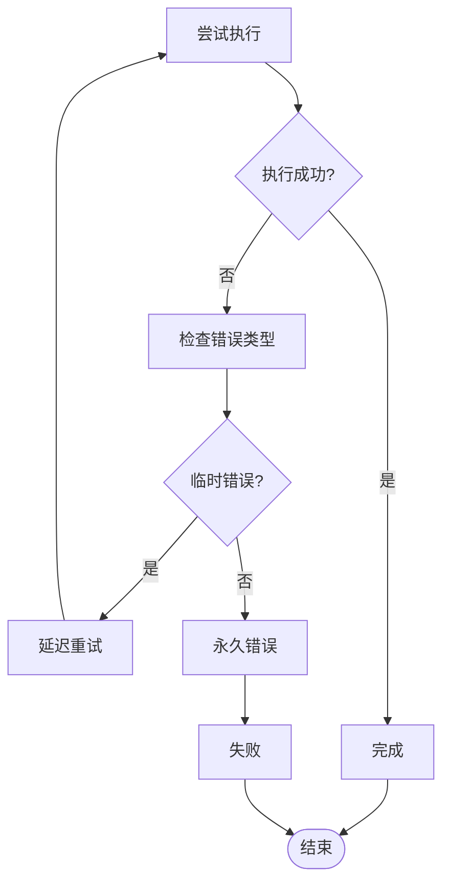

**图表来源**
- [error_class.go](file://plugin/ai/agent/error_class.go#L209-L231)

### 常见问题诊断
- **工具调用失败**：检查工具参数格式和必需字段
- **缓存失效**：监控缓存命中率和内存使用情况
- **并发冲突**：检查 goroutine 数量和资源竞争
- **超时问题**：调整超时配置和网络连接参数

**章节来源**
- [error_class.go](file://plugin/ai/agent/error_class.go#L84-L232)

## 结论
Parrot 多代理 AI 系统通过精心设计的架构实现了专业化分工与协同工作的完美平衡。四大代理各司其职，Amazing Parrot 作为大脑负责综合决策，Memo Parrot 专注知识检索，Schedule Parrot 专业日程管理，而工具适配器系统则提供了统一的执行框架。

系统的关键优势包括：
- **模块化设计**：清晰的职责分离和接口抽象
- **性能优化**：多层缓存、并发执行和智能重试
- **可观测性**：完整的事件回调和错误分类机制
- **扩展性**：框架无关的设计支持未来功能扩展

通过这种设计，系统不仅能够提供高质量的智能助手体验，还为未来的功能扩展和技术演进奠定了坚实的基础。