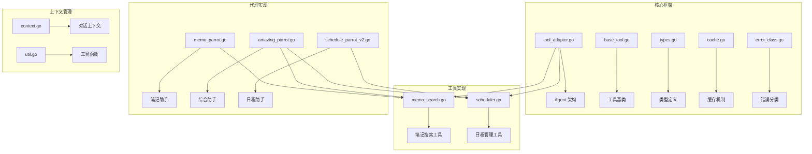
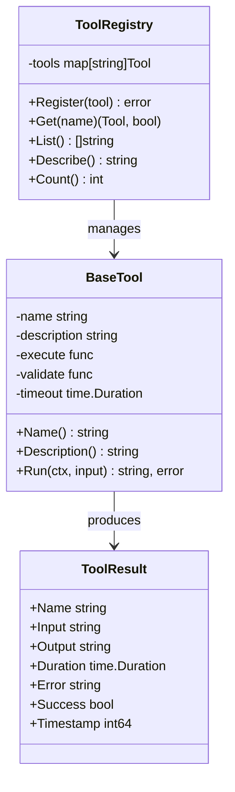
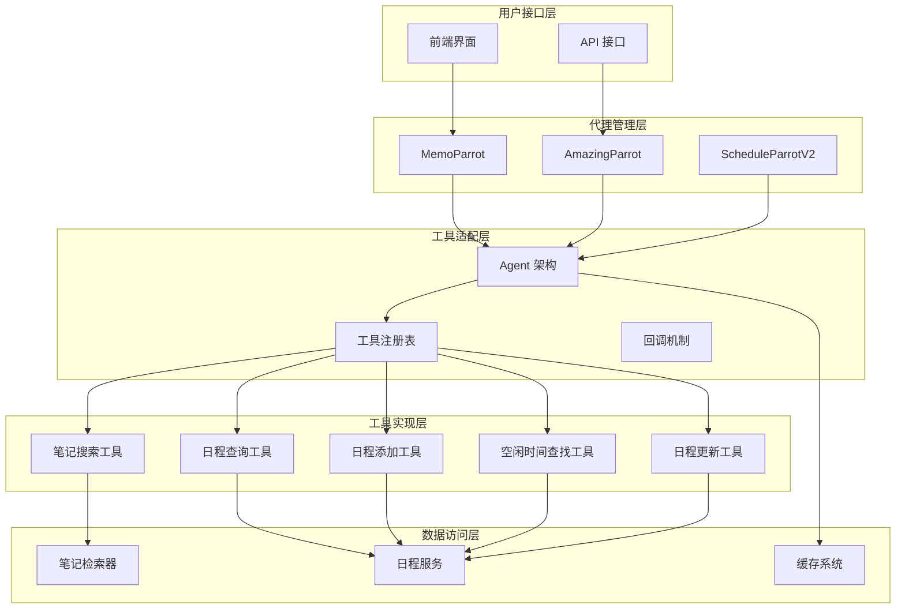
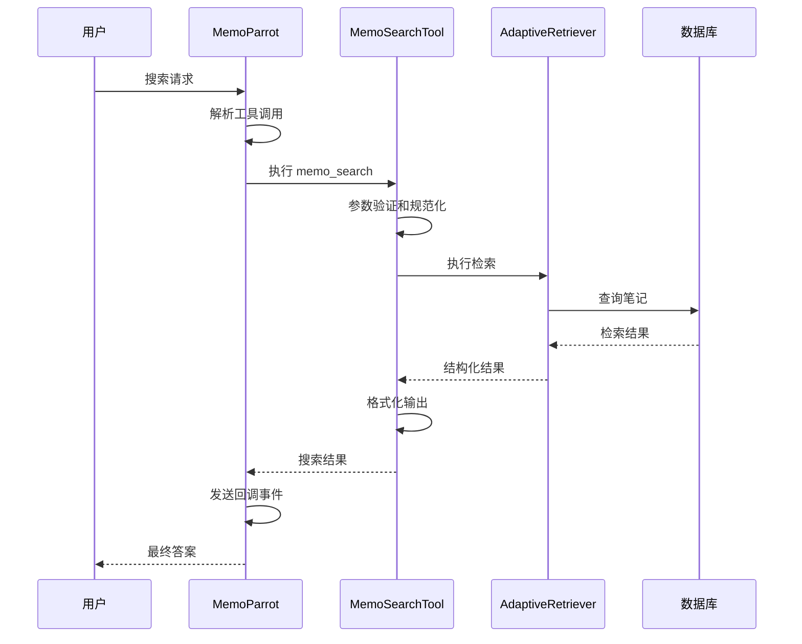
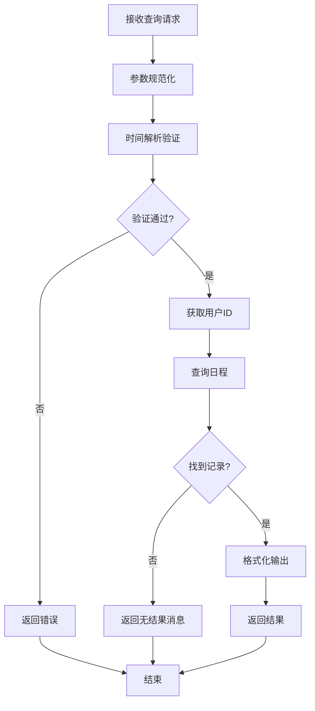
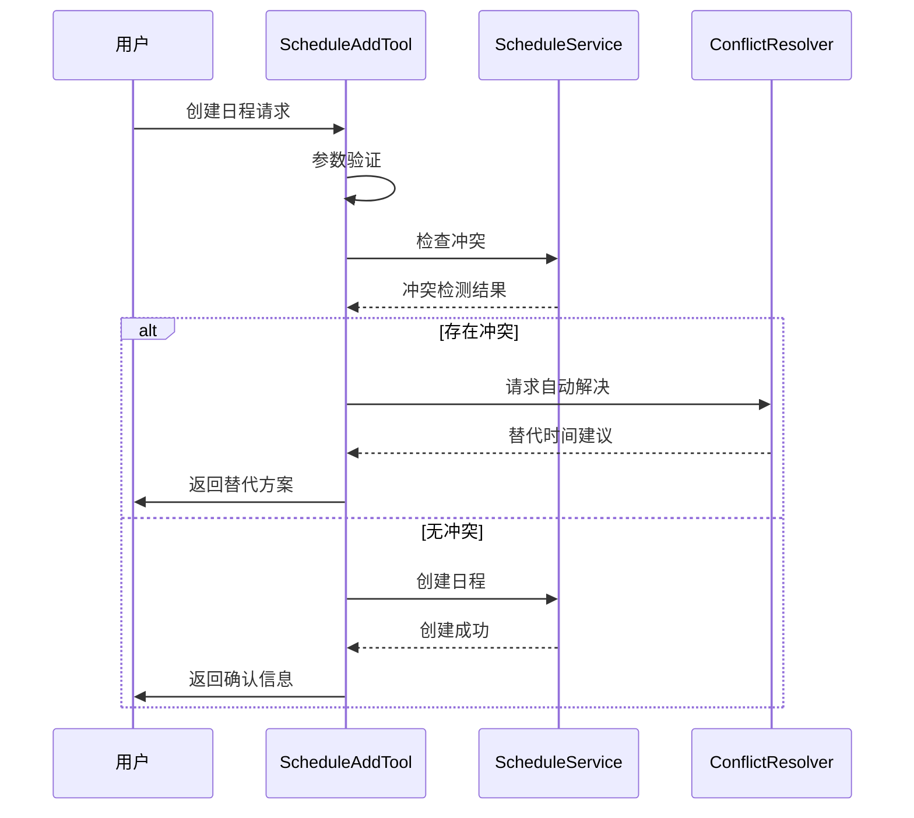
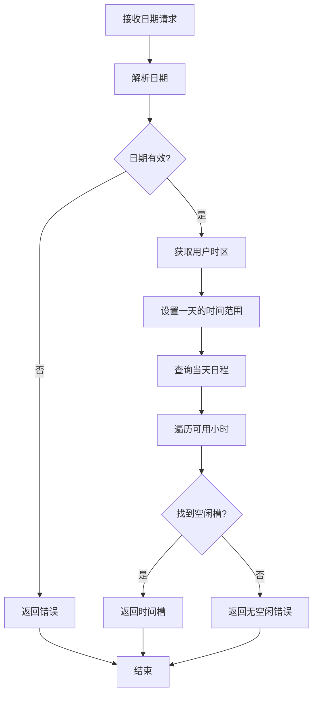
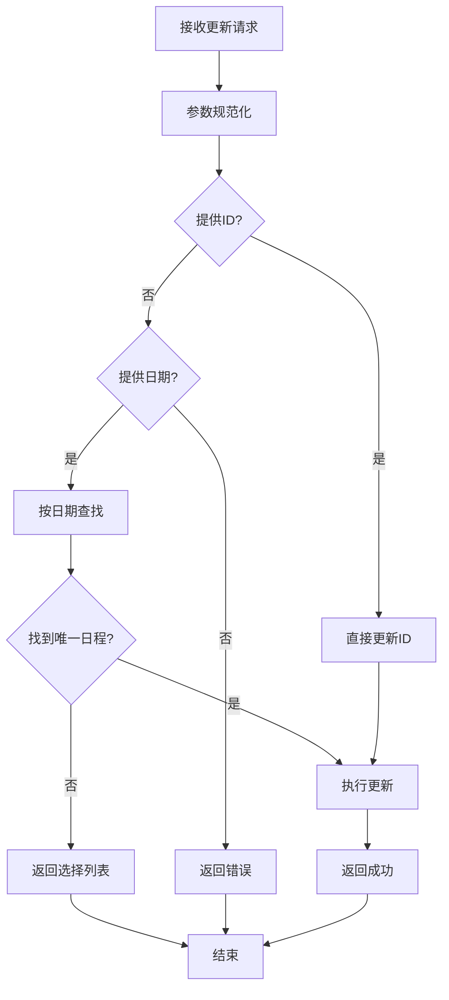
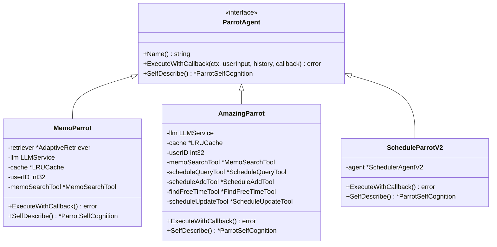
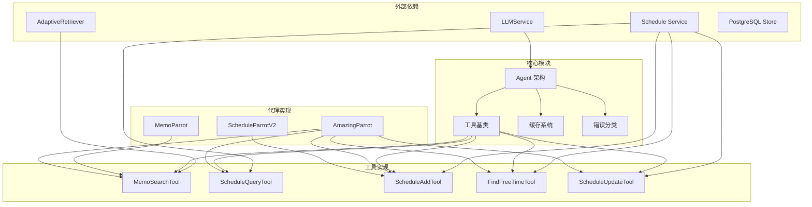

# Parrot 工具系统

<cite>
**本文档引用的文件**
- [tool_adapter.go](file://plugin/ai/agent/tool_adapter.go)
- [base_tool.go](file://plugin/ai/agent/base_tool.go)
- [types.go](file://plugin/ai/agent/types.go)
- [cache.go](file://plugin/ai/agent/cache.go)
- [error_class.go](file://plugin/ai/agent/error_class.go)
- [memo_search.go](file://plugin/ai/agent/tools/memo_search.go)
- [scheduler.go](file://plugin/ai/agent/tools/scheduler.go)
- [schedule_parrot_v2.go](file://plugin/ai/agent/schedule_parrot_v2.go)
- [memo_parrot.go](file://plugin/ai/agent/memo_parrot.go)
- [amazing_parrot.go](file://plugin/ai/agent/amazing_parrot.go)
- [context.go](file://plugin/ai/agent/context.go)
- [util.go](file://plugin/ai/agent/util.go)
- [scheduler_test.go](file://plugin/ai/agent/tools/scheduler_test.go)
</cite>

## 目录
1. [简介](#简介)
2. [项目结构](#项目结构)
3. [核心组件](#核心组件)
4. [架构概览](#架构概览)
5. [详细组件分析](#详细组件分析)
6. [依赖关系分析](#依赖关系分析)
7. [性能考虑](#性能考虑)
8. [故障排除指南](#故障排除指南)
9. [结论](#结论)
10. [附录](#附录)

## 简介

Parrot 工具系统是一个基于人工智能的智能代理工具集，专为 Memos 应用程序设计。该系统提供了多种鹦鹉代理（Parrot）来处理不同的任务场景，包括笔记搜索、日程管理和综合助手功能。

系统的核心设计理念是通过标准化的工具接口和统一的管理机制，实现工具的可扩展性和可维护性。每个工具都遵循统一的接口规范，支持参数验证、错误处理和缓存机制。

## 项目结构

Parrot 工具系统主要位于 `plugin/ai/agent/` 目录下，采用模块化的组织方式：



**图表来源**
- [tool_adapter.go](file://plugin/ai/agent/tool_adapter.go#L1-L237)
- [base_tool.go](file://plugin/ai/agent/base_tool.go#L1-L251)
- [types.go](file://plugin/ai/agent/types.go#L1-L353)

**章节来源**
- [tool_adapter.go](file://plugin/ai/agent/tool_adapter.go#L1-L237)
- [base_tool.go](file://plugin/ai/agent/base_tool.go#L1-L251)
- [types.go](file://plugin/ai/agent/types.go#L1-L353)

## 核心组件

### 工具适配器架构

工具适配器系统提供了统一的工具管理框架，支持新旧工具的兼容性：

```mermaid
classDiagram
class Tool {
<<interface>>
+Name() string
+Description() string
+Run(ctx, input) string, error
}
class ToolWithSchema {
<<interface>>
+Tool
+Parameters() map[string]interface{}
}
class NativeTool {
-name string
-description string
-execute func
-params map[string]interface{}
+Name() string
+Description() string
+Parameters() map[string]interface{}
+Run(ctx, input) string, error
}
class Agent {
-llm LLMService
-config AgentConfig
-tools []ToolWithSchema
-toolMap map[string]ToolWithSchema
+Run(ctx, input) string, error
+RunWithCallback(ctx, input, callback) string, error
+executeTool(ctx, name, input) string, error
}
ToolWithSchema <|-- NativeTool
Tool <|-- NativeTool
Agent --> ToolWithSchema : uses
```

**图表来源**
- [tool_adapter.go](file://plugin/ai/agent/tool_adapter.go#L12-L77)
- [base_tool.go](file://plugin/ai/agent/base_tool.go#L10-L32)

### 工具基类系统

基础工具类提供了统一的工具实现模式，包含输入验证、超时控制和错误处理：



**图表来源**
- [base_tool.go](file://plugin/ai/agent/base_tool.go#L24-L151)

**章节来源**
- [tool_adapter.go](file://plugin/ai/agent/tool_adapter.go#L1-L237)
- [base_tool.go](file://plugin/ai/agent/base_tool.go#L1-L251)

## 架构概览

Parrot 工具系统采用分层架构设计，实现了工具的标准化和统一管理：



**图表来源**
- [memo_parrot.go](file://plugin/ai/agent/memo_parrot.go#L26-L66)
- [amazing_parrot.go](file://plugin/ai/agent/amazing_parrot.go#L21-L31)
- [schedule_parrot_v2.go](file://plugin/ai/agent/schedule_parrot_v2.go#L11-L24)

## 详细组件分析

### 笔记搜索工具

笔记搜索工具是 Parrot 系统中最基础的工具，提供了语义化和关键词混合搜索能力：



**图表来源**
- [memo_search.go](file://plugin/ai/agent/tools/memo_search.go#L109-L193)
- [memo_parrot.go](file://plugin/ai/agent/memo_parrot.go#L234-L250)

笔记搜索工具的主要特性包括：

1. **智能参数处理**：支持驼峰命名和蛇形命名的 JSON 字段映射
2. **默认值管理**：提供合理的默认搜索限制和最小相关性分数
3. **结果过滤**：自动过滤非笔记类型的检索结果
4. **格式化输出**：提供友好的文本格式化结果

**章节来源**
- [memo_search.go](file://plugin/ai/agent/tools/memo_search.go#L1-L283)

### 日程查询工具

日程查询工具提供了精确的时间范围查询功能，是日程管理流程中的关键工具：



**图表来源**
- [scheduler.go](file://plugin/ai/agent/tools/scheduler.go#L183-L266)

日程查询工具的关键功能：

1. **时间格式兼容**：支持多种时间格式的解析
2. **输入验证**：严格的参数验证和边界检查
3. **用户权限**：基于用户上下文的安全检查
4. **结果格式化**：提供易读的用户友好格式

**章节来源**
- [scheduler.go](file://plugin/ai/agent/tools/scheduler.go#L132-L284)

### 日程添加工具

日程添加工具实现了完整的日程创建流程，包含冲突检测和自动解决机制：



**图表来源**
- [scheduler.go](file://plugin/ai/agent/tools/scheduler.go#L459-L614)

日程添加工具的核心特性：

1. **冲突检测**：自动检测时间冲突
2. **自动解决**：提供替代时间槽建议
3. **审计日志**：详细的操作记录
4. **错误处理**：完善的异常情况处理

**章节来源**
- [scheduler.go](file://plugin/ai/agent/tools/scheduler.go#L389-L677)

### 空闲时间查找工具

空闲时间查找工具专门用于在指定日期内寻找可用的时间槽：



**图表来源**
- [scheduler.go](file://plugin/ai/agent/tools/scheduler.go#L752-L836)

空闲时间查找工具的特点：

1. **时区支持**：基于用户时区进行日期解析
2. **工作时间限制**：仅在合理的工作时间内查找
3. **冲突避免**：自动跳过已有日程的时间槽
4. **错误处理**：明确的无空闲时间提示

**章节来源**
- [scheduler.go](file://plugin/ai/agent/tools/scheduler.go#L692-L836)

### 日程更新工具

日程更新工具提供了灵活的日程修改能力，支持多种更新方式：



**图表来源**
- [scheduler.go](file://plugin/ai/agent/tools/scheduler.go#L902-L1075)

日程更新工具的功能：

1. **多识别方式**：支持ID和日期两种识别方式
2. **模糊匹配**：按日期查找匹配的日程
3. **字段选择性更新**：仅更新提供的字段
4. **审计跟踪**：记录所有变更字段

**章节来源**
- [scheduler.go](file://plugin/ai/agent/tools/scheduler.go#L838-L1076)

### 代理系统架构

Parrot 代理系统提供了不同级别的智能助手功能：



**图表来源**
- [types.go](file://plugin/ai/agent/types.go#L10-L23)
- [memo_parrot.go](file://plugin/ai/agent/memo_parrot.go#L26-L34)
- [amazing_parrot.go](file://plugin/ai/agent/amazing_parrot.go#L19-L31)
- [schedule_parrot_v2.go](file://plugin/ai/agent/schedule_parrot_v2.go#L9-L13)

**章节来源**
- [types.go](file://plugin/ai/agent/types.go#L1-L353)
- [memo_parrot.go](file://plugin/ai/agent/memo_parrot.go#L1-L459)
- [amazing_parrot.go](file://plugin/ai/agent/amazing_parrot.go#L1-L666)
- [schedule_parrot_v2.go](file://plugin/ai/agent/schedule_parrot_v2.go#L1-L173)

## 依赖关系分析

Parrot 工具系统的依赖关系体现了清晰的分层架构：



**图表来源**
- [tool_adapter.go](file://plugin/ai/agent/tool_adapter.go#L3-L10)
- [memo_search.go](file://plugin/ai/agent/tools/memo_search.go#L3-L11)
- [scheduler.go](file://plugin/ai/agent/tools/scheduler.go#L3-L14)

**章节来源**
- [tool_adapter.go](file://plugin/ai/agent/tool_adapter.go#L1-L237)
- [memo_search.go](file://plugin/ai/agent/tools/memo_search.go#L1-L283)
- [scheduler.go](file://plugin/ai/agent/tools/scheduler.go#L1-L1076)

## 性能考虑

Parrot 工具系统在设计时充分考虑了性能优化：

### 缓存策略

系统实现了多层次的缓存机制：

1. **LRU 缓存**：线程安全的最近最少使用缓存
2. **TTL 支持**：可配置的缓存过期时间
3. **泛型封装**：类型安全的缓存包装器
4. **统计监控**：命中率和性能指标跟踪

### 并发优化

1. **并发检索**：AmazingParrot 支持多工具并发执行
2. **异步处理**：工具执行采用异步模式
3. **资源池**：数据库连接和外部服务连接池
4. **超时控制**：全局和工具级超时管理

### 错误处理

系统实现了智能的错误分类和重试机制：

1. **错误分类**：瞬时错误、永久错误、冲突错误
2. **智能重试**：基于错误类型的重试策略
3. **降级处理**：在网络异常时的降级方案
4. **审计日志**：完整的操作追踪

## 故障排除指南

### 常见问题诊断

1. **工具调用失败**
   - 检查工具参数格式
   - 验证用户权限
   - 查看 LLM 调用日志

2. **缓存问题**
   - 清理过期缓存
   - 检查缓存键生成
   - 监控缓存命中率

3. **并发冲突**
   - 检查工具执行顺序
   - 验证资源锁定机制
   - 监控并发性能

### 调试技巧

1. **启用详细日志**：查看工具执行过程
2. **使用测试工具**：单元测试验证工具功能
3. **性能分析**：监控执行时间和资源使用
4. **错误分类**：利用错误分类系统定位问题

**章节来源**
- [error_class.go](file://plugin/ai/agent/error_class.go#L1-L232)
- [cache.go](file://plugin/ai/agent/cache.go#L1-L292)

## 结论

Parrot 工具系统通过标准化的工具接口和统一的管理机制，成功实现了智能代理工具的可扩展性和可维护性。系统的设计充分考虑了性能优化、错误处理和用户体验，在保持简洁性的同时提供了强大的功能。

核心优势包括：

1. **标准化接口**：统一的工具实现模式
2. **智能缓存**：多层次的性能优化
3. **并发处理**：高效的多工具执行
4. **错误分类**：智能化的异常处理
5. **代理架构**：灵活的业务逻辑封装

该系统为 Memos 应用程序提供了强大的 AI 助手能力，能够处理复杂的笔记搜索和日程管理任务。

## 附录

### 开发指南

1. **创建新工具**
   - 实现 Tool 接口
   - 添加参数验证
   - 实现错误处理
   - 注册到工具系统

2. **扩展代理功能**
   - 继承基础代理类
   - 添加工具调用逻辑
   - 实现回调处理
   - 集成缓存机制

3. **性能优化**
   - 使用合适的缓存策略
   - 实现异步处理
   - 监控资源使用
   - 优化数据库查询

### 最佳实践

1. **参数验证**：始终验证输入参数的有效性
2. **错误处理**：提供清晰的错误信息和恢复策略
3. **日志记录**：完整记录操作过程便于调试
4. **性能监控**：持续监控系统性能指标
5. **测试覆盖**：编写全面的单元测试和集成测试