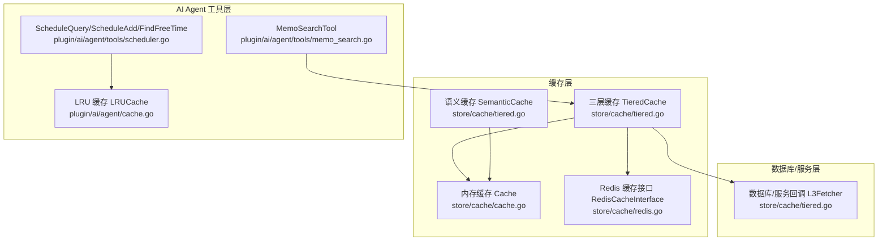
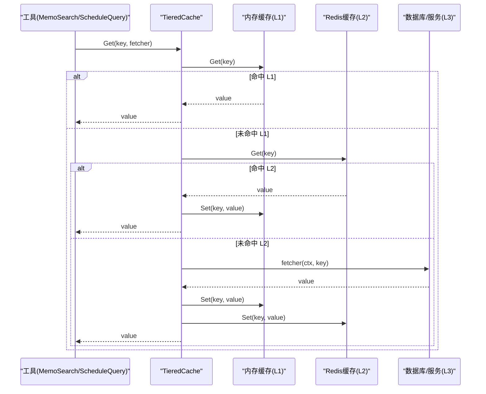
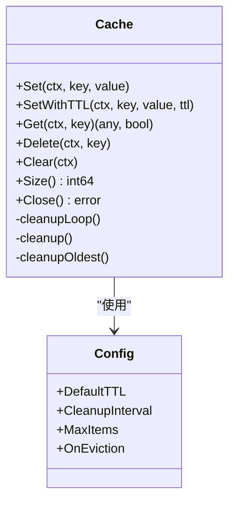
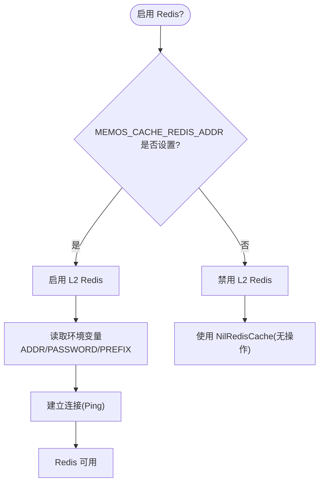
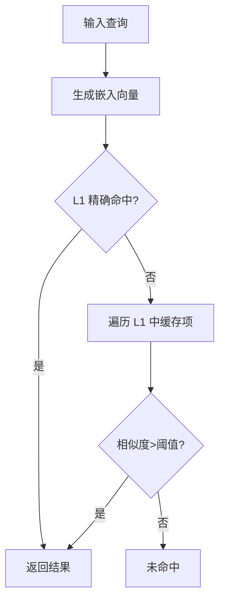
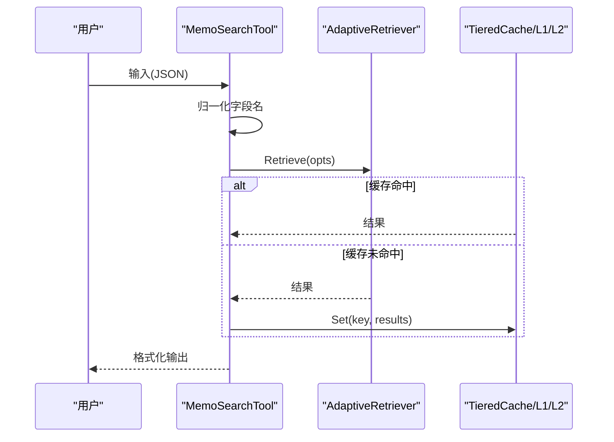
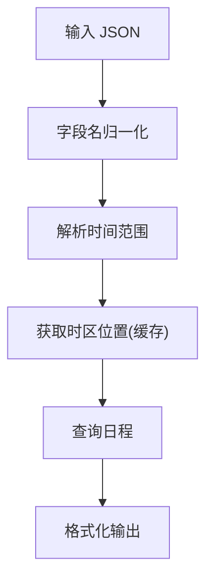
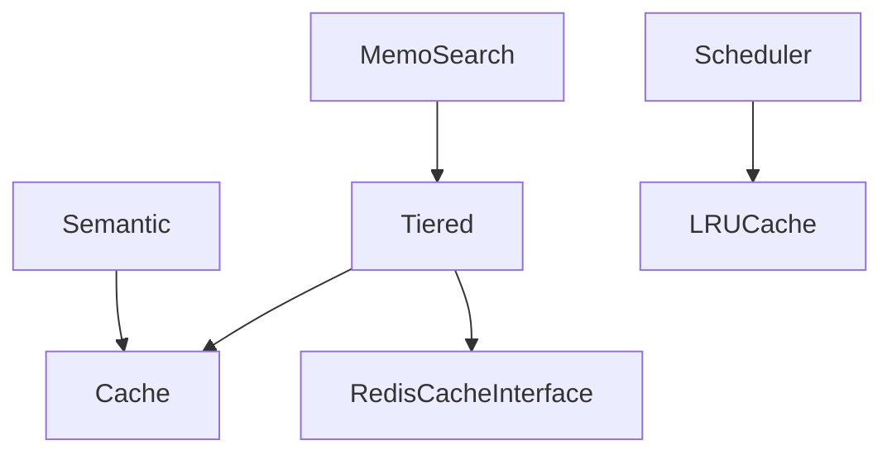

# 工具缓存系统

<cite>
**本文引用的文件列表**
- [store/cache/cache.go](file://store/cache/cache.go)
- [store/cache/redis.go](file://store/cache/redis.go)
- [store/cache/tiered.go](file://store/cache/tiered.go)
- [plugin/ai/agent/cache.go](file://plugin/ai/agent/cache.go)
- [plugin/ai/agent/tools/memo_search.go](file://plugin/ai/agent/tools/memo_search.go)
- [plugin/ai/agent/tools/scheduler.go](file://plugin/ai/agent/tools/scheduler.go)
- [store/cache/cache_test.go](file://store/cache/cache_test.go)
- [store/cache.go](file://store/cache.go)
- [go.mod](file://go.mod)
</cite>

## 目录
1. [简介](#简介)
2. [项目结构与定位](#项目结构与定位)
3. [核心组件](#核心组件)
4. [架构总览](#架构总览)
5. [详细组件分析](#详细组件分析)
6. [依赖关系分析](#依赖关系分析)
7. [性能考量与优化建议](#性能考量与优化建议)
8. [故障排查指南](#故障排查指南)
9. [结论](#结论)
10. [附录：缓存键生成与策略](#附录缓存键生成与策略)

## 简介
本文件系统性梳理了 Memos 项目中的工具缓存体系，涵盖三层缓存（L1 内存、L2 可选 Redis、L3 数据库回调）、语义缓存、不同工具的缓存需求与优化策略、缓存键生成、失效与更新策略，以及内存与分布式缓存的使用场景与性能监控与调优建议。文档面向开发者与运维人员，既提供代码级细节，也给出可操作的实践指导。

## 项目结构与定位
- 缓存基础设施位于 store/cache，提供通用内存缓存、可选 Redis 缓存与三段式缓存（TieredCache）。
- AI Agent 工具层在 plugin/ai/agent 提供 LRU 缓存与工具专用缓存（如时区解析缓存），用于提升工具执行效率。
- 工具层具体实现位于 plugin/ai/agent/tools，包含 MemoSearch、ScheduleQuery 等工具，这些工具会结合缓存系统进行查询加速。
- 测试覆盖 store/cache 的基本行为与并发正确性。



图表来源
- [store/cache/cache.go](file://store/cache/cache.go#L66-L90)
- [store/cache/redis.go](file://store/cache/redis.go#L12-L30)
- [store/cache/tiered.go](file://store/cache/tiered.go#L17-L35)
- [plugin/ai/agent/cache.go](file://plugin/ai/agent/cache.go#L10-L22)
- [plugin/ai/agent/tools/memo_search.go](file://plugin/ai/agent/tools/memo_search.go#L53-L77)
- [plugin/ai/agent/tools/scheduler.go](file://plugin/ai/agent/tools/scheduler.go#L132-L144)

章节来源
- [store/cache/cache.go](file://store/cache/cache.go#L1-L328)
- [store/cache/redis.go](file://store/cache/redis.go#L1-L271)
- [store/cache/tiered.go](file://store/cache/tiered.go#L1-L447)
- [plugin/ai/agent/cache.go](file://plugin/ai/agent/cache.go#L1-L292)
- [plugin/ai/agent/tools/memo_search.go](file://plugin/ai/agent/tools/memo_search.go#L1-L283)
- [plugin/ai/agent/tools/scheduler.go](file://plugin/ai/agent/tools/scheduler.go#L1-L800)

## 核心组件
- 内存缓存 Cache：线程安全的内存缓存，支持 TTL、清理循环、逐出回调、容量上限与原子计数。
- Redis 缓存接口：定义 L2 缓存能力，提供可选实现与环境变量驱动的启用逻辑。
- 三层缓存 TieredCache：按 L1/L2/L3 顺序命中，缺失时回源 L3 并回填 L1/L2；支持显式失效与统计。
- 语义缓存 SemanticCache：基于向量相似度的缓存，支持精确命中与语义近似命中。
- LRU 缓存 LRUCache：线程安全的 LRU，带 TTL 与命中率统计，适用于工具内部高频短生命周期缓存。
- 工具缓存：MemoSearch、ScheduleQuery 等工具在执行前进行缓存检查，减少重复检索成本。

章节来源
- [store/cache/cache.go](file://store/cache/cache.go#L66-L90)
- [store/cache/redis.go](file://store/cache/redis.go#L12-L30)
- [store/cache/tiered.go](file://store/cache/tiered.go#L17-L35)
- [plugin/ai/agent/cache.go](file://plugin/ai/agent/cache.go#L10-L22)

## 架构总览
三层缓存策略与工具缓存协同工作：
- L1：本地内存缓存，容量小但延迟低，适合热数据与高并发访问。
- L2：可选 Redis 缓存，跨进程共享、持久化重启后可用，适合多实例部署。
- L3：数据库或服务回调，作为最终一致性来源，命中后回填 L1/L2。
- 工具层：MemoSearch 使用语义检索，ScheduleQuery 使用 LRU 缓存时区解析等中间结果，避免重复解析。



图表来源
- [store/cache/tiered.go](file://store/cache/tiered.go#L93-L132)

章节来源
- [store/cache/tiered.go](file://store/cache/tiered.go#L17-L35)
- [store/cache/cache.go](file://store/cache/cache.go#L122-L147)

## 详细组件分析

### 内存缓存 Cache（L1）
- 设计要点
  - 基于 sync.Map 的并发安全存储，原子计数维护大小，清理循环定期剔除过期项。
  - 支持自定义 TTL、清理周期、最大项数；超过阈值触发“最旧项淘汰”。
  - 可配置逐出回调，便于审计与统计。
- 关键方法
  - Set/SetWithTTL：设置缓存项并估算大小，必要时触发淘汰。
  - Get：命中返回值，过期则删除并触发回调。
  - Delete/Clear：单键删除与全量清空。
  - Close：关闭清理协程。
- 复杂度与性能
  - Get/Set/Delete 均摊 O(1)，清理为 O(n) 遍历。
  - 清理周期与最大项数影响内存占用与 CPU 占用平衡。



图表来源
- [store/cache/cache.go](file://store/cache/cache.go#L66-L90)
- [store/cache/cache.go](file://store/cache/cache.go#L41-L54)

章节来源
- [store/cache/cache.go](file://store/cache/cache.go#L66-L90)
- [store/cache/cache.go](file://store/cache/cache.go#L92-L120)
- [store/cache/cache.go](file://store/cache/cache.go#L122-L147)
- [store/cache/cache.go](file://store/cache/cache.go#L149-L179)
- [store/cache/cache.go](file://store/cache/cache.go#L186-L197)
- [store/cache/cache.go](file://store/cache/cache.go#L200-L250)
- [store/cache/cache.go](file://store/cache/cache.go#L252-L313)
- [store/cache/cache.go](file://store/cache/cache.go#L315-L327)

### Redis 缓存接口与环境配置（L2）
- 接口与实现
  - RedisCacheInterface 定义 L2 能力；默认提供 NilRedisCache（无操作），便于在不启用 Redis 时保持统一接口。
  - 可选 Redis 实现以注释形式提供，包含连接、序列化、键空间管理等。
- 环境变量
  - MEMOS_CACHE_REDIS_ADDR：启用 Redis 并指定地址。
  - MEMOS_CACHE_REDIS_PASSWORD：密码。
  - MEMOS_CACHE_REDIS_PREFIX：键前缀。
- 键生成
  - GenerateCacheKey/WithHash：将组件拼接后加哈希，确保唯一性与可读性。
  - KeyHash：对完整键做 SHA256 并截断，用于 obfuscation。



图表来源
- [store/cache/redis.go](file://store/cache/redis.go#L56-L82)
- [store/cache/redis.go](file://store/cache/redis.go#L92-L108)
- [store/cache/redis.go](file://store/cache/redis.go#L116-L139)

章节来源
- [store/cache/redis.go](file://store/cache/redis.go#L12-L30)
- [store/cache/redis.go](file://store/cache/redis.go#L56-L82)
- [store/cache/redis.go](file://store/cache/redis.go#L92-L108)
- [store/cache/redis.go](file://store/cache/redis.go#L116-L139)

### 三层缓存 TieredCache
- 设计理念
  - L1 默认开启，L2 可选；Get 顺序命中 L1/L2，缺失则调用 L3 回调并回填 L1/L2。
  - 支持 Set/SetWithTTL/Delete/Invalidate/Clear/Stats/Close。
- 配置
  - DefaultTieredConfig：个人系统默认 L1 开启、L2 自动根据环境变量启用。
- 统计
  - Stats 返回 L1/L2 启用状态；L2 当前未暴露 Size，需扩展接口。

```mermaid
classDiagram
class TieredCache {
+Get(ctx, key, fetcher) (any, bool)
+Set(ctx, key, value)
+SetWithTTL(ctx, key, value, ttl)
+Delete(ctx, key)
+Invalidate(ctx, key, fetcher) error
+Clear(ctx)
+Stats() map[string]interface{}
+Close() error
}
class Cache
class RedisCacheInterface
class L3Fetcher
TieredCache --> Cache : "L1"
TieredCache --> RedisCacheInterface : "L2"
TieredCache --> L3Fetcher : "L3"
```

图表来源
- [store/cache/tiered.go](file://store/cache/tiered.go#L17-L35)
- [store/cache/tiered.go](file://store/cache/tiered.go#L40-L59)
- [store/cache/tiered.go](file://store/cache/tiered.go#L93-L132)
- [store/cache/tiered.go](file://store/cache/tiered.go#L134-L152)
- [store/cache/tiered.go](file://store/cache/tiered.go#L164-L177)
- [store/cache/tiered.go](file://store/cache/tiered.go#L179-L187)
- [store/cache/tiered.go](file://store/cache/tiered.go#L189-L208)

章节来源
- [store/cache/tiered.go](file://store/cache/tiered.go#L49-L59)
- [store/cache/tiered.go](file://store/cache/tiered.go#L61-L91)
- [store/cache/tiered.go](file://store/cache/tiered.go#L93-L132)
- [store/cache/tiered.go](file://store/cache/tiered.go#L134-L152)
- [store/cache/tiered.go](file://store/cache/tiered.go#L164-L177)
- [store/cache/tiered.go](file://store/cache/tiered.go#L179-L187)
- [store/cache/tiered.go](file://store/cache/tiered.go#L189-L208)

### 语义缓存 SemanticCache
- 功能
  - 基于查询向量的语义相似度匹配，支持精确命中与近似命中。
  - 结合 L1 内存缓存存储查询、嵌入向量、结果与时间戳。
- 策略
  - hashKey：对查询做哈希，避免长键污染。
  - cosineSimilarity：余弦相似度比较，阈值可配置。
- 适用场景
  - 类似问题的不同表达（如“明天下午3点的会议”与“下午三点会议”）可复用历史结果。



图表来源
- [store/cache/tiered.go](file://store/cache/tiered.go#L263-L304)
- [store/cache/tiered.go](file://store/cache/tiered.go#L346-L367)
- [store/cache/tiered.go](file://store/cache/tiered.go#L340-L344)

章节来源
- [store/cache/tiered.go](file://store/cache/tiered.go#L233-L261)
- [store/cache/tiered.go](file://store/cache/tiered.go#L263-L304)
- [store/cache/tiered.go](file://store/cache/tiered.go#L306-L330)
- [store/cache/tiered.go](file://store/cache/tiered.go#L340-L344)
- [store/cache/tiered.go](file://store/cache/tiered.go#L346-L367)

### LRU 缓存 LRUCache（工具层）
- 设计
  - 基于双向链表与 map 的 LRU，支持 TTL、命中/未命中计数与命中率统计。
  - 适用于工具内部短期高频缓存（如时区解析）。
- 典型用途
  - ScheduleQuery 工具中的时区解析缓存，限制最大条目防止无限增长。

```mermaid
classDiagram
class LRUCache {
+Get(key) (interface{}, bool)
+Set(key, value)
+Delete(key)
+Clear()
+Size() int
+Stats() CacheStats
-evictLRU()
-removeElement(elem)
-calculateExpiration() time.Time
}
class GenericCache~T~ {
+Get(key) (T, bool)
+Set(key, value T)
+Delete(key)
+Clear()
+Size() int
+Stats() CacheStats
}
LRUCache <|-- GenericCache : "泛型封装"
```

图表来源
- [plugin/ai/agent/cache.go](file://plugin/ai/agent/cache.go#L10-L22)
- [plugin/ai/agent/cache.go](file://plugin/ai/agent/cache.go#L233-L292)

章节来源
- [plugin/ai/agent/cache.go](file://plugin/ai/agent/cache.go#L10-L22)
- [plugin/ai/agent/cache.go](file://plugin/ai/agent/cache.go#L52-L74)
- [plugin/ai/agent/cache.go](file://plugin/ai/agent/cache.go#L76-L145)
- [plugin/ai/agent/cache.go](file://plugin/ai/agent/cache.go#L147-L168)
- [plugin/ai/agent/cache.go](file://plugin/ai/agent/cache.go#L170-L197)
- [plugin/ai/agent/cache.go](file://plugin/ai/agent/cache.go#L199-L206)
- [plugin/ai/agent/cache.go](file://plugin/ai/agent/cache.go#L208-L223)
- [plugin/ai/agent/cache.go](file://plugin/ai/agent/cache.go#L225-L231)
- [plugin/ai/agent/cache.go](file://plugin/ai/agent/cache.go#L233-L292)

### MemoSearch 工具与缓存
- 输入规范化：将 LLM 生成的 camelCase 字段名转换为 snake_case，提高兼容性。
- 查询策略：默认使用“语义优先”的检索策略，限制结果数量与最小相关度。
- 结果过滤：仅返回 memo 类型结果，构建用户可读响应。



图表来源
- [plugin/ai/agent/tools/memo_search.go](file://plugin/ai/agent/tools/memo_search.go#L109-L193)
- [plugin/ai/agent/tools/memo_search.go](file://plugin/ai/agent/tools/memo_search.go#L210-L282)

章节来源
- [plugin/ai/agent/tools/memo_search.go](file://plugin/ai/agent/tools/memo_search.go#L53-L77)
- [plugin/ai/agent/tools/memo_search.go](file://plugin/ai/agent/tools/memo_search.go#L109-L193)
- [plugin/ai/agent/tools/memo_search.go](file://plugin/ai/agent/tools/memo_search.go#L210-L282)

### ScheduleQuery 工具与缓存
- 时区解析缓存：使用 LRU 风格的大小受限缓存，避免重复加载时区导致的性能损耗。
- 输入归一化：支持 camelCase 与 snake_case 字段名互换。
- 时间范围查询：按用户 ID 与时间区间查询日程，格式化输出。



图表来源
- [plugin/ai/agent/tools/scheduler.go](file://plugin/ai/agent/tools/scheduler.go#L183-L266)
- [plugin/ai/agent/tools/scheduler.go](file://plugin/ai/agent/tools/scheduler.go#L48-L94)

章节来源
- [plugin/ai/agent/tools/scheduler.go](file://plugin/ai/agent/tools/scheduler.go#L30-L46)
- [plugin/ai/agent/tools/scheduler.go](file://plugin/ai/agent/tools/scheduler.go#L48-L94)
- [plugin/ai/agent/tools/scheduler.go](file://plugin/ai/agent/tools/scheduler.go#L183-L266)

## 依赖关系分析
- 组件耦合
  - TieredCache 依赖 Cache 与 RedisCacheInterface；通过接口解耦 L2 实现。
  - SemanticCache 依赖 Cache 与 EmbeddingService（外部注入）。
  - 工具层依赖缓存层，但不直接依赖数据库，通过 L3Fetcher 抽象回源。
- 外部依赖
  - go.mod 显示项目使用多种第三方库，缓存层未引入额外外部依赖，Redis 实现为可选。



图表来源
- [store/cache/tiered.go](file://store/cache/tiered.go#L17-L35)
- [store/cache/tiered.go](file://store/cache/tiered.go#L233-L240)
- [plugin/ai/agent/tools/memo_search.go](file://plugin/ai/agent/tools/memo_search.go#L53-L77)
- [plugin/ai/agent/tools/scheduler.go](file://plugin/ai/agent/tools/scheduler.go#L132-L144)

章节来源
- [go.mod](file://go.mod#L1-L75)
- [store/cache/tiered.go](file://store/cache/tiered.go#L17-L35)
- [store/cache/tiered.go](file://store/cache/tiered.go#L233-L240)
- [plugin/ai/agent/tools/memo_search.go](file://plugin/ai/agent/tools/memo_search.go#L53-L77)
- [plugin/ai/agent/tools/scheduler.go](file://plugin/ai/agent/tools/scheduler.go#L132-L144)

## 性能考量与优化建议
- 命中率优化
  - L1：合理设置 MaxItems 与 CleanupInterval，避免频繁清理；对热点键使用更短的 TTL 以降低陈旧数据比例。
  - L2：在多实例部署时启用 Redis，确保跨实例共享；注意键前缀与命名规范，避免键冲突。
  - 语义缓存：合理设置阈值，避免误判；对热门查询可考虑动态延长 TTL。
- 内存使用控制
  - L1：通过 MaxItems 与逐出回调统计被驱逐项，评估是否需要增大容量或缩短 TTL。
  - L2：Redis 需要监控内存使用，必要时配置 maxmemory 与淘汰策略。
  - 工具层：LRU 缓存设置上限，防止无限增长（如时区缓存）。
- 并发与一致性
  - Cache 与 LRUCache 均采用锁保护，测试覆盖并发场景；建议在高并发下适当增加清理间隔，降低锁竞争。
- 性能监控
  - TieredCache Stats 与 LRUCache Stats 提供基础指标；建议扩展 Cache 的命中/未命中计数，完善命中率统计。
  - Redis 可通过 INFO/STATS 获取命中率与内存使用，结合业务指标进行调优。

[本节为通用指导，无需特定文件引用]

## 故障排查指南
- 缓存未生效
  - 检查 MEMOS_CACHE_REDIS_ADDR 是否设置；若未设置，L2 将使用 NilRedisCache，表现为无操作。
  - 确认 TieredCache 配置 EnableL1/EnableL2 是否符合预期。
- 命中率低
  - 检查 TTL 是否过短或过长；对热点键适当延长 TTL。
  - 对于语义缓存，调整阈值；对热门查询可考虑动态延长 TTL。
- 内存占用过高
  - 减少 L1 MaxItems 或缩短 CleanupInterval；检查 OnEviction 回调是否触发。
  - 工具层 LRU 缓存设置上限，避免无限增长。
- 并发异常
  - 查看测试用例并发场景；如出现竞态，检查锁粒度与临界区长度。
- Redis 连接失败
  - 检查地址、密码、DB、池大小等配置；确认网络连通性。

章节来源
- [store/cache/redis.go](file://store/cache/redis.go#L56-L82)
- [store/cache/tiered.go](file://store/cache/tiered.go#L49-L59)
- [store/cache/cache_test.go](file://store/cache/cache_test.go#L113-L166)

## 结论
该缓存系统通过三层缓存与语义缓存相结合，兼顾了性能与可扩展性。L1 提供极低延迟，L2 在多实例场景下提供共享能力，L3 保证最终一致性。工具层的 LRU 缓存与键规范化进一步提升了稳定性与用户体验。建议在生产环境中结合业务特征持续优化 TTL、阈值与容量参数，并完善命中率与内存使用监控。

[本节为总结，无需特定文件引用]

## 附录：缓存键生成与策略
- 通用键生成
  - GenerateCacheKey/WithHash：将多个组件拼接后加哈希，保证唯一性与可读性。
  - KeyHash：对完整键做 SHA256 并截断，用于 obfuscation。
- 查询键生成
  - GenerateQueryKey：基于用户 ID、查询词、限制数量与策略生成稳定键，便于跨模块复用。
- 工具键生成
  - MemoSearch：结合用户 ID、查询词、限制与策略生成键。
  - ScheduleQuery：基于时间范围与用户 ID 生成键，避免跨用户混淆。

章节来源
- [store/cache/redis.go](file://store/cache/redis.go#L92-L108)
- [store/cache/redis.go](file://store/cache/redis.go#L110-L114)
- [store/cache/tiered.go](file://store/cache/tiered.go#L384-L396)
- [store/cache.go](file://store/cache.go#L7-L9)