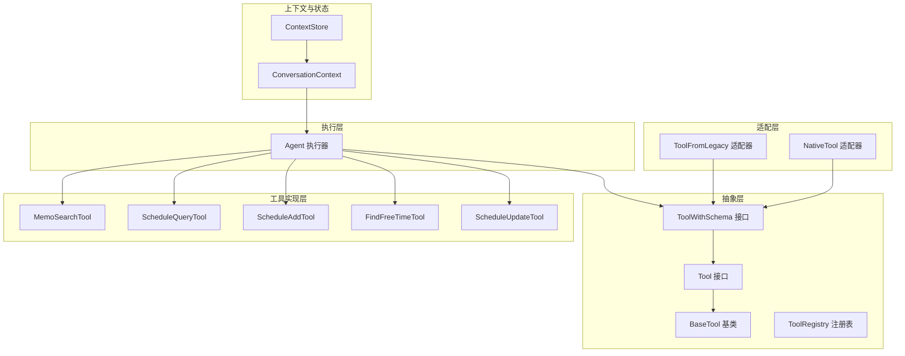
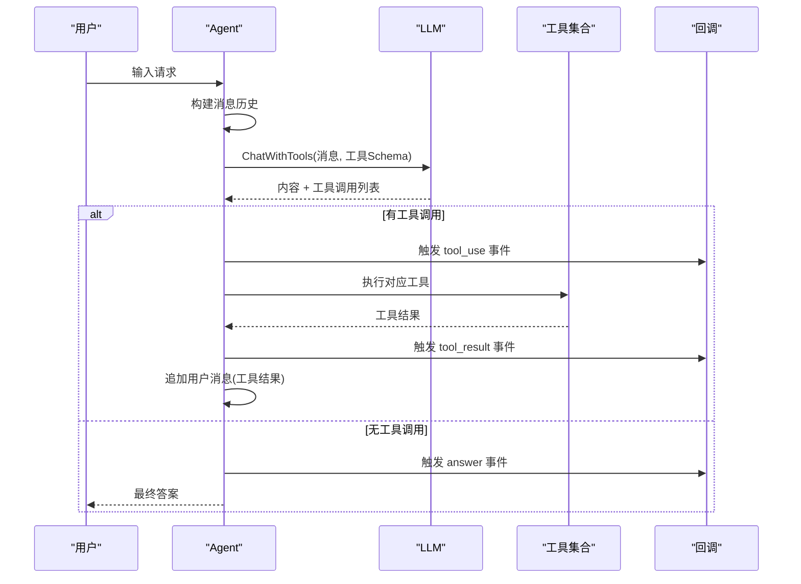
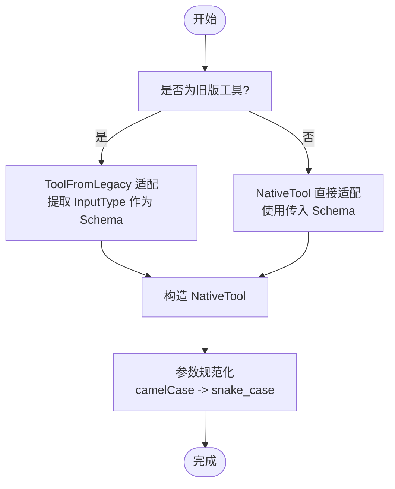
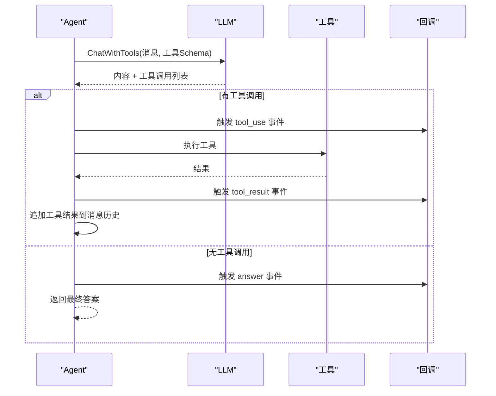
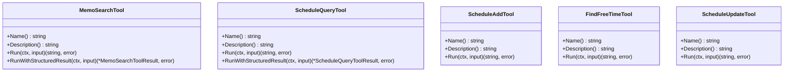
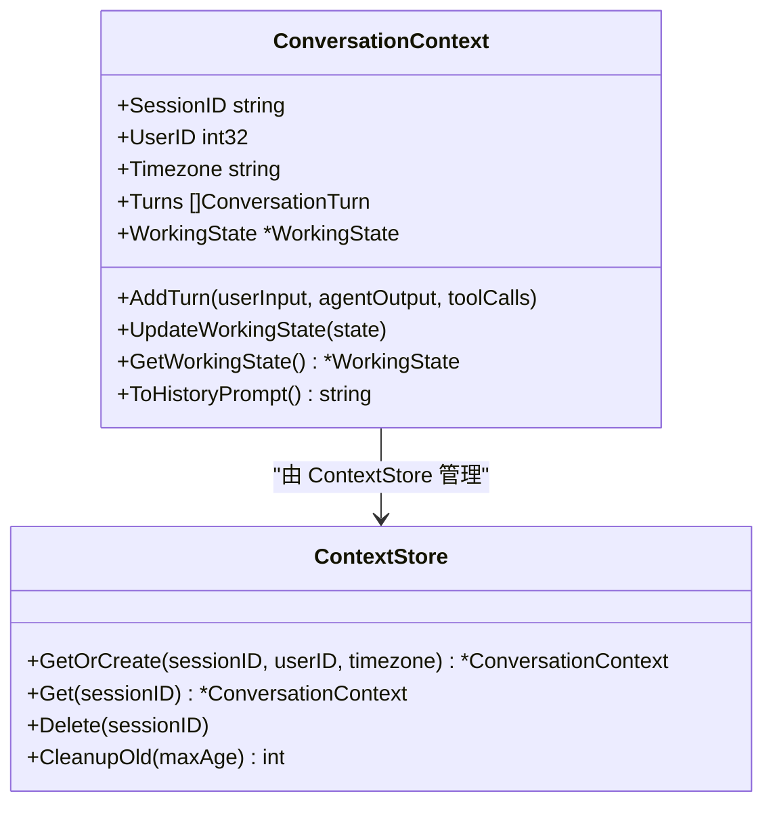
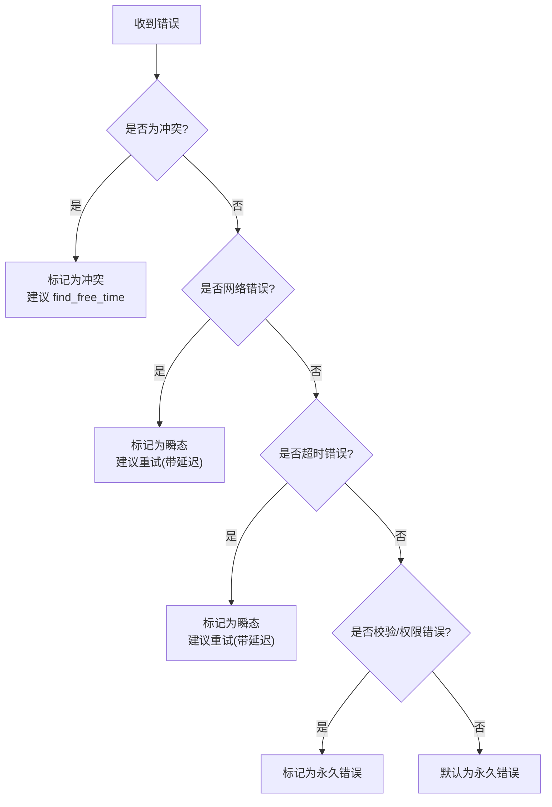
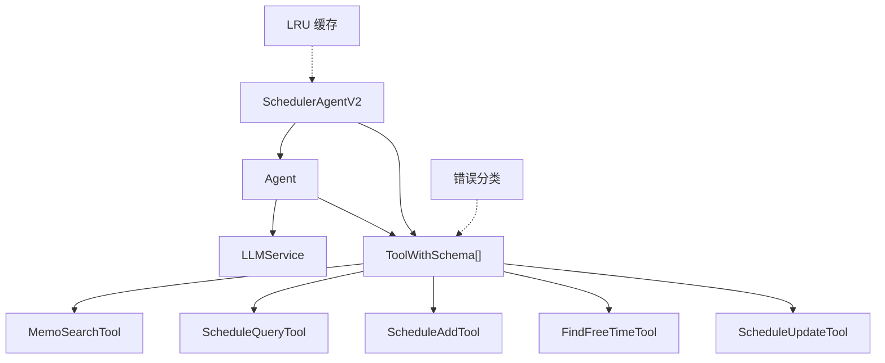

# 工具适配器

<cite>
**本文档引用的文件**
- [tool_adapter.go](file://plugin/ai/agent/tool_adapter.go)
- [base_tool.go](file://plugin/ai/agent/base_tool.go)
- [types.go](file://plugin/ai/agent/types.go)
- [memo_search.go](file://plugin/ai/agent/tools/memo_search.go)
- [scheduler.go](file://plugin/ai/agent/tools/scheduler.go)
- [context.go](file://plugin/ai/agent/context.go)
- [util.go](file://plugin/ai/agent/util.go)
- [cache.go](file://plugin/ai/agent/cache.go)
- [error_class.go](file://plugin/ai/agent/error_class.go)
- [scheduler_v2.go](file://plugin/ai/agent/scheduler_v2.go)
- [scheduler_test.go](file://plugin/ai/agent/scheduler_test.go)
- [context_test.go](file://plugin/ai/agent/context_test.go)
</cite>

## 目录
1. [简介](#简介)
2. [项目结构](#项目结构)
3. [核心组件](#核心组件)
4. [架构总览](#架构总览)
5. [详细组件分析](#详细组件分析)
6. [依赖关系分析](#依赖关系分析)
7. [性能考量](#性能考量)
8. [故障排查指南](#故障排查指南)
9. [结论](#结论)
10. [附录](#附录)

## 简介
本文件系统性阐述“工具适配器”的设计与实现，重点覆盖以下方面：
- 设计模式与架构原理：统一包装与管理不同类型的工具，实现接口标准化、参数转换与结果处理。
- 工具接口标准化：Tool 接口、ToolWithSchema 接口及 NativeTool 的实现。
- 参数转换与结果处理：JSON Schema 定义、字段名兼容性处理、结果格式化与结构化输出。
- 工具注册、发现与调用流程：Agent 的工具注册、消息构建、工具调用循环与回调机制。
- 扩展指南与自定义工具开发：如何基于 BaseTool 快速实现新工具，并通过适配器接入 Agent。

## 项目结构
工具适配器位于插件 AI 子模块的 agent 包中，围绕工具抽象、适配器、调度器代理与工具实现展开，形成清晰的分层结构：
- 抽象层：Tool 接口、ToolWithSchema 接口、BaseTool 基类与工具注册表。
- 适配层：NativeTool 与 ToolFromLegacy，将既有工具适配为 ToolWithSchema。
- 执行层：Agent 负责工具注册、消息构建、LLM 调用与工具循环执行。
- 工具实现层：memo_search 与 scheduler 下的多个工具，提供具体业务能力。
- 上下文与状态：ConversationContext、ContextStore 支持多轮对话状态管理。
- 辅助设施：LRUCache、错误分类、工具结果结构体等。



图表来源
- [tool_adapter.go](file://plugin/ai/agent/tool_adapter.go#L14-L44)
- [base_tool.go](file://plugin/ai/agent/base_tool.go#L10-L32)
- [scheduler_v2.go](file://plugin/ai/agent/scheduler_v2.go#L58-L71)
- [context.go](file://plugin/ai/agent/context.go#L19-L37)

章节来源
- [tool_adapter.go](file://plugin/ai/agent/tool_adapter.go#L1-L322)
- [base_tool.go](file://plugin/ai/agent/base_tool.go#L1-L251)
- [scheduler_v2.go](file://plugin/ai/agent/scheduler_v2.go#L1-L401)

## 核心组件
- Tool 接口：定义工具的最小能力集（名称、描述、执行）。
- ToolWithSchema 接口：在 Tool 基础上增加 JSON Schema 参数定义，便于 LLM 理解工具输入。
- BaseTool：提供可复用的工具基类，内置输入校验、超时控制与结果校验。
- ToolRegistry：集中管理工具注册、查询与描述。
- NativeTool：将任意执行函数适配为 ToolWithSchema，支持直接传入参数 Schema。
- ToolFromLegacy：将旧版工具（带 InputType 方法）适配为 ToolWithSchema。
- Agent：轻量级智能体，负责构建消息、调用 LLM 工具、执行工具循环与回调通知。
- 工具实现：MemoSearchTool、ScheduleQueryTool、ScheduleAddTool、FindFreeTimeTool、ScheduleUpdateTool。

章节来源
- [tool_adapter.go](file://plugin/ai/agent/tool_adapter.go#L14-L44)
- [base_tool.go](file://plugin/ai/agent/base_tool.go#L10-L93)
- [scheduler_v2.go](file://plugin/ai/agent/scheduler_v2.go#L58-L71)

## 架构总览
工具适配器采用“接口抽象 + 适配器 + 执行器”的分层架构：
- 接口抽象：统一工具能力模型，屏蔽具体实现差异。
- 适配器：将既有工具与通用函数无缝接入统一框架。
- 执行器：Agent 作为无框架的轻量智能体，基于 LLM 的原生工具调用能力进行工具循环执行。
- 工具实现：面向具体业务场景的工具，提供语义检索、日程查询/创建/修改/空闲时间查找等能力。



图表来源
- [tool_adapter.go](file://plugin/ai/agent/tool_adapter.go#L137-L263)
- [scheduler_v2.go](file://plugin/ai/agent/scheduler_v2.go#L175-L196)

## 详细组件分析

### 工具接口标准化
- Tool 接口：提供 Name、Description、Run 三个方法，确保所有工具具备一致的对外能力。
- ToolWithSchema 接口：在 Tool 基础上增加 Parameters 方法，返回 JSON Schema，使 LLM 能够理解工具输入结构。
- BaseTool：提供默认实现，包含输入校验、超时控制、结果校验与错误处理，降低工具实现复杂度。
- ToolRegistry：提供注册、查询、列举、描述与计数功能，便于集中管理工具集合。

```mermaid
classDiagram
class Tool {
+Name() string
+Description() string
+Run(ctx, input) (string, error)
}
class ToolWithSchema {
+Name() string
+Description() string
+Run(ctx, input) (string, error)
+Parameters() map[string]interface{}
}
class BaseTool {
-name string
-description string
-execute func
-validate func
-timeout time.Duration
+Name() string
+Description() string
+Run(ctx, input) (string, error)
}
class ToolRegistry {
-tools map[string]Tool
+Register(tool) error
+Get(name) (Tool, bool)
+List() []string
+Describe() string
+Count() int
}
ToolWithSchema <|.. BaseTool
Tool <|.. BaseTool
ToolRegistry --> Tool : "管理"
```

图表来源
- [base_tool.go](file://plugin/ai/agent/base_tool.go#L10-L93)
- [base_tool.go](file://plugin/ai/agent/base_tool.go#L147-L221)

章节来源
- [base_tool.go](file://plugin/ai/agent/base_tool.go#L10-L221)

### 适配器实现与参数转换
- NativeTool：将任意执行函数与参数 Schema 绑定为 ToolWithSchema，支持直接传入参数定义。
- ToolFromLegacy：将旧版工具（带 InputType 方法）适配为 ToolWithSchema，保留其参数 Schema。
- 字段名兼容性：针对 LLM 输出的 camelCase 字段（如 minScore、startTime），提供 normalize 函数将其映射为 snake_case，提升兼容性。



图表来源
- [tool_adapter.go](file://plugin/ai/agent/tool_adapter.go#L66-L79)
- [tool_adapter.go](file://plugin/ai/agent/tool_adapter.go#L23-L44)
- [memo_search.go](file://plugin/ai/agent/tools/memo_search.go#L30-L51)
- [scheduler.go](file://plugin/ai/agent/tools/scheduler.go#L105-L130)

章节来源
- [tool_adapter.go](file://plugin/ai/agent/tool_adapter.go#L66-L79)
- [memo_search.go](file://plugin/ai/agent/tools/memo_search.go#L30-L51)
- [scheduler.go](file://plugin/ai/agent/tools/scheduler.go#L105-L130)

### 工具注册、发现与调用流程
- Agent 构造：接收 LLM 服务、Agent 配置与工具集合，内部建立工具名到工具实例的映射。
- 消息构建：初始系统提示 + 用户输入；每次工具调用后追加“思考内容 + 工具调用语法”与“工具结果”。
- 工具循环：LLM 返回工具调用列表后，按序执行工具，记录结果并继续对话，直至无工具调用或达到最大迭代次数。
- 回调机制：支持 tool_use、tool_result、answer 三类事件，便于前端实时反馈与 UI 事件注入。
- 早期停止：当工具结果包含特定成功标识时提前结束，减少不必要的迭代。



图表来源
- [tool_adapter.go](file://plugin/ai/agent/tool_adapter.go#L137-L263)

章节来源
- [tool_adapter.go](file://plugin/ai/agent/tool_adapter.go#L81-L263)

### 工具实现与结果处理
- MemoSearchTool：语义与关键词混合检索，支持 limit、min_score、strategy 等参数；提供结构化结果（MemoSearchToolResult）与文本结果两种输出。
- ScheduleQueryTool：查询指定时间范围内的日程，支持输入规范化与严格的时间格式校验。
- ScheduleAddTool：创建日程，自动冲突检测与自动调整；冲突时提供替代时间槽；支持全天事件与位置描述。
- FindFreeTimeTool：在指定日期内查找可用的 1 小时空闲时间段，考虑工作时段限制。
- ScheduleUpdateTool：按 ID 或日期/标题匹配更新日程，保持未提供的字段不变。



图表来源
- [memo_search.go](file://plugin/ai/agent/tools/memo_search.go#L53-L193)
- [scheduler.go](file://plugin/ai/agent/tools/scheduler.go#L132-L266)
- [scheduler.go](file://plugin/ai/agent/tools/scheduler.go#L389-L614)
- [scheduler.go](file://plugin/ai/agent/tools/scheduler.go#L692-L836)
- [scheduler.go](file://plugin/ai/agent/tools/scheduler.go#L838-L1076)

章节来源
- [memo_search.go](file://plugin/ai/agent/tools/memo_search.go#L53-L283)
- [scheduler.go](file://plugin/ai/agent/tools/scheduler.go#L132-L1076)

### 多轮对话上下文与状态管理
- ConversationContext：维护会话 ID、用户 ID、时区、历史回合、工作状态（提议日程、冲突、意图、最后工具、当前步骤）。
- ContextStore：提供会话级上下文的创建、获取、删除与清理。
- ToHistoryPrompt：将历史回合转为适合 LLM 的上下文提示，避免泄露完整工具输出，仅提供工具使用摘要。



图表来源
- [context.go](file://plugin/ai/agent/context.go#L19-L144)
- [context.go](file://plugin/ai/agent/context.go#L404-L463)

章节来源
- [context.go](file://plugin/ai/agent/context.go#L19-L488)

### 错误分类与重试策略
- ErrorClass：将错误分为瞬态（可重试）、永久（不可重试）、冲突（特殊处理）三类。
- ClassifyError：根据错误类型与消息模式进行分类，提供重试延迟与冲突处理建议。
- ShouldRetry/GetRetryDelay/GetActionHint：提供统一的重试与行动建议接口。



图表来源
- [error_class.go](file://plugin/ai/agent/error_class.go#L84-L149)

章节来源
- [error_class.go](file://plugin/ai/agent/error_class.go#L17-L232)

### 缓存与性能优化
- LRUCache：线程安全的 LRU 缓存，支持 TTL，提供命中率统计与泛型封装。
- 时间区域缓存：在 Schedule 工具中对时区加载进行缓存，防止无限增长并限制缓存大小。
- 工具执行超时：MemoSearchTool、FindFreeTimeTool 等均设置工具执行超时，避免阻塞。

章节来源
- [cache.go](file://plugin/ai/agent/cache.go#L10-L292)
- [scheduler.go](file://plugin/ai/agent/tools/scheduler.go#L30-L94)
- [memo_search.go](file://plugin/ai/agent/tools/memo_search.go#L112-L115)

## 依赖关系分析
- Agent 依赖 LLMService 的 ChatWithTools 能力，依赖工具集合的 Parameters Schema。
- 工具实现依赖对应的业务服务（检索器、日程服务等）。
- SchedulerAgentV2 将具体工具包装为 ToolWithSchema 并注入 Agent。
- 错误分类与缓存独立于工具实现，提供横切关注点。



图表来源
- [tool_adapter.go](file://plugin/ai/agent/tool_adapter.go#L81-L119)
- [scheduler_v2.go](file://plugin/ai/agent/scheduler_v2.go#L58-L91)
- [error_class.go](file://plugin/ai/agent/error_class.go#L84-L149)
- [cache.go](file://plugin/ai/agent/cache.go#L52-L74)

章节来源
- [tool_adapter.go](file://plugin/ai/agent/tool_adapter.go#L81-L119)
- [scheduler_v2.go](file://plugin/ai/agent/scheduler_v2.go#L58-L91)
- [error_class.go](file://plugin/ai/agent/error_class.go#L84-L149)
- [cache.go](file://plugin/ai/agent/cache.go#L52-L74)

## 性能考量
- 工具执行超时：对检索与空闲时间查找等 IO 密集型操作设置超时，避免阻塞。
- 缓存策略：LRU 缓存与时区缓存减少重复计算与加载开销。
- 消息历史长度控制：ConversationContext 仅保留最近若干回合，避免内存膨胀。
- JSON Schema 序列化：工具参数 Schema 在构建时序列化，避免运行时重复计算。
- 早期停止：当工具结果包含成功标识时提前结束，减少迭代次数。

## 故障排查指南
- 工具未找到：检查 Agent 构造时的工具注册与名称映射，确认工具名一致。
- 参数格式错误：确认输入 JSON 字段命名符合规范（snake_case），必要时使用 normalize 函数。
- 工具执行超时：检查工具实现是否设置了超时，适当增大超时时间或优化后端服务。
- 冲突处理：对于 ScheduleAdd 的冲突，优先调用 ScheduleQuery 检查，再调用 FindFreeTime 获取替代时间。
- 回调未触发：确认回调函数在 Agent.RunWithCallback 中正确传入，且事件类型匹配。
- 上下文异常：检查 ConversationContext 的并发访问与深拷贝逻辑，避免竞态条件。

章节来源
- [tool_adapter.go](file://plugin/ai/agent/tool_adapter.go#L314-L321)
- [scheduler.go](file://plugin/ai/agent/tools/scheduler.go#L527-L572)
- [context.go](file://plugin/ai/agent/context.go#L137-L199)

## 结论
工具适配器通过统一的接口抽象与适配器模式，实现了对多种工具的标准化包装与管理，结合 Agent 的工具循环执行机制，为 LLM 提供了稳定、可控、可观测的工具调用能力。配合上下文管理、错误分类与缓存优化，整体方案在易用性、可扩展性与性能之间取得了良好平衡。

## 附录

### 扩展指南与自定义工具开发
- 基于 BaseTool 快速实现：提供名称、描述与执行函数，可选超时与输入校验。
- 实现 ToolWithSchema：若已有 InputType/Parameters 定义，可直接使用 ToolFromLegacy 或在适配器中传入 Schema。
- 注册与使用：将工具注册到 Agent，或通过 SchedulerAgentV2 的 wrapToolWithName 方式注入。
- 测试建议：使用 MockLLM 与 MockScheduleService 模拟 LLM 与业务服务，验证工具调用链路与回调事件。

章节来源
- [base_tool.go](file://plugin/ai/agent/base_tool.go#L54-L93)
- [tool_adapter.go](file://plugin/ai/agent/tool_adapter.go#L66-L79)
- [scheduler_v2.go](file://plugin/ai/agent/scheduler_v2.go#L93-L150)
- [scheduler_test.go](file://plugin/ai/agent/scheduler_test.go#L105-L178)