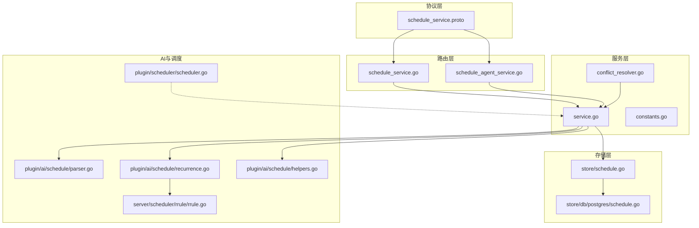
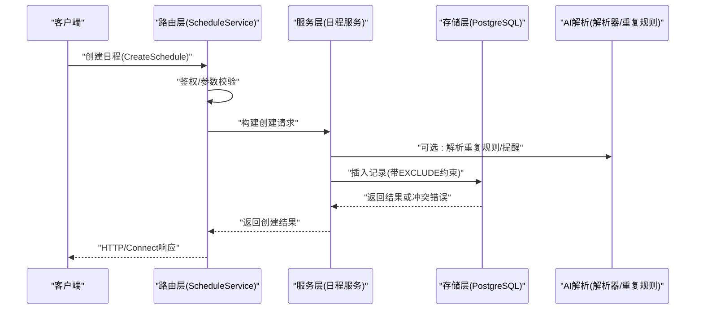
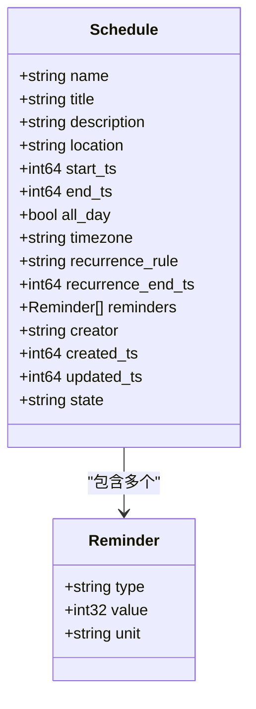
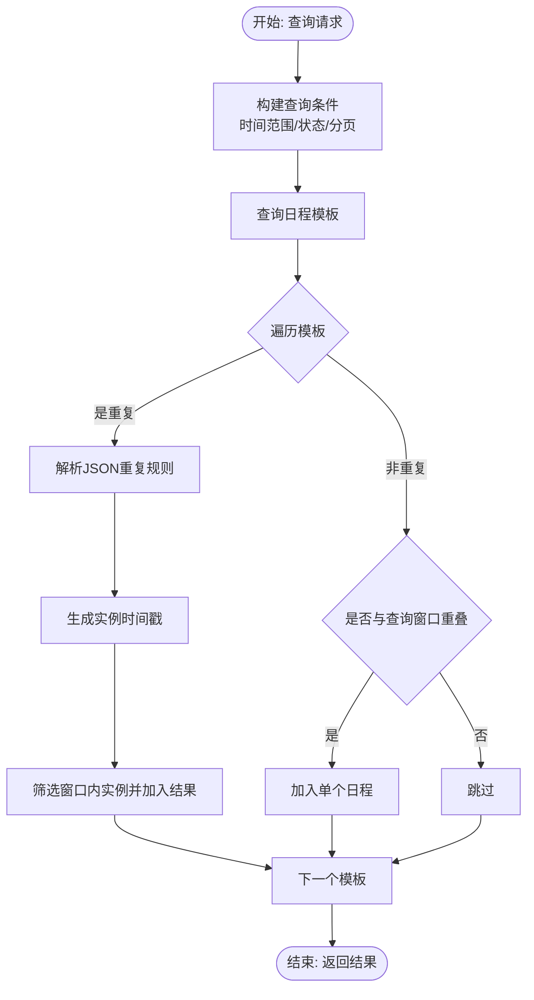
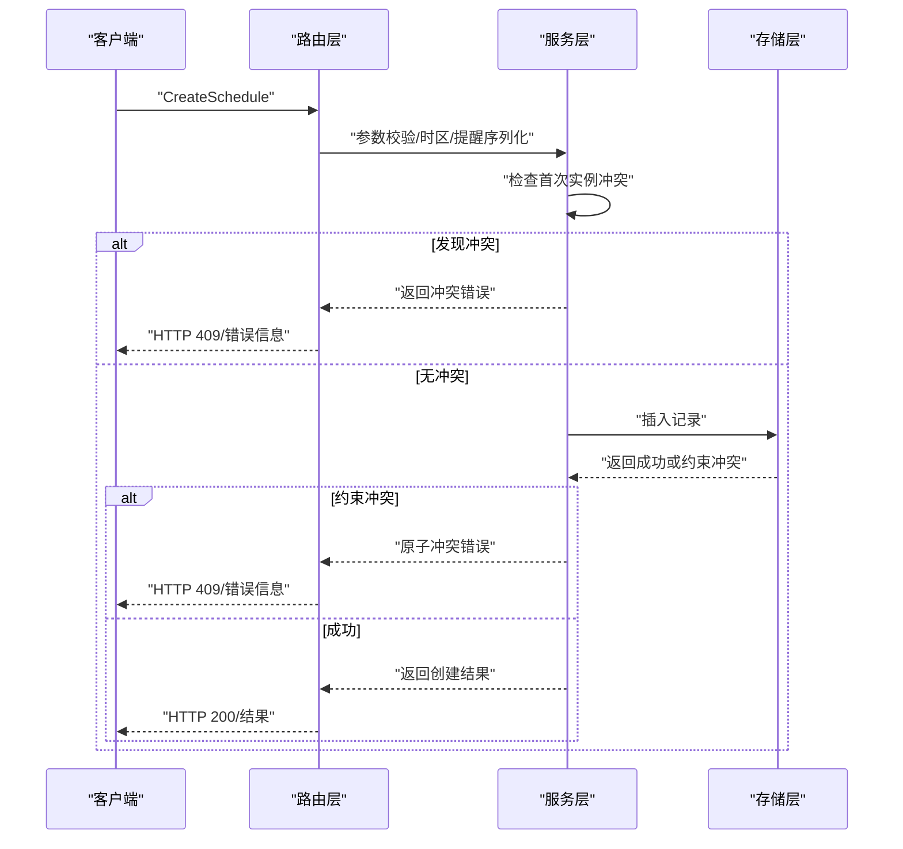
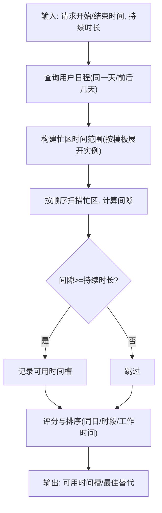
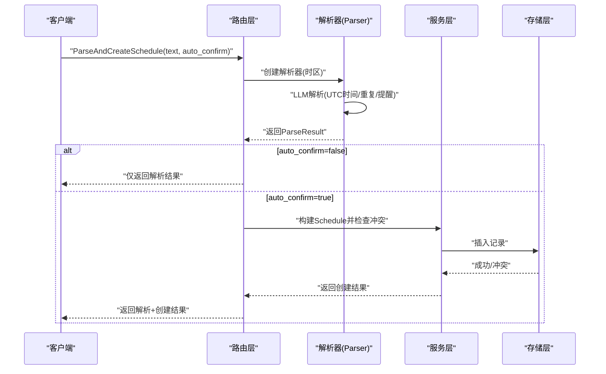
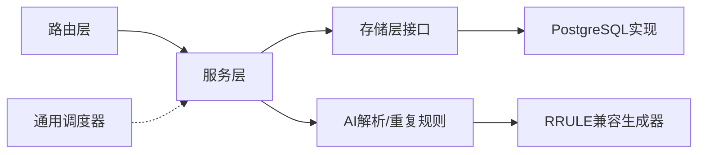
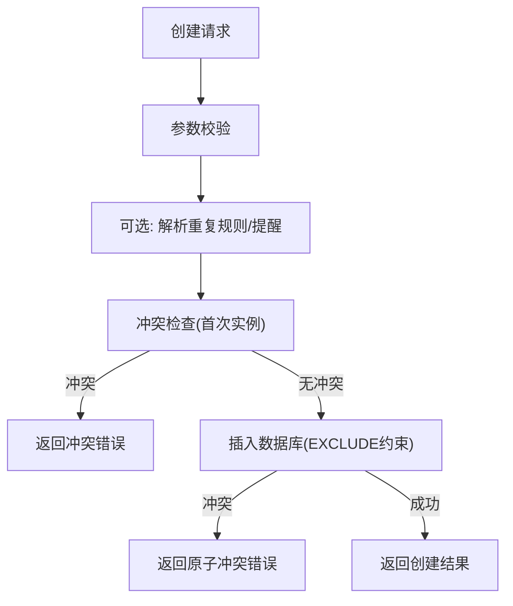

# 日程管理工具

<cite>
**本文档引用的文件**
- [schedule_service.proto](file://proto/api/v1/schedule_service.proto)
- [service.go](file://server/service/schedule/service.go)
- [conflict_resolver.go](file://server/service/schedule/conflict_resolver.go)
- [constants.go](file://server/service/schedule/constants.go)
- [schedule_service.go](file://server/router/api/v1/schedule_service.go)
- [schedule_agent_service.go](file://server/router/api/v1/schedule_agent_service.go)
- [parser.go](file://plugin/ai/schedule/parser.go)
- [recurrence.go](file://plugin/ai/schedule/recurrence.go)
- [helpers.go](file://plugin/ai/schedule/helpers.go)
- [rrule.go](file://server/scheduler/rrule/rrule.go)
- [schedule.go](file://store/schedule.go)
- [schedule.go](file://store/db/postgres/schedule.go)
- [scheduler.go](file://plugin/scheduler/scheduler.go)
</cite>

## 目录
1. [简介](#简介)
2. [项目结构](#项目结构)
3. [核心组件](#核心组件)
4. [架构总览](#架构总览)
5. [详细组件分析](#详细组件分析)
6. [依赖关系分析](#依赖关系分析)
7. [性能考虑](#性能考虑)
8. [故障排除指南](#故障排除指南)
9. [结论](#结论)
10. [附录](#附录)

## 简介
本项目是一个基于自然语言处理的日程管理工具，提供日程查询、创建、更新、删除、冲突检测与智能空闲时间建议等能力。系统支持重复规则、提醒设置、时区转换，并通过数据库级约束保证数据一致性。前端可通过 REST/HTTP 或 Connect 协议调用 API，后端通过服务层协调存储层完成业务逻辑。

## 项目结构
- 协议定义：位于 proto/api/v1，定义了 ScheduleService 的 RPC 接口与消息结构。
- 路由层：位于 server/router/api/v1，负责请求解析、鉴权、参数校验与响应封装。
- 服务层：位于 server/service/schedule，实现业务逻辑（查询、创建、更新、冲突检测、空闲时间建议）。
- 存储层：位于 store 与 store/db/postgres，提供统一的 CRUD 接口与数据库实现。
- AI 解析与调度：位于 plugin/ai/schedule，负责自然语言解析、重复规则生成与提醒序列化。
- 通用调度器：位于 plugin/scheduler，提供基于 Cron 的任务调度能力（与日程调度互补）。

**图表来源**
- [schedule_service.proto](file://proto/api/v1/schedule_service.proto#L1-L166)
- [schedule_service.go](file://server/router/api/v1/schedule_service.go#L1-L826)
- [service.go](file://server/service/schedule/service.go#L1-L737)
- [conflict_resolver.go](file://server/service/schedule/conflict_resolver.go#L1-L358)
- [schedule.go](file://store/schedule.go#L1-L176)
- [schedule.go](file://store/db/postgres/schedule.go#L1-L327)
- [parser.go](file://plugin/ai/schedule/parser.go#L1-L378)
- [recurrence.go](file://plugin/ai/schedule/recurrence.go#L1-L557)
- [helpers.go](file://plugin/ai/schedule/helpers.go#L1-L33)
- [rrule.go](file://server/scheduler/rrule/rrule.go#L1-L466)
- [scheduler.go](file://plugin/scheduler/scheduler.go#L1-L203)

**章节来源**
- [schedule_service.proto](file://proto/api/v1/schedule_service.proto#L1-L166)
- [schedule_service.go](file://server/router/api/v1/schedule_service.go#L1-L826)
- [service.go](file://server/service/schedule/service.go#L1-L737)

## 核心组件
- 协议与接口：定义 ScheduleService 的 Create/List/Get/Update/Delete/CheckConflict/ParseAndCreate 等 RPC 方法及消息体。
- 路由服务：负责鉴权、参数校验、分页、时区处理、冲突检查与响应封装。
- 服务层：实现日程查询、创建、更新、删除、冲突检测、重复实例展开、空闲时间建议与自动化解冲突。
- 存储层：抽象出统一的 ScheduleService 接口，PostgreSQL 实现提供原子冲突约束。
- AI 解析：自然语言解析为结构化日程，支持重复规则提取与提醒序列化。
- 通用调度器：基于 Cron 的任务调度器，用于定时任务而非日程事件本身。

**章节来源**
- [schedule_service.proto](file://proto/api/v1/schedule_service.proto#L12-L66)
- [schedule_service.go](file://server/router/api/v1/schedule_service.go#L24-L826)
- [service.go](file://server/service/schedule/service.go#L70-L86)
- [schedule.go](file://store/schedule.go#L110-L116)
- [schedule.go](file://store/db/postgres/schedule.go#L14-L57)
- [parser.go](file://plugin/ai/schedule/parser.go#L21-L47)
- [recurrence.go](file://plugin/ai/schedule/recurrence.go#L40-L75)
- [scheduler.go](file://plugin/scheduler/scheduler.go#L11-L66)

## 架构总览
系统采用分层架构：
- 协议层：定义 API 规范与消息结构。
- 路由层：处理 HTTP/Connect 请求，进行鉴权与参数校验。
- 服务层：执行业务逻辑，包括重复规则展开、冲突检测、空闲时间建议。
- 存储层：提供统一接口与 PostgreSQL 原子约束保障。
- AI 层：自然语言解析与重复规则生成。
- 通用调度器：独立的任务调度模块。

**图表来源**
- [schedule_service.go](file://server/router/api/v1/schedule_service.go#L178-L212)
- [service.go](file://server/service/schedule/service.go#L194-L302)
- [schedule.go](file://store/db/postgres/schedule.go#L14-L57)
- [parser.go](file://plugin/ai/schedule/parser.go#L62-L76)
- [recurrence.go](file://plugin/ai/schedule/recurrence.go#L151-L193)

## 详细组件分析

### 协议与消息模型
- ScheduleService 定义了完整的日程管理 API：创建、列表、获取、更新、删除、冲突检查、自然语言解析创建。
- Schedule 消息包含标题、描述、位置、起止时间戳、是否全天、时区、重复规则(JSON)、重复结束时间、提醒数组、创建者、状态等字段。
- 提醒结构包含类型(before/at)、数值与单位(minutes/hours/days)。

**图表来源**
- [schedule_service.proto](file://proto/api/v1/schedule_service.proto#L68-L93)

**章节来源**
- [schedule_service.proto](file://proto/api/v1/schedule_service.proto#L68-L165)

### 日程查询与重复展开
- 查询范围：支持按创建者、时间范围、状态过滤；默认查询窗口从当前时间到30天后。
- 重复展开：对带重复规则的日程，使用 RecurrenceRule 生成实例时间戳，限制最大实例数以避免性能问题。
- 实例转换：将模板日程转换为具体实例，修正结束时间戳。

**图表来源**
- [service.go](file://server/service/schedule/service.go#L88-L192)
- [schedule_service.go](file://server/router/api/v1/schedule_service.go#L214-L370)
- [recurrence.go](file://plugin/ai/schedule/recurrence.go#L151-L193)

**章节来源**
- [service.go](file://server/service/schedule/service.go#L88-L192)
- [schedule_service.go](file://server/router/api/v1/schedule_service.go#L214-L370)

### 日程创建与冲突检测
- 参数校验：标题必填、起始时间必须为正、结束时间不早于起始时间。
- 时区处理：默认 Asia/Shanghai；提醒序列化为 JSON 字符串。
- 冲突检测：
  - 首次实例冲突检查（单次/首次发生）。
  - 对于重复日程，迭代生成未来实例并检查冲突，使用小时索引优化查询。
  - 数据库 EXCLUDE 约束提供最终原子性保障，捕获冲突并返回用户友好错误。
- 创建流程：先做冲突检查，再写入数据库，失败时识别约束冲突并提示。

**图表来源**
- [schedule_service.go](file://server/router/api/v1/schedule_service.go#L178-L212)
- [service.go](file://server/service/schedule/service.go#L194-L302)
- [schedule.go](file://store/db/postgres/schedule.go#L286-L326)

**章节来源**
- [schedule_service.go](file://server/router/api/v1/schedule_service.go#L178-L212)
- [service.go](file://server/service/schedule/service.go#L194-L302)
- [schedule.go](file://store/db/postgres/schedule.go#L286-L326)

### 日程更新与删除
- 更新：根据 FieldMask 或全量字段更新；若修改时间则重新检查冲突（排除自身）。
- 删除：按 ID 与创建者权限删除。

**章节来源**
- [schedule_service.go](file://server/router/api/v1/schedule_service.go#L400-L561)
- [schedule_service.go](file://server/router/api/v1/schedule_service.go#L563-L593)

### 冲突检测算法与空闲时间建议
- 冲突检测：
  - 时间区间采用左闭右开约定 [start, end)，判断 overlap 条件。
  - 使用小时粒度索引（hour-based bucket）加速范围查询，避免逐条扫描。
- 空闲时间建议：
  - 在工作时间段（8:00-22:00）内寻找连续空隙。
  - 支持同一天优先、相邻日期备选、按评分排序（考虑同日、时段偏好、工作时间等）。
  - 可返回最佳替代时间槽供自动解决。

**图表来源**
- [conflict_resolver.go](file://server/service/schedule/conflict_resolver.go#L99-L252)
- [conflict_resolver.go](file://server/service/schedule/conflict_resolver.go#L254-L326)

**章节来源**
- [conflict_resolver.go](file://server/service/schedule/conflict_resolver.go#L45-L97)
- [conflict_resolver.go](file://server/service/schedule/conflict_resolver.go#L99-L252)
- [conflict_resolver.go](file://server/service/schedule/conflict_resolver.go#L254-L326)

### 自然语言解析与重复规则处理
- 解析器：
  - 使用 LLM 将自然语言解析为结构化 JSON，要求返回 UTC 时间字符串。
  - 校验时间合理性（不超过24小时前）、结束时间不早于开始时间。
  - 处理时区边界（DST）问题，必要时警告并调整。
- 重复规则：
  - 支持 daily/weekly/monthly，间隔与特定星期/月份日期。
  - 生成实例时使用 UTC 计算，确保跨时区一致性。
- 提醒序列化：
  - Reminders 数组序列化为 JSON 字符串存入数据库。

**图表来源**
- [schedule_service.go](file://server/router/api/v1/schedule_service.go#L654-L723)
- [parser.go](file://plugin/ai/schedule/parser.go#L62-L76)
- [parser.go](file://plugin/ai/schedule/parser.go#L272-L348)
- [recurrence.go](file://plugin/ai/schedule/recurrence.go#L151-L193)
- [helpers.go](file://plugin/ai/schedule/helpers.go#L10-L20)

**章节来源**
- [parser.go](file://plugin/ai/schedule/parser.go#L62-L76)
- [parser.go](file://plugin/ai/schedule/parser.go#L272-L348)
- [recurrence.go](file://plugin/ai/schedule/recurrence.go#L151-L193)
- [helpers.go](file://plugin/ai/schedule/helpers.go#L10-L20)

### 时区转换机制
- 路由层与服务层默认时区常量为 Asia/Shanghai，解析器根据用户时区构造本地时间参考。
- LLM 输出要求为 UTC 时间字符串，避免时区后缀；内部统一使用 time.Unix 进行转换。
- 格式化显示时，按指定时区格式化为本地时间字符串。

**章节来源**
- [schedule_service.go](file://server/router/api/v1/schedule_service.go#L25-L28)
- [parser.go](file://plugin/ai/schedule/parser.go#L90-L95)
- [service.go](file://server/service/schedule/service.go#L533-L546)

### API 接口说明与参数验证
- CreateSchedule
  - 请求：Schedule（name 可省略，自动生成 UID）
  - 校验：标题必填、起始时间>0、结束时间≥起始时间、提醒数量≤10
  - 响应：创建成功的 Schedule
- ListSchedules
  - 请求：creator/start_ts/end_ts/state/page_size/page_token
  - 响应：Schedule 列表，支持重复展开与截断标记
- GetSchedule
  - 请求：name
  - 响应：对应 Schedule
- UpdateSchedule
  - 请求：Schedule + FieldMask
  - 响应：更新后的 Schedule
- DeleteSchedule
  - 请求：name
  - 响应：空
- CheckConflict
  - 请求：start_ts/end_ts + exclude_names
  - 响应：冲突日程列表
- ParseAndCreateSchedule
  - 请求：text + auto_confirm
  - 响应：解析结果 + 可选创建结果/冲突列表

**章节来源**
- [schedule_service.proto](file://proto/api/v1/schedule_service.proto#L13-L66)
- [schedule_service.go](file://server/router/api/v1/schedule_service.go#L178-L723)

## 依赖关系分析
- 路由层依赖服务层与存储层接口；服务层依赖 AI 解析与重复规则模块。
- 存储层通过 PostgreSQL 实现提供原子冲突约束，避免并发写入导致的数据不一致。
- 通用调度器（plugin/scheduler）与日程调度解耦，服务于后台任务而非日程事件。

**图表来源**
- [schedule_service.go](file://server/router/api/v1/schedule_service.go#L24-L30)
- [service.go](file://server/service/schedule/service.go#L70-L86)
- [schedule.go](file://store/schedule.go#L110-L116)
- [schedule.go](file://store/db/postgres/schedule.go#L14-L57)
- [rrule.go](file://server/scheduler/rrule/rrule.go#L1-L466)
- [scheduler.go](file://plugin/scheduler/scheduler.go#L1-L203)

**章节来源**
- [schedule.go](file://store/schedule.go#L110-L116)
- [schedule.go](file://store/db/postgres/schedule.go#L14-L57)
- [rrule.go](file://server/scheduler/rrule/rrule.go#L1-L466)
- [scheduler.go](file://plugin/scheduler/scheduler.go#L1-L203)

## 性能考虑
- 实例展开限制：最大实例数限制（如 500），防止无限递归或超长重复导致内存与计算压力。
- 冲突索引：按小时桶索引，减少范围查询复杂度。
- 分页与截断：列表查询默认限制与截断标记，避免一次性返回过多数据。
- 数据库约束：EXCLUDE 约束在插入阶段即拦截冲突，降低后续处理成本。
- 通用调度器：基于 Cron 的任务调度器，适合周期性任务，与日程事件解耦。

**章节来源**
- [constants.go](file://server/service/schedule/constants.go#L5-L17)
- [service.go](file://server/service/schedule/service.go#L28-L35)
- [service.go](file://server/service/schedule/service.go#L641-L662)
- [schedule_service.go](file://server/router/api/v1/schedule_service.go#L277-L285)
- [schedule.go](file://store/db/postgres/schedule.go#L286-L326)

## 故障排除指南
- 冲突错误
  - 现象：创建/更新返回“存在冲突”。
  - 原因：时间区间与现有日程重叠；重复规则未来实例与现有日程冲突。
  - 处理：使用 CheckConflict 接口预检；或启用空闲时间建议自动选择替代时间。
- 时区相关问题
  - 现象：显示时间与预期不符。
  - 原因：输入时区无效或 DST 边界导致的时间异常。
  - 处理：解析器会回退到默认时区并发出警告；确保输入 UTC 时间字符串。
- 提醒序列化错误
  - 现象：提醒未生效或报错。
  - 原因：提醒字段缺失或格式不正确。
  - 处理：确保每个提醒包含 type/value/unit；服务层会进行校验并序列化为 JSON。
- 数据库约束冲突
  - 现象：插入失败且提示“与现有日程重叠”。
  - 原因：数据库 EXCLUDE 约束触发。
  - 处理：回退到冲突检测逻辑，或调整时间/重复规则。

**章节来源**
- [service.go](file://server/service/schedule/service.go#L37-L48)
- [parser.go](file://plugin/ai/schedule/parser.go#L324-L334)
- [schedule_service.go](file://server/router/api/v1/schedule_service.go#L112-L116)
- [schedule.go](file://store/db/postgres/schedule.go#L286-L326)

## 结论
该日程管理工具通过清晰的分层架构、完善的冲突检测与空闲时间建议、强大的自然语言解析与重复规则处理，提供了从查询到创建、从更新到删除的完整能力。数据库级约束确保数据一致性，服务层与存储层解耦便于扩展与维护。结合 AI 解析与通用调度器，系统具备良好的可扩展性与实用性。

## 附录

### API 使用场景与示例路径
- 场景一：用户输入“明天下午2点到4点开会”，自动解析并创建日程
  - 示例路径：[schedule_service.go](file://server/router/api/v1/schedule_service.go#L654-L723)，[parser.go](file://plugin/ai/schedule/parser.go#L62-L76)
- 场景二：查询某用户未来30天的日程（含重复展开）
  - 示例路径：[schedule_service.go](file://server/router/api/v1/schedule_service.go#L214-L370)，[service.go](file://server/service/schedule/service.go#L88-L192)
- 场景三：检测与现有日程的冲突并给出替代时间
  - 示例路径：[conflict_resolver.go](file://server/service/schedule/conflict_resolver.go#L45-L97)，[service.go](file://server/service/schedule/service.go#L426-L480)

### 关键流程图（代码级）

**图表来源**
- [schedule_service.go](file://server/router/api/v1/schedule_service.go#L178-L212)
- [service.go](file://server/service/schedule/service.go#L194-L302)
- [schedule.go](file://store/db/postgres/schedule.go#L14-L57)