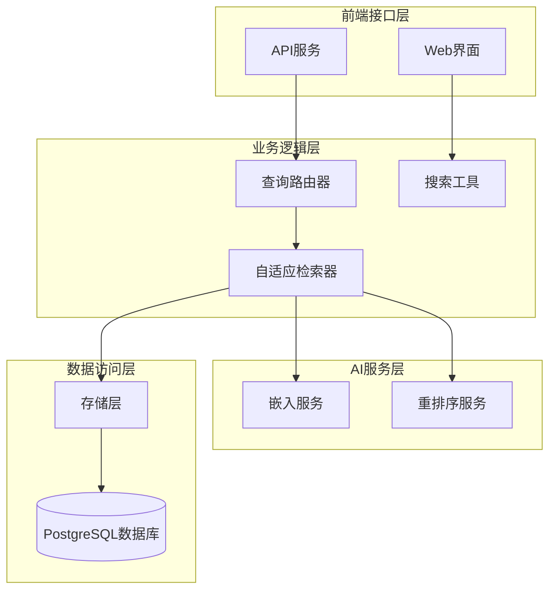
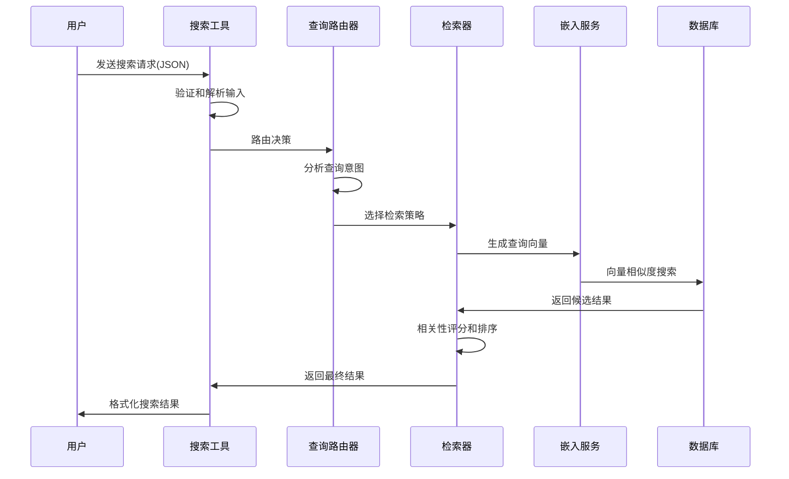
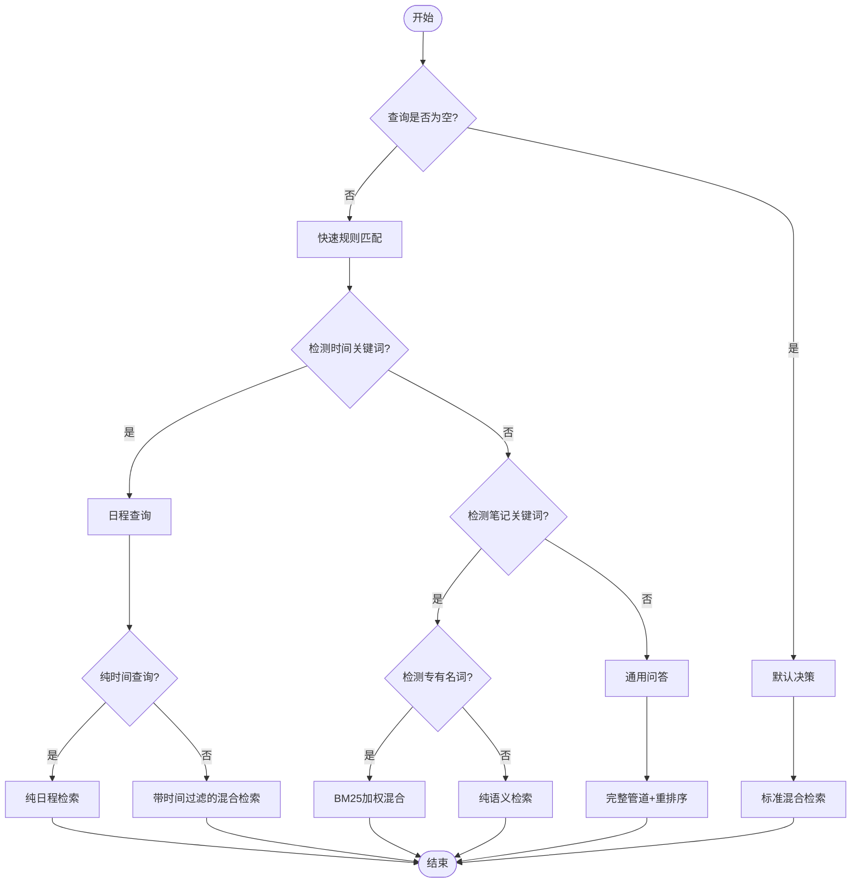
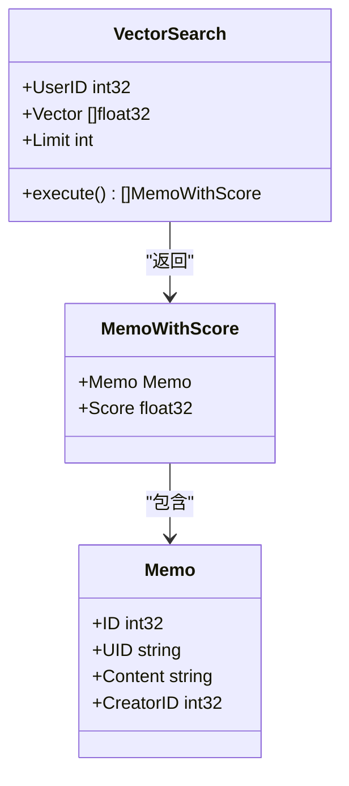
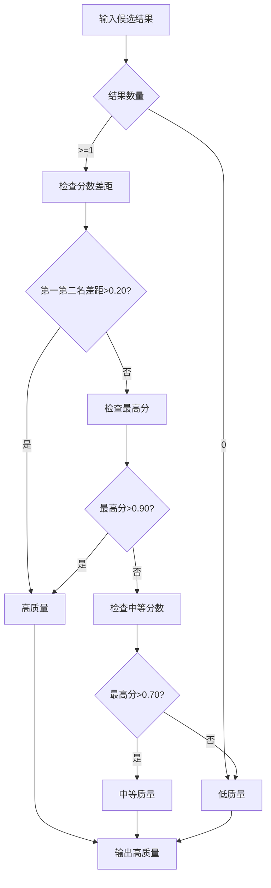
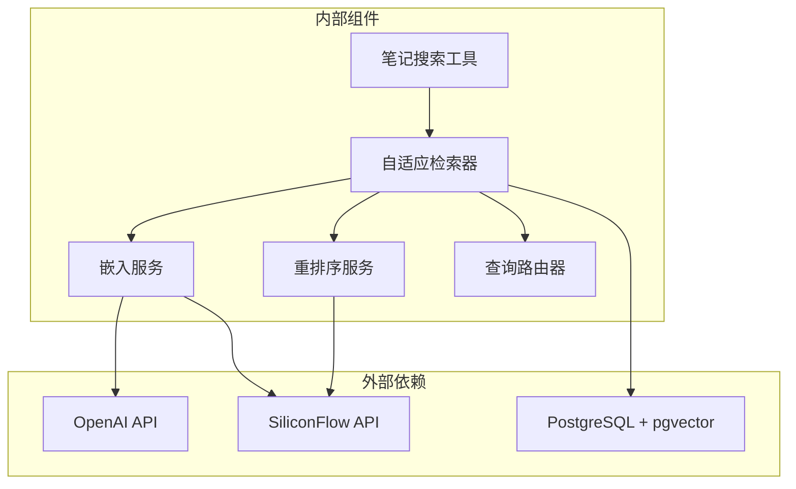

# 笔记搜索工具

<cite>
**本文档引用的文件**
- [plugin/ai/agent/tools/memo_search.go](file://plugin/ai/agent/tools/memo_search.go)
- [server/retrieval/adaptive_retrieval.go](file://server/retrieval/adaptive_retrieval.go)
- [server/queryengine/query_router.go](file://server/queryengine/query_router.go)
- [server/router/api/v1/ai_service_semantic.go](file://server/router/api/v1/ai_service_semantic.go)
- [plugin/ai/embedding.go](file://plugin/ai/embedding.go)
- [plugin/ai/reranker.go](file://plugin/ai/reranker.go)
- [store/db/postgres/memo_embedding.go](file://store/db/postgres/memo_embedding.go)
- [store/db/postgres/memo.go](file://store/db/postgres/memo.go)
- [proto/api/v1/ai_service.proto](file://proto/api/v1/ai_service.proto)
- [docs/specs/AI-012-semantic-search-api.md](file://docs/specs/AI-012-semantic-search-api.md)
- [docs/archived/cleanup_20260123/optimal_rag/MEMOS_OPTIMAL_RAG_SOLUTION.md](file://docs/archived/cleanup_20260123/optimal_rag/MEMOS_OPTIMAL_RAG_SOLUTION.md)
</cite>

## 目录
1. [简介](#简介)
2. [项目结构](#项目结构)
3. [核心组件](#核心组件)
4. [架构概览](#架构概览)
5. [详细组件分析](#详细组件分析)
6. [依赖关系分析](#依赖关系分析)
7. [性能考虑](#性能考虑)
8. [故障排除指南](#故障排除指南)
9. [结论](#结论)
10. [附录](#附录)

## 简介

笔记搜索工具是一个基于语义理解的智能搜索系统，能够处理自然语言查询并提供相关的笔记内容。该系统结合了向量检索、BM25全文搜索和智能路由技术，实现了高效、准确的笔记搜索功能。

系统的核心特性包括：
- **多模态搜索**：支持语义向量搜索和关键词BM25搜索
- **智能路由**：根据查询内容自动选择最优搜索策略
- **语义理解**：通过预训练模型理解查询意图
- **相关性排序**：使用多种算法进行结果排序和筛选
- **实时优化**：支持重排序和结果质量评估

## 项目结构

笔记搜索工具的实现分布在多个层次中：



**图表来源**
- [plugin/ai/agent/tools/memo_search.go](file://plugin/ai/agent/tools/memo_search.go#L53-L193)
- [server/retrieval/adaptive_retrieval.go](file://server/retrieval/adaptive_retrieval.go#L24-L66)
- [server/queryengine/query_router.go](file://server/queryengine/query_router.go#L18-L40)

**章节来源**
- [plugin/ai/agent/tools/memo_search.go](file://plugin/ai/agent/tools/memo_search.go#L1-L283)
- [server/retrieval/adaptive_retrieval.go](file://server/retrieval/adaptive_retrieval.go#L1-L762)
- [server/queryengine/query_router.go](file://server/queryengine/query_router.go#L1-L800)

## 核心组件

### 搜索工具 (MemoSearchTool)

搜索工具是整个系统的入口点，负责接收用户输入并协调各个组件完成搜索任务。

**主要功能**：
- 接收JSON格式的搜索参数
- 验证和标准化输入参数
- 调用自适应检索器执行搜索
- 格式化搜索结果

**输入参数**：
- `query` (必需): 搜索查询文本
- `limit` (可选): 最大返回结果数量，默认10
- `min_score` (可选): 最小相关性分数，默认0.5
- `strategy` (可选): 检索策略，默认"memo_semantic_only"

**输出格式**：
- 结构化JSON结果
- 包含查询、结果列表和计数
- 每个结果包含UID、内容和分数

### 自适应检索器 (AdaptiveRetriever)

自适应检索器是系统的核心组件，根据查询复杂度动态选择最优的检索策略。

**检索策略**：
- `memo_semantic_only`: 纯语义向量搜索
- `hybrid_standard`: 标准混合搜索（BM25 + 语义）
- `hybrid_bm25_weighted`: BM25加权混合搜索
- `hybrid_with_time_filter`: 带时间过滤的混合搜索
- `full_pipeline_with_reranker`: 完整管道（含重排序）

**章节来源**
- [plugin/ai/agent/tools/memo_search.go](file://plugin/ai/agent/tools/memo_search.go#L53-L193)
- [server/retrieval/adaptive_retrieval.go](file://server/retrieval/adaptive_retrieval.go#L42-L115)

## 架构概览

笔记搜索系统采用分层架构设计，确保了良好的可维护性和扩展性：



**图表来源**
- [plugin/ai/agent/tools/memo_search.go](file://plugin/ai/agent/tools/memo_search.go#L109-L193)
- [server/retrieval/adaptive_retrieval.go](file://server/retrieval/adaptive_retrieval.go#L68-L115)
- [server/queryengine/query_router.go](file://server/queryengine/query_router.go#L449-L465)

## 详细组件分析

### 查询路由系统

查询路由系统是智能搜索的关键，它能够理解用户的自然语言查询并选择最优的检索策略。

#### 路由决策流程



**图表来源**
- [server/queryengine/query_router.go](file://server/queryengine/query_router.go#L467-L552)

#### 时间关键词识别

系统支持丰富的中文时间表达方式：

| 时间类型 | 关键词示例 | 说明 |
|---------|-----------|------|
| 相对日期 | 今天、明天、昨天、前天 | 基于当前日期计算 |
| 相对周 | 本周、下周、上周 | 基于当前周计算 |
| 相对月 | 本月、下月、上月 | 基于当前月计算 |
| 相对年 | 今年、明年、去年 | 基于当前年计算 |
| 星期 | 周一至周日、星期一至星期日 | 支持简写和全称 |
| 时段 | 上午、下午、晚上、中午 | 时间段划分 |

**章节来源**
- [server/queryengine/query_router.go](file://server/queryengine/query_router.go#L108-L447)

### 检索算法实现

#### 向量相似度搜索

系统使用pgvector扩展实现高效的向量相似度搜索：



**图表来源**
- [store/db/postgres/memo_embedding.go](file://store/db/postgres/memo_embedding.go#L111-L192)
- [store/db/postgres/memo.go](file://store/db/postgres/memo.go#L279-L340)

#### BM25全文搜索

系统使用PostgreSQL的tsvector实现BM25全文搜索：

| 搜索类型 | 算法 | 特点 | 适用场景 |
|---------|------|------|----------|
| BM25 | 基于词频的排序算法 | 对短查询效果好 | 关键词精确匹配 |
| 向量搜索 | 语义相似度计算 | 对语义理解好 | 自然语言查询 |
| 混合搜索 | RRF融合算法 | 平衡两者优势 | 复杂查询场景 |

**章节来源**
- [store/db/postgres/memo_embedding.go](file://store/db/postgres/memo_embedding.go#L259-L332)

### 相关性排序机制

系统采用多层排序机制确保搜索结果的相关性：

#### 质量评估系统



**图表来源**
- [server/retrieval/adaptive_retrieval.go](file://server/retrieval/adaptive_retrieval.go#L627-L655)

#### RRF融合算法

Reciprocal Rank Fusion (RRF)算法用于融合不同搜索结果：

公式：RRF = Σ weight_i / (k + rank_i)

其中k=60，rank_i是文档在第i个列表中的排名。

**章节来源**
- [server/retrieval/adaptive_retrieval.go](file://server/retrieval/adaptive_retrieval.go#L523-L602)

## 依赖关系分析



**图表来源**
- [plugin/ai/embedding.go](file://plugin/ai/embedding.go#L23-L58)
- [plugin/ai/reranker.go](file://plugin/ai/reranker.go#L29-L53)

**章节来源**
- [plugin/ai/embedding.go](file://plugin/ai/embedding.go#L1-L103)
- [plugin/ai/reranker.go](file://plugin/ai/reranker.go#L1-L127)

## 性能考虑

### 查询优化策略

系统采用了多项性能优化措施：

1. **并行查询执行**：向量搜索和BM25搜索并行执行，提高响应速度
2. **结果质量评估**：根据质量等级动态调整搜索深度
3. **内存优化**：预分配切片容量，及时释放大对象引用
4. **缓存机制**：嵌入向量结果缓存，避免重复计算

### 性能基准

| 组件 | 性能指标 | 优化目标 |
|------|----------|----------|
| 查询路由 | <1.2μs | <10μs |
| 时间检测 | 194.5ns | <1000ns |
| 内容提取 | 523.0ns | <1000ns |
| 专有名词检测 | 530.5ns | <1000ns |
| 时间验证 | 50.04ns | 0内存分配 |

**章节来源**
- [docs/archived/cleanup_20260123/optimal_rag/FINAL_CODE_REVIEW_REPORT.md](file://docs/archived/cleanup_20260123/optimal_rag/FINAL_CODE_REVIEW_REPORT.md#L612-L635)

## 故障排除指南

### 常见问题及解决方案

#### 1. 搜索结果不相关

**可能原因**：
- 查询过于简单或模糊
- 嵌入模型不适用当前领域
- 相关性阈值设置过高

**解决方法**：
- 优化查询关键词
- 调整min_score参数
- 使用更具体的查询语句

#### 2. 搜索响应缓慢

**可能原因**：
- 数据库连接问题
- 嵌入服务API调用超时
- 查询过于复杂

**解决方法**：
- 检查数据库连接状态
- 增加超时时间
- 简化查询或分批执行

#### 3. 向量搜索失败

**可能原因**：
- pgvector扩展未正确安装
- 嵌入维度不匹配
- 数据库权限问题

**解决方法**：
- 确认pgvector扩展安装
- 检查嵌入维度配置
- 验证数据库用户权限

**章节来源**
- [server/retrieval/adaptive_retrieval.go](file://server/retrieval/adaptive_retrieval.go#L78-L81)
- [store/db/postgres/memo_embedding.go](file://store/db/postgres/memo_embedding.go#L135-L145)

## 结论

笔记搜索工具是一个功能完整、性能优异的智能搜索系统。通过结合语义理解、关键词搜索和智能路由技术，系统能够在各种查询场景下提供准确、相关的结果。

**主要优势**：
- **多模态融合**：同时支持语义和关键词搜索
- **智能路由**：根据查询内容自动选择最优策略
- **高性能**：经过优化的查询执行和缓存机制
- **可扩展性**：模块化设计便于功能扩展

**应用场景**：
- 个人知识管理
- 团队协作搜索
- 文档检索系统
- 智能问答助手

## 附录

### 使用示例

#### 基本搜索
```json
{
  "query": "项目进度报告",
  "limit": 10,
  "min_score": 0.5
}
```

#### 高级搜索
```json
{
  "query": "Python编程学习笔记",
  "limit": 5,
  "min_score": 0.7,
  "strategy": "hybrid_bm25_weighted"
}
```

### 最佳实践

1. **查询优化**
   - 使用具体、明确的关键词
   - 避免过长的查询语句
   - 结合时间范围进行精确搜索

2. **参数调优**
   - 根据需求调整limit参数
   - 合理设置min_score阈值
   - 选择合适的检索策略

3. **性能优化**
   - 预先建立嵌入向量缓存
   - 使用并行查询处理大量数据
   - 定期清理无效的搜索结果

**章节来源**
- [plugin/ai/agent/tools/memo_search.go](file://plugin/ai/agent/tools/memo_search.go#L85-L98)
- [docs/specs/AI-012-semantic-search-api.md](file://docs/specs/AI-012-semantic-search-api.md#L15-L142)