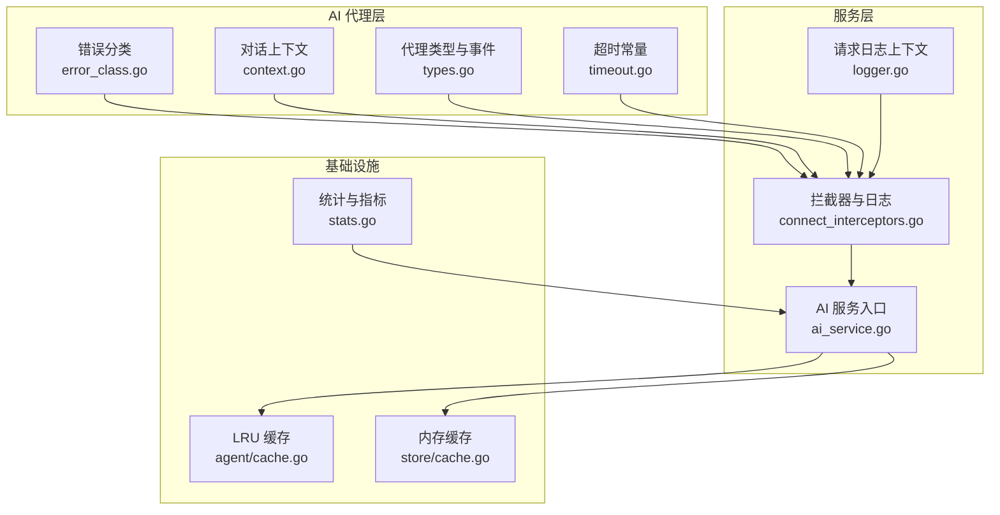
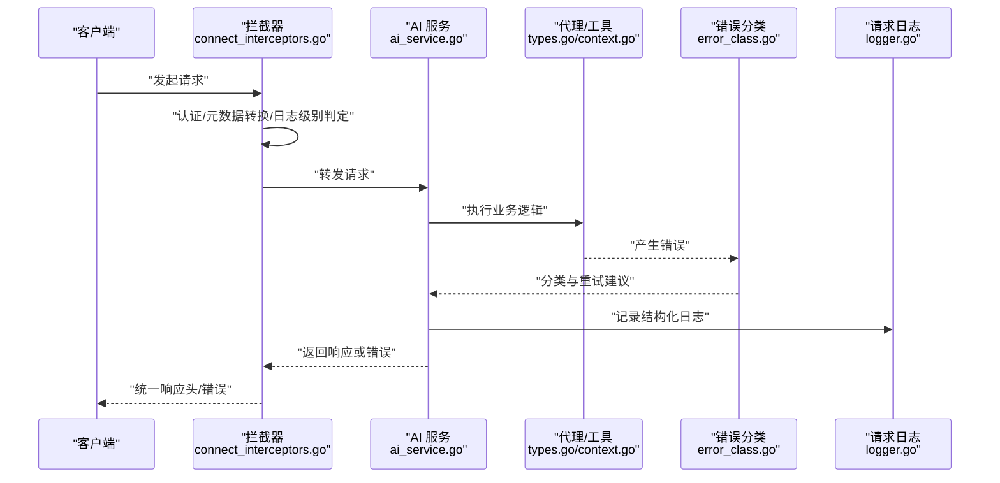
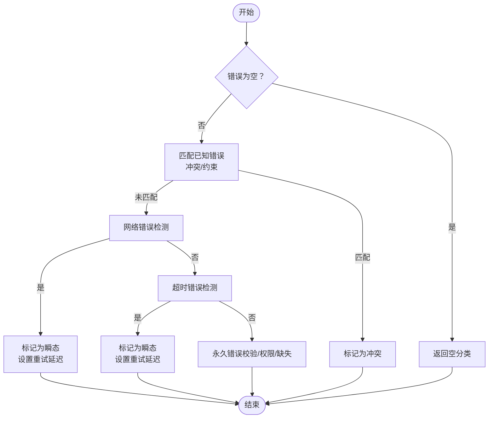
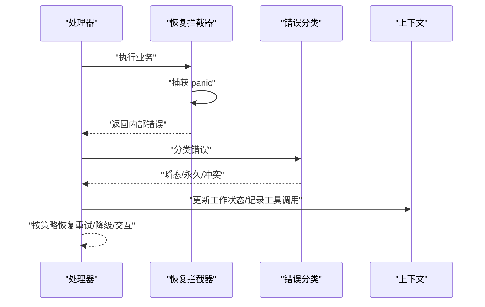
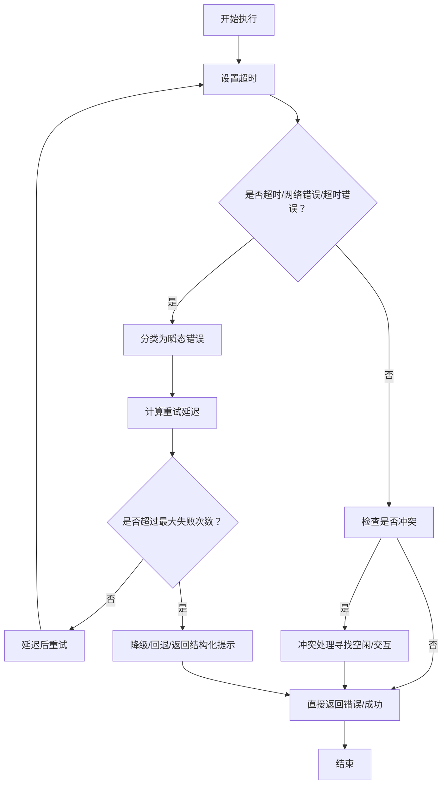
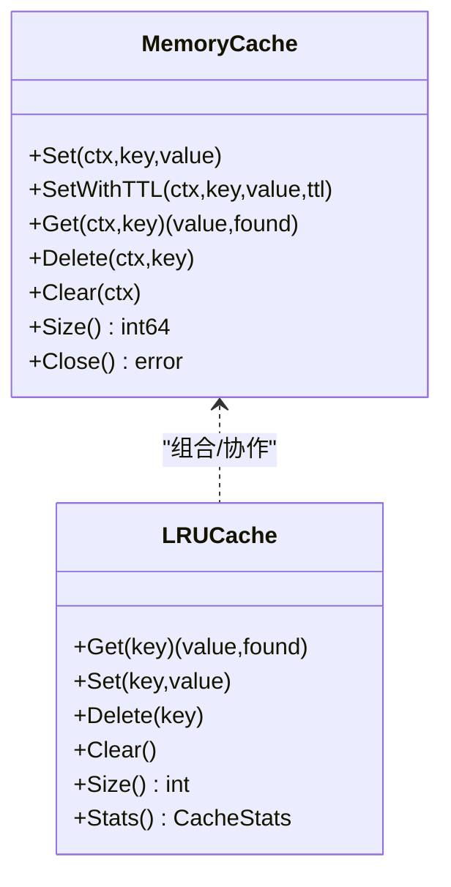
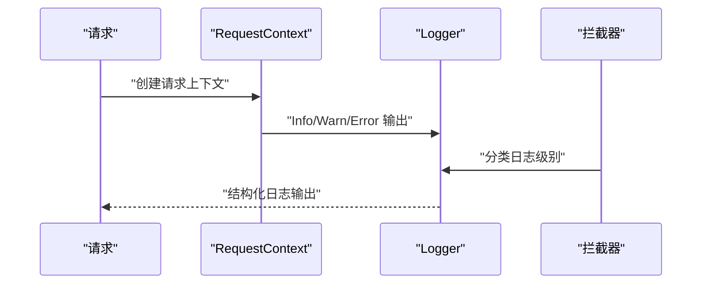
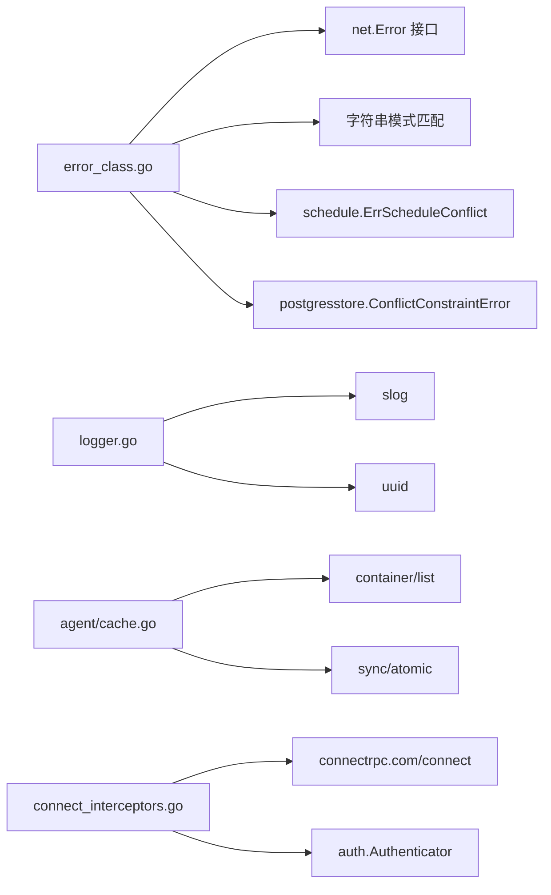

# Parrot 错误处理与监控

<cite>
**本文引用的文件**
- [error_class.go](file://plugin/ai/agent/error_class.go)
- [codes.go](file://server/internal/errors/codes.go)
- [logger.go](file://server/internal/observability/logger.go)
- [timeout.go](file://plugin/ai/timeout/timeout.go)
- [cache.go](file://store/cache/cache.go)
- [stats.go](file://server/stats/stats.go)
- [cache.go](file://plugin/ai/agent/cache.go)
- [context.go](file://plugin/ai/agent/context.go)
- [connect_interceptors.go](file://server/router/api/v1/connect_interceptors.go)
- [ai_service.go](file://server/router/api/v1/ai_service.go)
- [types.go](file://plugin/ai/agent/types.go)
- [util.go](file://plugin/ai/agent/util.go)
</cite>

## 目录
1. [简介](#简介)
2. [项目结构](#项目结构)
3. [核心组件](#核心组件)
4. [架构总览](#架构总览)
5. [详细组件分析](#详细组件分析)
6. [依赖关系分析](#依赖关系分析)
7. [性能考量](#性能考量)
8. [故障排查指南](#故障排查指南)
9. [结论](#结论)
10. [附录](#附录)

## 简介
本文件系统化梳理 Parrot 错误处理与监控体系，覆盖错误分类与传播、异常恢复策略、超时与重试、降级方案、缓存失效与性能监控、日志记录策略，并提供故障排查与优化建议。目标是帮助开发者与运维人员快速定位问题、稳定系统运行并持续优化体验。

## 项目结构
围绕错误处理与监控的关键模块分布如下：
- 错误分类与传播：plugin/ai/agent/error_class.go
- 结构化 AI 错误码：server/internal/errors/codes.go
- 请求级日志与上下文：server/internal/observability/logger.go
- 超时与重试常量：plugin/ai/timeout/timeout.go
- 缓存实现与统计：store/cache/cache.go、plugin/ai/agent/cache.go
- 统计与指标采集：server/stats/stats.go
- 连接层拦截器与日志：server/router/api/v1/connect_interceptors.go
- 服务入口与限流：server/router/api/v1/ai_service.go
- 类型与事件模型：plugin/ai/agent/types.go
- 辅助工具：plugin/ai/agent/util.go

**图表来源**
- [error_class.go](file://plugin/ai/agent/error_class.go#L1-L232)
- [context.go](file://plugin/ai/agent/context.go#L1-L488)
- [types.go](file://plugin/ai/agent/types.go#L1-L353)
- [timeout.go](file://plugin/ai/timeout/timeout.go#L1-L49)
- [connect_interceptors.go](file://server/router/api/v1/connect_interceptors.go#L1-L275)
- [ai_service.go](file://server/router/api/v1/ai_service.go#L1-L74)
- [logger.go](file://server/internal/observability/logger.go#L1-L152)
- [cache.go](file://plugin/ai/agent/cache.go#L1-L292)
- [cache.go](file://store/cache/cache.go#L1-L328)
- [stats.go](file://server/stats/stats.go#L1-L372)

**章节来源**
- [error_class.go](file://plugin/ai/agent/error_class.go#L1-L232)
- [codes.go](file://server/internal/errors/codes.go#L1-L148)
- [logger.go](file://server/internal/observability/logger.go#L1-L152)
- [timeout.go](file://plugin/ai/timeout/timeout.go#L1-L49)
- [cache.go](file://store/cache/cache.go#L1-L328)
- [cache.go](file://plugin/ai/agent/cache.go#L1-L292)
- [stats.go](file://server/stats/stats.go#L1-L372)
- [context.go](file://plugin/ai/agent/context.go#L1-L488)
- [connect_interceptors.go](file://server/router/api/v1/connect_interceptors.go#L1-L275)
- [ai_service.go](file://server/router/api/v1/ai_service.go#L1-L74)
- [types.go](file://plugin/ai/agent/types.go#L1-L353)
- [util.go](file://plugin/ai/agent/util.go#L1-L14)

## 核心组件
- 错误分类与重试决策：基于错误类型进行瞬态/永久/冲突三分类，并给出重试延迟与冲突处理建议。
- 结构化 AI 错误码：统一错误码与上下文，便于前端与监控识别。
- 请求级日志上下文：为每次请求注入 request_id、user_id、agent_type 等字段，支持结构化日志与追踪。
- 超时与重试常量：集中管理流式响应、代理执行、工具执行、嵌入等超时阈值与最大迭代次数。
- 缓存体系：内存缓存与 LRU 缓存双轨，支持 TTL、淘汰与统计。
- 统计与指标：本地统计收集器，周期性汇总使用情况，辅助容量规划与异常观察。
- 连接层拦截器：统一日志级别、错误分类、panic 恢复与认证拦截。

**章节来源**
- [error_class.go](file://plugin/ai/agent/error_class.go#L84-L149)
- [codes.go](file://server/internal/errors/codes.go#L31-L147)
- [logger.go](file://server/internal/observability/logger.go#L30-L151)
- [timeout.go](file://plugin/ai/timeout/timeout.go#L9-L48)
- [cache.go](file://store/cache/cache.go#L10-L32)
- [cache.go](file://plugin/ai/agent/cache.go#L10-L50)
- [stats.go](file://server/stats/stats.go#L14-L45)
- [connect_interceptors.go](file://server/router/api/v1/connect_interceptors.go#L89-L158)

## 架构总览
下图展示了从请求进入、错误分类、日志记录、缓存与统计到最终响应的整体流程。

**图表来源**
- [connect_interceptors.go](file://server/router/api/v1/connect_interceptors.go#L19-L158)
- [ai_service.go](file://server/router/api/v1/ai_service.go#L20-L73)
- [types.go](file://plugin/ai/agent/types.go#L10-L23)
- [context.go](file://plugin/ai/agent/context.go#L19-L101)
- [error_class.go](file://plugin/ai/agent/error_class.go#L84-L149)
- [logger.go](file://server/internal/observability/logger.go#L30-L122)

## 详细组件分析

### 错误分类与传播机制
- 分类维度
  - 瞬态错误：网络错误、超时等可重试场景，建议延迟重试。
  - 永久错误：参数无效、权限不足、资源不存在等，不建议重试。
  - 冲突错误：日程冲突、数据库约束冲突等，需特殊处理与提示。
- 传播路径
  - 服务层根据错误分类决定是否重试、延迟多久、是否转为冲突处理。
  - 结构化 AI 错误码用于统一对外错误语义，便于前端与监控识别。
- 典型规则
  - 网络错误模式匹配与超时模式匹配优先。
  - 已知冲突错误与数据库约束错误归类为冲突。
  - 默认未知错误按“永久错误”处理，确保系统稳健。

**图表来源**
- [error_class.go](file://plugin/ai/agent/error_class.go#L84-L207)

**章节来源**
- [error_class.go](file://plugin/ai/agent/error_class.go#L17-L82)
- [error_class.go](file://plugin/ai/agent/error_class.go#L84-L149)
- [error_class.go](file://plugin/ai/agent/error_class.go#L151-L207)
- [codes.go](file://server/internal/errors/codes.go#L7-L29)
- [codes.go](file://server/internal/errors/codes.go#L127-L147)

### 异常恢复策略
- panic 恢复：拦截器捕获 panic 并返回内部错误，避免进程崩溃。
- 错误分类驱动的恢复：对瞬态错误采用指数退避或固定延迟重试；对冲突错误引导用户交互或自动寻找空闲时段。
- 上下文与会话：通过对话上下文记录工作状态、意图与工具调用，便于在异常后恢复或回滚。

**图表来源**
- [connect_interceptors.go](file://server/router/api/v1/connect_interceptors.go#L160-L199)
- [error_class.go](file://plugin/ai/agent/error_class.go#L84-L149)
- [context.go](file://plugin/ai/agent/context.go#L19-L73)

**章节来源**
- [connect_interceptors.go](file://server/router/api/v1/connect_interceptors.go#L160-L199)
- [context.go](file://plugin/ai/agent/context.go#L116-L144)

### 超时处理机制、重试策略与降级方案
- 超时常量
  - 流式响应：5 分钟
  - 代理执行：2 分钟
  - 工具执行：30 秒
  - 嵌入生成：30 秒
  - 最大迭代次数：5 次
- 重试策略
  - 瞬态错误：按分类建议的 RetryAfter 延迟重试，避免雪崩。
  - 连续失败上限：工具连续失败超过阈值则中止，防止资源浪费。
- 降级方案
  - LLM 不可用时，优先使用基础检索与嵌入能力；必要时返回结构化提示而非阻塞等待。
  - 缓存不可用时，走直连路径并记录降级事件，后续恢复后补齐缓存。

**图表来源**
- [timeout.go](file://plugin/ai/timeout/timeout.go#L9-L48)
- [error_class.go](file://plugin/ai/agent/error_class.go#L111-L127)
- [error_class.go](file://plugin/ai/agent/error_class.go#L209-L222)

**章节来源**
- [timeout.go](file://plugin/ai/timeout/timeout.go#L9-L48)
- [error_class.go](file://plugin/ai/agent/error_class.go#L209-L231)

### 缓存失效处理与性能监控
- 缓存实现
  - 内存缓存：带 TTL、清理周期、逐出回调，适合短期热点数据。
  - LRU 缓存：支持最大条目数与 TTL，命中/未命中统计，适合高并发场景。
- 失效策略
  - TTL 到期自动清理；内存压力时按 LRU 淘汰最旧项。
  - 提供显式删除与清空接口，便于主动失效。
- 监控指标
  - 命中/未命中计数与命中率，结合业务埋点评估效果。
  - 统计收集器周期性汇总使用趋势，辅助容量规划。

**图表来源**
- [cache.go](file://store/cache/cache.go#L10-L32)
- [cache.go](file://store/cache/cache.go#L66-L197)
- [cache.go](file://plugin/ai/agent/cache.go#L10-L50)
- [cache.go](file://plugin/ai/agent/cache.go#L63-L145)

**章节来源**
- [cache.go](file://store/cache/cache.go#L10-L328)
- [cache.go](file://plugin/ai/agent/cache.go#L10-L292)
- [stats.go](file://server/stats/stats.go#L14-L45)

### 日志记录策略与请求追踪
- 请求上下文
  - 自动生成 request_id，附加 user_id、agent_type、起始时间。
  - 支持 Info/Warn/Error 等多级别日志，自动合并基础属性。
- 连接层日志
  - 统一日志级别：客户端错误（预期）以 Info/Warn 记录，服务端错误以 Error 记录。
  - 恢复拦截器记录 panic 并返回内部错误，保障可观测性。
- 字段规范
  - request_id、user_id、agent_type、duration_ms、message_length、error_code、event_type、iteration 等。

**图表来源**
- [logger.go](file://server/internal/observability/logger.go#L30-L122)
- [connect_interceptors.go](file://server/router/api/v1/connect_interceptors.go#L89-L158)

**章节来源**
- [logger.go](file://server/internal/observability/logger.go#L11-L122)
- [connect_interceptors.go](file://server/router/api/v1/connect_interceptors.go#L89-L158)

### 服务入口与限流
- 全局 AI 限流器：在服务入口处进行速率限制，避免突发流量冲击下游。
- 功能开关：根据嵌入/LLM 服务能力动态启用/禁用对应功能，确保降级可控。

**章节来源**
- [ai_service.go](file://server/router/api/v1/ai_service.go#L17-L55)

## 依赖关系分析
- 错误分类依赖：网络错误接口、超时错误模式、具体业务冲突错误。
- 日志依赖：slog、UUID 生成、请求上下文。
- 缓存依赖：原子计数、并发安全容器、TTL 时间管理。
- 拦截器依赖：Connect 错误码、gRPC 元数据、认证器。

**图表来源**
- [error_class.go](file://plugin/ai/agent/error_class.go#L6-L15)
- [logger.go](file://server/internal/observability/logger.go#L3-L9)
- [cache.go](file://plugin/ai/agent/cache.go#L3-L8)
- [connect_interceptors.go](file://server/router/api/v1/connect_interceptors.go#L3-L17)

**章节来源**
- [error_class.go](file://plugin/ai/agent/error_class.go#L6-L15)
- [logger.go](file://server/internal/observability/logger.go#L3-L9)
- [cache.go](file://plugin/ai/agent/cache.go#L3-L8)
- [connect_interceptors.go](file://server/router/api/v1/connect_interceptors.go#L3-L17)

## 性能考量
- 超时与重试
  - 合理设置工具执行与代理执行超时，避免长尾阻塞。
  - 对瞬态错误采用指数退避或抖动，降低集中重试风险。
- 缓存策略
  - 为高频查询开启 LRU 缓存，设置合适 TTL 与最大条目数。
  - 监控命中率，逐步调整阈值与淘汰策略。
- 统计与容量
  - 利用统计收集器观察趋势，提前扩容或优化慢查询。
- 日志与追踪
  - 仅记录必要字段，避免日志风暴；对关键路径打点统计耗时。

[本节为通用指导，无需特定文件引用]

## 故障排查指南
- 常见症状与定位
  - 瞬态错误频繁：检查网络连通性、上游限流与超时配置。
  - 冲突错误：核对日程冲突检测逻辑与用户交互提示。
  - 缓存命中率低：检查键设计、TTL 设置与热键分布。
  - 日志缺失：确认拦截器日志级别与请求上下文注入。
- 快速步骤
  - 查看拦截器日志级别与错误分类，区分客户端错误与服务端错误。
  - 通过 request_id 在日志中串联一次请求全链路。
  - 检查缓存统计与清理周期，确认是否存在内存泄漏或过早淘汰。
  - 对代理执行进行分步日志与事件回调，定位失败工具与输入。
- 参考实现
  - 错误分类与重试：参考错误分类函数与重试判断。
  - 请求日志：参考请求上下文与拦截器日志分类。
  - 缓存统计：参考 LRU 缓存命中/未命中统计。

**章节来源**
- [error_class.go](file://plugin/ai/agent/error_class.go#L84-L149)
- [connect_interceptors.go](file://server/router/api/v1/connect_interceptors.go#L119-L158)
- [logger.go](file://server/internal/observability/logger.go#L74-L97)
- [cache.go](file://plugin/ai/agent/cache.go#L178-L197)

## 结论
通过统一的错误分类、结构化错误码、请求级日志与拦截器、集中式超时与重试策略、双轨缓存与统计体系，Parrot 在稳定性与可观测性方面形成了闭环。建议在生产环境中结合监控面板与告警策略，持续优化超时阈值、缓存命中率与重试退避参数，以获得更佳的用户体验与系统韧性。

[本节为总结，无需特定文件引用]

## 附录
- 关键字段与含义
  - request_id：请求唯一标识，用于跨组件追踪。
  - user_id：用户标识，便于审计与限流。
  - agent_type：代理类型，区分不同业务域。
  - duration_ms：请求耗时（毫秒），用于性能分析。
  - message_length：消息长度，辅助日志与限流。
  - error_code：结构化错误码，便于前端与监控识别。
  - event_type：事件类型，如思考、工具使用、结果、错误等。
  - iteration：迭代次数，用于 ReAct 循环控制。
- 建议的监控告警配置
  - 错误率：瞬态错误与永久错误占比异常。
  - 超时率：代理执行与工具执行超时阈值告警。
  - 缓存命中率：命中率骤降或持续偏低。
  - 响应时间：P50/P95/P99 显著上升。
  - 重试次数：连续失败次数超过阈值。

**章节来源**
- [logger.go](file://server/internal/observability/logger.go#L11-L28)
- [types.go](file://plugin/ai/agent/types.go#L117-L139)
- [timeout.go](file://plugin/ai/timeout/timeout.go#L30-L48)
- [stats.go](file://server/stats/stats.go#L14-L45)