# Schedule Parrot 日程管理代理

<cite>
**本文档引用的文件**
- [schedule_parrot_v2.go](file://plugin/ai/agent/schedule_parrot_v2.go)
- [scheduler_v2.go](file://plugin/ai/agent/scheduler_v2.go)
- [intent_classifier.go](file://plugin/ai/agent/intent_classifier.go)
- [llm_intent_classifier.go](file://plugin/ai/agent/llm_intent_classifier.go)
- [types.go](file://plugin/ai/agent/types.go)
- [parser.go](file://plugin/ai/schedule/parser.go)
- [recurrence.go](file://plugin/ai/schedule/recurrence.go)
- [timezone_validator.go](file://plugin/ai/schedule/timezone_validator.go)
- [scheduler.go](file://plugin/ai/agent/tools/scheduler.go)
- [service.go](file://server/service/schedule/service.go)
- [context.go](file://plugin/ai/agent/context.go)
- [schedule_agent_service.go](file://server/router/api/v1/schedule_agent_service.go)
- [scheduler_test.go](file://plugin/ai/agent/scheduler_test.go)
- [scheduler_test.go](file://plugin/ai/agent/tools/scheduler_test.go)
- [timeout.go](file://plugin/ai/timeout/timeout.go)
- [useParrotChat.ts](file://web/src/hooks/useParrotChat.ts)
- [useAIQueries.ts](file://web/src/hooks/useAIQueries.ts)
- [parrot.ts](file://web/src/types/parrot.ts)
- [GenerativeUIContainer.tsx](file://web/src/components/ScheduleAI/GenerativeUIContainer.tsx)
- [ScheduleSuggestionCard.tsx](file://web/src/components/ScheduleAI/ScheduleSuggestionCard.tsx)
- [ConflictResolution.tsx](file://web/src/components/ScheduleAI/ConflictResolution.tsx)
- [ParrotEmotionalIndicator.tsx](file://web/src/components/AIChat/ParrotEmotionalIndicator.tsx)
- [COLOR_GUIDE.md](file://web/src/themes/COLOR_GUIDE.md)
- [default.css](file://web/src/themes/default.css)
- [default-dark.css](file://web/src/themes/default-dark.css)
- [midnight.css](file://web/src/themes/midnight.css)
- [paper.css](file://web/src/themes/paper.css)
- [whitewall.css](file://web/src/themes/whitewall.css)
- [useUserTheme.ts](file://web/src/hooks/useUserTheme.ts)
- [theme.ts](file://web/src/utils/theme.ts)
- [ThemeSelect.tsx](file://web/src/components/ThemeSelect.tsx)
</cite>

## 更新摘要
**变更内容**
- 代理系统主题统一化，移除特定代理主题配置，采用统一设计系统令牌
- 新增了强大的意图分类系统，支持规则引擎和 LLM 两种分类方式
- 改进了工具调用能力，增加了 UI 事件发射功能
- 增强了前端交互体验，支持生成式 UI 组件
- 完善了情感表达和行为描述系统

## 目录
1. [简介](#简介)
2. [项目结构](#项目结构)
3. [核心组件](#核心组件)
4. [架构总览](#架构总览)
5. [详细组件分析](#详细组件分析)
6. [依赖关系分析](#依赖关系分析)
7. [性能考虑](#性能考虑)
8. [故障排除指南](#故障排除指南)
9. [结论](#结论)
10. [附录](#附录)

## 简介
Schedule Parrot 日程管理代理是一个基于大模型工具调用的智能日程助手，专注于日程查询、添加、更新和空闲时间查找。它采用框架无关的设计，通过自然语言解析、冲突检测、重复规则处理和时间区域管理，为用户提供流畅的日程管理体验。

**更新** 本次重大改进引入了全新的意图分类系统，支持规则引擎和 LLM 两种分类方式，并增强了 UI 事件发射功能，实现了真正的生成式 UI 交互体验。同时，代理系统完成了主题统一化改造，移除了特定代理主题配置，采用统一设计系统令牌，确保了视觉设计的一致性和可维护性。

该代理的核心特性包括：
- **智能意图分类**：支持规则引擎和 LLM 两种分类方式，准确识别用户意图
- **自然语言日程解析与标准化**
- **智能冲突检测与自动解决**
- **重复事件规则处理**
- **多时区时间区域管理**
- **并发安全的对话上下文管理**
- **流式事件驱动的交互体验**
- **生成式 UI 组件**：支持日程建议、时间槽选择、冲突解决等交互组件
- **统一设计系统**：采用 OKLCH 颜色空间和统一设计令牌，确保视觉一致性

## 项目结构
Schedule Parrot 位于 Memos 项目的插件体系中，主要涉及以下模块：

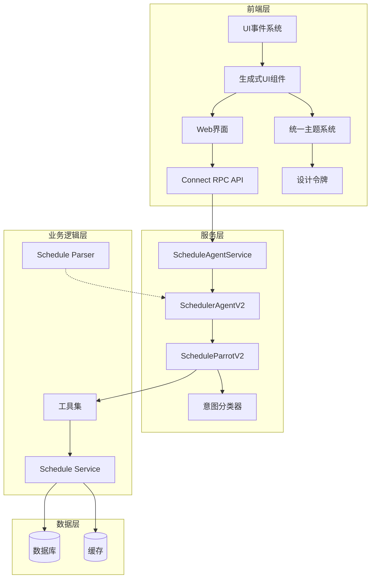

**图表来源**
- [schedule_agent_service.go](file://server/router/api/v1/schedule_agent_service.go#L33-L53)
- [scheduler_v2.go](file://plugin/ai/agent/scheduler_v2.go#L16-L91)
- [schedule_parrot_v2.go](file://plugin/ai/agent/schedule_parrot_v2.go#L9-L24)
- [intent_classifier.go](file://plugin/ai/agent/intent_classifier.go#L35-L47)
- [COLOR_GUIDE.md](file://web/src/themes/COLOR_GUIDE.md#L1-L76)

**章节来源**
- [schedule_agent_service.go](file://server/router/api/v1/schedule_agent_service.go#L33-L53)
- [scheduler_v2.go](file://plugin/ai/agent/scheduler_v2.go#L16-L91)
- [schedule_parrot_v2.go](file://plugin/ai/agent/schedule_parrot_v2.go#L9-L24)

## 核心组件
Schedule Parrot 由多个协同工作的组件构成，每个组件都有明确的职责分工。

### 主要组件概览
- **ScheduleParrotV2**: 代理入口，封装调度器代理
- **SchedulerAgentV2**: 核心调度代理，管理工具调用和对话状态
- **LLMIntentClassifier**: 基于 LLM 的意图分类器，提供高精度分类
- **IntentClassifier**: 规则引擎意图分类器，提供基础分类能力
- **Schedule Parser**: 自然语言解析器，将文本转换为结构化日程
- **工具集**: 提供具体的日程操作能力
- **Schedule Service**: 业务服务层，处理日程的增删改查和冲突检测
- **UI事件系统**: 支持生成式 UI 组件的事件发射和处理
- **统一主题系统**: 基于 OKLCH 颜色空间的设计系统，提供一致的视觉体验

### 组件交互流程
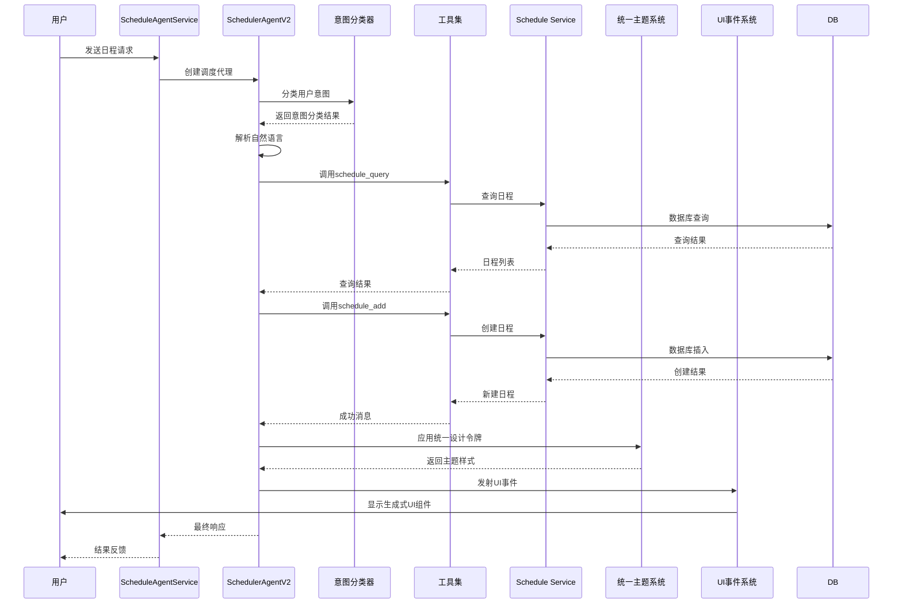

**图表来源**
- [schedule_agent_service.go](file://server/router/api/v1/schedule_agent_service.go#L96-L260)
- [scheduler_v2.go](file://plugin/ai/agent/scheduler_v2.go#L180-L196)
- [llm_intent_classifier.go](file://plugin/ai/agent/llm_intent_classifier.go#L64-L74)
- [scheduler.go](file://plugin/ai/agent/tools/scheduler.go#L183-L266)
- [COLOR_GUIDE.md](file://web/src/themes/COLOR_GUIDE.md#L1-L76)

**章节来源**
- [schedule_parrot_v2.go](file://plugin/ai/agent/schedule_parrot_v2.go#L9-L77)
- [scheduler_v2.go](file://plugin/ai/agent/scheduler_v2.go#L16-L91)
- [llm_intent_classifier.go](file://plugin/ai/agent/llm_intent_classifier.go#L22-L31)
- [scheduler.go](file://plugin/ai/agent/tools/scheduler.go#L132-L266)

## 架构总览
Schedule Parrot 采用分层架构设计，确保了良好的可维护性和扩展性。

### 整体架构图
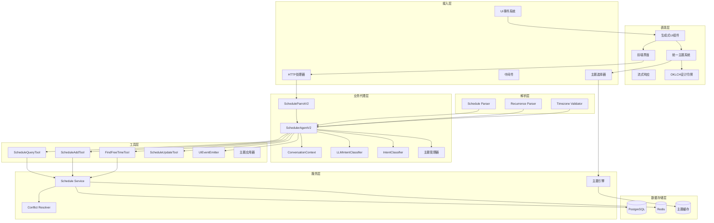

**图表来源**
- [schedule_agent_service.go](file://server/router/api/v1/schedule_agent_service.go#L33-L53)
- [context.go](file://plugin/ai/agent/context.go#L19-L37)
- [types.go](file://plugin/ai/agent/types.go#L107-L139)
- [llm_intent_classifier.go](file://plugin/ai/agent/llm_intent_classifier.go#L22-L31)
- [COLOR_GUIDE.md](file://web/src/themes/COLOR_GUIDE.md#L1-L76)

### 设计模式应用
- **策略模式**: 不同的工具实现遵循统一的接口
- **工厂模式**: 工具实例的创建和管理
- **观察者模式**: 事件驱动的回调机制
- **责任链模式**: 工具调用的顺序执行
- **适配器模式**: UI 事件的适配和转换
- **外观模式**: 统一主题系统的简化接口

**章节来源**
- [context.go](file://plugin/ai/agent/context.go#L19-L37)
- [types.go](file://plugin/ai/agent/types.go#L107-L139)

## 详细组件分析

### ScheduleParrotV2 分析
ScheduleParrotV2 是日程代理的入口包装器，提供了简洁的接口和历史会话恢复能力。

#### 核心功能
- **代理封装**: 将调度器代理包装为独立的 Parrot 实现
- **历史会话恢复**: 支持从历史记录重建对话上下文
- **回调适配**: 统一事件回调格式
- **流式聊天**: 支持实时响应流
- **情感表达系统**: 提供丰富的鹦鹉情感和行为描述
- **主题集成**: 与统一主题系统无缝集成

#### 关键实现特点
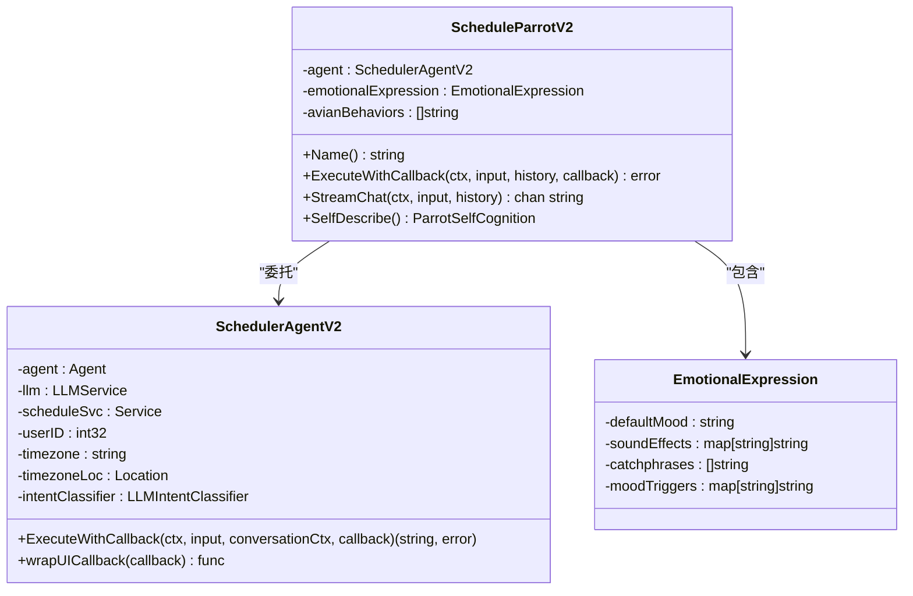

**图表来源**
- [schedule_parrot_v2.go](file://plugin/ai/agent/schedule_parrot_v2.go#L11-L24)
- [scheduler_v2.go](file://plugin/ai/agent/scheduler_v2.go#L18-L25)
- [schedule_parrot_v2.go](file://plugin/ai/agent/schedule_parrot_v2.go#L120-L141)

**章节来源**
- [schedule_parrot_v2.go](file://plugin/ai/agent/schedule_parrot_v2.go#L9-L173)

### SchedulerAgentV2 分析
SchedulerAgentV2 是核心调度代理，实现了完整的工具调用和状态管理。

#### 核心特性
- **意图分类集成**: 支持 LLM 和规则引擎两种意图分类方式
- **工具注册**: 动态注册和管理各种工具
- **系统提示构建**: 根据时区动态生成系统提示
- **UI事件注入**: 自动生成用户界面事件
- **冲突检测**: 智能识别和处理日程冲突
- **事件回调增强**: 支持结构化事件数据
- **主题管理**: 集成统一主题系统，应用设计令牌

#### 工具调用流程
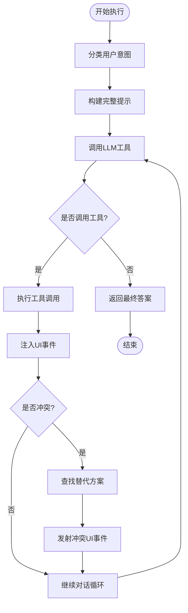

**图表来源**
- [scheduler_v2.go](file://plugin/ai/agent/scheduler_v2.go#L166-L208)
- [scheduler_v2.go](file://plugin/ai/agent/scheduler_v2.go#L230-L257)

**章节来源**
- [scheduler_v2.go](file://plugin/ai/agent/scheduler_v2.go#L16-L91)
- [scheduler_v2.go](file://plugin/ai/agent/scheduler_v2.go#L166-L257)

### 意图分类系统分析
**新增** 意图分类系统是本次更新的核心功能，提供了强大的用户意图识别能力。

#### 意图分类器架构
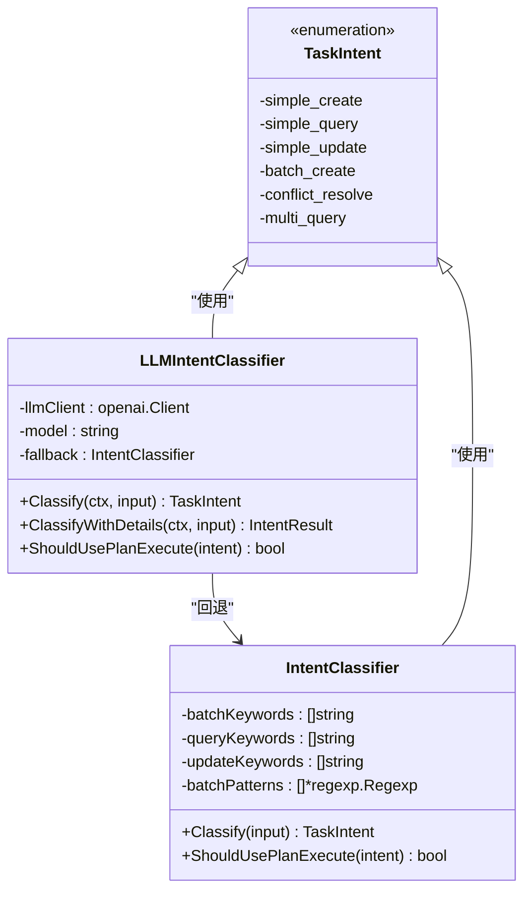

**图表来源**
- [llm_intent_classifier.go](file://plugin/ai/agent/llm_intent_classifier.go#L22-L31)
- [intent_classifier.go](file://plugin/ai/agent/intent_classifier.go#L8-L29)

#### 意图分类流程
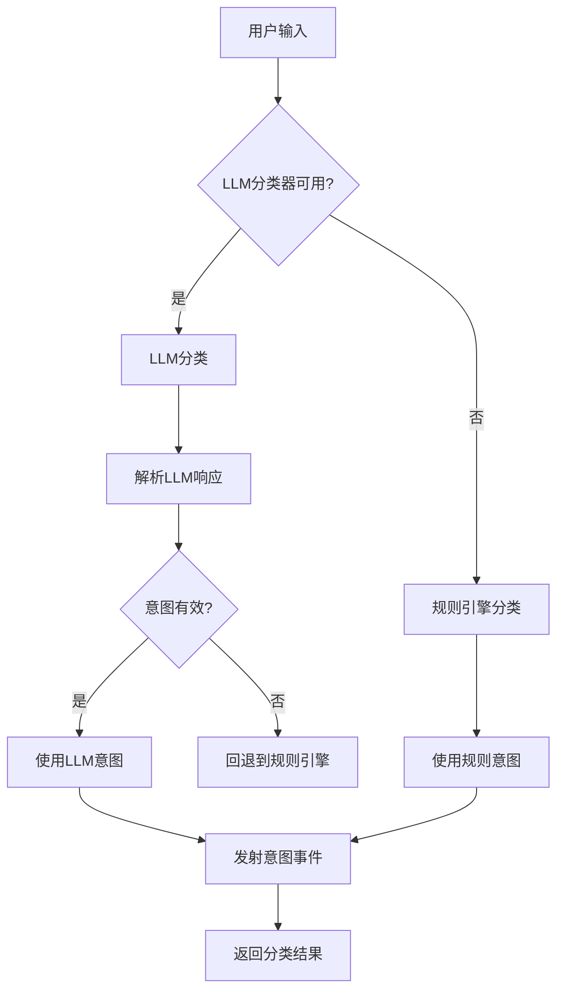

**图表来源**
- [llm_intent_classifier.go](file://plugin/ai/agent/llm_intent_classifier.go#L64-L74)
- [intent_classifier.go](file://plugin/ai/agent/intent_classifier.go#L104-L125)

**章节来源**
- [llm_intent_classifier.go](file://plugin/ai/agent/llm_intent_classifier.go#L22-L140)
- [intent_classifier.go](file://plugin/ai/agent/intent_classifier.go#L31-L125)

### UI事件发射系统分析
**新增** UI事件发射系统实现了真正的生成式 UI 交互体验。

#### UI事件类型系统
```mermaid
classDiagram
class EventCallback {
<<interface>>
+func(eventType string, eventData interface{}) error
}
class UIEventTypes {
<<constants>>
-EventTypeThinking : "thinking"
-EventTypeToolUse : "tool_use"
-EventTypeToolResult : "tool_result"
-EventTypeAnswer : "answer"
-EventTypeError : "error"
-EventTypeScheduleQueryResult : "schedule_query_result"
-EventTypeScheduleUpdated : "schedule_updated"
-EventTypeUIScheduleSuggestion : "ui_schedule_suggestion"
-EventTypeUITimeSlotPicker : "ui_time_slot_picker"
-EventTypeUIConflictResolution : "ui_conflict_resolution"
-EventTypeUIQuickActions : "ui_quick_actions"
}
class UIScheduleSuggestionData {
-title : string
-start_ts : int64
-end_ts : int64
-location : string
-description : string
-all_day : bool
-confidence : float32
-reason : string
-session_id : string
}
class UIConflictResolutionData {
-new_schedule : UIScheduleSuggestionData
-conflicting_schedules : []UIConflictSchedule
-suggested_slots : []UITimeSlotData
-actions : []string
-session_id : string
}
EventCallback <|.. UIEventTypes
UIScheduleSuggestionData --> UIConflictResolutionData : "使用"
```

**图表来源**
- [types.go](file://plugin/ai/agent/types.go#L107-L139)
- [types.go](file://plugin/ai/agent/types.go#L261-L313)

#### UI事件发射流程
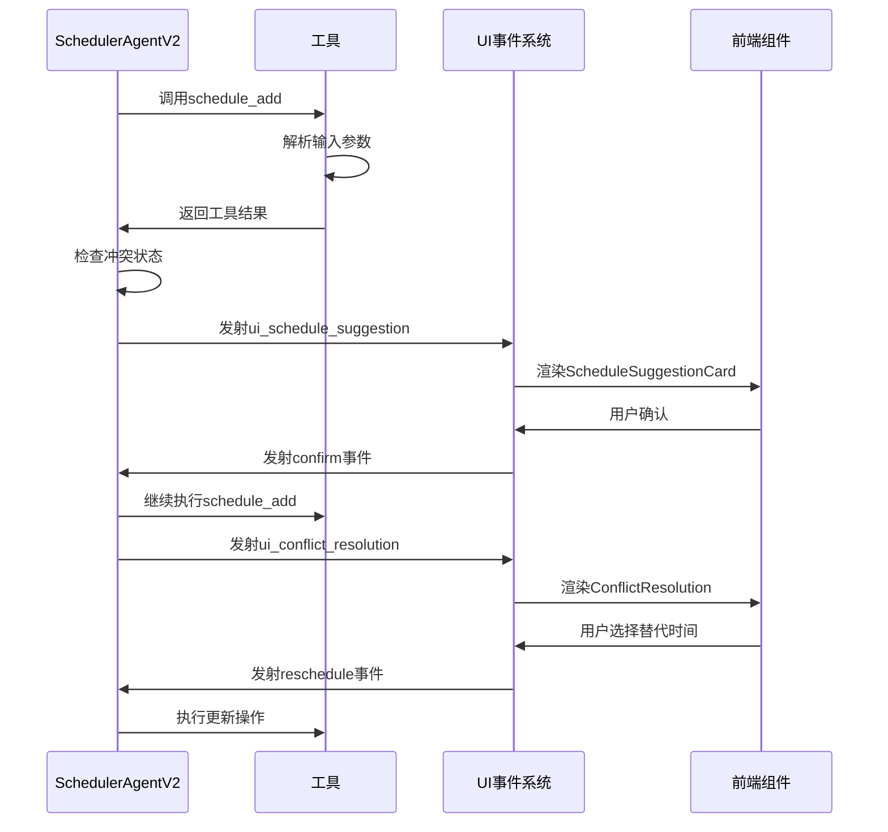

**图表来源**
- [scheduler_v2.go](file://plugin/ai/agent/scheduler_v2.go#L230-L257)
- [types.go](file://plugin/ai/agent/types.go#L261-L313)

**章节来源**
- [types.go](file://plugin/ai/agent/types.go#L107-L139)
- [scheduler_v2.go](file://plugin/ai/agent/scheduler_v2.go#L230-L352)

### Schedule Parser 分析
Schedule Parser 负责将自然语言转换为结构化的日程数据。

#### 解析算法特点
- **多轮提示工程**: 使用详细的系统提示指导 LLM 准确解析
- **严格输出格式**: 强制 JSON 输出格式，便于机器解析
- **时区规范化**: 统一转换为 UTC 时间存储
- **验证机制**: 多层次的数据验证确保准确性

#### 解析流程
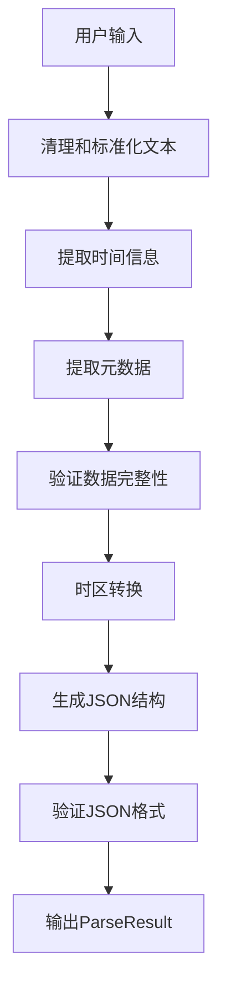

**图表来源**
- [parser.go](file://plugin/ai/schedule/parser.go#L62-L76)
- [parser.go](file://plugin/ai/schedule/parser.go#L90-L91)

**章节来源**
- [parser.go](file://plugin/ai/schedule/parser.go#L21-L76)
- [parser.go](file://plugin/ai/schedule/parser.go#L90-L347)

### 工具集分析
工具集提供了具体的日程操作能力，每个工具都实现了统一的接口规范。

#### 工具接口规范
```mermaid
classDiagram
class Tool {
<<interface>>
+Name() string
+Description() string
+InputType() map[string]interface{}
+Run(ctx, input) string
+Validate(ctx, input) error
}
class ScheduleQueryTool {
-service : Service
-userIDGetter : func
+Run(ctx, input) string
+Validate(ctx, input) error
}
class ScheduleAddTool {
-service : Service
-userIDGetter : func
-conflictResolver : ConflictResolver
+Run(ctx, input) string
+Validate(ctx, input) error
}
class FindFreeTimeTool {
-service : Service
-userIDGetter : func
-timezone : string
+Run(ctx, input) string
+Validate(ctx, input) error
}
Tool <|.. ScheduleQueryTool
Tool <|.. ScheduleAddTool
Tool <|.. FindFreeTimeTool
```

**图表来源**
- [scheduler.go](file://plugin/ai/agent/tools/scheduler.go#L132-L144)
- [scheduler.go](file://plugin/ai/agent/tools/scheduler.go#L389-L402)

#### 工具执行流程
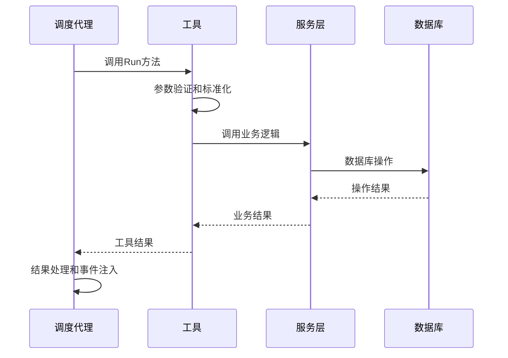

**图表来源**
- [scheduler.go](file://plugin/ai/agent/tools/scheduler.go#L183-L266)
- [scheduler.go](file://plugin/ai/agent/tools/scheduler.go#L459-L614)

**章节来源**
- [scheduler.go](file://plugin/ai/agent/tools/scheduler.go#L132-L266)
- [scheduler.go](file://plugin/ai/agent/tools/scheduler.go#L389-L614)

### Schedule Service 分析
Schedule Service 提供了完整的日程业务逻辑，包括冲突检测和重复事件处理。

#### 冲突检测机制
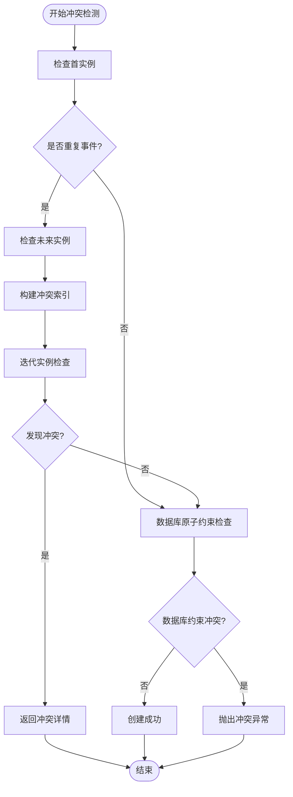

**图表来源**
- [service.go](file://server/service/schedule/service.go#L194-L302)
- [service.go](file://server/service/schedule/service.go#L548-L639)

#### 性能优化策略
- **冲突索引**: 使用按小时分桶的冲突索引提高查询效率
- **迭代器模式**: 对重复事件使用惰性迭代器避免内存溢出
- **批量查询**: 一次性查询潜在冲突减少数据库往返

**章节来源**
- [service.go](file://server/service/schedule/service.go#L426-L480)
- [service.go](file://server/service/schedule/service.go#L548-L703)

### 重复规则处理分析
重复规则处理是 Schedule Parrot 的核心功能之一，支持日常、每周和每月三种类型的重复事件。

#### 重复规则解析
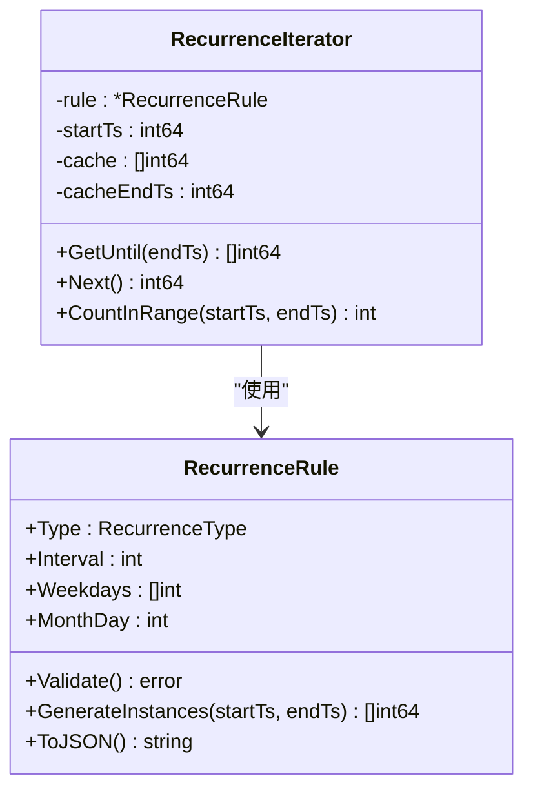

**图表来源**
- [recurrence.go](file://plugin/ai/schedule/recurrence.go#L40-L47)
- [recurrence.go](file://plugin/ai/schedule/recurrence.go#L341-L363)

#### 重复规则生成算法


**图表来源**
- [recurrence.go](file://plugin/ai/schedule/recurrence.go#L151-L193)
- [recurrence.go](file://plugin/ai/schedule/recurrence.go#L195-L282)

**章节来源**
- [recurrence.go](file://plugin/ai/schedule/recurrence.go#L77-L149)
- [recurrence.go](file://plugin/ai/schedule/recurrence.go#L151-L340)

### 时间区域管理分析
时间区域管理确保了跨时区场景下的准确性和一致性。

#### 时间区域验证机制
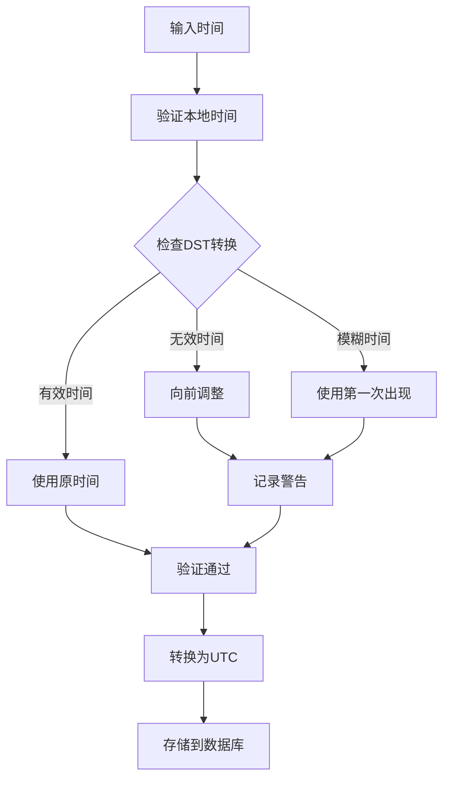

**图表来源**
- [timezone_validator.go](file://plugin/ai/schedule/timezone_validator.go#L41-L96)
- [timezone_validator.go](file://plugin/ai/schedule/timezone_validator.go#L110-L129)

#### 时间区域缓存策略
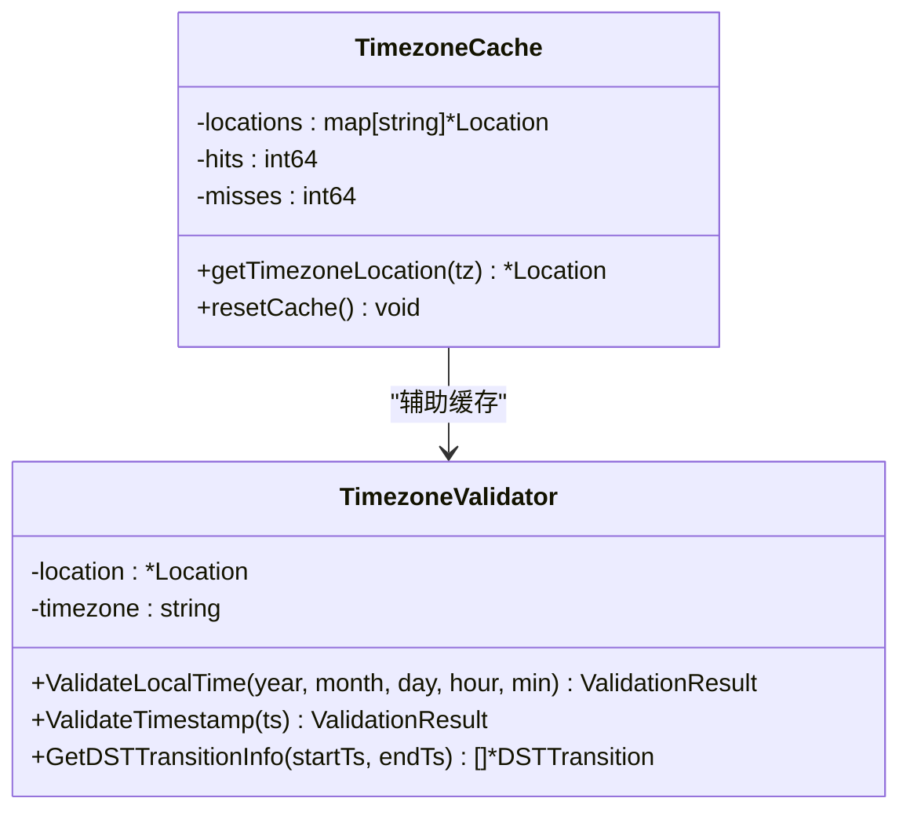

**图表来源**
- [scheduler.go](file://plugin/ai/agent/tools/scheduler.go#L30-L94)
- [timezone_validator.go](file://plugin/ai/schedule/timezone_validator.go#L21-L25)

**章节来源**
- [timezone_validator.go](file://plugin/ai/schedule/timezone_validator.go#L21-L96)
- [scheduler.go](file://plugin/ai/agent/tools/scheduler.go#L30-L94)

### 对话上下文管理分析
对话上下文管理确保了多轮对话的状态保持和上下文恢复。

#### 上下文状态机
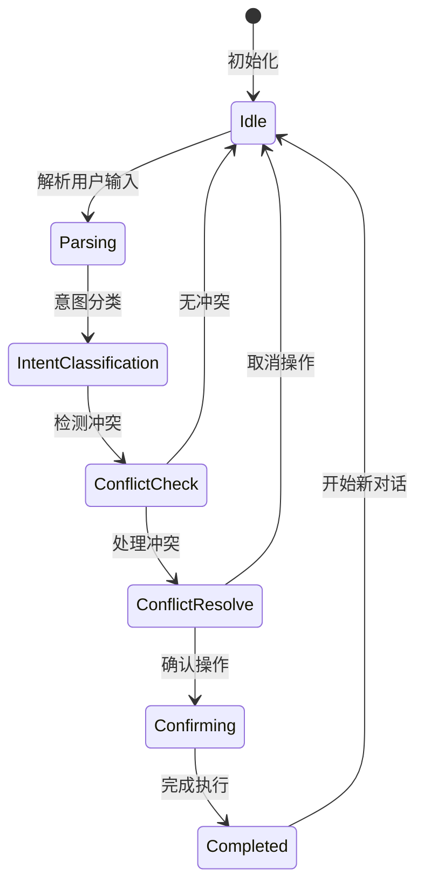

**图表来源**
- [context.go](file://plugin/ai/agent/context.go#L91-L101)
- [context.go](file://plugin/ai/agent/context.go#L234-L306)

#### 上下文持久化
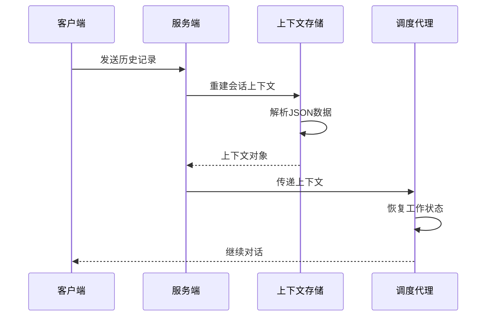

**图表来源**
- [schedule_parrot_v2.go](file://plugin/ai/agent/schedule_parrot_v2.go#L53-L68)
- [context.go](file://plugin/ai/agent/context.go#L342-L352)

**章节来源**
- [context.go](file://plugin/ai/agent/context.go#L19-L37)
- [schedule_parrot_v2.go](file://plugin/ai/agent/schedule_parrot_v2.go#L53-L68)

### 统一主题系统分析
**更新** 代理系统完成了主题统一化改造，移除了特定代理主题配置，采用统一设计系统令牌。

#### 设计系统架构
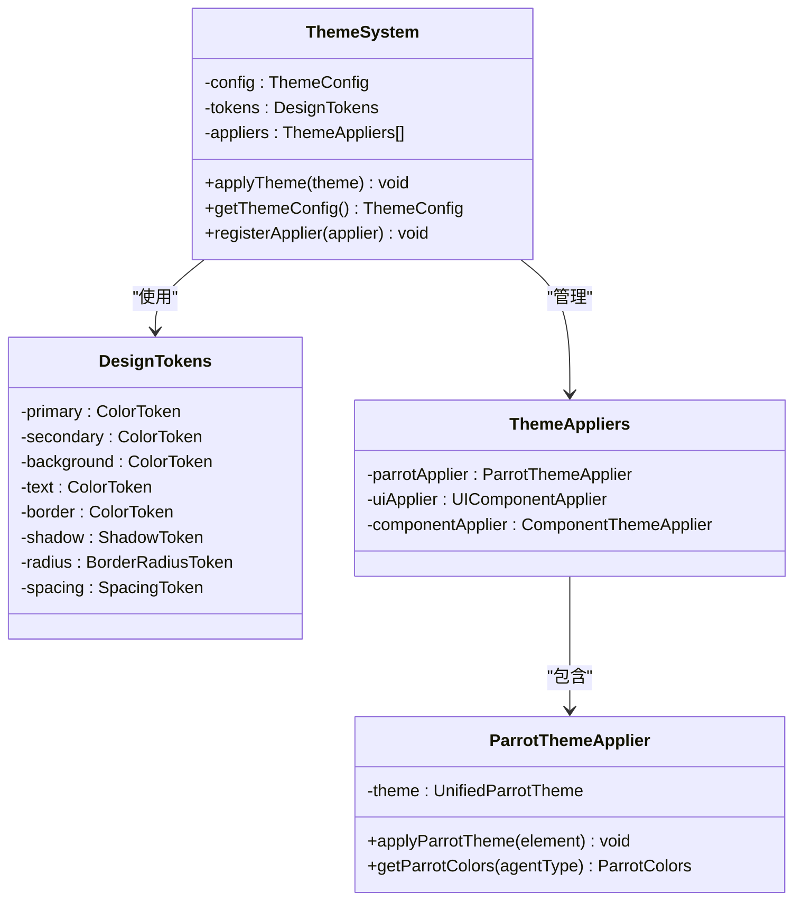

**图表来源**
- [COLOR_GUIDE.md](file://web/src/themes/COLOR_GUIDE.md#L1-L76)
- [default.css](file://web/src/themes/default.css#L1-L124)
- [default-dark.css](file://web/src/themes/default-dark.css#L1-L124)

#### OKLCH 颜色系统
```mermaid
flowchart TD
ThemeSystem["统一主题系统"] --> OKLCH["OKLCH颜色空间"]
OKLCH --> LightTheme["浅色主题变量"]
OKLCH --> DarkTheme["深色主题变量"]
LightTheme --> Primary["主色调 --primary"]
LightTheme --> Secondary["辅色调 --secondary"]
LightTheme --> Background["背景色 --background"]
LightTheme --> Text["文字色 --foreground"]
DarkTheme --> PrimaryDark["主色调 --primary"]
DarkTheme --> SecondaryDark["辅色调 --secondary"]
DarkTheme --> BackgroundDark["背景色 --background"]
DarkTheme --> TextDark["文字色 --foreground"]
Primary --> DesignTokens["设计令牌"]
Secondary --> DesignTokens
Background --> DesignTokens
Text --> DesignTokens
```

**图表来源**
- [COLOR_GUIDE.md](file://web/src/themes/COLOR_GUIDE.md#L1-L76)
- [default.css](file://web/src/themes/default.css#L1-L64)
- [default-dark.css](file://web/src/themes/default-dark.css#L1-L64)

#### 主题应用流程
```mermaid
sequenceDiagram
participant User as 用户
participant ThemeSelector as 主题选择器
participant ThemeEngine as 主题引擎
participant ThemeSystem as 统一主题系统
participant Components as UI组件
User->>ThemeSelector : 选择主题
ThemeSelector->>ThemeEngine : 加载主题配置
ThemeEngine->>ThemeSystem : 应用设计令牌
ThemeSystem->>Components : 注入CSS变量
Components->>User : 更新视觉样式
```

**图表来源**
- [useUserTheme.ts](file://web/src/hooks/useUserTheme.ts#L1-L37)
- [theme.ts](file://web/src/utils/theme.ts#L1-L178)
- [ThemeSelect.tsx](file://web/src/components/ThemeSelect.tsx#L1-L53)

**章节来源**
- [COLOR_GUIDE.md](file://web/src/themes/COLOR_GUIDE.md#L1-L76)
- [default.css](file://web/src/themes/default.css#L1-L124)
- [default-dark.css](file://web/src/themes/default-dark.css#L1-L124)
- [useUserTheme.ts](file://web/src/hooks/useUserTheme.ts#L1-L37)
- [theme.ts](file://web/src/utils/theme.ts#L1-L178)
- [ThemeSelect.tsx](file://web/src/components/ThemeSelect.tsx#L1-L53)

## 依赖关系分析

### 组件依赖图
```mermaid
graph TB
subgraph "外部依赖"
LLM[LLM服务]
OpenAI[OpenAI客户端]
Postgres[(PostgreSQL)]
Redis[(Redis)]
ThemeEngine[主题引擎]
DesignSystem[设计系统]
OKLCH[OKLCH颜色空间]
end
subgraph "内部组件"
Parrot[ScheduleParrotV2]
Agent[SchedulerAgentV2]
IntentLLM[LLMIntentClassifier]
IntentRule[IntentClassifier]
Parser[Schedule Parser]
Tools[工具集]
Service[Schedule Service]
Context[ConversationContext]
UIEvents[UI事件系统]
UnifiedTheme[统一主题系统]
DesignTokens[设计令牌]
end
Parrot --> Agent
Agent --> IntentLLM
Agent --> IntentRule
Agent --> Tools
Agent --> Context
Agent --> Parser
Agent --> UIEvents
Agent --> UnifiedTheme
Tools --> Service
Service --> Postgres
Service --> Redis
Parser --> LLM
Agent --> LLM
IntentLLM --> OpenAI
UnifiedTheme --> ThemeEngine
ThemeEngine --> DesignSystem
DesignSystem --> OKLCH
DesignTokens --> OKLCH
```

**图表来源**
- [scheduler_v2.go](file://plugin/ai/agent/scheduler_v2.go#L58-L91)
- [llm_intent_classifier.go](file://plugin/ai/agent/llm_intent_classifier.go#L40-L62)
- [service.go](file://server/service/schedule/service.go#L70-L81)
- [COLOR_GUIDE.md](file://web/src/themes/COLOR_GUIDE.md#L1-L76)

### 关键依赖关系
- **LLM 服务**: 提供自然语言理解和工具调用能力
- **OpenAI 客户端**: 提供 LLM 意图分类能力
- **数据库服务**: 存储和检索日程数据
- **缓存服务**: 提高查询性能和响应速度
- **时间区域服务**: 处理时区转换和 DST 边界情况
- **UI事件系统**: 支持生成式 UI 组件的事件发射
- **统一主题系统**: 提供基于 OKLCH 颜色空间的设计令牌
- **设计系统**: 确保视觉设计的一致性和可维护性

**章节来源**
- [scheduler_v2.go](file://plugin/ai/agent/scheduler_v2.go#L58-L91)
- [llm_intent_classifier.go](file://plugin/ai/agent/llm_intent_classifier.go#L40-L62)
- [service.go](file://server/service/schedule/service.go#L70-L81)
- [COLOR_GUIDE.md](file://web/src/themes/COLOR_GUIDE.md#L1-L76)

## 性能考虑

### 性能优化策略
1. **缓存机制**: 
   - 时间区域位置缓存，避免重复加载
   - 上下文状态缓存，支持快速恢复
   - 工具调用结果缓存
   - 意图分类结果缓存
   - 主题配置缓存，提升主题切换性能

2. **异步处理**:
   - 流式响应处理，提升用户体验
   - 并发工具调用，提高执行效率
   - 异步数据库操作，减少等待时间
   - 异步 UI 事件处理，提升交互响应
   - 异步主题应用，避免界面闪烁

3. **内存管理**:
   - 上下文历史限制，防止内存泄漏
   - 惰性迭代器，避免大量重复数据
   - 对象池化，减少垃圾回收压力
   - UI 组件自动清理机制
   - 主题资源的智能释放

4. **意图分类优化**:
   - LLM 分类器超时控制，避免阻塞
   - 规则引擎分类作为回退机制
   - 分类结果缓存，减少重复计算
   - 统一主题令牌的快速应用

5. **主题系统优化**:
   - 设计令牌的预编译和缓存
   - CSS 变量的批量更新
   - 主题切换的防抖处理
   - 深色/浅色主题的智能切换

### 性能基准测试
系统包含多个基准测试用例，覆盖关键性能指标：

- **冲突检测性能**: 针对大量日程的冲突检测优化
- **重复事件处理**: 重复规则生成和实例计算的性能测试
- **工具调用性能**: 单个工具执行的性能基准
- **内存使用**: 上下文管理和缓存使用的内存分析
- **UI事件处理**: 生成式 UI 组件的渲染性能测试
- **主题切换性能**: 统一主题系统切换的性能测试
- **设计令牌应用**: OKLCH 颜色空间的计算性能测试

**章节来源**
- [timeout.go](file://plugin/ai/timeout/timeout.go#L9-L48)
- [scheduler_test.go](file://plugin/ai/agent/scheduler_test.go#L180-L200)

## 故障排除指南

### 常见问题及解决方案

#### 日程冲突问题
**症状**: 创建日程时提示冲突
**原因分析**:
- 目标时间段已被占用
- 重复事件在未来某个时间点产生冲突
- 数据库约束触发

**解决方案**:
1. 使用 `schedule_query` 工具检查现有日程
2. 使用 `find_free_time` 工具查找可用时间段
3. 调整日程时间或持续时间
4. 检查重复规则配置

#### 时间区域问题
**症状**: 时间显示不正确或出现 DST 错误
**原因分析**:
- 时区配置错误
- 夏令时转换边界问题
- 本地时间与 UTC 转换错误

**解决方案**:
1. 验证用户时区设置
2. 使用内置的时间区域验证器
3. 确保时间转换的一致性
4. 检查 DST 边界情况

#### 工具调用失败
**症状**: 工具执行失败或返回错误
**原因分析**:
- 输入参数格式错误
- 权限不足
- 依赖服务不可用
- 网络连接问题

**解决方案**:
1. 检查工具输入参数格式
2. 验证用户权限和认证状态
3. 确认依赖服务运行状态
4. 查看详细的错误日志

#### 意图分类问题
**症状**: 意图识别不准确
**原因分析**:
- LLM 分类器配置错误
- 规则引擎关键字匹配失败
- 输入语言复杂度超出预期

**解决方案**:
1. 检查 LLM API 密钥和配置
2. 验证规则引擎关键字设置
3. 简化输入语言表达
4. 查看分类详细结果

#### UI事件问题
**症状**: 生成式 UI 组件不显示或显示异常
**原因分析**:
- UI 事件发射失败
- 前端事件处理错误
- UI 组件渲染问题

**解决方案**:
1. 检查 UI 事件数据格式
2. 验证前端事件监听器
3. 确认 UI 组件依赖
4. 查看浏览器控制台错误

#### 主题系统问题
**症状**: 主题切换异常或视觉样式不一致
**原因分析**:
- 设计令牌应用失败
- OKLCH 颜色空间计算错误
- CSS 变量更新异常
- 主题缓存损坏

**解决方案**:
1. 检查设计令牌的语法和格式
2. 验证 OKLCH 颜色值的有效性
3. 确认 CSS 变量的正确注入
4. 清理主题缓存并重新加载
5. 检查主题文件的完整性

### 调试技巧
1. **启用详细日志**: 在开发环境中启用调试日志
2. **使用测试工具**: 利用单元测试验证功能正确性
3. **监控性能指标**: 关注关键性能指标的变化
4. **模拟异常场景**: 测试边界条件和异常处理
5. **检查事件流**: 追踪 UI 事件的完整生命周期
6. **验证主题令牌**: 确保设计令牌的正确应用
7. **测试颜色空间**: 验证 OKLCH 颜色转换的准确性

**章节来源**
- [scheduler.go](file://plugin/ai/agent/tools/scheduler.go#L528-L569)
- [timezone_validator.go](file://plugin/ai/schedule/timezone_validator.go#L41-L96)

## 结论
Schedule Parrot 日程管理代理通过精心设计的架构和实现，为用户提供了强大而易用的日程管理能力。本次重大更新引入了全新的意图分类系统和生成式 UI 功能，进一步提升了用户体验和智能化水平。同时，代理系统完成了主题统一化改造，移除了特定代理主题配置，采用统一设计系统令牌，确保了视觉设计的一致性和可维护性。

**主要改进包括**：

1. **智能意图分类系统**: 
   - 支持规则引擎和 LLM 两种分类方式
   - 提供高精度的用户意图识别
   - 支持回退机制确保稳定性

2. **生成式 UI 交互体验**:
   - 实时发射 UI 事件，支持多种交互组件
   - 提供日程建议、时间槽选择、冲突解决等功能
   - 实现真正的 AI 驱动界面

3. **统一主题系统**:
   - 基于 OKLCH 颜色空间的设计系统
   - 统一的视觉令牌和样式管理
   - 支持多种主题变体和智能切换
   - 确保跨组件的一致性体验

4. **情感表达和行为系统**:
   - 丰富的鹦鹉情感表达和口头禅
   - 个性化的交互风格
   - 更好的用户体验

5. **架构优化**:
   - 更清晰的组件分离和职责划分
   - 改进的事件驱动架构
   - 更好的可扩展性和维护性

该代理不仅满足了基本的日程管理需求，还为未来的功能扩展奠定了坚实的基础。其模块化的设计使得新增功能变得相对简单，同时保持了系统的稳定性和可靠性。统一的主题系统确保了视觉设计的一致性，为用户提供了更加专业和协调的使用体验。

## 附录

### API 使用示例

#### 基本日程查询
```javascript
// 查询特定时间段的日程
const query = {
  start_time: "2026-01-25T00:00:00+08:00",
  end_time: "2026-01-26T00:00:00+08:00"
};
```

#### 创建日程
```javascript
// 创建新的日程
const schedule = {
  title: "团队会议",
  start_time: "2026-01-25T15:00:00+08:00",
  end_time: "2026-01-25T16:00:00+08:00",
  description: "月度总结会议",
  location: "会议室A"
};
```

#### 查找空闲时间
```javascript
// 查找指定日期的空闲时间段
const freeTimeQuery = {
  date: "2026-01-25"
};
```

### 最佳实践

1. **输入标准化**: 始终使用 ISO 8601 格式的时间表示
2. **冲突预防**: 在创建日程前先查询现有安排
3. **时区一致性**: 明确指定时区，避免歧义
4. **重复规则**: 合理设置重复频率，避免过度频繁
5. **错误处理**: 妥善处理工具调用失败的情况
6. **性能优化**: 利用缓存和批量操作提升性能
7. **意图分类**: 充分利用新的意图分类系统提升准确性
8. **UI交互**: 合理使用生成式 UI 组件提升用户体验
9. **主题一致性**: 遵循统一设计系统令牌，确保视觉一致性
10. **颜色空间**: 使用 OKLCH 颜色空间获得更好的感知均匀性

### 扩展指南

#### 添加新工具
1. 实现工具接口规范
2. 在调度器中注册工具
3. 添加相应的系统提示
4. 编写单元测试验证功能

#### 自定义解析规则
1. 修改解析器的系统提示
2. 更新验证逻辑
3. 测试各种输入场景
4. 调整错误处理策略

#### 增强 UI 事件
1. 定义新的 UI 事件类型
2. 实现事件数据结构
3. 添加前端组件支持
4. 测试事件发射和处理流程

#### 优化意图分类
1. 调整规则引擎关键字
2. 配置 LLM 分类器参数
3. 测试分类准确性
4. 优化回退机制

#### 扩展主题系统
1. 定义新的设计令牌
2. 实现主题应用逻辑
3. 添加主题变体支持
4. 测试主题切换性能
5. 验证颜色可访问性