# Schedule Parrot 日程管理代理

<cite>
**本文档引用的文件**
- [schedule_parrot_v2.go](file://plugin/ai/agent/schedule_parrot_v2.go)
- [scheduler_v2.go](file://plugin/ai/agent/scheduler_v2.go)
- [parser.go](file://plugin/ai/schedule/parser.go)
- [recurrence.go](file://plugin/ai/schedule/recurrence.go)
- [timezone_validator.go](file://plugin/ai/schedule/timezone_validator.go)
- [scheduler.go](file://plugin/ai/agent/tools/scheduler.go)
- [service.go](file://server/service/schedule/service.go)
- [context.go](file://plugin/ai/agent/context.go)
- [types.go](file://plugin/ai/agent/types.go)
- [schedule_agent_service.go](file://server/router/api/v1/schedule_agent_service.go)
- [scheduler_test.go](file://plugin/ai/agent/scheduler_test.go)
- [scheduler_test.go](file://plugin/ai/agent/tools/scheduler_test.go)
- [timeout.go](file://plugin/ai/timeout/timeout.go)
</cite>

## 目录
1. [简介](#简介)
2. [项目结构](#项目结构)
3. [核心组件](#核心组件)
4. [架构总览](#架构总览)
5. [详细组件分析](#详细组件分析)
6. [依赖关系分析](#依赖关系分析)
7. [性能考虑](#性能考虑)
8. [故障排除指南](#故障排除指南)
9. [结论](#结论)
10. [附录](#附录)

## 简介
Schedule Parrot 日程管理代理是一个基于大模型工具调用的智能日程助手，专注于日程查询、添加、更新和空闲时间查找。它采用框架无关的设计，通过自然语言解析、冲突检测、重复规则处理和时间区域管理，为用户提供流畅的日程管理体验。

该代理的核心特性包括：
- 自然语言日程解析与标准化
- 智能冲突检测与自动解决
- 重复事件规则处理
- 多时区时间区域管理
- 并发安全的对话上下文管理
- 流式事件驱动的交互体验

## 项目结构
Schedule Parrot 位于 Memos 项目的插件体系中，主要涉及以下模块：

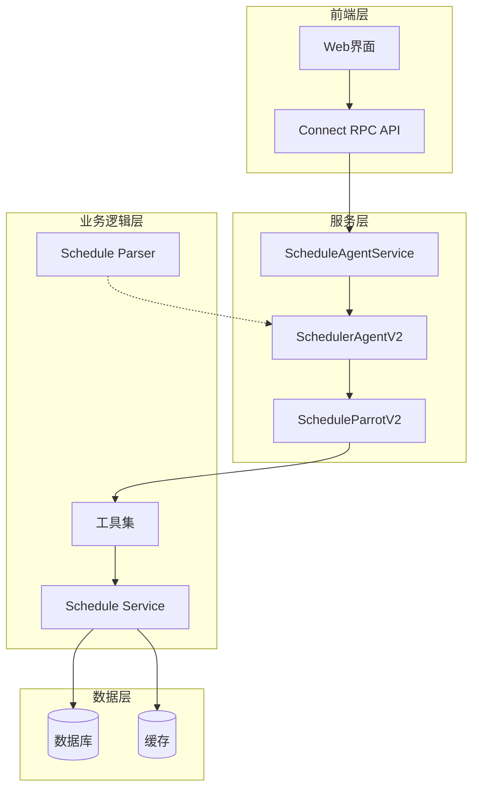

**图表来源**
- [schedule_agent_service.go](file://server/router/api/v1/schedule_agent_service.go#L33-L53)
- [scheduler_v2.go](file://plugin/ai/agent/scheduler_v2.go#L16-L91)
- [schedule_parrot_v2.go](file://plugin/ai/agent/schedule_parrot_v2.go#L9-L24)

**章节来源**
- [schedule_agent_service.go](file://server/router/api/v1/schedule_agent_service.go#L33-L53)
- [scheduler_v2.go](file://plugin/ai/agent/scheduler_v2.go#L16-L91)
- [schedule_parrot_v2.go](file://plugin/ai/agent/schedule_parrot_v2.go#L9-L24)

## 核心组件
Schedule Parrot 由多个协同工作的组件构成，每个组件都有明确的职责分工：

### 主要组件概览
- **ScheduleParrotV2**: 代理入口，封装调度器代理
- **SchedulerAgentV2**: 核心调度代理，管理工具调用和对话状态
- **Schedule Parser**: 自然语言解析器，将文本转换为结构化日程
- **工具集**: 提供具体的日程操作能力
- **Schedule Service**: 业务服务层，处理日程的增删改查和冲突检测

### 组件交互流程
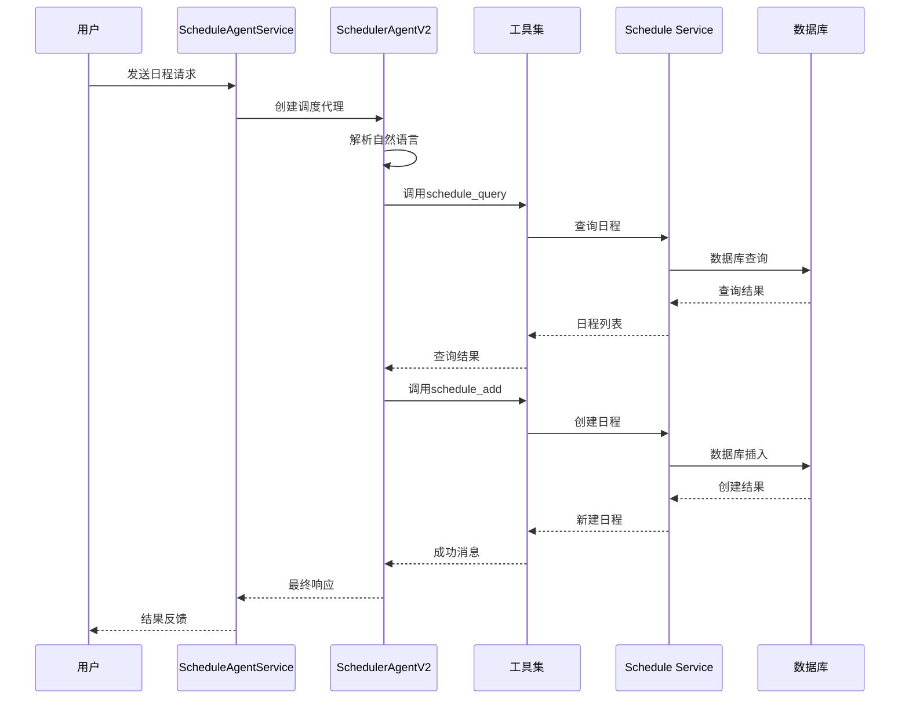

**图表来源**
- [schedule_agent_service.go](file://server/router/api/v1/schedule_agent_service.go#L96-L260)
- [scheduler_v2.go](file://plugin/ai/agent/scheduler_v2.go#L180-L196)
- [scheduler.go](file://plugin/ai/agent/tools/scheduler.go#L183-L266)

**章节来源**
- [schedule_parrot_v2.go](file://plugin/ai/agent/schedule_parrot_v2.go#L9-L77)
- [scheduler_v2.go](file://plugin/ai/agent/scheduler_v2.go#L16-L91)
- [scheduler.go](file://plugin/ai/agent/tools/scheduler.go#L132-L266)

## 架构总览
Schedule Parrot 采用分层架构设计，确保了良好的可维护性和扩展性：

### 整体架构图
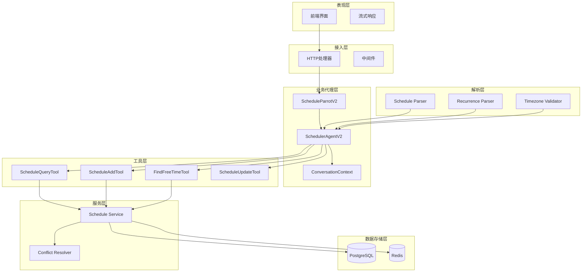

**图表来源**
- [schedule_agent_service.go](file://server/router/api/v1/schedule_agent_service.go#L33-L53)
- [context.go](file://plugin/ai/agent/context.go#L19-L37)
- [types.go](file://plugin/ai/agent/types.go#L107-L139)

### 设计模式应用
- **策略模式**: 不同的工具实现遵循统一的接口
- **工厂模式**: 工具实例的创建和管理
- **观察者模式**: 事件驱动的回调机制
- **责任链模式**: 工具调用的顺序执行

**章节来源**
- [context.go](file://plugin/ai/agent/context.go#L19-L37)
- [types.go](file://plugin/ai/agent/types.go#L107-L139)

## 详细组件分析

### ScheduleParrotV2 分析
ScheduleParrotV2 是日程代理的入口包装器，提供了简洁的接口和历史会话恢复能力。

#### 核心功能
- **代理封装**: 将调度器代理包装为独立的 Parrot 实现
- **历史会话恢复**: 支持从历史记录重建对话上下文
- **回调适配**: 统一事件回调格式
- **流式聊天**: 支持实时响应流

#### 关键实现特点
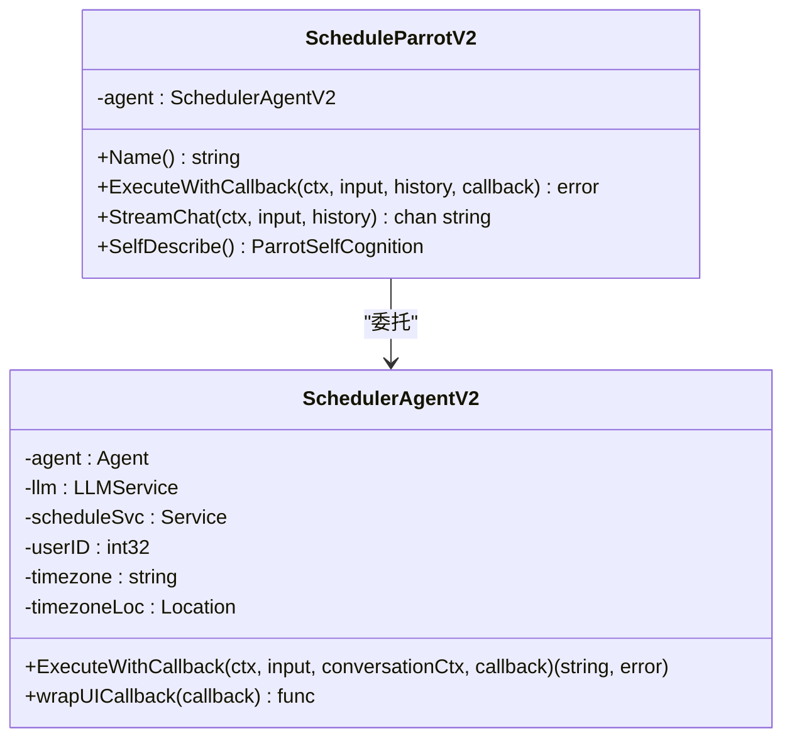

**图表来源**
- [schedule_parrot_v2.go](file://plugin/ai/agent/schedule_parrot_v2.go#L11-L24)
- [scheduler_v2.go](file://plugin/ai/agent/scheduler_v2.go#L18-L25)

**章节来源**
- [schedule_parrot_v2.go](file://plugin/ai/agent/schedule_parrot_v2.go#L9-L77)

### SchedulerAgentV2 分析
SchedulerAgentV2 是核心调度代理，实现了完整的工具调用和状态管理。

#### 核心特性
- **工具注册**: 动态注册和管理各种工具
- **系统提示构建**: 根据时区动态生成系统提示
- **UI事件注入**: 自动生成用户界面事件
- **冲突检测**: 智能识别和处理日程冲突

#### 工具调用流程
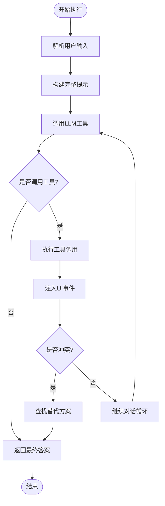

**图表来源**
- [scheduler_v2.go](file://plugin/ai/agent/scheduler_v2.go#L180-L196)
- [scheduler_v2.go](file://plugin/ai/agent/scheduler_v2.go#L198-L244)

**章节来源**
- [scheduler_v2.go](file://plugin/ai/agent/scheduler_v2.go#L16-L91)
- [scheduler_v2.go](file://plugin/ai/agent/scheduler_v2.go#L180-L244)

### Schedule Parser 分析
Schedule Parser 负责将自然语言转换为结构化的日程数据。

#### 解析算法特点
- **多轮提示工程**: 使用详细的系统提示指导 LLM 准确解析
- **严格输出格式**: 强制 JSON 输出格式，便于机器解析
- **时区规范化**: 统一转换为 UTC 时间存储
- **验证机制**: 多层次的数据验证确保准确性

#### 解析流程
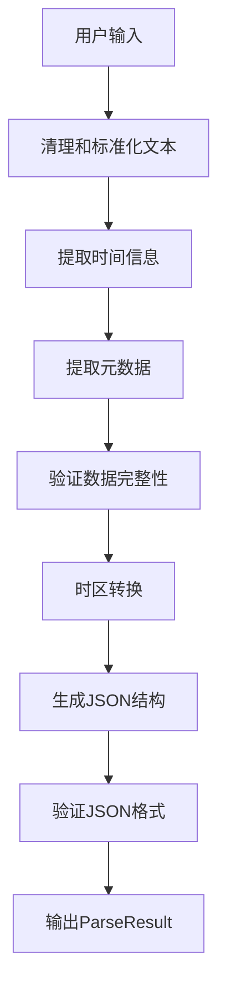

**图表来源**
- [parser.go](file://plugin/ai/schedule/parser.go#L62-L76)
- [parser.go](file://plugin/ai/schedule/parser.go#L90-L91)

**章节来源**
- [parser.go](file://plugin/ai/schedule/parser.go#L21-L76)
- [parser.go](file://plugin/ai/schedule/parser.go#L90-L347)

### 工具集分析
工具集提供了具体的日程操作能力，每个工具都实现了统一的接口规范。

#### 工具接口规范
```mermaid
classDiagram
class Tool {
<<interface>>
+Name() string
+Description() string
+InputType() map[string]interface{}
+Run(ctx, input) string
+Validate(ctx, input) error
}
class ScheduleQueryTool {
-service : Service
-userIDGetter : func
+Run(ctx, input) string
+Validate(ctx, input) error
}
class ScheduleAddTool {
-service : Service
-userIDGetter : func
-conflictResolver : ConflictResolver
+Run(ctx, input) string
+Validate(ctx, input) error
}
class FindFreeTimeTool {
-service : Service
-userIDGetter : func
-timezone : string
+Run(ctx, input) string
+Validate(ctx, input) error
}
Tool <|.. ScheduleQueryTool
Tool <|.. ScheduleAddTool
Tool <|.. FindFreeTimeTool
```

**图表来源**
- [scheduler.go](file://plugin/ai/agent/tools/scheduler.go#L132-L144)
- [scheduler.go](file://plugin/ai/agent/tools/scheduler.go#L389-L402)

#### 工具执行流程
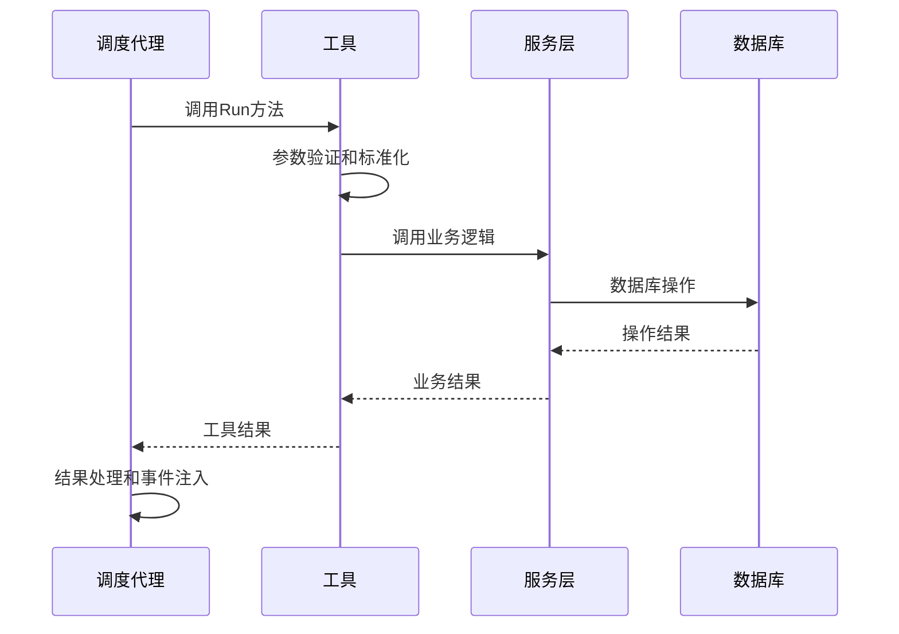

**图表来源**
- [scheduler.go](file://plugin/ai/agent/tools/scheduler.go#L183-L266)
- [scheduler.go](file://plugin/ai/agent/tools/scheduler.go#L459-L614)

**章节来源**
- [scheduler.go](file://plugin/ai/agent/tools/scheduler.go#L132-L266)
- [scheduler.go](file://plugin/ai/agent/tools/scheduler.go#L389-L614)

### Schedule Service 分析
Schedule Service 提供了完整的日程业务逻辑，包括冲突检测和重复事件处理。

#### 冲突检测机制


**图表来源**
- [service.go](file://server/service/schedule/service.go#L194-L302)
- [service.go](file://server/service/schedule/service.go#L548-L639)

#### 性能优化策略
- **冲突索引**: 使用按小时分桶的冲突索引提高查询效率
- **迭代器模式**: 对重复事件使用惰性迭代器避免内存溢出
- **批量查询**: 一次性查询潜在冲突减少数据库往返

**章节来源**
- [service.go](file://server/service/schedule/service.go#L426-L480)
- [service.go](file://server/service/schedule/service.go#L548-L703)

### 重复规则处理分析
重复规则处理是 Schedule Parrot 的核心功能之一，支持日常、每周和每月三种类型的重复事件。

#### 重复规则解析
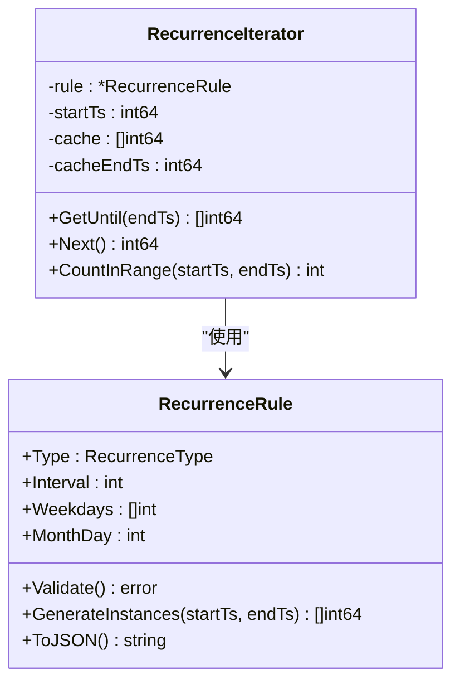

**图表来源**
- [recurrence.go](file://plugin/ai/schedule/recurrence.go#L40-L47)
- [recurrence.go](file://plugin/ai/schedule/recurrence.go#L341-L363)

#### 重复规则生成算法
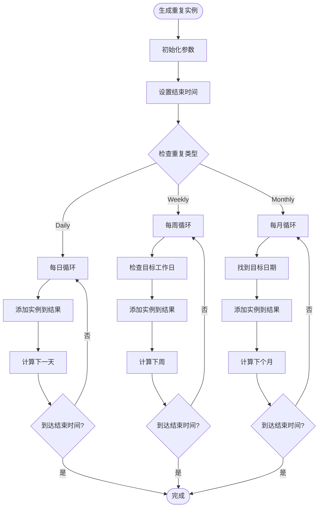

**图表来源**
- [recurrence.go](file://plugin/ai/schedule/recurrence.go#L151-L193)
- [recurrence.go](file://plugin/ai/schedule/recurrence.go#L195-L282)

**章节来源**
- [recurrence.go](file://plugin/ai/schedule/recurrence.go#L77-L149)
- [recurrence.go](file://plugin/ai/schedule/recurrence.go#L151-L340)

### 时间区域管理分析
时间区域管理确保了跨时区场景下的准确性和一致性。

#### 时间区域验证机制
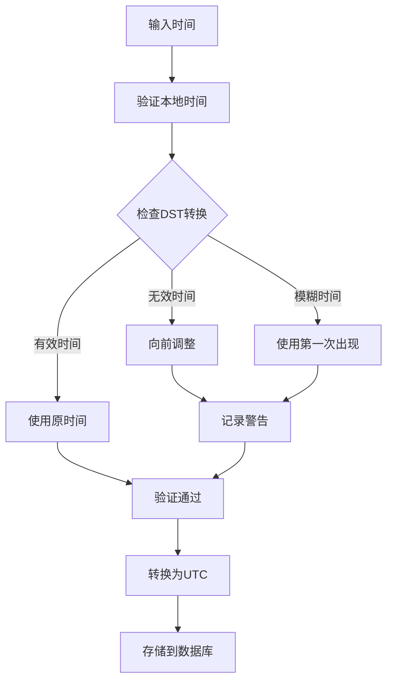

**图表来源**
- [timezone_validator.go](file://plugin/ai/schedule/timezone_validator.go#L41-L96)
- [timezone_validator.go](file://plugin/ai/schedule/timezone_validator.go#L110-L129)

#### 时间区域缓存策略
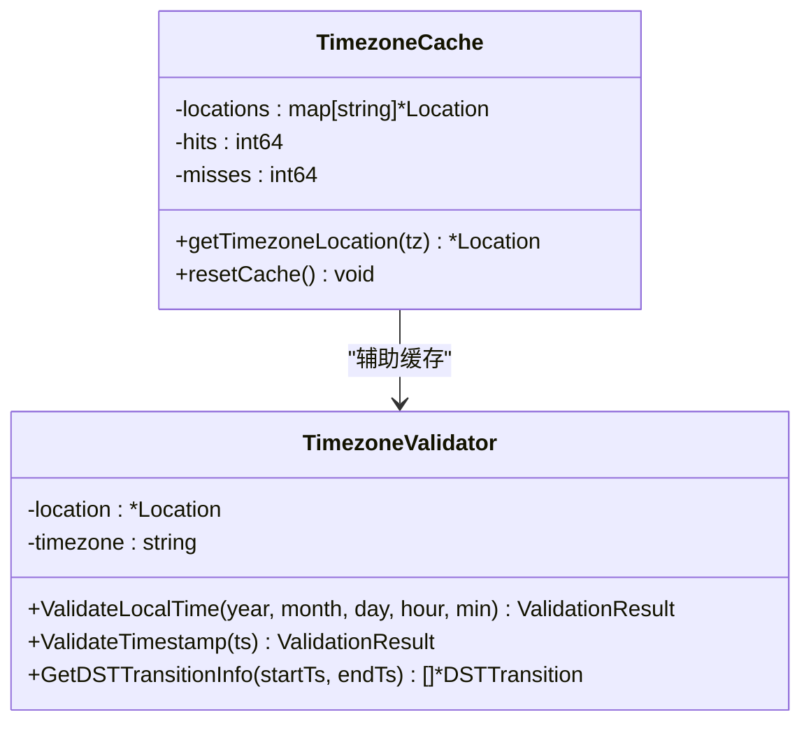

**图表来源**
- [scheduler.go](file://plugin/ai/agent/tools/scheduler.go#L30-L94)
- [timezone_validator.go](file://plugin/ai/schedule/timezone_validator.go#L21-L25)

**章节来源**
- [timezone_validator.go](file://plugin/ai/schedule/timezone_validator.go#L21-L96)
- [scheduler.go](file://plugin/ai/agent/tools/scheduler.go#L30-L94)

### 对话上下文管理分析
对话上下文管理确保了多轮对话的状态保持和上下文恢复。

#### 上下文状态机
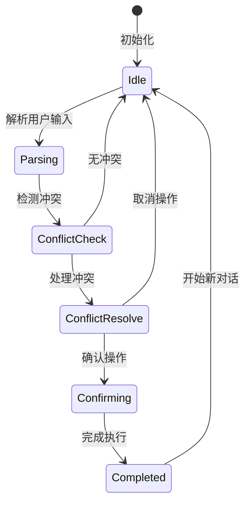

**图表来源**
- [context.go](file://plugin/ai/agent/context.go#L91-L101)
- [context.go](file://plugin/ai/agent/context.go#L234-L306)

#### 上下文持久化
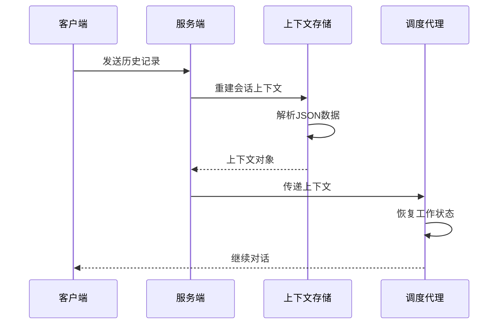

**图表来源**
- [schedule_parrot_v2.go](file://plugin/ai/agent/schedule_parrot_v2.go#L53-L68)
- [context.go](file://plugin/ai/agent/context.go#L342-L352)

**章节来源**
- [context.go](file://plugin/ai/agent/context.go#L19-L37)
- [schedule_parrot_v2.go](file://plugin/ai/agent/schedule_parrot_v2.go#L53-L68)

## 依赖关系分析

### 组件依赖图
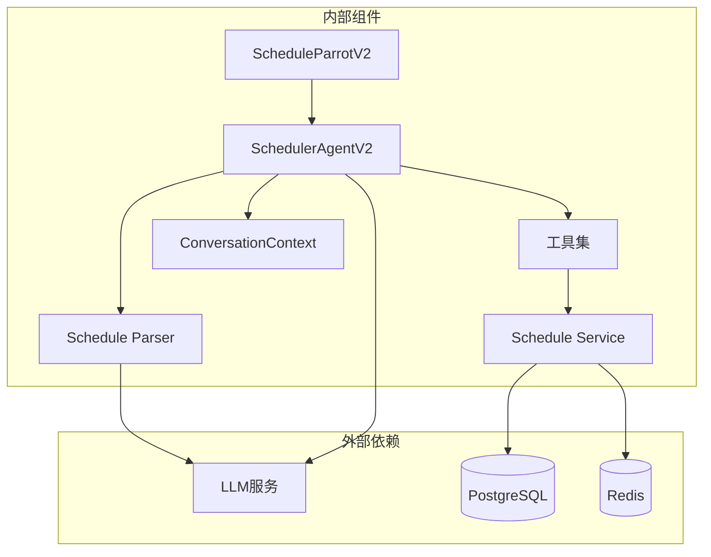

**图表来源**
- [scheduler_v2.go](file://plugin/ai/agent/scheduler_v2.go#L58-L71)
- [service.go](file://server/service/schedule/service.go#L70-L81)

### 关键依赖关系
- **LLM 服务**: 提供自然语言理解和工具调用能力
- **数据库服务**: 存储和检索日程数据
- **缓存服务**: 提高查询性能和响应速度
- **时间区域服务**: 处理时区转换和 DST 边界情况

**章节来源**
- [scheduler_v2.go](file://plugin/ai/agent/scheduler_v2.go#L58-L91)
- [service.go](file://server/service/schedule/service.go#L70-L81)

## 性能考虑

### 性能优化策略
1. **缓存机制**: 
   - 时间区域位置缓存，避免重复加载
   - 上下文状态缓存，支持快速恢复
   - 工具调用结果缓存

2. **异步处理**:
   - 流式响应处理，提升用户体验
   - 并发工具调用，提高执行效率
   - 异步数据库操作，减少等待时间

3. **内存管理**:
   - 上下文历史限制，防止内存泄漏
   - 惰性迭代器，避免大量重复数据
   - 对象池化，减少垃圾回收压力

### 性能基准测试
系统包含多个基准测试用例，覆盖关键性能指标：

- **冲突检测性能**: 针对大量日程的冲突检测优化
- **重复事件处理**: 重复规则生成和实例计算的性能测试
- **工具调用性能**: 单个工具执行的性能基准
- **内存使用**: 上下文管理和缓存使用的内存分析

**章节来源**
- [timeout.go](file://plugin/ai/timeout/timeout.go#L9-L48)
- [scheduler_test.go](file://plugin/ai/agent/scheduler_test.go#L180-L200)

## 故障排除指南

### 常见问题及解决方案

#### 日程冲突问题
**症状**: 创建日程时提示冲突
**原因分析**:
- 目标时间段已被占用
- 重复事件在未来某个时间点产生冲突
- 数据库约束触发

**解决方案**:
1. 使用 `schedule_query` 工具检查现有日程
2. 使用 `find_free_time` 工具查找可用时间段
3. 调整日程时间或持续时间
4. 检查重复规则配置

#### 时间区域问题
**症状**: 时间显示不正确或出现 DST 错误
**原因分析**:
- 时区配置错误
- 夏令时转换边界问题
- 本地时间与 UTC 转换错误

**解决方案**:
1. 验证用户时区设置
2. 使用内置的时间区域验证器
3. 确保时间转换的一致性
4. 检查 DST 边界情况

#### 工具调用失败
**症状**: 工具执行失败或返回错误
**原因分析**:
- 输入参数格式错误
- 权限不足
- 依赖服务不可用
- 网络连接问题

**解决方案**:
1. 检查工具输入参数格式
2. 验证用户权限和认证状态
3. 确认依赖服务运行状态
4. 查看详细的错误日志

### 调试技巧
1. **启用详细日志**: 在开发环境中启用调试日志
2. **使用测试工具**: 利用单元测试验证功能正确性
3. **监控性能指标**: 关注关键性能指标的变化
4. **模拟异常场景**: 测试边界条件和异常处理

**章节来源**
- [scheduler.go](file://plugin/ai/agent/tools/scheduler.go#L528-L569)
- [timezone_validator.go](file://plugin/ai/schedule/timezone_validator.go#L41-L96)

## 结论
Schedule Parrot 日程管理代理通过精心设计的架构和实现，为用户提供了强大而易用的日程管理能力。其核心优势包括：

1. **智能化的自然语言处理**: 通过 LLM 和严格的解析流程，准确理解用户意图
2. **完善的冲突检测机制**: 多层次的冲突检测和自动解决策略
3. **灵活的重复事件支持**: 支持日常、每周和每月的重复规则
4. **可靠的时区管理**: 处理复杂的时区转换和 DST 边界情况
5. **高效的性能表现**: 通过缓存、异步处理和优化算法确保响应速度

该代理不仅满足了基本的日程管理需求，还为未来的功能扩展奠定了坚实的基础。其模块化的设计使得新增功能变得相对简单，同时保持了系统的稳定性和可靠性。

## 附录

### API 使用示例

#### 基本日程查询
```javascript
// 查询特定时间段的日程
const query = {
  start_time: "2026-01-25T00:00:00+08:00",
  end_time: "2026-01-26T00:00:00+08:00"
};
```

#### 创建日程
```javascript
// 创建新的日程
const schedule = {
  title: "团队会议",
  start_time: "2026-01-25T15:00:00+08:00",
  end_time: "2026-01-25T16:00:00+08:00",
  description: "月度总结会议",
  location: "会议室A"
};
```

#### 查找空闲时间
```javascript
// 查找指定日期的空闲时间段
const freeTimeQuery = {
  date: "2026-01-25"
};
```

### 最佳实践

1. **输入标准化**: 始终使用 ISO 8601 格式的时间表示
2. **冲突预防**: 在创建日程前先查询现有安排
3. **时区一致性**: 明确指定时区，避免歧义
4. **重复规则**: 合理设置重复频率，避免过度频繁
5. **错误处理**: 妥善处理工具调用失败的情况
6. **性能优化**: 利用缓存和批量操作提升性能

### 扩展指南

#### 添加新工具
1. 实现工具接口规范
2. 在调度器中注册工具
3. 添加相应的系统提示
4. 编写单元测试验证功能

#### 自定义解析规则
1. 修改解析器的系统提示
2. 更新验证逻辑
3. 测试各种输入场景
4. 调整错误处理策略