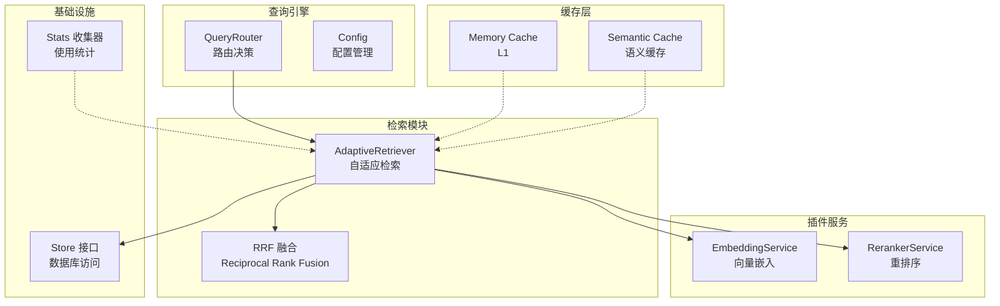
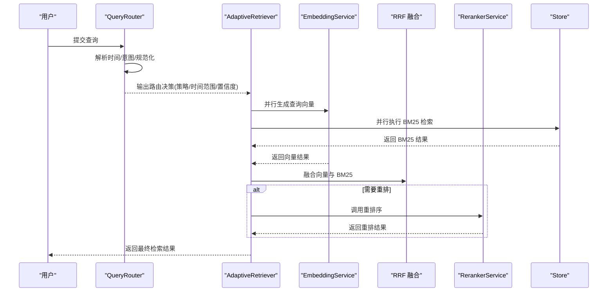
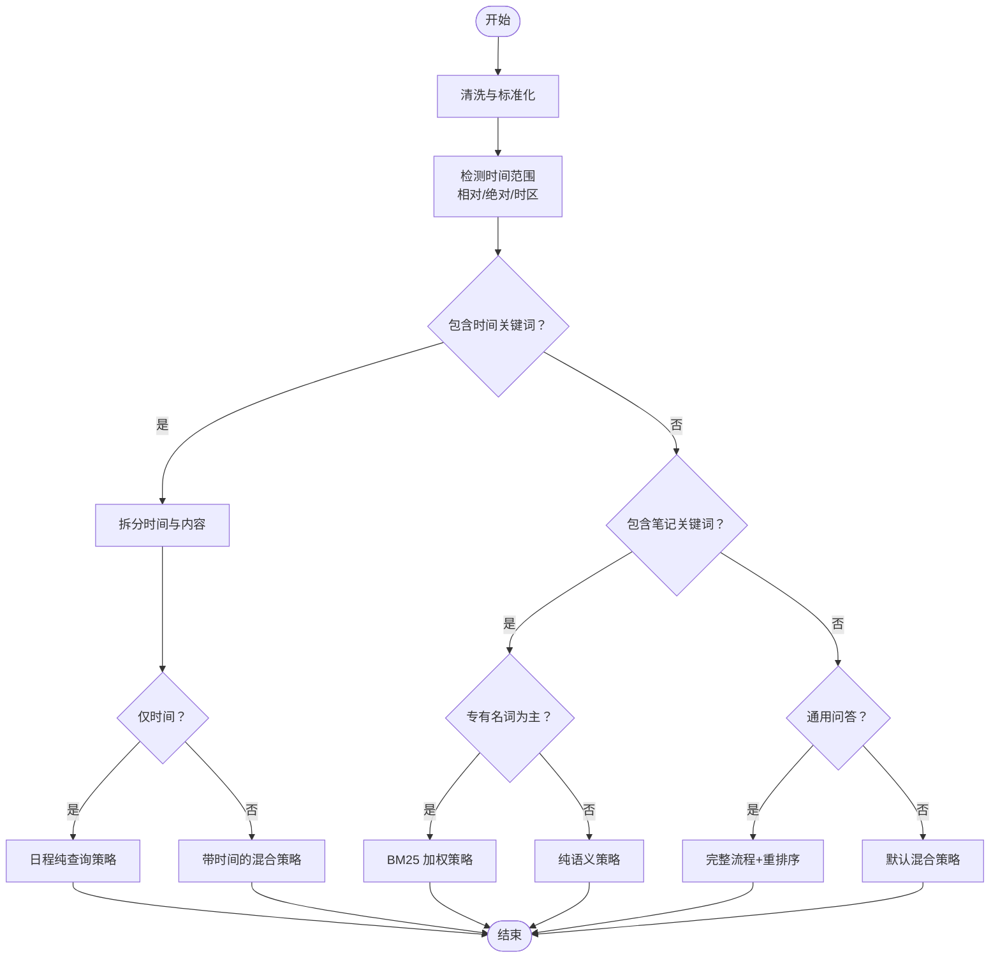
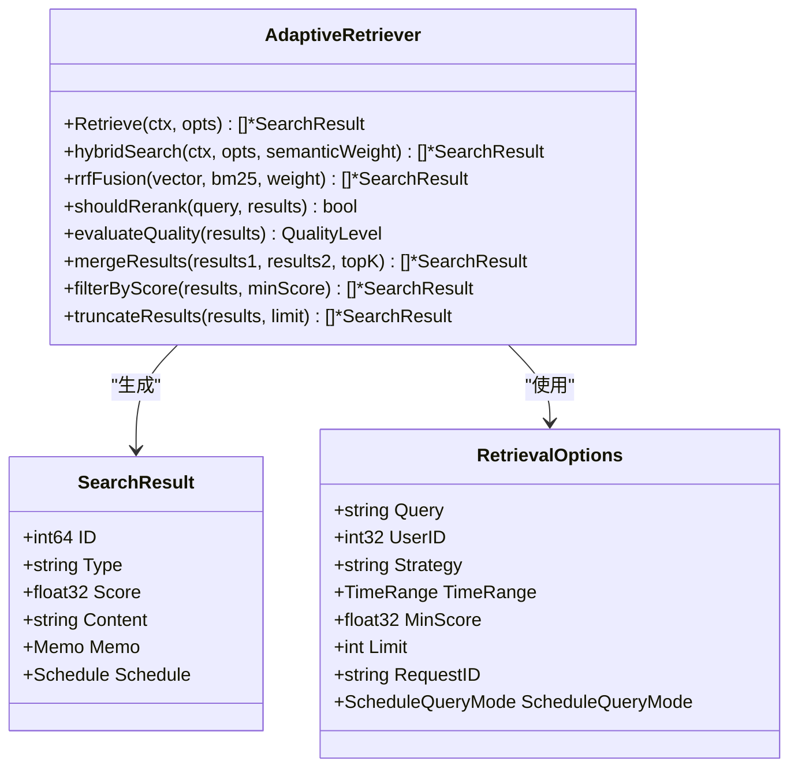
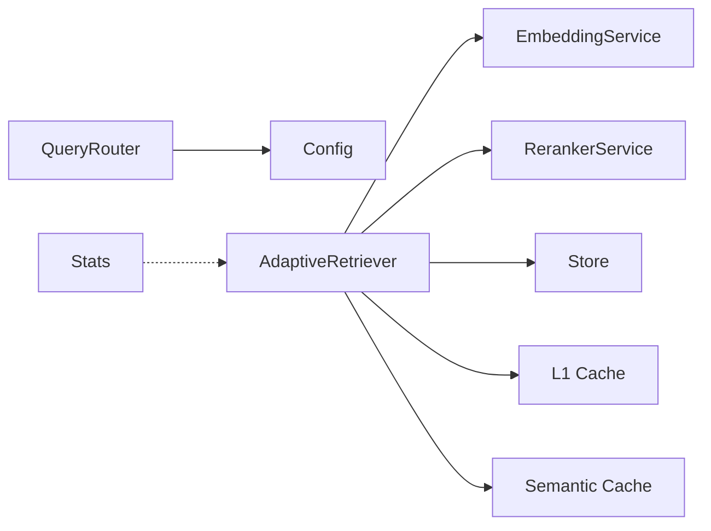

# RAG 检索增强生成管道

<cite>
**本文引用的文件**
- [query_router.go](file://server/queryengine/query_router.go)
- [config.go](file://server/queryengine/config.go)
- [adaptive_retrieval.go](file://server/retrieval/adaptive_retrieval.go)
- [embedding.go](file://plugin/ai/embedding.go)
- [reranker.go](file://plugin/ai/reranker.go)
- [cache.go](file://store/cache/cache.go)
- [tiered.go](file://store/cache/tiered.go)
- [query_router_benchmark_test.go](file://server/queryengine/query_router_benchmark_test.go)
- [adaptive_retrieval_test.go](file://server/retrieval/adaptive_retrieval_test.go)
- [cache_test.go](file://store/cache/cache_test.go)
- [conversation_service.go](file://server/router/api/v1/ai/conversation_service.go)
- [stats.go](file://server/stats/stats.go)
</cite>

## 目录
1. [简介](#简介)
2. [项目结构](#项目结构)
3. [核心组件](#核心组件)
4. [架构总览](#架构总览)
5. [详细组件分析](#详细组件分析)
6. [依赖关系分析](#依赖关系分析)
7. [性能考量](#性能考量)
8. [故障排查指南](#故障排查指南)
9. [结论](#结论)
10. [附录](#附录)

## 简介
本技术文档围绕 RAG（检索增强生成）管道进行深入剖析，重点覆盖以下方面：
- 查询路由引擎：日期解析、意图检测与查询规范化
- 自适应检索系统：向量搜索与 BM25 全文搜索的融合，以及重排序器的优化策略
- 缓存机制：查询缓存与嵌入缓存的协同作用
- 并发检索优化：并行查询执行与结果合并策略
- 性能监控与调优：延迟测量与吞吐量优化建议

## 项目结构
RAG 管道位于服务端查询引擎与检索模块，配合插件层的嵌入与重排序服务，以及多级缓存与统计模块，形成完整的检索链路。



图表来源
- [query_router.go](file://server/queryengine/query_router.go#L1-L970)
- [config.go](file://server/queryengine/config.go#L1-L170)
- [adaptive_retrieval.go](file://server/retrieval/adaptive_retrieval.go#L1-L762)
- [embedding.go](file://plugin/ai/embedding.go#L1-L103)
- [reranker.go](file://plugin/ai/reranker.go#L1-L127)
- [cache.go](file://store/cache/cache.go#L1-L328)
- [tiered.go](file://store/cache/tiered.go#L1-L447)
- [stats.go](file://server/stats/stats.go#L1-L372)

章节来源
- [query_router.go](file://server/queryengine/query_router.go#L1-L970)
- [adaptive_retrieval.go](file://server/retrieval/adaptive_retrieval.go#L1-L762)
- [embedding.go](file://plugin/ai/embedding.go#L1-L103)
- [reranker.go](file://plugin/ai/reranker.go#L1-L127)
- [cache.go](file://store/cache/cache.go#L1-L328)
- [tiered.go](file://store/cache/tiered.go#L1-L447)
- [config.go](file://server/queryengine/config.go#L1-L170)
- [stats.go](file://server/stats/stats.go#L1-L372)

## 核心组件
- 查询路由引擎：负责解析用户输入，识别时间范围、意图类型，并输出检索策略与规范化查询
- 自适应检索器：根据路由策略并行执行向量与 BM25 检索，采用 RRF 融合与可选重排序
- 嵌入与重排序服务：通过外部模型提供向量嵌入与相关性重排序能力
- 缓存系统：三层缓存（L1 内存、语义缓存、可选 L2 Redis）提升检索性能
- 统计与监控：收集使用统计，辅助性能调优与容量规划

章节来源
- [query_router.go](file://server/queryengine/query_router.go#L1-L970)
- [adaptive_retrieval.go](file://server/retrieval/adaptive_retrieval.go#L1-L762)
- [embedding.go](file://plugin/ai/embedding.go#L1-L103)
- [reranker.go](file://plugin/ai/reranker.go#L1-L127)
- [cache.go](file://store/cache/cache.go#L1-L328)
- [tiered.go](file://store/cache/tiered.go#L1-L447)
- [config.go](file://server/queryengine/config.go#L1-L170)
- [stats.go](file://server/stats/stats.go#L1-L372)

## 架构总览
RAG 管道的关键流程如下：
1. 用户输入经查询路由引擎解析，识别时间范围与意图，生成路由决策
2. 自适应检索器依据策略并行执行向量与 BM25 检索
3. 采用 RRF 融合两种检索结果，必要时调用重排序器
4. 结果经过过滤、截断与合并，最终返回给上层服务
5. 缓存层贯穿检索过程，降低延迟与外部依赖成本



图表来源
- [query_router.go](file://server/queryengine/query_router.go#L450-L552)
- [adaptive_retrieval.go](file://server/retrieval/adaptive_retrieval.go#L410-L491)
- [embedding.go](file://plugin/ai/embedding.go#L60-L98)
- [reranker.go](file://plugin/ai/reranker.go#L59-L126)

## 详细组件分析

### 查询路由引擎（QueryRouter）
职责与机制：
- 日期解析：支持中文相对时间（今天/明天/本周/下周等）、绝对日期（YYYY-MM-DD、MM/DD、MM月DD日等），并考虑用户时区
- 意图检测：识别日程查询、笔记查询与通用问答；对专有名词为主的查询倾向 BM25 加权
- 查询规范化：抽取内容查询、去除停用词、保留大小写以提高 BM25 效果
- 路由决策：输出策略名称、置信度、时间范围、是否需要重排序及日程查询模式



图表来源
- [query_router.go](file://server/queryengine/query_router.go#L467-L552)
- [query_router.go](file://server/queryengine/query_router.go#L554-L640)
- [query_router.go](file://server/queryengine/query_router.go#L677-L800)

章节来源
- [query_router.go](file://server/queryengine/query_router.go#L1-L970)
- [config.go](file://server/queryengine/config.go#L1-L170)

### 自适应检索系统（AdaptiveRetriever）
核心能力：
- 并行检索：同时执行向量检索与 BM25 检索，使用通道与 goroutine 实现
- RRF 融合：Reciprocal Rank Fusion，平衡向量与 BM25 的贡献
- 质量评估与扩展：根据 Top-N 分数差距与最高分阈值，动态扩展检索规模
- 结果过滤与截断：按最小分数阈值与限制数量输出
- 可选重排序：当查询复杂且分数接近时触发重排序器



图表来源
- [adaptive_retrieval.go](file://server/retrieval/adaptive_retrieval.go#L24-L66)
- [adaptive_retrieval.go](file://server/retrieval/adaptive_retrieval.go#L410-L491)
- [adaptive_retrieval.go](file://server/retrieval/adaptive_retrieval.go#L523-L602)

章节来源
- [adaptive_retrieval.go](file://server/retrieval/adaptive_retrieval.go#L1-L762)

### 嵌入与重排序服务
- 嵌入服务：封装 OpenAI 兼容接口，支持批量嵌入与维度配置
- 重排序服务：封装 SiliconFlow/Rerank API，支持启用/禁用与超时控制

章节来源
- [embedding.go](file://plugin/ai/embedding.go#L1-L103)
- [reranker.go](file://plugin/ai/reranker.go#L1-L127)

### 缓存机制
- L1 内存缓存：线程安全、TTL 过期、LRU 驱逐、清理协程
- 语义缓存：基于向量相似度的查询缓存，支持语义命中
- 三级缓存（Tiered）：L1/L2/L3 分层，支持可选 Redis，Promote/L1/L2 写回

```mermaid
classDiagram
class Cache {
+Set(ctx, key, value)
+SetWithTTL(ctx, key, value, ttl)
+Get(ctx, key) (any, bool)
+Delete(ctx, key)
+Clear(ctx)
+Size() int64
+Close() error
}
class SemanticCache {
+Get(ctx, query) (any, bool)
+Set(ctx, query, results) error
+Delete(ctx, query)
}
class TieredCache {
+Get(ctx, key, fetcher) (any, bool)
+Set(ctx, key, value)
+SetWithTTL(ctx, key, value, ttl)
+Delete(ctx, key)
+Invalidate(ctx, key, fetcher) error
+Clear(ctx)
+Stats() map[string]interface{}
+Close() error
}
Cache <|-- SemanticCache
Cache <|-- TieredCache
```

图表来源
- [cache.go](file://store/cache/cache.go#L66-L120)
- [tiered.go](file://store/cache/tiered.go#L28-L91)
- [tiered.go](file://store/cache/tiered.go#L233-L330)

章节来源
- [cache.go](file://store/cache/cache.go#L1-L328)
- [tiered.go](file://store/cache/tiered.go#L1-L447)

### 并发检索优化
- 并行执行：向量与 BM25 检索通过 goroutine 与 channel 并行执行，等待双方完成
- 错误降级：任一检索失败时，使用另一路结果作为降级方案
- 结果合并：去重、按分数排序、截断 Top-K

章节来源
- [adaptive_retrieval.go](file://server/retrieval/adaptive_retrieval.go#L410-L491)
- [adaptive_retrieval_test.go](file://server/retrieval/adaptive_retrieval_test.go#L401-L430)

## 依赖关系分析
- QueryRouter 依赖 Config 进行参数化与校验
- AdaptiveRetriever 依赖 EmbeddingService、RerankerService 与 Store 接口
- 缓存层与检索器解耦，通过键生成与语义命中提升命中率
- 统计模块为性能调优提供数据支撑



图表来源
- [query_router.go](file://server/queryengine/query_router.go#L108-L110)
- [adaptive_retrieval.go](file://server/retrieval/adaptive_retrieval.go#L55-L66)
- [tiered.go](file://store/cache/tiered.go#L28-L35)
- [stats.go](file://server/stats/stats.go#L48-L53)

章节来源
- [query_router.go](file://server/queryengine/query_router.go#L1-L970)
- [adaptive_retrieval.go](file://server/retrieval/adaptive_retrieval.go#L1-L762)
- [tiered.go](file://store/cache/tiered.go#L1-L447)
- [stats.go](file://server/stats/stats.go#L1-L372)

## 性能考量
- 路由与解析性能：基准测试覆盖路由、时间检测、内容提取、专有名词检测与时间范围验证
- 检索性能：并行执行向量与 BM25，RRF 融合，质量评估驱动的扩展策略
- 缓存命中：L1/Tiered 缓存与语义缓存显著降低外部依赖与重复计算
- 重排序成本：仅在必要时启用，避免对简单查询产生额外开销
- 监控指标：统计模块提供搜索与 AI 查询次数、活跃度等指标，便于定位瓶颈

章节来源
- [query_router_benchmark_test.go](file://server/queryengine/query_router_benchmark_test.go#L1-L150)
- [adaptive_retrieval_test.go](file://server/retrieval/adaptive_retrieval_test.go#L451-L467)
- [cache_test.go](file://store/cache/cache_test.go#L1-L210)
- [stats.go](file://server/stats/stats.go#L1-L372)

## 故障排查指南
- 路由决策异常
  - 检查时间关键词解析是否正确，确认用户时区设置
  - 核对停用词与专有名词正则是否覆盖实际查询
- 检索性能问题
  - 关注并行执行的错误降级路径，确保至少一路检索可用
  - 调整 RRF 权重与质量评估阈值，避免过度扩展
- 缓存失效
  - 检查 TTL 与最大条目数配置，确认清理协程正常运行
  - 语义缓存阈值过严可能导致命中率偏低
- 重排序失败
  - 确认重排序服务启用状态与网络可达性
  - 适当放宽最小重排结果数与分数差距阈值

章节来源
- [query_router.go](file://server/queryengine/query_router.go#L450-L552)
- [adaptive_retrieval.go](file://server/retrieval/adaptive_retrieval.go#L330-L407)
- [tiered.go](file://store/cache/tiered.go#L233-L330)
- [reranker.go](file://plugin/ai/reranker.go#L59-L126)

## 结论
本 RAG 管道通过“路由-检索-融合-重排”的流水线设计，结合并行检索与多级缓存，在保证准确性的同时显著提升了响应速度与稳定性。配置化与质量评估机制使得系统能够自适应不同查询复杂度，而统计与监控为持续优化提供了数据基础。

## 附录
- 查询缓存键生成：基于用户 ID、查询、限制与策略生成稳定哈希键
- 语义缓存：基于查询向量余弦相似度的语义命中，提升相似查询复用率
- 事件总线与对话持久化：为聊天与检索行为提供可观测性与可追溯性

章节来源
- [tiered.go](file://store/cache/tiered.go#L384-L396)
- [tiered.go](file://store/cache/tiered.go#L263-L304)
- [conversation_service.go](file://server/router/api/v1/ai/conversation_service.go#L1-L465)