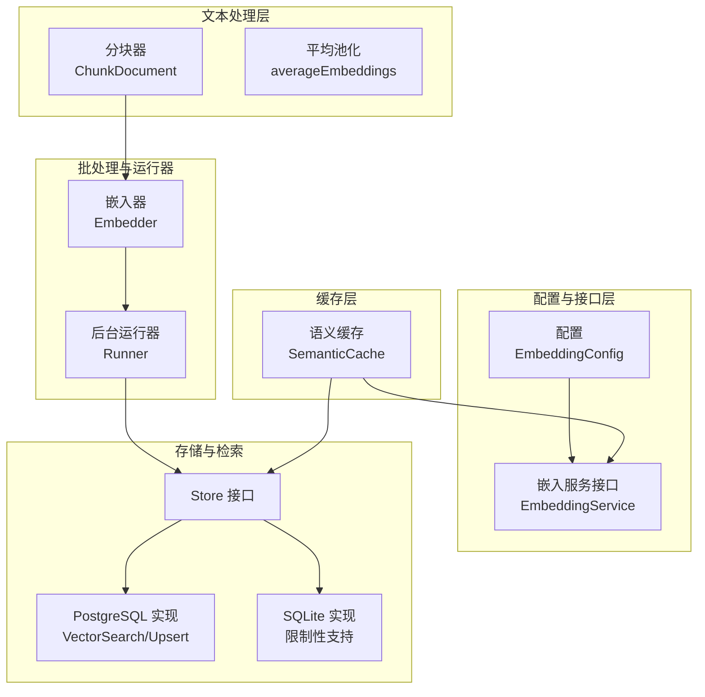
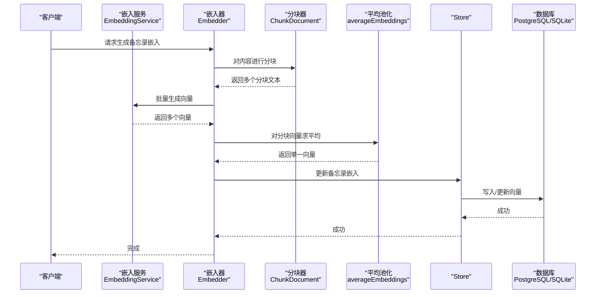
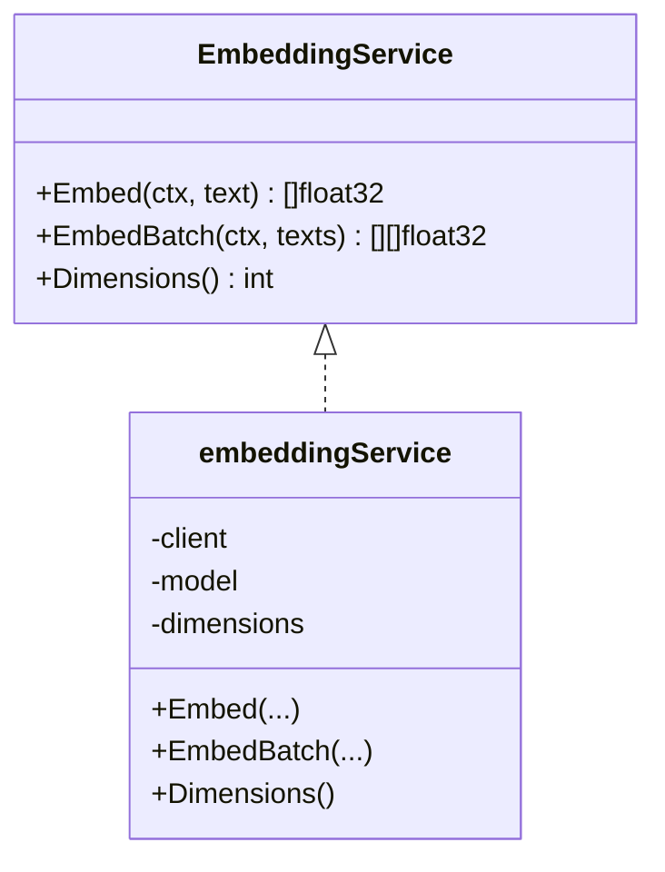
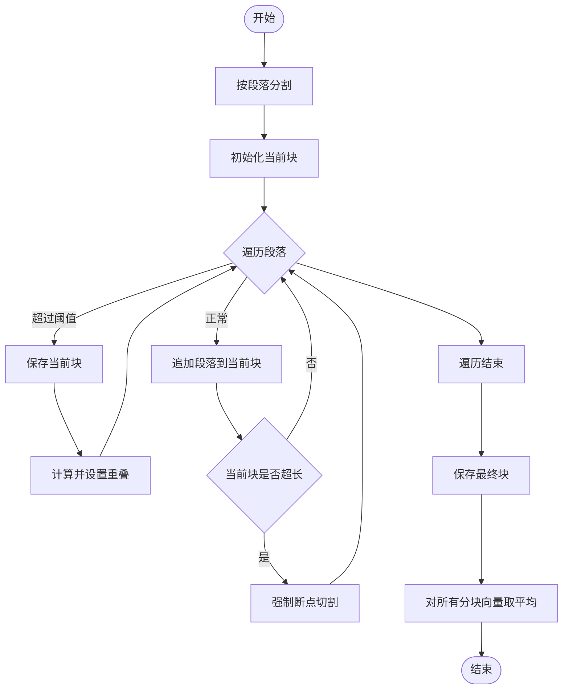
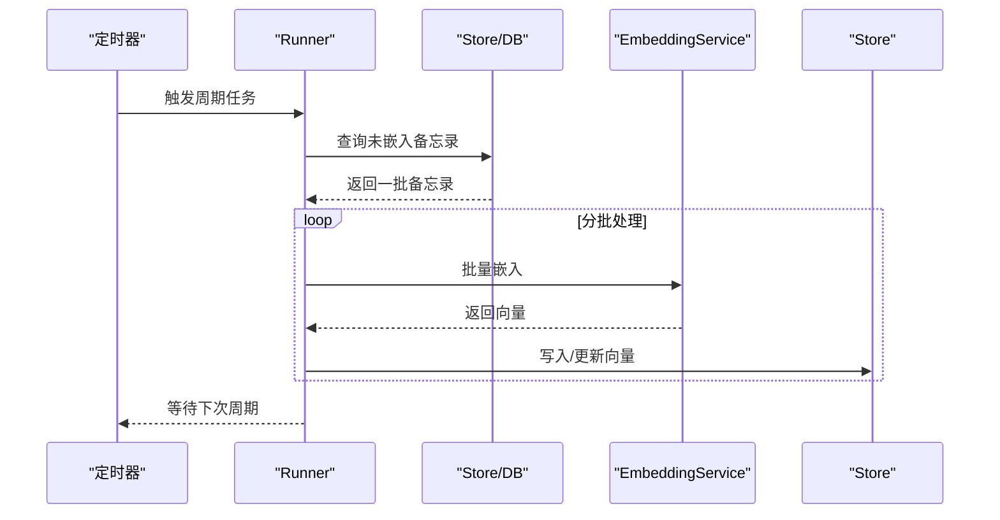
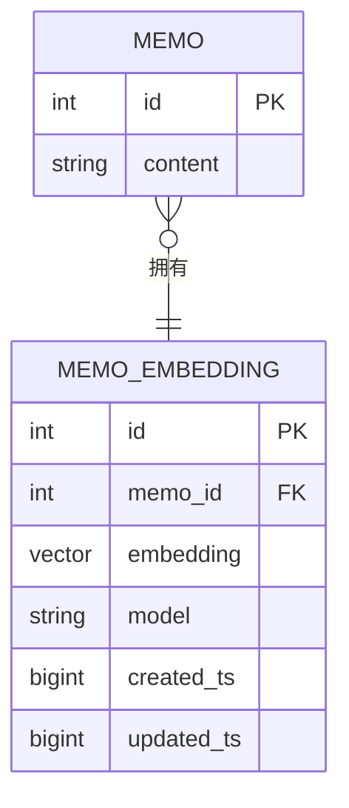
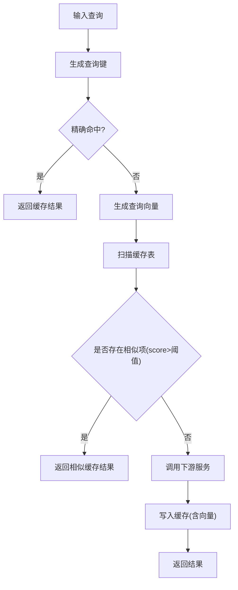
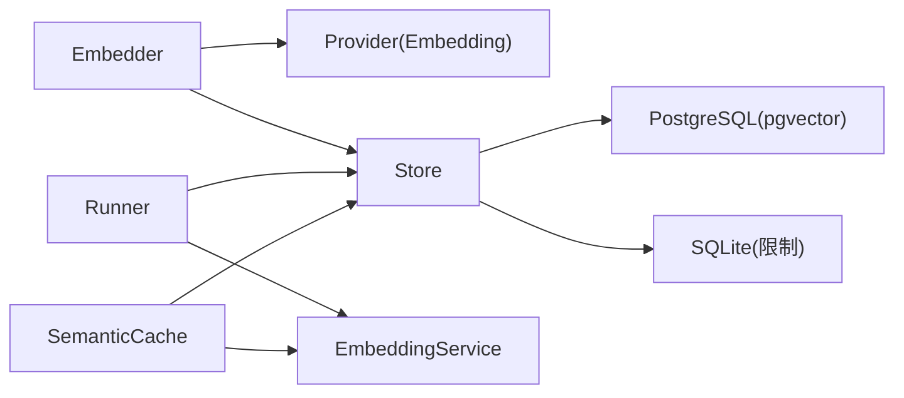

# 嵌入服务

<cite>
**本文引用的文件**
- [plugin/ai/embedding.go](file://plugin/ai/embedding.go)
- [plugin/ai/config.go](file://plugin/ai/config.go)
- [server/ai/embedder.go](file://server/ai/embedder.go)
- [server/ai/chunker.go](file://server/ai/chunker.go)
- [server/runner/embedding/runner.go](file://server/runner/embedding/runner.go)
- [store/memo_embedding.go](file://store/memo_embedding.go)
- [store/db/postgres/memo_embedding.go](file://store/db/postgres/memo_embedding.go)
- [store/db/sqlite/memo_embedding.go](file://store/db/sqlite/memo_embedding.go)
- [server/router/api/v1/ai_service.go](file://server/router/api/v1/ai_service.go)
- [store/cache/tiered.go](file://store/cache/tiered.go)
- [plugin/ai/embedding_test.go](file://plugin/ai/embedding_test.go)
- [server/runner/embedding/runner_test.go](file://server/runner/embedding/runner_test.go)
</cite>

## 目录
1. [简介](#简介)
2. [项目结构](#项目结构)
3. [核心组件](#核心组件)
4. [架构总览](#架构总览)
5. [详细组件分析](#详细组件分析)
6. [依赖关系分析](#依赖关系分析)
7. [性能考量](#性能考量)
8. [故障排查指南](#故障排查指南)
9. [结论](#结论)
10. [附录](#附录)

## 简介
本文件系统性阐述嵌入服务的技术实现，覆盖文本预处理、词嵌入模型与维度、向量归一化（如需）、批量处理与缓存、向量存储与检索、错误处理与降级策略、质量评估与调优建议，以及与向量数据库的集成与查询优化。目标是帮助开发者与运维人员快速理解并高效使用嵌入能力。

## 项目结构
嵌入服务由“配置与接口层”、“文本分块与聚合层”、“批处理与后台运行器”、“持久化与检索层”、“缓存层”等模块组成，围绕统一的嵌入接口进行协作。

图示来源
- [plugin/ai/config.go](file://plugin/ai/config.go#L18-L25)
- [plugin/ai/embedding.go](file://plugin/ai/embedding.go#L11-L21)
- [server/ai/chunker.go](file://server/ai/chunker.go#L15-L74)
- [server/ai/embedder.go](file://server/ai/embedder.go#L25-L62)
- [server/runner/embedding/runner.go](file://server/runner/embedding/runner.go#L13-L32)
- [store/memo_embedding.go](file://store/memo_embedding.go#L105-L138)
- [store/db/postgres/memo_embedding.go](file://store/db/postgres/memo_embedding.go#L111-L192)
- [store/db/sqlite/memo_embedding.go](file://store/db/sqlite/memo_embedding.go#L39-L48)
- [store/cache/tiered.go](file://store/cache/tiered.go#L233-L330)

章节来源
- [plugin/ai/config.go](file://plugin/ai/config.go#L18-L25)
- [plugin/ai/embedding.go](file://plugin/ai/embedding.go#L11-L21)
- [server/ai/chunker.go](file://server/ai/chunker.go#L15-L74)
- [server/ai/embedder.go](file://server/ai/embedder.go#L25-L62)
- [server/runner/embedding/runner.go](file://server/runner/embedding/runner.go#L13-L32)
- [store/memo_embedding.go](file://store/memo_embedding.go#L105-L138)
- [store/db/postgres/memo_embedding.go](file://store/db/postgres/memo_embedding.go#L111-L192)
- [store/db/sqlite/memo_embedding.go](file://store/db/sqlite/memo_embedding.go#L39-L48)
- [store/cache/tiered.go](file://store/cache/tiered.go#L233-L330)

## 核心组件
- 嵌入服务接口与实现
  - 接口定义：单条与批量嵌入、维度查询
  - 实现：基于 OpenAI 兼容客户端（SiliconFlow/OpenAI），支持指定模型与维度
- 文本预处理
  - 分块器：按段落优先、保留上下文重叠、在超长段落中寻找句/词边界断点
  - 平均池化：对多分块向量取均值，得到单一向量
- 批处理与后台运行器
  - 限流并发（goroutine 信号量）
  - 定时任务与手动触发
  - 分批拉取未嵌入的备忘录并批量生成向量
- 存储与检索
  - 结构化存储：MemoEmbedding（memo_id、embedding 向量、模型名、时间戳）
  - PostgreSQL：pgvector 向量相似度检索；SQLite：不支持向量功能
- 缓存
  - 语义缓存：以查询向量与余弦相似度匹配历史查询，命中即返回缓存结果

章节来源
- [plugin/ai/embedding.go](file://plugin/ai/embedding.go#L11-L21)
- [plugin/ai/embedding.go](file://plugin/ai/embedding.go#L71-L98)
- [server/ai/chunker.go](file://server/ai/chunker.go#L15-L74)
- [server/ai/embedder.go](file://server/ai/embedder.go#L94-L122)
- [server/runner/embedding/runner.go](file://server/runner/embedding/runner.go#L64-L92)
- [store/memo_embedding.go](file://store/memo_embedding.go#L8-L16)
- [store/db/postgres/memo_embedding.go](file://store/db/postgres/memo_embedding.go#L111-L192)
- [store/db/sqlite/memo_embedding.go](file://store/db/sqlite/memo_embedding.go#L39-L48)
- [store/cache/tiered.go](file://store/cache/tiered.go#L233-L330)

## 架构总览
嵌入服务的端到端流程如下：

图示来源
- [server/ai/embedder.go](file://server/ai/embedder.go#L25-L62)
- [server/ai/chunker.go](file://server/ai/chunker.go#L15-L74)
- [server/ai/embedder.go](file://server/ai/embedder.go#L94-L122)
- [plugin/ai/embedding.go](file://plugin/ai/embedding.go#L71-L98)
- [store/memo_embedding.go](file://store/memo_embedding.go#L105-L138)
- [store/db/postgres/memo_embedding.go](file://store/db/postgres/memo_embedding.go#L15-L42)

## 详细组件分析

### 嵌入服务接口与实现
- 接口职责
  - 单条嵌入：将单个文本映射为向量
  - 批量嵌入：将多个文本映射为向量矩阵
  - 维度查询：返回向量维度，用于后续校验与缓存
- 实现要点
  - 支持 SiliconFlow 与 OpenAI 提供商（通过 OpenAI 兼容客户端）
  - 指定模型与维度参数，确保与下游存储与检索一致
  - 错误包装与空响应校验，便于上层处理

图示来源
- [plugin/ai/embedding.go](file://plugin/ai/embedding.go#L11-L21)
- [plugin/ai/embedding.go](file://plugin/ai/embedding.go#L23-L27)
- [plugin/ai/embedding.go](file://plugin/ai/embedding.go#L71-L102)

章节来源
- [plugin/ai/embedding.go](file://plugin/ai/embedding.go#L11-L21)
- [plugin/ai/embedding.go](file://plugin/ai/embedding.go#L29-L58)
- [plugin/ai/embedding.go](file://plugin/ai/embedding.go#L60-L98)
- [plugin/ai/embedding.go](file://plugin/ai/embedding.go#L100-L102)

### 文本预处理与向量聚合
- 分块策略
  - 优先按段落切分，避免跨段丢失语义
  - 控制最大长度与重叠长度，保证上下文连续性
  - 在超长段落中寻找句号或空白断点，避免强制截断
- 向量聚合
  - 对每个分块分别嵌入后取平均，得到单一向量
  - 保证维度一致性，便于后续存储与检索

图示来源
- [server/ai/chunker.go](file://server/ai/chunker.go#L15-L74)
- [server/ai/chunker.go](file://server/ai/chunker.go#L129-L150)
- [server/ai/embedder.go](file://server/ai/embedder.go#L94-L122)

章节来源
- [server/ai/chunker.go](file://server/ai/chunker.go#L15-L74)
- [server/ai/chunker.go](file://server/ai/chunker.go#L129-L150)
- [server/ai/embedder.go](file://server/ai/embedder.go#L94-L122)

### 批处理与后台运行器
- 并发控制
  - 使用有界信号量限制同时发起的嵌入请求数，避免 API 限流或资源耗尽
- 定时与手动触发
  - 启动即执行一次，随后按固定周期轮询
  - 支持手动 RunOnce 触发
- 分批处理
  - 从数据库查询“尚未生成嵌入且模型匹配”的备忘录
  - 按批次大小切分，逐批生成向量并写入存储

图示来源
- [server/runner/embedding/runner.go](file://server/runner/embedding/runner.go#L34-L51)
- [server/runner/embedding/runner.go](file://server/runner/embedding/runner.go#L58-L95)
- [server/runner/embedding/runner.go](file://server/runner/embedding/runner.go#L97-L102)
- [server/runner/embedding/runner.go](file://server/runner/embedding/runner.go#L104-L138)

章节来源
- [server/runner/embedding/runner.go](file://server/runner/embedding/runner.go#L13-L32)
- [server/runner/embedding/runner.go](file://server/runner/embedding/runner.go#L34-L51)
- [server/runner/embedding/runner.go](file://server/runner/embedding/runner.go#L58-L95)
- [server/runner/embedding/runner.go](file://server/runner/embedding/runner.go#L97-L138)

### 存储与检索
- 存储结构
  - MemoEmbedding：包含 memo_id、embedding 向量、模型名、时间戳
- PostgreSQL 实现
  - Upsert：按 memo_id 与模型唯一键更新向量
  - VectorSearch：使用 pgvector 的余弦距离进行相似度检索
  - BM25Search：基于简单文本配置的全文检索
- SQLite 实现
  - 仅提供基础 LIKE 回退方案，不支持原生向量检索

图示来源
- [store/memo_embedding.go](file://store/memo_embedding.go#L8-L16)
- [store/db/postgres/memo_embedding.go](file://store/db/postgres/memo_embedding.go#L15-L42)
- [store/db/postgres/memo_embedding.go](file://store/db/postgres/memo_embedding.go#L111-L192)
- [store/db/sqlite/memo_embedding.go](file://store/db/sqlite/memo_embedding.go#L22-L48)

章节来源
- [store/memo_embedding.go](file://store/memo_embedding.go#L8-L16)
- [store/db/postgres/memo_embedding.go](file://store/db/postgres/memo_embedding.go#L15-L42)
- [store/db/postgres/memo_embedding.go](file://store/db/postgres/memo_embedding.go#L111-L192)
- [store/db/sqlite/memo_embedding.go](file://store/db/sqlite/memo_embedding.go#L22-L48)

### 缓存机制
- 语义缓存
  - 精确命中：按哈希键直接命中
  - 语义命中：对新查询生成向量，与缓存项计算余弦相似度，超过阈值则命中
  - TTL 与容量：基于 L1 缓存实现，支持阈值与默认过期时间配置
- 查询键生成：组合用户、查询、限制与策略，生成稳定键

图示来源
- [store/cache/tiered.go](file://store/cache/tiered.go#L233-L330)
- [store/cache/tiered.go](file://store/cache/tiered.go#L346-L382)

章节来源
- [store/cache/tiered.go](file://store/cache/tiered.go#L233-L330)
- [store/cache/tiered.go](file://store/cache/tiered.go#L346-L382)

## 依赖关系分析
- 组件耦合
  - Embedder 依赖 Provider（抽象）与 Store（数据访问）
  - Runner 依赖 Store 与 EmbeddingService，负责后台调度
  - Store 在 PostgreSQL 与 SQLite 上提供不同能力
  - SemanticCache 依赖 EmbeddingService 与 L1 缓存
- 外部依赖
  - OpenAI 兼容客户端（SiliconFlow/OpenAI）
  - PostgreSQL + pgvector（向量检索）
  - Redis（语义缓存可选）

图示来源
- [server/ai/embedder.go](file://server/ai/embedder.go#L12-L23)
- [server/runner/embedding/runner.go](file://server/runner/embedding/runner.go#L13-L32)
- [store/memo_embedding.go](file://store/memo_embedding.go#L105-L138)
- [store/db/postgres/memo_embedding.go](file://store/db/postgres/memo_embedding.go#L111-L192)
- [store/db/sqlite/memo_embedding.go](file://store/db/sqlite/memo_embedding.go#L39-L48)
- [store/cache/tiered.go](file://store/cache/tiered.go#L233-L330)

章节来源
- [server/ai/embedder.go](file://server/ai/embedder.go#L12-L23)
- [server/runner/embedding/runner.go](file://server/runner/embedding/runner.go#L13-L32)
- [store/memo_embedding.go](file://store/memo_embedding.go#L105-L138)
- [store/db/postgres/memo_embedding.go](file://store/db/postgres/memo_embedding.go#L111-L192)
- [store/db/sqlite/memo_embedding.go](file://store/db/sqlite/memo_embedding.go#L39-L48)
- [store/cache/tiered.go](file://store/cache/tiered.go#L233-L330)

## 性能考量
- 批量处理
  - Runner 采用固定批次大小与周期性处理，降低峰值内存与 API 调用量
  - 嵌入器对多分块取平均，减少冗余信息，提升检索稳定性
- 并发控制
  - 嵌入器内部限制并发 goroutine 数，避免 API 限流与资源争用
- 存储与检索
  - PostgreSQL + pgvector：使用余弦距离索引，支持高维向量检索
  - SQLite：不支持原生向量，回退至 LIKE 或 FTS5（若可用）
- 缓存
  - 语义缓存减少重复查询的嵌入与检索成本，提高响应速度
- 监控与验证
  - 提供单元测试与基准测试样例，覆盖批处理、取消、失败场景

章节来源
- [server/runner/embedding/runner.go](file://server/runner/embedding/runner.go#L21-L32)
- [server/ai/embedder.go](file://server/ai/embedder.go#L64-L92)
- [store/db/postgres/memo_embedding.go](file://store/db/postgres/memo_embedding.go#L111-L192)
- [store/db/sqlite/memo_embedding.go](file://store/db/sqlite/memo_embedding.go#L39-L48)
- [store/cache/tiered.go](file://store/cache/tiered.go#L233-L330)
- [server/runner/embedding/runner_test.go](file://server/runner/embedding/runner_test.go#L91-L104)

## 故障排查指南
- 常见错误与定位
  - 提供商不支持：构造函数会拒绝不受支持的提供商
  - 空文本/响应：批量嵌入前检查输入，响应为空时返回明确错误
  - 数据库能力限制：SQLite 不支持向量功能，需切换 PostgreSQL
- 降级策略
  - 当向量检索不可用时，回退至 BM25 全文检索
  - 语义缓存未命中时，直接调用下游服务并写入缓存
- 取消与超时
  - Runner 与嵌入服务均支持 context 取消，及时释放资源
- 测试与验证
  - 单测覆盖提供商选择、维度、空输入、取消等场景

章节来源
- [plugin/ai/embedding.go](file://plugin/ai/embedding.go#L47-L49)
- [plugin/ai/embedding.go](file://plugin/ai/embedding.go#L71-L74)
- [plugin/ai/embedding.go](file://plugin/ai/embedding.go#L87-L89)
- [store/db/sqlite/memo_embedding.go](file://store/db/sqlite/memo_embedding.go#L22-L48)
- [server/runner/embedding/runner_test.go](file://server/runner/embedding/runner_test.go#L174-L209)
- [plugin/ai/embedding_test.go](file://plugin/ai/embedding_test.go#L86-L104)

## 结论
该嵌入服务以清晰的分层设计实现了从文本预处理、向量生成、批量入库到检索与缓存的完整链路。通过 PostgreSQL + pgvector 的向量检索与语义缓存，系统在准确性与性能之间取得平衡；同时，严格的错误处理与降级策略保障了稳定性。建议在生产环境优先使用 PostgreSQL，并结合语义缓存与合理的批处理策略以获得最佳效果。

## 附录

### 支持的嵌入模型与配置选项
- 提供商
  - siliconflow：OpenAI 兼容 API
  - openai：OpenAI 官方 API
  - ollama：本地推理（当前实现不再支持）
- 关键配置
  - Provider、Model、Dimensions、APIKey、BaseURL
- 示例路径
  - [配置结构定义](file://plugin/ai/config.go#L18-L25)
  - [配置加载与校验](file://plugin/ai/config.go#L46-L103)
  - [构造嵌入服务](file://plugin/ai/embedding.go#L29-L58)

章节来源
- [plugin/ai/config.go](file://plugin/ai/config.go#L18-L25)
- [plugin/ai/config.go](file://plugin/ai/config.go#L46-L103)
- [plugin/ai/embedding.go](file://plugin/ai/embedding.go#L29-L58)

### 嵌入生成流程与性能监控示例
- 嵌入生成流程
  - [分块与平均池化](file://server/ai/chunker.go#L15-L74)
  - [批量嵌入与写库](file://server/runner/embedding/runner.go#L104-L138)
  - [接口调用与错误处理](file://plugin/ai/embedding.go#L71-L98)
- 性能监控与测试
  - [Runner 行为测试](file://server/runner/embedding/runner_test.go#L91-L104)
  - [嵌入服务行为测试](file://plugin/ai/embedding_test.go#L8-L64)

章节来源
- [server/ai/chunker.go](file://server/ai/chunker.go#L15-L74)
- [server/runner/embedding/runner.go](file://server/runner/embedding/runner.go#L104-L138)
- [plugin/ai/embedding.go](file://plugin/ai/embedding.go#L71-L98)
- [server/runner/embedding/runner_test.go](file://server/runner/embedding/runner_test.go#L91-L104)
- [plugin/ai/embedding_test.go](file://plugin/ai/embedding_test.go#L8-L64)

### 与向量数据库的集成与查询优化
- 集成方式
  - PostgreSQL + pgvector：使用余弦距离进行相似度检索
  - SQLite：不支持原生向量，回退至 LIKE 或 FTS5
- 查询优化建议
  - 控制批次大小与并发，避免峰值压力
  - 使用语义缓存降低重复查询成本
  - 对查询向量与缓存向量进行余弦相似度匹配，设定合理阈值

章节来源
- [store/db/postgres/memo_embedding.go](file://store/db/postgres/memo_embedding.go#L111-L192)
- [store/db/sqlite/memo_embedding.go](file://store/db/sqlite/memo_embedding.go#L39-L48)
- [store/cache/tiered.go](file://store/cache/tiered.go#L233-L330)