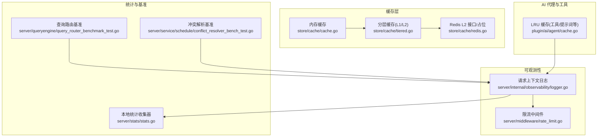
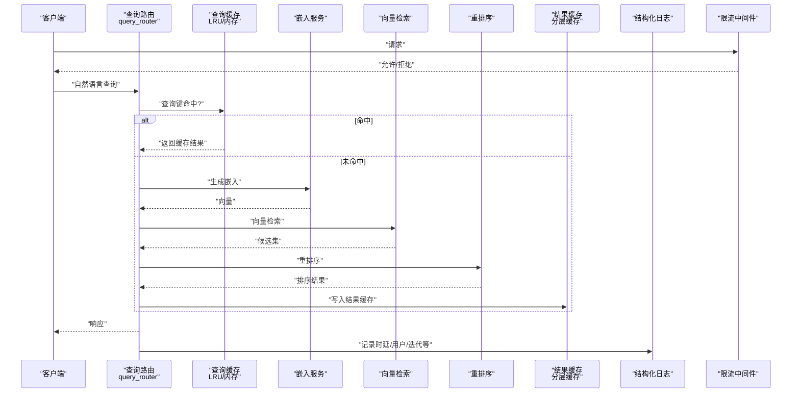
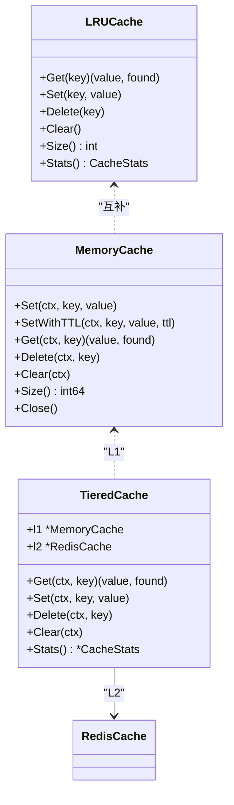
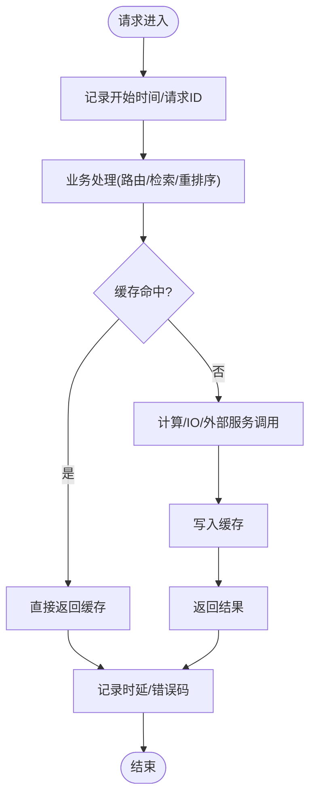
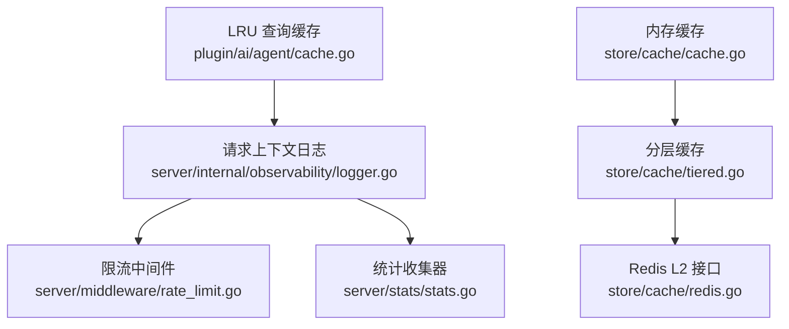

# 性能优化与监控

<cite>
**本文引用的文件**
- [store/cache/cache.go](file://store/cache/cache.go)
- [store/cache/redis.go](file://store/cache/redis.go)
- [store/cache/tiered.go](file://store/cache/tiered.go)
- [plugin/ai/agent/cache.go](file://plugin/ai/agent/cache.go)
- [server/internal/observability/logger.go](file://server/internal/observability/logger.go)
- [server/middleware/rate_limit.go](file://server/middleware/rate_limit.go)
- [server/stats/stats.go](file://server/stats/stats.go)
- [server/queryengine/query_router_benchmark_test.go](file://server/queryengine/query_router_benchmark_test.go)
- [server/service/schedule/conflict_resolver_bench_test.go](file://server/service/schedule/conflict_resolver_bench_test.go)
- [docs/archived/cleanup_20260123/RAG_SYSTEM_RESEARCH_REPORT.md](file://docs/archived/cleanup_20260123/RAG_SYSTEM_RESEARCH_REPORT.md)
- [docs/archived/cleanup_20260123/agent_architecture/agent_scheduler/SCHEDULE_AGENT_ROUND2_OPTIMIZATION.md](file://docs/archived/cleanup_20260123/agent_architecture/agent_scheduler/SCHEDULE_AGENT_ROUND2_OPTIMIZATION.md)
- [docs/MEMOS_REFACTOR_PLAN.md](file://docs/MEMOS_REFACTOR_PLAN.md)
- [docs/archived/cleanup_20260123/optimal_rag/P1_IMPROVEMENTS_REPORT.md](file://docs/archived/cleanup_20260123/optimal_rag/P1_IMPROVEMENTS_REPORT.md)
- [docs/archived/cleanup_20260123/optimal_rag/TESTING_GUIDE.md](file://docs/archived/cleanup_20260123/optimal_rag/TESTING_GUIDE.md)
</cite>

## 目录
1. [简介](#简介)
2. [项目结构](#项目结构)
3. [核心组件](#核心组件)
4. [架构总览](#架构总览)
5. [详细组件分析](#详细组件分析)
6. [依赖关系分析](#依赖关系分析)
7. [性能考量](#性能考量)
8. [故障排查指南](#故障排查指南)
9. [结论](#结论)
10. [附录](#附录)

## 简介
本文件聚焦于 RAG 管道的性能优化与监控，围绕缓存策略（查询缓存、嵌入缓存、结果缓存）、性能监控指标（延迟、吞吐量、错误率）、内存优化（对象池、预分配、垃圾回收优化）、并发控制与资源管理、瓶颈识别与解决方案、性能基准测试与持续优化流程展开，并结合仓库中的现有实现与文档，给出可落地的优化建议与最佳实践。

## 项目结构
本项目采用多模块分层组织，与性能优化密切相关的模块包括：
- 存储与缓存层：内存缓存、分层缓存（L1/L2）、可选 Redis L2
- 观测与日志：结构化请求上下文日志，便于端到端链路追踪
- 中间件：限流中间件，用于资源保护与流量整形
- 统计与指标：轻量级本地统计收集器
- 基准测试：查询路由、冲突解析等关键路径的基准测试
- 文档与报告：RAG 研究、调度 Agent 优化、重构计划、测试指南等

图表来源
- [store/cache/cache.go](file://store/cache/cache.go#L66-L90)
- [store/cache/tiered.go](file://store/cache/tiered.go#L393-L446)
- [store/cache/redis.go](file://store/cache/redis.go#L12-L82)
- [plugin/ai/agent/cache.go](file://plugin/ai/agent/cache.go#L10-L74)
- [server/internal/observability/logger.go](file://server/internal/observability/logger.go#L30-L48)
- [server/middleware/rate_limit.go](file://server/middleware/rate_limit.go#L11-L22)
- [server/stats/stats.go](file://server/stats/stats.go#L14-L45)
- [server/queryengine/query_router_benchmark_test.go](file://server/queryengine/query_router_benchmark_test.go#L9-L28)
- [server/service/schedule/conflict_resolver_bench_test.go](file://server/service/schedule/conflict_resolver_bench_test.go#L12-L31)

章节来源
- [store/cache/cache.go](file://store/cache/cache.go#L66-L90)
- [store/cache/tiered.go](file://store/cache/tiered.go#L393-L446)
- [store/cache/redis.go](file://store/cache/redis.go#L12-L82)
- [plugin/ai/agent/cache.go](file://plugin/ai/agent/cache.go#L10-L74)
- [server/internal/observability/logger.go](file://server/internal/observability/logger.go#L30-L48)
- [server/middleware/rate_limit.go](file://server/middleware/rate_limit.go#L11-L22)
- [server/stats/stats.go](file://server/stats/stats.go#L14-L45)
- [server/queryengine/query_router_benchmark_test.go](file://server/queryengine/query_router_benchmark_test.go#L9-L28)
- [server/service/schedule/conflict_resolver_bench_test.go](file://server/service/schedule/conflict_resolver_bench_test.go#L12-L31)

## 核心组件
- 内存缓存：带 TTL、逐出回调、清理循环、基于原子计数的大小统计，适合单进程内快速缓存。
- 分层缓存：L1 内存 + L2 可选 Redis，支持统计聚合与开关控制，适配多实例场景。
- LRU 缓存：线程安全 LRU，支持 TTL、命中/未命中统计，适用于工具提示词、系统提示词等高频短命数据。
- 请求上下文日志：统一注入 request_id、user_id、agent_type、duration_ms 等字段，便于端到端追踪。
- 限流中间件：基于令牌桶的速率限制，支持按 key 维度限流，避免突发流量压垮下游。
- 统计收集器：周期性统计笔记、日程、搜索、AI 查询等指标，辅助容量规划与趋势分析。
- 基准测试：覆盖查询路由、时间范围检测、内容提取、冲突解析等关键路径，支撑性能回归与优化验证。

章节来源
- [store/cache/cache.go](file://store/cache/cache.go#L66-L90)
- [store/cache/tiered.go](file://store/cache/tiered.go#L393-L446)
- [store/cache/redis.go](file://store/cache/redis.go#L12-L82)
- [plugin/ai/agent/cache.go](file://plugin/ai/agent/cache.go#L10-L74)
- [server/internal/observability/logger.go](file://server/internal/observability/logger.go#L30-L48)
- [server/middleware/rate_limit.go](file://server/middleware/rate_limit.go#L11-L22)
- [server/stats/stats.go](file://server/stats/stats.go#L14-L45)
- [server/queryengine/query_router_benchmark_test.go](file://server/queryengine/query_router_benchmark_test.go#L9-L28)
- [server/service/schedule/conflict_resolver_bench_test.go](file://server/service/schedule/conflict_resolver_bench_test.go#L12-L31)

## 架构总览
RAG 管道的关键路径通常包括：查询解析 → 查询缓存命中 → 嵌入向量化 → 向量检索 → 重排序 → 结果缓存 → 响应返回。为保障性能，需要在各环节引入缓存与监控，并通过限流与统计进行资源治理。

图表来源
- [plugin/ai/agent/cache.go](file://plugin/ai/agent/cache.go#L76-L108)
- [store/cache/cache.go](file://store/cache/cache.go#L92-L120)
- [store/cache/tiered.go](file://store/cache/tiered.go#L393-L446)
- [server/internal/observability/logger.go](file://server/internal/observability/logger.go#L74-L97)
- [server/middleware/rate_limit.go](file://server/middleware/rate_limit.go#L39-L48)

## 详细组件分析

### 缓存策略设计与实现
- 查询缓存（短期高频）：使用 LRU 缓存，键为“用户+查询”组合，TTL 控制在分钟级，避免重复解析与工具提示词生成。
- 嵌入缓存（中长期稳定）：使用内存缓存，键为“文本+模型参数”，TTL 控制在小时级；可结合分层缓存将热点嵌入持久化至 Redis。
- 结果缓存（最终输出）：使用分层缓存，L1 为内存，L2 为 Redis；统计命中率与大小，便于容量评估与降级策略。

图表来源
- [plugin/ai/agent/cache.go](file://plugin/ai/agent/cache.go#L10-L74)
- [store/cache/cache.go](file://store/cache/cache.go#L66-L90)
- [store/cache/tiered.go](file://store/cache/tiered.go#L393-L446)
- [store/cache/redis.go](file://store/cache/redis.go#L12-L82)

章节来源
- [plugin/ai/agent/cache.go](file://plugin/ai/agent/cache.go#L10-L74)
- [store/cache/cache.go](file://store/cache/cache.go#L66-L90)
- [store/cache/tiered.go](file://store/cache/tiered.go#L393-L446)
- [store/cache/redis.go](file://store/cache/redis.go#L12-L82)

### 性能监控指标与采集
- 延迟：通过请求上下文日志记录 duration_ms，支持端到端时延观测。
- 吞吐量：结合基准测试与限流中间件，评估 QPS 与并发能力。
- 错误率：在日志中记录 error_code 与错误堆栈，配合统计收集器记录异常趋势。
- 缓存命中率：LRU 缓存提供命中/未命中统计；分层缓存提供 L1/L2 命中率与总数统计。

图表来源
- [server/internal/observability/logger.go](file://server/internal/observability/logger.go#L74-L97)
- [plugin/ai/agent/cache.go](file://plugin/ai/agent/cache.go#L178-L197)
- [store/cache/tiered.go](file://store/cache/tiered.go#L410-L446)

章节来源
- [server/internal/observability/logger.go](file://server/internal/observability/logger.go#L74-L97)
- [plugin/ai/agent/cache.go](file://plugin/ai/agent/cache.go#L178-L197)
- [store/cache/tiered.go](file://store/cache/tiered.go#L410-L446)

### 内存优化技术
- 对象池与预分配：在检索与重排序阶段尽量复用对象，减少临时切片扩容与大对象驻留。
- 垃圾回收优化：避免在热路径上产生大量短生命周期对象；使用 sync.Pool 或复用结构体。
- TTL 与逐出：合理设置 TTL 与最大条目数，定期清理过期与最旧条目，避免内存膨胀。
- OOM 防护：数据库连接层面设置 mmap 尺寸，防止虚拟内存暴涨。

章节来源
- [docs/archived/cleanup_20260123/optimal_rag/P1_IMPROVEMENTS_REPORT.md](file://docs/archived/cleanup_20260123/optimal_rag/P1_IMPROVEMENTS_REPORT.md#L137-L148)
- [docs/specs/sync-user-role-and-mode-refactor-20260121.md](file://docs/specs/sync-user-role-and-mode-refactor-20260121.md#L50-L57)

### 并发控制与资源管理
- 信号量/限流：通过限流中间件限制每用户的并发请求数，避免慢查询雪崩。
- 并发读写配置：查询路由配置读写分离与并发安全，基准测试覆盖读多写少场景。
- Worker Pool：嵌入生成与重排序批处理，提高 CPU 利用率与吞吐。

章节来源
- [docs/MEMOS_REFACTOR_PLAN.md](file://docs/MEMOS_REFACTOR_PLAN.md#L920-L927)
- [server/queryengine/query_router_benchmark_test.go](file://server/queryengine/query_router_benchmark_test.go#L130-L149)
- [server/middleware/rate_limit.go](file://server/middleware/rate_limit.go#L11-L22)

### 性能瓶颈识别与解决方案
- 路由与解析：通过基准测试定位 detectTimeRange、extractContentQuery、CheckMostlyProperNouns 等热点函数。
- 冲突解析：冲突构建索引与查找冲突的复杂度，基准测试覆盖空闲/繁忙场景。
- 时间范围验证：ValidateTimeRange 的边界条件与性能影响，限制未来时间与查询范围。

章节来源
- [server/queryengine/query_router_benchmark_test.go](file://server/queryengine/query_router_benchmark_test.go#L54-L74)
- [server/queryengine/query_router_benchmark_test.go](file://server/queryengine/query_router_benchmark_test.go#L76-L93)
- [server/queryengine/query_router_benchmark_test.go](file://server/queryengine/query_router_benchmark_test.go#L114-L128)
- [server/service/schedule/conflict_resolver_bench_test.go](file://server/service/schedule/conflict_resolver_bench_test.go#L12-L31)
- [server/service/schedule/conflict_resolver_bench_test.go](file://server/service/schedule/conflict_resolver_bench_test.go#L70-L111)
- [docs/archived/cleanup_20260123/optimal_rag/P1_IMPROVEMENTS_REPORT.md](file://docs/archived/cleanup_20260123/optimal_rag/P1_IMPROVEMENTS_REPORT.md#L93-L122)

### 性能基准测试与持续优化流程
- 基准测试：覆盖路由、时间范围检测、内容提取、冲突解析、评分与排序等关键路径。
- 压力测试：参考 RAG 研究报告的压力测试表格，设定并发与 QPS 目标，评估延迟与错误率。
- 持续优化：以基准测试为回归基线，结合缓存命中率与日志时延，迭代优化热点函数与资源配置。

章节来源
- [server/queryengine/query_router_benchmark_test.go](file://server/queryengine/query_router_benchmark_test.go#L9-L28)
- [server/queryengine/query_router_benchmark_test.go](file://server/queryengine/query_router_benchmark_test.go#L30-L52)
- [server/service/schedule/conflict_resolver_bench_test.go](file://server/service/schedule/conflict_resolver_bench_test.go#L146-L182)
- [docs/archived/cleanup_20260123/RAG_SYSTEM_RESEARCH_REPORT.md](file://docs/archived/cleanup_20260123/RAG_SYSTEM_RESEARCH_REPORT.md#L1088-L1100)
- [docs/archived/cleanup_20260123/optimal_rag/TESTING_GUIDE.md](file://docs/archived/cleanup_20260123/optimal_rag/TESTING_GUIDE.md#L367-L451)

### 负载测试与压力测试最佳实践
- 场景设计：覆盖空闲、中等负载、高并发、峰值突发等场景。
- 指标定义：QPS、P50/P95 延迟、错误率、缓存命中率、CPU/内存/GC 指标。
- 工具与方法：使用基准测试作为回归工具，结合日志与统计收集器进行趋势分析。

章节来源
- [docs/archived/cleanup_20260123/RAG_SYSTEM_RESEARCH_REPORT.md](file://docs/archived/cleanup_20260123/RAG_SYSTEM_RESEARCH_REPORT.md#L1088-L1100)
- [docs/archived/cleanup_20260123/optimal_rag/TESTING_GUIDE.md](file://docs/archived/cleanup_20260123/optimal_rag/TESTING_GUIDE.md#L367-L451)

## 依赖关系分析
缓存与监控相关组件之间的依赖关系如下：

图表来源
- [plugin/ai/agent/cache.go](file://plugin/ai/agent/cache.go#L10-L74)
- [store/cache/cache.go](file://store/cache/cache.go#L66-L90)
- [store/cache/tiered.go](file://store/cache/tiered.go#L393-L446)
- [store/cache/redis.go](file://store/cache/redis.go#L12-L82)
- [server/internal/observability/logger.go](file://server/internal/observability/logger.go#L30-L48)
- [server/middleware/rate_limit.go](file://server/middleware/rate_limit.go#L11-L22)
- [server/stats/stats.go](file://server/stats/stats.go#L14-L45)

章节来源
- [plugin/ai/agent/cache.go](file://plugin/ai/agent/cache.go#L10-L74)
- [store/cache/cache.go](file://store/cache/cache.go#L66-L90)
- [store/cache/tiered.go](file://store/cache/tiered.go#L393-L446)
- [store/cache/redis.go](file://store/cache/redis.go#L12-L82)
- [server/internal/observability/logger.go](file://server/internal/observability/logger.go#L30-L48)
- [server/middleware/rate_limit.go](file://server/middleware/rate_limit.go#L11-L22)
- [server/stats/stats.go](file://server/stats/stats.go#L14-L45)

## 性能考量
- 缓存命中率：通过 LRU 与分层缓存统计，持续优化键空间与 TTL。
- 吞吐与延迟：结合限流与基准测试，确保在目标并发下的 P95 延迟达标。
- 资源保护：数据库连接 mmap 设置、连接池参数、批处理与 Worker Pool，避免 OOM 与慢查询雪崩。
- 可观测性：统一日志字段与结构化输出，便于定位瓶颈与回归分析。

## 故障排查指南
- 缓存未命中：检查键生成策略、TTL 是否过短、内存/Redis 是否可用。
- 高延迟：查看日志中的 duration_ms，结合基准测试定位热点函数。
- 错误率上升：关注 error_code 与错误堆栈，结合统计收集器观察趋势。
- 并发异常：确认限流配置与并发上限，避免突发流量导致系统过载。

章节来源
- [server/internal/observability/logger.go](file://server/internal/observability/logger.go#L74-L97)
- [server/middleware/rate_limit.go](file://server/middleware/rate_limit.go#L39-L48)
- [server/stats/stats.go](file://server/stats/stats.go#L232-L250)

## 结论
通过在查询、嵌入与结果三个阶段分别引入 LRU、内存与分层缓存，并结合结构化日志、限流与统计收集器，能够有效提升 RAG 管道的吞吐与稳定性。配合基准测试与压力测试，形成持续优化闭环，逐步逼近目标延迟与 QPS 指标，同时保持资源安全与可维护性。

## 附录
- 实际代码示例路径（不展示具体代码内容）：
  - 查询缓存实现与统计：[plugin/ai/agent/cache.go](file://plugin/ai/agent/cache.go#L76-L108)、[plugin/ai/agent/cache.go](file://plugin/ai/agent/cache.go#L178-L197)
  - 内存缓存 TTL 与逐出：[store/cache/cache.go](file://store/cache/cache.go#L92-L120)、[store/cache/cache.go](file://store/cache/cache.go#L252-L313)
  - 分层缓存统计聚合：[store/cache/tiered.go](file://store/cache/tiered.go#L410-L446)
  - Redis L2 接口与配置：[store/cache/redis.go](file://store/cache/redis.go#L12-L82)
  - 请求上下文日志字段：[server/internal/observability/logger.go](file://server/internal/observability/logger.go#L11-L28)、[server/internal/observability/logger.go](file://server/internal/observability/logger.go#L74-L97)
  - 限流中间件：[server/middleware/rate_limit.go](file://server/middleware/rate_limit.go#L11-L22)
  - 统计收集器：[server/stats/stats.go](file://server/stats/stats.go#L232-L250)
  - 查询路由基准测试：[server/queryengine/query_router_benchmark_test.go](file://server/queryengine/query_router_benchmark_test.go#L9-L28)
  - 冲突解析基准测试：[server/service/schedule/conflict_resolver_bench_test.go](file://server/service/schedule/conflict_resolver_bench_test.go#L12-L31)
  - 压力测试表格与预期指标：[docs/archived/cleanup_20260123/RAG_SYSTEM_RESEARCH_REPORT.md](file://docs/archived/cleanup_20260123/RAG_SYSTEM_RESEARCH_REPORT.md#L1088-L1100)、[docs/archived/cleanup_20260123/optimal_rag/TESTING_GUIDE.md](file://docs/archived/cleanup_20260123/optimal_rag/TESTING_GUIDE.md#L367-L451)
  - 调度 Agent 缓存监控与优化经验：[docs/archived/cleanup_20260123/agent_architecture/agent_scheduler/SCHEDULE_AGENT_ROUND2_OPTIMIZATION.md](file://docs/archived/cleanup_20260123/agent_architecture/agent_scheduler/SCHEDULE_AGENT_ROUND2_OPTIMIZATION.md#L303-L369)