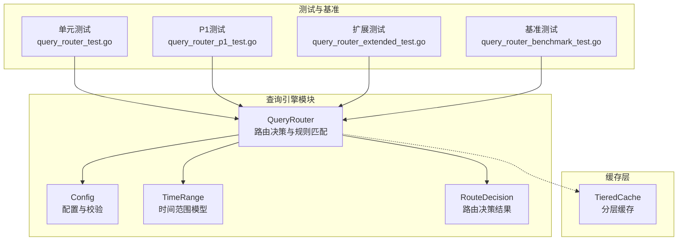
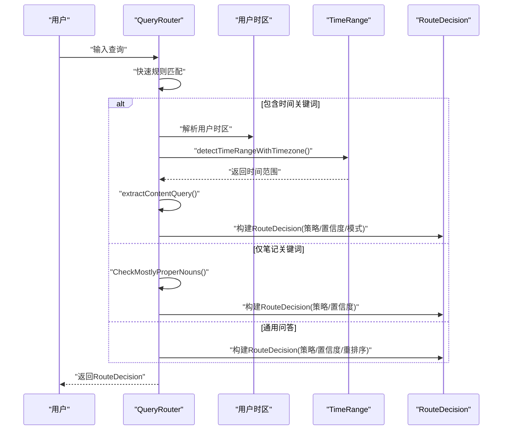
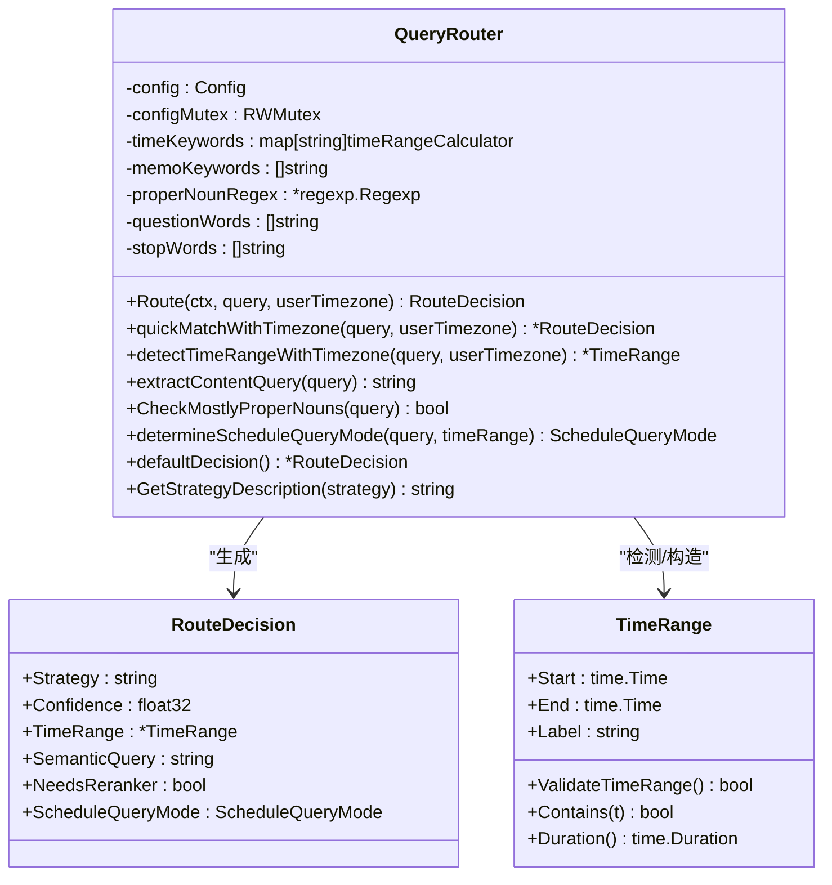
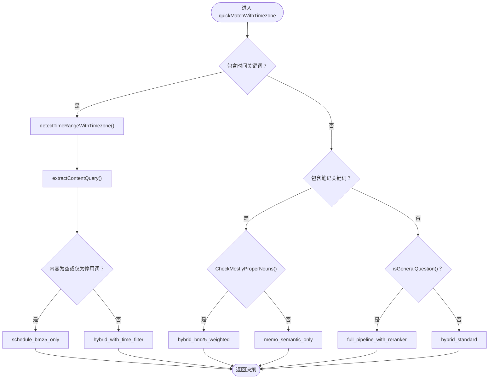
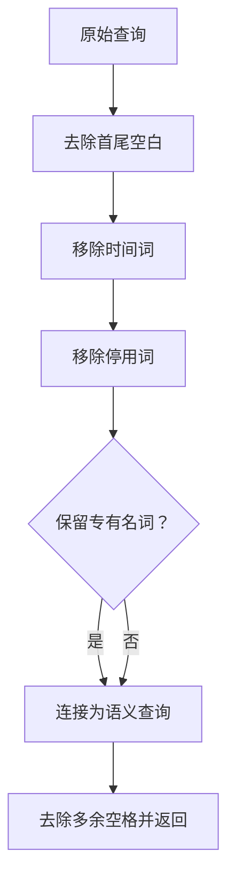
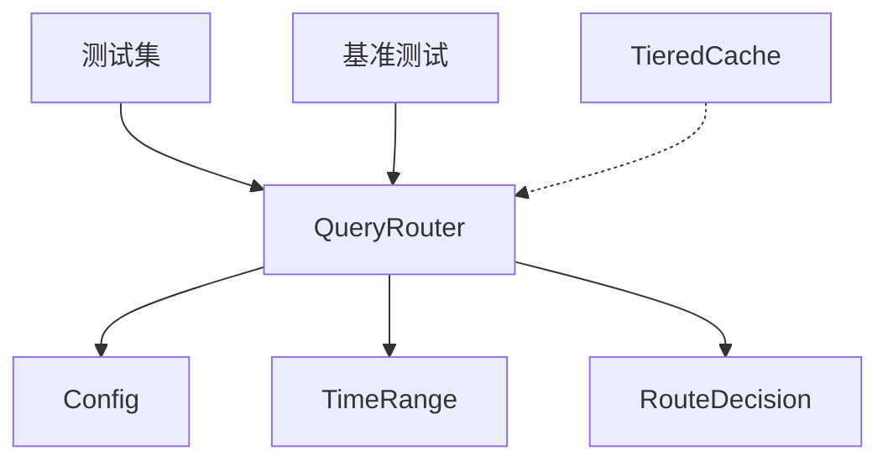

# 查询路由引擎

<cite>
**本文档引用的文件**
- [query_router.go](file://server/queryengine/query_router.go)
- [config.go](file://server/queryengine/config.go)
- [query_router_test.go](file://server/queryengine/query_router_test.go)
- [query_router_p1_test.go](file://server/queryengine/query_router_p1_test.go)
- [query_router_p1_integration_test.go](file://server/queryengine/query_router_p1_integration_test.go)
- [query_router_date_parsing_test.go](file://server/queryengine/query_router_date_parsing_test.go)
- [query_router_today_test.go](file://server/queryengine/query_router_today_test.go)
- [query_router_extended_test.go](file://server/queryengine/query_router_extended_test.go)
- [query_router_benchmark_test.go](file://server/queryengine/query_router_benchmark_test.go)
- [tiered.go](file://store/cache/tiered.go)
</cite>

## 目录
1. [简介](#简介)
2. [项目结构](#项目结构)
3. [核心组件](#核心组件)
4. [架构总览](#架构总览)
5. [详细组件分析](#详细组件分析)
6. [依赖关系分析](#依赖关系分析)
7. [性能考虑](#性能考虑)
8. [故障排除指南](#故障排除指南)
9. [结论](#结论)
10. [附录](#附录)

## 简介
本技术文档围绕查询路由引擎展开，系统性阐述其如何解析用户查询，包括自然语言理解、意图检测与查询规范化过程；详解时间范围解析、实体提取与查询重写机制；解释路由策略的选择逻辑与基于查询复杂度的自动路由决策；并提供查询预处理步骤（停用词过滤、词干提取、同义词扩展）与性能优化策略及缓存机制。文档还包含实际代码示例路径与错误处理机制说明，帮助读者快速理解与落地实现。

## 项目结构
查询路由引擎位于服务端查询引擎模块，核心文件包括：
- 路由器实现：server/queryengine/query_router.go
- 配置管理：server/queryengine/config.go
- 单元测试与基准测试：server/queryengine/query_router_*.go
- 缓存层：store/cache/tiered.go（用于检索与结果缓存）

**图表来源**
- [query_router.go](file://server/queryengine/query_router.go#L1-L120)
- [config.go](file://server/queryengine/config.go#L1-L120)
- [query_router_test.go](file://server/queryengine/query_router_test.go#L1-L120)
- [query_router_p1_test.go](file://server/queryengine/query_router_p1_test.go#L1-L120)
- [query_router_extended_test.go](file://server/queryengine/query_router_extended_test.go#L1-L120)
- [query_router_benchmark_test.go](file://server/queryengine/query_router_benchmark_test.go#L1-L120)
- [tiered.go](file://store/cache/tiered.go#L393-L430)

**章节来源**
- [query_router.go](file://server/queryengine/query_router.go#L1-L120)
- [config.go](file://server/queryengine/config.go#L1-L120)

## 核心组件
- QueryRouter：负责解析用户查询，执行快速规则匹配，检测时间范围，提取内容查询，决定路由策略与置信度，并支持时区感知。
- Config：集中管理时间范围、查询限制、检索与评分配置，支持运行时并发安全更新与校验。
- RouteDecision：封装路由决策结果，包含策略名称、置信度、时间范围、语义查询、是否需要重排序以及日程查询模式。
- TimeRange：表示时间范围，提供有效性校验、包含判断与持续时间计算。

**章节来源**
- [query_router.go](file://server/queryengine/query_router.go#L18-L106)
- [config.go](file://server/queryengine/config.go#L7-L120)
- [query_router.go](file://server/queryengine/query_router.go#L51-L90)

## 架构总览
查询路由引擎采用“快速规则匹配 + 时间范围解析 + 内容提取 + 策略选择”的流水线式处理，结合配置化与并发控制，确保高性能与可维护性。

**图表来源**
- [query_router.go](file://server/queryengine/query_router.go#L449-L552)
- [query_router.go](file://server/queryengine/query_router.go#L677-L822)
- [query_router.go](file://server/queryengine/query_router.go#L858-L900)

## 详细组件分析

### QueryRouter 类与方法
- 结构体字段：配置、时间关键词映射、笔记关键词、专有名词正则、疑问词、停用词等。
- 关键方法：
  - Route：入口方法，支持用户时区，先快速匹配再回退默认策略。
  - quickMatchWithTimezone：快速规则匹配，按日程、笔记、通用问答顺序判定。
  - detectTimeRangeWithTimezone：带时区的时间范围检测，支持多种日期格式与相对时间。
  - extractContentQuery：内容查询提取，移除时间词与停用词，保留专有名词。
  - CheckMostlyProperNouns：判断查询是否主要由专有名词组成。
  - determineScheduleQueryMode：根据时间范围标签确定日程查询模式（标准/严格）。
  - defaultDecision：默认路由决策。
  - GetStrategyDescription：策略描述映射。

**图表来源**
- [query_router.go](file://server/queryengine/query_router.go#L18-L106)
- [query_router.go](file://server/queryengine/query_router.go#L51-L90)
- [query_router.go](file://server/queryengine/query_router.go#L930-L970)

**章节来源**
- [query_router.go](file://server/queryengine/query_router.go#L70-L106)
- [query_router.go](file://server/queryengine/query_router.go#L449-L552)
- [query_router.go](file://server/queryengine/query_router.go#L677-L822)
- [query_router.go](file://server/queryengine/query_router.go#L858-L900)
- [query_router.go](file://server/queryengine/query_router.go#L930-L970)

### 时间范围解析与路由策略
- 时间关键词初始化：涵盖精确日期、相对日期、周/星期、时段、模糊时间、月份、年份、季度等。
- 时间范围检测：
  - 支持“YYYY年MM月DD日”、“YYYY-MM-DD”、“YYYY/MM/DD”、“MM-DD”、“MM/DD”、“M月D日/号”等多种格式。
  - 时区支持：detectTimeRangeWithTimezone 使用用户时区，detectTimeRange 使用 UTC。
  - 相对时间与绝对时间区分：相对时间（今天/本周/本月等）→ 标准模式；绝对时间（具体日期）→ 严格模式。
- 路由策略：
  - schedule_bm25_only：纯日程查询（高置信度）。
  - hybrid_with_time_filter：时间 + 内容混合查询。
  - memo_semantic_only：笔记语义查询。
  - hybrid_bm25_weighted：专有名词为主的笔记查询。
  - hybrid_standard：默认混合策略。
  - full_pipeline_with_reranker：通用问答，需要重排序。

**图表来源**
- [query_router.go](file://server/queryengine/query_router.go#L467-L552)
- [query_router.go](file://server/queryengine/query_router.go#L642-L675)
- [query_router.go](file://server/queryengine/query_router.go#L824-L856)

**章节来源**
- [query_router.go](file://server/queryengine/query_router.go#L108-L447)
- [query_router.go](file://server/queryengine/query_router.go#L554-L822)
- [query_router.go](file://server/queryengine/query_router.go#L824-L856)

### 查询预处理与规范化
- 停用词过滤：移除“的”“查询”“搜索”“查找”“关于”“安排”“呢”“吗”“啊”“呀”“内容”“笔记”“备忘”“记录”等。
- 专有名词识别：使用正则匹配首字母大写的英文单词，作为专有名词依据。
- 内容查询提取：移除所有时间词与停用词，保留专有名词与内容词，清理多余空格。
- 词干提取与同义词扩展：当前实现未包含词干提取与同义词扩展，可在后续版本引入 NLP 工具链增强。

**图表来源**
- [query_router.go](file://server/queryengine/query_router.go#L858-L900)

**章节来源**
- [query_router.go](file://server/queryengine/query_router.go#L858-L900)

### 配置与并发控制
- 配置结构：TimeRange、QueryLimits、Retrieval、Scoring 等子配置，支持运行时并发安全更新与校验。
- 并发控制：QueryRouter 与 Config 均使用读写锁，保证高并发下的线程安全。
- 配置验证：对最大未来天数、最大范围天数、查询长度、结果数量、最小分数、向量/混合/扩展限制、文档长度、BM25权重范围、语义权重、质量阈值、重排阈值等进行范围校验。

**章节来源**
- [config.go](file://server/queryengine/config.go#L7-L170)
- [query_router.go](file://server/queryengine/query_router.go#L108-L119)

### 错误处理与边界情况
- 时间范围有效性：ValidateTimeRange 校验起止时间、未来时间限制与最大范围。
- 空查询：defaultDecision 返回默认策略与置信度。
- 性能与稳定性：基准测试覆盖路由、时间检测、内容提取、专有名词检测、时间验证与并发配置读写，确保零内存分配与低延迟。

**章节来源**
- [query_router.go](file://server/queryengine/query_router.go#L930-L970)
- [query_router_benchmark_test.go](file://server/queryengine/query_router_benchmark_test.go#L1-L149)

## 依赖关系分析
- QueryRouter 依赖 Config 进行配置读取与校验；依赖 TimeRange 进行时间范围建模与校验。
- 测试与基准测试覆盖路由策略、时间解析、内容提取、性能与并发场景。
- 缓存层（TieredCache）可用于检索结果与嵌入向量缓存，降低重复查询开销。

**图表来源**
- [query_router.go](file://server/queryengine/query_router.go#L18-L106)
- [config.go](file://server/queryengine/config.go#L7-L120)
- [query_router_benchmark_test.go](file://server/queryengine/query_router_benchmark_test.go#L1-L149)
- [tiered.go](file://store/cache/tiered.go#L393-L430)

**章节来源**
- [query_router.go](file://server/queryengine/query_router.go#L18-L106)
- [config.go](file://server/queryengine/config.go#L7-L120)
- [tiered.go](file://store/cache/tiered.go#L393-L430)

## 性能考虑
- 路由性能目标：单线程约 1.2μs，并发约 0.3μs，时间验证约 0.05μs，零内存分配。
- 基准测试覆盖：
  - 路由性能、并发路由、时间检测、内容提取、专有名词检测、时间验证、并发配置读写。
- 优化策略：
  - 快速规则匹配（95%场景）优先，避免复杂正则与昂贵计算。
  - 时间关键词映射与最长匹配策略，减少歧义与回溯。
  - 配置化与并发控制，支持运行时动态调整与高并发安全。
  - 缓存层（TieredCache）复用检索结果与嵌入向量，降低重复计算。

**章节来源**
- [query_router_benchmark_test.go](file://server/queryengine/query_router_benchmark_test.go#L1-L149)
- [P2 改进报告](file://docs/archived/cleanup_20260123/optimal_rag/P2_IMPROVEMENTS_REPORT.md#L227-L252)

## 故障排除指南
- 路由策略不符合预期：
  - 检查时间关键词是否被正确匹配（相对/绝对时间）。
  - 确认内容查询提取是否移除了时间词与停用词。
  - 验证是否触发了“专有名词查询”分支。
- 时间范围异常：
  - 使用 ValidateTimeRange 校验起止时间、未来时间限制与最大范围。
  - 确认用户时区与 UTC 的差异导致的边界情况。
- 性能问题：
  - 使用基准测试定位瓶颈（路由、时间检测、内容提取、时间验证）。
  - 检查是否存在频繁配置更新导致的锁竞争。
- 缓存命中率低：
  - 检查 TieredCache 的启用状态与键生成策略，确保查询规范化一致。

**章节来源**
- [query_router.go](file://server/queryengine/query_router.go#L930-L970)
- [query_router_benchmark_test.go](file://server/queryengine/query_router_benchmark_test.go#L1-L149)
- [tiered.go](file://store/cache/tiered.go#L393-L430)

## 结论
查询路由引擎通过“快速规则匹配 + 时间范围解析 + 内容提取 + 策略选择”的流水线设计，在保证高性能的同时实现了对日程、笔记与通用问答的智能路由。配置化与并发控制提升了可维护性与可扩展性；基准测试与缓存机制进一步保障了生产环境的稳定性与吞吐能力。后续可在内容预处理阶段引入词干提取与同义词扩展，以进一步提升语义理解精度。

## 附录

### 实际代码示例路径
- 路由入口与快速匹配：[Route](file://server/queryengine/query_router.go#L449-L465)、[quickMatchWithTimezone](file://server/queryengine/query_router.go#L467-L552)
- 时间范围检测（含用户时区）：[detectTimeRangeWithTimezone](file://server/queryengine/query_router.go#L677-L822)
- 内容查询提取：[extractContentQuery](file://server/queryengine/query_router.go#L858-L900)
- 专有名词检测：[CheckMostlyProperNouns](file://server/queryengine/query_router.go#L834-L846)
- 默认决策：[defaultDecision](file://server/queryengine/query_router.go#L902-L910)
- 策略描述映射：[GetStrategyDescription](file://server/queryengine/query_router.go#L912-L928)
- 时间范围有效性校验：[ValidateTimeRange](file://server/queryengine/query_router.go#L930-L959)
- 配置结构与校验：[Config](file://server/queryengine/config.go#L7-L170)
- 单元测试与基准测试：
  - [TestQueryRouter_Route](file://server/queryengine/query_router_test.go#L9-L93)
  - [TestQueryRouter_DetectTimeRange](file://server/queryengine/query_router_test.go#L95-L210)
  - [TestQueryRouter_P1_ExplicitYear](file://server/queryengine/query_router_p1_test.go#L9-L88)
  - [TestQueryRouter_ExtendedTimeKeywords](file://server/queryengine/query_router_extended_test.go#L9-L327)
  - [BenchmarkQueryRouter_Route](file://server/queryengine/query_router_benchmark_test.go#L9-L28)