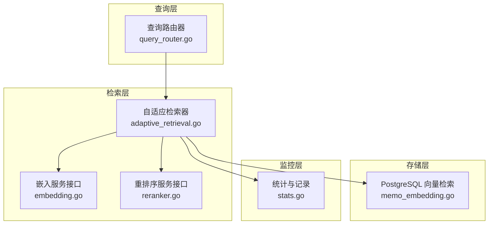
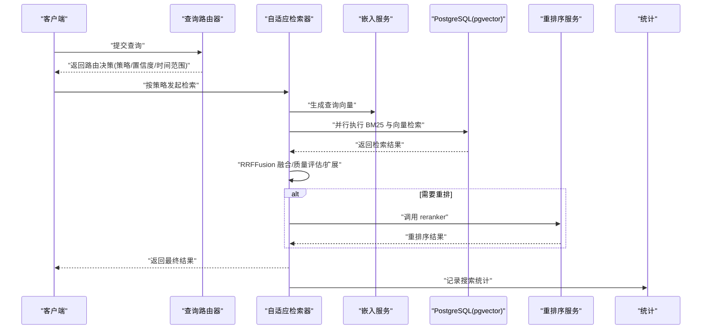
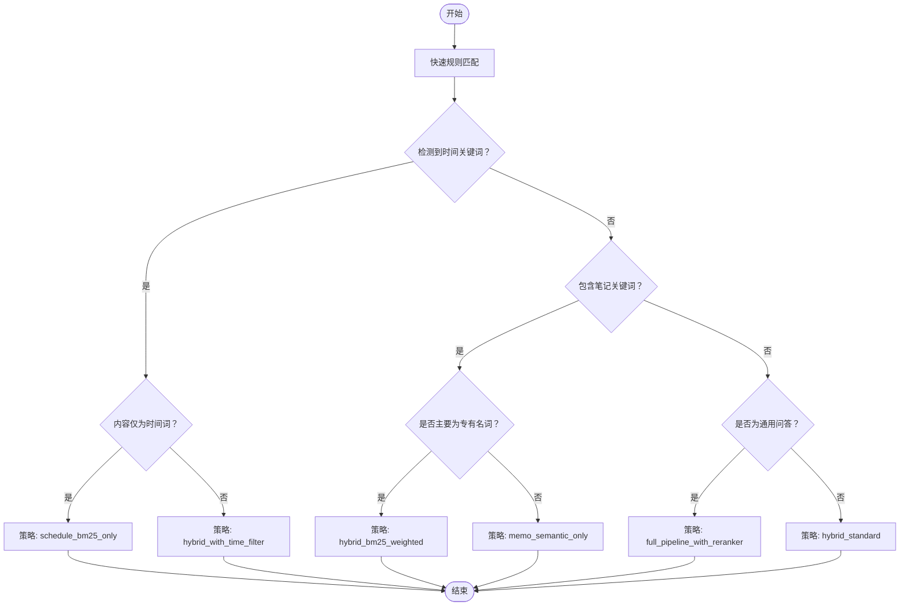
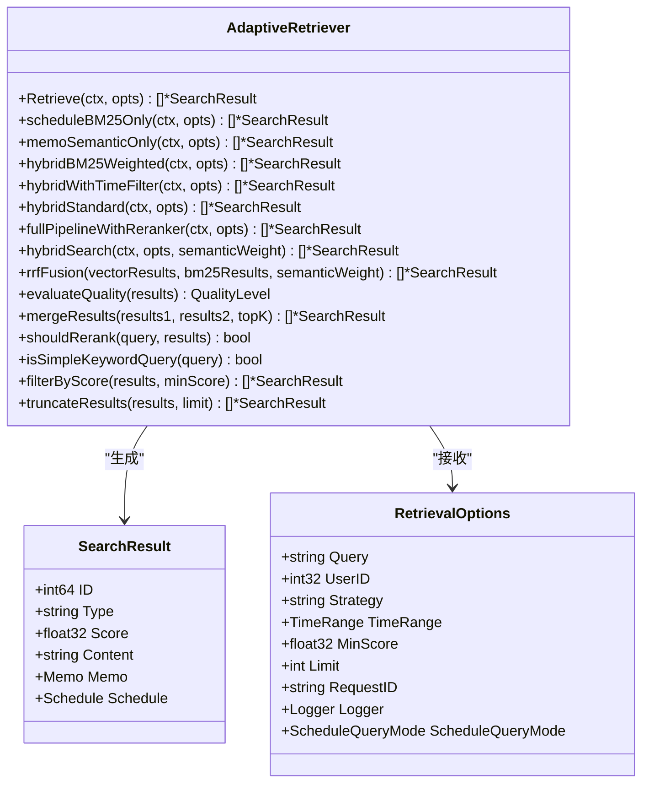
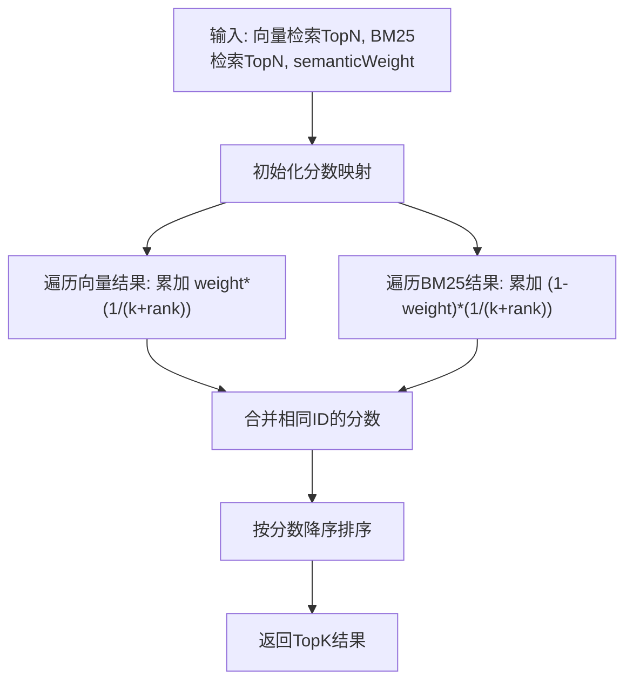
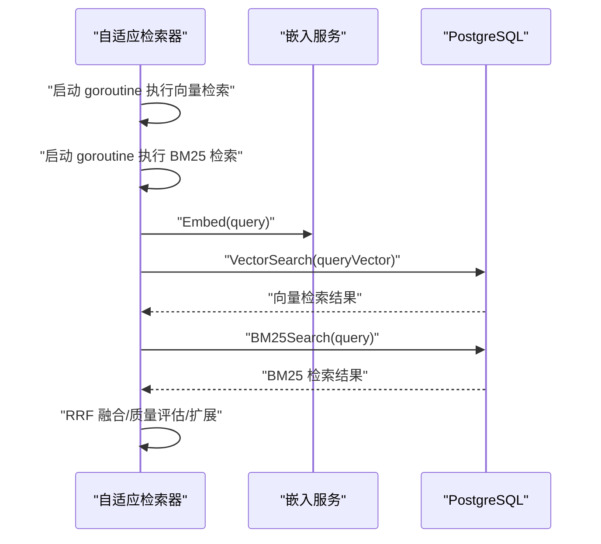
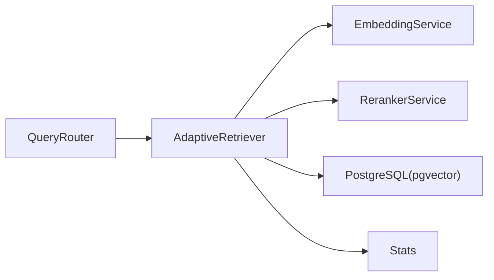

# 自适应检索系统

<cite>
**本文引用的文件**
- [adaptive_retrieval.go](file://server/retrieval/adaptive_retrieval.go)
- [adaptive_retrieval_test.go](file://server/retrieval/adaptive_retrieval_test.go)
- [query_router.go](file://server/queryengine/query_router.go)
- [config.go](file://server/queryengine/config.go)
- [embedding.go](file://plugin/ai/embedding.go)
- [reranker.go](file://plugin/ai/reranker.go)
- [memo_embedding.go](file://store/db/postgres/memo_embedding.go)
- [stats.go](file://server/stats/stats.go)
- [query_router_test.go](file://server/queryengine/query_router_test.go)
</cite>

## 目录
1. [简介](#简介)
2. [项目结构](#项目结构)
3. [核心组件](#核心组件)
4. [架构总览](#架构总览)
5. [详细组件分析](#详细组件分析)
6. [依赖关系分析](#依赖关系分析)
7. [性能考量](#性能考量)
8. [故障排查指南](#故障排查指南)
9. [结论](#结论)
10. [附录](#附录)

## 简介
本技术文档围绕自适应检索系统展开，系统通过“查询复杂度”和“结果质量”双维度动态调整检索策略，结合 BM25 与向量检索的 RRFFusion 融合算法，实现高效、稳定、可扩展的混合检索。文档详细说明了：
- 自适应检索器的策略切换机制与质量评估
- RRFFusion 算法的实现原理与参数调优
- 混合检索策略（BM25 与向量）的权重平衡
- 并发检索优化（并行查询执行与结果合并）
- 质量评估机制与结果扩展逻辑
- 性能监控指标与调优建议（延迟测量、吞吐量优化）
- 实际代码示例路径（展示不同检索策略的实现与切换）

## 项目结构
自适应检索系统主要由以下模块构成：
- 查询路由与决策：根据查询内容自动选择最优检索策略
- 自适应检索器：按策略执行检索、质量评估、结果扩展与融合
- 向量与 BM25 检索：底层数据库与嵌入服务接口
- 重排序服务：可选的 reranker 服务，用于复杂查询的二次排序
- 性能监控：统计与记录检索行为，辅助调优

图表来源
- [query_router.go](file://server/queryengine/query_router.go#L452-L465)
- [adaptive_retrieval.go](file://server/retrieval/adaptive_retrieval.go#L69-L115)
- [embedding.go](file://plugin/ai/embedding.go#L11-L21)
- [reranker.go](file://plugin/ai/reranker.go#L20-L27)
- [memo_embedding.go](file://store/db/postgres/memo_embedding.go#L111-L192)
- [stats.go](file://server/stats/stats.go#L232-L250)

章节来源
- [query_router.go](file://server/queryengine/query_router.go#L1-L120)
- [adaptive_retrieval.go](file://server/retrieval/adaptive_retrieval.go#L1-L120)

## 核心组件
- 查询路由器：基于规则匹配与时间关键词检测，输出路由决策（策略、置信度、时间范围、是否需要重排等）
- 自适应检索器：根据路由决策执行具体检索策略，包含纯日程检索、纯语义检索、混合检索（含 RRFFusion）、完整管线（含 reranker）等
- 向量检索：基于 pgvector 的余弦相似度检索
- 重排序服务：可插拔的 reranker 接口，按需启用
- 性能监控：记录搜索次数、时间等指标，辅助调优

章节来源
- [query_router.go](file://server/queryengine/query_router.go#L452-L552)
- [adaptive_retrieval.go](file://server/retrieval/adaptive_retrieval.go#L69-L115)
- [memo_embedding.go](file://store/db/postgres/memo_embedding.go#L111-L192)
- [reranker.go](file://plugin/ai/reranker.go#L20-L27)
- [stats.go](file://server/stats/stats.go#L232-L250)

## 架构总览
系统采用“路由决策 + 自适应检索 + 底层检索”的分层架构。查询路由器负责快速规则匹配与时间范围解析；自适应检索器根据策略并行执行 BM25 与向量检索，使用 RRFFusion 融合结果，并在必要时调用 reranker 进行二次排序；存储层通过 pgvector 提供高效的向量相似度检索；监控层记录检索行为，支撑性能分析与调优。

图表来源
- [query_router.go](file://server/queryengine/query_router.go#L452-L552)
- [adaptive_retrieval.go](file://server/retrieval/adaptive_retrieval.go#L409-L491)
- [embedding.go](file://plugin/ai/embedding.go#L60-L98)
- [memo_embedding.go](file://store/db/postgres/memo_embedding.go#L111-L192)
- [reranker.go](file://plugin/ai/reranker.go#L59-L126)
- [stats.go](file://server/stats/stats.go#L232-L250)

## 详细组件分析

### 查询路由器（QueryRouter）
- 快速规则匹配：优先检测时间关键词与笔记关键词，快速给出路由决策
- 时间范围解析：支持相对时间（今天/明天/本周/下周等）、绝对日期（YYYY-MM-DD、MM-DD、YYYY年MM月DD日等），并考虑用户时区
- 策略选择：根据是否为纯日程查询、是否包含笔记关键词、是否为通用问答，选择不同的检索策略
- 日程查询模式：区分“标准模式”（相对时间）与“严格模式”（绝对时间），用于日程过滤

图表来源
- [query_router.go](file://server/queryengine/query_router.go#L467-L552)

章节来源
- [query_router.go](file://server/queryengine/query_router.go#L452-L552)
- [query_router_test.go](file://server/queryengine/query_router_test.go#L9-L93)

### 自适应检索器（AdaptiveRetriever）
- 策略入口：Retrieve 根据策略枚举选择具体实现
- 纯日程检索（schedule_bm25_only）：基于时间范围过滤日程，返回高分结果
- 纯语义检索（memo_semantic_only）：先快速检索 Top K，再评估质量，必要时扩展到更大集合
- 混合检索（hybrid_bm25_weighted / hybrid_with_time_filter / hybrid_standard）：并行执行 BM25 与向量检索，使用 RRFFusion 融合
- 完整管线（full_pipeline_with_reranker）：混合检索后，根据查询复杂度与结果分布决定是否调用 reranker
- 质量评估：基于分数差距与阈值判断结果质量，指导是否扩展与是否重排
- 结果合并：去重、按分数排序、截断
- 并发优化：使用 goroutine 并行执行 BM25 与向量检索，通道收集结果，容错处理

图表来源
- [adaptive_retrieval.go](file://server/retrieval/adaptive_retrieval.go#L24-L53)
- [adaptive_retrieval.go](file://server/retrieval/adaptive_retrieval.go#L69-L115)
- [adaptive_retrieval.go](file://server/retrieval/adaptive_retrieval.go#L409-L491)

章节来源
- [adaptive_retrieval.go](file://server/retrieval/adaptive_retrieval.go#L69-L407)
- [adaptive_retrieval_test.go](file://server/retrieval/adaptive_retrieval_test.go#L470-L560)

### RRFFusion 算法与参数调优
- 算法原理：RRF 公式对不同检索系统的排名进行融合，公式为 Σ weight_i / (k + rank_i)，其中 k 为衰减因子（默认 60），rank_i 为文档在第 i 个检索系统中的排名
- 权重平衡：semanticWeight 控制向量检索权重，1 - semanticWeight 控制 BM25 权重；通过 hybridBM25Weighted/hybridStandard/hybridWithTimeFilter 等策略设置不同权重
- 参数调优建议：
  - k 值：保持默认 60，若希望更关注高排名，可适当增大；若希望更平滑融合，可适当减小
  - semanticWeight：在语义主导场景提高权重，在关键词主导场景降低权重
  - 扩展检索：在语义检索质量中等时，适度扩大检索规模以提升召回

图表来源
- [adaptive_retrieval.go](file://server/retrieval/adaptive_retrieval.go#L523-L602)

章节来源
- [adaptive_retrieval.go](file://server/retrieval/adaptive_retrieval.go#L17-L22)
- [adaptive_retrieval.go](file://server/retrieval/adaptive_retrieval.go#L523-L602)
- [adaptive_retrieval_test.go](file://server/retrieval/adaptive_retrieval_test.go#L470-L560)

### 并发检索优化
- 并行执行：hybridSearch 中分别启动 goroutine 执行向量检索与 BM25 检索，使用通道收集结果
- 容错处理：任一检索失败时，回退到另一路检索结果
- 内存优化：预分配切片容量、及时释放大对象引用、截断长文本以减少内存与 API 成本
- 结果合并：去重、按分数排序、截断

图表来源
- [adaptive_retrieval.go](file://server/retrieval/adaptive_retrieval.go#L409-L491)

章节来源
- [adaptive_retrieval.go](file://server/retrieval/adaptive_retrieval.go#L409-L491)

### 质量评估与结果扩展
- 质量评估：基于首两名分数差距与最高分阈值判断高质量/中等质量/低质量
- 结果扩展：在中等质量且限制较大时，扩大检索规模并合并结果
- 重排判定：当结果较多、查询复杂且分数差距不大时，启用 reranker

章节来源
- [adaptive_retrieval.go](file://server/retrieval/adaptive_retrieval.go#L627-L712)
- [adaptive_retrieval.go](file://server/retrieval/adaptive_retrieval.go#L733-L754)

### 混合检索策略与权重平衡
- hybrid_bm25_weighted：BM25 权重更高，适合关键词主导场景
- hybrid_standard：BM25 与向量权重相等，适用于通用场景
- hybrid_with_time_filter：在标准混合基础上增加时间过滤，仅保留日程中落在时间范围内的条目

章节来源
- [adaptive_retrieval.go](file://server/retrieval/adaptive_retrieval.go#L271-L328)
- [adaptive_retrieval.go](file://server/retrieval/adaptive_retrieval.go#L283-L316)

### 完整管线与重排序
- full_pipeline_with_reranker：混合检索后，若满足条件则调用 reranker 服务进行二次排序
- 降级策略：当 reranker 失败时，回退到混合检索结果

章节来源
- [adaptive_retrieval.go](file://server/retrieval/adaptive_retrieval.go#L330-L407)
- [reranker.go](file://plugin/ai/reranker.go#L59-L126)

## 依赖关系分析
- 查询路由器依赖：时间关键词库、停用词、专有名词正则、问题词列表
- 自适应检索器依赖：嵌入服务接口、重排序服务接口、存储层向量检索
- 存储层依赖：pgvector 扩展，提供向量相似度检索
- 监控层：记录搜索次数与时间，辅助性能分析

图表来源
- [query_router.go](file://server/queryengine/query_router.go#L18-L40)
- [adaptive_retrieval.go](file://server/retrieval/adaptive_retrieval.go#L24-L30)
- [memo_embedding.go](file://store/db/postgres/memo_embedding.go#L111-L192)
- [stats.go](file://server/stats/stats.go#L232-L250)

章节来源
- [query_router.go](file://server/queryengine/query_router.go#L18-L40)
- [adaptive_retrieval.go](file://server/retrieval/adaptive_retrieval.go#L24-L30)
- [memo_embedding.go](file://store/db/postgres/memo_embedding.go#L111-L192)
- [stats.go](file://server/stats/stats.go#L232-L250)

## 性能考量
- 并发与容错：hybridSearch 使用 goroutine 并行执行 BM25 与向量检索，任一失败时回退，避免整体阻塞
- 内存优化：预分配切片容量、及时释放大对象引用、截断长文本
- 融合效率：RRF 无需分数归一化，天然支持多信号融合
- 重排成本：仅在复杂查询且分数接近时启用 reranker，避免不必要的 API 调用
- 监控指标：记录搜索次数、时间等，便于定位瓶颈与评估效果

章节来源
- [adaptive_retrieval.go](file://server/retrieval/adaptive_retrieval.go#L409-L491)
- [adaptive_retrieval.go](file://server/retrieval/adaptive_retrieval.go#L330-L407)
- [stats.go](file://server/stats/stats.go#L232-L250)

## 故障排查指南
- 查询超时或失败：检查嵌入服务与 reranker 服务的可用性与超时配置
- 结果质量差：调整 semanticWeight 与 k 值，或在中等质量时扩大检索规模
- 时间范围异常：确认用户时区设置与时间关键词解析逻辑
- 并发问题：确保通道与上下文取消处理正确，避免 goroutine 泄漏

章节来源
- [adaptive_retrieval.go](file://server/retrieval/adaptive_retrieval.go#L409-L491)
- [query_router.go](file://server/queryengine/query_router.go#L677-L800)
- [reranker.go](file://plugin/ai/reranker.go#L59-L126)

## 结论
自适应检索系统通过“查询复杂度 + 结果质量”的双维度自适应策略，结合 RRFFusion 融合与并发检索优化，在保证检索质量的同时显著提升了响应速度与稳定性。配合可配置的 reranker 与完善的监控体系，系统具备良好的可扩展性与运维友好性。建议在生产环境中持续监控关键指标，按业务场景微调权重与阈值，以获得最佳体验。

## 附录
- 配置项参考：时间范围、查询限制、检索限制、评分阈值等
- 测试用例参考：RRF 融合、质量评估、简单查询判断、结果截断与合并等

章节来源
- [config.go](file://server/queryengine/config.go#L7-L104)
- [adaptive_retrieval_test.go](file://server/retrieval/adaptive_retrieval_test.go#L470-L652)
- [query_router_test.go](file://server/queryengine/query_router_test.go#L9-L93)