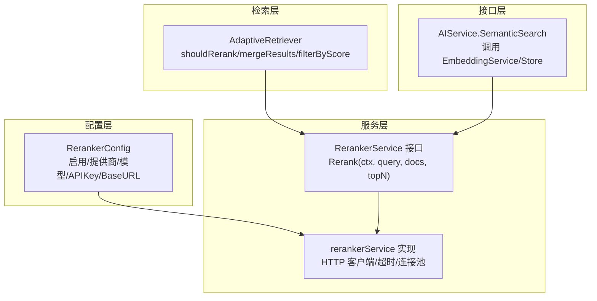
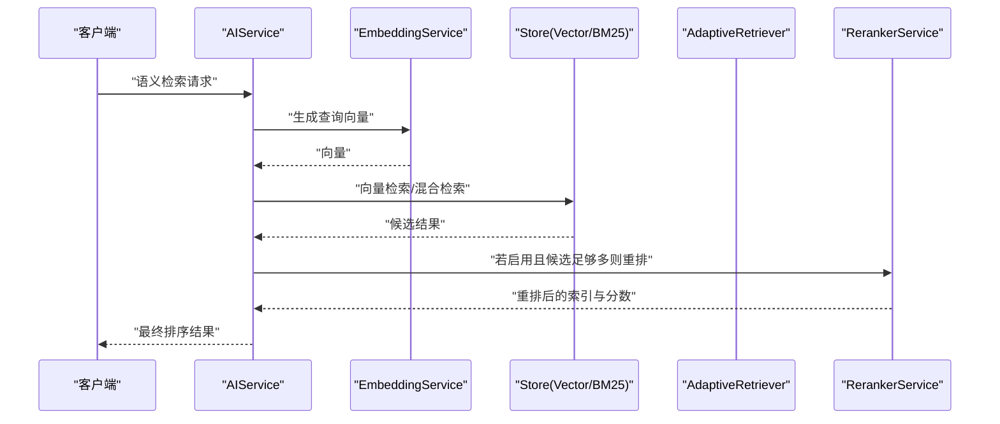
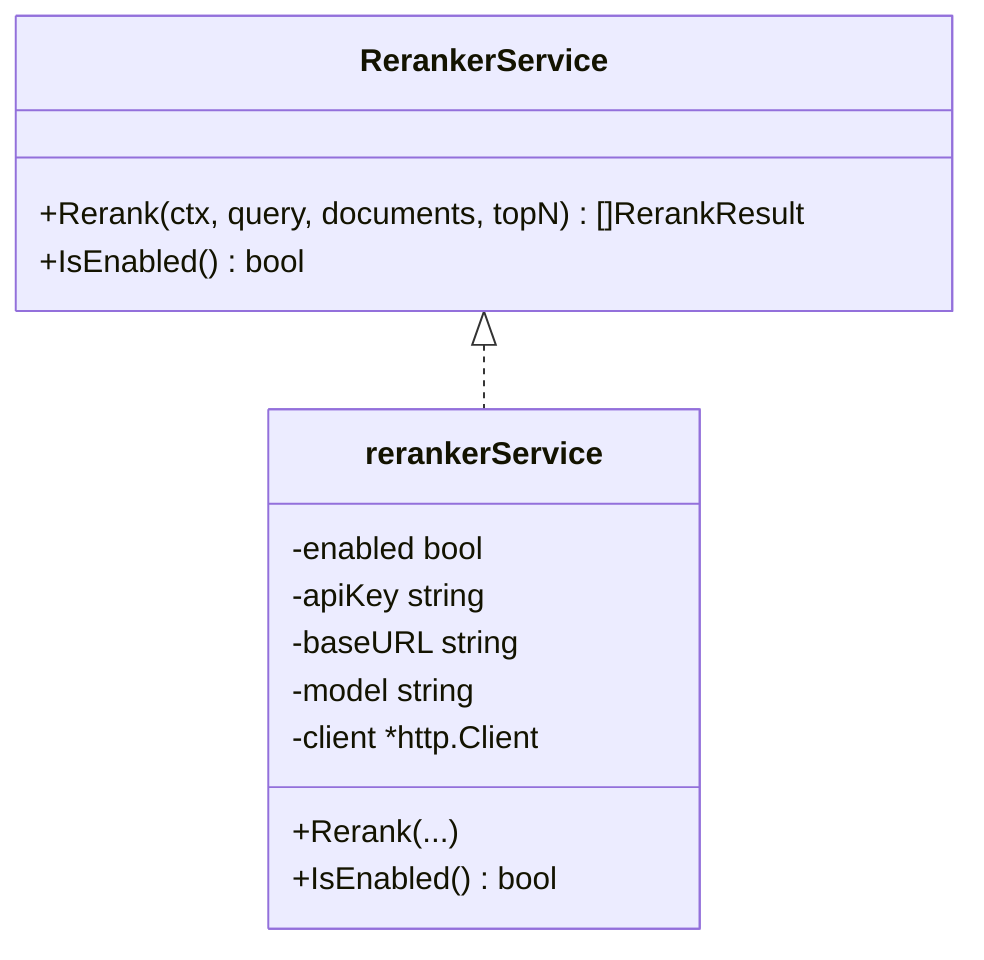
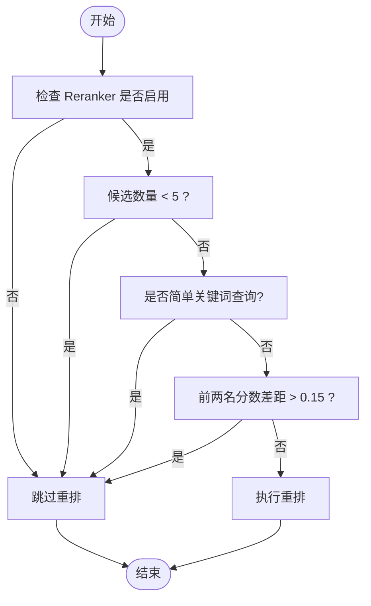
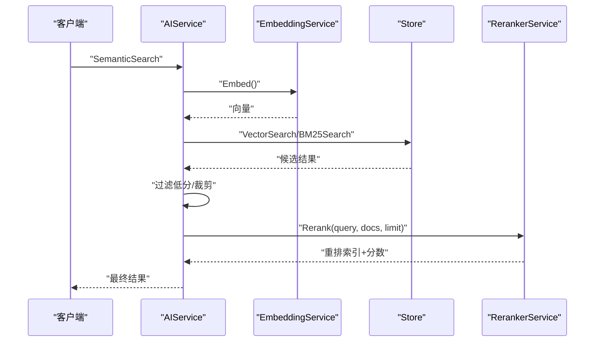
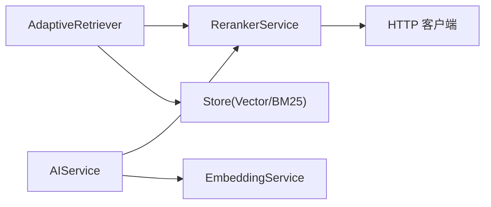
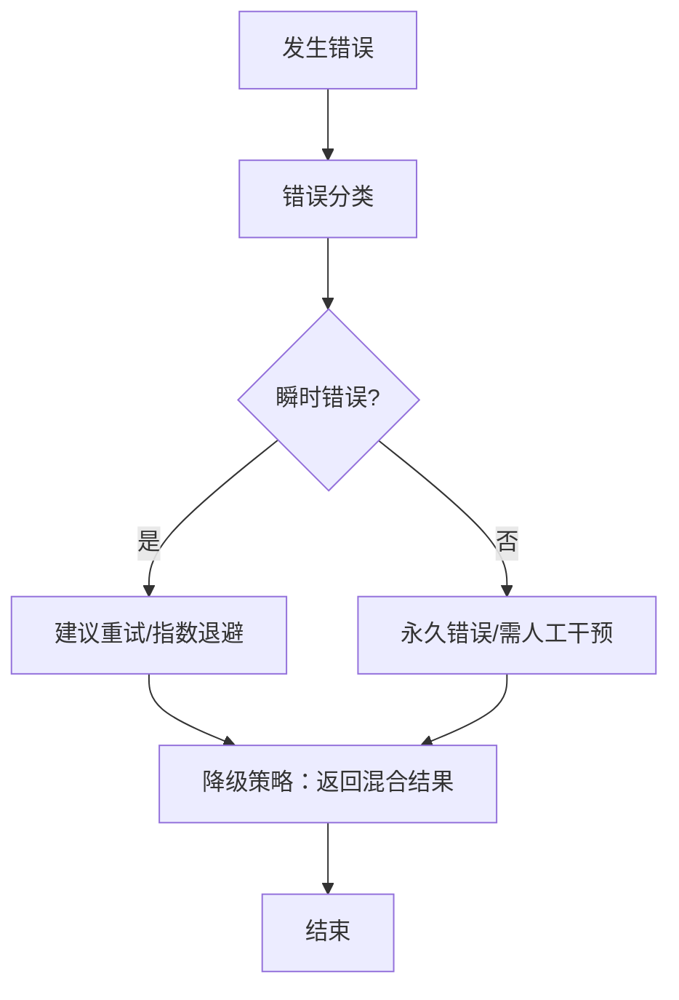

# 重排序服务

<cite>
**本文引用的文件**
- [plugin/ai/reranker.go](file://plugin/ai/reranker.go)
- [plugin/ai/reranker_test.go](file://plugin/ai/reranker_test.go)
- [plugin/ai/config.go](file://plugin/ai/config.go)
- [plugin/ai/embedding.go](file://plugin/ai/embedding.go)
- [server/retrieval/adaptive_retrieval.go](file://server/retrieval/adaptive_retrieval.go)
- [server/router/api/v1/ai_service_semantic.go](file://server/router/api/v1/ai_service_semantic.go)
- [server/queryengine/config.go](file://server/queryengine/config.go)
- [plugin/ai/agent/error_class.go](file://plugin/ai/agent/error_class.go)
- [server/router/api/v1/connect_interceptors.go](file://server/router/api/v1/connect_interceptors.go)
</cite>

## 目录
1. [简介](#简介)
2. [项目结构](#项目结构)
3. [核心组件](#核心组件)
4. [架构总览](#架构总览)
5. [详细组件分析](#详细组件分析)
6. [依赖关系分析](#依赖关系分析)
7. [性能考量](#性能考量)
8. [故障排查指南](#故障排查指南)
9. [结论](#结论)
10. [附录](#附录)

## 简介
本文件系统化梳理“重排序服务”的实现与使用，重点覆盖：
- 重排序算法与相关性评分机制
- 服务配置与性能参数
- 并发处理能力与吞吐优化
- 结果质量评估与阈值设定
- 错误处理与降级策略
- 监控指标与调优建议
- 与不同 LLM 提供商的集成与兼容性

## 项目结构
围绕重排序服务的关键模块分布如下：
- 配置层：定义重排序器的启用开关、提供商、模型、密钥与基础地址
- 服务层：封装重排序器接口与实现，负责调用外部 rerank API 并返回排序结果
- 检索层：在混合检索与自适应检索流程中按需触发重排序，并进行降级与质量评估
- 接口层：对外提供语义检索 API，按条件调用重排序器并对结果进行二次排序
- 错误分类与拦截：对网络/超时等瞬时错误进行分类与降级处理

**图表来源**
- [plugin/ai/config.go](file://plugin/ai/config.go#L27-L34)
- [plugin/ai/reranker.go](file://plugin/ai/reranker.go#L20-L57)
- [server/retrieval/adaptive_retrieval.go](file://server/retrieval/adaptive_retrieval.go#L686-L712)
- [server/router/api/v1/ai_service_semantic.go](file://server/router/api/v1/ai_service_semantic.go#L88-L105)

**章节来源**
- [plugin/ai/config.go](file://plugin/ai/config.go#L27-L34)
- [plugin/ai/reranker.go](file://plugin/ai/reranker.go#L20-L57)
- [server/retrieval/adaptive_retrieval.go](file://server/retrieval/adaptive_retrieval.go#L686-L712)
- [server/router/api/v1/ai_service_semantic.go](file://server/router/api/v1/ai_service_semantic.go#L88-L105)

## 核心组件
- 重排序器接口与实现
  - 接口定义：提供重排序能力与启用状态查询
  - 实现要点：HTTP 客户端配置（超时、连接池）、禁用时的回退策略、调用外部 rerank API 的请求构建与响应解析
- 配置
  - RerankerConfig：启用开关、提供商、模型、API 密钥、基础地址
- 检索器中的重排序决策
  - shouldRerank：基于结果数量、查询复杂度、分数差距等规则决定是否需要重排
  - 降级策略：当重排序失败时，返回混合检索结果
- 接口层调用
  - AIService.SemanticSearch：在满足条件时对候选结果进行重排序

**章节来源**
- [plugin/ai/reranker.go](file://plugin/ai/reranker.go#L14-L126)
- [plugin/ai/config.go](file://plugin/ai/config.go#L27-L34)
- [server/retrieval/adaptive_retrieval.go](file://server/retrieval/adaptive_retrieval.go#L686-L712)
- [server/router/api/v1/ai_service_semantic.go](file://server/router/api/v1/ai_service_semantic.go#L88-L105)

## 架构总览
重排序服务在系统中的位置与交互如下：

**图表来源**
- [server/router/api/v1/ai_service_semantic.go](file://server/router/api/v1/ai_service_semantic.go#L16-L131)
- [plugin/ai/embedding.go](file://plugin/ai/embedding.go#L30-L58)
- [server/retrieval/adaptive_retrieval.go](file://server/retrieval/adaptive_retrieval.go#L330-L407)

## 详细组件分析

### 重排序器接口与实现
- 接口职责
  - Rerank(ctx, query, documents, topN)：按相关性对文档进行重排
  - IsEnabled()：判断服务是否启用
- 实现要点
  - 禁用时回退：返回原顺序，分数略作衰减，保证稳定性
  - 启用时调用外部 rerank API：构造 JSON 请求体，设置 Authorization 与 Content-Type，解析响应并按 relevance_score 降序排序
  - HTTP 客户端配置：超时、连接池参数，便于吞吐与资源控制
- 错误处理
  - 禁用时的回退逻辑确保功能可用
  - 启用时对非 200 响应与解码失败进行错误返回

**图表来源**
- [plugin/ai/reranker.go](file://plugin/ai/reranker.go#L20-L57)

**章节来源**
- [plugin/ai/reranker.go](file://plugin/ai/reranker.go#L59-L126)

### 配置与提供商兼容性
- 配置结构
  - RerankerConfig：Enabled、Provider、Model、APIKey、BaseURL
- 提供商与兼容性
  - SiliconFlow：兼容 OpenAI 风格 API，可通过 BaseURL 指定
  - OpenAI：标准 OpenAI Embedding API
  - Ollama：本地推理，无需 API Key
- 配置来源
  - 从 Profile 动态装配，支持按提供商设置 BaseURL 与密钥

**章节来源**
- [plugin/ai/config.go](file://plugin/ai/config.go#L27-L34)
- [plugin/ai/config.go](file://plugin/ai/config.go#L46-L103)

### 检索流程中的重排序决策
- shouldRerank 规则
  - 结果数量不足（<5）不重排
  - 简单关键词查询不重排
  - 前两名分数差距较大（>0.15）不重排
  - 其余情况触发重排
- 降级策略
  - 重排序失败时返回混合检索结果，保证可用性
- 质量评估
  - 基于分数差距与最高分阈值，将质量分为低/中/高三级，指导是否扩展检索

**图表来源**
- [server/retrieval/adaptive_retrieval.go](file://server/retrieval/adaptive_retrieval.go#L686-L712)

**章节来源**
- [server/retrieval/adaptive_retrieval.go](file://server/retrieval/adaptive_retrieval.go#L686-L712)
- [server/retrieval/adaptive_retrieval.go](file://server/retrieval/adaptive_retrieval.go#L627-L655)

### 接口层调用与结果重排
- AIService.SemanticSearch
  - 参数校验与限制
  - 向量检索与过滤（阈值 0.5）
  - 满足条件时调用 RerankerService.Rerank
  - 依据重排结果重建输出

**图表来源**
- [server/router/api/v1/ai_service_semantic.go](file://server/router/api/v1/ai_service_semantic.go#L16-L131)

**章节来源**
- [server/router/api/v1/ai_service_semantic.go](file://server/router/api/v1/ai_service_semantic.go#L51-L105)

### 与嵌入服务的协作
- 嵌入服务提供统一的 Embed/EmbedBatch 接口，兼容 SiliconFlow/OpenAI/Ollama
- 重排序服务依赖嵌入服务生成查询向量，再进行向量检索与混合检索

**章节来源**
- [plugin/ai/embedding.go](file://plugin/ai/embedding.go#L11-L58)

## 依赖关系分析
- 组件耦合
  - AdaptiveRetriever 依赖 RerankerService 接口，便于替换实现与测试
  - AIService 在满足条件时依赖 RerankerService，形成清晰的调用链
- 外部依赖
  - HTTP 客户端用于调用外部 rerank API
  - 存储层提供向量与 BM25 检索能力
- 潜在循环依赖
  - 未见直接循环；接口抽象避免了紧耦合

**图表来源**
- [server/retrieval/adaptive_retrieval.go](file://server/retrieval/adaptive_retrieval.go#L24-L66)
- [server/router/api/v1/ai_service_semantic.go](file://server/router/api/v1/ai_service_semantic.go#L16-L131)
- [plugin/ai/reranker.go](file://plugin/ai/reranker.go#L38-L52)

**章节来源**
- [server/retrieval/adaptive_retrieval.go](file://server/retrieval/adaptive_retrieval.go#L24-L66)
- [server/router/api/v1/ai_service_semantic.go](file://server/router/api/v1/ai_service_semantic.go#L16-L131)
- [plugin/ai/reranker.go](file://plugin/ai/reranker.go#L38-L52)

## 性能考量
- 并发与吞吐
  - HTTP 客户端配置了连接池参数与超时，有助于提升并发下的稳定性和吞吐
  - 检索层采用并行执行向量与 BM25 检索，减少整体延迟
- 重排序触发策略
  - 通过 shouldRerank 规则减少不必要的重排序，降低 API 调用与成本
- 内存与资源
  - 在重排序前对文档长度进行限制，避免过长文本带来的内存与 API 成本压力
  - 重排序完成后及时清空临时数组，便于 GC 回收

**章节来源**
- [plugin/ai/reranker.go](file://plugin/ai/reranker.go#L44-L51)
- [server/retrieval/adaptive_retrieval.go](file://server/retrieval/adaptive_retrieval.go#L409-L491)
- [server/retrieval/adaptive_retrieval.go](file://server/retrieval/adaptive_retrieval.go#L360-L371)
- [server/retrieval/adaptive_retrieval.go](file://server/retrieval/adaptive_retrieval.go#L400-L405)

## 故障排查指南
- 常见错误类型与分类
  - 网络类错误（如连接失败、超时）：归类为瞬时错误，建议重试
  - 超时错误：明确的超时提示，建议缩短请求或优化上游
  - 冲突/权限类错误：建议检查鉴权与配额
- 降级与恢复
  - 重排序失败时返回混合检索结果，保证功能可用
  - 接口层对非 200 响应进行错误包装，便于前端展示
- 日志与追踪
  - 检索器记录请求 ID、策略、质量等级、过滤阈值等关键信息，便于定位问题

**图表来源**
- [plugin/ai/agent/error_class.go](file://plugin/ai/agent/error_class.go#L84-L149)
- [server/retrieval/adaptive_retrieval.go](file://server/retrieval/adaptive_retrieval.go#L374-L382)
- [server/router/api/v1/connect_interceptors.go](file://server/router/api/v1/connect_interceptors.go#L136-L158)

**章节来源**
- [plugin/ai/agent/error_class.go](file://plugin/ai/agent/error_class.go#L84-L149)
- [server/retrieval/adaptive_retrieval.go](file://server/retrieval/adaptive_retrieval.go#L374-L382)
- [server/router/api/v1/connect_interceptors.go](file://server/router/api/v1/connect_interceptors.go#L136-L158)

## 结论
重排序服务通过“按需触发 + 降级保障”的策略，在保证用户体验的同时有效控制成本与延迟。其接口抽象与配置灵活性使其易于适配不同提供商，并与嵌入与检索子系统无缝协作。

## 附录

### 配置选项与性能参数
- 重排序器配置
  - Enabled：是否启用
  - Provider：提供商（siliconflow/openai/ollama）
  - Model：模型名称
  - APIKey/BaseURL：认证与服务地址
- 检索与评分配置
  - EnableReranker：是否启用重排序
  - High/MediumQualityThreshold：质量阈值
  - ScoreGapThreshold：分数差距阈值
  - MinRerankResults：最小重排结果数
  - MaxDocLength：文档最大长度（字符）

**章节来源**
- [plugin/ai/config.go](file://plugin/ai/config.go#L27-L34)
- [server/queryengine/config.go](file://server/queryengine/config.go#L43-L72)

### 与不同 LLM 提供商的集成与兼容性
- SiliconFlow：兼容 OpenAI 风格 API，通过 BaseURL 指定
- OpenAI：标准 Embedding API
- Ollama：本地推理，无需 API Key

**章节来源**
- [plugin/ai/embedding.go](file://plugin/ai/embedding.go#L33-L49)
- [plugin/ai/config.go](file://plugin/ai/config.go#L63-L72)

### 实际调用示例（路径指引）
- 重排序服务创建与调用
  - [NewRerankerService](file://plugin/ai/reranker.go#L38-L52)
  - [Rerank](file://plugin/ai/reranker.go#L59-L126)
- 检索器中的重排序决策
  - [shouldRerank](file://server/retrieval/adaptive_retrieval.go#L686-L712)
  - [fullPipelineWithReranker](file://server/retrieval/adaptive_retrieval.go#L330-L407)
- 接口层调用
  - [SemanticSearch](file://server/router/api/v1/ai_service_semantic.go#L16-L131)