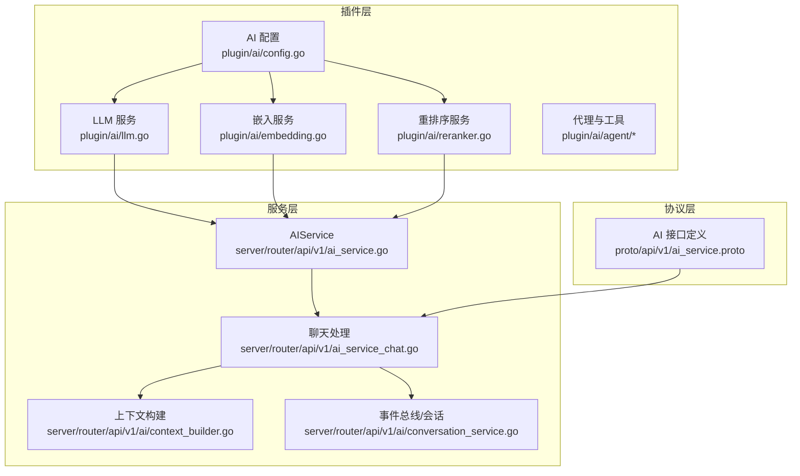
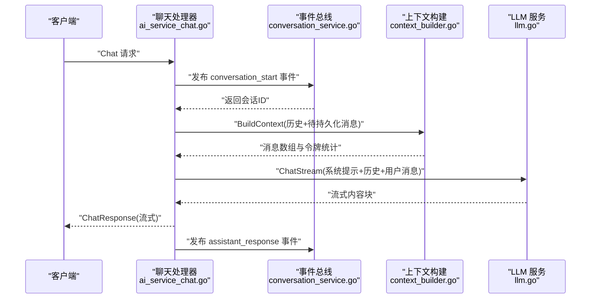
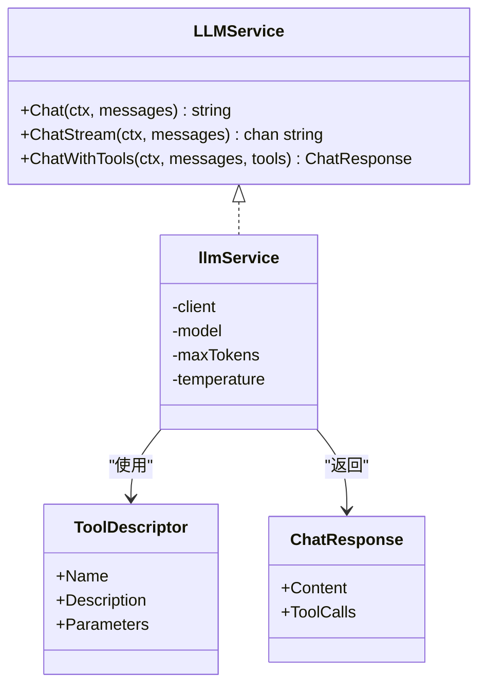
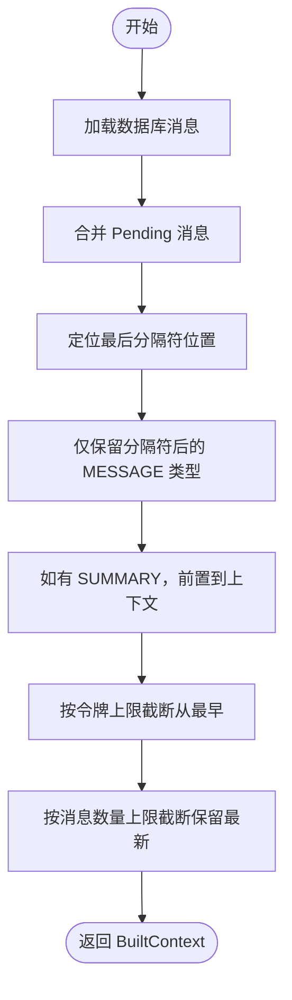
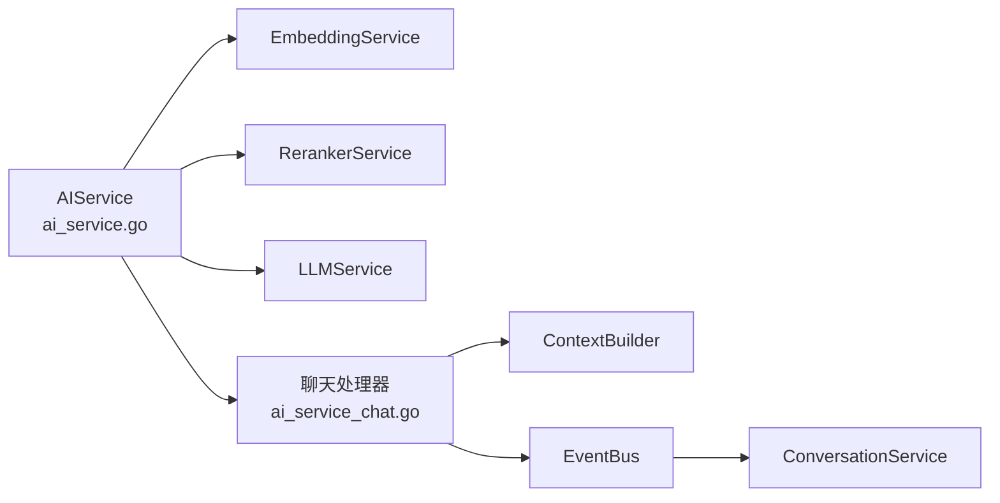

# 大语言模型服务

<cite>
**本文引用的文件**
- [plugin/ai/llm.go](file://plugin/ai/llm.go)
- [server/ai/provider.go](file://server/ai/provider.go)
- [plugin/ai/config.go](file://plugin/ai/config.go)
- [proto/api/v1/ai_service.proto](file://proto/api/v1/ai_service.proto)
- [server/router/api/v1/ai_service.go](file://server/router/api/v1/ai_service.go)
- [server/router/api/v1/ai_service_chat.go](file://server/router/api/v1/ai_service_chat.go)
- [server/router/api/v1/ai/context_builder.go](file://server/router/api/v1/ai/context_builder.go)
- [server/router/api/v1/ai/conversation_service.go](file://server/router/api/v1/ai/conversation_service.go)
- [plugin/ai/embedding.go](file://plugin/ai/embedding.go)
- [plugin/ai/reranker.go](file://plugin/ai/reranker.go)
- [plugin/ai/agent/types.go](file://plugin/ai/agent/types.go)
- [plugin/ai/agent/base_tool.go](file://plugin/ai/agent/base_tool.go)
- [docs/dev-guides/AI_SERVICE_REFACTOR.md](file://docs/dev-guides/AI_SERVICE_REFACTOR.md)
- [README.md](file://README.md)
</cite>

## 目录
1. [简介](#简介)
2. [项目结构](#项目结构)
3. [核心组件](#核心组件)
4. [架构总览](#架构总览)
5. [详细组件分析](#详细组件分析)
6. [依赖关系分析](#依赖关系分析)
7. [性能考量](#性能考量)
8. [故障排查指南](#故障排查指南)
9. [结论](#结论)
10. [附录](#附录)

## 简介
本文件面向“大语言模型服务”的综合文档，围绕统一的 LLM 抽象接口、多提供商集成（OpenAI 兼容与本地 Ollama）、流式响应与错误恢复、提示词工程最佳实践、成本控制与性能监控等主题进行系统化梳理。文档基于仓库现有实现，结合协议定义与后端路由层，给出可操作的设计与落地建议。

## 项目结构
该服务位于后端 Go 代码中，核心模块分布如下：
- 插件层（plugin/ai）：LLM、嵌入、重排序、代理与工具等能力抽象与实现
- 服务层（server/router/api/v1/ai）：会话上下文构建、事件总线、对话持久化、路由与处理器
- 协议层（proto/api/v1/ai_service.proto）：AI 相关 gRPC/HTTP 接口定义
- 配置层（plugin/ai/config.go）：统一的 AI 配置结构与校验
- 顶层服务（server/router/api/v1/ai_service.go）：AIService 聚合嵌入、重排序与 LLM 能力

图示来源
- [plugin/ai/llm.go](file://plugin/ai/llm.go#L1-L326)
- [plugin/ai/embedding.go](file://plugin/ai/embedding.go#L1-L103)
- [plugin/ai/reranker.go](file://plugin/ai/reranker.go#L1-L127)
- [plugin/ai/config.go](file://plugin/ai/config.go#L1-L129)
- [server/router/api/v1/ai_service.go](file://server/router/api/v1/ai_service.go#L1-L74)
- [server/router/api/v1/ai/context_builder.go](file://server/router/api/v1/ai/context_builder.go#L1-L285)
- [server/router/api/v1/ai/conversation_service.go](file://server/router/api/v1/ai/conversation_service.go#L1-L465)
- [server/router/api/v1/ai_service_chat.go](file://server/router/api/v1/ai_service_chat.go#L1-L296)
- [proto/api/v1/ai_service.proto](file://proto/api/v1/ai_service.proto#L1-L371)

章节来源
- [README.md](file://README.md#L296-L340)

## 核心组件
- LLM 服务抽象与实现：统一 Chat/ChatStream 接口，支持 DeepSeek、OpenAI、SiliconFlow 等 OpenAI 兼容提供商；支持工具调用（函数式工具）
- 嵌入与重排序：OpenAI/SiliconFlow 嵌入，SiliconFlow 重排序
- AI 配置：集中管理提供商、模型、密钥、基础地址、最大令牌数、温度等
- 会话与上下文：事件驱动的会话持久化、上下文窗口裁剪、分隔符与摘要
- 协议与路由：gRPC/HTTP 接口定义、聊天路由与处理器

章节来源
- [plugin/ai/llm.go](file://plugin/ai/llm.go#L20-L326)
- [plugin/ai/config.go](file://plugin/ai/config.go#L9-L129)
- [plugin/ai/embedding.go](file://plugin/ai/embedding.go#L11-L103)
- [plugin/ai/reranker.go](file://plugin/ai/reranker.go#L20-L127)
- [server/router/api/v1/ai/context_builder.go](file://server/router/api/v1/ai/context_builder.go#L51-L224)
- [server/router/api/v1/ai/conversation_service.go](file://server/router/api/v1/ai/conversation_service.go#L20-L207)
- [proto/api/v1/ai_service.proto](file://proto/api/v1/ai_service.proto#L13-L110)

## 架构总览
整体采用“协议定义 + 服务聚合 + 事件驱动 + 上下文管理”的架构：
- 协议层定义 Chat、会话列表、消息列表等接口
- 服务层聚合嵌入、重排序与 LLM 能力，负责路由与处理器
- 事件总线负责会话生命周期事件（开始、用户消息、助手回复、分隔符）
- 上下文构建器负责消息过滤、令牌限制与摘要注入

图示来源
- [server/router/api/v1/ai_service_chat.go](file://server/router/api/v1/ai_service_chat.go#L58-L206)
- [server/router/api/v1/ai/conversation_service.go](file://server/router/api/v1/ai/conversation_service.go#L106-L207)
- [server/router/api/v1/ai/context_builder.go](file://server/router/api/v1/ai/context_builder.go#L95-L224)
- [plugin/ai/llm.go](file://plugin/ai/llm.go#L198-L269)

## 详细组件分析

### LLM 服务抽象与实现
- 接口设计
  - 同步对话：Chat
  - 流式对话：ChatStream
  - 工具调用：ChatWithTools（函数式工具）
- 多提供商支持
  - OpenAI 兼容：DeepSeek、OpenAI、SiliconFlow
  - 本地部署：Ollama（配置中体现）
- 参数标准化
  - 模型、最大令牌数、温度等通过配置注入
  - 消息角色映射到 OpenAI 角色
- 工具调用
  - ToolDescriptor -> openai.Tool
  - ChatWithTools 返回 ChatResponse，包含内容与工具调用列表

图示来源
- [plugin/ai/llm.go](file://plugin/ai/llm.go#L20-L326)

章节来源
- [plugin/ai/llm.go](file://plugin/ai/llm.go#L20-L326)

### 嵌入与重排序服务
- 嵌入服务
  - 支持 OpenAI 与 SiliconFlow
  - 维度可配置，批量嵌入
- 重排序服务
  - SiliconFlow Rerank API
  - 可禁用，禁用时按原始顺序返回

章节来源
- [plugin/ai/embedding.go](file://plugin/ai/embedding.go#L11-L103)
- [plugin/ai/reranker.go](file://plugin/ai/reranker.go#L20-L127)

### AI 配置与提供商
- 配置结构
  - Enabled、Embedding、Reranker、LLM
  - Provider、Model、APIKey、BaseURL、MaxTokens、Temperature
- 默认值与环境变量
  - Provider 默认 OpenAI，模型默认 gpt-4o-mini，嵌入默认 text-embedding-3-small
  - 支持从环境变量加载
- 校验
  - 必填项校验，非 Ollama 场景需 API Key

章节来源
- [plugin/ai/config.go](file://plugin/ai/config.go#L9-L129)
- [server/ai/provider.go](file://server/ai/provider.go#L14-L73)

### 会话与上下文管理
- 事件总线
  - conversation_start、user_message、assistant_response、separator
  - 并发监听器，超时控制，结果收集
- 会话持久化
  - 临时会话与固定会话（按用户ID+代理类型位运算）
  - 分离消息与摘要消息，摘要前置到 LLM 上下文
- 上下文构建
  - 基于最后分隔符过滤消息
  - 令牌计数估算与截断（从最早消息开始）
  - 支持 Pending 消息（事件总线异步持久化导致的竞态）

图示来源
- [server/router/api/v1/ai/context_builder.go](file://server/router/api/v1/ai/context_builder.go#L95-L224)

章节来源
- [server/router/api/v1/ai/conversation_service.go](file://server/router/api/v1/ai/conversation_service.go#L20-L207)
- [server/router/api/v1/ai/context_builder.go](file://server/router/api/v1/ai/context_builder.go#L51-L224)

### 代理与工具
- 代理接口
  - ParrotAgent：Name、ExecuteWithCallback、SelfDescribe
  - 事件类型：thinking、tool_use、tool_result、answer、error、以及 UI 工具事件
- 工具基座
  - BaseTool：Name、Description、Run（含超时、输入校验、结果校验）
  - ToolRegistry：注册、列举、描述
- 事件回调与流式输出
  - ParrotStream/Adapter：Send/Close
  - 通过事件类型与数据结构向客户端流式输出

章节来源
- [plugin/ai/agent/types.go](file://plugin/ai/agent/types.go#L10-L353)
- [plugin/ai/agent/base_tool.go](file://plugin/ai/agent/base_tool.go#L10-L251)

### 协议与路由
- Chat 接口
  - 支持历史消息、时区、代理类型、会话持久化开关
  - 流式返回 ChatResponse，包含最终意图与查询结果
- 会话管理
  - 列表、详情、创建、更新、删除、添加分隔符、增量拉取消息
- Schedule Agent
  - Chat（非流式）、ChatStream（事件流）

章节来源
- [proto/api/v1/ai_service.proto](file://proto/api/v1/ai_service.proto#L13-L130)
- [server/router/api/v1/ai_service.go](file://server/router/api/v1/ai_service.go#L20-L74)
- [server/router/api/v1/ai_service_chat.go](file://server/router/api/v1/ai_service_chat.go#L58-L206)

## 依赖关系分析
- AIService 聚合
  - EmbeddingService、RerankerService、LLMService
  - AdaptiveRetriever（检索器，用于 RAG）
- 事件驱动
  - EventBus 订阅 ConversationService，实现会话生命周期管理
- 上下文与会话
  - ContextBuilder 从存储加载消息，结合 Pending 消息与分隔符
  - ConversationService 写入消息与分隔符，计算固定会话ID

图示来源
- [server/router/api/v1/ai_service.go](file://server/router/api/v1/ai_service.go#L20-L43)
- [server/router/api/v1/ai_service_chat.go](file://server/router/api/v1/ai_service_chat.go#L18-L56)
- [server/router/api/v1/ai/context_builder.go](file://server/router/api/v1/ai/context_builder.go#L62-L86)
- [server/router/api/v1/ai/conversation_service.go](file://server/router/api/v1/ai/conversation_service.go#L209-L228)

章节来源
- [server/router/api/v1/ai_service.go](file://server/router/api/v1/ai_service.go#L20-L74)

## 性能考量
- 令牌计数与上下文裁剪
  - 使用字符数粗估令牌数，按令牌上限从最早消息截断，避免越界
  - 支持消息数量上限，保留最新消息
- 流式响应
  - ChatStream 逐块推送，减少首字节延迟
  - EOF 与 FinishReason 标记结束，确保通道正确关闭
- 重试与超时
  - Provider 层 doWithRetry 指数回退
  - LLM 层统一 5 分钟超时保护
- 速率限制
  - AIService 全局限流器按用户维度控制并发

章节来源
- [server/router/api/v1/ai/context_builder.go](file://server/router/api/v1/ai/context_builder.go#L24-L37)
- [server/router/api/v1/ai/context_builder.go](file://server/router/api/v1/ai/context_builder.go#L250-L283)
- [plugin/ai/llm.go](file://plugin/ai/llm.go#L198-L269)
- [server/ai/provider.go](file://server/ai/provider.go#L177-L200)
- [server/router/api/v1/ai_service.go](file://server/router/api/v1/ai_service.go#L17-L19)

## 故障排查指南
- 常见错误与恢复
  - LLM 调用失败：检查 API Key、BaseURL、模型名；启用指数回退重试
  - 流式接收错误：区分 EOF 与异常，记录已接收块数，优雅关闭通道
  - 会话持久化：监听器超时或崩溃会被捕获并记录，不影响主流程
- 日志与可观测性
  - 统一日志字段：组件、用户ID、代理类型、耗时、块数等
  - 建议在 Chat/Agent 执行前后打点，便于定位瓶颈
- 配置校验
  - 非 Ollama 场景需提供 API Key
  - Provider 校验嵌入可用性，失败即刻暴露

章节来源
- [plugin/ai/llm.go](file://plugin/ai/llm.go#L217-L243)
- [server/router/api/v1/ai/conversation_service.go](file://server/router/api/v1/ai/conversation_service.go#L136-L207)
- [plugin/ai/config.go](file://plugin/ai/config.go#L105-L129)
- [server/ai/provider.go](file://server/ai/provider.go#L158-L175)

## 结论
本项目通过统一的 LLM 抽象接口与 OpenAI 兼容生态，实现了跨提供商的灵活切换；配合事件驱动的会话管理、上下文裁剪与流式输出，满足了多代理协作与实时交互的需求。建议在生产环境中：
- 明确令牌计费与响应时间阈值，结合上下文裁剪与重试策略
- 在前端侧实现合理的流式渲染与错误提示
- 通过日志与指标持续监控关键路径（LLM 调用、会话持久化、上下文构建）

## 附录

### 提示词工程最佳实践
- 上下文构建
  - 使用分隔符隔离无关上下文，必要时前置摘要
  - 控制令牌总量与消息条数，优先保留最新、最相关的对话
- 指令优化
  - 明确角色与任务边界，避免歧义
  - 在工具调用场景，提供工具签名与期望输出格式
- 时区与时序
  - 明确用户时区，避免时间解析偏差

章节来源
- [server/router/api/v1/ai/context_builder.go](file://server/router/api/v1/ai/context_builder.go#L144-L178)
- [server/router/api/v1/ai_service_chat.go](file://server/router/api/v1/ai_service_chat.go#L84-L86)

### 成本控制与性能监控策略
- 成本控制
  - 严格控制上下文长度（令牌上限）
  - 选择合适模型与温度，避免不必要的高算力消耗
- 性能监控
  - 记录 LLM 调用耗时、流式块数、错误率
  - 会话持久化耗时与事件监听器超时统计

章节来源
- [docs/dev-guides/AI_SERVICE_REFACTOR.md](file://docs/dev-guides/AI_SERVICE_REFACTOR.md#L221-L306)