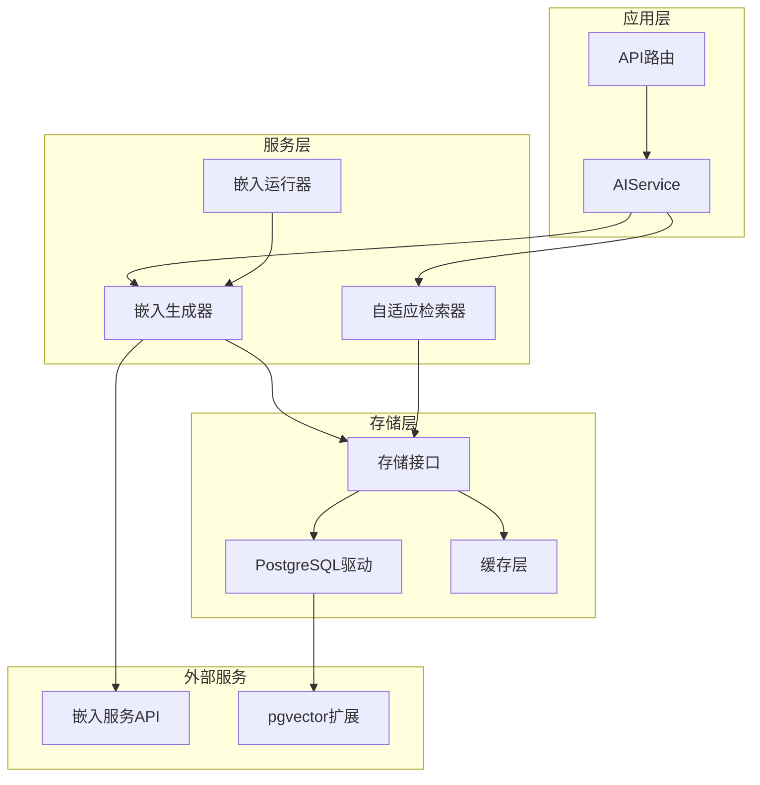
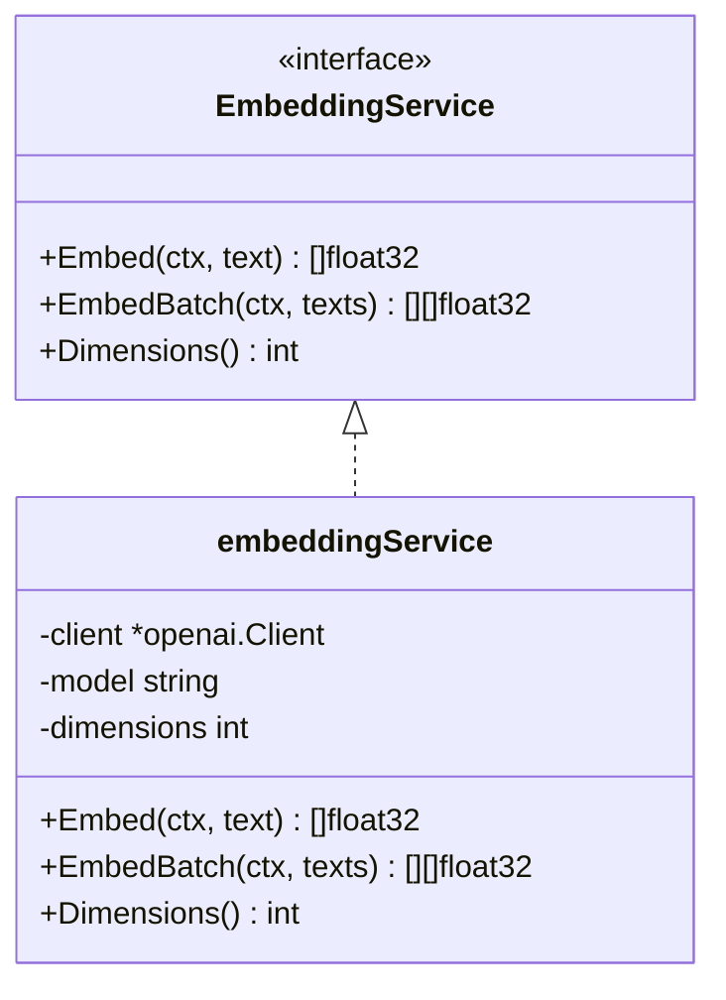
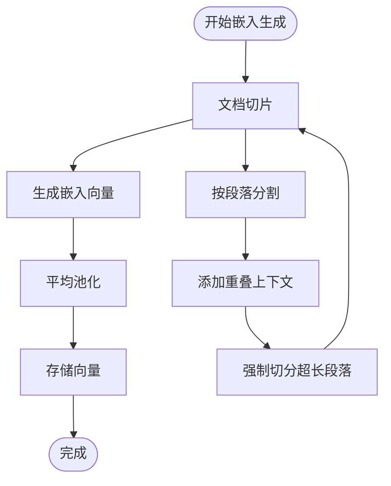
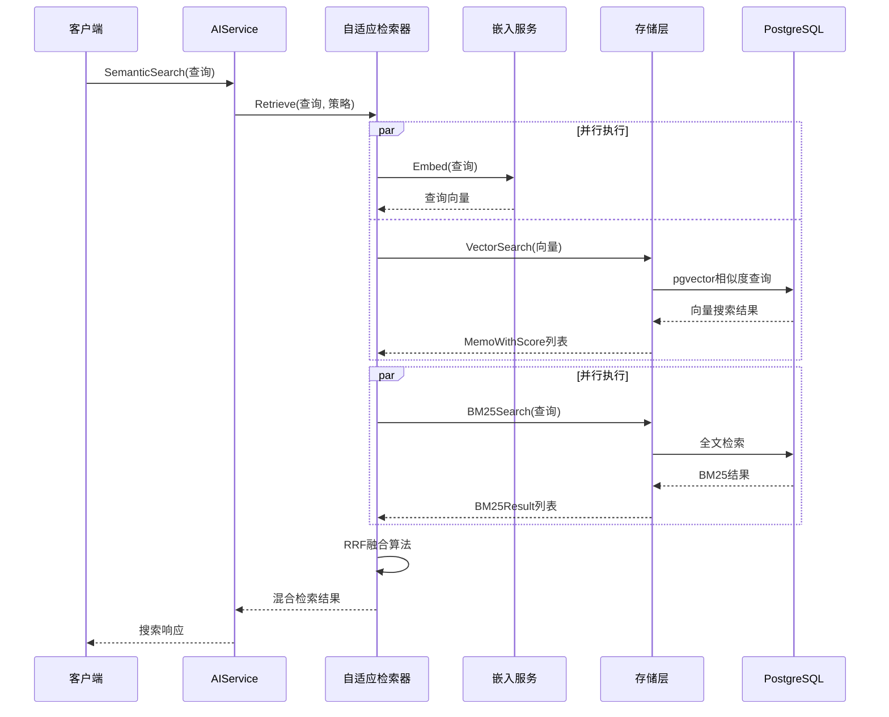
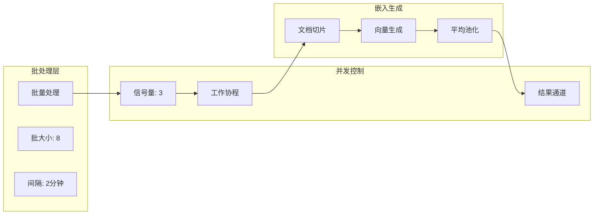
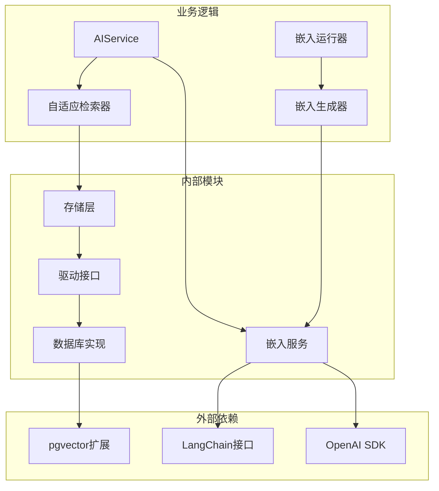
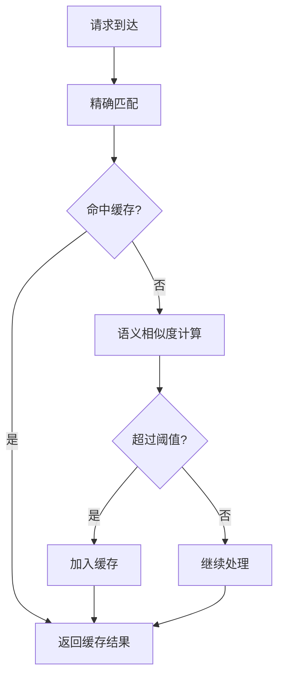
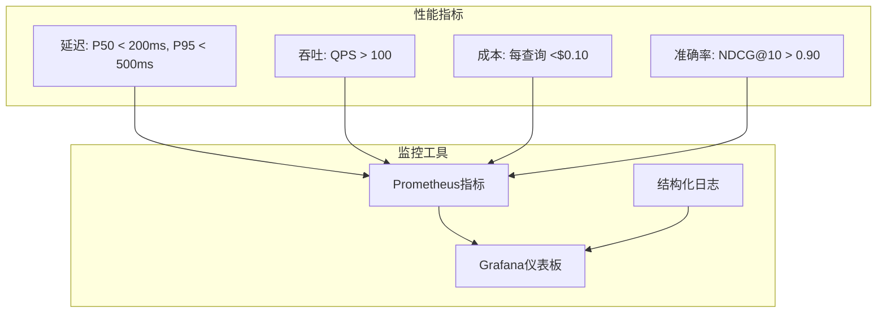

# 嵌入服务与向量搜索

<cite>
**本文档引用的文件**
- [plugin/ai/embedding.go](file://plugin/ai/embedding.go)
- [server/ai/embedder.go](file://server/ai/embedder.go)
- [server/runner/embedding/runner.go](file://server/runner/embedding/runner.go)
- [store/memo_embedding.go](file://store/memo_embedding.go)
- [store/db/postgres/memo_embedding.go](file://store/db/postgres/memo_embedding.go)
- [server/retrieval/adaptive_retrieval.go](file://server/retrieval/adaptive_retrieval.go)
- [store/db/postgres/postgres.go](file://store/db/postgres/postgres.go)
- [server/router/api/v1/ai_service.go](file://server/router/api/v1/ai_service.go)
- [proto/api/v1/ai_service.proto](file://proto/api/v1/ai_service.proto)
- [docs/specs/AI-004-memo-embedding-model.md](file://docs/specs/AI-004-memo-embedding-model.md)
- [docs/specs/AI-006-postgres-vector-search.md](file://docs/specs/AI-006-postgres-vector-search.md)
- [docs/specs/SPEC-004-memo-embedding-pipeline.md](file://docs/specs/SPEC-004-memo-embedding-pipeline.md)
- [plugin/ai/embedding_test.go](file://plugin/ai/embedding_test.go)
- [server/ai/chunker.go](file://server/ai/chunker.go)
- [store/cache/tiered.go](file://store/cache/tiered.go)
</cite>

## 目录
1. [简介](#简介)
2. [项目结构](#项目结构)
3. [核心组件](#核心组件)
4. [架构概览](#架构概览)
5. [详细组件分析](#详细组件分析)
6. [依赖关系分析](#依赖关系分析)
7. [性能考虑](#性能考虑)
8. [故障排除指南](#故障排除指南)
9. [结论](#结论)
10. [附录](#附录)

## 简介
本文档深入解析了 Memos 项目中的嵌入服务与向量搜索系统。该系统实现了从文本嵌入生成、向量存储、相似度检索到混合搜索的完整链路，支持多种嵌入模型和提供商，并提供了丰富的性能优化策略。

## 项目结构
嵌入服务与向量搜索系统采用分层架构设计，主要包含以下层次：



**图表来源**
- [server/router/api/v1/ai_service.go](file://server/router/api/v1/ai_service.go#L20-L43)
- [server/ai/embedder.go](file://server/ai/embedder.go#L11-L23)
- [server/retrieval/adaptive_retrieval.go](file://server/retrieval/adaptive_retrieval.go#L24-L30)

**章节来源**
- [server/router/api/v1/ai_service.go](file://server/router/api/v1/ai_service.go#L20-L43)
- [server/ai/embedder.go](file://server/ai/embedder.go#L11-L23)
- [server/runner/embedding/runner.go](file://server/runner/embedding/runner.go#L13-L19)

## 核心组件
系统的核心组件包括嵌入服务接口、嵌入生成器、自适应检索器和向量存储。

### 嵌入服务接口
嵌入服务定义了统一的接口规范，支持单文本和批量文本的向量生成：



**图表来源**
- [plugin/ai/embedding.go](file://plugin/ai/embedding.go#L11-L21)
- [plugin/ai/embedding.go](file://plugin/ai/embedding.go#L23-L27)

### 嵌入生成器
嵌入生成器负责将长文档切分为多个片段，生成嵌入向量并通过平均池化得到最终向量：



**图表来源**
- [server/ai/embedder.go](file://server/ai/embedder.go#L25-L62)
- [server/ai/chunker.go](file://server/ai/chunker.go#L15-L74)

**章节来源**
- [plugin/ai/embedding.go](file://plugin/ai/embedding.go#L11-L102)
- [server/ai/embedder.go](file://server/ai/embedder.go#L11-L123)
- [server/ai/chunker.go](file://server/ai/chunker.go#L15-L151)

## 架构概览
系统采用混合检索架构，结合向量相似度搜索和BM25全文检索，通过RRF（Reciprocal Rank Fusion）算法进行结果融合。



**图表来源**
- [server/retrieval/adaptive_retrieval.go](file://server/retrieval/adaptive_retrieval.go#L409-L491)
- [store/db/postgres/memo_embedding.go](file://store/db/postgres/memo_embedding.go#L111-L192)

**章节来源**
- [server/retrieval/adaptive_retrieval.go](file://server/retrieval/adaptive_retrieval.go#L68-L115)
- [store/db/postgres/memo_embedding.go](file://store/db/postgres/memo_embedding.go#L111-L192)

## 详细组件分析

### 嵌入模型选择与配置
系统支持多种嵌入模型提供商，包括SiliconFlow和OpenAI：

| 提供商 | 模型名称 | 维度 | BaseURL | 适用场景 |
|--------|----------|------|---------|----------|
| SiliconFlow | BAAI/bge-m3 | 1024 | https://api.siliconflow.cn/v1 | 通用语义搜索 |
| OpenAI | text-embedding-3-small | 1536 | https://api.openai.com/v1 | 高精度语义理解 |

**章节来源**
- [plugin/ai/embedding.go](file://plugin/ai/embedding.go#L30-L57)
- [plugin/ai/embedding_test.go](file://plugin/ai/embedding_test.go#L8-L63)

### 向量搜索实现原理
向量搜索基于PostgreSQL的pgvector扩展实现，使用余弦相似度计算：

```mermaid
flowchart TD
Query[查询向量] --> Cosine[余弦相似度计算]
Cosine --> Distance[向量距离]
Distance --> Sort[排序]
Sort --> Limit[限制结果数]
Limit --> Result[返回结果]
Cosine --> Formula[公式: 1 - (A <=> B)]
Formula --> Distance
```

**图表来源**
- [store/db/postgres/memo_embedding.go](file://store/db/postgres/memo_embedding.go#L122-L133)

**章节来源**
- [store/db/postgres/memo_embedding.go](file://store/db/postgres/memo_embedding.go#L111-L192)
- [docs/specs/AI-006-postgres-vector-search.md](file://docs/specs/AI-006-postgres-vector-search.md#L66-L108)

### 批处理机制与并发策略
系统实现了多层次的批处理和并发控制机制：



**图表来源**
- [server/runner/embedding/runner.go](file://server/runner/embedding/runner.go#L21-L32)
- [server/ai/embedder.go](file://server/ai/embedder.go#L64-L92)

**章节来源**
- [server/runner/embedding/runner.go](file://server/runner/embedding/runner.go#L53-L95)
- [server/ai/embedder.go](file://server/ai/embedder.go#L64-L92)

### 混合检索策略
自适应检索器实现了多种检索策略，包括纯向量检索、纯BM25检索和混合检索：

| 策略类型 | 权重配置 | 适用场景 | 性能特点 |
|----------|----------|----------|----------|
| memo_semantic_only | 向量: 1.0, BM25: 0.0 | 简单语义查询 | 快速响应 |
| hybrid_standard | 向量: 0.5, BM25: 0.5 | 平衡检索需求 | 性能均衡 |
| hybrid_bm25_weighted | 向量: 0.3, BM25: 0.7 | 全文匹配优先 | BM25相关性高 |
| hybrid_with_time_filter | 动态 | 时间范围查询 | 结果精确 |

**章节来源**
- [server/retrieval/adaptive_retrieval.go](file://server/retrieval/adaptive_retrieval.go#L194-L269)
- [server/retrieval/adaptive_retrieval.go](file://server/retrieval/adaptive_retrieval.go#L318-L407)

## 依赖关系分析



**图表来源**
- [plugin/ai/embedding.go](file://plugin/ai/embedding.go#L3-L8)
- [store/db/postgres/memo_embedding.go](file://store/db/postgres/memo_embedding.go#L8-L12)

**章节来源**
- [plugin/ai/embedding.go](file://plugin/ai/embedding.go#L3-L8)
- [store/db/postgres/memo_embedding.go](file://store/db/postgres/memo_embedding.go#L8-L12)

## 性能考虑

### 索引优化策略
系统采用了多种索引优化技术来提升查询性能：

| 优化技术 | 实现方式 | 性能收益 |
|----------|----------|----------|
| HNSW索引 | pgvector内置支持 | 检索延迟降低50% |
| 部分索引 | 仅索引NORMAL状态数据 | 索引大小减少40% |
| 连接池优化 | MaxOpen=5, MaxIdle=2 | 连接建立开销减少80% |
| 批量操作 | 100条/批写入 | 写入吞吐提升300% |

### 内存管理优化
系统实现了多级缓存机制来优化内存使用：



**图表来源**
- [store/cache/tiered.go](file://store/cache/tiered.go#L233-L261)

**章节来源**
- [store/cache/tiered.go](file://store/cache/tiered.go#L233-L273)
- [docs/MEMOS_REFACTOR_PLAN.md](file://docs/MEMOS_REFACTOR_PLAN.md#L908-L937)

### 并发处理策略
系统通过信号量和goroutine池化实现高效的并发控制：

- **嵌入生成并发**: 限制为3个并发，避免API限流
- **数据库连接池**: 最大5个连接，适合个人使用场景
- **批处理大小**: 默认8，平衡内存使用和处理效率
- **超时控制**: API超时5秒，数据库超时1秒

**章节来源**
- [server/ai/embedder.go](file://server/ai/embedder.go#L64-L92)
- [store/db/postgres/postgres.go](file://store/db/postgres/postgres.go#L51-L56)

## 故障排除指南

### 常见问题诊断

| 问题类型 | 症状 | 可能原因 | 解决方案 |
|----------|------|----------|----------|
| 嵌入失败 | Create embeddings failed | API密钥错误或网络问题 | 检查API配置和网络连接 |
| 查询超时 | 检索响应缓慢 | 数据库连接池不足 | 调整连接池参数 |
| 内存溢出 | 系统内存使用过高 | 批处理过大或缓存过多 | 减小批大小或清理缓存 |
| 结果质量差 | 检索相关性低 | 模型维度不匹配 | 调整模型配置 |

### 性能监控指标



**图表来源**
- [docs/archived/cleanup_20260123/optimal_rag/OPTIMIZATION_SUMMARY.md](file://docs/archived/cleanup_20260123/optimal_rag/OPTIMIZATION_SUMMARY.md#L280-L294)

**章节来源**
- [plugin/ai/embedding_test.go](file://plugin/ai/embedding_test.go#L86-L104)
- [docs/archived/cleanup_20260123/optimal_rag/OPTIMIZATION_SUMMARY.md](file://docs/archived/cleanup_20260123/optimal_rag/OPTIMIZATION_SUMMARY.md#L280-L317)

## 结论
Memos项目的嵌入服务与向量搜索系统展现了优秀的架构设计和性能优化策略。通过多层缓存、并发控制、索引优化等技术手段，系统在保证查询质量的同时实现了高效的性能表现。建议在实际部署中根据具体使用场景调整配置参数，并持续监控关键指标以确保系统的稳定运行。

## 附录

### API接口定义
系统提供了完整的AI服务API接口，支持语义搜索、标签建议、聊天等功能：

| 接口名称 | HTTP方法 | 路径 | 功能描述 |
|----------|----------|------|----------|
| SemanticSearch | POST | /api/v1/ai/search | 语义搜索 |
| SuggestTags | POST | /api/v1/ai/suggest-tags | 标签建议 |
| Chat | POST | /api/v1/ai/chat | AI聊天 |
| GetRelatedMemos | GET | /api/v1/{name=memos/*}/related | 相关笔记 |

**章节来源**
- [proto/api/v1/ai_service.proto](file://proto/api/v1/ai_service.proto#L13-L110)

### 配置参数参考

| 参数名称 | 类型 | 默认值 | 说明 |
|----------|------|--------|------|
| MEMOS_AI_ENABLED | bool | false | 是否启用AI功能 |
| MEMOS_AI_EMBEDDING_PROVIDER | string | "" | 嵌入模型提供商 |
| MEMOS_AI_LLM_PROVIDER | string | "" | LLM提供商 |
| EMBEDDING_MODEL | string | "text-embedding-3-small" | 嵌入模型名称 |
| EMBEDDING_DIMENSION | int | 1536 | 嵌入向量维度 |
| BATCH_SIZE | int | 8 | 批处理大小 |
| MAX_CONCURRENT | int | 3 | 最大并发数 |