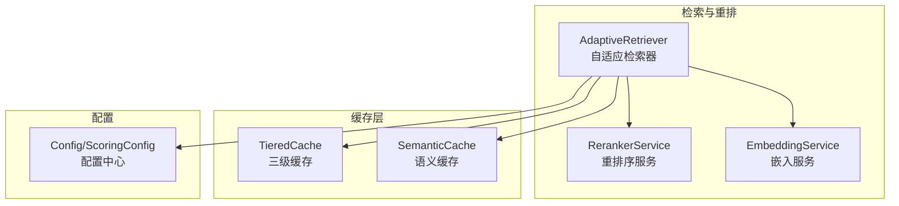
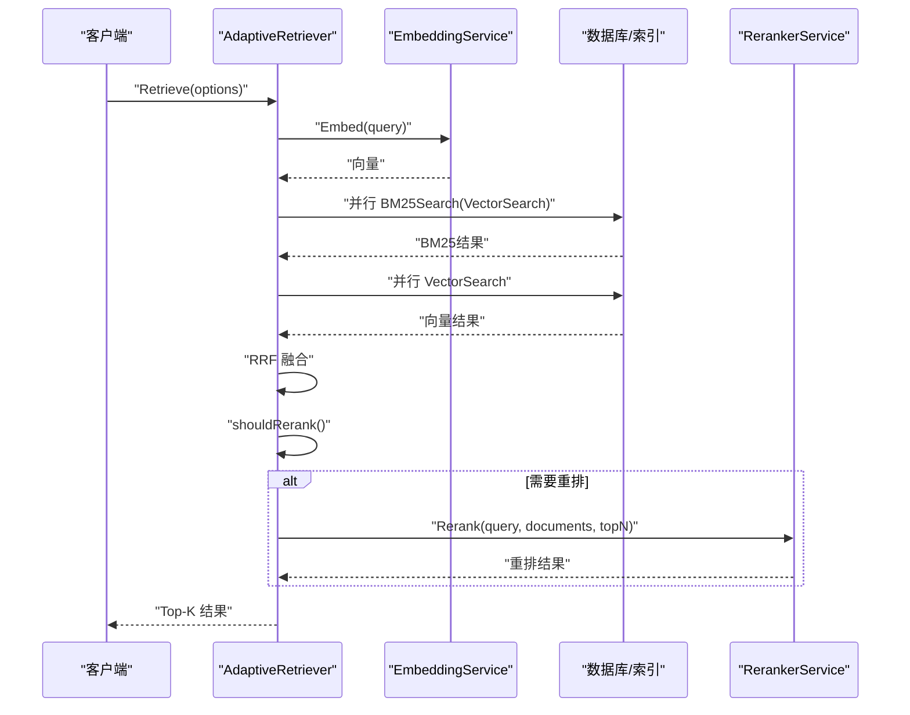
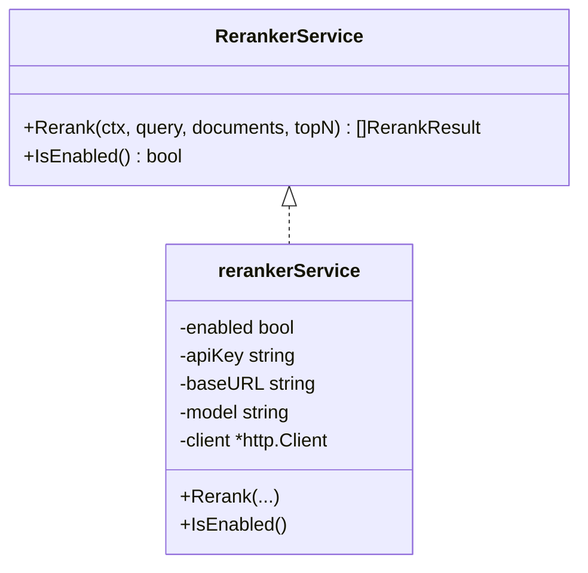
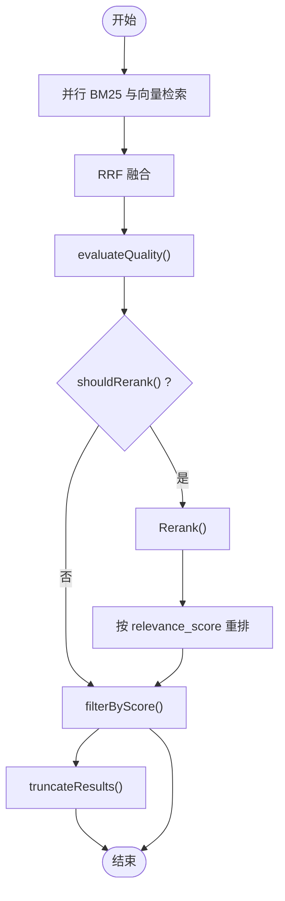
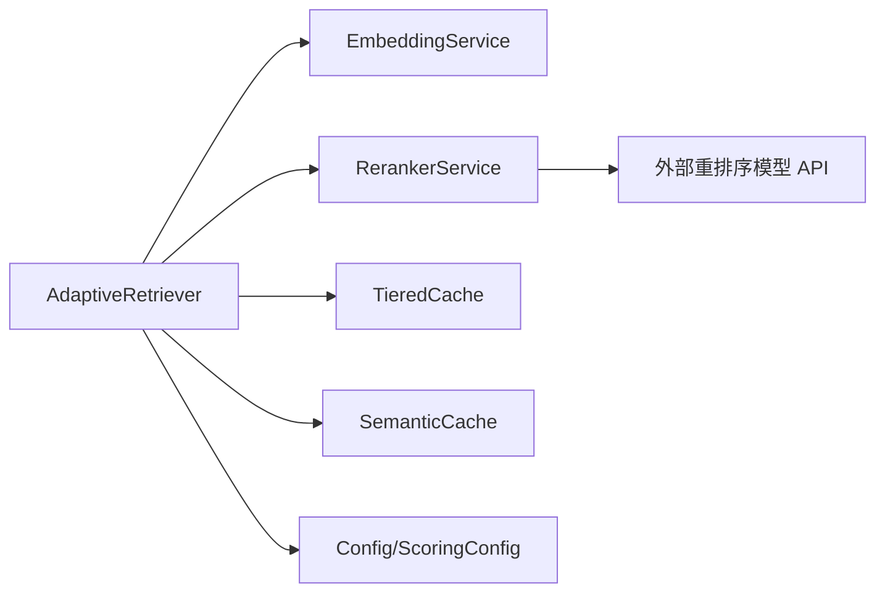

# 结果重排序系统

<cite>
**本文引用的文件**
- [plugin/ai/reranker.go](file://plugin/ai/reranker.go)
- [plugin/ai/reranker_test.go](file://plugin/ai/reranker_test.go)
- [plugin/ai/embedding.go](file://plugin/ai/embedding.go)
- [server/retrieval/adaptive_retrieval.go](file://server/retrieval/adaptive_retrieval.go)
- [server/queryengine/config.go](file://server/queryengine/config.go)
- [store/cache/tiered.go](file://store/cache/tiered.go)
- [docs/specs/AI-006-postgres-vector-search.md](file://docs/specs/AI-006-postgres-vector-search.md)
- [docs/archived/RAG_REVIEW_REPORT.md](file://docs/archived/RAG_REVIEW_REPORT.md)
- [docs/archived/cleanup_20260123/RAG_SYSTEM_RESEARCH_REPORT.md](file://docs/archived/cleanup_20260123/RAG_SYSTEM_RESEARCH_REPORT.md)
</cite>

## 目录
1. [简介](#简介)
2. [项目结构](#项目结构)
3. [核心组件](#核心组件)
4. [架构总览](#架构总览)
5. [详细组件分析](#详细组件分析)
6. [依赖关系分析](#依赖关系分析)
7. [性能考量](#性能考量)
8. [故障排查指南](#故障排查指南)
9. [结论](#结论)
10. [附录](#附录)

## 简介
本技术文档围绕“结果重排序系统”展开，重点解释重排序器的工作原理与策略，对比交叉编码（双塔）与双塔（单塔）模型的差异，梳理重排序策略（相关性评分、多样性保证、上下文感知排序）、性能优化（批量处理、缓存策略）、质量评估方法（人工评估与自动指标），并提供参数调优指南与最佳实践。该系统在检索阶段采用混合检索（BM25 + 语义向量）并通过 Reciprocal Rank Fusion（RRF）进行融合，再根据策略选择性地调用重排序服务，以在准确度与成本之间取得平衡。

## 项目结构
重排序系统主要由以下模块构成：
- 重排序服务：封装外部重排序模型（如 BGE-Reranker）的调用接口与降级逻辑
- 自适应检索器：负责混合检索、质量评估、选择性重排与结果截断
- 向量嵌入服务：提供文本向量化能力，支撑语义检索与语义缓存
- 缓存层：三层缓存（内存/L1、可选Redis/L2、数据库回源/L3）与语义缓存
- 配置中心：统一管理检索、评分与重排相关的阈值与权重

图表来源
- [server/retrieval/adaptive_retrieval.go](file://server/retrieval/adaptive_retrieval.go#L24-L66)
- [plugin/ai/reranker.go](file://plugin/ai/reranker.go#L20-L35)
- [plugin/ai/embedding.go](file://plugin/ai/embedding.go#L11-L27)
- [store/cache/tiered.go](file://store/cache/tiered.go#L17-L35)
- [server/queryengine/config.go](file://server/queryengine/config.go#L43-L72)

章节来源
- [server/retrieval/adaptive_retrieval.go](file://server/retrieval/adaptive_retrieval.go#L68-L115)
- [server/queryengine/config.go](file://server/queryengine/config.go#L43-L72)

## 核心组件
- 重排序服务（RerankerService）
  - 提供 Rerank 接口，支持禁用模式下的原序返回与降级处理
  - 通过 HTTP 客户端调用外部重排序 API，并解析返回结果
- 自适应检索器（AdaptiveRetriever）
  - 混合检索：并行执行 BM25 与向量检索，使用 RRF 融合
  - 质量评估：基于分数差距与阈值判断结果质量等级
  - 选择性重排：根据查询复杂度与结果质量决定是否调用重排序
  - 结果截断与过滤：按阈值与限制输出最终结果
- 向量嵌入服务（EmbeddingService）
  - 支持单文本与批量向量化，兼容 OpenAI 兼容接口
  - 维度配置与错误处理
- 缓存层
  - 三级缓存：内存（L1）+ 可选 Redis（L2）+ 数据库回源（L3）
  - 语义缓存：基于向量相似度的查询缓存，提升重复语义相近查询命中率
- 配置中心
  - 检索限制、最大文档长度、是否启用重排
  - 评分阈值、权重范围、最小重排结果数等

章节来源
- [plugin/ai/reranker.go](file://plugin/ai/reranker.go#L14-L57)
- [server/retrieval/adaptive_retrieval.go](file://server/retrieval/adaptive_retrieval.go#L24-L66)
- [plugin/ai/embedding.go](file://plugin/ai/embedding.go#L11-L58)
- [store/cache/tiered.go](file://store/cache/tiered.go#L17-L91)
- [server/queryengine/config.go](file://server/queryengine/config.go#L43-L72)

## 架构总览
系统采用“混合检索 + 选择性重排”的两阶段流程：
- 第一阶段：并行 BM25 与向量检索，RRF 融合得到候选集
- 第二阶段：根据策略判断是否需要重排；若需要，则调用重排序服务对候选集进行重排

图表来源
- [server/retrieval/adaptive_retrieval.go](file://server/retrieval/adaptive_retrieval.go#L330-L407)
- [plugin/ai/reranker.go](file://plugin/ai/reranker.go#L59-L126)

章节来源
- [server/retrieval/adaptive_retrieval.go](file://server/retrieval/adaptive_retrieval.go#L330-L407)
- [plugin/ai/reranker.go](file://plugin/ai/reranker.go#L59-L126)

## 详细组件分析

### 重排序服务（RerankerService）
- 接口职责
  - Rerank(ctx, query, documents, topN)：对外提供重排序能力
  - IsEnabled()：判断是否启用重排
- 关键行为
  - 禁用模式：返回原序，分数按轻微递减，便于下游排序一致性
  - 启用模式：构造请求体，调用外部 API，解析 JSON，按 relevance_score 降序排序
  - 错误处理：非 200 状态码返回错误，网络异常直接透传
- 与自适应检索器协作
  - AdaptiveRetriever 在 shouldRerank 为真时调用 Rerank
  - 若 Rerank 失败，记录告警并降级返回原始混合结果

图表来源
- [plugin/ai/reranker.go](file://plugin/ai/reranker.go#L20-L57)

章节来源
- [plugin/ai/reranker.go](file://plugin/ai/reranker.go#L59-L126)
- [plugin/ai/reranker_test.go](file://plugin/ai/reranker_test.go#L8-L61)

### 自适应检索器（AdaptiveRetriever）
- 混合检索与 RRF 融合
  - 并行执行 BM25 与向量检索，使用 RRF 公式融合两类结果
  - 支持权重配置（semanticWeight 控制 BM25 与向量的相对权重）
- 质量评估与选择性重排
  - evaluateQuality：基于首两名分数差距与最高分阈值判断质量等级
  - shouldRerank：综合结果数量、查询复杂度、分数差距等规则决定是否重排
- 结果处理
  - filterByScore：按阈值过滤
  - truncateResults：截断至目标数量
  - fullPipelineWithReranker：完整流程（混合检索 -> 选择性重排 -> 重排）

图表来源
- [server/retrieval/adaptive_retrieval.go](file://server/retrieval/adaptive_retrieval.go#L409-L491)
- [server/retrieval/adaptive_retrieval.go](file://server/retrieval/adaptive_retrieval.go#L627-L655)
- [server/retrieval/adaptive_retrieval.go](file://server/retrieval/adaptive_retrieval.go#L686-L712)

章节来源
- [server/retrieval/adaptive_retrieval.go](file://server/retrieval/adaptive_retrieval.go#L409-L602)
- [server/retrieval/adaptive_retrieval.go](file://server/retrieval/adaptive_retrieval.go#L627-L754)

### 向量嵌入服务（EmbeddingService）
- 单文本与批量向量化
- 维度配置与错误处理
- 与检索器配合：用于生成查询向量，驱动向量检索与语义缓存

章节来源
- [plugin/ai/embedding.go](file://plugin/ai/embedding.go#L60-L98)

### 缓存层（TieredCache 与 SemanticCache）
- TieredCache
  - L1：内存缓存（默认开启）
  - L2：可选 Redis 缓存（通过环境变量启用）
  - L3：数据库回源
  - 支持统计查询与清理
- SemanticCache
  - 基于向量相似度的语义缓存，命中后返回相似查询的历史结果
  - 可配置相似度阈值与最大条目数

章节来源
- [store/cache/tiered.go](file://store/cache/tiered.go#L17-L91)
- [store/cache/tiered.go](file://store/cache/tiered.go#L233-L330)
- [store/cache/tiered.go](file://store/cache/tiered.go#L384-L446)

### 配置中心（Config/ScoringConfig）
- 检索配置：向量/混合/扩展检索限制、是否启用重排、最大文档长度
- 评分配置：BM25 权重范围、语义权重、高低质量阈值、分数差距阈值、最小重排结果数
- 默认配置与校验

章节来源
- [server/queryengine/config.go](file://server/queryengine/config.go#L43-L72)
- [server/queryengine/config.go](file://server/queryengine/config.go#L74-L104)
- [server/queryengine/config.go](file://server/queryengine/config.go#L121-L159)

## 依赖关系分析
- AdaptiveRetriever 依赖 EmbeddingService 与 RerankerService
- RerankerService 依赖外部重排序模型 API
- 缓存层为检索与重排提供加速
- 配置中心贯穿检索与重排决策

图表来源
- [server/retrieval/adaptive_retrieval.go](file://server/retrieval/adaptive_retrieval.go#L24-L66)
- [plugin/ai/reranker.go](file://plugin/ai/reranker.go#L29-L52)
- [store/cache/tiered.go](file://store/cache/tiered.go#L17-L35)
- [server/queryengine/config.go](file://server/queryengine/config.go#L43-L72)

章节来源
- [server/retrieval/adaptive_retrieval.go](file://server/retrieval/adaptive_retrieval.go#L24-L66)
- [plugin/ai/reranker.go](file://plugin/ai/reranker.go#L29-L52)
- [store/cache/tiered.go](file://store/cache/tiered.go#L17-L35)
- [server/queryengine/config.go](file://server/queryengine/config.go#L43-L72)

## 性能考量
- 并行检索与 RRF 融合
  - 并行执行 BM25 与向量检索，减少总体等待时间
  - RRF 无需分数归一化，天然支持多信号融合
- 选择性重排
  - 仅在必要时调用重排序 API，显著降低 API 成本与延迟
  - 规则包括：结果数量少、查询简单、首两名分数差距大等
- 批量处理与缓存
  - 嵌入服务支持批量向量化，减少 API 调用次数
  - TieredCache 与 SemanticCache 提升重复查询命中率，降低后端压力
- 内存优化
  - 预分配切片容量、及时释放大对象引用、截断过长内容，降低内存峰值

章节来源
- [server/retrieval/adaptive_retrieval.go](file://server/retrieval/adaptive_retrieval.go#L410-L491)
- [server/retrieval/adaptive_retrieval.go](file://server/retrieval/adaptive_retrieval.go#L686-L712)
- [plugin/ai/embedding.go](file://plugin/ai/embedding.go#L71-L98)
- [store/cache/tiered.go](file://store/cache/tiered.go#L93-L132)
- [docs/archived/RAG_REVIEW_REPORT.md](file://docs/archived/RAG_REVIEW_REPORT.md#L107-L131)

## 故障排查指南
- 重排序服务不可用
  - 现象：Rerank 返回错误或降级
  - 排查：确认 IsEnabled()、外部 API 基础地址与密钥、HTTP 状态码
  - 处理：启用降级返回混合结果，记录告警日志
- 重排触发异常
  - 现象：shouldRerank 误判导致频繁/不必要重排
  - 排查：检查查询复杂度判定、分数差距阈值、最小重排结果数
  - 处理：调整阈值与规则，确保与业务场景匹配
- 缓存命中率低
  - 现象：TieredCache/SemanticCache 未命中
  - 排查：确认查询键生成、阈值设置、维度一致性
  - 处理：优化键生成策略、提高阈值或扩大缓存容量
- 向量检索性能差
  - 现象：向量搜索耗时高
  - 排查：确认向量维度、索引与 LIMIT 配置
  - 处理：调整 LIMIT、优化索引、使用批量嵌入

章节来源
- [plugin/ai/reranker.go](file://plugin/ai/reranker.go#L99-L102)
- [server/retrieval/adaptive_retrieval.go](file://server/retrieval/adaptive_retrieval.go#L686-L712)
- [store/cache/tiered.go](file://store/cache/tiered.go#L384-L446)
- [docs/specs/AI-006-postgres-vector-search.md](file://docs/specs/AI-006-postgres-vector-search.md#L66-L108)

## 结论
本重排序系统通过“混合检索 + 选择性重排”的策略，在保证相关性的前提下有效控制成本与延迟。结合 RRF 融合、质量评估与缓存机制，系统在不同查询复杂度与负载条件下均具备良好的稳定性与可扩展性。建议在生产环境中持续监控重排触发率、缓存命中率与 API 成本，并根据实际业务反馈动态调整阈值与权重。

## 附录

### 交叉编码 vs 双塔模型对比
- 交叉编码（双塔）
  - 特点：对查询-文档对进行联合编码，通常更关注细粒度相关性
  - 优点：相关性更强，适合强语义匹配场景
  - 缺点：推理成本高，不适合大规模候选集
- 双塔（单塔）
  - 特点：分别对查询与文档编码，再计算相似度
  - 优点：推理成本低，适合大规模候选集
  - 缺点：相关性不如交叉编码精细
- 本系统采用双塔（向量检索 + Reranker）组合：先用双塔快速筛选，再用重排模型做细粒度排序

章节来源
- [docs/archived/RAG_REVIEW_REPORT.md](file://docs/archived/RAG_REVIEW_REPORT.md#L94-L106)
- [docs/archived/cleanup_20260123/RAG_SYSTEM_RESEARCH_REPORT.md](file://docs/archived/cleanup_20260123/RAG_SYSTEM_RESEARCH_REPORT.md#L33-L55)

### 重排序策略实现要点
- 相关性评分
  - RRF 融合：BM25 与向量检索结果按 RRFScore 融合
  - 评分阈值：通过 MinScore 与 QualityThreshold 控制输出质量
- 多样性保证
  - 建议在融合阶段引入标签/类目维度，避免结果过于集中
  - 可在 Rerank 前对候选集进行去重与类别均衡
- 上下文感知排序
  - 可在 Rerank 输入中加入用户偏好、时间窗口、最近访问等上下文信息
  - 通过业务规则（如置顶、时效性）对最终排序进行微调

章节来源
- [server/retrieval/adaptive_retrieval.go](file://server/retrieval/adaptive_retrieval.go#L523-L602)
- [server/queryengine/config.go](file://server/queryengine/config.go#L57-L72)

### 重排序性能优化技术
- 批量处理
  - 嵌入服务支持批量向量化，减少 API 调用次数
  - Rerank 时对候选集进行批量重排
- 缓存策略
  - TieredCache：L1 内存缓存 + 可选 L2 Redis 缓存
  - SemanticCache：基于语义相似度的查询缓存，提升重复语义相近查询命中率
- 内存优化
  - 预分配切片容量、及时释放大对象引用、截断过长内容

章节来源
- [plugin/ai/embedding.go](file://plugin/ai/embedding.go#L71-L98)
- [store/cache/tiered.go](file://store/cache/tiered.go#L93-L132)
- [store/cache/tiered.go](file://store/cache/tiered.go#L233-L330)
- [server/retrieval/adaptive_retrieval.go](file://server/retrieval/adaptive_retrieval.go#L360-L406)

### 重排序结果质量评估方法
- 人工评估
  - 专家标注相关性等级，统计准确率、召回率、NDCG 等指标
- 自动指标
  - NDCG@K、Precision@K、Recall@K、MRR
  - 成本与延迟：每查询成本、P95 延迟、重排触发率
- 压力测试
  - 高并发场景下的 QPS、P95 延迟、错误率与成本分布

章节来源
- [docs/archived/RAG_REVIEW_REPORT.md](file://docs/archived/RAG_REVIEW_REPORT.md#L139-L198)
- [docs/archived/cleanup_20260123/RAG_SYSTEM_RESEARCH_REPORT.md](file://docs/archived/cleanup_20260123/RAG_SYSTEM_RESEARCH_REPORT.md#L392-L431)

### 重排序参数调优指南与最佳实践
- 阈值设置
  - ScoreGapThreshold：首两名分数差距阈值，避免不必要的重排
  - HighQualityThreshold/MediumQualityThreshold：质量评估阈值
  - MinRerankResults：最小重排结果数，避免小规模结果重排
- 权重分配
  - semanticWeight：RRF 中向量权重，平衡 BM25 与向量影响
  - BM25WeightMin/BM25WeightMax：BM25 权重范围，适配不同场景
- 选择性重排规则
  - 查询长度、是否包含复杂语法、结果数量、分数差距等
- 缓存与成本
  - 合理设置缓存阈值与容量，提升命中率
  - 优先在高价值查询上启用重排，控制 API 成本

章节来源
- [server/queryengine/config.go](file://server/queryengine/config.go#L57-L72)
- [server/retrieval/adaptive_retrieval.go](file://server/retrieval/adaptive_retrieval.go#L686-L712)
- [store/cache/tiered.go](file://store/cache/tiered.go#L233-L330)