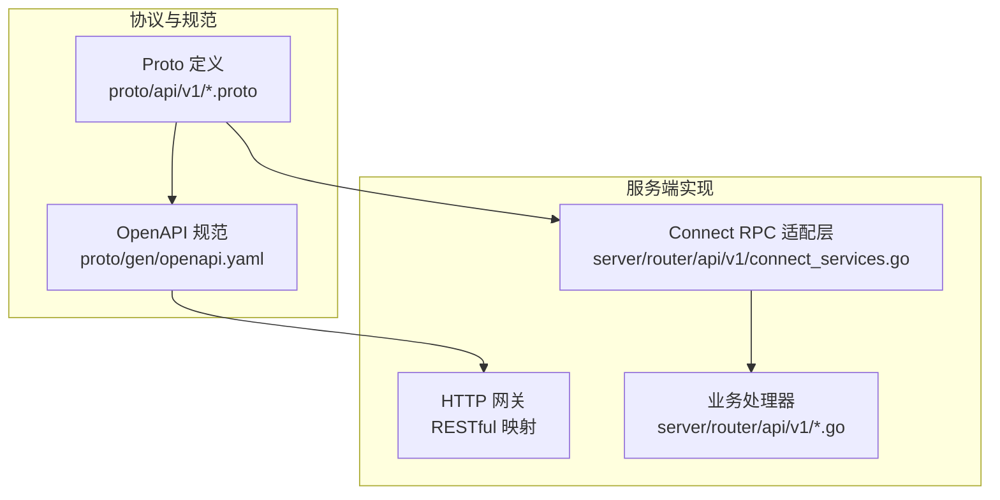
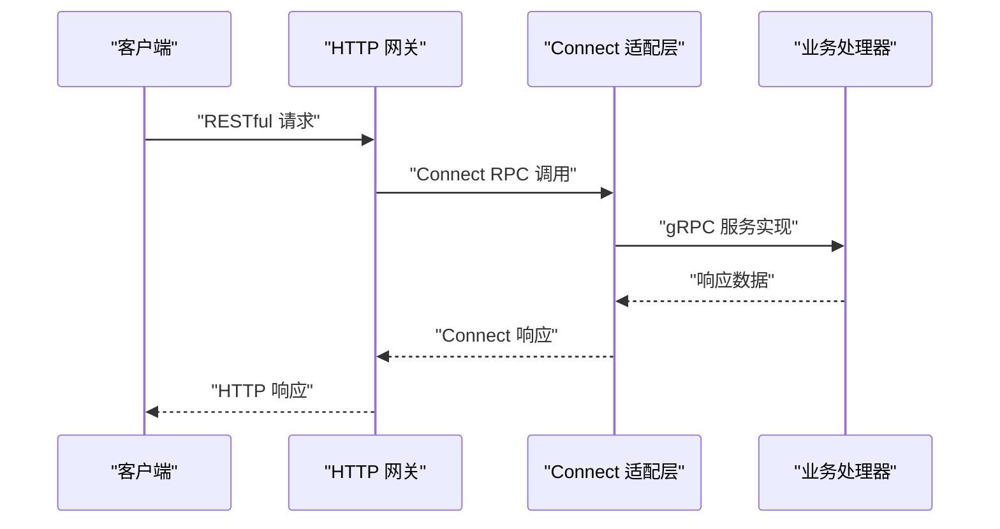
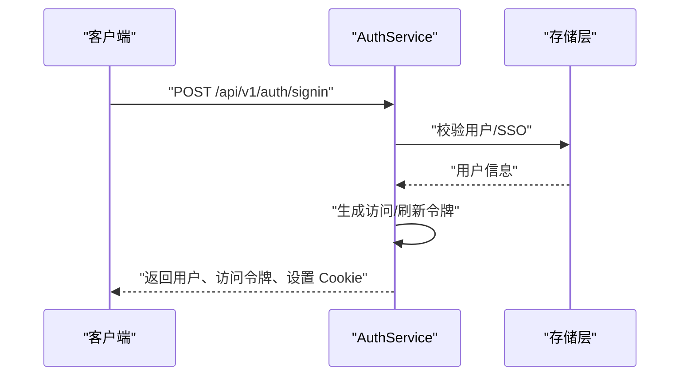
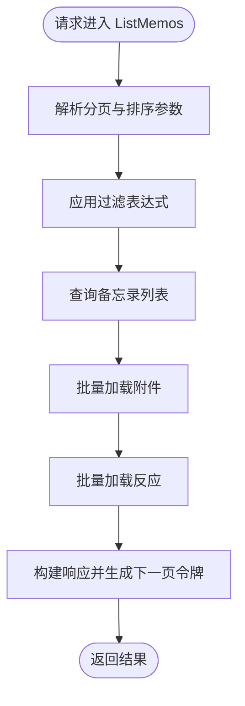
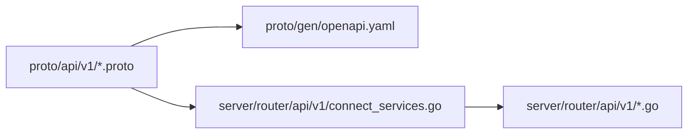

# API 接口文档

<cite>
**本文档引用的文件**
- [proto/api/v1/README.md](file://proto/api/v1/README.md)
- [proto/api/v1/common.proto](file://proto/api/v1/common.proto)
- [proto/gen/openapi.yaml](file://proto/gen/openapi.yaml)
- [proto/api/v1/auth_service.proto](file://proto/api/v1/auth_service.proto)
- [proto/api/v1/memo_service.proto](file://proto/api/v1/memo_service.proto)
- [proto/api/v1/ai_service.proto](file://proto/api/v1/ai_service.proto)
- [proto/api/v1/schedule_service.proto](file://proto/api/v1/schedule_service.proto)
- [proto/api/v1/user_service.proto](file://proto/api/v1/user_service.proto)
- [proto/api/v1/instance_service.proto](file://proto/api/v1/instance_service.proto)
- [proto/api/v1/attachment_service.proto](file://proto/api/v1/attachment_service.proto)
- [server/router/api/v1/connect_services.go](file://server/router/api/v1/connect_services.go)
- [server/router/api/v1/auth_service.go](file://server/router/api/v1/auth_service.go)
- [server/router/api/v1/memo_service.go](file://server/router/api/v1/memo_service.go)
</cite>

## 目录
1. [简介](#简介)
2. [项目结构](#项目结构)
3. [核心组件](#核心组件)
4. [架构总览](#架构总览)
5. [详细组件分析](#详细组件分析)
6. [依赖关系分析](#依赖关系分析)
7. [性能考虑](#性能考虑)
8. [故障排除指南](#故障排除指南)
9. [结论](#结论)
10. [附录](#附录)

## 简介
本文件为 Memos 后端系统的完整 API 接口文档，涵盖 RESTful API（基于 Google AIP 规范）与 Connect RPC 接口。内容包括：
- RESTful API 的 HTTP 方法、URL 模式、请求/响应格式与认证机制
- gRPC 服务定义与 Connect RPC 使用方法
- 所有公共 API 端点的详细规范：参数说明、返回值格式、错误码
- 实际请求/响应示例与客户端集成指导
- API 版本管理、向后兼容性与废弃策略
- 速率限制、安全考虑与性能优化建议

## 项目结构
该仓库采用分层架构，API 设计以 Protocol Buffers 为核心，通过 OpenAPI 生成器导出 RESTful 规范，并在服务端实现 Connect RPC 适配层。

图表来源
- [proto/api/v1/README.md](file://proto/api/v1/README.md#L1-L4)
- [proto/gen/openapi.yaml](file://proto/gen/openapi.yaml#L1-L800)
- [server/router/api/v1/connect_services.go](file://server/router/api/v1/connect_services.go#L1-L491)

章节来源
- [proto/api/v1/README.md](file://proto/api/v1/README.md#L1-L4)
- [proto/gen/openapi.yaml](file://proto/gen/openapi.yaml#L1-L800)
- [server/router/api/v1/connect_services.go](file://server/router/api/v1/connect_services.go#L1-L491)

## 核心组件
- 认证与会话服务（AuthService）
  - 支持密码登录、SSO 登录、刷新令牌、登出
  - 基于短时访问令牌与 HttpOnly 刷新令牌 Cookie 的双令牌模型
- 用户服务（UserService）
  - 用户 CRUD、统计信息、设置、个人访问令牌（PAT）、Webhook 管理
- 备忘录服务（MemoService）
  - 备忘录 CRUD、附件与关系管理、评论、反应、标签提取
- AI 服务（AIService）
  - 语义搜索、标签建议、聊天流、相关备忘录、鹦鹉代理元认知
- 日程服务（ScheduleService）
  - 日程 CRUD、冲突检测、自然语言解析创建
- 实例服务（InstanceService）
  - 实例配置、存储设置、品牌定制
- 附件服务（AttachmentService）
  - 附件上传、列表、查询、更新、删除

章节来源
- [proto/api/v1/auth_service.proto](file://proto/api/v1/auth_service.proto#L1-L115)
- [proto/api/v1/user_service.proto](file://proto/api/v1/user_service.proto#L1-L677)
- [proto/api/v1/memo_service.proto](file://proto/api/v1/memo_service.proto#L1-L512)
- [proto/api/v1/ai_service.proto](file://proto/api/v1/ai_service.proto#L1-L371)
- [proto/api/v1/schedule_service.proto](file://proto/api/v1/schedule_service.proto#L1-L166)
- [proto/api/v1/instance_service.proto](file://proto/api/v1/instance_service.proto#L1-L181)
- [proto/api/v1/attachment_service.proto](file://proto/api/v1/attachment_service.proto#L1-L151)

## 架构总览
下图展示了从客户端到服务端的调用链路，以及 Connect RPC 与 RESTful 映射的关系。

图表来源
- [server/router/api/v1/connect_services.go](file://server/router/api/v1/connect_services.go#L1-L491)

章节来源
- [server/router/api/v1/connect_services.go](file://server/router/api/v1/connect_services.go#L1-L491)

## 详细组件分析

### 认证与会话服务（AuthService）
- 端点与方法
  - GET /api/v1/auth/me -> GetCurrentUser
  - POST /api/v1/auth/signin -> SignIn
  - POST /api/v1/auth/signout -> SignOut
  - POST /api/v1/auth/refresh -> RefreshToken
- 认证机制
  - 访问令牌：短期 JWT，用于受保护资源访问
  - 刷新令牌：HttpOnly Cookie，支持滑动窗口会话与轮换
  - 支持密码登录与 SSO（OAuth2）两种方式
- 关键行为
  - SignIn：成功后返回用户信息、访问令牌及过期时间，并设置刷新令牌 Cookie
  - RefreshToken：验证刷新令牌，轮换新刷新令牌并签发新访问令牌
  - SignOut：撤销刷新令牌并清除 Cookie
- 错误码
  - 未认证：Unauthenticated
  - 参数无效：InvalidArgument
  - 权限拒绝：PermissionDenied
  - 内部错误：Internal

图表来源
- [proto/api/v1/auth_service.proto](file://proto/api/v1/auth_service.proto#L13-L46)
- [server/router/api/v1/auth_service.go](file://server/router/api/v1/auth_service.go#L64-L190)

章节来源
- [proto/api/v1/auth_service.proto](file://proto/api/v1/auth_service.proto#L1-L115)
- [server/router/api/v1/auth_service.go](file://server/router/api/v1/auth_service.go#L1-L613)

### 用户服务（UserService）
- 端点与方法
  - GET /api/v1/users -> ListUsers
  - GET /api/v1/{name=users/*} -> GetUser
  - POST /api/v1/users -> CreateUser
  - PATCH /api/v1/{user.name=users/*} -> UpdateUser
  - DELETE /api/v1/{name=users/*} -> DeleteUser
  - GET /api/v1/users:stats -> ListAllUserStats
  - GET /api/v1/{name=users/*}:getStats -> GetUserStats
  - GET /api/v1/{name=users/*/settings/*} -> GetUserSetting
  - PATCH /api/v1/{setting.name=users/*/settings/*} -> UpdateUserSetting
  - GET /api/v1/{parent=users/*}/settings -> ListUserSettings
  - GET /api/v1/{parent=users/*}/personalAccessTokens -> ListPersonalAccessTokens
  - POST /api/v1/{parent=users/*}/personalAccessTokens -> CreatePersonalAccessToken
  - DELETE /api/v1/{name=users/*/personalAccessTokens/*} -> DeletePersonalAccessToken
  - GET /api/v1/{parent=users/*}/webhooks -> ListUserWebhooks
  - POST /api/v1/{parent=users/*}/webhooks -> CreateUserWebhook
  - PATCH /api/v1/{webhook.name=users/*/webhooks/*} -> UpdateUserWebhook
  - DELETE /api/v1/{name=users/*/webhooks/*} -> DeleteUserWebhook
  - GET /api/v1/{parent=users/*}/notifications -> ListUserNotifications
  - PATCH /api/v1/{notification.name=users/*/notifications/*} -> UpdateUserNotification
  - DELETE /api/v1/{name=users/*/notifications/*} -> DeleteUserNotification
- 功能要点
  - 支持按用户名或数字 ID 查询用户
  - 支持用户设置、个人访问令牌（PAT）、Webhook 管理
  - 统一资源命名空间：users/{user}/settings/{key}、users/{user}/personalAccessTokens/{token} 等
- 错误码
  - 未认证：Unauthenticated
  - 权限不足：PermissionDenied
  - 资源不存在：NotFound
  - 参数无效：InvalidArgument
  - 内部错误：Internal

章节来源
- [proto/api/v1/user_service.proto](file://proto/api/v1/user_service.proto#L1-L677)

### 备忘录服务（MemoService）
- 端点与方法
  - POST /api/v1/memos -> CreateMemo
  - GET /api/v1/memos -> ListMemos
  - GET /api/v1/{name=memos/*} -> GetMemo
  - PATCH /api/v1/{memo.name=memos/*} -> UpdateMemo
  - DELETE /api/v1/{name=memos/*} -> DeleteMemo
  - PATCH /api/v1/{name=memos/*}/attachments -> SetMemoAttachments
  - GET /api/v1/{name=memos/*}/attachments -> ListMemoAttachments
  - PATCH /api/v1/{name=memos/*}/relations -> SetMemoRelations
  - GET /api/v1/{name=memos/*}/relations -> ListMemoRelations
  - POST /api/v1/{name=memos/*}/comments -> CreateMemoComment
  - GET /api/v1/{name=memos/*}/comments -> ListMemoComments
  - GET /api/v1/{name=memos/*}/reactions -> ListMemoReactions
  - POST /api/v1/{name=memos/*}/reactions -> UpsertMemoReaction
  - DELETE /api/v1/{name=memos/*/reactions/*} -> DeleteMemoReaction
- 关键行为
  - 分页与过滤：支持 page_token、orderBy、filter
  - 可见性控制：私有、受保护、公开；系统策略可禁止公开可见
  - 附件与关系：支持批量设置与查询
  - 反应：支持增删改查
- 错误码
  - 未认证：Unauthenticated
  - 权限不足：PermissionDenied
  - 资源不存在：NotFound
  - 已存在：AlreadyExists
  - 参数无效：InvalidArgument
  - 内部错误：Internal

图表来源
- [server/router/api/v1/memo_service.go](file://server/router/api/v1/memo_service.go#L147-L287)

章节来源
- [proto/api/v1/memo_service.proto](file://proto/api/v1/memo_service.proto#L1-L512)
- [server/router/api/v1/memo_service.go](file://server/router/api/v1/memo_service.go#L1-L831)

### AI 服务（AIService）
- 端点与方法
  - POST /api/v1/ai/search -> SemanticSearch
  - POST /api/v1/ai/suggest-tags -> SuggestTags
  - POST /api/v1/ai/chat -> Chat（流式）
  - GET /api/v1/{name=memos/*}/related -> GetRelatedMemos
  - GET /api/v1/ai/parrots/{agent_type}/self-cognition -> GetParrotSelfCognition
  - GET /api/v1/ai/parrots -> ListParrots
  - GET /api/v1/ai/conversations -> ListAIConversations
  - GET /api/v1/ai/conversations/{id} -> GetAIConversation
  - POST /api/v1/ai/conversations -> CreateAIConversation
  - PATCH /api/v1/ai/conversations/{id} -> UpdateAIConversation
  - DELETE /api/v1/ai/conversations/{id} -> DeleteAIConversation
  - POST /api/v1/ai/conversations/{conversation_id}/separator -> AddContextSeparator
  - GET /api/v1/ai/conversations/{conversation_id}/messages -> ListMessages
- 关键行为
  - 流式聊天：Chat 返回 ChatResponse，支持事件类型与最终意图/查询结果
  - 鹦鹉代理：支持多种 AgentType，提供元认知信息
  - 对话持久化：支持创建、更新、删除对话，消息增量同步
- 错误码
  - 未认证：Unauthenticated
  - 权限不足：PermissionDenied
  - 资源不存在：NotFound
  - 参数无效：InvalidArgument
  - 内部错误：Internal

章节来源
- [proto/api/v1/ai_service.proto](file://proto/api/v1/ai_service.proto#L1-L371)

### 日程服务（ScheduleService）
- 端点与方法
  - POST /api/v1/schedules -> CreateSchedule
  - GET /api/v1/schedules -> ListSchedules
  - GET /api/v1/{name=schedules/*} -> GetSchedule
  - PATCH /api/v1/{schedule.name=schedules/*} -> UpdateSchedule
  - DELETE /api/v1/{name=schedules/*} -> DeleteSchedule
  - POST /api/v1/schedules:checkConflict -> CheckConflict
  - POST /api/v1/schedules:parseAndCreate -> ParseAndCreateSchedule
- 关键行为
  - 冲突检测：根据时间范围与排除列表检测冲突
  - 自然语言解析：将自然语言转换为日程对象，支持自动确认创建
- 错误码
  - 未认证：Unauthenticated
  - 权限不足：PermissionDenied
  - 资源不存在：NotFound
  - 参数无效：InvalidArgument
  - 内部错误：Internal

章节来源
- [proto/api/v1/schedule_service.proto](file://proto/api/v1/schedule_service.proto#L1-L166)

### 实例服务（InstanceService）
- 端点与方法
  - GET /api/v1/instance/profile -> GetInstanceProfile
  - GET /api/v1/{name=instance/settings/*} -> GetInstanceSetting
  - PATCH /api/v1/{setting.name=instance/settings/*} -> UpdateInstanceSetting
- 设置类型
  - GENERAL：通用设置（注册限制、脚本样式、自定义资料等）
  - STORAGE：存储设置（数据库/本地/S3，路径模板，上传大小限制，S3 配置）
  - MEMO_RELATED：备忘录相关策略（禁止公开可见、按更新时间显示、内容长度限制、反应列表等）

章节来源
- [proto/api/v1/instance_service.proto](file://proto/api/v1/instance_service.proto#L1-L181)

### 附件服务（AttachmentService）
- 端点与方法
  - POST /api/v1/attachments -> CreateAttachment
  - GET /api/v1/attachments -> ListAttachments
  - GET /api/v1/{name=attachments/*} -> GetAttachment
  - PATCH /api/v1/{attachment.name=attachments/*} -> UpdateAttachment
  - DELETE /api/v1/{name=attachments/*} -> DeleteAttachment
- 过滤与排序
  - 支持 filter（如 mime_type、filename、create_time、memo）与 orderBy
- 错误码
  - 未认证：Unauthenticated
  - 权限不足：PermissionDenied
  - 资源不存在：NotFound
  - 参数无效：InvalidArgument
  - 内部错误：Internal

章节来源
- [proto/api/v1/attachment_service.proto](file://proto/api/v1/attachment_service.proto#L1-L151)

## 依赖关系分析
- 协议与实现映射
  - proto/api/v1/*.proto 定义服务与消息
  - proto/gen/openapi.yaml 由 proto 导出，描述 RESTful 端点
  - server/router/api/v1/connect_services.go 将 Connect RPC 映射到具体业务处理器
- 依赖链
  - Connect 适配层依赖业务处理器
  - 业务处理器依赖存储层与插件（如 Markdown、Webhook、IDP 等）

图表来源
- [proto/gen/openapi.yaml](file://proto/gen/openapi.yaml#L1-L800)
- [server/router/api/v1/connect_services.go](file://server/router/api/v1/connect_services.go#L1-L491)

章节来源
- [proto/gen/openapi.yaml](file://proto/gen/openapi.yaml#L1-L800)
- [server/router/api/v1/connect_services.go](file://server/router/api/v1/connect_services.go#L1-L491)

## 性能考虑
- 分页与过滤
  - 使用 page_token 与 orderBy/filter 控制数据量，避免一次性返回大量记录
- 批量加载
  - 在 MemoService 中对附件与反应进行批量查询，减少往返次数
- 缓存与索引
  - 合理使用数据库索引与缓存层（如 Redis）提升高频查询性能
- 流式传输
  - AI 聊天使用流式响应，降低首字节延迟
- 并发与超时
  - 为长耗时操作设置合理超时与并发限制，防止资源耗尽

## 故障排除指南
- 认证失败
  - 检查访问令牌是否过期，必要时调用刷新接口
  - 确认刷新令牌 Cookie 是否正确设置且未被清理
- 权限错误
  - 确认当前用户角色与目标资源的可见性策略
  - 检查实例设置中关于公开可见与密码登录的限制
- 数据一致性
  - 更新备忘录时确保 FieldMask 正确，避免意外覆盖字段
- Webhook 失败
  - 检查用户 Webhook 配置与网络连通性，关注异步回调日志

章节来源
- [server/router/api/v1/auth_service.go](file://server/router/api/v1/auth_service.go#L288-L357)
- [server/router/api/v1/memo_service.go](file://server/router/api/v1/memo_service.go#L337-L476)

## 结论
本 API 文档基于官方 Proto 定义与服务端实现，提供了 RESTful 与 Connect RPC 的统一视图。通过明确的认证机制、严格的权限控制与完善的错误处理，系统能够稳定支撑多场景下的备忘录与 AI 辅助功能。建议在生产环境中结合速率限制、安全头与监控告警，持续优化性能与可用性。

## 附录

### API 版本管理、向后兼容性与废弃策略
- 版本命名
  - 当前 API 命名空间为 memos.api.v1，遵循 Google AIP 规范
- 兼容性原则
  - 字段新增需保持向后兼容，避免破坏现有客户端
  - 删除字段需先标记为废弃，保留至少一个版本再移除
- 废弃策略
  - 新增 deprecated 标记并在变更日志中说明替代方案
  - 提供迁移指引与过渡期支持

章节来源
- [proto/api/v1/common.proto](file://proto/api/v1/common.proto#L1-L24)

### 速率限制与安全考虑
- 速率限制
  - 建议在网关层对公共端点实施基于 IP 或令牌的限流
- 安全头
  - 强制 HTTPS、启用 HSTS、CSP 与 X-Frame-Options
- 令牌安全
  - 访问令牌仅驻留内存，不写入持久化存储
  - 刷新令牌使用 HttpOnly Cookie，启用 SameSite 与 Secure 属性
- 输入校验
  - 对所有输入执行最小权限与长度限制检查
  - 对过滤表达式进行白名单与语法校验

### 客户端集成指导
- 认证流程
  - 使用 SignIn 获取访问令牌与刷新令牌 Cookie
  - 使用 RefreshToken 在访问令牌过期前续期
  - 使用 SignOut 清理会话
- Connect RPC 使用
  - 通过 Connect 适配层调用 gRPC 服务，自动处理 Cookie 注入
- RESTful 使用
  - 严格遵循 OpenAPI 描述的路径、查询参数与请求体结构
- 错误处理
  - 根据 gRPC 状态码映射到 HTTP 状态码，解析错误详情

章节来源
- [server/router/api/v1/connect_services.go](file://server/router/api/v1/connect_services.go#L48-L70)
- [proto/gen/openapi.yaml](file://proto/gen/openapi.yaml#L1-L800)