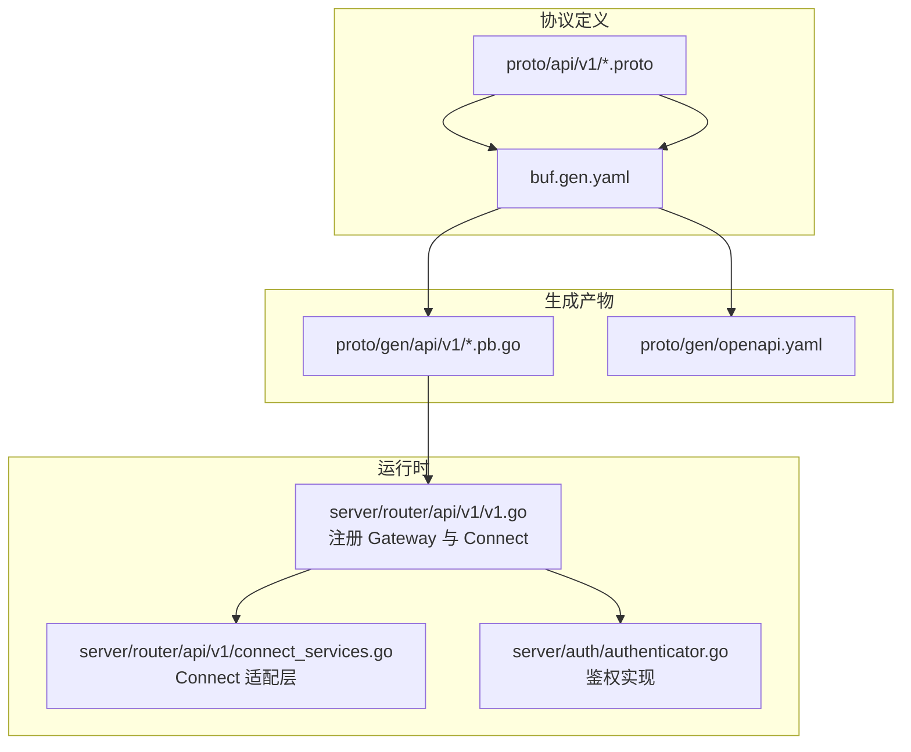
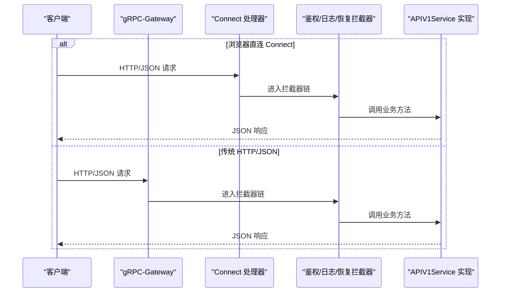
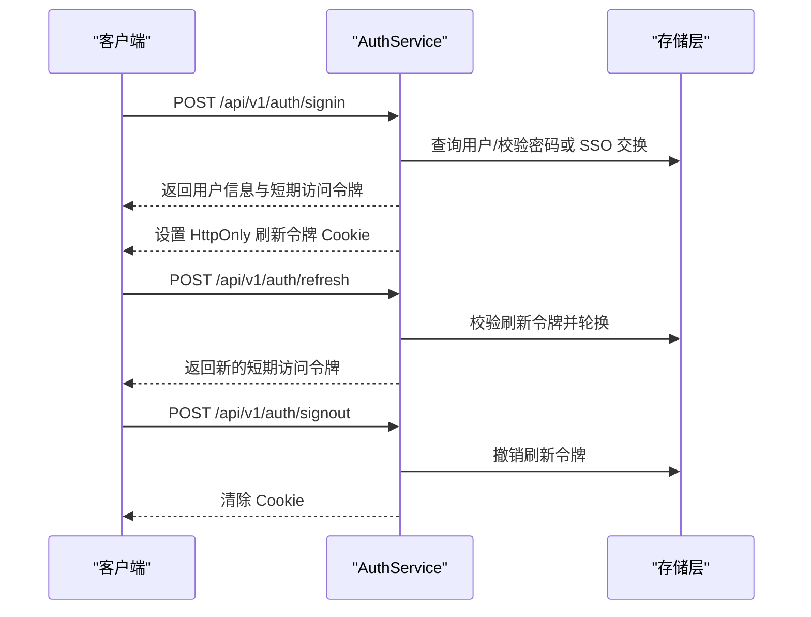
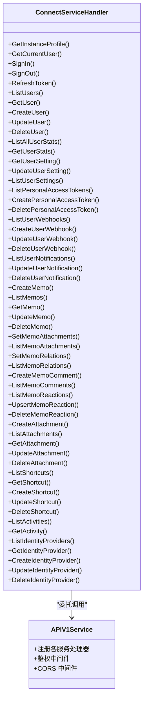
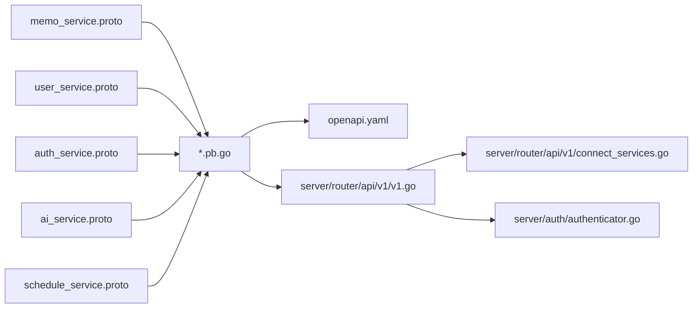

# RESTful API

<cite>
**本文引用的文件**
- [proto/api/v1/README.md](file://proto/api/v1/README.md)
- [buf.gen.yaml](file://proto/buf.gen.yaml)
- [openapi.yaml](file://proto/gen/openapi.yaml)
- [memo_service.proto](file://proto/api/v1/memo_service.proto)
- [user_service.proto](file://proto/api/v1/user_service.proto)
- [auth_service.proto](file://proto/api/v1/auth_service.proto)
- [ai_service.proto](file://proto/api/v1/ai_service.proto)
- [schedule_service.proto](file://proto/api/v1/schedule_service.proto)
- [connect_services.go](file://server/router/api/v1/connect_services.go)
- [v1.go](file://server/router/api/v1/v1.go)
- [auth_service.go](file://server/router/api/v1/auth_service.go)
- [authenticator.go](file://server/auth/authenticator.go)
- [common.pb.go](file://proto/gen/api/v1/common.pb.go)
</cite>

## 目录
1. [简介](#简介)
2. [项目结构](#项目结构)
3. [核心组件](#核心组件)
4. [架构总览](#架构总览)
5. [详细组件分析](#详细组件分析)
6. [依赖分析](#依赖分析)
7. [性能考虑](#性能考虑)
8. [故障排查指南](#故障排查指南)
9. [结论](#结论)
10. [附录](#附录)

## 简介
本文件系统化梳理了基于 gRPC-Gateway 自动生成的 HTTP/JSON RESTful API 规范，覆盖所有 v1 版本端点的 HTTP 方法、URL 路径、请求参数、响应格式与状态码；解释 Connect RPC 与 HTTP/JSON 的映射关系；提供认证头、内容类型与跨域配置说明；并阐述 API 版本控制与向后兼容策略。

## 项目结构
- API 定义位于 proto/api/v1，采用 Google AIP 风格，使用 google.api.http 注解声明 REST 映射。
- 通过 buf 生成器在 proto/buf.gen.yaml 中配置：Go 原生、gRPC、Connect、gRPC-Gateway、OpenAPI（用于生成 openapi.yaml）。
- 运行时在 server/router/api/v1 中注册 gRPC-Gateway 与 Connect 处理器，并统一接入鉴权与 CORS。

图示来源
- [buf.gen.yaml](file://proto/buf.gen.yaml#L1-L31)
- [v1.go](file://server/router/api/v1/v1.go#L120-L237)
- [connect_services.go](file://server/router/api/v1/connect_services.go#L1-L491)
- [authenticator.go](file://server/auth/authenticator.go#L17-L166)

章节来源
- [proto/api/v1/README.md](file://proto/api/v1/README.md#L1-L4)
- [buf.gen.yaml](file://proto/buf.gen.yaml#L1-L31)
- [openapi.yaml](file://proto/gen/openapi.yaml#L1-L800)
- [v1.go](file://server/router/api/v1/v1.go#L1-L238)

## 核心组件
- gRPC-Gateway：将 HTTP/JSON 请求反向代理到 gRPC 服务，自动解析 google.api.http 注解。
- Connect RPC：为浏览器客户端提供更友好的 HTTP/JSON 流式与拦截器支持，服务端通过 ConnectServiceHandler 适配。
- 鉴权中间件：统一处理 Access Token V2（无状态）、Personal Access Token（PAT）与刷新令牌流程。
- CORS：对 /api/v1/* 与 /memos.api.v1.* 分别启用跨域支持。

章节来源
- [v1.go](file://server/router/api/v1/v1.go#L120-L237)
- [connect_services.go](file://server/router/api/v1/connect_services.go#L1-L491)
- [authenticator.go](file://server/auth/authenticator.go#L17-L166)

## 架构总览
HTTP/JSON 请求经由 gRPC-Gateway 或 Connect 进入服务层，统一走鉴权与日志/恢复拦截器，再调用具体业务服务实现。

图示来源
- [v1.go](file://server/router/api/v1/v1.go#L205-L237)
- [connect_services.go](file://server/router/api/v1/connect_services.go#L1-L491)

## 详细组件分析

### 认证与会话（/api/v1/auth/*）
- 终端点
  - GET /api/v1/auth/me：获取当前用户信息（需访问令牌）
  - POST /api/v1/auth/signin：登录，返回用户信息与短期访问令牌，并设置刷新令牌 Cookie
  - POST /api/v1/auth/signout：登出，撤销刷新令牌并清除 Cookie
  - POST /api/v1/auth/refresh：刷新访问令牌，执行刷新令牌轮换（滑动窗口会话）
- 请求与响应
  - SignInRequest 支持密码登录或 SSO 登录；SSO 使用 OAuth2 授权码交换，支持 PKCE
  - 返回 SignInResponse 包含用户信息、短期访问令牌及过期时间
  - RefreshTokenResponse 返回新的短期访问令牌与过期时间
- 鉴权流程
  - 支持 Access Token V2（无状态 JWT）与 Personal Access Token（PAT）
  - 刷新令牌轮换：每次刷新生成新刷新令牌，旧令牌从用户设置中移除
  - Cookie 安全：根据请求是否 HTTPS 设置 Secure 属性与 GMT 过期时间

图示来源
- [auth_service.proto](file://proto/api/v1/auth_service.proto#L13-L46)
- [auth_service.go](file://server/router/api/v1/auth_service.go#L64-L357)
- [authenticator.go](file://server/auth/authenticator.go#L39-L99)

章节来源
- [auth_service.proto](file://proto/api/v1/auth_service.proto#L1-L115)
- [auth_service.go](file://server/router/api/v1/auth_service.go#L1-L613)
- [authenticator.go](file://server/auth/authenticator.go#L1-L166)

### 用户管理（/api/v1/users/*）
- 终端点
  - GET /api/v1/users：分页列出用户
  - GET /api/v1/{name=users/*}：按 ID 或用户名获取用户
  - POST /api/v1/users：创建用户
  - PATCH /api/v1/{user.name=users/*}：更新用户
  - DELETE /api/v1/{name=users/*}：删除用户
  - GET /api/v1/users/:stats：获取全量用户统计
  - GET /api/v1/{name=users/*}:getStats：获取指定用户统计
  - GET /api/v1/{name=users/*/settings/*}：获取用户设置
  - PATCH /api/v1/{setting.name=users/*/settings/*}：更新用户设置
  - GET /api/v1/{parent=users/*}/settings：列出用户设置
  - GET /api/v1/{parent=users/*}/personalAccessTokens：列出个人访问令牌
  - POST /api/v1/{parent=users/*}/personalAccessTokens：创建个人访问令牌
  - DELETE /api/v1/{name=users/*/personalAccessTokens/*}：删除个人访问令牌
  - GET /api/v1/{parent=users/*}/webhooks：列出用户 Webhook
  - POST /api/v1/{parent=users/*}/webhooks：创建用户 Webhook
  - PATCH /api/v1/{webhook.name=users/*/webhooks/*}：更新用户 Webhook
  - DELETE /api/v1/{name=users/*/webhooks/*}：删除用户 Webhook
  - GET /api/v1/{parent=users/*}/notifications：列出用户通知
  - PATCH /api/v1/{notification.name=users/*/notifications/*}：更新用户通知
  - DELETE /api/v1/{name=users/*/notifications/*}：删除用户通知

章节来源
- [user_service.proto](file://proto/api/v1/user_service.proto#L1-L677)

### 备忘录管理（/api/v1/memos/*）
- 终端点
  - POST /api/v1/memos：创建备忘录
  - GET /api/v1/memos：分页列出备忘录
  - GET /api/v1/{name=memos/*}：按资源名获取备忘录
  - PATCH /api/v1/{memo.name=memos/*}：更新备忘录
  - DELETE /api/v1/{name=memos/*}：删除备忘录
  - PATCH /api/v1/{name=memos/*}/attachments：设置备忘录附件
  - GET /api/v1/{name=memos/*}/attachments：列出备忘录附件
  - PATCH /api/v1/{name=memos/*}/relations：设置备忘录关联
  - GET /api/v1/{name=memos/*}/relations：列出备忘录关联
  - POST /api/v1/{name=memos/*}/comments：为备忘录创建评论
  - GET /api/v1/{name=memos/*}/comments：列出备忘录评论
  - GET /api/v1/{name=memos/*}/reactions：列出备忘录反应
  - POST /api/v1/{name=memos/*}/reactions：为备忘录添加/更新反应
  - DELETE /api/v1/{name=memos/*/reactions/*}：删除备忘录反应

章节来源
- [memo_service.proto](file://proto/api/v1/memo_service.proto#L1-L512)

### 附件管理（/api/v1/attachments/*）
- 终端点
  - GET /api/v1/attachments：分页列出附件，支持过滤与排序
  - POST /api/v1/attachments：创建附件
  - GET /api/v1/{attachment}：按资源名获取附件
  - DELETE /api/v1/{attachment}：删除附件
  - PATCH /api/v1/{attachment}：更新附件（FieldMask）

章节来源
- [openapi.yaml](file://proto/gen/openapi.yaml#L384-L554)

### 身份提供商（/api/v1/identity-providers/*）
- 终端点
  - GET /api/v1/identity-providers：列出身份提供商
  - POST /api/v1/identity-providers：创建身份提供商
  - GET /api/v1/{identity-provider}：按资源名获取身份提供商
  - DELETE /api/v1/{identity-provider}：删除身份提供商
  - PATCH /api/v1/{identity-provider}：更新身份提供商（FieldMask）

章节来源
- [openapi.yaml](file://proto/gen/openapi.yaml#L650-L788)

### 实例配置（/api/v1/instance/*）
- 终端点
  - GET /api/v1/instance/profile：获取实例配置概要
  - GET /api/v1/instance/settings：获取实例设置
  - PATCH /api/v1/instance/settings：更新实例设置

章节来源
- [openapi.yaml](file://proto/gen/openapi.yaml#L788-L800)
- [connect_services.go](file://server/router/api/v1/connect_services.go#L16-L41)

### AI 与日程智能（/api/v1/ai/* 与 /api/v1/schedule-agent/*）
- 终端点
  - POST /api/v1/ai/search：语义搜索备忘录
  - POST /api/v1/ai/suggest-tags：为内容建议标签
  - POST /api/v1/ai/chat：聊天流式响应
  - GET /api/v1/{name=memos/*}/related：获取相关备忘录
  - GET /api/v1/ai/parrots：列出可用鹦鹉代理
  - GET /api/v1/ai/parrots/{agent_type}/self-cognition：获取鹦鹉元认知信息
  - GET /api/v1/ai/conversations：列出 AI 会话
  - GET /api/v1/ai/conversations/{id}：获取指定会话
  - POST /api/v1/ai/conversations：创建会话
  - PATCH /api/v1/ai/conversations/{id}：更新会话
  - DELETE /api/v1/ai/conversations/{id}：删除会话
  - POST /api/v1/ai/conversations/{conversation_id}/separator：添加上下文分隔符
  - GET /api/v1/ai/conversations/{conversation_id}/messages：增量同步消息列表
  - POST /api/v1/schedule-agent/chat：非流式日程 Agent 聊天
  - POST /api/v1/schedule-agent/chat/stream：流式日程 Agent 聊天

章节来源
- [ai_service.proto](file://proto/api/v1/ai_service.proto#L1-L371)
- [openapi.yaml](file://proto/gen/openapi.yaml#L72-L384)

### 日程管理（/api/v1/schedules/*）
- 终端点
  - POST /api/v1/schedules：创建日程
  - GET /api/v1/schedules：按条件分页列出日程
  - GET /api/v1/{name=schedules/*}：按资源名获取日程
  - PATCH /api/v1/{schedule.name=schedules/*}：更新日程
  - DELETE /api/v1/{name=schedules/*}：删除日程
  - POST /api/v1/schedules:checkConflict：检查冲突
  - POST /api/v1/schedules:parseAndCreate：自然语言解析并创建日程

章节来源
- [schedule_service.proto](file://proto/api/v1/schedule_service.proto#L1-L166)

### Connect 与 HTTP/JSON 映射
- Connect RPC 通过 ConnectServiceHandler 将 Connect 请求转换为 gRPC 请求，再由 APIV1Service 实现具体逻辑。
- Connect 与 gRPC-Gateway 共存：浏览器直连 Connect（/memos.api.v1.*），服务端注入拦截器；传统 HTTP/JSON 通过 gRPC-Gateway（/api/v1/*）。

图示来源
- [connect_services.go](file://server/router/api/v1/connect_services.go#L1-L491)
- [v1.go](file://server/router/api/v1/v1.go#L23-L118)

章节来源
- [connect_services.go](file://server/router/api/v1/connect_services.go#L1-L491)
- [v1.go](file://server/router/api/v1/v1.go#L120-L237)

## 依赖分析
- 协议层依赖：各 *.proto 文件导入 google.api.annotations 以声明 HTTP 映射。
- 生成层依赖：buf.gen.yaml 指定多插件输出，确保同时生成 Go 原生、gRPC、Connect、gRPC-Gateway 与 OpenAPI。
- 运行时依赖：v1.go 注册 Gateway 与 Connect，注入鉴权与 CORS；connect_services.go 提供 Connect 适配层。

图示来源
- [buf.gen.yaml](file://proto/buf.gen.yaml#L10-L26)
- [v1.go](file://server/router/api/v1/v1.go#L120-L237)
- [connect_services.go](file://server/router/api/v1/connect_services.go#L1-L491)
- [authenticator.go](file://server/auth/authenticator.go#L17-L166)

章节来源
- [buf.gen.yaml](file://proto/buf.gen.yaml#L1-L31)
- [v1.go](file://server/router/api/v1/v1.go#L1-L238)

## 性能考虑
- 并发限制：服务初始化时对缩略图生成设置并发上限，避免内存耗尽。
- 流式响应：AI 聊天与日程 Agent 聊天支持流式传输，降低首字节延迟。
- 分页与过滤：多数列表接口支持分页与过滤，建议客户端合理设置 page_size 与 filter 以减少网络与数据库压力。

章节来源
- [v1.go](file://server/router/api/v1/v1.go#L44-L58)
- [ai_service.proto](file://proto/api/v1/ai_service.proto#L30-L36)

## 故障排查指南
- 认证失败
  - 未携带有效访问令牌或 PAT：返回 401 Unauthorized
  - 刷新令牌无效或已撤销：返回 401 Unauthorized
  - 密码登录失败：返回 400 InvalidArgument
- 会话管理
  - 登出后刷新令牌被撤销：后续刷新请求失败
  - 刷新令牌轮换：旧令牌立即失效，新令牌生效
- CORS 问题
  - /api/v1/* 与 /memos.api.v1.* 已启用 CORS，若仍跨域失败，请确认浏览器发起的预检请求与实际请求头一致
- 错误响应
  - 统一返回标准 JSON 错误体，包含状态码与消息字段

章节来源
- [auth_service.go](file://server/router/api/v1/auth_service.go#L32-L357)
- [v1.go](file://server/router/api/v1/v1.go#L120-L237)

## 结论
本项目通过 proto 定义与 buf 生成器，实现了 gRPC 与 HTTP/JSON 的统一契约；结合 gRPC-Gateway 与 Connect，既满足传统 HTTP/JSON 客户端，也支持现代浏览器直连 Connect 的场景。鉴权体系采用 Access Token V2 与 PAT 双通道，并配合刷新令牌轮换与 Cookie 安全策略，保障安全性与可用性。OpenAPI 文档作为契约补充，便于集成与测试。

## 附录

### 认证与安全
- 访问令牌（Access Token V2）：短生命周期，无状态验证
- 刷新令牌：HttpOnly Cookie，支持轮换与撤销
- 个人访问令牌（PAT）：长生命周期，适合脚本与自动化
- Cookie 安全：根据请求是否 HTTPS 设置 Secure 属性与 GMT 过期时间

章节来源
- [auth_service.proto](file://proto/api/v1/auth_service.proto#L13-L46)
- [auth_service.go](file://server/router/api/v1/auth_service.go#L192-L401)
- [authenticator.go](file://server/auth/authenticator.go#L39-L124)

### 内容类型与跨域
- Content-Type：JSON 请求体使用 application/json
- CORS：对 /api/v1/* 与 /memos.api.v1.* 启用跨域，允许方法与头部可配置

章节来源
- [v1.go](file://server/router/api/v1/v1.go#L205-L234)

### API 版本控制与向后兼容
- 版本前缀：/api/v1/* 表示当前稳定版本
- 向后兼容：遵循 AIP-4233 与 AIP-132 约定，新增字段保持可选，不破坏现有客户端
- OpenAPI：通过 protoc-gen-openapi 生成，作为契约与 SDK 生成依据

章节来源
- [proto/api/v1/README.md](file://proto/api/v1/README.md#L1-L4)
- [buf.gen.yaml](file://proto/buf.gen.yaml#L23-L26)
- [openapi.yaml](file://proto/gen/openapi.yaml#L1-L800)