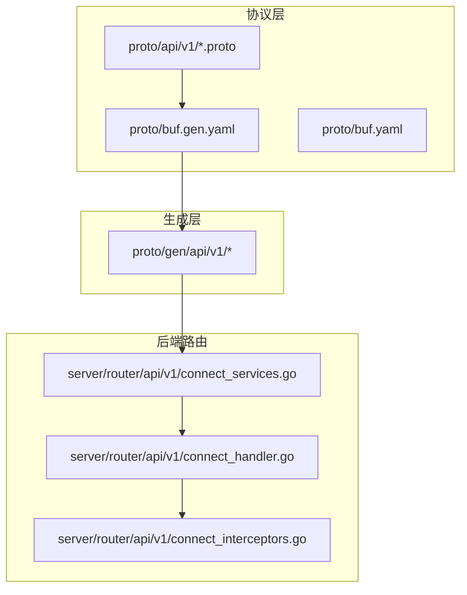
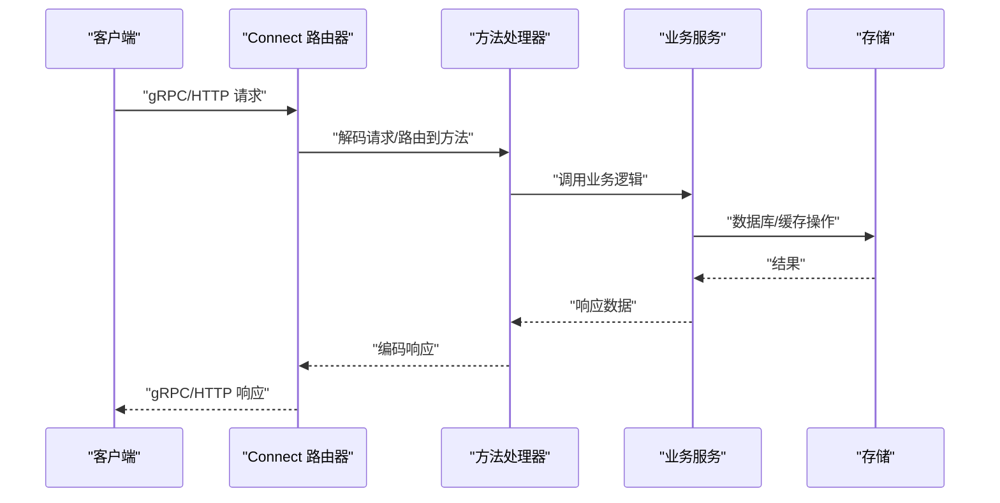
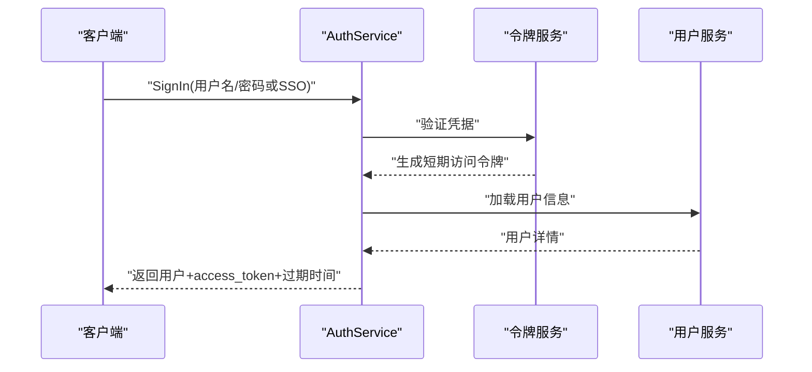
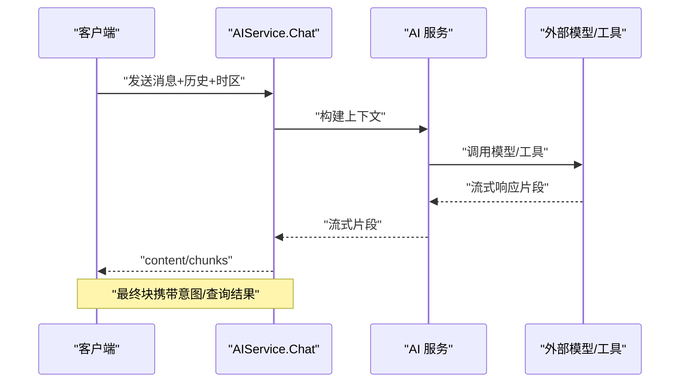
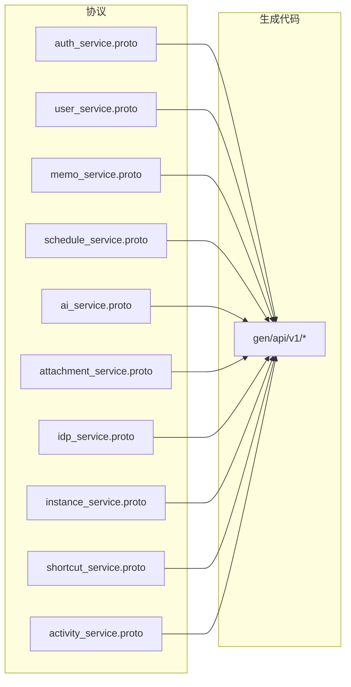

# gRPC API

<cite>
**本文引用的文件**
- [proto/api/v1/README.md](file://proto/api/v1/README.md)
- [proto/README.md](file://proto/README.md)
- [proto/buf.yaml](file://proto/buf.yaml)
- [proto/buf.gen.yaml](file://proto/buf.gen.yaml)
- [proto/api/v1/common.proto](file://proto/api/v1/common.proto)
- [proto/api/v1/auth_service.proto](file://proto/api/v1/auth_service.proto)
- [proto/api/v1/user_service.proto](file://proto/api/v1/user_service.proto)
- [proto/api/v1/memo_service.proto](file://proto/api/v1/memo_service.proto)
- [proto/api/v1/schedule_service.proto](file://proto/api/v1/schedule_service.proto)
- [proto/api/v1/ai_service.proto](file://proto/api/v1/ai_service.proto)
- [proto/api/v1/attachment_service.proto](file://proto/api/v1/attachment_service.proto)
- [proto/api/v1/idp_service.proto](file://proto/api/v1/idp_service.proto)
- [proto/api/v1/instance_service.proto](file://proto/api/v1/instance_service.proto)
- [proto/api/v1/shortcut_service.proto](file://proto/api/v1/shortcut_service.proto)
- [proto/api/v1/activity_service.proto](file://proto/api/v1/activity_service.proto)
- [server/router/api/v1/connect_services.go](file://server/router/api/v1/connect_services.go)
- [server/router/api/v1/connect_handler.go](file://server/router/api/v1/connect_handler.go)
- [server/router/api/v1/connect_interceptors.go](file://server/router/api/v1/connect_interceptors.go)
- [server/router/api/v1/auth_service.go](file://server/router/api/v1/auth_service.go)
- [server/router/api/v1/user_service.go](file://server/router/api/v1/user_service.go)
- [server/router/api/v1/memo_service.go](file://server/router/api/v1/memo_service.go)
- [server/router/api/v1/schedule_service.go](file://server/router/api/v1/schedule_service.go)
- [server/router/api/v1/ai_service.go](file://server/router/api/v1/ai_service.go)
- [server/router/api/v1/attachment_service.go](file://server/router/api/v1/attachment_service.go)
- [server/router/api/v1/idp_service.go](file://server/router/api/v1/idp_service.go)
- [server/router/api/v1/instance_service.go](file://server/router/api/v1/instance_service.go)
- [server/router/api/v1/shortcut_service.go](file://server/router/api/v1/shortcut_service.go)
- [server/router/api/v1/activity_service.go](file://server/router/api/v1/activity_service.go)
- [server/auth/token.go](file://server/auth/token.go)
- [server/auth/authenticator.go](file://server/auth/authenticator.go)
- [server/auth/context.go](file://server/auth/context.go)
- [server/auth/extract.go](file://server/auth/extract.go)
- [server/middleware/rate_limit.go](file://server/middleware/rate_limit.go)
- [server/internal/errors/codes.go](file://server/internal/errors/codes.go)
- [server/server.go](file://server/server.go)
- [web/src/connect.ts](file://web/src/connect.ts)
- [web/src/lib/query-client.ts](file://web/src/lib/query-client.ts)
</cite>

## 目录
1. [简介](#简介)
2. [项目结构](#项目结构)
3. [核心组件](#核心组件)
4. [架构总览](#架构总览)
5. [详细组件分析](#详细组件分析)
6. [依赖关系分析](#依赖关系分析)
7. [性能考量](#性能考量)
8. [故障排查指南](#故障排查指南)
9. [结论](#结论)
10. [附录](#附录)

## 简介
本文件为该项目的 gRPC API 文档，基于 Protocol Buffers 定义的服务接口与消息格式，覆盖以下服务：
- 认证与用户管理：AuthService、UserService
- 内容与附件：MemoService、AttachmentService、ActivityService
- 实例与设置：InstanceService、IdentityProviderService、ShortcutService
- AI 与日程：AIService、ScheduleService

文档内容包括：
- 所有 gRPC 服务的方法签名、参数类型、返回值类型与错误处理
- 流式 RPC（服务器推送）与非流式调用的区别
- 客户端连接、认证与负载均衡的配置要点
- Protobuf 消息序列化与反序列化的实现与注意事项

## 项目结构
该仓库采用“协议在前、生成代码在后”的设计模式：
- 协议定义位于 proto/api/v1 下，遵循 Google AIP 规范
- 使用 buf 工具链进行格式化、校验与代码生成
- 生成的 Go 代码位于 proto/gen 下，同时生成 connect、grpc、gateway、openapi 等多种适配层
- 后端通过 Connect RPC 路由器暴露 gRPC/HTTP 接口，并集成鉴权、限流等中间件

图表来源
- [proto/buf.gen.yaml](file://proto/buf.gen.yaml#L1-L31)
- [proto/buf.yaml](file://proto/buf.yaml#L1-L20)
- [server/router/api/v1/connect_services.go](file://server/router/api/v1/connect_services.go)
- [server/router/api/v1/connect_handler.go](file://server/router/api/v1/connect_handler.go)
- [server/router/api/v1/connect_interceptors.go](file://server/router/api/v1/connect_interceptors.go)

章节来源
- [proto/api/v1/README.md](file://proto/api/v1/README.md#L1-L4)
- [proto/README.md](file://proto/README.md#L1-L18)
- [proto/buf.gen.yaml](file://proto/buf.gen.yaml#L1-L31)
- [proto/buf.yaml](file://proto/buf.yaml#L1-L20)

## 核心组件
- 协议与生成
  - 使用 buf lint 与 breaking 规则保证演进安全
  - 生成插件包括：protoc-gen-go、protoc-gen-go-grpc、protoc-gen-connect-go、protoc-gen-connect-gateway、OpenAPI
- 路由与适配
  - 通过 Connect RPC 将 gRPC 方法映射到 HTTP/1.1 或 HTTP/2，支持 gzip 压缩与 CORS
  - 集成鉴权中间件与速率限制中间件
- 错误码
  - 统一使用 server/internal/errors/codes.go 中的错误码常量，便于客户端识别与处理

章节来源
- [proto/buf.yaml](file://proto/buf.yaml#L1-L20)
- [proto/buf.gen.yaml](file://proto/buf.gen.yaml#L1-L31)
- [server/router/api/v1/connect_interceptors.go](file://server/router/api/v1/connect_interceptors.go)
- [server/internal/errors/codes.go](file://server/internal/errors/codes.go)

## 架构总览
下图展示了从客户端到服务端的典型交互路径，以及 Connect RPC 的适配层。

图表来源
- [server/router/api/v1/connect_handler.go](file://server/router/api/v1/connect_handler.go)
- [server/router/api/v1/connect_services.go](file://server/router/api/v1/connect_services.go)
- [server/server.go](file://server/server.go)

## 详细组件分析

### 认证与用户管理

#### AuthService
- 方法
  - GetCurrentUser(GetCurrentUserRequest) -> GetCurrentUserResponse
  - SignIn(SignInRequest) -> SignInResponse
  - SignOut(SignOutRequest) -> Empty
  - RefreshToken(RefreshTokenRequest) -> RefreshTokenResponse
- 关键字段
  - SignInRequest 支持 PasswordCredentials 或 SSOCredentials（oneof）
  - 返回的 SignInResponse 包含 access_token 与过期时间
- 错误处理
  - 验证失败、令牌无效、会话不存在等情况返回统一错误码

图表来源
- [proto/api/v1/auth_service.proto](file://proto/api/v1/auth_service.proto#L13-L115)
- [server/router/api/v1/auth_service.go](file://server/router/api/v1/auth_service.go)

章节来源
- [proto/api/v1/auth_service.proto](file://proto/api/v1/auth_service.proto#L13-L115)
- [server/router/api/v1/auth_service.go](file://server/router/api/v1/auth_service.go)

#### UserService
- 方法
  - ListUsers/ListUserStats/ListPersonalAccessTokens/ListUserWebhooks/ListUserNotifications
  - GetUser/CreateUser/UpdateUser/DeleteUser
  - GetUserSetting/UpdateUserSetting/ListUserSettings
  - CreateUserWebhook/UpdateUserWebhook/DeleteUserWebhook
  - UpdateUserNotification/DeleteUserNotification
- 资源命名
  - 用户资源名格式：users/{user}
  - 支持 FieldMask 更新与分页查询
- 错误处理
  - 资源不存在、权限不足、字段不合法等返回对应错误码

章节来源
- [proto/api/v1/user_service.proto](file://proto/api/v1/user_service.proto#L16-L159)
- [server/router/api/v1/user_service.go](file://server/router/api/v1/user_service.go)

### 内容与附件

#### MemoService
- 方法
  - CreateMemo/ListMemos/GetMemo/UpdateMemo/DeleteMemo
  - SetMemoAttachments/ListMemoAttachments
  - SetMemoRelations/ListMemoRelations
  - CreateMemoComment/ListMemoComments
  - ListMemoReactions/UpsertMemoReaction/DeleteMemoReaction
- 关键字段
  - Memo.content 为 Markdown；Visibility 支持 PRIVATE/PROTECTED/PUBLIC
  - Reaction 与 MemoRelation 关联
- 错误处理
  - 资源不存在、关联数据存在、字段非法等

章节来源
- [proto/api/v1/memo_service.proto](file://proto/api/v1/memo_service.proto#L17-L106)
- [server/router/api/v1/memo_service.go](file://server/router/api/v1/memo_service.go)

#### AttachmentService
- 方法
  - CreateAttachment/ListAttachments/GetAttachment/UpdateAttachment/DeleteAttachment
- 关键字段
  - Attachment 支持 content 或 external_link；可选关联 memo
- 错误处理
  - 文件大小超限、MIME 类型不匹配、资源不存在等

章节来源
- [proto/api/v1/attachment_service.proto](file://proto/api/v1/attachment_service.proto#L15-L151)
- [server/router/api/v1/attachment_service.go](file://server/router/api/v1/attachment_service.go)

#### ActivityService
- 方法
  - ListActivities/GetActivity
- 关键字段
  - Activity.payload 支持不同事件类型的负载
- 错误处理
  - 资源不存在、分页参数非法等

章节来源
- [proto/api/v1/activity_service.proto](file://proto/api/v1/activity_service.proto#L13-L126)
- [server/router/api/v1/activity_service.go](file://server/router/api/v1/activity_service.go)

### 实例与设置

#### InstanceService
- 方法
  - GetInstanceProfile/GetInstanceSetting/UpdateInstanceSetting
- 关键字段
  - InstanceSetting 支持 General/Storage/MemoRelated 三类设置
  - StorageSetting 支持 DATABASE/LOCAL/S3，S3Config 可配置云存储

章节来源
- [proto/api/v1/instance_service.proto](file://proto/api/v1/instance_service.proto#L13-L181)
- [server/router/api/v1/instance_service.go](file://server/router/api/v1/instance_service.go)

#### IdentityProviderService
- 方法
  - ListIdentityProviders/GetIdentityProvider/CreateIdentityProvider/UpdateIdentityProvider/DeleteIdentityProvider
- 关键字段
  - OAuth2Config 支持 client_id/secret、授权/令牌/用户信息端点、scopes、字段映射

章节来源
- [proto/api/v1/idp_service.proto](file://proto/api/v1/idp_service.proto#L14-L148)
- [server/router/api/v1/idp_service.go](file://server/router/api/v1/idp_service.go)

#### ShortcutService
- 方法
  - ListShortcuts/GetShortcut/CreateShortcut/UpdateShortcut/DeleteShortcut
- 关键字段
  - Shortcut.filter 为过滤表达式，支持用户快捷筛选

章节来源
- [proto/api/v1/shortcut_service.proto](file://proto/api/v1/shortcut_service.proto#L14-L125)
- [server/router/api/v1/shortcut_service.go](file://server/router/api/v1/shortcut_service.go)

### AI 与日程

#### AIService
- 方法
  - SemanticSearch/SuggestTags/Chat/GetRelatedMemos
  - ListAIConversations/GetAIConversation/CreateAIConversation/UpdateAIConversation/DeleteAIConversation
  - AddContextSeparator/ListMessages
- 流式 RPC
  - Chat 返回 stream ChatResponse，支持增量内容与事件信号
- 关键字段
  - ChatRequest 支持 AgentType、ScheduleQueryMode、历史对话
  - ChatResponse 支持 sources 引用、done 结束标记、最终块携带意图检测结果

图表来源
- [proto/api/v1/ai_service.proto](file://proto/api/v1/ai_service.proto#L13-L110)
- [proto/api/v1/ai_service.proto](file://proto/api/v1/ai_service.proto#L195-L291)
- [server/router/api/v1/ai_service.go](file://server/router/api/v1/ai_service.go)

章节来源
- [proto/api/v1/ai_service.proto](file://proto/api/v1/ai_service.proto#L13-L110)
- [proto/api/v1/ai_service.proto](file://proto/api/v1/ai_service.proto#L195-L291)
- [server/router/api/v1/ai_service.go](file://server/router/api/v1/ai_service.go)

#### ScheduleService
- 方法
  - CreateSchedule/ListSchedules/GetSchedule/UpdateSchedule/DeleteSchedule
  - CheckConflict/ParseAndCreateSchedule
- 关键字段
  - Schedule 支持 recurrence_rule（JSON 字符串）、timezone、reminders
  - ParseAndCreateSchedule 支持 auto_confirm 与冲突返回

章节来源
- [proto/api/v1/schedule_service.proto](file://proto/api/v1/schedule_service.proto#L12-L166)
- [server/router/api/v1/schedule_service.go](file://server/router/api/v1/schedule_service.go)

## 依赖关系分析

图表来源
- [proto/api/v1/auth_service.proto](file://proto/api/v1/auth_service.proto#L1-L115)
- [proto/api/v1/user_service.proto](file://proto/api/v1/user_service.proto#L1-L677)
- [proto/api/v1/memo_service.proto](file://proto/api/v1/memo_service.proto#L1-L512)
- [proto/api/v1/schedule_service.proto](file://proto/api/v1/schedule_service.proto#L1-L166)
- [proto/api/v1/ai_service.proto](file://proto/api/v1/ai_service.proto#L1-L371)
- [proto/api/v1/attachment_service.proto](file://proto/api/v1/attachment_service.proto#L1-L151)
- [proto/api/v1/idp_service.proto](file://proto/api/v1/idp_service.proto#L1-L148)
- [proto/api/v1/instance_service.proto](file://proto/api/v1/instance_service.proto#L1-L181)
- [proto/api/v1/shortcut_service.proto](file://proto/api/v1/shortcut_service.proto#L1-L125)
- [proto/api/v1/activity_service.proto](file://proto/api/v1/activity_service.proto#L1-L126)

章节来源
- [proto/buf.gen.yaml](file://proto/buf.gen.yaml#L10-L25)

## 性能考量
- 分页与过滤
  - 多数列表接口支持 page_size/page_token/filter/order_by，建议合理设置 page_size 并复用分页令牌
- 序列化开销
  - Protobuf 二进制序列化较 JSON 更紧凑；结合 gzip 压缩可进一步降低带宽
- 流式传输
  - Chat 等流式接口适合长文本生成与实时反馈，注意客户端缓冲与背压处理
- 缓存策略
  - 对只读列表与静态资源可引入 CDN 与本地缓存，减少后端压力
- 连接复用
  - gRPC/HTTP2 复用连接，减少握手开销；客户端应保持长连接

## 故障排查指南
- 常见错误码
  - 参考 server/internal/errors/codes.go，统一错误语义
- 鉴权问题
  - 确认 access_token 未过期；刷新令牌流程是否正确；Cookie/Authorization 头是否一致
- 资源不存在
  - 检查资源名格式（users/{user}、memos/{memo} 等）与权限范围
- 参数校验
  - 字段行为标注（REQUIRED/OPTIONAL/INPUT_ONLY/OUTPUT_ONLY）与 FieldMask 使用是否正确
- 速率限制
  - 检查 server/middleware/rate_limit.go 的策略配置，避免触发限流

章节来源
- [server/internal/errors/codes.go](file://server/internal/errors/codes.go)
- [server/middleware/rate_limit.go](file://server/middleware/rate_limit.go)

## 结论
本项目的 gRPC API 以 Protocol Buffers 为核心，配合 Connect RPC 提供了高性能、强类型、跨语言的后端接口。通过清晰的资源命名、严格的字段行为标注与统一的错误码体系，既保证了 API 的一致性，也为前端与第三方客户端提供了稳定可靠的集成基础。建议在生产环境中启用 TLS、合理的超时与重试策略，并结合监控与日志完善可观测性。

## 附录

### 流式 RPC、双向流与单次调用
- 单次调用（Unary）
  - 客户端发送一次请求，服务端返回一次响应
  - 示例：AuthService.SignIn、MemoService.GetMemo
- 服务器端流式（ServerStreaming）
  - 客户端发送请求，服务端持续返回多个响应片段
  - 示例：AIService.Chat
- 客户端/双向流
  - 本项目未使用客户端流式或双向流；如需扩展可在 proto 中声明

章节来源
- [proto/api/v1/ai_service.proto](file://proto/api/v1/ai_service.proto#L31-L36)
- [proto/api/v1/ai_service.proto](file://proto/api/v1/ai_service.proto#L123-L129)

### Protobuf 消息序列化与反序列化
- 生成代码
  - 通过 buf 生成 protoc-gen-go 与 protoc-gen-go-grpc，确保消息与服务桩代码一致
- 编解码流程
  - 客户端：构造消息 -> Protobuf 编码 -> HTTP/2 或 gRPC 传输
  - 服务端：接收字节流 -> Protobuf 解码 -> 业务处理 -> 编码响应
- 注意事项
  - 字段行为标注（REQUIRED/OPTIONAL/INPUT_ONLY/OUTPUT_ONLY）决定编解码与校验规则
  - oneof 字段仅允许设置一个子字段
  - 时间戳使用 google.protobuf.Timestamp，注意时区与纳秒精度

章节来源
- [proto/buf.gen.yaml](file://proto/buf.gen.yaml#L10-L25)
- [proto/api/v1/common.proto](file://proto/api/v1/common.proto#L1-L24)
- [proto/api/v1/ai_service.proto](file://proto/api/v1/ai_service.proto#L195-L204)

### 客户端连接、认证与负载均衡
- 连接与拦截器
  - Connect 客户端通过 server/router/api/v1/connect_interceptors.go 注入鉴权与限流
- 认证
  - 使用 access_token（Bearer）或 Cookie（刷新令牌场景）
  - 令牌生成与校验参考 server/auth/token.go、server/auth/authenticator.go、server/auth/context.go、server/auth/extract.go
- 负载均衡
  - 建议在网关/反向代理层启用健康检查与轮询策略；gRPC 客户端可配置重试与超时
- 前端示例
  - web/src/connect.ts 与 web/src/lib/query-client.ts 展示了如何初始化 Connect 客户端与缓存策略

章节来源
- [server/router/api/v1/connect_interceptors.go](file://server/router/api/v1/connect_interceptors.go)
- [server/auth/token.go](file://server/auth/token.go)
- [server/auth/authenticator.go](file://server/auth/authenticator.go)
- [server/auth/context.go](file://server/auth/context.go)
- [server/auth/extract.go](file://server/auth/extract.go)
- [web/src/connect.ts](file://web/src/connect.ts)
- [web/src/lib/query-client.ts](file://web/src/lib/query-client.ts)