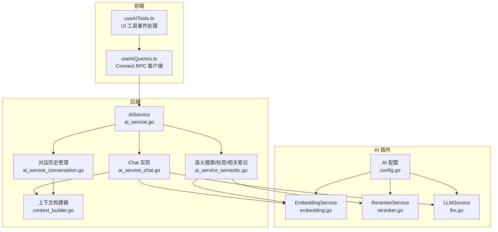
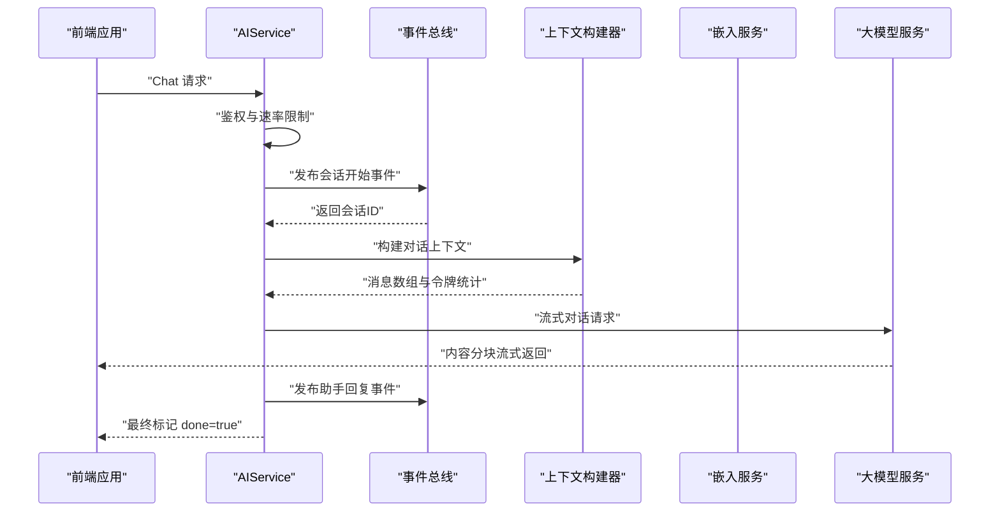
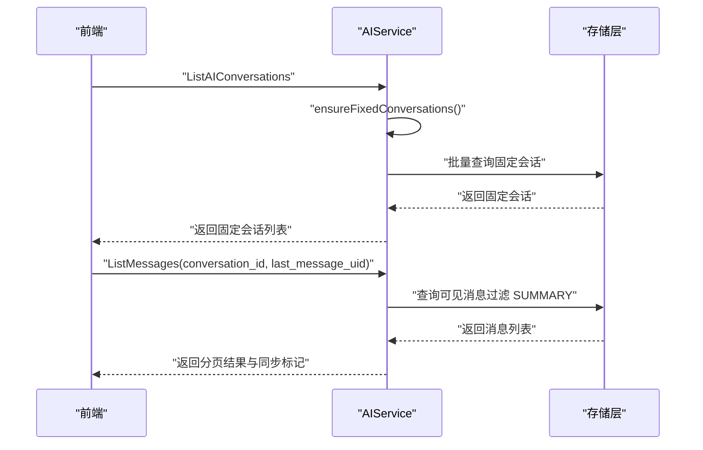
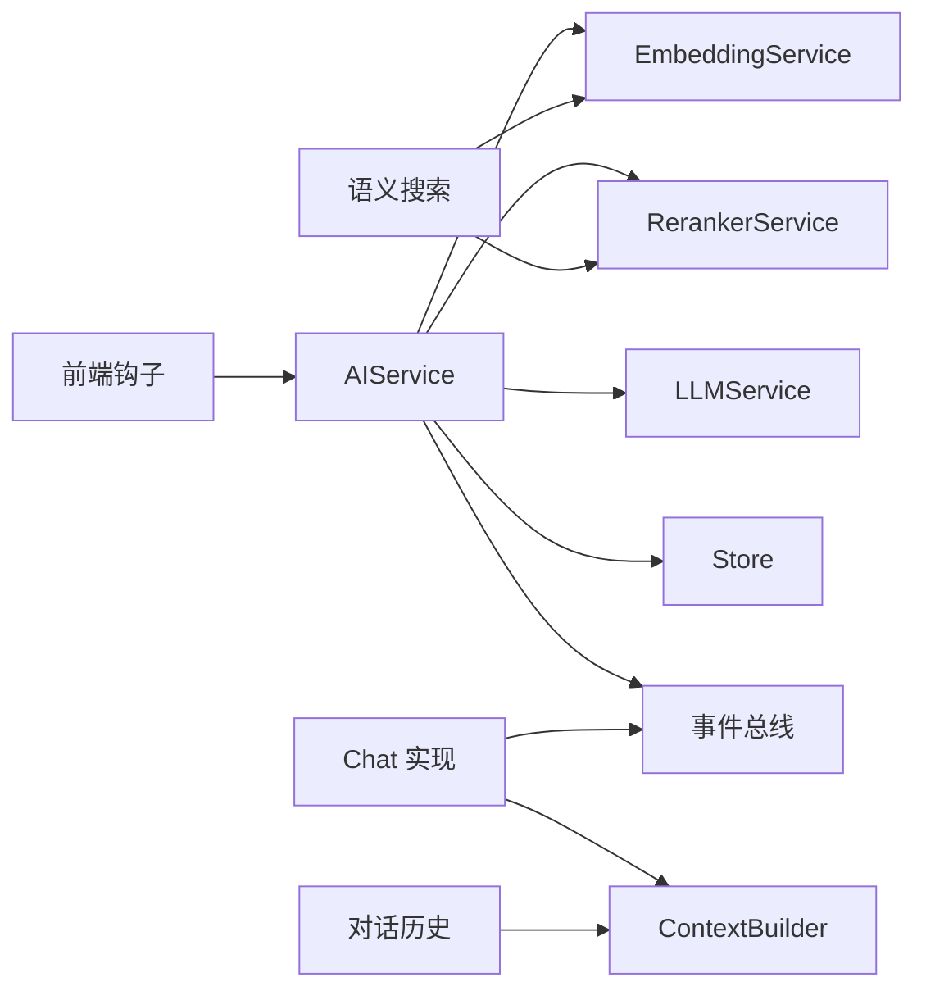

# AI 服务 API

<cite>
**本文引用的文件**
- [ai_service.proto](file://proto/api/v1/ai_service.proto)
- [ai_service.go](file://server/router/api/v1/ai_service.go)
- [ai_service_chat.go](file://server/router/api/v1/ai_service_chat.go)
- [ai_service_semantic.go](file://server/router/api/v1/ai_service_semantic.go)
- [ai_service_conversation.go](file://server/router/api/v1/ai_service_conversation.go)
- [context_builder.go](file://server/router/api/v1/ai/context_builder.go)
- [config.go](file://plugin/ai/config.go)
- [embedding.go](file://plugin/ai/embedding.go)
- [llm.go](file://plugin/ai/llm.go)
- [reranker.go](file://plugin/ai/reranker.go)
- [useAIQueries.ts](file://web/src/hooks/useAIQueries.ts)
- [useAITools.ts](file://web/src/hooks/useAITools.ts)
- [AI-013-chat-api.md](file://docs/specs/AI-013-chat-api.md)
- [AI-012-semantic-search-api.md](file://docs/specs/AI-012-semantic-search-api.md)
- [AI-008-embedding-service.md](file://docs/specs/AI-008-embedding-service.md)
- [AI-009-reranker-service.md](file://docs/specs/AI-009-reranker-service.md)
</cite>

## 目录
1. [简介](#简介)
2. [项目结构](#项目结构)
3. [核心组件](#核心组件)
4. [架构总览](#架构总览)
5. [详细组件分析](#详细组件分析)
6. [依赖关系分析](#依赖关系分析)
7. [性能考虑](#性能考虑)
8. [故障排查指南](#故障排查指南)
9. [结论](#结论)
10. [附录](#附录)

## 简介
本文件面向开发者与运维人员，系统化梳理 AI 服务 API 的设计与实现，覆盖以下能力：
- 对话服务：支持流式响应、消息上下文构建、会话状态维护与摘要触发
- 语义搜索服务：向量检索、重排序与结果截断
- 对话历史管理：固定会话、消息分页、增量同步与上下文分隔符
- 配置与集成：嵌入模型、重排序器、大模型服务的配置与验证
- 错误处理与性能优化：速率限制、超时保护、降级策略
- 前端调用示例与最佳实践：流式消费、事件解析与 UI 工具集成

## 项目结构
AI 服务由后端 gRPC/HTTP 服务、插件化的 AI 能力模块、数据库持久层与前端查询钩子组成。核心目录与职责如下：
- proto/api/v1/ai_service.proto：定义 AIService 与 ScheduleAgentService 的协议与消息类型
- server/router/api/v1/ai_service*.go：AIService 的 HTTP/gRPC 实现，包括对话、语义搜索、对话历史管理
- server/router/api/v1/ai/context_builder.go：对话上下文构建器，负责 SEPARATOR 过滤、令牌限制与合并待持久化消息
- plugin/ai/*：AI 能力插件，包括嵌入、重排序、大模型服务
- web/src/hooks/useAIQueries.ts、useAITools.ts：前端 Connect RPC 查询钩子与工具事件处理
- docs/specs/*：AI 功能的规格说明与验收标准

图表来源
- [ai_service.go](file://server/router/api/v1/ai_service.go#L21-L43)
- [ai_service_chat.go](file://server/router/api/v1/ai_service_chat.go#L58-L206)
- [ai_service_semantic.go](file://server/router/api/v1/ai_service_semantic.go#L16-L131)
- [ai_service_conversation.go](file://server/router/api/v1/ai_service_conversation.go#L24-L77)
- [context_builder.go](file://server/router/api/v1/ai/context_builder.go#L61-L224)
- [embedding.go](file://plugin/ai/embedding.go#L11-L102)
- [reranker.go](file://plugin/ai/reranker.go#L20-L126)
- [llm.go](file://plugin/ai/llm.go#L20-L326)
- [config.go](file://plugin/ai/config.go#L9-L128)

章节来源
- [ai_service.proto](file://proto/api/v1/ai_service.proto#L13-L110)
- [ai_service.go](file://server/router/api/v1/ai_service.go#L21-L74)

## 核心组件
- AIService：AI 能力聚合入口，持有 EmbeddingService、RerankerService、LLMService 与 AdaptiveRetriever；提供 RateLimiter、全局初始化与用户鉴权
- Chat 实现：流式对话处理，事件总线驱动会话持久化，上下文构建器保障 SEPARATOR 过滤与令牌限制
- 语义搜索：查询向量化 → 向量检索 → 低相关过滤 → 可选重排序 → 结果截断 → 响应构建
- 对话历史管理：固定会话保证、消息分页与增量同步、上下文分隔符、摘要触发
- 上下文构建器：合并已持久化与待持久化消息，按 SEPARATOR 分割，按令牌数与消息数裁剪
- AI 插件：嵌入、重排序、大模型服务，支持多供应商配置与校验

章节来源
- [ai_service.go](file://server/router/api/v1/ai_service.go#L21-L74)
- [ai_service_chat.go](file://server/router/api/v1/ai_service_chat.go#L58-L206)
- [ai_service_semantic.go](file://server/router/api/v1/ai_service_semantic.go#L16-L131)
- [ai_service_conversation.go](file://server/router/api/v1/ai_service_conversation.go#L24-L77)
- [context_builder.go](file://server/router/api/v1/ai/context_builder.go#L61-L224)
- [embedding.go](file://plugin/ai/embedding.go#L11-L102)
- [reranker.go](file://plugin/ai/reranker.go#L20-L126)
- [llm.go](file://plugin/ai/llm.go#L20-L326)
- [config.go](file://plugin/ai/config.go#L9-L128)

## 架构总览
AI 服务采用“协议定义 + 服务实现 + 插件化能力 + 数据持久”的分层架构。前端通过 Connect RPC 调用后端 gRPC/HTTP 接口，后端在 AIService 中协调 AI 插件与存储层，结合事件总线完成会话持久化与摘要生成。

图表来源
- [ai_service_chat.go](file://server/router/api/v1/ai_service_chat.go#L58-L206)
- [context_builder.go](file://server/router/api/v1/ai/context_builder.go#L95-L224)
- [llm.go](file://plugin/ai/llm.go#L198-L269)

## 详细组件分析

### 对话服务（流式响应与上下文管理）
- 流式响应：后端通过 LLMService.ChatStream 提供分块内容，前端逐块拼接并渲染；最终发送 done=true 标记
- 上下文管理：ContextBuilder 合并已持久化与待持久化消息，仅保留 SEPARATOR 之后的 MESSAGE 类型内容，并按令牌数与消息数裁剪
- 会话状态：通过事件总线在 ChatEvent 中记录会话开始、用户消息、助手回复等；支持临时会话与固定会话
- 速率限制：全局 AIService 级别 RateLimiter，按用户维度限流
- 时间区：若未提供或无效则回退默认时区

图表来源
- [ai_service_chat.go](file://server/router/api/v1/ai_service_chat.go#L58-L206)
- [context_builder.go](file://server/router/api/v1/ai/context_builder.go#L95-L224)
- [llm.go](file://plugin/ai/llm.go#L198-L269)

章节来源
- [ai_service_chat.go](file://server/router/api/v1/ai_service_chat.go#L58-L206)
- [context_builder.go](file://server/router/api/v1/ai/context_builder.go#L95-L224)
- [llm.go](file://plugin/ai/llm.go#L198-L269)

### 语义搜索服务（查询处理、结果排序与相关性评分）
- 查询处理：参数校验（最小长度、最大长度）、limit 限制（1-50）
- 向量检索：EmbeddingService 将查询向量化，Store.VectorSearch 返回 TopK 结果
- 相关性过滤：阈值过滤（score ≥ 0.5），避免低相关结果进入后续流程
- 重排序：可选启用 RerankerService，按相关性分数排序并截断至 limit
- 响应构建：截断内容片段（≤200 字），返回 name、snippet、score

图表来源
- [ai_service_semantic.go](file://server/router/api/v1/ai_service_semantic.go#L16-L131)
- [embedding.go](file://plugin/ai/embedding.go#L60-L98)
- [reranker.go](file://plugin/ai/reranker.go#L59-L126)

章节来源
- [ai_service_semantic.go](file://server/router/api/v1/ai_service_semantic.go#L16-L131)
- [embedding.go](file://plugin/ai/embedding.go#L60-L98)
- [reranker.go](file://plugin/ai/reranker.go#L59-L126)

### 对话历史管理（固定会话、消息分页与增量同步）
- 固定会话：首次列出对话时自动确保用户拥有三类固定会话（Memo、Schedule、Amazing），用于展示不同代理能力
- 消息分页：支持 limit 与 last_message_uid 的增量加载；隐藏 SUMMARY 类型消息；计算 total_count（不计 SEPARATOR/SUMMARY）
- 上下文分隔符：支持添加 --- 分隔符以清空上下文；重复添加幂等
- 会话操作：创建、更新（含置顶）、删除（禁止删除固定会话）

图表来源
- [ai_service_conversation.go](file://server/router/api/v1/ai_service_conversation.go#L24-L77)
- [ai_service_conversation.go](file://server/router/api/v1/ai_service_conversation.go#L404-L519)

章节来源
- [ai_service_conversation.go](file://server/router/api/v1/ai_service_conversation.go#L24-L77)
- [ai_service_conversation.go](file://server/router/api/v1/ai_service_conversation.go#L404-L519)

### AI 插件与配置
- 配置项：是否启用、嵌入模型与维度、重排序器开关与模型、大模型提供商与参数（温度、最大 token）
- 嵌入服务：支持 SiliconFlow、OpenAI、Ollama，统一接口 Embed/EmbedBatch/Dimensions
- 重排序服务：调用 SiliconFlow rerank API，禁用时返回原始顺序
- 大模型服务：支持同步与流式对话，带超时保护与工具调用能力

章节来源
- [config.go](file://plugin/ai/config.go#L9-L128)
- [embedding.go](file://plugin/ai/embedding.go#L11-L102)
- [reranker.go](file://plugin/ai/reranker.go#L20-L126)
- [llm.go](file://plugin/ai/llm.go#L20-L326)

## 依赖关系分析
- AIService 依赖插件化 AI 能力与存储层，通过事件总线解耦会话持久化与对话处理
- Chat 实现依赖 ContextBuilder 与 LLMService，上游可能依赖 AdaptiveRetriever（在工厂中创建）
- 语义搜索依赖 EmbeddingService 与 RerankerService，以及 Store.VectorSearch
- 前端通过 Connect RPC 客户端调用 AIService，使用 React Query 管理缓存与并发

图表来源
- [ai_service.go](file://server/router/api/v1/ai_service.go#L21-L43)
- [ai_service_chat.go](file://server/router/api/v1/ai_service_chat.go#L188-L206)
- [ai_service_semantic.go](file://server/router/api/v1/ai_service_semantic.go#L16-L131)
- [ai_service_conversation.go](file://server/router/api/v1/ai_service_conversation.go#L24-L77)
- [useAIQueries.ts](file://web/src/hooks/useAIQueries.ts#L1-L331)

章节来源
- [ai_service.go](file://server/router/api/v1/ai_service.go#L21-L43)
- [useAIQueries.ts](file://web/src/hooks/useAIQueries.ts#L1-L331)

## 性能考虑
- 速率限制：全局 AIService 级别 RateLimiter，按用户维度限流，防止滥用
- 超时保护：LLM 同步/流式调用均设置超时，避免长时间占用资源
- 上下文裁剪：ContextBuilder 按令牌数与消息数裁剪，减少上下文长度，提高响应速度
- 语义搜索优化：向量检索 TopK、阈值过滤、可选重排序，平衡召回与精度
- 前端缓存：React Query 为搜索与相关笔记设置合理的 staleTime，降低重复请求

章节来源
- [ai_service_chat.go](file://server/router/api/v1/ai_service_chat.go#L77-L79)
- [llm.go](file://plugin/ai/llm.go#L106-L128)
- [llm.go](file://plugin/ai/llm.go#L198-L269)
- [context_builder.go](file://server/router/api/v1/ai/context_builder.go#L187-L195)
- [useAIQueries.ts](file://web/src/hooks/useAIQueries.ts#L28-L41)

## 故障排查指南
- 未授权访问：检查鉴权头与用户上下文，确认用户存在
- AI 功能不可用：检查 EmbeddingService 是否启用；LLM 功能需同时启用 LLMService
- 速率限制：观察 ResourceExhausted 错误，调整客户端重试策略或等待配额恢复
- 流式传输异常：前端侧检查 AbortError（超时）与 EOF；后端日志记录接收错误与完成原因
- 上下文为空：确认是否存在 SEPARATOR 导致上下文被清空；必要时移除分隔符或调整历史
- 语义搜索无结果：检查查询长度、阈值过滤与重排序器状态；尝试增大 limit 或关闭重排序

章节来源
- [ai_service_chat.go](file://server/router/api/v1/ai_service_chat.go#L71-L79)
- [ai_service_semantic.go](file://server/router/api/v1/ai_service_semantic.go#L18-L49)
- [useAIQueries.ts](file://web/src/hooks/useAIQueries.ts#L293-L316)

## 结论
本 AI 服务 API 通过清晰的协议定义、可插拔的 AI 能力与完善的上下文管理，提供了从语义搜索到流式对话再到历史管理的一体化解决方案。配合前端 Connect RPC 与 React Query，实现了高性能、可扩展且易用的 AI 能力接入路径。建议在生产环境中启用速率限制、合理配置重排序器与上下文窗口，并持续监控流式传输与超时情况。

## 附录

### API 定义概览（按服务）
- AIService
  - 语义搜索：SemanticSearch（POST /api/v1/ai/search）
  - 标签建议：SuggestTags（POST /api/v1/ai/suggest-tags）
  - 对话：Chat（POST /api/v1/ai/chat，流式）
  - 相关笔记：GetRelatedMemos（GET /api/v1/{name=memos/*}/related）
  - 代理认知：GetParrotSelfCognition（GET /api/v1/ai/parrots/{agent_type}/self-cognition）
  - 代理列表：ListParrots（GET /api/v1/ai/parrots）
  - 会话管理：ListAIConversations、GetAIConversation、CreateAIConversation、UpdateAIConversation、DeleteAIConversation
  - 上下文分隔符：AddContextSeparator（POST /api/v1/ai/conversations/{conversation_id}/separator）
  - 消息列表：ListMessages（GET /api/v1/ai/conversations/{conversation_id}/messages）

- ScheduleAgentService
  - 非流式对话：Chat（POST /api/v1/schedule-agent/chat）
  - 流式对话：ChatStream（POST /api/v1/schedule-agent/chat/stream）

章节来源
- [ai_service.proto](file://proto/api/v1/ai_service.proto#L13-L130)

### 前端调用示例与最佳实践
- 语义搜索：使用 useSemanticSearch，query 长度需大于 2；设置合理的 staleTime
- 标签建议：使用 useSuggestTags，限制数量（1-10）
- 相关笔记：使用 useRelatedMemos，name 格式为 memos/{uid}
- 对话流式：使用 useChat.stream，监听 onContent、onSources、onDone、onError；设置 5 分钟超时；解析 scheduleIntent 与 scheduleQueryResult
- UI 工具事件：使用 useAITools，解析 ui_schedule_suggestion、ui_time_slot_picker、ui_conflict_resolution 并处理用户动作

章节来源
- [useAIQueries.ts](file://web/src/hooks/useAIQueries.ts#L28-L78)
- [useAIQueries.ts](file://web/src/hooks/useAIQueries.ts#L86-L325)
- [useAITools.ts](file://web/src/hooks/useAITools.ts#L9-L90)

### 设计与实现参考
- Chat API 规格：包含流式响应、上下文构建与历史传递
- 语义搜索 API 规格：向量检索、阈值过滤与重排序
- 嵌入服务规格：多供应商适配与批量处理
- 重排序服务规格：SiliconFlow 调用与降级逻辑

章节来源
- [AI-013-chat-api.md](file://docs/specs/AI-013-chat-api.md#L1-L186)
- [AI-012-semantic-search-api.md](file://docs/specs/AI-012-semantic-search-api.md#L1-L196)
- [AI-008-embedding-service.md](file://docs/specs/AI-008-embedding-service.md#L1-L189)
- [AI-009-reranker-service.md](file://docs/specs/AI-009-reranker-service.md#L1-L184)