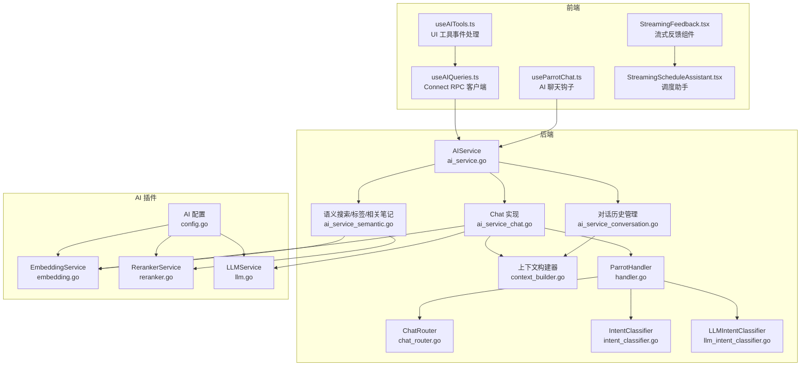
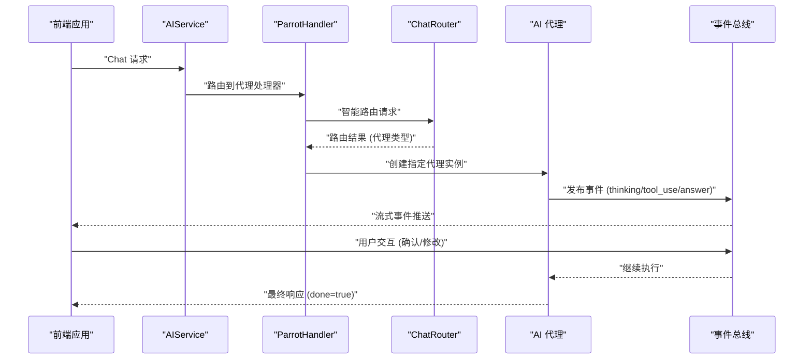
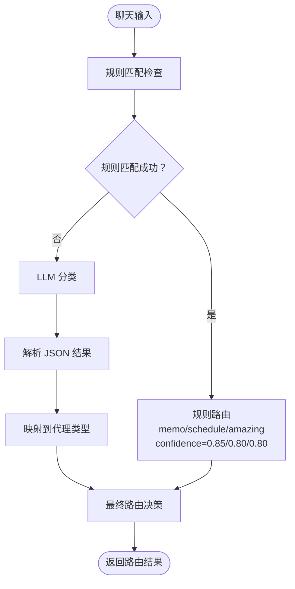
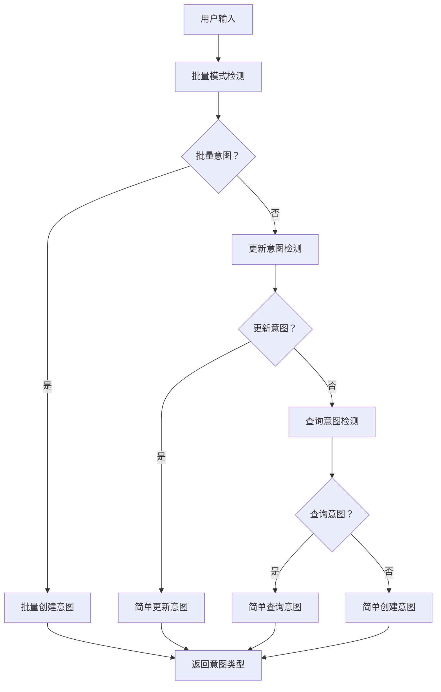
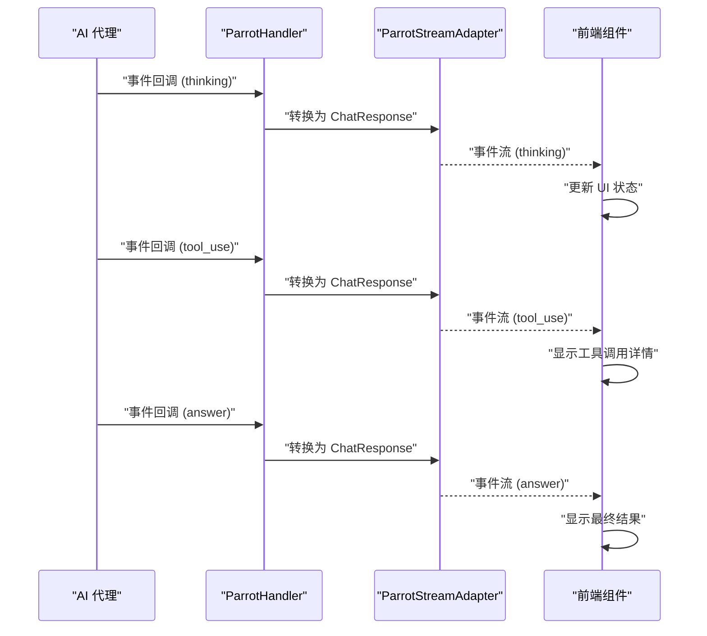
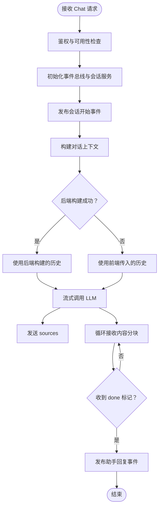
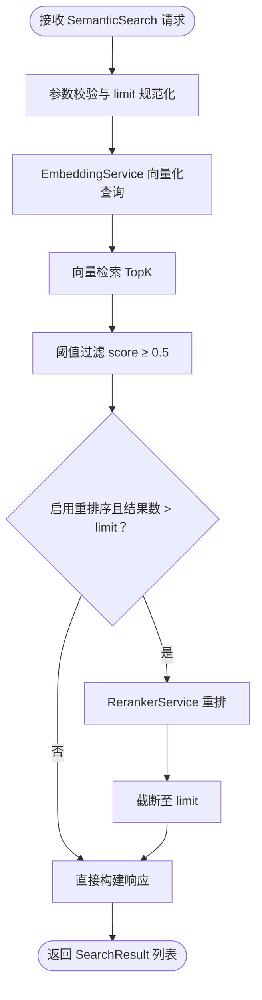
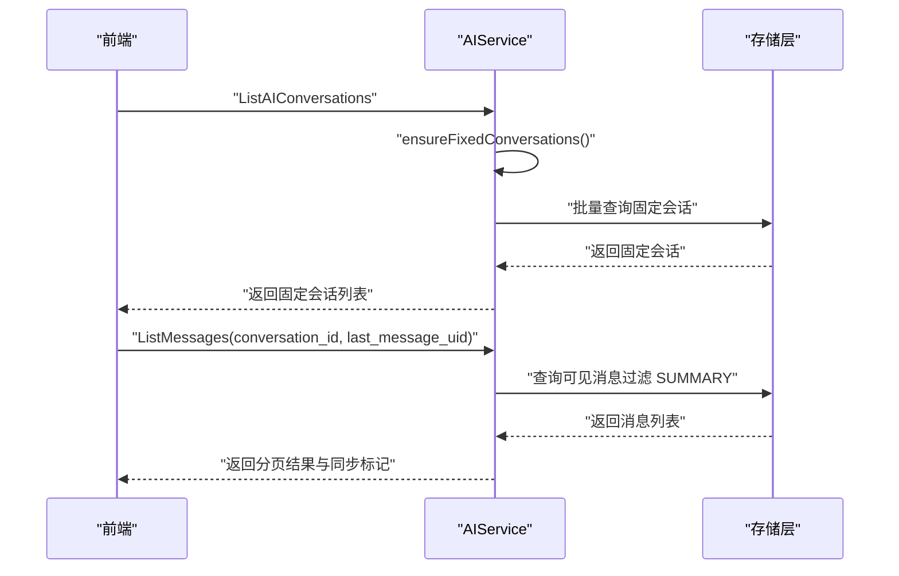
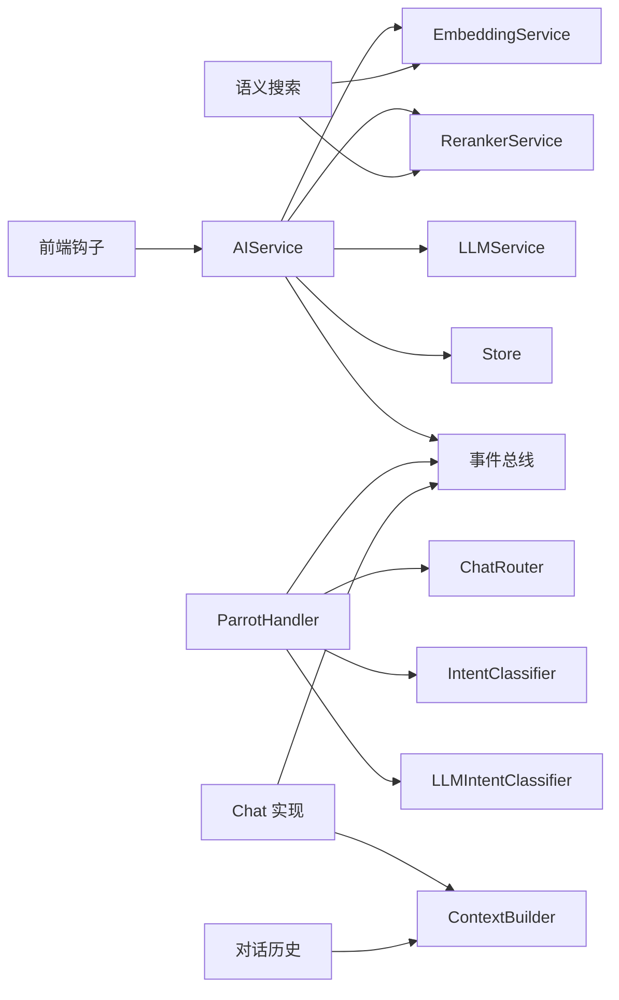

# AI 服务 API

<cite>
**本文引用的文件**
- [ai_service.proto](file://proto/api/v1/ai_service.proto)
- [ai_service.go](file://server/router/api/v1/ai_service.go)
- [ai_service_chat.go](file://server/router/api/v1/ai_service_chat.go)
- [ai_service_semantic.go](file://server/router/api/v1/ai_service_semantic.go)
- [ai_service_conversation.go](file://server/router/api/v1/ai_service_conversation.go)
- [context_builder.go](file://server/router/api/v1/ai/context_builder.go)
- [handler.go](file://server/router/api/v1/ai/handler.go)
- [chat_router.go](file://plugin/ai/agent/chat_router.go)
- [intent_classifier.go](file://plugin/ai/agent/intent_classifier.go)
- [llm_intent_classifier.go](file://plugin/ai/agent/llm_intent_classifier.go)
- [types.go](file://plugin/ai/agent/types.go)
- [config.go](file://plugin/ai/config.go)
- [embedding.go](file://plugin/ai/embedding.go)
- [llm.go](file://plugin/ai/llm.go)
- [reranker.go](file://plugin/ai/reranker.go)
- [useAIQueries.ts](file://web/src/hooks/useAIQueries.ts)
- [useAITools.ts](file://web/src/hooks/useAITools.ts)
- [useParrotChat.ts](file://web/src/hooks/useParrotChat.ts)
- [StreamingFeedback.tsx](file://web/src/components/ScheduleAI/StreamingFeedback.tsx)
- [StreamingScheduleAssistant.tsx](file://web/src/components/AIChat/StreamingScheduleAssistant.tsx)
- [AI-013-chat-api.md](file://docs/specs/AI-013-chat-api.md)
- [AI-012-semantic-search-api.md](file://docs/specs/AI-012-semantic-search-api.md)
- [AI-008-embedding-service.md](file://docs/specs/AI-008-embedding-service.md)
- [AI-009-reranker-service.md](file://docs/specs/AI-009-reranker-service.md)
</cite>

## 更新摘要
**所做更改**
- 新增聊天路由和意图分类功能的详细说明
- 改进对话管理和流式反馈集成的文档
- 更新 AI 代理架构和事件驱动的流式处理机制
- 增加智能路由和意图识别的技术细节
- 完善前端流式反馈组件的集成指南

## 目录
1. [简介](#简介)
2. [项目结构](#项目结构)
3. [核心组件](#核心组件)
4. [架构总览](#架构总览)
5. [详细组件分析](#详细组件分析)
6. [依赖关系分析](#依赖关系分析)
7. [性能考虑](#性能考虑)
8. [故障排查指南](#故障排查指南)
9. [结论](#结论)
10. [附录](#附录)

## 简介
本文件面向开发者与运维人员，系统化梳理 AI 服务 API 的设计与实现，覆盖以下能力：
- 对话服务：支持流式响应、消息上下文构建、会话状态维护与摘要触发
- 语义搜索服务：向量检索、重排序与结果截断
- 对话历史管理：固定会话、消息分页、增量同步与上下文分隔符
- 智能路由与意图分类：基于规则和 LLM 的聊天路由，任务意图识别
- 流式反馈集成：实时事件驱动的 UI 反馈和工具调用可视化
- 配置与集成：嵌入模型、重排序器、大模型服务的配置与验证
- 错误处理与性能优化：速率限制、超时保护、降级策略
- 前端调用示例与最佳实践：流式消费、事件解析与 UI 工具集成

## 项目结构
AI 服务由后端 gRPC/HTTP 服务、插件化的 AI 能力模块、数据库持久层与前端查询钩子组成。核心目录与职责如下：
- proto/api/v1/ai_service.proto：定义 AIService 与 ScheduleAgentService 的协议与消息类型
- server/router/api/v1/ai_service*.go：AIService 的 HTTP/gRPC 实现，包括对话、语义搜索、对话历史管理
- server/router/api/v1/ai/handler.go：AI 代理处理器，支持智能路由和事件驱动的流式处理
- plugin/ai/agent/chat_router.go：聊天路由系统，基于规则和 LLM 的智能路由
- plugin/ai/agent/intent_classifier.go：意图分类器，识别日程任务类型
- plugin/ai/agent/llm_intent_classifier.go：基于 LLM 的意图分类增强
- plugin/ai/agent/types.go：AI 代理接口和事件类型定义
- server/router/api/v1/ai/context_builder.go：对话上下文构建器，负责 SEPARATOR 过滤、令牌限制与合并待持久化消息
- plugin/ai/*：AI 能力插件，包括嵌入、重排序、大模型服务
- web/src/hooks/useAIQueries.ts、useAITools.ts、useParrotChat.ts：前端 Connect RPC 查询钩子与工具事件处理
- web/src/components/*：流式反馈组件和 AI 聊天界面

**图表来源**
- [ai_service.go](file://server/router/api/v1/ai_service.go#L21-L43)
- [handler.go](file://server/router/api/v1/ai/handler.go#L25-L38)
- [chat_router.go](file://plugin/ai/agent/chat_router.go#L42-L68)
- [intent_classifier.go](file://plugin/ai/agent/intent_classifier.go#L31-L47)
- [llm_intent_classifier.go](file://plugin/ai/agent/llm_intent_classifier.go#L22-L31)

**章节来源**
- [ai_service.proto](file://proto/api/v1/ai_service.proto#L13-L110)
- [ai_service.go](file://server/router/api/v1/ai_service.go#L21-L74)

## 核心组件
- AIService：AI 能力聚合入口，持有 EmbeddingService、RerankerService、LLMService 与 AdaptiveRetriever；提供 RateLimiter、全局初始化与用户鉴权
- ParrotHandler：智能代理处理器，支持聊天路由、事件驱动的流式处理和回调机制
- ChatRouter：混合路由系统，基于规则匹配（0ms）和 LLM 分类（~400ms）的智能路由
- IntentClassifier：任务意图分类器，识别简单创建、查询、更新、批量创建、冲突解决和多域查询
- LLMIntentClassifier：基于 LLM 的意图分类增强，提供更好的准确性
- 流式反馈系统：事件驱动的 UI 反馈，支持思考过程、工具使用和结果展示
- 语义搜索：查询向量化 → 向量检索 → 低相关过滤 → 可选重排序 → 结果截断 → 响应构建
- 对话历史管理：固定会话保证、消息分页与增量同步、上下文分隔符、摘要触发
- 上下文构建器：合并已持久化与待持久化消息，按 SEPARATOR 分割，按令牌数与消息数裁剪
- AI 插件：嵌入、重排序、大模型服务，支持多供应商配置与校验

**章节来源**
- [handler.go](file://server/router/api/v1/ai/handler.go#L25-L38)
- [chat_router.go](file://plugin/ai/agent/chat_router.go#L42-L101)
- [intent_classifier.go](file://plugin/ai/agent/intent_classifier.go#L31-L125)
- [llm_intent_classifier.go](file://plugin/ai/agent/llm_intent_classifier.go#L22-L74)
- [types.go](file://plugin/ai/agent/types.go#L10-L139)

## 架构总览
AI 服务采用"协议定义 + 服务实现 + 智能路由 + 插件化能力 + 数据持久"的分层架构。前端通过 Connect RPC 调用后端 gRPC/HTTP 接口，后端在 ParrotHandler 中协调 AI 插件与存储层，结合事件总线完成会话持久化与摘要生成。智能路由系统在聊天请求到达时自动进行意图识别和代理选择。

**图表来源**
- [handler.go](file://server/router/api/v1/ai/handler.go#L45-L113)
- [chat_router.go](file://plugin/ai/agent/chat_router.go#L70-L101)
- [types.go](file://plugin/ai/agent/types.go#L107-L139)

## 详细组件分析

### 智能聊天路由与意图分类

#### 聊天路由系统
- 混合路由策略：规则匹配（快速路径）→ LLM 分类（不确定时）
- 规则匹配：基于关键词和时间模式的快速路由，无延迟开销
- LLM 分类：使用严格 JSON Schema 的轻量级模型进行精确分类
- 路由结果：memo（笔记）、schedule（日程）、amazing（综合）

**图表来源**
- [chat_router.go](file://plugin/ai/agent/chat_router.go#L70-L101)
- [chat_router.go](file://plugin/ai/agent/chat_router.go#L103-L180)
- [chat_router.go](file://plugin/ai/agent/chat_router.go#L182-L250)

#### 任务意图分类
- 简单创建：包含具体时间和事件的创建请求
- 简单查询：询问日程或空闲状态的问题
- 简单更新：修改或删除现有日程
- 批量创建：重复性的日程创建（每天、每周等）
- 冲突解决：处理日程冲突的情况
- 多域查询：涉及多个领域的综合查询

**图表来源**
- [intent_classifier.go](file://plugin/ai/agent/intent_classifier.go#L104-L125)
- [intent_classifier.go](file://plugin/ai/agent/intent_classifier.go#L127-L144)
- [intent_classifier.go](file://plugin/ai/agent/intent_classifier.go#L146-L164)
- [intent_classifier.go](file://plugin/ai/agent/intent_classifier.go#L166-L174)

**章节来源**
- [chat_router.go](file://plugin/ai/agent/chat_router.go#L42-L101)
- [intent_classifier.go](file://plugin/ai/agent/intent_classifier.go#L31-L125)
- [llm_intent_classifier.go](file://plugin/ai/agent/llm_intent_classifier.go#L22-L74)

### 事件驱动的流式反馈系统

#### 事件类型与回调机制
- 通用事件类型：thinking（思考）、tool_use（工具使用）、tool_result（工具结果）、answer（最终答案）、error（错误）
- 代理特定事件：memo_query_result（笔记查询结果）、schedule_query_result（日程查询结果）、schedule_updated（日程更新）
- UI 工具事件：ui_schedule_suggestion（日程建议）、ui_time_slot_picker（时间槽选择）、ui_conflict_resolution（冲突解决）、ui_quick_actions（快捷操作）

#### 流式反馈组件
- StreamingFeedback：实时显示 AI 思考过程，支持多种事件类型的图标和状态
- StreamingScheduleAssistant：完整的调度助手界面，支持工具调用可视化和用户交互
- 事件解析：前端组件能够解析各种事件格式，包括纯文本和 JSON 结构

**图表来源**
- [handler.go](file://server/router/api/v1/ai/handler.go#L115-L190)
- [types.go](file://plugin/ai/agent/types.go#L107-L139)
- [StreamingFeedback.tsx](file://web/src/components/ScheduleAI/StreamingFeedback.tsx#L9-L22)

**章节来源**
- [types.go](file://plugin/ai/agent/types.go#L10-L139)
- [handler.go](file://server/router/api/v1/ai/handler.go#L115-L190)
- [StreamingFeedback.tsx](file://web/src/components/ScheduleAI/StreamingFeedback.tsx#L103-L185)

### 对话服务（流式响应与上下文管理）
- 流式响应：后端通过 LLMService.ChatStream 提供分块内容，前端逐块拼接并渲染；最终发送 done=true 标记
- 上下文管理：ContextBuilder 合并已持久化与待持久化消息，仅保留 SEPARATOR 之后的 MESSAGE 类型内容，并按令牌数与消息数裁剪
- 会话状态：通过事件总线在 ChatEvent 中记录会话开始、用户消息、助手回复等；支持临时会话与固定会话
- 速率限制：全局 AIService 级别 RateLimiter，按用户维度限流
- 时间区：若未提供或无效则回退默认时区

**图表来源**
- [ai_service_chat.go](file://server/router/api/v1/ai_service_chat.go#L58-L206)
- [context_builder.go](file://server/router/api/v1/ai/context_builder.go#L95-L224)
- [llm.go](file://plugin/ai/llm.go#L198-L269)

**章节来源**
- [ai_service_chat.go](file://server/router/api/v1/ai_service_chat.go#L58-L206)
- [context_builder.go](file://server/router/api/v1/ai/context_builder.go#L95-L224)
- [llm.go](file://plugin/ai/llm.go#L198-L269)

### 语义搜索服务（查询处理、结果排序与相关性评分）
- 查询处理：参数校验（最小长度、最大长度）、limit 限制（1-50）
- 向量检索：EmbeddingService 将查询向量化，Store.VectorSearch 返回 TopK 结果
- 相关性过滤：阈值过滤（score ≥ 0.5），避免低相关结果进入后续流程
- 重排序：可选启用 RerankerService，按相关性分数排序并截断至 limit
- 响应构建：截断内容片段（≤200 字），返回 name、snippet、score

**图表来源**
- [ai_service_semantic.go](file://server/router/api/v1/ai_service_semantic.go#L16-L131)
- [embedding.go](file://plugin/ai/embedding.go#L60-L98)
- [reranker.go](file://plugin/ai/reranker.go#L59-L126)

**章节来源**
- [ai_service_semantic.go](file://server/router/api/v1/ai_service_semantic.go#L16-L131)
- [embedding.go](file://plugin/ai/embedding.go#L60-L98)
- [reranker.go](file://plugin/ai/reranker.go#L59-L126)

### 对话历史管理（固定会话、消息分页与增量同步）
- 固定会话：首次列出对话时自动确保用户拥有三类固定会话（Memo、Schedule、Amazing），用于展示不同代理能力
- 消息分页：支持 limit 与 last_message_uid 的增量加载；隐藏 SUMMARY 类型消息；计算 total_count（不计 SEPARATOR/SUMMARY）
- 上下文分隔符：支持添加 --- 分隔符以清空上下文；重复添加幂等
- 会话操作：创建、更新（含置顶）、删除（禁止删除固定会话）

**图表来源**
- [ai_service_conversation.go](file://server/router/api/v1/ai_service_conversation.go#L24-L77)
- [ai_service_conversation.go](file://server/router/api/v1/ai_service_conversation.go#L404-L519)

**章节来源**
- [ai_service_conversation.go](file://server/router/api/v1/ai_service_conversation.go#L24-L77)
- [ai_service_conversation.go](file://server/router/api/v1/ai_service_conversation.go#L404-L519)

### AI 插件与配置
- 配置项：是否启用、嵌入模型与维度、重排序器开关与模型、大模型提供商与参数（温度、最大 token）、意图分类器配置
- 嵌入服务：支持 SiliconFlow、OpenAI、Ollama，统一接口 Embed/EmbedBatch/Dimensions
- 重排序服务：调用 SiliconFlow rerank API，禁用时返回原始顺序
- 大模型服务：支持同步与流式对话，带超时保护与工具调用能力

**章节来源**
- [config.go](file://plugin/ai/config.go#L9-L148)
- [embedding.go](file://plugin/ai/embedding.go#L11-L102)
- [reranker.go](file://plugin/ai/reranker.go#L20-L126)
- [llm.go](file://plugin/ai/llm.go#L20-L326)

## 依赖关系分析
- AIService 依赖插件化 AI 能力与存储层，通过事件总线解耦会话持久化与对话处理
- ParrotHandler 依赖 ChatRouter 和 IntentClassifier 进行智能路由和意图识别
- Chat 实现依赖 ContextBuilder 与 LLMService，上游可能依赖 AdaptiveRetriever（在工厂中创建）
- 语义搜索依赖 EmbeddingService 与 RerankerService，以及 Store.VectorSearch
- 前端通过 Connect RPC 客户端调用 AIService，使用 React Query 管理缓存与并发

**图表来源**
- [ai_service.go](file://server/router/api/v1/ai_service.go#L21-L43)
- [handler.go](file://server/router/api/v1/ai/handler.go#L25-L38)
- [chat_router.go](file://plugin/ai/agent/chat_router.go#L42-L68)
- [intent_classifier.go](file://plugin/ai/agent/intent_classifier.go#L31-L47)

**章节来源**
- [ai_service.go](file://server/router/api/v1/ai_service.go#L21-L43)
- [useAIQueries.ts](file://web/src/hooks/useAIQueries.ts#L1-L331)

## 性能考虑
- 速率限制：全局 AIService 级别 RateLimiter，按用户维度限流，防止滥用
- 超时保护：LLM 同步/流式调用均设置超时，避免长时间占用资源
- 上下文裁剪：ContextBuilder 按令牌数与消息数裁剪，减少上下文长度，提高响应速度
- 语义搜索优化：向量检索 TopK、阈值过滤、可选重排序，平衡召回与精度
- 智能路由优化：规则匹配优先，LLM 分类仅在必要时触发，平均延迟 ~400ms
- 前端缓存：React Query 为搜索与相关笔记设置合理的 staleTime，降低重复请求

**章节来源**
- [ai_service_chat.go](file://server/router/api/v1/ai_service_chat.go#L77-L79)
- [llm.go](file://plugin/ai/llm.go#L106-L128)
- [llm.go](file://plugin/ai/llm.go#L198-L269)
- [context_builder.go](file://server/router/api/v1/ai/context_builder.go#L187-L195)
- [chat_router.go](file://plugin/ai/agent/chat_router.go#L70-L101)
- [useAIQueries.ts](file://web/src/hooks/useAIQueries.ts#L28-L41)

## 故障排查指南
- 未授权访问：检查鉴权头与用户上下文，确认用户存在
- AI 功能不可用：检查 EmbeddingService 是否启用；LLM 功能需同时启用 LLMService
- 速率限制：观察 ResourceExhausted 错误，调整客户端重试策略或等待配额恢复
- 流式传输异常：前端侧检查 AbortError（超时）与 EOF；后端日志记录接收错误与完成原因
- 上下文为空：确认是否存在 SEPARATOR 导致上下文被清空；必要时移除分隔符或调整历史
- 语义搜索无结果：检查查询长度、阈值过滤与重排序器状态；尝试增大 limit 或关闭重排序
- 智能路由失败：检查 ChatRouter 配置和 LLM API Key；查看路由日志和置信度
- 事件处理异常：确认前端事件解析器能够正确处理各种事件格式；检查回调函数注册

**章节来源**
- [ai_service_chat.go](file://server/router/api/v1/ai_service_chat.go#L71-L79)
- [ai_service_semantic.go](file://server/router/api/v1/ai_service_semantic.go#L18-L49)
- [handler.go](file://server/router/api/v1/ai/handler.go#L224-L242)
- [useAIQueries.ts](file://web/src/hooks/useAIQueries.ts#L293-L316)

## 结论
本 AI 服务 API 通过清晰的协议定义、可插拔的 AI 能力、智能路由系统与完善的上下文管理，提供了从语义搜索到流式对话再到历史管理的一体化解决方案。新增的聊天路由和意图分类功能显著提升了用户体验，智能路由能够在毫秒级时间内准确识别用户意图并选择合适的代理。事件驱动的流式反馈系统为用户提供了透明的思考过程和工具调用可视化。配合前端 Connect RPC 与 React Query，实现了高性能、可扩展且易用的 AI 能力接入路径。建议在生产环境中启用速率限制、合理配置重排序器与上下文窗口，并持续监控流式传输、超时情况和智能路由的准确性。

## 附录

### API 定义概览（按服务）
- AIService
  - 语义搜索：SemanticSearch（POST /api/v1/ai/search）
  - 标签建议：SuggestTags（POST /api/v1/ai/suggest-tags）
  - 对话：Chat（POST /api/v1/ai/chat，流式）
  - 相关笔记：GetRelatedMemos（GET /api/v1/{name=memos/*}/related）
  - 代理认知：GetParrotSelfCognition（GET /api/v1/ai/parrots/{agent_type}/self-cognition）
  - 代理列表：ListParrots（GET /api/v1/ai/parrots）
  - 会话管理：ListAIConversations、GetAIConversation、CreateAIConversation、UpdateAIConversation、DeleteAIConversation
  - 上下文分隔符：AddContextSeparator（POST /api/v1/ai/conversations/{conversation_id}/separator）
  - 消息列表：ListMessages（GET /api/v1/ai/conversations/{conversation_id}/messages）

- ScheduleAgentService
  - 非流式对话：Chat（POST /api/v1/schedule-agent/chat）
  - 流式对话：ChatStream（POST /api/v1/schedule-agent/chat/stream）

### 前端调用示例与最佳实践
- 语义搜索：使用 useSemanticSearch，query 长度需大于 2；设置合理的 staleTime
- 标签建议：使用 useSuggestTags，限制数量（1-10）
- 相关笔记：使用 useRelatedMemos，name 格式为 memos/{uid}
- 对话流式：使用 useParrotChat，监听 onThinking、onToolUse、onToolResult、onMemoQueryResult、onScheduleQueryResult、onError；设置 5 分钟超时
- UI 工具事件：使用 useAITools，解析 ui_schedule_suggestion、ui_time_slot_picker、ui_conflict_resolution 并处理用户动作
- 流式反馈：使用 StreamingFeedback 和 StreamingScheduleAssistant 组件，实时显示 AI 思考过程和工具调用

**章节来源**
- [useAIQueries.ts](file://web/src/hooks/useAIQueries.ts#L28-L78)
- [useAIQueries.ts](file://web/src/hooks/useAIQueries.ts#L86-L325)
- [useAITools.ts](file://web/src/hooks/useAITools.ts#L9-L90)
- [useParrotChat.ts](file://web/src/hooks/useParrotChat.ts#L15-L104)
- [StreamingFeedback.tsx](file://web/src/components/ScheduleAI/StreamingFeedback.tsx#L103-L185)
- [StreamingScheduleAssistant.tsx](file://web/src/components/AIChat/StreamingScheduleAssistant.tsx#L70-L200)

### 设计与实现参考
- Chat API 规格：包含流式响应、上下文构建与历史传递
- 语义搜索 API 规格：向量检索、阈值过滤与重排序
- 嵌入服务规格：多供应商适配与批量处理
- 重排序服务规格：SiliconFlow 调用与降级逻辑
- 智能路由规格：规则匹配与 LLM 分类的混合策略
- 事件驱动架构：回调机制与流式事件处理

**章节来源**
- [AI-013-chat-api.md](file://docs/specs/AI-013-chat-api.md#L1-L186)
- [AI-012-semantic-search-api.md](file://docs/specs/AI-012-semantic-search-api.md#L1-L196)
- [AI-008-embedding-service.md](file://docs/specs/AI-008-embedding-service.md#L1-L189)
- [AI-009-reranker-service.md](file://docs/specs/AI-009-reranker-service.md#L1-L184)
- [chat_router.go](file://plugin/ai/agent/chat_router.go#L42-L101)
- [intent_classifier.go](file://plugin/ai/agent/intent_classifier.go#L31-L125)