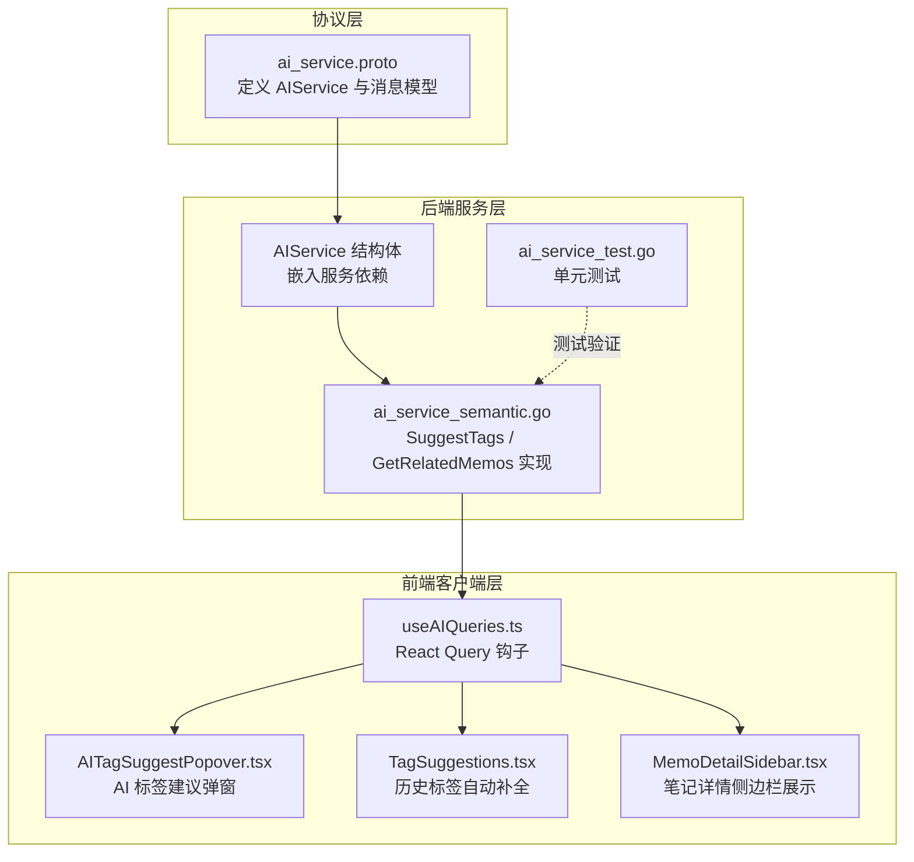
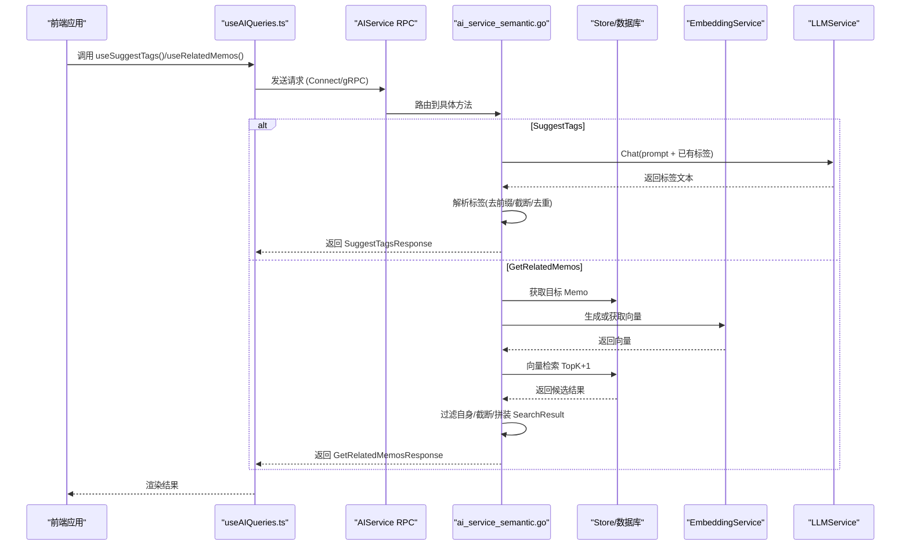
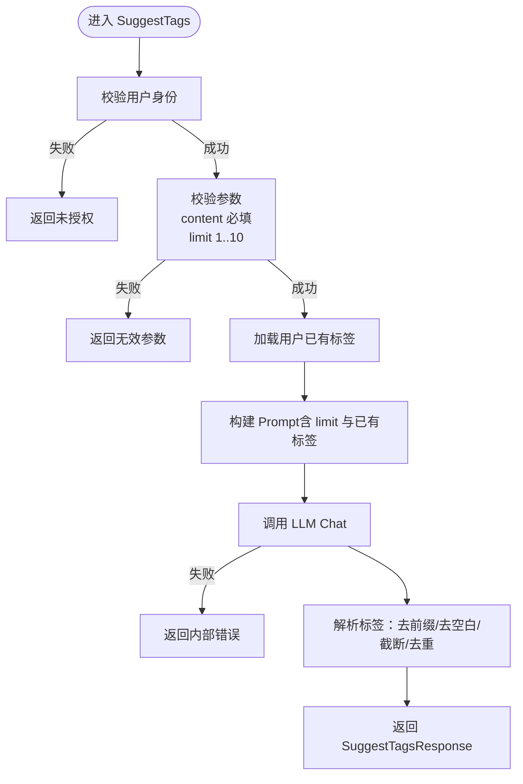
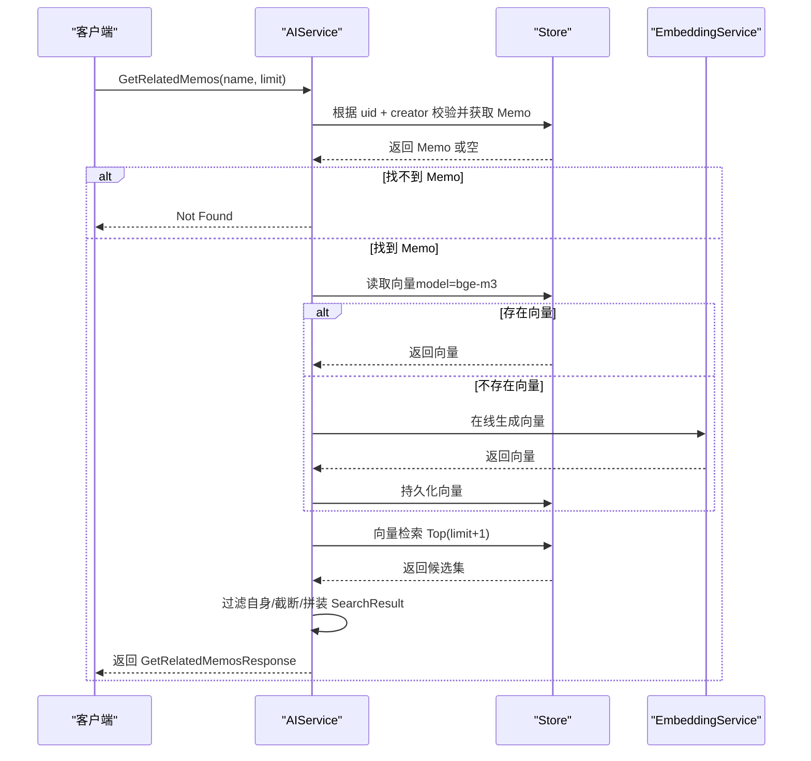
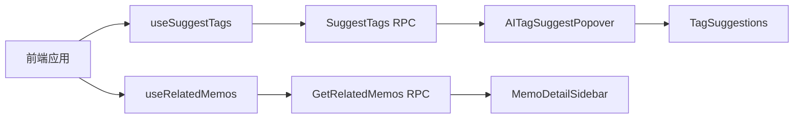
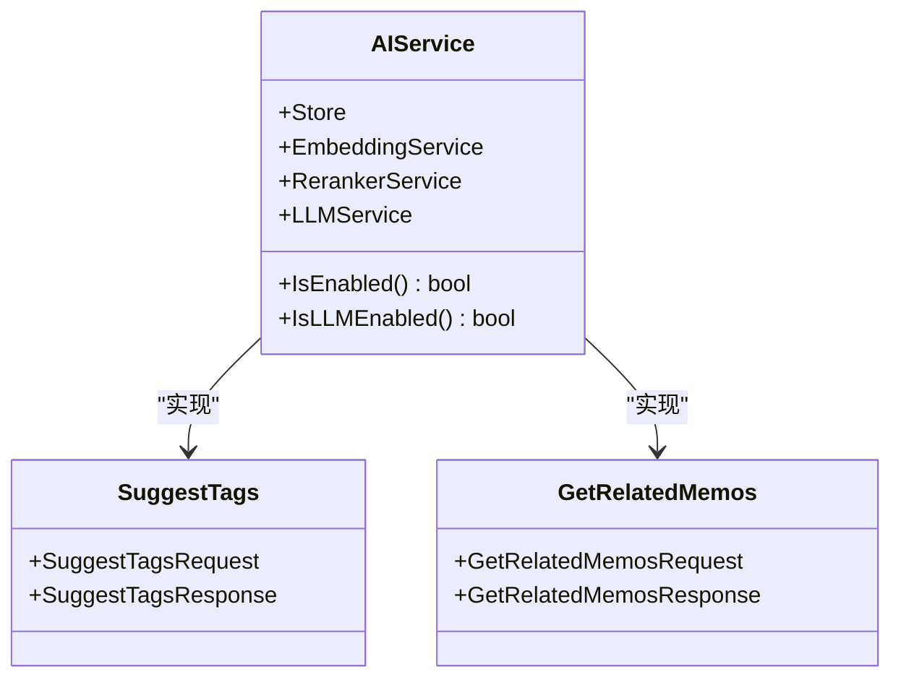

# 实用工具 API

<cite>
**本文档引用的文件**
- [ai_service.proto](file://proto/api/v1/ai_service.proto)
- [ai_service_semantic.go](file://server/router/api/v1/ai_service_semantic.go)
- [ai_service.go](file://server/router/api/v1/ai_service.go)
- [ai_service_test.go](file://server/router/api/v1/ai_service_test.go)
- [AI-014-suggest-tags-api.md](file://docs/specs/AI-014-suggest-tags-api.md)
- [AI-015-related-memos-api.md](file://docs/specs/AI-015-related-memos-api.md)
- [useAIQueries.ts](file://web/src/hooks/useAIQueries.ts)
- [AITagSuggestPopover.tsx](file://web/src/components/MemoEditor/components/AITagSuggestPopover.tsx)
- [TagSuggestions.tsx](file://web/src/components/MemoEditor/Editor/TagSuggestions.tsx)
- [MemoDetailSidebar.tsx](file://web/src/components/MemoDetailSidebar/MemoDetailSidebar.tsx)
- [0.22/memo_tags.sql](file://store/migration/sqlite/0.22/01__memo_tags.sql)
- [ai-empowerment-analysis.md](file://docs/ai-empowerment-analysis.md)
</cite>

## 目录
1. [简介](#简介)
2. [项目结构](#项目结构)
3. [核心组件](#核心组件)
4. [架构总览](#架构总览)
5. [详细组件分析](#详细组件分析)
6. [依赖关系分析](#依赖关系分析)
7. [性能考虑](#性能考虑)
8. [故障排除指南](#故障排除指南)
9. [结论](#结论)
10. [附录](#附录)

## 简介
本文件系统性地文档化实用工具 API，重点覆盖两个核心能力：
- SuggestTags：基于内容自动推荐标签，辅助用户高效标注笔记
- GetRelatedMemos：基于向量相似度查找相关笔记，提升检索与知识发现效率

文档将从接口定义、请求/响应模型、后端实现、前端集成、数据流与算法、性能优化与故障排除等维度展开，并给出实际使用示例与最佳实践。

## 项目结构
实用工具 API 由协议定义、后端路由实现、前端查询钩子与 UI 组件构成，形成“协议 → 服务 → 客户端”的完整链路。

图表来源
- [ai_service.proto](file://proto/api/v1/ai_service.proto#L12-L43)
- [ai_service.go](file://server/router/api/v1/ai_service.go#L20-L43)
- [ai_service_semantic.go](file://server/router/api/v1/ai_service_semantic.go#L133-L339)
- [useAIQueries.ts](file://web/src/hooks/useAIQueries.ts#L43-L78)
- [AITagSuggestPopover.tsx](file://web/src/components/MemoEditor/components/AITagSuggestPopover.tsx#L17-L86)
- [TagSuggestions.tsx](file://web/src/components/MemoEditor/Editor/TagSuggestions.tsx#L10-L50)
- [MemoDetailSidebar.tsx](file://web/src/components/MemoDetailSidebar/MemoDetailSidebar.tsx#L83-L92)

章节来源
- [ai_service.proto](file://proto/api/v1/ai_service.proto#L12-L43)
- [ai_service.go](file://server/router/api/v1/ai_service.go#L20-L73)

## 核心组件
- AIService：承载 AI 能力的服务容器，聚合存储、嵌入、重排序与 LLM 等依赖
- SuggestTags：根据内容与用户既有标签，生成候选标签
- GetRelatedMemos：基于向量相似度查找相关笔记，支持向量缺失时的在线生成与缓存
- 前端钩子：useSuggestTags、useRelatedMemos 提供 React Query 封装，简化调用与缓存
- UI 组件：AI 标签建议弹窗、历史标签自动补全、笔记详情侧边栏

章节来源
- [ai_service.go](file://server/router/api/v1/ai_service.go#L20-L73)
- [ai_service_semantic.go](file://server/router/api/v1/ai_service_semantic.go#L133-L339)
- [useAIQueries.ts](file://web/src/hooks/useAIQueries.ts#L43-L78)
- [AITagSuggestPopover.tsx](file://web/src/components/MemoEditor/components/AITagSuggestPopover.tsx#L17-L86)
- [TagSuggestions.tsx](file://web/src/components/MemoEditor/Editor/TagSuggestions.tsx#L10-L50)
- [MemoDetailSidebar.tsx](file://web/src/components/MemoDetailSidebar/MemoDetailSidebar.tsx#L83-L92)

## 架构总览
实用工具 API 的调用链路如下：

图表来源
- [ai_service_semantic.go](file://server/router/api/v1/ai_service_semantic.go#L133-L339)
- [useAIQueries.ts](file://web/src/hooks/useAIQueries.ts#L43-L78)
- [ai_service.proto](file://proto/api/v1/ai_service.proto#L22-L43)

## 详细组件分析

### SuggestTags 接口
- 功能概述：对输入内容生成候选标签，结合用户已有标签进行上下文参考，确保标签一致性与可复用性
- 请求模型：SuggestTagsRequest
  - content：必填，待分析的内容
  - limit：可选，默认 5，上限 10
- 响应模型：SuggestTagsResponse
  - tags：字符串数组，候选标签列表
- 后端实现要点
  - 认证与权限：需登录用户，否则返回未授权
  - 参数校验：content 必填；limit 限制在 1-10
  - 上下文参考：收集用户历史标签作为参考，提升标签复用率
  - Prompt 设计：中文指令，约束标签长度、准确性与优先使用已有标签
  - LLM 调用：构造消息并调用 LLMService.Chat
  - 结果解析：去除行首前缀（如 #、-）、空白与超长标签，按 limit 截断
- 错误处理：禁用 LLM 时返回不可用；LLM 失败返回内部错误；参数非法返回无效参数

图表来源
- [ai_service_semantic.go](file://server/router/api/v1/ai_service_semantic.go#L133-L195)
- [AI-014-suggest-tags-api.md](file://docs/specs/AI-014-suggest-tags-api.md#L15-L105)

章节来源
- [ai_service.proto](file://proto/api/v1/ai_service.proto#L175-L184)
- [ai_service_semantic.go](file://server/router/api/v1/ai_service_semantic.go#L133-L195)
- [AI-014-suggest-tags-api.md](file://docs/specs/AI-014-suggest-tags-api.md#L15-L105)

### GetRelatedMemos 接口
- 功能概述：基于目标笔记内容的向量表示，在用户范围内进行相似度检索，返回相关笔记列表
- 请求模型：GetRelatedMemosRequest
  - name：必填，格式为 "memos/{uid}"，定位目标笔记
  - limit：可选，默认 5
- 响应模型：GetRelatedMemosResponse
  - memos：SearchResult 数组，包含 name、snippet、score
- 后端实现要点
  - 认证与权限：需登录且仅允许笔记创建者访问
  - 名称解析：从 name 中提取 uid 并校验格式
  - 向量获取策略：优先从存储读取；若不存在则在线生成并持久化
  - 向量检索：执行 Top(K+1) 检索，过滤掉原始笔记本身
  - 结果组装：截断至 limit，拼装 SearchResult（含片段与分数）
- 错误处理：AI 功能关闭返回不可用；权限不足返回未授权；找不到笔记返回未找到；内部错误返回内部错误

图表来源
- [ai_service_semantic.go](file://server/router/api/v1/ai_service_semantic.go#L244-L339)
- [ai_service.proto](file://proto/api/v1/ai_service.proto#L334-L343)

章节来源
- [ai_service.proto](file://proto/api/v1/ai_service.proto#L334-L343)
- [ai_service_semantic.go](file://server/router/api/v1/ai_service_semantic.go#L244-L339)
- [AI-015-related-memos-api.md](file://docs/specs/AI-015-related-memos-api.md#L1-L55)

### 数据模型与字段说明
- SuggestTagsRequest
  - content：内容文本
  - limit：标签数量上限
- SuggestTagsResponse
  - tags：标签数组
- GetRelatedMemosRequest
  - name：目标笔记标识 "memos/{uid}"
  - limit：返回数量上限
- GetRelatedMemosResponse
  - memos：SearchResult 列表
- SearchResult
  - name：资源标识 "memos/{uid}"
  - snippet：内容片段（最多 200 字符）
  - score：相似度分数

章节来源
- [ai_service.proto](file://proto/api/v1/ai_service.proto#L175-L184)
- [ai_service.proto](file://proto/api/v1/ai_service.proto#L334-L343)
- [ai_service.proto](file://proto/api/v1/ai_service.proto#L168-L173)

### 前端集成与使用示例
- React Query 钩子
  - useSuggestTags：Mutation，返回 tags
  - useRelatedMemos：Query，返回 memos（SearchResult）
- UI 组件
  - AITagSuggestPopover：编辑器内触发 AI 标签建议，自动过滤已有标签，支持一键插入
  - TagSuggestions：基于历史标签的自动补全
  - MemoDetailSidebar：展示笔记标签与相关笔记列表

图表来源
- [useAIQueries.ts](file://web/src/hooks/useAIQueries.ts#L43-L78)
- [AITagSuggestPopover.tsx](file://web/src/components/MemoEditor/components/AITagSuggestPopover.tsx#L17-L86)
- [TagSuggestions.tsx](file://web/src/components/MemoEditor/Editor/TagSuggestions.tsx#L10-L50)
- [MemoDetailSidebar.tsx](file://web/src/components/MemoDetailSidebar/MemoDetailSidebar.tsx#L83-L92)

章节来源
- [useAIQueries.ts](file://web/src/hooks/useAIQueries.ts#L43-L78)
- [AITagSuggestPopover.tsx](file://web/src/components/MemoEditor/components/AITagSuggestPopover.tsx#L17-L86)
- [TagSuggestions.tsx](file://web/src/components/MemoEditor/Editor/TagSuggestions.tsx#L10-L50)
- [MemoDetailSidebar.tsx](file://web/src/components/MemoDetailSidebar/MemoDetailSidebar.tsx#L83-L92)

## 依赖关系分析
- 协议与实现解耦：通过 proto 定义接口契约，后端实现与前端客户端均基于同一协议
- 服务依赖
  - AIService 依赖 Store（数据访问）、EmbeddingService（向量化）、RerankerService（可选重排序）、LLMService（可选）
  - SuggestTags 依赖 LLMService；GetRelatedMemos 依赖 EmbeddingService 与 Store
- 前后端交互
  - 前端使用 Connect RPC 客户端发起请求，后端通过路由分发到具体方法
  - 前端钩子统一管理缓存、过期策略与错误回调

图表来源
- [ai_service.go](file://server/router/api/v1/ai_service.go#L20-L43)
- [ai_service_semantic.go](file://server/router/api/v1/ai_service_semantic.go#L133-L339)

章节来源
- [ai_service.go](file://server/router/api/v1/ai_service.go#L20-L73)
- [ai_service_semantic.go](file://server/router/api/v1/ai_service_semantic.go#L133-L339)

## 性能考虑
- 向量检索优化
  - 检索 TopK 设为 10，再按阈值过滤与重排，平衡召回与性能
  - 当候选数超过 limit 时启用重排序服务（可选），进一步提升相关性
- 向量生成与缓存
  - 若向量缺失，采用在线生成并持久化，避免重复计算
  - 建议在批量导入或编辑后触发向量化任务，提高命中率
- LLM 调用
  - Prompt 精简明确，限制标签数量与长度，降低 Token 消耗
  - 对高频请求进行速率限制与缓存（如内容指纹缓存）
- 前端体验
  - React Query 设置合理的 staleTime 与缓存键，避免重复请求
  - 流式响应与超时控制，提升交互流畅度

[本节为通用性能建议，无需特定文件引用]

## 故障排除指南
- 常见错误码
  - Unavailable：AI 或 LLM 未启用
  - Unauthenticated：未登录
  - InvalidArgument：参数非法（如 content 为空、limit 超界）
  - Internal：内部错误（如向量检索失败、LLM 调用失败）
  - NotFound：目标笔记不存在
- 定位步骤
  - 检查 AIService 是否启用 EmbeddingService（基础功能）与 LLMService（高级功能）
  - 确认用户认证状态与目标笔记的创建者匹配
  - 校验请求参数（content 长度、limit 边界）
  - 查看后端日志与前端错误提示，确认是否触发速率限制或超时
- 单元测试参考
  - SuggestTags 标签解析逻辑覆盖多种边界情况（前缀、空行、长度、截断）

章节来源
- [ai_service_semantic.go](file://server/router/api/v1/ai_service_semantic.go#L133-L195)
- [ai_service_semantic.go](file://server/router/api/v1/ai_service_semantic.go#L244-L339)
- [ai_service_test.go](file://server/router/api/v1/ai_service_test.go#L190-L234)

## 结论
SuggestTags 与 GetRelatedMemos 两大实用工具 API 有效提升了笔记管理的自动化与智能化水平。前者通过上下文感知的标签推荐降低标注成本，后者通过向量检索增强知识发现与关联能力。配合完善的前后端集成与性能优化策略，可在保证体验的同时最大化 AI 能力的价值。

[本节为总结性内容，无需特定文件引用]

## 附录

### 实际使用示例
- SuggestTags
  - 前端调用：通过 useSuggestTags 触发，传入 content 与 limit，得到 tags
  - 示例请求：POST /api/v1/ai/suggest-tags
- GetRelatedMemos
  - 前端调用：通过 useRelatedMemos 触发，传入 name（"memos/{uid}"）与 limit，得到 memos
  - 示例请求：GET /api/v1/memos/{uid}/related?limit=5

章节来源
- [AI-014-suggest-tags-api.md](file://docs/specs/AI-014-suggest-tags-api.md#L131-L138)
- [AI-015-related-memos-api.md](file://docs/specs/AI-015-related-memos-api.md#L40-L45)
- [useAIQueries.ts](file://web/src/hooks/useAIQueries.ts#L43-L78)

### 与其他 AI 功能的协同机制
- 与语义搜索（SemanticSearch）协同：统一基于嵌入与向量检索，形成“搜索—推荐—关联”的闭环
- 与聊天（Chat）协同：在对话中引用相关笔记来源，增强回答可信度
- 与 Parrot Agent 协同：在智能助理场景中，SuggestTags 与 GetRelatedMemos 可作为前置工具，提升上下文质量

章节来源
- [ai_service.proto](file://proto/api/v1/ai_service.proto#L12-L43)
- [ai-empowerment-analysis.md](file://docs/ai-empowerment-analysis.md#L41-L51)

### 数据模型演进
- 标签字段迁移：SQLite 迁移脚本新增 tags 字段并建立索引，支撑标签推荐与检索
- 前端展示：MemoDetailSidebar 展示标签列表，AITagSuggestPopover 与 TagSuggestions 提供便捷操作

章节来源
- [0.22/memo_tags.sql](file://store/migration/sqlite/0.22/01__memo_tags.sql#L1-L3)
- [MemoDetailSidebar.tsx](file://web/src/components/MemoDetailSidebar/MemoDetailSidebar.tsx#L83-L92)
- [AITagSuggestPopover.tsx](file://web/src/components/MemoEditor/components/AITagSuggestPopover.tsx#L17-L86)
- [TagSuggestions.tsx](file://web/src/components/MemoEditor/Editor/TagSuggestions.tsx#L10-L50)