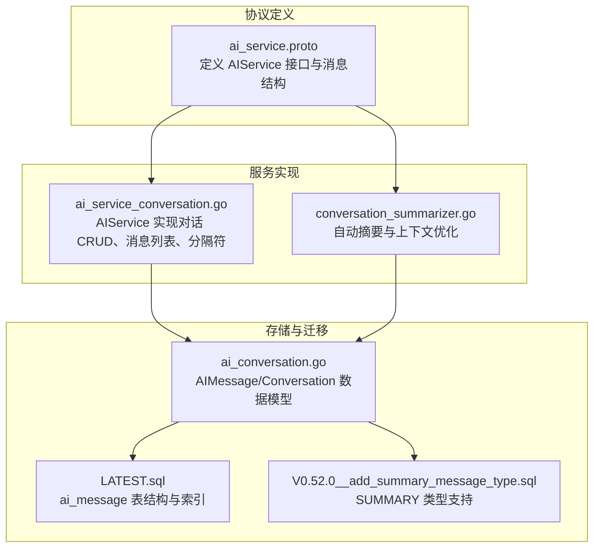
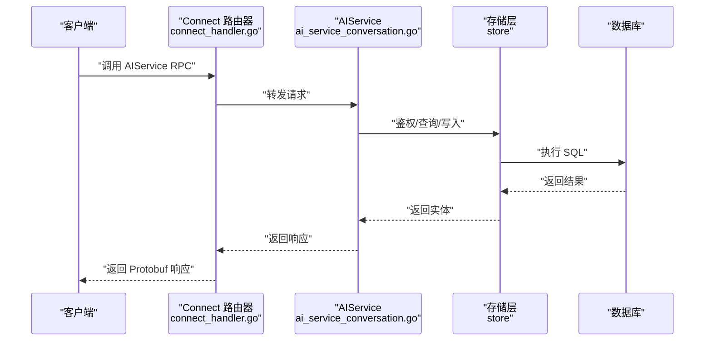
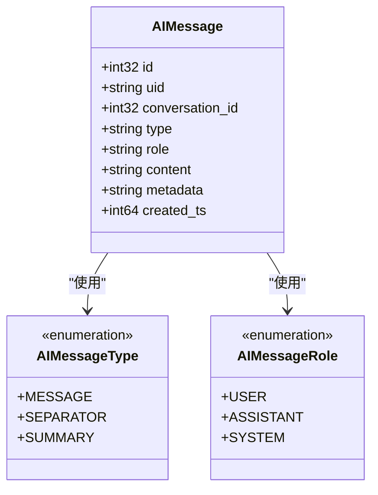
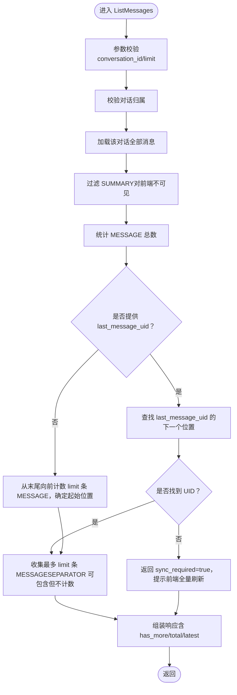
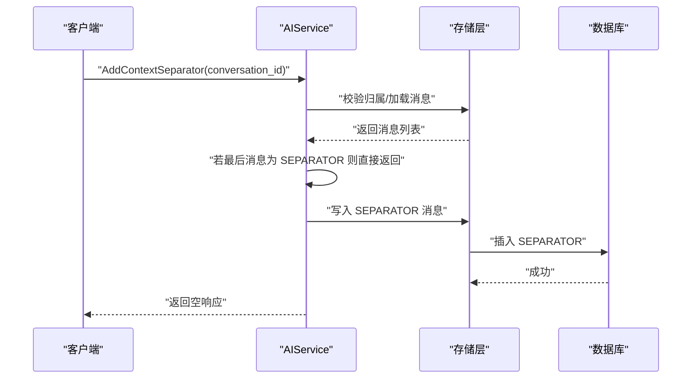
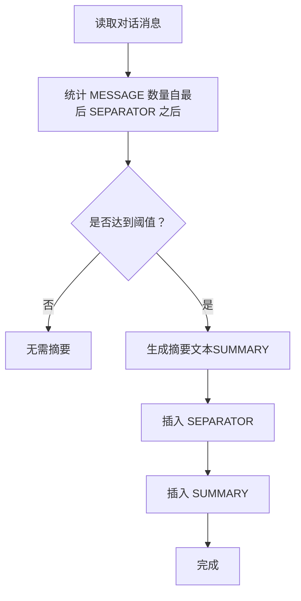
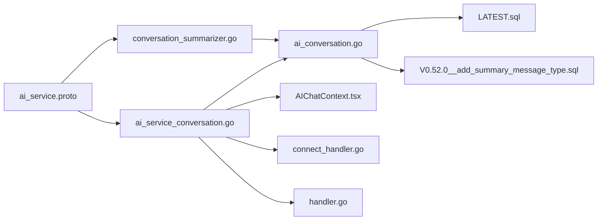

# 对话管理 API

<cite>
**本文引用的文件**
- [ai_service.proto](file://proto/api/v1/ai_service.proto)
- [ai_service_conversation.go](file://server/router/api/v1/ai_service_conversation.go)
- [conversation_summarizer.go](file://server/router/api/v1/ai/conversation_summarizer.go)
- [ai_conversation.go](file://store/ai_conversation.go)
- [LATEST.sql](file://store/migration/postgres/LATEST.sql)
- [V0.52.0__add_summary_message_type.sql](file://store/migration/postgres/V0.52.0__add_summary_message_type.sql)
- [AIChatContext.tsx](file://web/src/contexts/AIChatContext.tsx)
- [context.go](file://plugin/ai/agent/context.go)
- [connect_handler.go](file://server/router/api/v1/connect_handler.go)
- [handler.go](file://server/router/api/v1/ai/handler.go)
</cite>

## 目录
1. [简介](#简介)
2. [项目结构](#项目结构)
3. [核心组件](#核心组件)
4. [架构总览](#架构总览)
5. [详细组件分析](#详细组件分析)
6. [依赖关系分析](#依赖关系分析)
7. [性能考量](#性能考量)
8. [故障排查指南](#故障排查指南)
9. [结论](#结论)
10. [附录](#附录)

## 简介
本文件系统性地文档化“对话管理 API”，覆盖 AI 对话生命周期管理与消息同步机制，包括：
- 列表与详情：ListAIConversations、GetAIConversation
- 创建与更新：CreateAIConversation、UpdateAIConversation
- 删除：DeleteAIConversation
- 消息列表与增量同步：ListMessages 与 last_message_uid 参数
- 上下文分隔符：AddContextSeparator 与会话清理机制
- AIMessage 结构与消息类型（MESSAGE、SEPARATOR、SUMMARY）

目标是帮助开发者与产品团队理解接口行为、数据模型、前后端协作方式与最佳实践。

## 项目结构
对话管理 API 的核心由三部分构成：
- 协议定义层：在 proto 中定义 AIService 的 RPC 接口与消息体结构
- 服务实现层：在服务端路由中实现具体业务逻辑（鉴权、权限校验、存储访问、消息过滤与分页）
- 存储与迁移层：定义 AIMessage/Conversation 数据模型与数据库约束、迁移脚本

图表来源
- [ai_service.proto](file://proto/api/v1/ai_service.proto#L1-L117)
- [ai_service_conversation.go](file://server/router/api/v1/ai_service_conversation.go#L1-L219)
- [conversation_summarizer.go](file://server/router/api/v1/ai/conversation_summarizer.go#L1-L84)
- [ai_conversation.go](file://store/ai_conversation.go#L1-L73)
- [LATEST.sql](file://store/migration/postgres/LATEST.sql#L256-L281)
- [V0.52.0__add_summary_message_type.sql](file://store/migration/postgres/V0.52.0__add_summary_message_type.sql#L1-L11)

章节来源
- [ai_service.proto](file://proto/api/v1/ai_service.proto#L1-L117)
- [ai_service_conversation.go](file://server/router/api/v1/ai_service_conversation.go#L1-L219)
- [conversation_summarizer.go](file://server/router/api/v1/ai/conversation_summarizer.go#L1-L84)
- [ai_conversation.go](file://store/ai_conversation.go#L1-L73)
- [LATEST.sql](file://store/migration/postgres/LATEST.sql#L256-L281)
- [V0.52.0__add_summary_message_type.sql](file://store/migration/postgres/V0.52.0__add_summary_message_type.sql#L1-L11)

## 核心组件
- AIService 接口族
  - ListAIConversations：列出当前用户的对话，并附带每会话的消息计数（排除 SEPARATOR）
  - GetAIConversation：返回指定对话及其所有消息（排除 SUMMARY）
  - CreateAIConversation：创建新对话
  - UpdateAIConversation：更新对话标题或置顶状态
  - DeleteAIConversation：删除对话
  - AddContextSeparator：为对话添加上下文分隔符（SEPARATOR），用于后续上下文截断
  - ListMessages：按需返回消息，支持增量同步与最大数量限制
  - ClearConversationMessages：清空对话消息（辅助会话清理）
- AIMessage 与 AIMessageType
  - MESSAGE：普通对话消息
  - SEPARATOR：上下文分隔标记，用于截断历史上下文
  - SUMMARY：对话摘要（对前端不可见，仅用于 LLM 上下文前缀）
- 存储模型
  - AIConversation：对话元数据（标题、创建者、代理类型等）
  - AIMessage：消息实体（类型、角色、内容、元数据、时间戳）

章节来源
- [ai_service.proto](file://proto/api/v1/ai_service.proto#L59-L117)
- [ai_service_conversation.go](file://server/router/api/v1/ai_service_conversation.go#L23-L189)
- [ai_conversation.go](file://store/ai_conversation.go#L3-L73)
- [V0.52.0__add_summary_message_type.sql](file://store/migration/postgres/V0.52.0__add_summary_message_type.sql#L1-L11)

## 架构总览
对话管理 API 的调用链路如下：

图表来源
- [connect_handler.go](file://server/router/api/v1/connect_handler.go#L498-L529)
- [ai_service_conversation.go](file://server/router/api/v1/ai_service_conversation.go#L23-L189)

章节来源
- [connect_handler.go](file://server/router/api/v1/connect_handler.go#L498-L529)
- [ai_service_conversation.go](file://server/router/api/v1/ai_service_conversation.go#L23-L189)

## 详细组件分析

### AIMessage 结构与消息类型
- 字段说明
  - id、uid：唯一标识
  - conversation_id：所属对话
  - type：消息类型（MESSAGE、SEPARATOR、SUMMARY）
  - role：消息角色（USER、ASSISTANT、SYSTEM）
  - content：消息内容
  - metadata：JSON 字符串元数据
  - created_ts：创建时间戳
- 类型语义
  - MESSAGE：普通对话消息，计入总数与展示
  - SEPARATOR：系统生成的上下文分隔标记，用于截断历史上下文
  - SUMMARY：系统生成的摘要消息，对前端不可见，仅作为 LLM 上下文前缀

图表来源
- [ai_conversation.go](file://store/ai_conversation.go#L52-L61)
- [ai_service.proto](file://proto/api/v1/ai_service.proto#L227-L237)

章节来源
- [ai_conversation.go](file://store/ai_conversation.go#L36-L61)
- [ai_service.proto](file://proto/api/v1/ai_service.proto#L227-L237)

### 对话生命周期管理

#### ListAIConversations
- 功能：列出当前用户的所有对话，并计算每会话的消息数量（排除 SEPARATOR）
- 关键点：
  - 批量统计避免 N+1 查询
  - 返回值包含 message_count，便于前端快速概览

章节来源
- [ai_service_conversation.go](file://server/router/api/v1/ai_service_conversation.go#L23-L66)

#### GetAIConversation
- 功能：返回指定对话及其所有消息
- 关键点：
  - 过滤 SUMMARY（对前端不可见）
  - 计算非 SEPARATOR 的消息总数

章节来源
- [ai_service_conversation.go](file://server/router/api/v1/ai_service_conversation.go#L68-L107)

#### CreateAIConversation
- 功能：创建新对话
- 关键点：
  - 自动生成 UID 与时间戳
  - 设置默认行状态为 Normal

章节来源
- [ai_service_conversation.go](file://server/router/api/v1/ai_service_conversation.go#L109-L130)

#### UpdateAIConversation
- 功能：更新对话标题或置顶状态
- 关键点：
  - 仅允许对话创建者操作
  - 自动更新 updated_ts

章节来源
- [ai_service_conversation.go](file://server/router/api/v1/ai_service_conversation.go#L132-L164)

#### DeleteAIConversation
- 功能：删除对话
- 关键点：
  - 仅允许对话创建者操作
  - 删除后不会级联删除消息（需配合 ClearConversationMessages 使用）

章节来源
- [ai_service_conversation.go](file://server/router/api/v1/ai_service_conversation.go#L166-L189)

### 消息列表与增量同步：ListMessages

#### 接口行为
- 参数
  - conversation_id：必填
  - limit：默认 100，最大 100
  - last_message_uid：上次返回的最后一条消息 UID，用于增量同步
- 返回
  - messages：消息列表（排除 SUMMARY）
  - has_more：是否存在更早的消息
  - total_count：消息总数（仅 MESSAGE，排除 SEPARATOR/SUMMARY）
  - latest_message_uid：最新消息 UID，用于一致性校验
  - sync_required：是否需要全量刷新（当 last_message_uid 未找到时）

图表来源
- [ai_service_conversation.go](file://server/router/api/v1/ai_service_conversation.go#L302-L417)

章节来源
- [ai_service_conversation.go](file://server/router/api/v1/ai_service_conversation.go#L302-L417)

#### 前端协同与最佳实践
- 前端通过 last_message_uid 实现增量拉取，避免重复传输
- 当后端返回 sync_required=true 时，前端应清空本地缓存并重新以空 last_message_uid 全量拉取
- 前端维护 FIFO 消息窗口，确保内存占用可控

章节来源
- [AIChatContext.tsx](file://web/src/contexts/AIChatContext.tsx#L581-L711)

### 上下文分隔符：AddContextSeparator 与会话清理

#### AddContextSeparator
- 功能：为对话添加 SEPARATOR，标记新的上下文边界
- 关键点：
  - 仅允许对话创建者操作
  - 若最后一条消息已是 SEPARATOR，则幂等成功
  - 添加后更新对话 updated_ts

图表来源
- [ai_service_conversation.go](file://server/router/api/v1/ai_service_conversation.go#L191-L244)

章节来源
- [ai_service_conversation.go](file://server/router/api/v1/ai_service_conversation.go#L191-L244)

#### 会话清理机制
- ClearConversationMessages：清空对话消息，随后更新对话 updated_ts
- 与 SEPARATOR 配合：通过 SEPARATOR 截断历史上下文，再结合清理实现“轻量化”会话
- 后端上下文清理：插件层 ContextStore 提供按时间清理过期上下文的能力，避免内存泄漏

章节来源
- [ai_service_conversation.go](file://server/router/api/v1/ai_service_conversation.go#L427-L467)
- [context.go](file://plugin/ai/agent/context.go#L447-L463)

### 自动摘要与上下文优化：ConversationSummarizer
- 触发条件：对话中“自上次 SEPARATOR 以来”的 MESSAGE 数量达到阈值（默认 11）
- 工作流程：
  1) 读取对话全部消息
  2) 统计自最后 SEPARATOR 之后的 MESSAGE 数量
  3) 达到阈值则生成摘要（SUMMARY），并插入 SEPARATOR + SUMMARY
  4) SUMMARY 对前端不可见，但可用于构建 LLM 上下文前缀

图表来源
- [conversation_summarizer.go](file://server/router/api/v1/ai/conversation_summarizer.go#L62-L150)

章节来源
- [conversation_summarizer.go](file://server/router/api/v1/ai/conversation_summarizer.go#L62-L150)
- [V0.52.0__add_summary_message_type.sql](file://store/migration/postgres/V0.52.0__add_summary_message_type.sql#L1-L11)

## 依赖关系分析

图表来源
- [ai_service.proto](file://proto/api/v1/ai_service.proto#L1-L117)
- [ai_service_conversation.go](file://server/router/api/v1/ai_service_conversation.go#L1-L219)
- [conversation_summarizer.go](file://server/router/api/v1/ai/conversation_summarizer.go#L1-L84)
- [ai_conversation.go](file://store/ai_conversation.go#L1-L73)
- [LATEST.sql](file://store/migration/postgres/LATEST.sql#L256-L281)
- [V0.52.0__add_summary_message_type.sql](file://store/migration/postgres/V0.52.0__add_summary_message_type.sql#L1-L11)
- [AIChatContext.tsx](file://web/src/contexts/AIChatContext.tsx#L581-L711)
- [connect_handler.go](file://server/router/api/v1/connect_handler.go#L498-L529)
- [handler.go](file://server/router/api/v1/ai/handler.go#L190-L207)

章节来源
- [ai_service.proto](file://proto/api/v1/ai_service.proto#L1-L117)
- [ai_service_conversation.go](file://server/router/api/v1/ai_service_conversation.go#L1-L219)
- [conversation_summarizer.go](file://server/router/api/v1/ai/conversation_summarizer.go#L1-L84)
- [ai_conversation.go](file://store/ai_conversation.go#L1-L73)
- [LATEST.sql](file://store/migration/postgres/LATEST.sql#L256-L281)
- [V0.52.0__add_summary_message_type.sql](file://store/migration/postgres/V0.52.0__add_summary_message_type.sql#L1-L11)
- [AIChatContext.tsx](file://web/src/contexts/AIChatContext.tsx#L581-L711)
- [connect_handler.go](file://server/router/api/v1/connect_handler.go#L498-L529)
- [handler.go](file://server/router/api/v1/ai/handler.go#L190-L207)

## 性能考量
- 批量消息计数：ListAIConversations 在返回对话列表时，一次性批量统计各会话的消息数量，避免 N+1 查询
- 分页与上限：ListMessages 默认与最大返回 100 条消息，减少单次传输与解析开销
- 前端 FIFO 缓存：前端维护固定长度的消息窗口，降低内存占用与渲染压力
- 自动摘要：通过 SUMMARY 与 SEPARATOR 控制上下文长度，避免 LLM 输入过长导致性能下降
- 数据库索引：ai_message 表按 conversation_id 与 created_ts 建立索引，提升查询效率

章节来源
- [ai_service_conversation.go](file://server/router/api/v1/ai_service_conversation.go#L42-L54)
- [LATEST.sql](file://store/migration/postgres/LATEST.sql#L279-L280)

## 故障排查指南
- 未授权访问
  - 现象：返回 401/Unauthorized
  - 原因：缺少有效用户上下文或令牌无效
  - 处理：检查鉴权中间件与前端登录态
- 对话不存在
  - 现象：返回 404/NotFound
  - 原因：conversation_id 不属于当前用户或不存在
  - 处理：确认对话归属与 ID 正确性
- 增量同步异常
  - 现象：后端返回 sync_required=true
  - 原因：last_message_uid 未找到（可能已过期或被清理）
  - 处理：前端清空本地缓存并以空 last_message_uid 全量重试
- 速率限制
  - 现象：返回 429/Resource Exhausted
  - 原因：触发服务端限流
  - 处理：降低请求频率或增加退避策略
- 错误转换
  - 服务端统一将内部错误转换为 gRPC 状态码，前端可根据状态码进行提示与重试

章节来源
- [ai_service_conversation.go](file://server/router/api/v1/ai_service_conversation.go#L312-L338)
- [AIChatContext.tsx](file://web/src/contexts/AIChatContext.tsx#L633-L651)
- [connect_handler.go](file://server/router/api/v1/connect_handler.go#L498-L529)
- [handler.go](file://server/router/api/v1/ai/handler.go#L190-L207)

## 结论
对话管理 API 通过清晰的生命周期接口与消息同步机制，实现了高效、可扩展的 AI 对话能力。结合 SEPARATOR 与 SUMMARY 的上下文控制、前端增量同步与 FIFO 缓存策略，能够在保证用户体验的同时维持良好的性能与可维护性。建议在生产环境中启用自动摘要与上下文清理，并配合前端的全量刷新兜底策略，确保数据一致性。

## 附录

### API 定义速览
- ListAIConversations：GET /api/v1/ai/conversations
- GetAIConversation：GET /api/v1/ai/conversations/{id}
- CreateAIConversation：POST /api/v1/ai/conversations
- UpdateAIConversation：PATCH /api/v1/ai/conversations/{id}
- DeleteAIConversation：DELETE /api/v1/ai/conversations/{id}
- AddContextSeparator：POST /api/v1/ai/conversations/{conversation_id}/separator
- ListMessages：GET /api/v1/ai/conversations/{conversation_id}/messages
- ClearConversationMessages：DELETE /api/v1/ai/conversations/{conversation_id}/messages

章节来源
- [ai_service.proto](file://proto/api/v1/ai_service.proto#L59-L117)