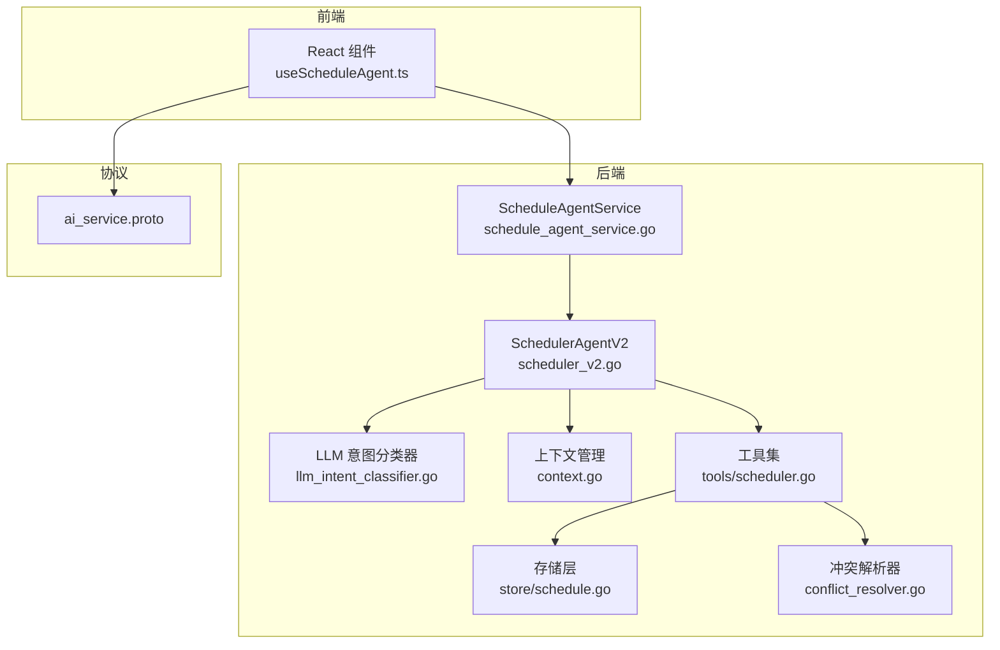
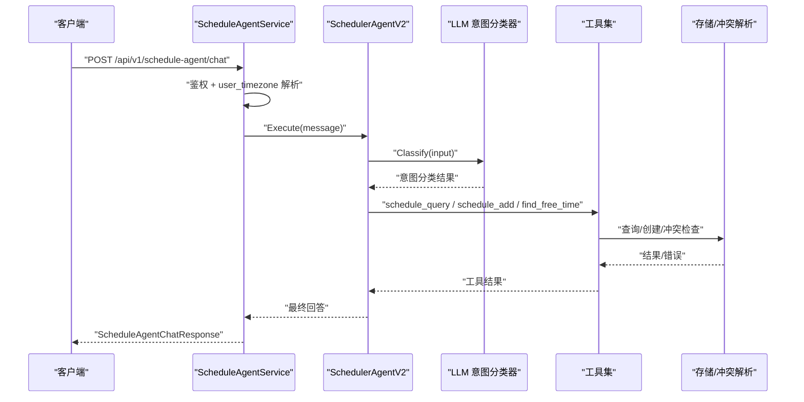
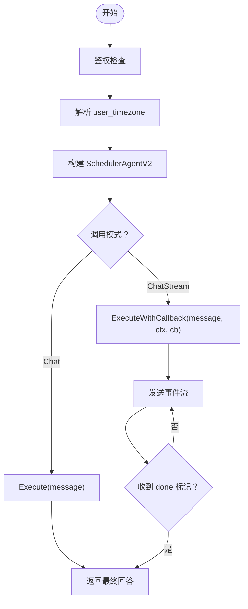
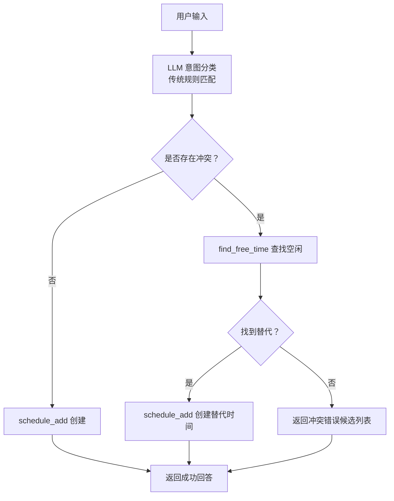
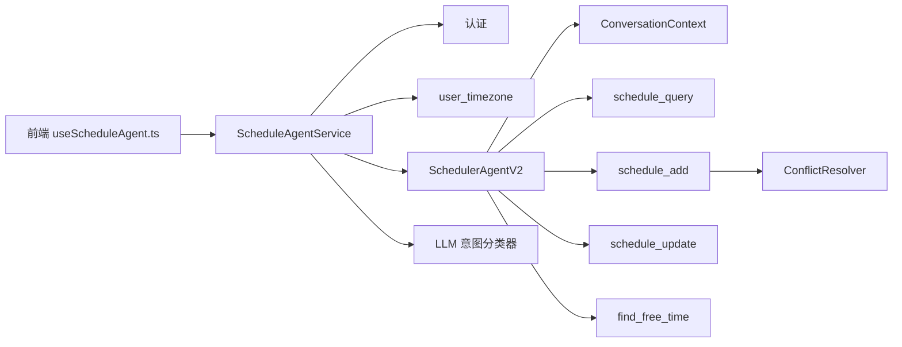

# 日程代理 API

<cite>
**本文档引用的文件**
- [schedule_agent_service.go](file://server/router/api/v1/schedule_agent_service.go)
- [ai_service.proto](file://proto/api/v1/ai_service.proto)
- [ai_service.pb.go](file://proto/gen/api/v1/ai_service.pb.go)
- [ai_service_grpc.pb.go](file://proto/gen/api/v1/ai_service_grpc.pb.go)
- [scheduler_v2.go](file://plugin/ai/agent/scheduler_v2.go)
- [schedule_parrot_v2.go](file://plugin/ai/agent/schedule_parrot_v2.go)
- [context.go](file://plugin/ai/agent/context.go)
- [llm_intent_classifier.go](file://plugin/ai/agent/llm_intent_classifier.go)
- [intent_classifier.go](file://plugin/ai/agent/intent_classifier.go)
- [scheduler.go](file://plugin/ai/agent/tools/scheduler.go)
- [parser.go](file://plugin/ai/schedule/parser.go)
- [conflict_resolver.go](file://server/service/schedule/conflict_resolver.go)
- [useScheduleAgent.ts](file://web/src/hooks/useScheduleAgent.ts)
- [Schedule.tsx](file://web/src/pages/Schedule.tsx)
- [main.go](file://cmd/schedule-agent-test/main.go)
</cite>

## 更新摘要
**所做更改**
- 新增 LLM 意图分类器集成，替代传统规则匹配
- 引入上下文感知机制，支持多轮对话状态管理
- 改进冲突检测与自动解决能力
- 优化工具包装器实现，移除旧的工具适配层
- 增强流式响应的 UI 工具事件支持

## 目录
1. [简介](#简介)
2. [项目结构](#项目结构)
3. [核心组件](#核心组件)
4. [架构总览](#架构总览)
5. [详细组件分析](#详细组件分析)
6. [依赖关系分析](#依赖关系分析)
7. [性能考量](#性能考量)
8. [故障排查指南](#故障排查指南)
9. [结论](#结论)
10. [附录](#附录)

## 简介
本文件面向开发者与集成方，系统性阐述日程代理 API 的设计与实现，重点覆盖以下方面：
- ScheduleAgentService 的两个核心接口：Chat（非流式）与 ChatStream（流式）的实现差异与使用场景
- 请求/响应消息结构：ScheduleAgentChatRequest、ScheduleAgentChatResponse、ScheduleAgentStreamResponse
- user_timezone 参数的重要性与时区处理策略
- 流式响应中 event、content、done 字段的语义与前端解析要点
- 新增的 LLM 意图分类器与上下文感知能力
- 日程意图检测、时间解析与冲突处理的实现细节
- 完整的 API 调用示例与前端集成指南

## 项目结构
日程代理 API 由后端 gRPC/HTTP 服务、AI 代理框架、工具集与前端集成模块共同组成。关键路径如下：
- 协议定义：proto/api/v1/ai_service.proto
- 后端服务：server/router/api/v1/schedule_agent_service.go
- AI 代理与工具：plugin/ai/agent/*.go、plugin/ai/agent/tools/*.go
- LLM 意图分类：plugin/ai/agent/llm_intent_classifier.go
- 上下文管理：plugin/ai/agent/context.go
- 时间解析与冲突处理：plugin/ai/schedule/parser.go、server/service/schedule/conflict_resolver.go
- 前端集成：web/src/hooks/useScheduleAgent.ts、web/src/pages/Schedule.tsx



**图表来源**
- [schedule_agent_service.go](file://server/router/api/v1/schedule_agent_service.go#L33-L53)
- [scheduler_v2.go](file://plugin/ai/agent/scheduler_v2.go#L16-L91)
- [llm_intent_classifier.go](file://plugin/ai/agent/llm_intent_classifier.go#L22-L62)
- [context.go](file://plugin/ai/agent/context.go#L19-L73)
- [scheduler.go](file://plugin/ai/agent/tools/scheduler.go#L132-L670)
- [conflict_resolver.go](file://server/service/schedule/conflict_resolver.go#L13-L97)
- [ai_service.proto](file://proto/api/v1/ai_service.proto#L120-L156)

**章节来源**
- [schedule_agent_service.go](file://server/router/api/v1/schedule_agent_service.go#L1-L304)
- [ai_service.proto](file://proto/api/v1/ai_service.proto#L120-L156)

## 核心组件
- **ScheduleAgentService**：提供 Chat 与 ChatStream 两个接口，负责鉴权、时区解析、上下文管理、代理执行与流式事件推送。
- **SchedulerAgentV2**：无框架依赖的调度代理，内置工具（查询、添加、更新、查找空闲），并注入 UI 事件回调。
- **LLM 意图分类器**：基于轻量级 LLM 的意图识别系统，提供比传统规则匹配更准确的语义理解。
- **上下文管理器**：维护多轮对话状态，支持工作流状态跟踪与精炼操作。
- **工具集**：封装 schedule_query、schedule_add、schedule_update、find_free_time 等工具，含输入校验、时区缓存与冲突自动解决。
- **冲突解析器**：在冲突发生时提供替代时间段与评分排序。
- **前端钩子**：封装非流式与流式调用，解析 UI 工具事件，驱动日历视图刷新。

**章节来源**
- [schedule_agent_service.go](file://server/router/api/v1/schedule_agent_service.go#L33-L53)
- [scheduler_v2.go](file://plugin/ai/agent/scheduler_v2.go#L16-L91)
- [llm_intent_classifier.go](file://plugin/ai/agent/llm_intent_classifier.go#L22-L62)
- [context.go](file://plugin/ai/agent/context.go#L19-L73)
- [scheduler.go](file://plugin/ai/agent/tools/scheduler.go#L132-L670)
- [conflict_resolver.go](file://server/service/schedule/conflict_resolver.go#L13-L97)
- [useScheduleAgent.ts](file://web/src/hooks/useScheduleAgent.ts#L1-L235)

## 架构总览
日程代理 API 的调用链路如下：
- 前端通过 HTTP/JSON 或 gRPC 调用 ScheduleAgentService 的 Chat/ChatStream
- 后端进行鉴权与 user_timezone 解析，构建 SchedulerAgentV2
- 代理根据用户输入与历史上下文决定工具调用序列（先查后建、冲突检测、空闲查找）
- LLM 意图分类器提供语义理解支持
- 工具执行数据库操作或冲突解析，返回结构化结果
- 流式接口将事件与最终答案分片推送给前端



**图表来源**
- [schedule_agent_service.go](file://server/router/api/v1/schedule_agent_service.go#L55-L94)
- [scheduler_v2.go](file://plugin/ai/agent/scheduler_v2.go#L175-L196)
- [llm_intent_classifier.go](file://plugin/ai/agent/llm_intent_classifier.go#L64-L74)
- [scheduler.go](file://plugin/ai/agent/tools/scheduler.go#L183-L266)

## 详细组件分析

### 接口对比：Chat（非流式） vs ChatStream（流式）
- **Chat（非流式）**
  - 输入：ScheduleAgentChatRequest（message、user_timezone）
  - 输出：ScheduleAgentChatResponse（response）
  - 特点：一次性返回最终回答；适合简单问答与批量处理
- **ChatStream（流式）**
  - 输入：ScheduleAgentChatRequest（message、user_timezone）
  - 输出：ScheduleAgentStreamResponse（event、content、done）
  - 特点：事件驱动的增量输出，支持 UI 事件（如"日程建议"、"冲突解决"等）与最终完成标记；适合交互式体验



**图表来源**
- [schedule_agent_service.go](file://server/router/api/v1/schedule_agent_service.go#L55-L94)
- [schedule_agent_service.go](file://server/router/api/v1/schedule_agent_service.go#L96-L260)

**章节来源**
- [schedule_agent_service.go](file://server/router/api/v1/schedule_agent_service.go#L55-L94)
- [schedule_agent_service.go](file://server/router/api/v1/schedule_agent_service.go#L96-L260)

### 消息结构与字段说明
- **ScheduleAgentChatRequest**
  - message：用户输入文本
  - user_timezone：IANA 时区字符串（如 Asia/Shanghai），用于时间解析与显示
- **ScheduleAgentChatResponse**
  - response：最终回答文本
- **ScheduleAgentStreamResponse**
  - event：JSON 字符串，包含 type 与 data 字段；type 常见取值："thinking"、"tool_use"、"tool_result"、"answer"、"error"、"schedule_updated"
  - content：内容分片（可选）
  - done：是否为最后一帧（布尔）

**章节来源**
- [ai_service.proto](file://proto/api/v1/ai_service.proto#L139-L156)
- [ai_service.pb.go](file://proto/gen/api/v1/ai_service.pb.go#L230-L238)

### LLM 意图分类器集成
**新增功能**：系统集成了基于轻量级 LLM 的意图分类器，提供比传统规则匹配更准确的语义理解。

- **配置与初始化**
  - 通过 Profile 配置 API 密钥和基础 URL
  - 使用 Qwen/Qwen2.5-7B-Instruct 模型，平衡速度与准确性
  - 自动降级到传统规则分类器作为后备方案

- **意图类型**
  - simple_create：创建单个日程（默认）
  - simple_query：查询日程/空闲
  - simple_update：修改/删除日程
  - batch_create：批量创建重复日程
  - conflict_resolve：处理日程冲突
  - multi_query：综合查询

- **执行流程**
  1. LLM 意图分类器接收用户输入
  2. 使用严格 JSON Schema 确保输出格式
  3. 返回意图类型、置信度和推理过程
  4. 代理根据意图调整执行策略

**章节来源**
- [schedule_agent_service.go](file://server/router/api/v1/schedule_agent_service.go#L55-L63)
- [llm_intent_classifier.go](file://plugin/ai/agent/llm_intent_classifier.go#L22-L62)
- [llm_intent_classifier.go](file://plugin/ai/agent/llm_intent_classifier.go#L64-L140)
- [intent_classifier.go](file://plugin/ai/agent/intent_classifier.go#L8-L29)

### 上下文感知与多轮对话
**新增功能**：引入完整的上下文管理系统，支持多轮对话状态跟踪。

- **ConversationContext**
  - 维护会话历史记录（最多 10 轮）
  - 跟踪工作状态（提议的日程、冲突、当前步骤）
  - 支持精炼操作（如"改为 3 点"）

- **工作流状态**
  - idle：空闲状态
  - parsing：解析中
  - conflict_check：冲突检查
  - conflict_resolve：冲突解决
  - confirming：确认中
  - completed：已完成

- **精炼提取**
  - 识别时间修改请求（"改为 3pm"）
  - 提取时间模式（"3pm"、"明天"等）
  - 保持现有字段（标题、地点等）不变

**章节来源**
- [context.go](file://plugin/ai/agent/context.go#L19-L73)
- [context.go](file://plugin/ai/agent/context.go#L94-L101)
- [context.go](file://plugin/ai/agent/context.go#L234-L306)

### user_timezone 参数的重要性
- **作用**
  - 时间解析：将自然语言中的相对时间转换为 UTC；确保跨时区用户看到正确的时间
  - 工具调用：schedule_add/find_free_time 等工具按用户时区进行日期/时间计算
  - 显示格式：前端与后端的日程展示统一采用用户时区
- **默认行为**：若未提供 user_timezone，则回退到默认时区（如 Asia/Shanghai）
- **时区缓存**：工具层对时区位置进行缓存，限制缓存大小以防止资源滥用

**章节来源**
- [schedule_agent_service.go](file://server/router/api/v1/schedule_agent_service.go#L66-L70)
- [scheduler_v2.go](file://plugin/ai/agent/scheduler_v2.go#L39-L51)
- [scheduler.go](file://plugin/ai/agent/tools/scheduler.go#L30-L94)

### 流式响应事件模型
- **事件类型与含义**
  - thinking：代理思考阶段（调试信息）
  - tool_use：调用工具（如 schedule_query、schedule_add）
  - tool_result：工具执行结果（可能包含冲突提示）
  - answer：最终回答（流式最后一帧）
  - error：异常事件
  - schedule_updated：日程创建/更新后的状态变更事件
  - **新增 UI 事件**：ui_schedule_suggestion、ui_time_slot_picker、ui_conflict_resolution

- **前端解析要点**
  - 将 event 字段解析为 JSON 对象，读取 type 与 data
  - 对于 UI 工具事件（以 ui_ 开头），data 通常为结构化数据，前端据此渲染"日程建议"、"时间槽选择器"、"冲突解决"等 UI

**章节来源**
- [schedule_agent_service.go](file://server/router/api/v1/schedule_agent_service.go#L132-L196)
- [useScheduleAgent.ts](file://web/src/hooks/useScheduleAgent.ts#L138-L194)

### 日程意图检测、时间解析与冲突处理
- **意图检测与时间解析**
  - 代理在系统提示中强调"先查后建"与"冲突必处理"，并提供默认 1 小时时长与时间推断规则
  - 时间解析由独立的 Parser 模块完成，将自然语言转为 UTC 时间戳，并进行格式与边界校验
  - **新增**：LLM 意图分类器提供更准确的语义理解，支持复杂查询场景

- **冲突处理**
  - schedule_add 在创建失败时触发冲突解析，自动寻找替代时间段并返回结构化错误（包含候选时间）
  - 冲突解析器在同日、相邻日范围内搜索空闲时段，按"同日优先、相近时段优先、工作时段偏好"等策略打分排序
  - **改进**：结合上下文信息，提供更智能的冲突解决建议



**图表来源**
- [scheduler_v2.go](file://plugin/ai/agent/scheduler_v2.go#L348-L400)
- [llm_intent_classifier.go](file://plugin/ai/agent/llm_intent_classifier.go#L64-L74)
- [scheduler.go](file://plugin/ai/agent/tools/scheduler.go#L459-L648)
- [conflict_resolver.go](file://server/service/schedule/conflict_resolver.go#L45-L97)

**章节来源**
- [scheduler_v2.go](file://plugin/ai/agent/scheduler_v2.go#L348-L400)
- [parser.go](file://plugin/ai/schedule/parser.go#L62-L76)
- [conflict_resolver.go](file://server/service/schedule/conflict_resolver.go#L45-L97)

### 前后端集成要点
- **非流式 Chat**
  - 前端将历史消息拼接为完整上下文，调用 chat 接口
  - 成功后使计划列表失效刷新
- **流式 ChatStream**
  - 前端订阅事件流，解析 event 并渲染 UI 工具事件
  - 收到 done 标记后结束流式渲染
  - **新增**：支持 UI 事件的实时响应和状态更新

**章节来源**
- [useScheduleAgent.ts](file://web/src/hooks/useScheduleAgent.ts#L101-L133)
- [useScheduleAgent.ts](file://web/src/hooks/useScheduleAgent.ts#L196-L234)
- [Schedule.tsx](file://web/src/pages/Schedule.tsx#L53-L60)

## 依赖关系分析
- **ScheduleAgentService 依赖**
  - 认证：从上下文提取用户 ID
  - 时区：默认 Asia/Shanghai，可被 user_timezone 覆盖
  - 代理：SchedulerAgentV2
  - LLM 意图分类器：可选配置
  - 上下文存储：ContextStore（内存存储）
  - 存储：schedule.Service（查询/创建/冲突检查）
  - 冲突解析：ConflictResolver
- **代理依赖**
  - 工具集：schedule_query、schedule_add、schedule_update、find_free_time
  - 上下文：ConversationContext（多轮对话状态）
  - 意图分类器：LLMIntentClassifier（可选）
- **前端依赖**
  - scheduleAgentServiceClient（gRPC/HTTP 客户端）
  - useScheduleAgent 钩子（封装调用与事件解析）



**图表来源**
- [schedule_agent_service.go](file://server/router/api/v1/schedule_agent_service.go#L33-L53)
- [context.go](file://plugin/ai/agent/context.go#L19-L73)
- [scheduler_v2.go](file://plugin/ai/agent/scheduler_v2.go#L58-L90)
- [llm_intent_classifier.go](file://plugin/ai/agent/llm_intent_classifier.go#L22-L62)
- [scheduler.go](file://plugin/ai/agent/tools/scheduler.go#L132-L670)
- [conflict_resolver.go](file://server/service/schedule/conflict_resolver.go#L13-L24)
- [useScheduleAgent.ts](file://web/src/hooks/useScheduleAgent.ts#L1-L235)

**章节来源**
- [schedule_agent_service.go](file://server/router/api/v1/schedule_agent_service.go#L33-L53)
- [context.go](file://plugin/ai/agent/context.go#L19-L73)
- [scheduler_v2.go](file://plugin/ai/agent/scheduler_v2.go#L58-L90)
- [llm_intent_classifier.go](file://plugin/ai/agent/llm_intent_classifier.go#L22-L62)
- [scheduler.go](file://plugin/ai/agent/tools/scheduler.go#L132-L670)
- [conflict_resolver.go](file://server/service/schedule/conflict_resolver.go#L13-L24)
- [useScheduleAgent.ts](file://web/src/hooks/useScheduleAgent.ts#L1-L235)

## 性能考量
- **时区缓存**：对常用时区进行缓存，超过阈值时重置，避免无限增长
- **工具调用**：按需调用，遵循"先查后建"减少无效写入
- **流式传输**：事件分片降低首屏延迟，提升交互体验
- **上下文长度**：ConversationContext 限制最近 10 轮对话，控制提示长度
- **LLM 意图分类**：使用轻量级模型（Qwen/Qwen2.5-7B-Instruct），平衡准确性与性能
- **缓存策略**：时区缓存最大 100 项，防止恶意输入导致的内存膨胀

**章节来源**
- [scheduler.go](file://plugin/ai/agent/tools/scheduler.go#L30-L94)
- [context.go](file://plugin/ai/agent/context.go#L116-L135)
- [llm_intent_classifier.go](file://plugin/ai/agent/llm_intent_classifier.go#L40-L62)

## 故障排查指南
- **未授权访问**
  - 现象：返回 401
  - 处理：确保携带有效身份信息
- **时区无效**
  - 现象：回退到默认时区或使用 UTC
  - 处理：提供合法 IANA 时区字符串（如 Asia/Shanghai）
- **工具调用失败**
  - 现象：event 类型为 error；或 schedule_add 返回冲突错误
  - 处理：根据工具返回的错误信息或替代时间重新发起请求
- **流式事件解析异常**
  - 现象：前端解析 event JSON 失败
  - 处理：检查 event 字段是否为合法 JSON；对 UI 工具事件进行二次 JSON 解析
- **LLM 意图分类失败**
  - 现象：使用传统规则分类器作为后备
  - 处理：检查 API 密钥和网络连接；系统会自动降级
- **上下文丢失**
  - 现象：多轮对话状态不连续
  - 处理：检查 ContextStore 配置；当前为内存存储，重启后会丢失

**章节来源**
- [schedule_agent_service.go](file://server/router/api/v1/schedule_agent_service.go#L59-L61)
- [schedule_agent_service.go](file://server/router/api/v1/schedule_agent_service.go#L110-L113)
- [schedule_agent_service.go](file://server/router/api/v1/schedule_agent_service.go#L200-L214)
- [llm_intent_classifier.go](file://plugin/ai/agent/llm_intent_classifier.go#L112-L117)
- [useScheduleAgent.ts](file://web/src/hooks/useScheduleAgent.ts#L138-L167)

## 结论
日程代理 API 通过清晰的接口设计与事件驱动的流式响应，实现了"先查后建、冲突必处理"的智能日程管理。新增的 LLM 意图分类器提供了更准确的语义理解，上下文感知机制支持复杂的多轮对话场景。user_timezone 是贯穿时间解析、工具调用与显示的关键参数。配合完善的冲突解析与 UI 工具事件，既能满足非流式批处理场景，也能提供流畅的交互式体验。集成方应重点关注时区设置、事件解析与上下文管理，以获得稳定一致的用户体验。

## 附录

### API 定义与调用示例

- **协议定义（节选）**
  - 服务：ScheduleAgentService
  - 方法：Chat、ChatStream
  - 请求：ScheduleAgentChatRequest（message、user_timezone）
  - 响应：ScheduleAgentChatResponse（response）、ScheduleAgentStreamResponse（event、content、done）

**章节来源**
- [ai_service.proto](file://proto/api/v1/ai_service.proto#L120-L156)

- **非流式调用（伪代码）**
  - 请求体：{"message": "今天晚上想吃火锅 10 点有空么？", "user_timezone": "Asia/Shanghai"}
  - 响应体：{"response": "..."}

- **流式调用（伪代码）**
  - 请求体：{"message": "今天晚上想吃火锅 10 点有空么？", "user_timezone": "Asia/Shanghai"}
  - 响应流：事件帧（event）、内容帧（content）、完成帧（done=true）

- **前端集成要点**
  - 非流式：useScheduleAgentChat，成功后刷新计划列表
  - 流式：scheduleAgentChatStream，解析事件并渲染 UI 工具事件

**章节来源**
- [useScheduleAgent.ts](file://web/src/hooks/useScheduleAgent.ts#L101-L133)
- [useScheduleAgent.ts](file://web/src/hooks/useScheduleAgent.ts#L196-L234)

- **测试与演示**
  - 命令行测试：schedule-agent-test/main.go 展示了典型对话流程与预期输出

**章节来源**
- [main.go](file://cmd/schedule-agent-test/main.go#L17-L56)

### 新增功能详解

#### LLM 意图分类器配置
```typescript
// 后端配置示例
const intentClassifier = agent.NewLLMIntentClassifier(agent.LLMIntentConfig{
    APIKey:  profile.AISiliconFlowAPIKey,
    BaseURL: profile.AISiliconFlowBaseURL,
    Model:   "Qwen/Qwen2.5-7B-Instruct",
});
```

#### 上下文管理使用
```typescript
// 前端多轮对话示例
const history = [
  { role: "user", content: "今天下午3点有空吗？" },
  { role: "assistant", content: "让我查一下今天的安排。" },
  { role: "user", content: "改为4点可以吗？" }
];
```

#### UI 工具事件处理
```typescript
// 前端 UI 事件解析
function handleUIEvent(event: ParsedEvent) {
  if (event.uiType === "ui_schedule_suggestion") {
    // 渲染日程建议组件
  } else if (event.uiType === "ui_conflict_resolution") {
    // 渲染冲突解决界面
  }
}
```

**章节来源**
- [llm_intent_classifier.go](file://plugin/ai/agent/llm_intent_classifier.go#L40-L62)
- [context.go](file://plugin/ai/agent/context.go#L234-L306)
- [useScheduleAgent.ts](file://web/src/hooks/useScheduleAgent.ts#L172-L194)