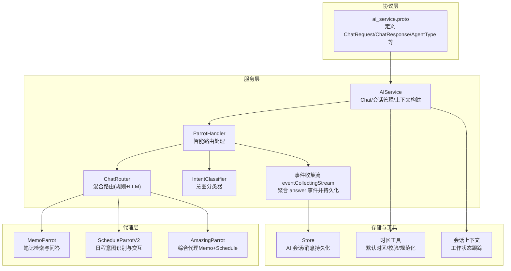
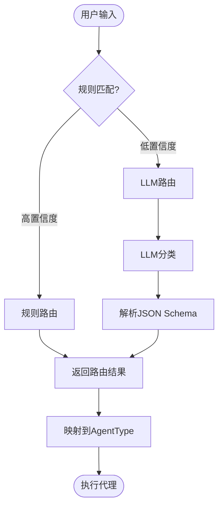
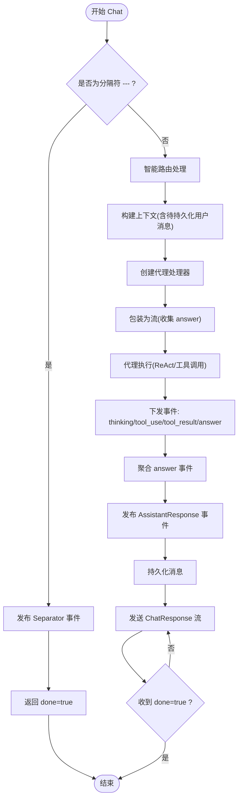
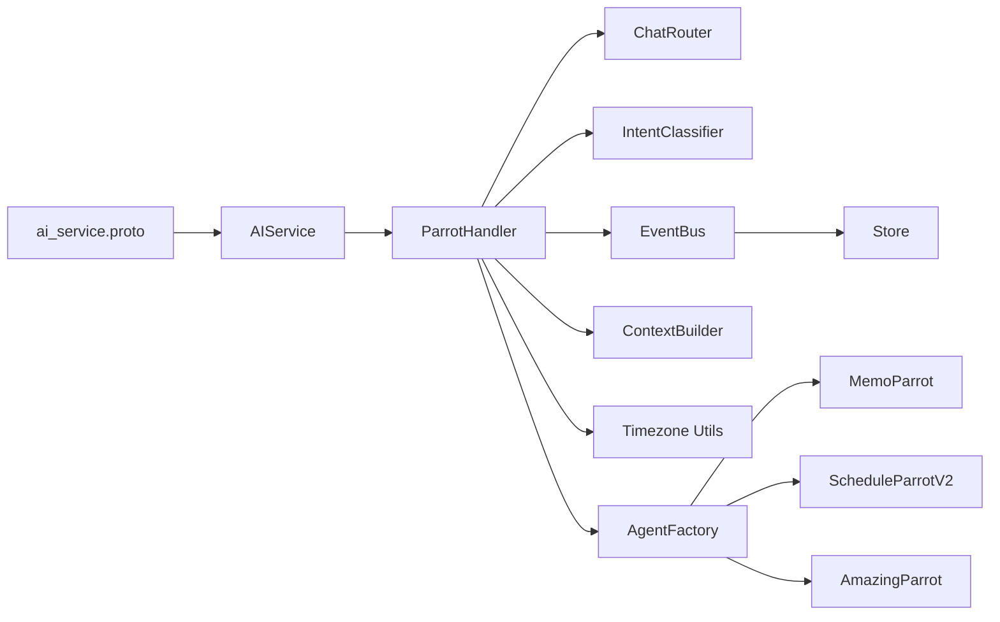

# 聊天对话 API

<cite>
**本文引用的文件**
- [ai_service.proto](file://proto/api/v1/ai_service.proto)
- [ai_service_chat.go](file://server/router/api/v1/ai_service_chat.go)
- [ai_service_conversation.go](file://server/router/api/v1/ai_service_conversation.go)
- [ai_service.go](file://server/router/api/v1/ai_service.go)
- [timezone.go](file://server/router/api/v1/ai/timezone.go)
- [factory.go](file://server/router/api/v1/ai/factory.go)
- [handler.go](file://server/router/api/v1/ai/handler.go)
- [types.go](file://plugin/ai/agent/types.go)
- [memo_parrot.go](file://plugin/ai/agent/memo_parrot.go)
- [schedule_parrot_v2.go](file://plugin/ai/agent/schedule_parrot_v2.go)
- [amazing_parrot.go](file://plugin/ai/agent/amazing_parrot.go)
- [chat_router.go](file://plugin/ai/agent/chat_router.go)
- [intent_classifier.go](file://plugin/ai/agent/intent_classifier.go)
- [llm_intent_classifier.go](file://plugin/ai/agent/llm_intent_classifier.go)
- [context.go](file://plugin/ai/agent/context.go)
- [config.go](file://plugin/ai/config.go)
- [useParrotChat.ts](file://web/src/hooks/useParrotChat.ts)
- [AI-013-chat-api.md](file://docs/specs/AI-013-chat-api.md)
</cite>

## 更新摘要
**所做更改**
- 新增智能代理路由系统，支持基于规则和 LLM 的混合路由机制
- 新增意图分类功能，支持简单创建、查询、更新、批量创建等多种意图类型
- 改进对话管理和流式反馈集成，提供更好的用户体验
- 新增会话上下文管理，支持工作状态跟踪和多轮对话理解
- 优化代理工厂模式，统一处理所有智能助手类型

## 目录
1. [简介](#简介)
2. [项目结构](#项目结构)
3. [核心组件](#核心组件)
4. [架构总览](#架构总览)
5. [详细组件分析](#详细组件分析)
6. [依赖关系分析](#依赖关系分析)
7. [性能考量](#性能考量)
8. [故障排查指南](#故障排查指南)
9. [结论](#结论)
10. [附录：API 调用示例与最佳实践](#附录api-调用示例与最佳实践)

## 简介
本文件面向"聊天对话 API"的使用者与开发者，系统化阐述基于 gRPC/Protobuf 的流式聊天接口设计与实现，涵盖：
- Chat 接口的流式响应处理机制与事件模型
- ChatRequest 与 ChatResponse 的完整消息结构
- 聊天历史管理、会话状态维护与上下文传递
- AgentType 枚举与各智能助手类型的功能特性
- 智能代理路由系统与意图分类功能
- 用户时区处理、意图检测与日程创建/查询分析
- 完整的 API 调用示例、错误处理策略与最佳实践

## 项目结构
该聊天系统围绕 AIService 的 Chat 方法构建，采用"智能路由 + 代理工厂 + 流式回调"的架构，结合前端事件驱动的 UI 更新。



**图表来源**
- [ai_service.proto](file://proto/api/v1/ai_service.proto#L193-L211)
- [ai_service_chat.go](file://server/router/api/v1/ai_service_chat.go#L58-L206)
- [handler.go](file://server/router/api/v1/ai/handler.go#L25-L43)
- [chat_router.go](file://plugin/ai/agent/chat_router.go#L42-L68)
- [intent_classifier.go](file://plugin/ai/agent/intent_classifier.go#L31-L47)
- [timezone.go](file://server/router/api/v1/ai/timezone.go#L36-L52)
- [context.go](file://plugin/ai/agent/context.go#L19-L37)

**章节来源**
- [ai_service.proto](file://proto/api/v1/ai_service.proto#L193-L211)
- [ai_service_chat.go](file://server/router/api/v1/ai_service_chat.go#L58-L206)
- [ai_service_conversation.go](file://server/router/api/v1/ai_service_conversation.go#L302-L417)
- [ai_service.go](file://server/router/api/v1/ai_service.go#L20-L55)
- [timezone.go](file://server/router/api/v1/ai/timezone.go#L36-L52)
- [factory.go](file://server/router/api/v1/ai/factory.go#L62-L99)
- [handler.go](file://server/router/api/v1/ai/handler.go#L25-L43)

## 核心组件
- AIService.Chat：gRPC 流式入口，负责鉴权、限流、会话事件触发、上下文构建、智能路由与流式转发。
- 智能路由系统：ChatRouter 提供混合路由机制，先进行快速规则匹配，再使用 LLM 进行精确分类。
- 意图分类器：IntentClassifier 支持多种意图类型，包括简单创建、查询、更新、批量创建等。
- 事件总线 EventBus：解耦会话持久化与代理执行，统一发出"开始会话/用户消息/助手回复/分隔符"等事件。
- 代理工厂 AgentFactory：根据 AgentType 创建对应代理（MemoParrot、ScheduleParrotV2、AmazingParrot）。
- 代理实现：
  - MemoParrot：基于检索的 ReAct 思维链，支持缓存与流式回答。
  - ScheduleParrotV2：原生工具调用的日程代理，支持冲突检测与 UI 工具事件。
  - AmazingParrot：综合代理，两阶段并发检索与合成回答。
- 会话与消息：AIConversation/AIMessage，支持分隔符（清除上下文）、增量加载、消息计数与摘要。
- 会话上下文：ConversationContext 支持工作状态跟踪、多轮对话理解和意图推理。
- 时区工具：默认时区、有效性校验与规范化，确保日程解析一致性。

**章节来源**
- [ai_service_chat.go](file://server/router/api/v1/ai_service_chat.go#L58-L206)
- [handler.go](file://server/router/api/v1/ai/handler.go#L25-L43)
- [chat_router.go](file://plugin/ai/agent/chat_router.go#L42-L68)
- [intent_classifier.go](file://plugin/ai/agent/intent_classifier.go#L31-L47)
- [types.go](file://plugin/ai/agent/types.go#L107-L139)
- [memo_parrot.go](file://plugin/ai/agent/memo_parrot.go#L74-L200)
- [schedule_parrot_v2.go](file://plugin/ai/agent/schedule_parrot_v2.go#L31-L77)
- [amazing_parrot.go](file://plugin/ai/agent/amazing_parrot.go#L100-L184)
- [ai_service_conversation.go](file://server/router/api/v1/ai_service_conversation.go#L302-L417)
- [context.go](file://plugin/ai/agent/context.go#L19-L37)
- [timezone.go](file://server/router/api/v1/ai/timezone.go#L36-L52)

## 架构总览
下图展示了从请求到响应的端到端流程，包括鉴权、限流、智能路由、会话事件、上下文构建、代理执行与流式回传。

```mermaid
sequenceDiagram
participant C as "客户端"
participant G as "AIService.Chat"
participant PH as "ParrotHandler"
participant CR as "ChatRouter"
participant IC as "IntentClassifier"
participant CS as "会话服务 ConversationService"
participant CB as "上下文构建 ContextBuilder"
participant FH as "代理工厂 Factory"
participant H as "路由处理器 RoutingHandler"
participant A as "具体代理(如 Memo/Amazing/Schedule)"
participant ST as "存储 Store"
C->>G : "ChatRequest(消息/历史/时区/AgentType/会话ID)"
G->>G : "鉴权/限流/参数校验"
G->>PH : "智能路由处理"
PH->>CR : "混合路由(规则+LLM)"
CR-->>PH : "路由结果(RouteType)"
PH->>IC : "意图分类(可选)"
IC-->>PH : "意图类型(TaskIntent)"
PH->>CS : "创建/获取会话"
CS-->>PH : "返回会话ID"
PH->>CB : "BuildContext(含待持久化用户消息)"
CB-->>PH : "返回历史(排除当前消息)"
PH->>FH : "创建代理(按路由结果)"
PH->>H : "Handle(带流包装)"
H->>A : "ExecuteWithCallback(ReAct/工具调用)"
A-->>H : "事件 : thinking/tool_use/tool_result/answer"
H-->>G : "事件转发(含最终 answer)"
G->>ST : "持久化消息"
G-->>C : "ChatResponse(流式 chunks + 最终字段)"
end
```

**图表来源**
- [ai_service_chat.go](file://server/router/api/v1/ai_service_chat.go#L58-L206)
- [handler.go](file://server/router/api/v1/ai/handler.go#L45-L113)
- [chat_router.go](file://plugin/ai/agent/chat_router.go#L70-L101)
- [intent_classifier.go](file://plugin/ai/agent/intent_classifier.go#L104-L125)
- [ai_service_conversation.go](file://server/router/api/v1/ai_service_conversation.go#L191-L244)
- [factory.go](file://server/router/api/v1/ai/factory.go#L82-L99)
- [types.go](file://plugin/ai/agent/types.go#L107-L139)

## 详细组件分析

### ChatRequest 与 ChatResponse 结构
- ChatRequest 字段要点
  - message：必填，用户输入
  - history：可选，历史消息列表（兼容迁移）
  - user_timezone：可选，IANA 时区；无效或为空则回退默认时区
  - schedule_query_mode：可选，日程查询模式（AUTO/STANDARD/STRICT）
  - agent_type：可选，智能助手类型（DEFAULT/MEMO/SCHEDULE/AMAZING/AUTO）
  - conversation_id：可选，会话 ID；0 表示新建
  - is_temp_conversation：可选，是否临时会话
- ChatResponse 字段要点
  - content：流式内容块
  - sources：引用来源（memos/{id} 列表）
  - done：流结束标记
  - schedule_creation_intent：最终块携带的"日程创建意图"分析
  - schedule_query_result：最终块携带的"日程查询结果"
  - event_type/event_data：通用事件承载，用于代理内部事件（如 thinking/tool_use 等）

**章节来源**
- [ai_service.proto](file://proto/api/v1/ai_service.proto#L202-L211)
- [ai_service.proto](file://proto/api/v1/ai_service.proto#L292-L303)

### 智能代理路由系统
- ChatRouter 提供混合路由机制，先进行快速规则匹配，再使用 LLM 进行精确分类
- 规则匹配包含高置信度关键词和时间表达式，支持中英文混合输入
- LLM 分类使用严格 JSON Schema 输出格式，确保结果可解析性
- 支持三种路由类型：memo（笔记）、schedule（日程）、amazing（综合）



**图表来源**
- [chat_router.go](file://plugin/ai/agent/chat_router.go#L70-L101)
- [chat_router.go](file://plugin/ai/agent/chat_router.go#L103-L180)
- [chat_router.go](file://plugin/ai/agent/chat_router.go#L182-L250)

**章节来源**
- [chat_router.go](file://plugin/ai/agent/chat_router.go#L42-L68)
- [chat_router.go](file://plugin/ai/agent/chat_router.go#L70-L101)
- [chat_router.go](file://plugin/ai/agent/chat_router.go#L103-L180)
- [chat_router.go](file://plugin/ai/agent/chat_router.go#L182-L250)

### 意图分类功能
- 支持六种意图类型：simple_create、simple_query、simple_update、batch_create、conflict_resolve、multi_query
- 规则引擎优先检测批量操作和查询意图，然后处理更新意图，最后默认为创建意图
- 批量意图检测包含正则表达式模式和关键词匹配
- 查询意图通过关键词和时间表达式判断，避免与创建意图混淆

**章节来源**
- [intent_classifier.go](file://plugin/ai/agent/intent_classifier.go#L8-L29)
- [intent_classifier.go](file://plugin/ai/agent/intent_classifier.go#L104-L125)
- [intent_classifier.go](file://plugin/ai/agent/intent_classifier.go#L127-L144)
- [intent_classifier.go](file://plugin/ai/agent/intent_classifier.go#L146-L164)
- [intent_classifier.go](file://plugin/ai/agent/intent_classifier.go#L166-L174)

### 流式响应处理机制
- 服务器端通过 eventCollectingStream 聚合 answer 或 content 事件，累积完整回答后发布 EventAssistantResponse 并持久化。
- 客户端收到多个 content 块，最后收到 done=true，同时可能在最后一个块中携带 schedule_creation_intent 或 schedule_query_result。
- 代理内部事件（如 thinking/tool_use/tool_result）通过 event_type/event_data 下发，前端据此更新 UI。



**图表来源**
- [ai_service_chat.go](file://server/router/api/v1/ai_service_chat.go#L115-L206)
- [handler.go](file://server/router/api/v1/ai/handler.go#L45-L113)
- [types.go](file://plugin/ai/agent/types.go#L107-L139)

**章节来源**
- [ai_service_chat.go](file://server/router/api/v1/ai_service_chat.go#L188-L206)
- [handler.go](file://server/router/api/v1/ai/handler.go#L115-L190)
- [types.go](file://plugin/ai/agent/types.go#L107-L139)

### 聊天历史管理与上下文传递
- 后端优先通过 ContextBuilder 从数据库构建上下文，确保分隔符（SEPARATOR）过滤生效，且排除当前待持久化的用户消息。
- 若后端构建失败，则回退使用前端传入的 history（兼容迁移期）。
- 历史消息在代理执行前注入到 LLM 的 messages 中，保证多轮对话连贯性。
- 会话消息列表支持增量同步：通过 last_message_uid 与 limit 控制分页与一致性校验。

**章节来源**
- [ai_service_chat.go](file://server/router/api/v1/ai_service_chat.go#L140-L185)
- [ai_service_conversation.go](file://server/router/api/v1/ai_service_conversation.go#L302-L417)

### 会话状态维护与分隔符
- 分隔符（SEPARATOR）用于"清空上下文"，后续请求仅包含分隔符之后的消息。
- AIService 提供 AddContextSeparator 接口，幂等地在末尾追加分隔符并更新会话时间戳。
- 会话消息列表在返回时过滤 SUMMARY 类型消息，避免前端显示干扰。

**章节来源**
- [ai_service_chat.go](file://server/router/api/v1/ai_service_chat.go#L115-L127)
- [ai_service_conversation.go](file://server/router/api/v1/ai_service_conversation.go#L191-L244)
- [ai_service_conversation.go](file://server/router/api/v1/ai_service_conversation.go#L302-L417)

### AgentType 枚举与智能助手类型
- DEFAULT：兼容旧版本，映射为 AUTO，启用智能路由
- MEMO（🦜 灰灰）：笔记检索与问答，支持缓存与流式回答
- SCHEDULE（🦜 金刚）：日程意图识别与交互，支持冲突检测与 UI 工具事件
- AMAZING（🦜 惊奇）：综合代理，两阶段并发检索与合成回答
- AUTO：智能路由模式，根据用户输入自动选择最优代理

**章节来源**
- [ai_service.proto](file://proto/api/v1/ai_service.proto#L193-L200)
- [factory.go](file://server/router/api/v1/ai/factory.go#L18-L23)
- [handler.go](file://server/router/api/v1/ai/handler.go#L32-L43)
- [memo_parrot.go](file://plugin/ai/agent/memo_parrot.go#L68-L72)
- [schedule_parrot_v2.go](file://plugin/ai/agent/schedule_parrot_v2.go#L26-L29)
- [amazing_parrot.go](file://plugin/ai/agent/amazing_parrot.go#L94-L97)

### 用户时区处理
- 支持通过 ChatRequest.user_timezone 传入 IANA 时区；若为空或无效，使用默认时区（Asia/Shanghai），并缓存 time.Location。
- 工厂创建 ScheduleParrotV2 时会规范化时区，确保日程解析一致。

**章节来源**
- [ai_service_chat.go](file://server/router/api/v1/ai_service_chat.go#L84-L86)
- [timezone.go](file://server/router/api/v1/ai/timezone.go#L36-L52)
- [factory.go](file://server/router/api/v1/ai/factory.go#L126-L128)

### 意图检测与日程创建/查询分析
- 在流式响应的最后一个块中，服务端可附加：
  - schedule_creation_intent：检测用户是否有创建日程的意图及自然语言描述
  - schedule_query_result：检测用户是否有查询日程的意图，并返回匹配的日程列表与时间范围描述
- 代理内部通过事件（如 schedule_query_result、schedule_updated）与前端进行交互，前端据此渲染 UI 工具（如时间槽选择、冲突解决、快捷操作）。

**章节来源**
- [ai_service.proto](file://proto/api/v1/ai_service.proto#L292-L303)
- [types.go](file://plugin/ai/agent/types.go#L129-L138)
- [useParrotChat.ts](file://web/src/hooks/useParrotChat.ts#L107-L126)

### 会话上下文管理
- ConversationContext 维护多轮对话状态，包括对话历史、工作状态和时间戳
- WorkingState 跟踪代理的当前理解，包括提议的日程、冲突检测和最后意图
- 支持精炼提取，从用户输入中识别时间修改等细化操作
- 提供 JSON 序列化和历史提示转换功能，便于 LLM 上下文构建

**章节来源**
- [context.go](file://plugin/ai/agent/context.go#L19-L37)
- [context.go](file://plugin/ai/agent/context.go#L57-L73)
- [context.go](file://plugin/ai/agent/context.go#L234-L306)
- [context.go](file://plugin/ai/agent/context.go#L342-L352)

### 错误分类与重试策略
- 错误分为三类：瞬时（可重试）、永久（不可重试）、冲突（需特殊处理）
- 提供 ClassifyError、ShouldRetry、GetRetryDelay、GetActionHint 等辅助方法，指导代理执行的健壮性

**章节来源**
- [error_class.go](file://plugin/ai/agent/error_class.go#L84-L149)

## 依赖关系分析
- 协议层（proto）定义了 ChatRequest/ChatResponse 与 AgentType，约束前后端契约
- 服务层（AIService）依赖智能路由系统（ChatRouter）与事件总线（EventBus），并通过 ContextBuilder 构建上下文
- 智能路由系统依赖意图分类器（IntentClassifier）和代理工厂（AgentFactory）
- 代理层（Memo/Amazing/Schedule）实现统一接口，支持事件回调与工具调用
- 存储层（Store）负责会话与消息的持久化
- 前端通过事件驱动消费流式响应，渲染 UI



**图表来源**
- [ai_service.proto](file://proto/api/v1/ai_service.proto#L193-L211)
- [ai_service_chat.go](file://server/router/api/v1/ai_service_chat.go#L18-L56)
- [handler.go](file://server/router/api/v1/ai/handler.go#L25-L43)
- [chat_router.go](file://plugin/ai/agent/chat_router.go#L42-L68)
- [intent_classifier.go](file://plugin/ai/agent/intent_classifier.go#L31-L47)
- [factory.go](file://server/router/api/v1/ai/factory.go#L62-L99)

**章节来源**
- [ai_service_chat.go](file://server/router/api/v1/ai_service_chat.go#L18-L56)
- [handler.go](file://server/router/api/v1/ai/handler.go#L25-L43)
- [factory.go](file://server/router/api/v1/ai/factory.go#L62-L99)

## 性能考量
- 智能路由：规则匹配（0ms）→ LLM 分类（~400ms），快速路径优先
- 流式输出：前端即时渲染，提升交互体验
- 缓存优化：MemoParrot/AmazingParrot 使用 LRU 缓存减少重复计算
- 并发检索：AmazingParrot 两阶段并发检索，缩短响应时间
- 上下文截断：ContextBuilder 与后端构建逻辑控制 token 数量，避免过长上下文
- 会话摘要：达到阈值后异步触发摘要，降低后续检索成本
- 会话上下文：限制保留最近10轮对话，控制内存使用

**章节来源**
- [chat_router.go](file://plugin/ai/agent/chat_router.go#L70-L101)
- [memo_parrot.go](file://plugin/ai/agent/memo_parrot.go#L18-L24)
- [amazing_parrot.go](file://plugin/ai/agent/amazing_parrot.go#L33-L47)
- [ai_service_chat.go](file://server/router/api/v1/ai_service_chat.go#L271-L292)
- [context.go](file://plugin/ai/agent/context.go#L131-L135)

## 故障排查指南
- 未登录/鉴权失败：返回 Unauthenticated
- AI 功能禁用：返回 Unavailable
- LLM 不可用：返回 Unavailable
- 速率限制：返回 ResourceExhausted
- 会话持久化异常：日志记录并继续流式响应
- 时区无效：回退默认时区
- 代理执行错误：通过错误分类决定是否重试或提示用户
- 智能路由失败：自动降级到 Amazing 代理
- 意图分类失败：使用规则引擎作为后备方案

**章节来源**
- [ai_service_chat.go](file://server/router/api/v1/ai_service_chat.go#L63-L79)
- [handler.go](file://server/router/api/v1/ai/handler.go#L51-L78)
- [error_class.go](file://plugin/ai/agent/error_class.go#L84-L149)

## 结论
该聊天对话 API 通过清晰的智能路由架构、灵活的代理体系与稳健的上下文管理，实现了从"流式响应"到"意图识别与日程处理"的全链路能力。新增的智能代理路由系统和意图分类功能进一步提升了系统的智能化水平，配合前端事件驱动的 UI 渲染，既保证了性能与体验，也为后续扩展（如 UI 工具、多模态）提供了良好基础。

## 附录：API 调用示例与最佳实践

### API 调用示例（gRPC/Protobuf）
- 端点：POST /api/v1/ai/chat
- 请求体：ChatRequest（包含 message、可选 history、user_timezone、agent_type、conversation_id、is_temp_conversation）
- 响应流：ChatResponse（多次 content 块，最后 done=true；可携带 schedule_creation_intent/schedule_query_result）

**章节来源**
- [ai_service.proto](file://proto/api/v1/ai_service.proto#L30-L36)
- [ai_service_chat.go](file://server/router/api/v1/ai_service_chat.go#L58-L206)

### 前端处理要点（事件驱动）
- 监听流式响应，逐块渲染 content
- 监听 event_type/event_data，处理 thinking/tool_use/tool_result 等事件
- 最后收到 done=true 时完成渲染并触发回调
- 若出现错误，调用 onError 回调并停止渲染

**章节来源**
- [useParrotChat.ts](file://web/src/hooks/useParrotChat.ts#L76-L104)
- [types.go](file://plugin/ai/agent/types.go#L107-L139)

### 智能路由最佳实践
- 时区：始终传入有效的 IANA 时区；若不确定，允许后端回退默认时区
- 历史：优先使用后端构建的上下文；前端仅在迁移期回退使用 history
- 会话：合理使用分隔符清理无关上下文；临时会话与固定会话区分使用
- 代理选择：优先使用 AUTO 模式让系统自动选择最优代理；复杂任务优先 AMAZING
- 意图分类：系统会自动检测批量创建、查询、更新等意图，无需手动指定
- 错误处理：遵循错误分类，对瞬时错误进行指数退避重试，冲突类引导用户采取行动

**章节来源**
- [ai_service_chat.go](file://server/router/api/v1/ai_service_chat.go#L84-L86)
- [handler.go](file://server/router/api/v1/ai/handler.go#L51-L78)
- [error_class.go](file://plugin/ai/agent/error_class.go#L84-L149)
- [AI-013-chat-api.md](file://docs/specs/AI-013-chat-api.md#L19-L138)

### 智能路由配置
- ChatRouter 支持自定义 LLM API Key、BaseURL 和 Model
- 默认使用 Qwen/Qwen2.5-7B-Instruct 模型，支持 SiliconFlow 服务
- 可通过 IntentClassifierConfig 配置意图分类器
- 支持规则引擎和 LLM 引擎的混合模式，确保高准确性和低延迟

**章节来源**
- [config.go](file://plugin/ai/config.go#L47-L54)
- [config.go](file://plugin/ai/config.go#L112-L120)
- [chat_router.go](file://plugin/ai/agent/chat_router.go#L35-L47)
- [chat_router.go](file://plugin/ai/agent/chat_router.go#L49-L68)