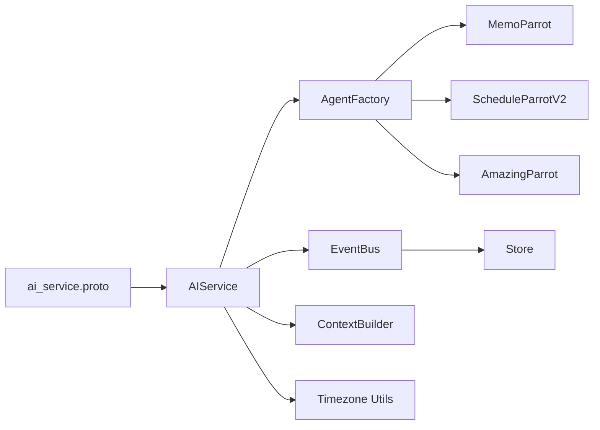

# 聊天对话 API

<cite>
**本文引用的文件**
- [ai_service.proto](file://proto/api/v1/ai_service.proto)
- [ai_service_chat.go](file://server/router/api/v1/ai_service_chat.go)
- [ai_service_conversation.go](file://server/router/api/v1/ai_service_conversation.go)
- [ai_service.go](file://server/router/api/v1/ai_service.go)
- [timezone.go](file://server/router/api/v1/ai/timezone.go)
- [factory.go](file://server/router/api/v1/ai/factory.go)
- [types.go](file://plugin/ai/agent/types.go)
- [memo_parrot.go](file://plugin/ai/agent/memo_parrot.go)
- [schedule_parrot_v2.go](file://plugin/ai/agent/schedule_parrot_v2.go)
- [amazing_parrot.go](file://plugin/ai/agent/amazing_parrot.go)
- [error_class.go](file://plugin/ai/agent/error_class.go)
- [useParrotChat.ts](file://web/src/hooks/useParrotChat.ts)
- [AI-013-chat-api.md](file://docs/specs/AI-013-chat-api.md)
</cite>

## 目录
1. [简介](#简介)
2. [项目结构](#项目结构)
3. [核心组件](#核心组件)
4. [架构总览](#架构总览)
5. [详细组件分析](#详细组件分析)
6. [依赖关系分析](#依赖关系分析)
7. [性能考量](#性能考量)
8. [故障排查指南](#故障排查指南)
9. [结论](#结论)
10. [附录：API 调用示例与最佳实践](#附录api-调用示例与最佳实践)

## 简介
本文件面向“聊天对话 API”的使用者与开发者，系统化阐述基于 gRPC/Protobuf 的流式聊天接口设计与实现，涵盖：
- Chat 接口的流式响应处理机制与事件模型
- ChatRequest 与 ChatResponse 的完整消息结构
- 聊天历史管理、会话状态维护与上下文传递
- AgentType 枚举与各智能助手类型的功能特性
- 用户时区处理、意图检测与日程创建/查询分析
- 完整的 API 调用示例、错误处理策略与最佳实践

## 项目结构
该聊天系统围绕 AIService 的 Chat 方法构建，采用“事件总线 + 代理路由 + 工厂模式 + 流式回调”的架构，结合前端事件驱动的 UI 更新。

```mermaid
graph TB
subgraph "协议层"
P["ai_service.proto<br/>定义 ChatRequest/ChatResponse/AgentType 等"]
end
subgraph "服务层"
S["AIService<br/>Chat/会话管理/上下文构建"]
FB["工厂 Factory<br/>按 AgentType 创建代理"]
EH["事件收集流 eventCollectingStream<br/>聚合 answer 事件并持久化"]
end
subgraph "代理层"
MP["MemoParrot<br/>笔记检索与问答"]
SP["ScheduleParrotV2<br/>日程意图识别与交互"]
AP["AmazingParrot<br/>综合代理Memo+Schedule"]
end
subgraph "存储与工具"
ST["Store<br/>AI 会话/消息持久化"]
TZ["时区工具<br/>默认时区/校验/规范化"]
end
P --> S
S --> FB
FB --> MP
FB --> SP
FB --> AP
S --> EH
EH --> ST
S --> TZ
```

图表来源
- [ai_service.proto](file://proto/api/v1/ai_service.proto#L193-L211)
- [ai_service_chat.go](file://server/router/api/v1/ai_service_chat.go#L58-L206)
- [factory.go](file://server/router/api/v1/ai/factory.go#L62-L99)
- [timezone.go](file://server/router/api/v1/ai/timezone.go#L36-L52)

章节来源
- [ai_service.proto](file://proto/api/v1/ai_service.proto#L193-L211)
- [ai_service_chat.go](file://server/router/api/v1/ai_service_chat.go#L58-L206)
- [ai_service_conversation.go](file://server/router/api/v1/ai_service_conversation.go#L302-L417)
- [ai_service.go](file://server/router/api/v1/ai_service.go#L20-L55)
- [timezone.go](file://server/router/api/v1/ai/timezone.go#L36-L52)
- [factory.go](file://server/router/api/v1/ai/factory.go#L62-L99)

## 核心组件
- AIService.Chat：gRPC 流式入口，负责鉴权、限流、会话事件触发、上下文构建、代理路由与流式转发。
- 事件总线 EventBus：解耦会话持久化与代理执行，统一发出“开始会话/用户消息/助手回复/分隔符”等事件。
- 代理工厂 AgentFactory：根据 AgentType 创建对应代理（MemoParrot、ScheduleParrotV2、AmazingParrot）。
- 代理实现：
  - MemoParrot：基于检索的 ReAct 思维链，支持缓存与流式回答。
  - ScheduleParrotV2：原生工具调用的日程代理，支持冲突检测与 UI 工具事件。
  - AmazingParrot：综合代理，两阶段并发检索与合成回答。
- 会话与消息：AIConversation/AIMessage，支持分隔符（清除上下文）、增量加载、消息计数与摘要。
- 时区工具：默认时区、有效性校验与规范化，确保日程解析一致性。

章节来源
- [ai_service_chat.go](file://server/router/api/v1/ai_service_chat.go#L58-L206)
- [types.go](file://plugin/ai/agent/types.go#L107-L139)
- [memo_parrot.go](file://plugin/ai/agent/memo_parrot.go#L74-L200)
- [schedule_parrot_v2.go](file://plugin/ai/agent/schedule_parrot_v2.go#L31-L77)
- [amazing_parrot.go](file://plugin/ai/agent/amazing_parrot.go#L100-L184)
- [ai_service_conversation.go](file://server/router/api/v1/ai_service_conversation.go#L302-L417)
- [timezone.go](file://server/router/api/v1/ai/timezone.go#L36-L52)

## 架构总览
下图展示了从请求到响应的端到端流程，包括鉴权、限流、会话事件、上下文构建、代理执行与流式回传。

```mermaid
sequenceDiagram
participant C as "客户端"
participant G as "AIService.Chat"
participant EB as "事件总线 EventBus"
participant CS as "会话服务 ConversationService"
participant CB as "上下文构建 ContextBuilder"
participant FH as "代理工厂 Factory"
participant H as "路由处理器 RoutingHandler"
participant A as "具体代理(如 Memo/Amazing/Schedule)"
participant ST as "存储 Store"
C->>G : "ChatRequest(消息/历史/时区/AgentType/会话ID)"
G->>G : "鉴权/限流/参数校验"
G->>EB : "发布 EventConversationStart"
EB->>CS : "创建/获取会话"
CS-->>EB : "返回会话ID"
EB-->>G : "回传会话ID(可选)"
alt 请求为分隔符
G->>EB : "发布 EventSeparator"
G-->>C : "done=true"
else 正常对话
G->>EB : "发布 EventUserMessage"
G->>CB : "BuildContext(含待持久化用户消息)"
CB-->>G : "返回历史(排除当前消息)"
G->>FH : "创建代理(按 AgentType)"
G->>H : "Handle(带流包装)"
H->>A : "ExecuteWithCallback(ReAct/工具调用)"
A-->>H : "事件 : thinking/tool_use/tool_result/answer"
H-->>G : "事件转发(含最终 answer)"
G->>EB : "发布 EventAssistantResponse(聚合 answer)"
EB->>ST : "持久化消息"
G-->>C : "ChatResponse(流式 chunks + 最终字段)"
end
```

图表来源
- [ai_service_chat.go](file://server/router/api/v1/ai_service_chat.go#L58-L206)
- [ai_service_conversation.go](file://server/router/api/v1/ai_service_conversation.go#L191-L244)
- [factory.go](file://server/router/api/v1/ai/factory.go#L82-L99)
- [types.go](file://plugin/ai/agent/types.go#L107-L139)

## 详细组件分析

### ChatRequest 与 ChatResponse 结构
- ChatRequest 字段要点
  - message：必填，用户输入
  - history：可选，历史消息列表（兼容迁移）
  - user_timezone：可选，IANA 时区；无效或为空则回退默认时区
  - schedule_query_mode：可选，日程查询模式（AUTO/STANDARD/STRICT）
  - agent_type：可选，智能助手类型（DEFAULT/MEMO/SCHEDULE/AMAZING/CREATIVE）
  - conversation_id：可选，会话 ID；0 表示新建
  - is_temp_conversation：可选，是否临时会话
- ChatResponse 字段要点
  - content：流式内容块
  - sources：引用来源（memos/{id} 列表）
  - done：流结束标记
  - schedule_creation_intent：最终块携带的“日程创建意图”分析
  - schedule_query_result：最终块携带的“日程查询结果”
  - event_type/event_data：通用事件承载，用于代理内部事件（如 thinking/tool_use 等）

章节来源
- [ai_service.proto](file://proto/api/v1/ai_service.proto#L202-L211)
- [ai_service.proto](file://proto/api/v1/ai_service.proto#L292-L303)

### 流式响应处理机制
- 服务器端通过 eventCollectingStream 聚合 answer 或 content 事件，累积完整回答后发布 EventAssistantResponse 并持久化。
- 客户端收到多个 content 块，最后收到 done=true，同时可能在最后一个块中携带 schedule_creation_intent 或 schedule_query_result。
- 代理内部事件（如 thinking/tool_use/tool_result）通过 event_type/event_data 下发，前端据此更新 UI。

```mermaid
flowchart TD
Start(["开始 Chat"]) --> CheckSep{"是否为分隔符 --- ?"}
CheckSep --> |是| EmitSep["发布 Separator 事件"] --> DoneSep["返回 done=true"] --> End(["结束"])
CheckSep --> |否| BuildCtx["构建上下文(含待持久化用户消息)"]
BuildCtx --> CreateHandler["创建代理处理器"]
CreateHandler --> StreamWrap["包装为流(收集 answer)"]
StreamWrap --> Exec["代理执行(ReAct/工具调用)"]
Exec --> Events["下发事件: thinking/tool_use/tool_result/answer"]
Events --> Collect["聚合 answer 事件"]
Collect --> Publish["发布 AssistantResponse 事件"]
Publish --> Persist["持久化消息"]
Persist --> SendResp["发送 ChatResponse 流"]
SendResp --> Done{"收到 done=true ?"}
Done --> |否| SendResp
Done --> |是| End
```

图表来源
- [ai_service_chat.go](file://server/router/api/v1/ai_service_chat.go#L115-L206)
- [types.go](file://plugin/ai/agent/types.go#L107-L139)

章节来源
- [ai_service_chat.go](file://server/router/api/v1/ai_service_chat.go#L188-L206)
- [types.go](file://plugin/ai/agent/types.go#L107-L139)

### 聊天历史管理与上下文传递
- 后端优先通过 ContextBuilder 从数据库构建上下文，确保分隔符（SEPARATOR）过滤生效，且排除当前待持久化的用户消息。
- 若后端构建失败，则回退使用前端传入的 history（兼容迁移期）。
- 历史消息在代理执行前注入到 LLM 的 messages 中，保证多轮对话连贯性。
- 会话消息列表支持增量同步：通过 last_message_uid 与 limit 控制分页与一致性校验。

章节来源
- [ai_service_chat.go](file://server/router/api/v1/ai_service_chat.go#L140-L185)
- [ai_service_conversation.go](file://server/router/api/v1/ai_service_conversation.go#L302-L417)

### 会话状态维护与分隔符
- 分隔符（SEPARATOR）用于“清空上下文”，后续请求仅包含分隔符之后的消息。
- AIService 提供 AddContextSeparator 接口，幂等地在末尾追加分隔符并更新会话时间戳。
- 会话消息列表在返回时过滤 SUMMARY 类型消息，避免前端显示干扰。

章节来源
- [ai_service_chat.go](file://server/router/api/v1/ai_service_chat.go#L115-L127)
- [ai_service_conversation.go](file://server/router/api/v1/ai_service_conversation.go#L191-L244)
- [ai_service_conversation.go](file://server/router/api/v1/ai_service_conversation.go#L302-L417)

### AgentType 枚举与智能助手类型
- DEFAULT：兼容旧版本，映射为 AMAZING
- MEMO（🦜 灰灰）：笔记检索与问答，支持缓存与流式回答
- SCHEDULE（🦜 金刚）：日程意图识别与交互，支持冲突检测与 UI 工具事件
- AMAZING（🦜 惊奇）：综合代理，两阶段并发检索与合成回答
- CREATIVE：兼容旧版本，映射为 AMAZING

章节来源
- [ai_service.proto](file://proto/api/v1/ai_service.proto#L193-L200)
- [factory.go](file://server/router/api/v1/ai/factory.go#L29-L41)
- [memo_parrot.go](file://plugin/ai/agent/memo_parrot.go#L68-L72)
- [schedule_parrot_v2.go](file://plugin/ai/agent/schedule_parrot_v2.go#L26-L29)
- [amazing_parrot.go](file://plugin/ai/agent/amazing_parrot.go#L94-L97)

### 用户时区处理
- 支持通过 ChatRequest.user_timezone 传入 IANA 时区；若为空或无效，使用默认时区（Asia/Shanghai），并缓存 time.Location。
- 工厂创建 ScheduleParrotV2 时会规范化时区，确保日程解析一致。

章节来源
- [ai_service_chat.go](file://server/router/api/v1/ai_service_chat.go#L84-L86)
- [timezone.go](file://server/router/api/v1/ai/timezone.go#L36-L52)
- [factory.go](file://server/router/api/v1/ai/factory.go#L126-L128)

### 意图检测与日程创建/查询分析
- 在流式响应的最后一个块中，服务端可附加：
  - schedule_creation_intent：检测用户是否有创建日程的意图及自然语言描述
  - schedule_query_result：检测用户是否有查询日程的意图，并返回匹配的日程列表与时间范围描述
- 代理内部通过事件（如 schedule_query_result、schedule_updated）与前端进行交互，前端据此渲染 UI 工具（如时间槽选择、冲突解决、快捷操作）。

章节来源
- [ai_service.proto](file://proto/api/v1/ai_service.proto#L292-L303)
- [types.go](file://plugin/ai/agent/types.go#L129-L138)
- [useParrotChat.ts](file://web/src/hooks/useParrotChat.ts#L107-L126)

### 错误分类与重试策略
- 错误分为三类：瞬时（可重试）、永久（不可重试）、冲突（需特殊处理）
- 提供 ClassifyError、ShouldRetry、GetRetryDelay、GetActionHint 等辅助方法，指导代理执行的健壮性

章节来源
- [error_class.go](file://plugin/ai/agent/error_class.go#L84-L149)

## 依赖关系分析
- 协议层（proto）定义了 ChatRequest/ChatResponse 与 AgentType，约束前后端契约
- 服务层（AIService）依赖工厂（AgentFactory）与事件总线（EventBus），并通过 ContextBuilder 构建上下文
- 代理层（Memo/Amazing/Schedule）实现统一接口，支持事件回调与工具调用
- 存储层（Store）负责会话与消息的持久化
- 前端通过事件驱动消费流式响应，渲染 UI

图表来源
- [ai_service.proto](file://proto/api/v1/ai_service.proto#L193-L211)
- [ai_service_chat.go](file://server/router/api/v1/ai_service_chat.go#L18-L56)
- [factory.go](file://server/router/api/v1/ai/factory.go#L62-L99)

章节来源
- [ai_service_chat.go](file://server/router/api/v1/ai_service_chat.go#L18-L56)
- [factory.go](file://server/router/api/v1/ai/factory.go#L62-L99)

## 性能考量
- 流式输出：前端即时渲染，提升交互体验
- 缓存优化：MemoParrot/AmazingParrot 使用 LRU 缓存减少重复计算
- 并发检索：AmazingParrot 两阶段并发检索，缩短响应时间
- 上下文截断：ContextBuilder 与后端构建逻辑控制 token 数量，避免过长上下文
- 会话摘要：达到阈值后异步触发摘要，降低后续检索成本

章节来源
- [memo_parrot.go](file://plugin/ai/agent/memo_parrot.go#L18-L24)
- [amazing_parrot.go](file://plugin/ai/agent/amazing_parrot.go#L33-L47)
- [ai_service_chat.go](file://server/router/api/v1/ai_service_chat.go#L271-L292)

## 故障排查指南
- 未登录/鉴权失败：返回 Unauthenticated
- AI 功能禁用：返回 Unavailable
- LLM 不可用：返回 Unavailable
- 速率限制：返回 ResourceExhausted
- 会话持久化异常：日志记录并继续流式响应
- 时区无效：回退默认时区
- 代理执行错误：通过错误分类决定是否重试或提示用户

章节来源
- [ai_service_chat.go](file://server/router/api/v1/ai_service_chat.go#L63-L79)
- [error_class.go](file://plugin/ai/agent/error_class.go#L84-L149)

## 结论
该聊天对话 API 通过清晰的事件驱动架构、灵活的代理体系与稳健的上下文管理，实现了从“流式响应”到“意图识别与日程处理”的全链路能力。配合前端事件驱动的 UI 渲染，既保证了性能与体验，也为后续扩展（如 UI 工具、多模态）提供了良好基础。

## 附录：API 调用示例与最佳实践

### API 调用示例（gRPC/Protobuf）
- 端点：POST /api/v1/ai/chat
- 请求体：ChatRequest（包含 message、可选 history、user_timezone、agent_type、conversation_id、is_temp_conversation）
- 响应流：ChatResponse（多次 content 块，最后 done=true；可携带 schedule_creation_intent/schedule_query_result）

章节来源
- [ai_service.proto](file://proto/api/v1/ai_service.proto#L30-L36)
- [ai_service_chat.go](file://server/router/api/v1/ai_service_chat.go#L58-L206)

### 前端处理要点（事件驱动）
- 监听流式响应，逐块渲染 content
- 监听 event_type/event_data，处理 thinking/tool_use/tool_result 等事件
- 最后收到 done=true 时完成渲染并触发回调
- 若出现错误，调用 onError 回调并停止渲染

章节来源
- [useParrotChat.ts](file://web/src/hooks/useParrotChat.ts#L76-L104)
- [types.go](file://plugin/ai/agent/types.go#L107-L139)

### 最佳实践
- 时区：始终传入有效的 IANA 时区；若不确定，允许后端回退默认时区
- 历史：优先使用后端构建的上下文；前端仅在迁移期回退使用 history
- 会话：合理使用分隔符清理无关上下文；临时会话与固定会话区分使用
- 代理选择：根据场景选择 MEMO/SCHEDULE/AMAZING；复杂任务优先 AMAZING
- 错误处理：遵循错误分类，对瞬时错误进行指数退避重试，冲突类引导用户采取行动

章节来源
- [ai_service_chat.go](file://server/router/api/v1/ai_service_chat.go#L84-L86)
- [error_class.go](file://plugin/ai/agent/error_class.go#L84-L149)
- [AI-013-chat-api.md](file://docs/specs/AI-013-chat-api.md#L19-L138)