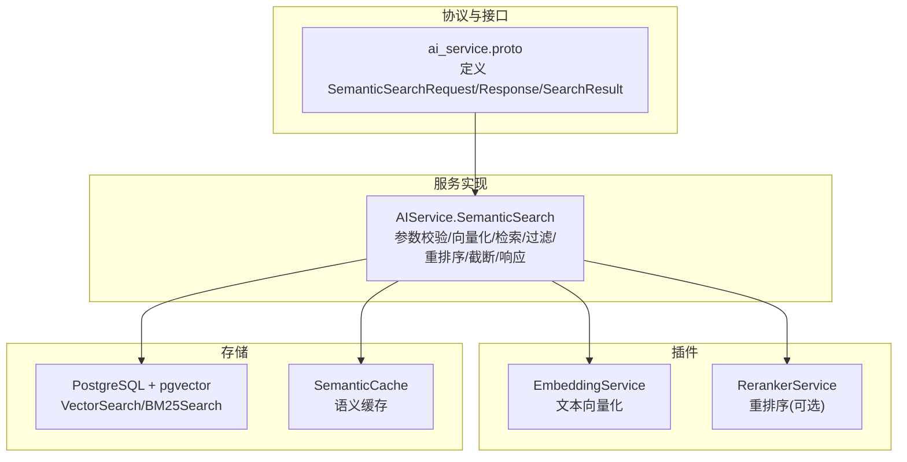
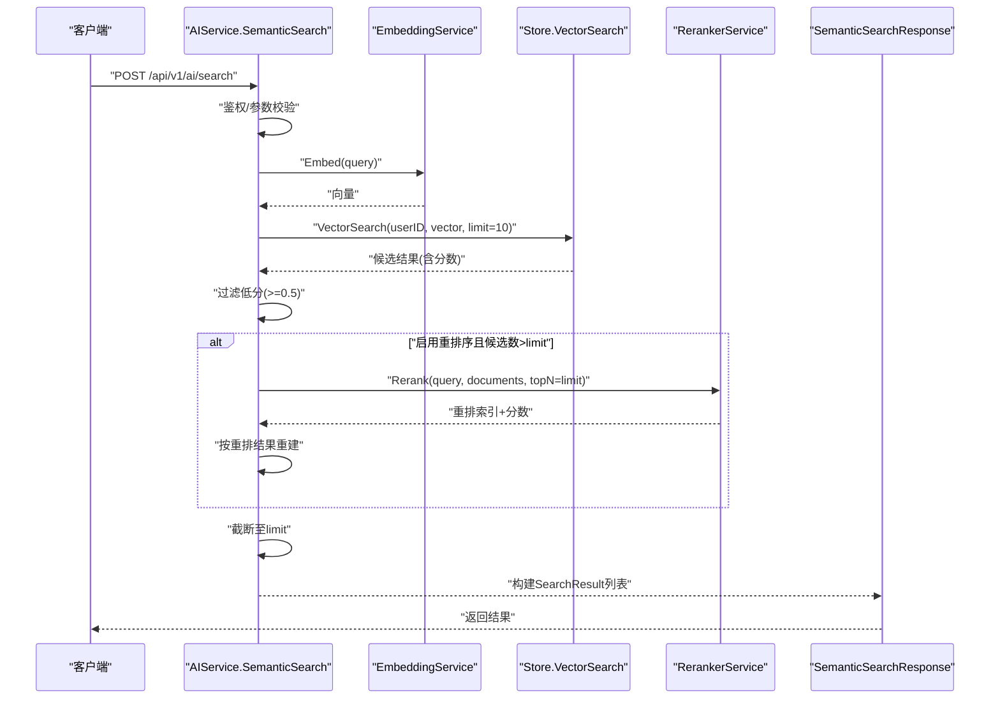
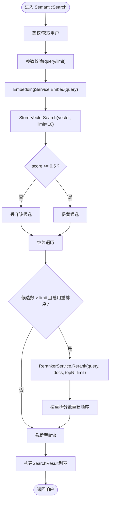
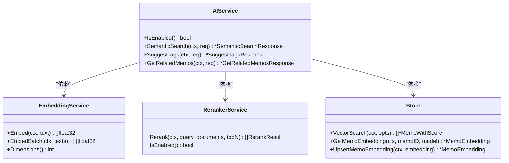
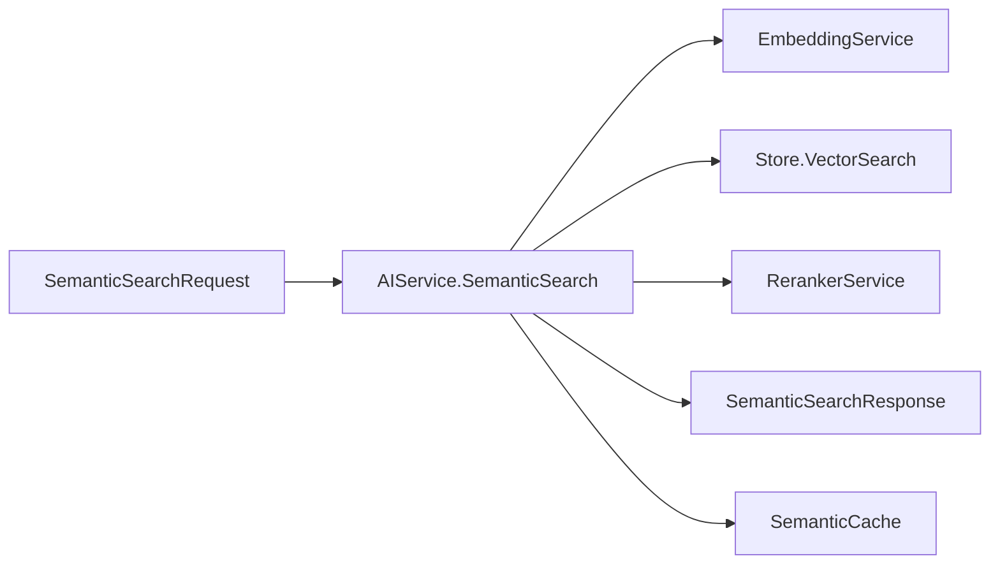

# 语义搜索 API

<cite>
**本文引用的文件**
- [ai_service.proto](file://proto/api/v1/ai_service.proto)
- [ai_service_semantic.go](file://server/router/api/v1/ai_service_semantic.go)
- [ai_service.go](file://server/router/api/v1/ai_service.go)
- [embedding.go](file://plugin/ai/embedding.go)
- [reranker.go](file://plugin/ai/reranker.go)
- [memo_embedding.go](file://store/db/postgres/memo_embedding.go)
- [tiered.go](file://store/cache/tiered.go)
- [AI-012-semantic-search-api.md](file://docs/specs/AI-012-semantic-search-api.md)
- [AI-006-postgres-vector-search.md](file://docs/specs/AI-006-postgres-vector-search.md)
- [query_router_test.go](file://server/queryengine/query_router_test.go)
</cite>

## 目录
1. [简介](#简介)
2. [项目结构](#项目结构)
3. [核心组件](#核心组件)
4. [架构总览](#架构总览)
5. [详细组件分析](#详细组件分析)
6. [依赖关系分析](#依赖关系分析)
7. [性能考量](#性能考量)
8. [故障排除指南](#故障排除指南)
9. [结论](#结论)
10. [附录](#附录)

## 简介
本文件系统化地文档化了语义搜索 API 的设计与实现，覆盖请求/响应模型、查询处理流程、向量检索与重排序、相关性评分与排序算法、性能优化策略、查询模式分析以及故障排除指南。目标是帮助开发者与运维人员快速理解并高效使用该接口。

## 项目结构
围绕语义搜索 API 的关键模块分布如下：
- 协议定义层：在 proto 层定义 SemanticSearchRequest/Response 与 SearchResult 结构，并声明 HTTP 映射。
- 服务实现层：在 AIService 中实现 SemanticSearch，负责鉴权、参数校验、向量化、向量检索、过滤、重排序、截断与响应构建。
- 存储层：PostgreSQL + pgvector 提供向量相似度检索与嵌入管理。
- 插件层：EmbeddingService 与 RerankerService 抽象外部服务调用。
- 缓存层：SemanticCache 支持语义近似命中，提升重复查询性能。
- 文档规范：AI-012 与 AI-006 规范明确了接口行为与数据库实现要点。

图表来源
- [ai_service.proto](file://proto/api/v1/ai_service.proto#L157-L173)
- [ai_service_semantic.go](file://server/router/api/v1/ai_service_semantic.go#L16-L131)
- [embedding.go](file://plugin/ai/embedding.go#L11-L21)
- [reranker.go](file://plugin/ai/reranker.go#L20-L27)
- [memo_embedding.go](file://store/db/postgres/memo_embedding.go#L111-L192)
- [tiered.go](file://store/cache/tiered.go#L233-L330)

章节来源
- [ai_service.proto](file://proto/api/v1/ai_service.proto#L157-L173)
- [ai_service_semantic.go](file://server/router/api/v1/ai_service_semantic.go#L16-L131)
- [memo_embedding.go](file://store/db/postgres/memo_embedding.go#L111-L192)

## 核心组件
- SemanticSearchRequest
  - 字段：query（必填）、limit（默认 10，最大 50）
- SemanticSearchResponse
  - 字段：results（SearchResult 数组）
- SearchResult
  - 字段：name（格式为 memos/{uid}）、snippet（内容片段，最长 200 字符）、score（相关性分数，0~1）

章节来源
- [ai_service.proto](file://proto/api/v1/ai_service.proto#L157-L173)

## 架构总览
语义搜索的端到端流程如下：
1. 请求进入 AIService.SemanticSearch，进行鉴权与参数校验。
2. 使用 EmbeddingService 将 query 向量化。
3. 通过 Store.VectorSearch 执行向量相似度检索（Top-K，内部默认 10）。
4. 过滤低相关性结果（阈值 0.5）。
5. 若启用重排序且候选数超过 limit，则调用 RerankerService 进行重排。
6. 截断至 limit。
7. 构建 SearchResult 列表并返回。

图表来源
- [ai_service_semantic.go](file://server/router/api/v1/ai_service_semantic.go#L16-L131)
- [embedding.go](file://plugin/ai/embedding.go#L60-L98)
- [memo_embedding.go](file://store/db/postgres/memo_embedding.go#L111-L192)
- [reranker.go](file://plugin/ai/reranker.go#L59-L126)

## 详细组件分析

### SemanticSearch 接口与数据模型
- 请求模型
  - query：必填；长度限制（最小 2，最大 1000），去除首尾空白后校验。
  - limit：默认 10，上限 50。
- 响应模型
  - results：SearchResult 数组，每个包含 name、snippet、score。
- 数据流
  - 输入 query -> 向量 -> 向量检索 -> 过滤 -> 可选重排序 -> 截断 -> 输出 SearchResult。

章节来源
- [ai_service_semantic.go](file://server/router/api/v1/ai_service_semantic.go#L28-L57)
- [ai_service.proto](file://proto/api/v1/ai_service.proto#L157-L173)

### 查询处理机制
- 鉴权与上下文
  - 通过 getCurrentUser 获取当前用户，未登录返回未授权。
- 参数校验
  - query 必填；长度约束；limit 默认与上限约束。
- 向量化
  - 使用 EmbeddingService.Embed 生成向量。
- 向量检索
  - Store.VectorSearch 使用 pgvector 的余弦距离（1 - 余弦相似度）进行排序，返回 Top 10。
- 过滤
  - 仅保留 score >= 0.5 的候选。
- 重排序（可选）
  - 当 RerankerService 可用且候选数 > limit 时，对候选内容进行重排，按新分数排序。
- 截断与响应
  - 截断至 limit；构建 SearchResult（name、snippet、score）。

图表来源
- [ai_service_semantic.go](file://server/router/api/v1/ai_service_semantic.go#L16-L131)

章节来源
- [ai_service_semantic.go](file://server/router/api/v1/ai_service_semantic.go#L16-L131)

### 搜索限制参数
- query 长度
  - 最小长度：2（去空白后）
  - 最大长度：1000
- limit
  - 默认：10
  - 上限：50
- 向量检索
  - 内部 Top-K：10（面向 2C2G 的优化）
- 过滤阈值
  - score >= 0.5

章节来源
- [ai_service_semantic.go](file://server/router/api/v1/ai_service_semantic.go#L33-L57)
- [memo_embedding.go](file://store/db/postgres/memo_embedding.go#L111-L192)

### 相关性评分与排序算法
- 向量检索评分
  - 使用 pgvector 的余弦距离计算相似度，返回 1 - (embedding <=> query_vector)，范围 0~1。
- 过滤
  - 以 0.5 为阈值过滤低相关性结果。
- 重排序
  - 若启用，RerankerService 返回每个候选的 relevance_score，并按降序重排。
- 截断
  - 最终结果严格控制在 limit 条以内。

章节来源
- [memo_embedding.go](file://store/db/postgres/memo_embedding.go#L119-L133)
- [ai_service_semantic.go](file://server/router/api/v1/ai_service_semantic.go#L75-L110)
- [reranker.go](file://plugin/ai/reranker.go#L104-L126)

### 查询引擎工作原理
- 文本预处理
  - query 去除首尾空白；长度校验；最终用于向量化。
- 向量搜索
  - Store.VectorSearch 在 memo_embedding 表中按模型与用户过滤，使用 pgvector 的向量列进行相似度比较。
- 结果重排序
  - RerankerService 通过外部 API（如 SiliconFlow）对候选文档进行重排，返回重排后的索引与分数。
- 结果构建
  - 构造 SearchResult，其中 snippet 为内容前缀（最多 200 字符）。

章节来源
- [ai_service_semantic.go](file://server/router/api/v1/ai_service_semantic.go#L59-L131)
- [memo_embedding.go](file://store/db/postgres/memo_embedding.go#L111-L192)
- [reranker.go](file://plugin/ai/reranker.go#L59-L126)

### 服务类与接口关系

图表来源
- [ai_service.go](file://server/router/api/v1/ai_service.go#L20-L43)
- [embedding.go](file://plugin/ai/embedding.go#L11-L21)
- [reranker.go](file://plugin/ai/reranker.go#L20-L27)
- [memo_embedding.go](file://store/db/postgres/memo_embedding.go#L111-L192)

## 依赖关系分析
- 协议与实现
  - ai_service.proto 定义 SemanticSearchRequest/Response/SearchResult，服务端在 AIService 中实现。
- 存储与向量
  - Store.VectorSearch 基于 PostgreSQL + pgvector，使用余弦距离进行相似度检索。
- 外部服务
  - EmbeddingService 通过 OpenAI 兼容 API 生成向量；RerankerService 通过外部 rerank API 进行重排。
- 缓存
  - SemanticCache 支持语义近似命中，提升重复查询性能。

图表来源
- [ai_service.proto](file://proto/api/v1/ai_service.proto#L157-L173)
- [ai_service_semantic.go](file://server/router/api/v1/ai_service_semantic.go#L16-L131)
- [tiered.go](file://store/cache/tiered.go#L233-L330)

章节来源
- [ai_service_semantic.go](file://server/router/api/v1/ai_service_semantic.go#L16-L131)
- [memo_embedding.go](file://store/db/postgres/memo_embedding.go#L111-L192)
- [tiered.go](file://store/cache/tiered.go#L233-L330)

## 性能考量
- 向量检索 Top-K
  - 内部默认 Top 10，兼顾召回与性能；当 limit 较小时可减少后续重排负担。
- 过滤阈值
  - score >= 0.5 的硬过滤可显著减少重排序与响应体积。
- 重排序策略
  - 仅在候选数超过 limit 时启用，避免不必要的重排开销。
- 缓存
  - SemanticCache 支持语义近似命中，阈值默认 0.95，可提升重复查询性能。
- 嵌入维度与模型
  - EmbeddingService.Dimensions 决定向量维度，影响相似度计算与存储开销。
- 数据库与索引
  - pgvector 向量列与模型字段需建立合适索引以支持高效相似度检索。

章节来源
- [ai_service_semantic.go](file://server/router/api/v1/ai_service_semantic.go#L65-L110)
- [tiered.go](file://store/cache/tiered.go#L250-L261)
- [embedding.go](file://plugin/ai/embedding.go#L100-L102)
- [memo_embedding.go](file://store/db/postgres/memo_embedding.go#L111-L192)

## 故障排除指南
- 未登录/鉴权失败
  - 现象：返回未授权错误。
  - 排查：确认 Authorization 头与登录状态。
- query 参数无效
  - 现象：空 query 或长度超出限制返回参数错误。
  - 排查：检查 query 长度与非空性。
- 向量服务异常
  - 现象：EmbeddingService 嵌入失败。
  - 排查：检查外部 API Key、BaseURL、模型与维度配置。
- 向量检索失败
  - 现象：VectorSearch 报错。
  - 排查：确认数据库连接、pgvector 扩展、memo_embedding 表与模型字段。
- 重排序失败
  - 现象：RerankerService 调用失败。
  - 排查：检查 API Key、超时设置与网络连通性；若禁用则按原序返回。
- 结果为空
  - 现象：过滤后无候选或数据库无匹配。
  - 排查：调整阈值或扩大检索范围；确认用户权限与可见性。

章节来源
- [ai_service_semantic.go](file://server/router/api/v1/ai_service_semantic.go#L18-L50)
- [memo_embedding.go](file://store/db/postgres/memo_embedding.go#L111-L192)
- [reranker.go](file://plugin/ai/reranker.go#L59-L126)

## 结论
语义搜索 API 通过“向量检索 + 可选重排序”的两阶段流程，在保证相关性的前提下兼顾性能与可扩展性。其关键在于：
- 清晰的参数与限制策略
- 基于 pgvector 的高效相似度检索
- 可选的重排序与语义缓存
- 明确的错误处理与降级路径

建议在生产环境中结合缓存、阈值与 Top-K 设置进行调优，并关注外部服务的可用性与成本。

## 附录

### API 定义与示例
- 端点
  - POST /api/v1/ai/search
  - 请求体：SemanticSearchRequest（query、limit）
  - 响应体：SemanticSearchResponse（results）
- 示例请求
  - curl -X POST http://localhost:8081/api/v1/ai/search -H "Authorization: Bearer $TOKEN" -H "Content-Type: application/json" -d '{"query": "测试搜索", "limit": 10}'
- 示例响应
  - results: [{name: "memos/<uid>", snippet: "...", score: 0.x}]

章节来源
- [ai_service.proto](file://proto/api/v1/ai_service.proto#L14-L20)
- [AI-012-semantic-search-api.md](file://docs/specs/AI-012-semantic-search-api.md#L176-L184)

### 查询模式与策略（参考）
- 纯日程查询：倾向于 BM25 或日程专用策略（测试用例展示）。
- 笔记查询：倾向于混合检索（BM25 加权或向量）。
- 通用问答：倾向于完整管线（含重排序）。
- 默认策略：标准混合检索。

章节来源
- [query_router_test.go](file://server/queryengine/query_router_test.go#L14-L68)