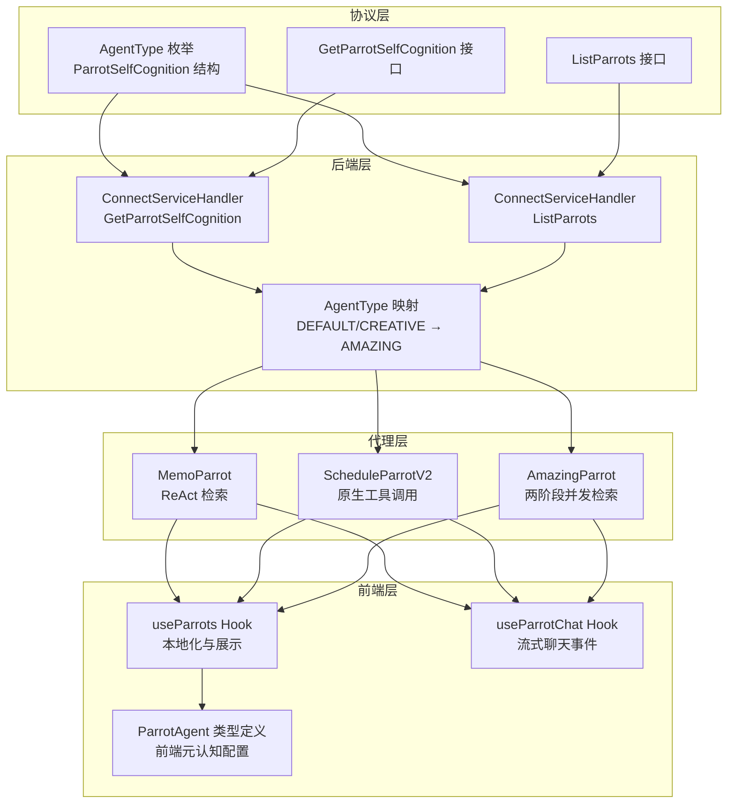
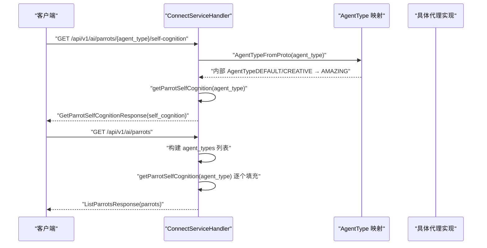
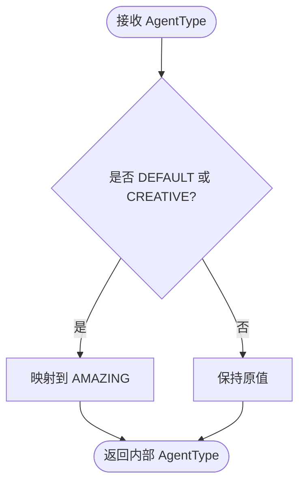
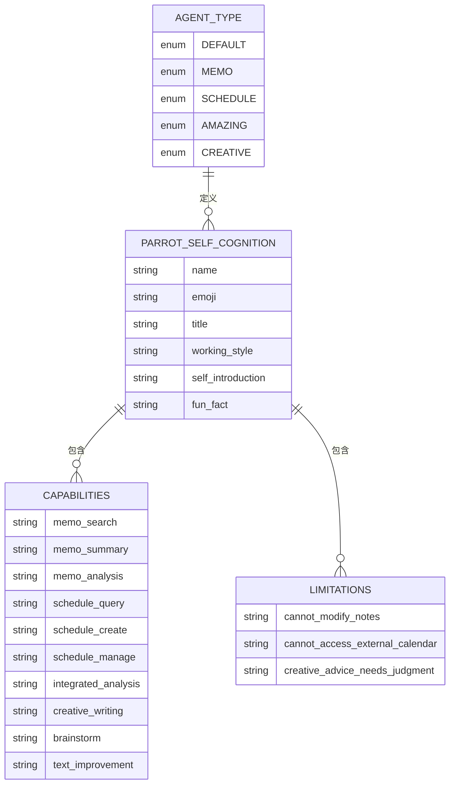
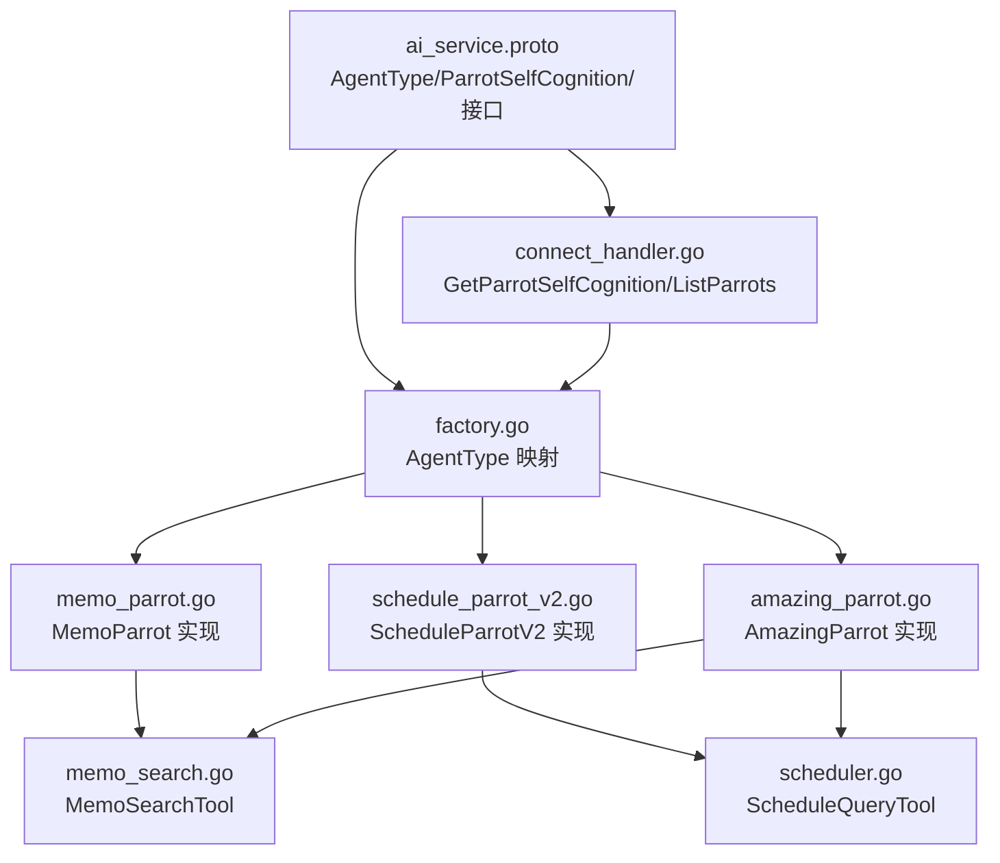

# 鹦鹉代理 API

<cite>
**本文档引用的文件**
- [ai_service.proto](file://proto/api/v1/ai_service.proto)
- [connect_handler.go](file://server/router/api/v1/connect_handler.go)
- [factory.go](file://server/router/api/v1/ai/factory.go)
- [types.go](file://plugin/ai/agent/types.go)
- [memo_parrot.go](file://plugin/ai/agent/memo_parrot.go)
- [schedule_parrot_v2.go](file://plugin/ai/agent/schedule_parrot_v2.go)
- [amazing_parrot.go](file://plugin/ai/agent/amazing_parrot.go)
- [memo_search.go](file://plugin/ai/agent/tools/memo_search.go)
- [scheduler.go](file://plugin/ai/agent/tools/scheduler.go)
- [parrot.ts](file://web/src/types/parrot.ts)
- [useParrots.ts](file://web/src/hooks/useParrots.ts)
- [useParrotChat.ts](file://web/src/hooks/useParrotChat.ts)
- [README.md](file://README.md)
</cite>

## 目录
1. [简介](#简介)
2. [项目结构](#项目结构)
3. [核心组件](#核心组件)
4. [架构概览](#架构概览)
5. [详细组件分析](#详细组件分析)
6. [依赖关系分析](#依赖关系分析)
7. [性能考量](#性能考量)
8. [故障排除指南](#故障排除指南)
9. [结论](#结论)
10. [附录](#附录)

## 简介
本文件系统性地文档化了鹦鹉代理 API，重点涵盖以下方面：
- ParrotSelfCognition 元认知模型的数据结构与字段语义
- AgentType 枚举的版本演进与兼容策略
- GetParrotSelfCognition 与 ListParrots 接口的实现与使用
- 四大代理类型（MEMO、SCHEDULE、AMAZING、CREATIVE）的能力边界与工作风格
- 代理选择策略、使用场景分析、能力矩阵与最佳实践

该文档旨在帮助开发者与产品人员快速理解并正确使用鹦鹉代理 API。

## 项目结构
鹦鹉代理 API 的实现横跨协议定义、后端路由、代理实现与前端集成四个层面：

- 协议层：通过 Protocol Buffers 定义 AgentType、ParrotSelfCognition、GetParrotSelfCognitionRequest/Response、ListParrotsRequest/Response 等消息结构
- 后端层：Connect RPC 服务端处理 GetParrotSelfCognition 与 ListParrots 请求，返回代理的元认知信息
- 代理层：MemoParrot、ScheduleParrotV2、AmazingParrot 等具体代理实现各自的 ReAct/并发检索流程与工具调用
- 前端层：React Hooks 与类型定义负责将后端返回的元认知信息本地化与交互化

图表来源
- [ai_service.proto](file://proto/api/v1/ai_service.proto#L194-L200)
- [connect_handler.go](file://server/router/api/v1/connect_handler.go#L352-L384)
- [factory.go](file://server/router/api/v1/ai/factory.go#L29-L41)
- [memo_parrot.go](file://plugin/ai/agent/memo_parrot.go#L74-L200)
- [schedule_parrot_v2.go](file://plugin/ai/agent/schedule_parrot_v2.go#L31-L102)
- [amazing_parrot.go](file://plugin/ai/agent/amazing_parrot.go#L100-L184)
- [useParrots.ts](file://web/src/hooks/useParrots.ts#L36-L64)
- [useParrotChat.ts](file://web/src/hooks/useParrotChat.ts#L48-L104)

章节来源
- [ai_service.proto](file://proto/api/v1/ai_service.proto#L194-L200)
- [connect_handler.go](file://server/router/api/v1/connect_handler.go#L352-L384)
- [factory.go](file://server/router/api/v1/ai/factory.go#L29-L41)

## 核心组件

### AgentType 枚举与兼容策略
- 枚举值包括 DEFAULT、MEMO、SCHEDULE、AMAZING、CREATIVE
- 兼容策略：DEFAULT 与 CREATIVE 在后端映射到 AMAZING，确保向后兼容与统一行为

章节来源
- [ai_service.proto](file://proto/api/v1/ai_service.proto#L194-L200)
- [factory.go](file://server/router/api/v1/ai/factory.go#L29-L41)
- [parrot.ts](file://web/src/types/parrot.ts#L105-L114)

### ParrotSelfCognition 元认知模型
- 字段语义
  - name：代理名称（如 "memo"、"schedule"、"amazing"、"creative"）
  - emoji：视觉标识（如 "🦜"、"📅"、"⭐"、"💡"）
  - title：正式头衔（如 "灰灰 - 笔记助手鹦鹉"、"金刚 - 日程助手鹦鹉"、"惊奇 - 综合助手鹦鹉"、"灵灵 - 创意助手鹦鹉"）
  - personality：性格特征列表（如 "专注"、"守时"、"全能"、"创意"）
  - capabilities：能力清单（如 "memo_search"、"schedule_query"、"integrated_analysis"、"creative_writing"）
  - limitations：限制说明（如 "不能直接修改笔记"、"不能访问外部日历"、"创意建议需要判断"）
  - working_style：工作风格（如 "ReAct 循环"、"Native Tool Calling"、"两阶段并发检索"、"纯 LLM 创作模式"）
  - favorite_tools：常用工具（如 "semantic_search"、"schedule_add"、"combined_analysis"、"idea_generation"）
  - self_introduction：第一人称介绍
  - fun_fact：有趣的事实

章节来源
- [ai_service.proto](file://proto/api/v1/ai_service.proto#L346-L357)
- [connect_handler.go](file://server/router/api/v1/connect_handler.go#L387-L455)
- [types.go](file://plugin/ai/agent/types.go#L27-L68)

### GetParrotSelfCognition 接口
- 功能：根据 AgentType 返回对应代理的 ParrotSelfCognition
- 请求：GetParrotSelfCognitionRequest（包含 agent_type）
- 响应：GetParrotSelfCognitionResponse（包含 self_cognition）

章节来源
- [ai_service.proto](file://proto/api/v1/ai_service.proto#L46-L50)
- [ai_service.proto](file://proto/api/v1/ai_service.proto#L359-L367)

### ListParrots 接口
- 功能：返回所有可用代理及其元认知信息
- 请求：ListParrotsRequest
- 响应：ListParrotsResponse（包含 ParrotInfo 列表，每个包含 agent_type、name、self_cognition）

章节来源
- [ai_service.proto](file://proto/api/v1/ai_service.proto#L52-L57)
- [ai_service.proto](file://proto/api/v1/ai_service.proto#L369-L383)
- [connect_handler.go](file://server/router/api/v1/connect_handler.go#L362-L384)

## 架构概览
鹦鹉代理 API 的调用链路如下：

图表来源
- [connect_handler.go](file://server/router/api/v1/connect_handler.go#L352-L384)
- [factory.go](file://server/router/api/v1/ai/factory.go#L29-L41)

## 详细组件分析

### AgentType 枚举与映射策略
- 后端映射规则
  - DEFAULT → AMAZING
  - CREATIVE → AMAZING
  - MEMO → MEMO
  - SCHEDULE → SCHEDULE
- 前端映射规则
  - DEFAULT/CREATIVE → AMAZING
  - MEMO → MEMO
  - SCHEDULE → SCHEDULE

图表来源
- [factory.go](file://server/router/api/v1/ai/factory.go#L29-L41)
- [parrot.ts](file://web/src/types/parrot.ts#L105-L114)

章节来源
- [ai_service.proto](file://proto/api/v1/ai_service.proto#L194-L200)
- [factory.go](file://server/router/api/v1/ai/factory.go#L29-L41)
- [parrot.ts](file://web/src/types/parrot.ts#L105-L114)

### GetParrotSelfCognition 实现要点
- 后端根据 AgentType 返回预置的 ParrotSelfCognition
- 支持 MEMO、SCHEDULE、AMAZING、CREATIVE 以及默认回退
- 前端将返回的 AgentType 映射为 ParrotAgentType（DEFAULT/CREATIVE → AMAZING）

章节来源
- [connect_handler.go](file://server/router/api/v1/connect_handler.go#L352-L359)
- [connect_handler.go](file://server/router/api/v1/connect_handler.go#L387-L455)
- [parrot.ts](file://web/src/types/parrot.ts#L105-L114)

### ListParrots 实现要点
- 返回固定代理类型集合（DEFAULT、MEMO、SCHEDULE、AMAZING、CREATIVE）
- 为每个类型生成 ParrotInfo（包含 agent_type、name、self_cognition）

章节来源
- [connect_handler.go](file://server/router/api/v1/connect_handler.go#L362-L384)

### 代理类型与工作风格

#### MEMO 代理（灰灰 - 笔记助手）
- 能力边界
  - 专注、善于总结、记忆力强
  - 能力：memo_search、memo_summary、memo_analysis
  - 限制：不能直接修改笔记、不能访问外部信息
  - 工作风格：ReAct 循环（先检索再回答）
  - 常用工具：semantic_search、memo_query
- 使用场景
  - 语义检索笔记、总结内容、关联相关信息
  - 需要严格基于已有笔记进行问答

章节来源
- [connect_handler.go](file://server/router/api/v1/connect_handler.go#L387-L401)
- [memo_parrot.go](file://plugin/ai/agent/memo_parrot.go#L74-L200)

#### SCHEDULE 代理（金刚 - 日程助手）
- 能力边界
  - 守时、条理清晰、注重计划
  - 能力：schedule_query、schedule_create、schedule_manage
  - 限制：不能代替做决定、不能访问外部日历
  - 工作风格：原生工具调用（直接高效），默认1小时时长，自动冲突检测
  - 常用工具：schedule_list、schedule_create、conflict_check、find_free_time
- 使用场景
  - 查询日程、创建/更新日程、寻找空闲时间段、冲突检测

章节来源
- [connect_handler.go](file://server/router/api/v1/connect_handler.go#L402-L414)
- [schedule_parrot_v2.go](file://plugin/ai/agent/schedule_parrot_v2.go#L31-L102)

#### AMAZING 代理（惊奇 - 综合助手）
- 能力边界
  - 全能、灵活、善于整合
  - 能力：memo_search、schedule_query、integrated_analysis
  - 限制：复杂任务可能需要专门助手
  - 工作风格：两阶段并发检索（意图分析 → 并发工具执行 → 综合回答）
  - 常用工具：memo_search、schedule_query、combined_analysis、find_free_time
- 使用场景
  - 同时检索笔记与日程、综合多源信息、一站式信息助手

章节来源
- [connect_handler.go](file://server/router/api/v1/connect_handler.go#L415-L427)
- [amazing_parrot.go](file://plugin/ai/agent/amazing_parrot.go#L100-L184)

#### CREATIVE 代理（灵灵 - 创意助手）
- 能力边界
  - 创意、活泼、善于表达
  - 能力：creative_writing、brainstorm、text_improvement
  - 限制：创意建议需要判断、不能保证所有想法都适用
  - 工作风格：纯 LLM 创作模式（无工具）
  - 常用工具：idea_generation、text_polish、style_transform
- 使用场景
  - 头脑风暴、文字润色、创意写作、表达优化

章节来源
- [connect_handler.go](file://server/router/api/v1/connect_handler.go#L428-L440)
- [README.md](file://README.md#L99-L105)

### 代理工具与能力矩阵

#### 工具能力矩阵
- MemoSearchTool
  - 输入：query、limit、min_score、strategy
  - 输出：相关笔记列表（含分数与 UID）
- ScheduleQueryTool
  - 输入：start_time、end_time
  - 输出：指定时间范围内的日程列表或“未找到”
- ScheduleAddTool / ScheduleUpdateTool / FindFreeTimeTool
  - 分别负责新增、更新日程与查找空闲时间段

章节来源
- [memo_search.go](file://plugin/ai/agent/tools/memo_search.go#L109-L193)
- [scheduler.go](file://plugin/ai/agent/tools/scheduler.go#L183-L200)

#### 代理能力矩阵

图表来源
- [ai_service.proto](file://proto/api/v1/ai_service.proto#L194-L200)
- [ai_service.proto](file://proto/api/v1/ai_service.proto#L346-L357)
- [connect_handler.go](file://server/router/api/v1/connect_handler.go#L387-L455)

## 依赖关系分析

图表来源
- [ai_service.proto](file://proto/api/v1/ai_service.proto#L194-L200)
- [connect_handler.go](file://server/router/api/v1/connect_handler.go#L352-L384)
- [factory.go](file://server/router/api/v1/ai/factory.go#L29-L41)
- [memo_parrot.go](file://plugin/ai/agent/memo_parrot.go#L74-L200)
- [schedule_parrot_v2.go](file://plugin/ai/agent/schedule_parrot_v2.go#L31-L102)
- [amazing_parrot.go](file://plugin/ai/agent/amazing_parrot.go#L100-L184)
- [memo_search.go](file://plugin/ai/agent/tools/memo_search.go#L109-L193)
- [scheduler.go](file://plugin/ai/agent/tools/scheduler.go#L183-L200)

章节来源
- [ai_service.proto](file://proto/api/v1/ai_service.proto#L194-L200)
- [connect_handler.go](file://server/router/api/v1/connect_handler.go#L352-L384)
- [factory.go](file://server/router/api/v1/ai/factory.go#L29-L41)

## 性能考量
- 缓存机制
  - MemoParrot 与 AmazingParrot 使用 LRU 缓存存储执行结果，减少重复计算
  - 缓存键包含代理名、用户 ID 与输入哈希，避免跨用户污染
- 超时控制
  - 代理执行与工具调用均设置超时保护，防止长时间阻塞
- 并发检索
  - AmazingParrot 采用两阶段并发检索，提升多源信息整合效率
- 流式输出
  - 前端支持流式事件（thinking、tool_use、tool_result、answer、error），改善用户体验

章节来源
- [memo_parrot.go](file://plugin/ai/agent/memo_parrot.go#L95-L105)
- [amazing_parrot.go](file://plugin/ai/agent/amazing_parrot.go#L126-L136)
- [useParrotChat.ts](file://web/src/hooks/useParrotChat.ts#L113-L169)

## 故障排除指南
- 常见错误类型
  - ParrotError：封装代理名称、操作与底层错误
  - 事件错误：eventType="error"，前端通过 onError 回调处理
- 排查步骤
  - 检查 AgentType 映射是否正确（DEFAULT/CREATIVE → AMAZING）
  - 确认工具输入格式（MemoSearchTool、ScheduleQueryTool 的 JSON 字段命名）
  - 观察流式事件序列（thinking → tool_use → tool_result → answer）
  - 查看缓存命中情况与超时日志

章节来源
- [types.go](file://plugin/ai/agent/types.go#L222-L256)
- [useParrotChat.ts](file://web/src/hooks/useParrotChat.ts#L153-L157)

## 结论
鹦鹉代理 API 通过清晰的协议定义、稳定的后端实现与丰富的前端集成，提供了四类互补的智能助手能力。MEMO、SCHEDULE、AMAZING、CREATIVE 代理分别覆盖笔记检索、日程管理、综合分析与创意写作等核心场景。通过合理的映射策略与工具链设计，系统在易用性、性能与可扩展性之间取得了良好平衡。

## 附录

### 代理选择策略与使用场景
- 仅需检索与总结笔记：选择 MEMO
- 需要日程查询/创建/冲突检测：选择 SCHEDULE
- 需要同时结合笔记与日程的综合分析：选择 AMAZING
- 需要纯创意写作与表达优化：选择 CREATIVE
- 兼容性考虑：DEFAULT/CREATIVE 在后端统一映射为 AMAZING

章节来源
- [connect_handler.go](file://server/router/api/v1/connect_handler.go#L387-L455)
- [factory.go](file://server/router/api/v1/ai/factory.go#L29-L41)
- [parrot.ts](file://web/src/types/parrot.ts#L105-L114)

### 最佳实践
- 明确场景优先级：先查询再行动（尤其日程相关任务）
- 合理使用并发检索：在需要综合信息时启用 AMAZING
- 注重输入规范：遵循工具的 JSON 字段命名（camelCase/snake_case 兼容）
- 利用流式事件：实时反馈思考过程与工具调用结果
- 缓存与超时：理解缓存键生成与超时机制，避免误判性能问题

章节来源
- [memo_search.go](file://plugin/ai/agent/tools/memo_search.go#L31-L51)
- [scheduler.go](file://plugin/ai/agent/tools/scheduler.go#L107-L130)
- [useParrotChat.ts](file://web/src/hooks/useParrotChat.ts#L113-L169)