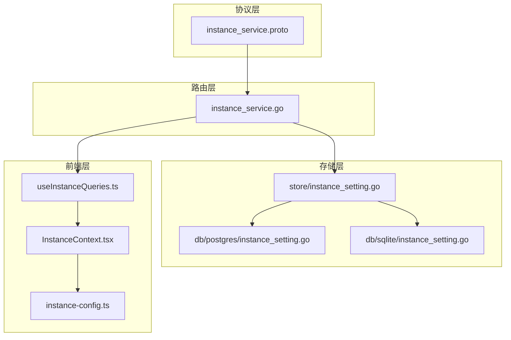
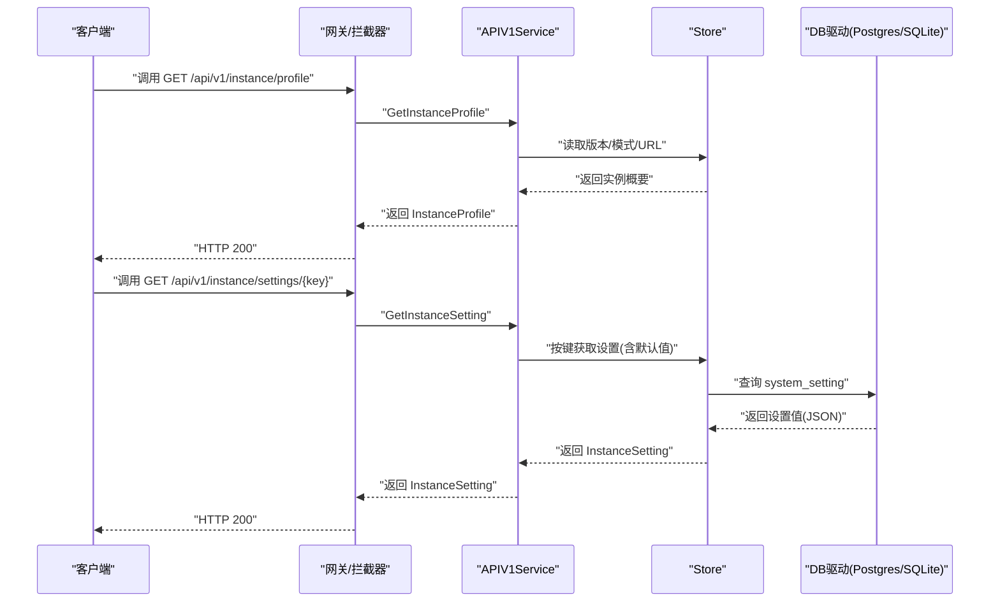
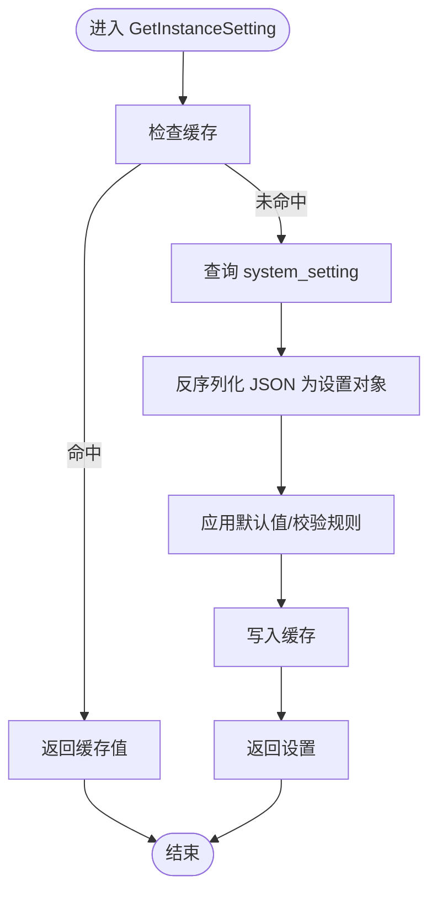
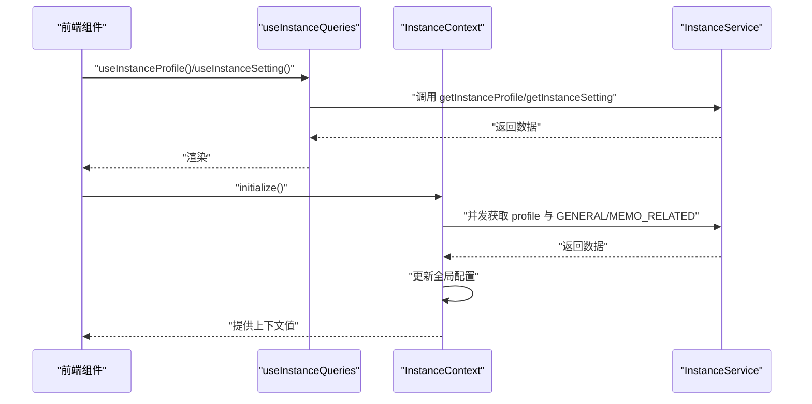
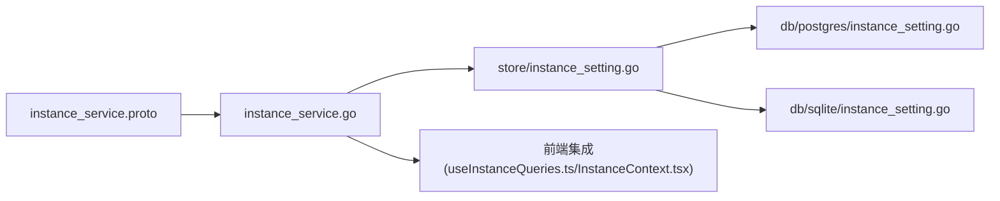

# 实例服务 API

<cite>
**本文引用的文件**
- [proto/api/v1/instance_service.proto](file://proto/api/v1/instance_service.proto)
- [server/router/api/v1/instance_service.go](file://server/router/api/v1/instance_service.go)
- [store/instance_setting.go](file://store/instance_setting.go)
- [store/db/postgres/instance_setting.go](file://store/db/postgres/instance_setting.go)
- [store/db/sqlite/instance_setting.go](file://store/db/sqlite/instance_setting.go)
- [store/user.go](file://store/user.go)
- [store/cache/cache.go](file://store/cache/cache.go)
- [web/src/hooks/useInstanceQueries.ts](file://web/src/hooks/useInstanceQueries.ts)
- [web/src/contexts/InstanceContext.tsx](file://web/src/contexts/InstanceContext.tsx)
- [web/src/instance-config.ts](file://web/src/instance-config.ts)
- [proto/gen/store/instance_setting.pb.go](file://proto/gen/store/instance_setting.pb.go)
- [store/migrator.go](file://store/migrator.go)
</cite>

## 目录
1. [简介](#简介)
2. [项目结构](#项目结构)
3. [核心组件](#核心组件)
4. [架构总览](#架构总览)
5. [详细组件分析](#详细组件分析)
6. [依赖关系分析](#依赖关系分析)
7. [性能考量](#性能考量)
8. [故障排查指南](#故障排查指南)
9. [结论](#结论)
10. [附录](#附录)

## 简介
本文件系统性地文档化“实例服务 API”，覆盖以下方面：
- 实例配置管理：实例级设置项、默认值与验证规则
- 系统设置与全局参数：实例概要、通用设置、存储设置、备忘录相关设置
- 接口规范：GET/GET/PATCH 方法的资源路径、请求/响应字段与行为
- 生命周期流程：实例初始化、配置查询、配置更新与状态查询
- 多租户与权限控制：基于角色的访问控制（HOST/ADMIN/USER）
- 最佳实践与运维建议

## 项目结构
实例服务 API 由协议定义、后端路由层、持久化层与前端集成共同组成：
- 协议层：定义服务方法、消息体与资源命名
- 路由层：实现业务逻辑、鉴权与数据转换
- 存储层：抽象驱动与具体数据库实现（PostgreSQL/SQLite）
- 前端层：查询钩子、上下文与全局配置模块

图表来源
- [proto/api/v1/instance_service.proto](file://proto/api/v1/instance_service.proto#L13-L33)
- [server/router/api/v1/instance_service.go](file://server/router/api/v1/instance_service.go#L16-L106)
- [store/instance_setting.go](file://store/instance_setting.go#L26-L100)
- [store/db/postgres/instance_setting.go](file://store/db/postgres/instance_setting.go#L10-L26)
- [store/db/sqlite/instance_setting.go](file://store/db/sqlite/instance_setting.go#L10-L26)
- [web/src/hooks/useInstanceQueries.ts](file://web/src/hooks/useInstanceQueries.ts#L1-L43)
- [web/src/contexts/InstanceContext.tsx](file://web/src/contexts/InstanceContext.tsx#L76-L144)
- [web/src/instance-config.ts](file://web/src/instance-config.ts#L1-L24)

章节来源
- [proto/api/v1/instance_service.proto](file://proto/api/v1/instance_service.proto#L13-L33)
- [server/router/api/v1/instance_service.go](file://server/router/api/v1/instance_service.go#L16-L106)
- [store/instance_setting.go](file://store/instance_setting.go#L26-L100)
- [store/db/postgres/instance_setting.go](file://store/db/postgres/instance_setting.go#L10-L26)
- [store/db/sqlite/instance_setting.go](file://store/db/sqlite/instance_setting.go#L10-L26)
- [web/src/hooks/useInstanceQueries.ts](file://web/src/hooks/useInstanceQueries.ts#L1-L43)
- [web/src/contexts/InstanceContext.tsx](file://web/src/contexts/InstanceContext.tsx#L76-L144)
- [web/src/instance-config.ts](file://web/src/instance-config.ts#L1-L24)

## 核心组件
- 实例服务接口：提供获取实例概要、获取实例设置、更新实例设置
- 实例设置模型：通用设置、存储设置、备忘录相关设置
- 权限控制：仅 HOST 角色可更新设置；存储设置需 HOST 角色可见
- 默认值与校验：存储设置默认类型/大小/模板；备忘录设置默认长度与反应列表
- 缓存策略：实例设置在 Store 层带 TTL 的内存缓存

章节来源
- [proto/api/v1/instance_service.proto](file://proto/api/v1/instance_service.proto#L13-L33)
- [server/router/api/v1/instance_service.go](file://server/router/api/v1/instance_service.go#L33-L106)
- [store/instance_setting.go](file://store/instance_setting.go#L102-L207)
- [store/cache/cache.go](file://store/cache/cache.go#L66-L120)

## 架构总览
实例服务采用分层架构：
- 协议层定义资源与方法
- 路由层负责鉴权、调用 Store 并进行消息转换
- Store 层统一处理默认值、缓存与驱动分发
- 数据库驱动层实现 CRUD 操作

图表来源
- [server/router/api/v1/instance_service.go](file://server/router/api/v1/instance_service.go#L16-L82)
- [store/instance_setting.go](file://store/instance_setting.go#L81-L100)
- [store/db/postgres/instance_setting.go](file://store/db/postgres/instance_setting.go#L28-L66)
- [store/db/sqlite/instance_setting.go](file://store/db/sqlite/instance_setting.go#L28-L66)

## 详细组件分析

### 接口规范与资源模型
- 服务方法
  - 获取实例概要：GET /api/v1/instance/profile
  - 获取实例设置：GET /api/v1/{name=instance/settings/*}
  - 更新实例设置：PATCH /api/v1/{setting.name=instance/settings/*}，body: setting
- 资源命名
  - 实例设置资源名格式为 instance/settings/{setting}
  - 支持键枚举：GENERAL、STORAGE、MEMO_RELATED
- 请求/响应字段
  - GetInstanceProfileRequest：空
  - GetInstanceSettingRequest：name 必填
  - UpdateInstanceSettingRequest：setting 必填，update_mask 可选

章节来源
- [proto/api/v1/instance_service.proto](file://proto/api/v1/instance_service.proto#L13-L33)
- [proto/api/v1/instance_service.proto](file://proto/api/v1/instance_service.proto#L164-L180)

### 实例概要（GetInstanceProfile）
- 返回字段：owner、version、mode、instance_url
- owner 解析自数据库中 HOST 角色用户
- 首次查询结果会缓存，后续直接返回

章节来源
- [server/router/api/v1/instance_service.go](file://server/router/api/v1/instance_service.go#L16-L31)
- [server/router/api/v1/instance_service.go](file://server/router/api/v1/instance_service.go#L273-L293)

### 实例设置（GetInstanceSetting）
- 支持的键：GENERAL、STORAGE、MEMO_RELATED
- 查询流程：先按键获取默认值（若未持久化），再从 system_setting 表读取
- 权限控制：当键为 STORAGE 时，仅 HOST 可见
- 返回值：根据键选择对应 oneof 值

章节来源
- [server/router/api/v1/instance_service.go](file://server/router/api/v1/instance_service.go#L33-L82)
- [store/instance_setting.go](file://store/instance_setting.go#L102-L207)

### 更新实例设置（UpdateInstanceSetting）
- 权限：仅 HOST 可更新
- 流程：转换为 Store 模型 -> 写入 system_setting -> 返回最新值
- FieldMask：当前实现未应用，建议后续版本支持增量更新

章节来源
- [server/router/api/v1/instance_service.go](file://server/router/api/v1/instance_service.go#L84-L106)

### 设置项与默认值

#### 通用设置（GENERAL）
- 关键字段：禁止注册、禁止密码登录、附加脚本/样式、自定义资料、周起始日偏移
- 默认值与校验
  - 周起始日偏移默认为 1（周一）；若为 0 则回退为 1
- 自定义资料：标题、描述、Logo URL

章节来源
- [proto/api/v1/instance_service.proto](file://proto/api/v1/instance_service.proto#L84-L112)
- [store/instance_setting.go](file://store/instance_setting.go#L121-L142)
- [proto/gen/store/instance_setting.pb.go](file://proto/gen/store/instance_setting.pb.go#L314-L329)

#### 存储设置（STORAGE）
- 关键字段：存储类型（DATABASE/LOCAL/S3）、文件路径模板、上传大小限制（MB）
- 默认值与校验
  - 类型默认 DATABASE
  - 上传大小默认 30MB
  - 文件路径模板默认 “assets/{timestamp}_{filename}”
- S3 配置：AccessKeyID、AccessKeySecret、Endpoint、Region、Bucket、UsePathStyle
- 权限：仅 HOST 可查看与更新

章节来源
- [proto/api/v1/instance_service.proto](file://proto/api/v1/instance_service.proto#L114-L146)
- [store/instance_setting.go](file://store/instance_setting.go#L181-L207)
- [server/router/api/v1/instance_service.go](file://server/router/api/v1/instance_service.go#L67-L79)

#### 备忘录相关设置（MEMO_RELATED）
- 关键字段：禁止公开可见、按更新时间排序显示、内容长度限制（字节）、双击编辑、反应列表
- 默认值与校验
  - 内容长度限制默认 8KB（若小于该阈值则回填）
  - 反应列表默认包含一组表情符号，若为空则填充默认值
- 其他：是否允许公共可见、是否启用双击编辑

章节来源
- [proto/api/v1/instance_service.proto](file://proto/api/v1/instance_service.proto#L148-L161)
- [store/instance_setting.go](file://store/instance_setting.go#L150-L173)
- [store/instance_setting.go](file://store/instance_setting.go#L144-L148)

### 数据持久化与缓存
- 存储表：system_setting（name、value、description）
- 写入：UpsertInstanceSetting 使用 ON CONFLICT 更新
- 读取：ListInstanceSettings 支持按 name 过滤；GetInstanceSetting 带缓存
- 缓存：Store 层维护内存缓存，带 TTL 与淘汰策略

图表来源
- [store/instance_setting.go](file://store/instance_setting.go#L81-L100)
- [store/instance_setting.go](file://store/instance_setting.go#L102-L207)
- [store/db/postgres/instance_setting.go](file://store/db/postgres/instance_setting.go#L28-L66)
- [store/db/sqlite/instance_setting.go](file://store/db/sqlite/instance_setting.go#L28-L66)
- [store/cache/cache.go](file://store/cache/cache.go#L92-L120)

### 权限控制与多租户
- 用户角色：HOST、ADMIN、USER
- 权限规则
  - 更新设置：仅 HOST 可更新
  - 查看存储设置：仅 HOST 可见
  - 实例拥有者解析：通过数据库查找 HOST 用户作为 owner
- 多租户：当前实现未体现 per-tenant 隔离；实例级设置为全局生效

章节来源
- [store/user.go](file://store/user.go#L10-L17)
- [server/router/api/v1/instance_service.go](file://server/router/api/v1/instance_service.go#L84-L106)
- [server/router/api/v1/instance_service.go](file://server/router/api/v1/instance_service.go#L67-L79)
- [server/router/api/v1/instance_service.go](file://server/router/api/v1/instance_service.go#L273-L293)

### 前端集成与最佳实践
- 查询钩子：useInstanceQueries 提供 profile 与指定键设置的查询
- 上下文：InstanceContext 在初始化时并发拉取实例概要与关键设置，并更新全局配置模块
- 全局配置：instance-config.ts 用于非 React 组件（如拦截器）读取实例设置

图表来源
- [web/src/hooks/useInstanceQueries.ts](file://web/src/hooks/useInstanceQueries.ts#L19-L43)
- [web/src/contexts/InstanceContext.tsx](file://web/src/contexts/InstanceContext.tsx#L76-L144)
- [web/src/instance-config.ts](file://web/src/instance-config.ts#L17-L23)

章节来源
- [web/src/hooks/useInstanceQueries.ts](file://web/src/hooks/useInstanceQueries.ts#L1-L43)
- [web/src/contexts/InstanceContext.tsx](file://web/src/contexts/InstanceContext.tsx#L76-L144)
- [web/src/instance-config.ts](file://web/src/instance-config.ts#L1-L24)

## 依赖关系分析
- 协议到路由：proto 定义的消息与服务映射到 Go 的实现
- 路由到存储：APIV1Service 调用 Store 方法，Store 再分发到具体驱动
- 存储到数据库：PostgreSQL/SQLite 驱动执行 SQL
- 前端到服务：React Query 钩子与连接客户端调用 API

图表来源
- [proto/api/v1/instance_service.proto](file://proto/api/v1/instance_service.proto#L13-L33)
- [server/router/api/v1/instance_service.go](file://server/router/api/v1/instance_service.go#L16-L106)
- [store/instance_setting.go](file://store/instance_setting.go#L26-L100)
- [store/db/postgres/instance_setting.go](file://store/db/postgres/instance_setting.go#L10-L26)
- [store/db/sqlite/instance_setting.go](file://store/db/sqlite/instance_setting.go#L10-L26)
- [web/src/hooks/useInstanceQueries.ts](file://web/src/hooks/useInstanceQueries.ts#L1-L43)
- [web/src/contexts/InstanceContext.tsx](file://web/src/contexts/InstanceContext.tsx#L76-L144)

章节来源
- [proto/api/v1/instance_service.proto](file://proto/api/v1/instance_service.proto#L13-L33)
- [server/router/api/v1/instance_service.go](file://server/router/api/v1/instance_service.go#L16-L106)
- [store/instance_setting.go](file://store/instance_setting.go#L26-L100)
- [store/db/postgres/instance_setting.go](file://store/db/postgres/instance_setting.go#L10-L26)
- [store/db/sqlite/instance_setting.go](file://store/db/sqlite/instance_setting.go#L10-L26)
- [web/src/hooks/useInstanceQueries.ts](file://web/src/hooks/useInstanceQueries.ts#L1-L43)
- [web/src/contexts/InstanceContext.tsx](file://web/src/contexts/InstanceContext.tsx#L76-L144)

## 性能考量
- 缓存策略：Store 层对实例设置使用内存缓存，默认 TTL 与最大条目数可配置，避免重复查询
- 并发初始化：前端在 InstanceContext 中并发拉取 profile 与关键设置，减少首屏等待
- 数据库写入：Upsert 使用 ON CONFLICT，避免重复插入开销
- 建议
  - 对高频读取的设置项（如 GENERAL/MEMO_RELATED）可考虑更长 TTL
  - 对 STORAGE 设置的敏感字段（如 S3 密钥）建议在前端不缓存或仅短期缓存

章节来源
- [store/cache/cache.go](file://store/cache/cache.go#L56-L90)
- [store/instance_setting.go](file://store/instance_setting.go#L81-L100)
- [web/src/contexts/InstanceContext.tsx](file://web/src/contexts/InstanceContext.tsx#L76-L109)

## 故障排查指南
- 常见错误与定位
  - 参数无效：GetInstanceSetting 的 name 不符合格式或键不受支持
  - 未认证：更新设置或访问 STORAGE 设置时未登录
  - 权限不足：非 HOST 用户尝试更新设置或查看 STORAGE 设置
  - 未找到：设置键不存在且未设置默认值
  - 内部错误：数据库查询失败或 JSON 反序列化异常
- 建议排查步骤
  - 确认请求头与认证状态
  - 核对设置键是否正确（GENERAL/STORAGE/MEMO_RELATED）
  - 检查 system_setting 表是否存在对应 name 记录
  - 查看 Store 层日志与缓存状态

章节来源
- [server/router/api/v1/instance_service.go](file://server/router/api/v1/instance_service.go#L33-L82)
- [server/router/api/v1/instance_service.go](file://server/router/api/v1/instance_service.go#L84-L106)
- [store/instance_setting.go](file://store/instance_setting.go#L209-L243)

## 结论
实例服务 API 提供了清晰的实例级配置管理能力，具备完善的默认值与校验、基于角色的权限控制以及前后端协同的缓存与并发优化。建议在生产环境中：
- 严格限制更新权限至 HOST
- 对敏感配置（如 S3 凭据）谨慎缓存
- 结合前端上下文与全局配置模块，确保一致性与低延迟

## 附录

### API 方法一览
- GET /api/v1/instance/profile
  - 功能：获取实例概要（版本、模式、URL、拥有者）
  - 权限：匿名可读
- GET /api/v1/{name=instance/settings/*}
  - 功能：获取指定实例设置
  - 权限：除 STORAGE 外匿名可读；STORAGE 需 HOST
- PATCH /api/v1/{setting.name=instance/settings/*}
  - 功能：更新实例设置
  - 权限：HOST
  - Body：setting（必填），update_mask（可选）

章节来源
- [proto/api/v1/instance_service.proto](file://proto/api/v1/instance_service.proto#L13-L33)
- [server/router/api/v1/instance_service.go](file://server/router/api/v1/instance_service.go#L16-L106)