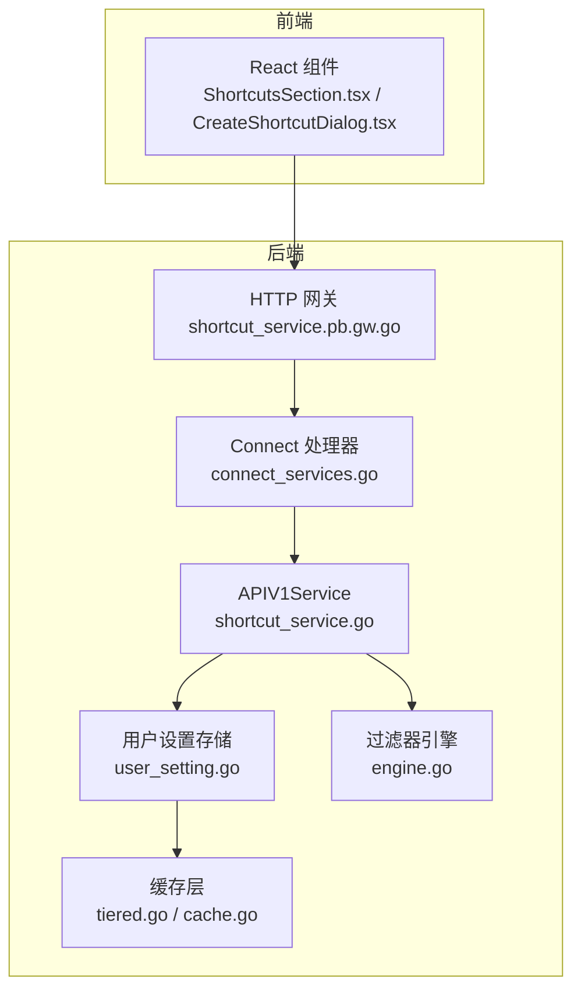
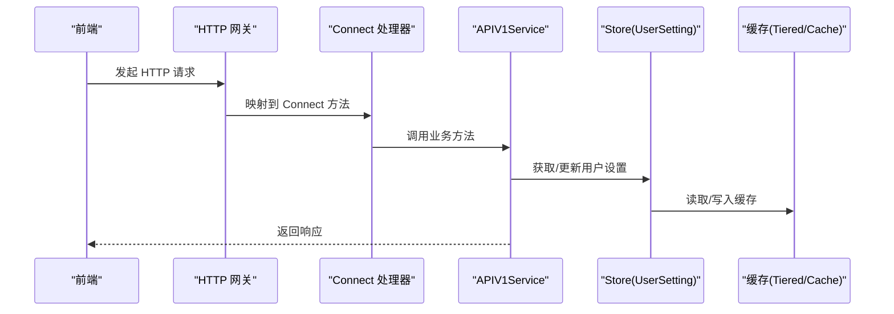
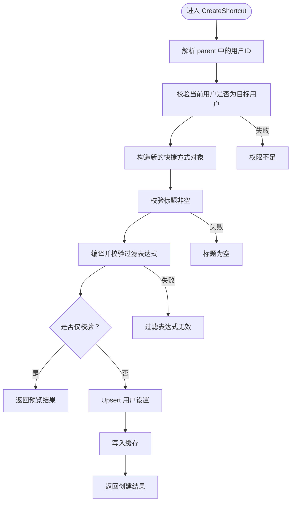
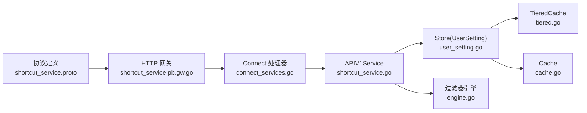

# 快捷方式服务 API

<cite>
**本文引用的文件**
- [proto/api/v1/shortcut_service.proto](file://proto/api/v1/shortcut_service.proto)
- [server/router/api/v1/shortcut_service.go](file://server/router/api/v1/shortcut_service.go)
- [store/user_setting.go](file://store/user_setting.go)
- [plugin/filter/engine.go](file://plugin/filter/engine.go)
- [store/cache/tiered.go](file://store/cache/tiered.go)
- [store/cache/cache.go](file://store/cache/cache.go)
- [server/router/api/v1/connect_services.go](file://server/router/api/v1/connect_services.go)
- [proto/gen/api/v1/shortcut_service.pb.gw.go](file://proto/gen/api/v1/shortcut_service.pb.gw.go)
- [web/src/components/MemoExplorer/ShortcutsSection.tsx](file://web/src/components/MemoExplorer/ShortcutsSection.tsx)
- [web/src/components/CreateShortcutDialog.tsx](file://web/src/components/CreateShortcutDialog.tsx)
</cite>

## 目录
1. [简介](#简介)
2. [项目结构](#项目结构)
3. [核心组件](#核心组件)
4. [架构总览](#架构总览)
5. [详细组件分析](#详细组件分析)
6. [依赖关系分析](#依赖关系分析)
7. [性能考量](#性能考量)
8. [故障排查指南](#故障排查指南)
9. [结论](#结论)
10. [附录：接口与实体规范](#附录接口与实体规范)

## 简介
本文件系统性地文档化“快捷方式服务 API”，覆盖以下方面：
- 快捷方式实体的数据结构与资源命名规则
- 路由映射机制（gRPC/Connect 与 HTTP 网关）
- 动态生成、缓存策略与访问统计
- 权限控制与安全检查
- 配置选项与使用示例

## 项目结构
快捷方式服务位于后端 API 层，通过 Connect/gRPC 提供服务，并由 HTTP 网关暴露 REST 风格路由；前端通过 Connect 客户端调用。

图表来源
- [server/router/api/v1/shortcut_service.go](file://server/router/api/v1/shortcut_service.go#L46-L345)
- [server/router/api/v1/connect_services.go](file://server/router/api/v1/connect_services.go#L390-L422)
- [proto/gen/api/v1/shortcut_service.pb.gw.go](file://proto/gen/api/v1/shortcut_service.pb.gw.go#L441-L451)
- [store/user_setting.go](file://store/user_setting.go#L79-L103)
- [store/cache/tiered.go](file://store/cache/tiered.go#L164-L231)
- [store/cache/cache.go](file://store/cache/cache.go#L66-L90)
- [plugin/filter/engine.go](file://plugin/filter/engine.go#L107-L121)

章节来源
- [server/router/api/v1/shortcut_service.go](file://server/router/api/v1/shortcut_service.go#L46-L345)
- [server/router/api/v1/connect_services.go](file://server/router/api/v1/connect_services.go#L390-L422)
- [proto/gen/api/v1/shortcut_service.pb.gw.go](file://proto/gen/api/v1/shortcut_service.pb.gw.go#L441-L451)

## 核心组件
- 快捷方式实体与请求消息定义于协议文件，包含资源名、标题与过滤表达式等字段。
- APIV1Service 实现了快捷方式的列表、查询、创建、更新、删除逻辑，并执行权限校验与过滤表达式验证。
- 用户设置存储负责将快捷方式序列化为用户设置项并持久化，同时提供缓存读取。
- 过滤器引擎用于编译与渲染过滤表达式，支持不同数据库方言。
- 缓存层提供多级缓存能力，加速用户设置的读取。

章节来源
- [proto/api/v1/shortcut_service.proto](file://proto/api/v1/shortcut_service.proto#L52-L124)
- [server/router/api/v1/shortcut_service.go](file://server/router/api/v1/shortcut_service.go#L46-L345)
- [store/user_setting.go](file://store/user_setting.go#L79-L103)
- [plugin/filter/engine.go](file://plugin/filter/engine.go#L107-L121)
- [store/cache/tiered.go](file://store/cache/tiered.go#L164-L231)

## 架构总览
快捷方式服务采用“协议 → 网关/Connect → 业务服务 → 存储/缓存 → 过滤器”的分层架构。HTTP 请求经网关映射到 Connect 处理器，再由 APIV1Service 执行业务逻辑；用户设置通过 Store 读写并利用缓存提升性能；过滤表达式由过滤器引擎解析并渲染为 SQL 片段。

图表来源
- [proto/gen/api/v1/shortcut_service.pb.gw.go](file://proto/gen/api/v1/shortcut_service.pb.gw.go#L441-L451)
- [server/router/api/v1/connect_services.go](file://server/router/api/v1/connect_services.go#L390-L422)
- [server/router/api/v1/shortcut_service.go](file://server/router/api/v1/shortcut_service.go#L46-L345)
- [store/user_setting.go](file://store/user_setting.go#L79-L103)
- [store/cache/tiered.go](file://store/cache/tiered.go#L164-L231)
- [store/cache/cache.go](file://store/cache/cache.go#L66-L90)

## 详细组件分析

### 快捷方式实体与路由映射
- 实体字段
  - name：资源名，格式为 users/{user}/shortcuts/{shortcut}
  - title：快捷方式标题（必填）
  - filter：过滤表达式（可选）
- 路由映射
  - 列表：GET /api/v1/{parent=users/*}/shortcuts
  - 查询：GET /api/v1/{name=users/*/shortcuts/*}
  - 创建：POST /api/v1/{parent=users/*}/shortcuts（body: shortcut）
  - 更新：PATCH /api/v1/{shortcut.name=users/*/shortcuts/*}（body: shortcut，配合 FieldMask）
  - 删除：DELETE /api/v1/{name=users/*/shortcuts/*}

章节来源
- [proto/api/v1/shortcut_service.proto](file://proto/api/v1/shortcut_service.proto#L14-L50)
- [proto/api/v1/shortcut_service.proto](file://proto/api/v1/shortcut_service.proto#L52-L124)
- [proto/gen/api/v1/shortcut_service.pb.gw.go](file://proto/gen/api/v1/shortcut_service.pb.gw.go#L441-L451)

### 权限控制与安全检查
- 身份与权限
  - 通过提取请求中的用户标识与当前登录用户进行比对，仅允许操作自己的快捷方式。
- 参数校验
  - 资源名格式校验、空值校验、更新时必须提供 FieldMask。
- 过滤表达式校验
  - 使用过滤器引擎编译表达式，失败则拒绝请求；根据数据库驱动选择 SQLite 或 Postgres 方言。

章节来源
- [server/router/api/v1/shortcut_service.go](file://server/router/api/v1/shortcut_service.go#L46-L125)
- [server/router/api/v1/shortcut_service.go](file://server/router/api/v1/shortcut_service.go#L199-L270)
- [server/router/api/v1/shortcut_service.go](file://server/router/api/v1/shortcut_service.go#L272-L321)
- [server/router/api/v1/shortcut_service.go](file://server/router/api/v1/shortcut_service.go#L323-L345)
- [plugin/filter/engine.go](file://plugin/filter/engine.go#L107-L121)

### 动态生成、缓存策略与访问统计
- 动态生成
  - 创建快捷方式时生成唯一 ID 并保存至用户设置。
- 缓存策略
  - 用户设置读取路径：先查缓存，未命中再查底层存储，并回填缓存。
  - 多级缓存（TieredCache）支持 L1/L2 分层，可统计大小与启用状态。
- 访问统计
  - 当前实现未内置访问计数指标；可通过缓存统计接口或外部监控采集。

章节来源
- [server/router/api/v1/shortcut_service.go](file://server/router/api/v1/shortcut_service.go#L127-L197)
- [store/user_setting.go](file://store/user_setting.go#L79-L103)
- [store/cache/tiered.go](file://store/cache/tiered.go#L398-L446)
- [store/cache/cache.go](file://store/cache/cache.go#L66-L90)

### 接口流程图（以创建为例）

图表来源
- [server/router/api/v1/shortcut_service.go](file://server/router/api/v1/shortcut_service.go#L127-L197)
- [plugin/filter/engine.go](file://plugin/filter/engine.go#L107-L121)

### 前端交互与使用示例
- 前端组件
  - ShortcutsSection.tsx：展示用户快捷方式列表，支持创建、编辑、删除。
  - CreateShortcutDialog.tsx：创建/更新快捷方式对话框，提交时调用 Connect 客户端。
- 示例流程
  - 创建：填写标题与过滤表达式，调用 createShortcut，成功后刷新设置并提示。
  - 更新：传入 FieldMask 指定更新字段，调用 updateShortcut。
  - 删除：调用 deleteShortcut，成功后刷新设置并提示。

章节来源
- [web/src/components/MemoExplorer/ShortcutsSection.tsx](file://web/src/components/MemoExplorer/ShortcutsSection.tsx#L24-L135)
- [web/src/components/CreateShortcutDialog.tsx](file://web/src/components/CreateShortcutDialog.tsx#L64-L102)

## 依赖关系分析

图表来源
- [proto/api/v1/shortcut_service.proto](file://proto/api/v1/shortcut_service.proto#L14-L50)
- [proto/gen/api/v1/shortcut_service.pb.gw.go](file://proto/gen/api/v1/shortcut_service.pb.gw.go#L441-L451)
- [server/router/api/v1/connect_services.go](file://server/router/api/v1/connect_services.go#L390-L422)
- [server/router/api/v1/shortcut_service.go](file://server/router/api/v1/shortcut_service.go#L46-L345)
- [store/user_setting.go](file://store/user_setting.go#L79-L103)
- [store/cache/tiered.go](file://store/cache/tiered.go#L164-L231)
- [store/cache/cache.go](file://store/cache/cache.go#L66-L90)
- [plugin/filter/engine.go](file://plugin/filter/engine.go#L107-L121)

## 性能考量
- 缓存命中率
  - 用户设置按“用户ID+键”维度缓存，建议在高并发场景下开启多级缓存并合理设置清理周期。
- 过滤表达式编译
  - 表达式在创建/更新时即时编译，建议避免复杂表达式导致的编译开销。
- 字段更新最小化
  - 使用 FieldMask 精准更新，减少不必要的写入与缓存失效。

## 故障排查指南
- 常见错误与定位
  - 资源名格式错误：检查 name 是否符合 users/{user}/shortcuts/{shortcut}。
  - 权限不足：确认当前登录用户与目标用户一致。
  - 标题为空：创建/更新时需提供非空标题。
  - 过滤表达式无效：检查表达式语法与方言匹配（SQLite/Postgres）。
- 日志与监控
  - 可结合缓存统计接口查看命中率与大小，辅助定位性能问题。

章节来源
- [server/router/api/v1/shortcut_service.go](file://server/router/api/v1/shortcut_service.go#L22-L39)
- [server/router/api/v1/shortcut_service.go](file://server/router/api/v1/shortcut_service.go#L127-L197)
- [server/router/api/v1/shortcut_service.go](file://server/router/api/v1/shortcut_service.go#L323-L345)
- [store/cache/tiered.go](file://store/cache/tiered.go#L398-L446)

## 结论
快捷方式服务通过清晰的协议定义、严格的权限控制与过滤表达式校验，提供了灵活的用户自定义筛选入口。结合多级缓存与 Connect/gRPC 网关，可在保证安全性的同时获得良好的性能表现。建议在生产环境中启用缓存与合理的清理策略，并对过滤表达式的复杂度进行约束。

## 附录：接口与实体规范

### 实体与消息定义
- 实体：Shortcut
  - 字段：name、title、filter
  - 资源模式：users/{user}/shortcuts/{shortcut}
- 请求/响应：
  - ListShortcutsRequest/Response
  - GetShortcutRequest
  - CreateShortcutRequest（含 validate_only）
  - UpdateShortcutRequest（含 FieldMask）
  - DeleteShortcutRequest

章节来源
- [proto/api/v1/shortcut_service.proto](file://proto/api/v1/shortcut_service.proto#L52-L124)

### HTTP 路由映射
- GET /api/v1/{parent=users/*}/shortcuts
- GET /api/v1/{name=users/*/shortcuts/*}
- POST /api/v1/{parent=users/*}/shortcuts（body: shortcut）
- PATCH /api/v1/{shortcut.name=users/*/shortcuts/*}（body: shortcut, FieldMask）
- DELETE /api/v1/{name=users/*/shortcuts/*}

章节来源
- [proto/api/v1/shortcut_service.proto](file://proto/api/v1/shortcut_service.proto#L14-L50)
- [proto/gen/api/v1/shortcut_service.pb.gw.go](file://proto/gen/api/v1/shortcut_service.pb.gw.go#L441-L451)

### 权限与安全
- 仅允许用户操作自己的快捷方式
- 必要字段校验与过滤表达式编译校验
- 支持 validate_only 模式进行无副作用验证

章节来源
- [server/router/api/v1/shortcut_service.go](file://server/router/api/v1/shortcut_service.go#L46-L125)
- [server/router/api/v1/shortcut_service.go](file://server/router/api/v1/shortcut_service.go#L199-L270)
- [server/router/api/v1/shortcut_service.go](file://server/router/api/v1/shortcut_service.go#L272-L321)
- [server/router/api/v1/shortcut_service.go](file://server/router/api/v1/shortcut_service.go#L323-L345)

### 缓存与统计
- 用户设置缓存：按用户+键维度缓存，读取命中后直接返回
- 多级缓存：TieredCache 支持 L1/L2，可查询大小与启用状态
- 访问统计：当前未内置命中/缺失计数，可通过缓存统计接口获取

章节来源
- [store/user_setting.go](file://store/user_setting.go#L79-L103)
- [store/cache/tiered.go](file://store/cache/tiered.go#L398-L446)
- [store/cache/cache.go](file://store/cache/cache.go#L66-L90)