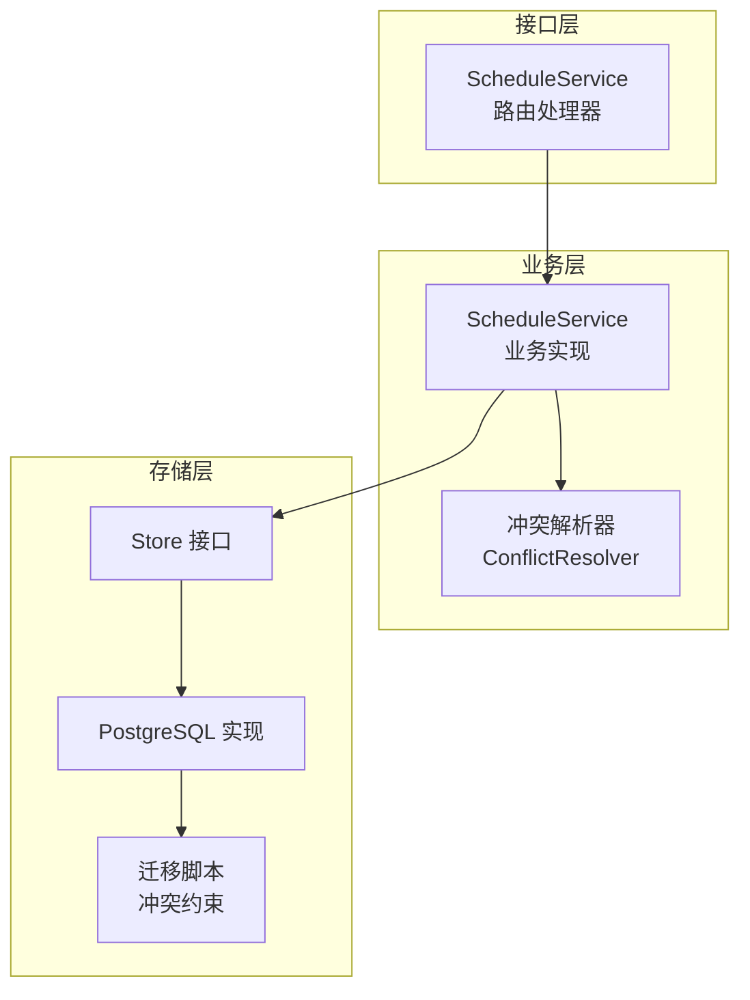
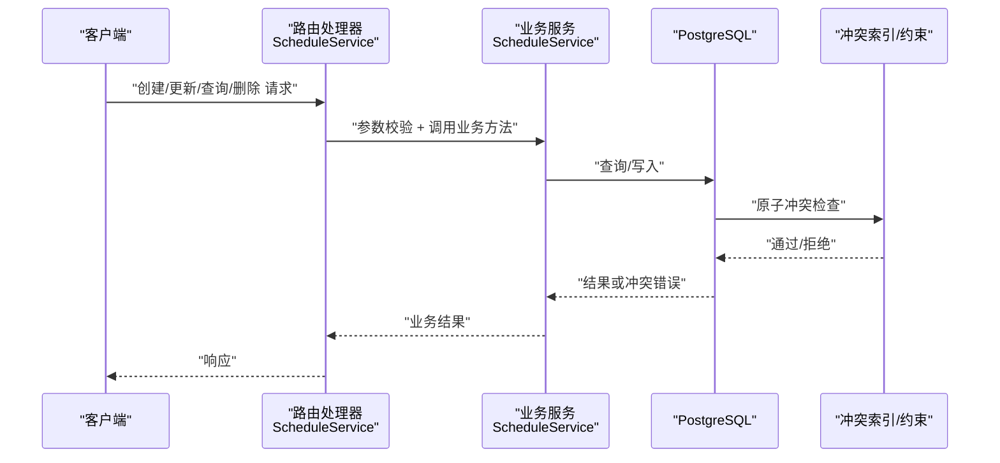
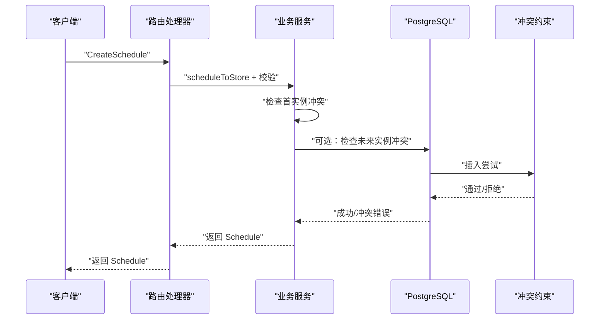
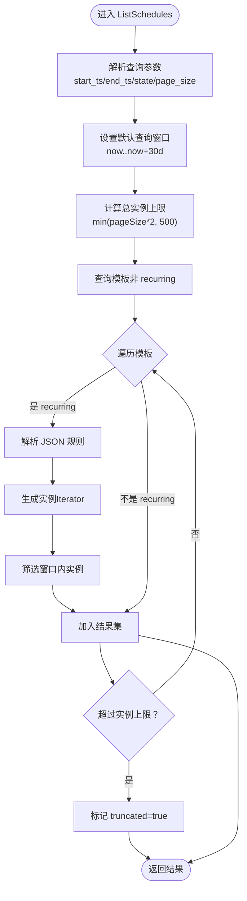
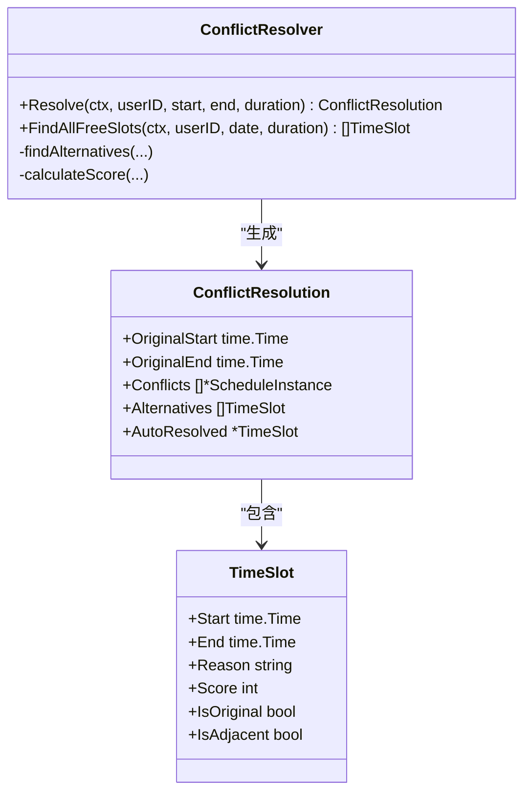
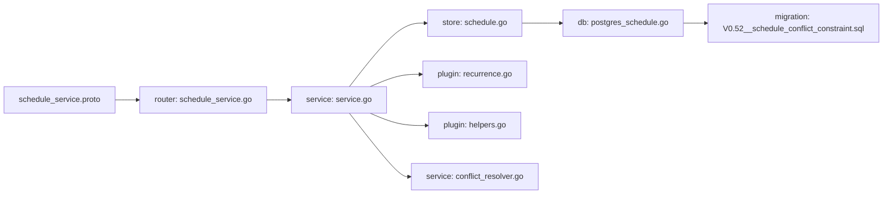

# 日程服务 API

<cite>
**本文引用的文件**   
- [schedule_service.proto](file://proto/api/v1/schedule_service.proto)
- [schedule_service.go](file://server/router/api/v1/schedule_service.go)
- [service.go](file://server/service/schedule/service.go)
- [schedule.go](file://store/schedule.go)
- [postgres_schedule.go](file://store/db/postgres/schedule.go)
- [V0.52__schedule_conflict_constraint.sql](file://store/migration/postgres/V0.52__schedule_conflict_constraint.sql)
- [recurrence.go](file://plugin/ai/schedule/recurrence.go)
- [helpers.go](file://plugin/ai/schedule/helpers.go)
- [conflict_resolver.go](file://server/service/schedule/conflict_resolver.go)
- [scheduler.go](file://plugin/scheduler/scheduler.go)
- [ScheduleSearchBar.tsx](file://web/src/components/AIChat/ScheduleSearchBar.tsx)
- [useScheduleQueries.ts](file://web/src/hooks/useScheduleQueries.ts)
</cite>

## 目录
1. [简介](#简介)
2. [项目结构](#项目结构)
3. [核心组件](#核心组件)
4. [架构总览](#架构总览)
5. [详细组件分析](#详细组件分析)
6. [依赖关系分析](#依赖关系分析)
7. [性能考量](#性能考量)
8. [故障排查指南](#故障排查指南)
9. [结论](#结论)
10. [附录](#附录)

## 简介
本文件为“日程服务 API”的权威技术文档，覆盖以下内容：
- 完整接口规范：创建、查询、更新、删除、冲突检测、自然语言解析与创建
- Schedule 实体数据结构、时间处理与重复规则支持
- 冲突检测机制（前端校验 + 数据库原子约束）
- 时区转换与提醒机制
- 日程搜索、批量操作与导出能力说明
- 配置项与性能优化建议

## 项目结构
日程服务由三层组成：
- 接口层（router）：暴露 Connect/HTTP API，负责鉴权、参数校验、数据转换
- 业务层（service）：封装业务逻辑（冲突检测、重复实例展开、替代时间推荐等）
- 存储层（store/db）：数据库访问与约束（包括原子冲突约束）

图表来源
- [schedule_service.go](file://server/router/api/v1/schedule_service.go#L24-L30)
- [service.go](file://server/service/schedule/service.go#L70-L86)
- [postgres_schedule.go](file://store/db/postgres/schedule.go#L14-L57)
- [V0.52__schedule_conflict_constraint.sql](file://store/migration/postgres/V0.52__schedule_conflict_constraint.sql#L8-L17)

章节来源
- [schedule_service.proto](file://proto/api/v1/schedule_service.proto#L12-L66)
- [schedule_service.go](file://server/router/api/v1/schedule_service.go#L24-L30)
- [service.go](file://server/service/schedule/service.go#L70-L86)
- [postgres_schedule.go](file://store/db/postgres/schedule.go#L14-L57)
- [V0.52__schedule_conflict_constraint.sql](file://store/migration/postgres/V0.52__schedule_conflict_constraint.sql#L8-L17)

## 核心组件
- 接口定义（Protocol Buffers）：定义 Schedule、Reminder、请求/响应消息与所有 RPC 方法
- 路由处理器：鉴权、参数校验、调用业务层、结果转换
- 业务服务：冲突检测、重复规则解析与实例展开、替代时间推荐
- 存储实现：PostgreSQL 访问与原子冲突约束
- 提醒与重复：提醒序列化/反序列化、重复规则解析与迭代生成
- 前端集成：搜索、查询与变更钩子

章节来源
- [schedule_service.proto](file://proto/api/v1/schedule_service.proto#L68-L166)
- [schedule_service.go](file://server/router/api/v1/schedule_service.go#L178-L212)
- [service.go](file://server/service/schedule/service.go#L194-L302)
- [postgres_schedule.go](file://store/db/postgres/schedule.go#L286-L327)
- [recurrence.go](file://plugin/ai/schedule/recurrence.go#L40-L75)
- [helpers.go](file://plugin/ai/schedule/helpers.go#L10-L20)

## 架构总览
下图展示从客户端到数据库的典型调用链路，以及冲突检测与重复规则展开的关键节点。

图表来源
- [schedule_service.go](file://server/router/api/v1/schedule_service.go#L178-L212)
- [service.go](file://server/service/schedule/service.go#L194-L302)
- [postgres_schedule.go](file://store/db/postgres/schedule.go#L40-L56)
- [V0.52__schedule_conflict_constraint.sql](file://store/migration/postgres/V0.52__schedule_conflict_constraint.sql#L8-L17)

## 详细组件分析

### 接口与实体模型
- RPC 方法
  - 创建：POST /api/v1/schedules
  - 列表：GET /api/v1/schedules
  - 获取：GET /api/v1/schedules/{uid}
  - 更新：PATCH /api/v1/schedules/{uid}
  - 删除：DELETE /api/v1/schedules/{uid}
  - 冲突检测：POST /api/v1/schedules:checkConflict
  - 自然语言解析并创建：POST /api/v1/schedules:parseAndCreate
- Schedule 字段要点
  - 时间戳：start_ts、end_ts（秒）、all_day、timezone
  - 重复：recurrence_rule（JSON 字符串）、recurrence_end_ts
  - 提醒：reminders（JSON 数组）
  - 状态：state（NORMAL/ARCHIVED）
  - 创建者：creator（users/{id}）
- Reminder 字段
  - 类型：before/at
  - 数值与单位：value（分钟/小时/天）

章节来源
- [schedule_service.proto](file://proto/api/v1/schedule_service.proto#L13-L66)
- [schedule_service.proto](file://proto/api/v1/schedule_service.proto#L68-L166)

### 创建流程（含冲突检测）

图表来源
- [schedule_service.go](file://server/router/api/v1/schedule_service.go#L178-L212)
- [service.go](file://server/service/schedule/service.go#L194-L302)
- [postgres_schedule.go](file://store/db/postgres/schedule.go#L40-L56)
- [V0.52__schedule_conflict_constraint.sql](file://store/migration/postgres/V0.52__schedule_conflict_constraint.sql#L8-L17)

章节来源
- [schedule_service.go](file://server/router/api/v1/schedule_service.go#L178-L212)
- [service.go](file://server/service/schedule/service.go#L194-L302)

### 列表与重复规则展开
- 查询窗口与限制
  - 默认查询窗口：当前时间至未来 30 天
  - 总实例上限：pageSize × 2，最大不超过 500
- 重复规则
  - 支持 daily/weekly/monthly，间隔与特定星期/月份日期
  - 使用 RecurrenceIterator 惰性生成实例，避免一次性展开过多
- 展开策略
  - 先查询模板（非 recurring），再按规则生成实例
  - 仅返回落在查询窗口内的实例

图表来源
- [schedule_service.go](file://server/router/api/v1/schedule_service.go#L214-L370)
- [recurrence.go](file://plugin/ai/schedule/recurrence.go#L341-L442)

章节来源
- [schedule_service.go](file://server/router/api/v1/schedule_service.go#L214-L370)
- [recurrence.go](file://plugin/ai/schedule/recurrence.go#L341-L442)

### 冲突检测与替代时间推荐
- 前端/业务层双重检测
  - 前端：列表查询时按窗口与规则展开，快速发现重叠
  - 业务层：数据库级 EXCLUDE 约束提供最终原子保证
- 替代时间推荐
  - ConflictResolver 提供同日/邻日空闲槽位查找
  - 综合评分（时段偏好、相邻日、工作时间等）选择最佳替代

图表来源
- [conflict_resolver.go](file://server/service/schedule/conflict_resolver.go#L45-L97)
- [conflict_resolver.go](file://server/service/schedule/conflict_resolver.go#L114-L165)
- [conflict_resolver.go](file://server/service/schedule/conflict_resolver.go#L279-L326)

章节来源
- [conflict_resolver.go](file://server/service/schedule/conflict_resolver.go#L45-L97)
- [conflict_resolver.go](file://server/service/schedule/conflict_resolver.go#L114-L165)
- [conflict_resolver.go](file://server/service/schedule/conflict_resolver.go#L279-L326)

### 时区与提醒机制
- 时区
  - Schedule 保存 timezone 字段；显示格式化时按该时区渲染
  - 重复规则生成基于 UTC 时间戳，确保跨时区一致性
- 提醒
  - Reminders 以 JSON 数组持久化，支持多条提醒
  - 提供 Marshal/Unmarshal 辅助函数，限制最多 10 条

章节来源
- [schedule_service.proto](file://proto/api/v1/schedule_service.proto#L75-L85)
- [helpers.go](file://plugin/ai/schedule/helpers.go#L10-L20)
- [service.go](file://server/service/schedule/service.go#L501-L523)

### 自然语言解析与创建
- 解析器
  - 支持中文自然语言（如“每天”、“每周一”、“每月15号”）
  - 输出标准化的 Schedule 结构
- 自动确认
  - auto_confirm=true 时，先做冲突检查，无冲突则创建并返回创建结果

章节来源
- [schedule_service.go](file://server/router/api/v1/schedule_service.go#L654-L723)
- [recurrence.go](file://plugin/ai/schedule/recurrence.go#L77-L149)

### 前端搜索与查询
- 前端搜索
  - 支持按标题、地点、描述过滤日程
- 查询钩子
  - React Query 钩子封装了创建/更新/删除等操作，并进行缓存失效与乐观更新

章节来源
- [ScheduleSearchBar.tsx](file://web/src/components/AIChat/ScheduleSearchBar.tsx#L14-L31)
- [useScheduleQueries.ts](file://web/src/hooks/useScheduleQueries.ts#L142-L200)

## 依赖关系分析
- 接口层依赖业务层；业务层依赖存储层；存储层依赖数据库与迁移脚本
- 冲突检测贯穿接口层与业务层，数据库提供最终原子约束
- 重复规则解析与迭代由插件模块提供，业务层复用

图表来源
- [schedule_service.proto](file://proto/api/v1/schedule_service.proto#L1-L166)
- [schedule_service.go](file://server/router/api/v1/schedule_service.go#L24-L30)
- [service.go](file://server/service/schedule/service.go#L70-L86)
- [schedule.go](file://store/schedule.go#L1-L27)
- [postgres_schedule.go](file://store/db/postgres/schedule.go#L14-L57)
- [V0.52__schedule_conflict_constraint.sql](file://store/migration/postgres/V0.52__schedule_conflict_constraint.sql#L8-L17)
- [recurrence.go](file://plugin/ai/schedule/recurrence.go#L40-L75)
- [helpers.go](file://plugin/ai/schedule/helpers.go#L10-L20)
- [conflict_resolver.go](file://server/service/schedule/conflict_resolver.go#L13-L24)

章节来源
- [schedule_service.go](file://server/router/api/v1/schedule_service.go#L24-L30)
- [service.go](file://server/service/schedule/service.go#L70-L86)
- [postgres_schedule.go](file://store/db/postgres/schedule.go#L14-L57)
- [V0.52__schedule_conflict_constraint.sql](file://store/migration/postgres/V0.52__schedule_conflict_constraint.sql#L8-L17)

## 性能考量
- 列表查询
  - 默认窗口 30 天，实例总数上限 500；可通过 pageSize 控制
  - 使用 RecurrenceIterator 惰性生成实例，避免一次性展开
- 冲突检测
  - 业务层先检查首实例，再对 recurring 场景使用小时索引与迭代器检查
  - 数据库 EXCLUDE 约束提供最终原子保证
- 时区处理
  - 重复规则基于 UTC 时间戳生成，避免频繁时区解析开销
- 前端
  - React Query 缓存与失效策略减少网络请求
  - 搜索过滤在前端完成，降低后端压力

章节来源
- [schedule_service.go](file://server/router/api/v1/schedule_service.go#L268-L285)
- [service.go](file://server/service/schedule/service.go#L548-L639)
- [postgres_schedule.go](file://store/db/postgres/schedule.go#L40-L56)

## 故障排查指南
- 冲突错误
  - 现象：创建/更新返回“已存在/重叠”
  - 排查：检查 start_ts/end_ts 是否与现有 NORMAL 状态日程重叠
  - 参考：数据库 EXCLUDE 约束与业务层冲突检测
- 时间范围异常
  - 现象：end_ts 小于 start_ts 或负数
  - 排查：确认时间戳单位（秒）与时区转换
- 重复规则无效
  - 现象：解析失败或生成实例为空
  - 排查：确认 recurrence_rule JSON 格式与字段合法性
- 提醒序列化失败
  - 现象：保存提醒时报错
  - 排查：确认 reminders 数组格式与字段类型

章节来源
- [postgres_schedule.go](file://store/db/postgres/schedule.go#L286-L327)
- [service.go](file://server/service/schedule/service.go#L426-L480)
- [recurrence.go](file://plugin/ai/schedule/recurrence.go#L49-L75)
- [helpers.go](file://plugin/ai/schedule/helpers.go#L10-L20)

## 结论
日程服务 API 通过清晰的分层设计、完善的冲突检测与重复规则支持，提供了稳定可靠的日程管理能力。结合数据库原子约束与前端缓存策略，可在保证一致性的前提下获得良好的性能与用户体验。

## 附录

### 接口规范摘要
- 创建：POST /api/v1/schedules
- 列表：GET /api/v1/schedules
- 获取：GET /api/v1/schedules/{uid}
- 更新：PATCH /api/v1/schedules/{uid}
- 删除：DELETE /api/v1/schedules/{uid}
- 冲突检测：POST /api/v1/schedules:checkConflict
- 自然语言解析并创建：POST /api/v1/schedules:parseAndCreate

章节来源
- [schedule_service.proto](file://proto/api/v1/schedule_service.proto#L13-L66)

### Schedule 实体字段说明
- name：资源标识（schedules/{uid}）
- title/description/location：标题/描述/地点
- start_ts/end_ts/all_day/timezone：起止时间、全天标志、时区
- recurrence_rule/recurrence_end_ts：重复规则（JSON）、重复结束时间
- reminders：提醒数组（JSON）
- creator/state：创建者、状态（NORMAL/ARCHIVED）
- created_ts/updated_ts：创建/更新时间戳

章节来源
- [schedule_service.proto](file://proto/api/v1/schedule_service.proto#L68-L86)

### 重复规则支持
- 类型：daily/weekly/monthly
- 间隔：interval（正整数）
- 星期：weekly 的 weekdays（1-7）
- 日期：monthly 的 month_day（1-31）
- 生成：Iterator 惰性生成，支持上限控制

章节来源
- [recurrence.go](file://plugin/ai/schedule/recurrence.go#L40-L75)
- [recurrence.go](file://plugin/ai/schedule/recurrence.go#L341-L442)

### 冲突检测与原子约束
- 前端/业务层：窗口内重叠检测
- 数据库：EXCLUDE 约束（btree_gist 扩展），禁止同一用户 NORMAL 状态日程重叠
- 索引：creator_id + tsrange，加速冲突检查

章节来源
- [V0.52__schedule_conflict_constraint.sql](file://store/migration/postgres/V0.52__schedule_conflict_constraint.sql#L8-L17)
- [postgres_schedule.go](file://store/db/postgres/schedule.go#L286-L327)

### 提醒机制
- 存储：JSON 数组，最多 10 条
- 类型/单位：before/at + 分钟/小时/天
- 序列化：Marshal/Unmarshal 辅助函数

章节来源
- [schedule_service.proto](file://proto/api/v1/schedule_service.proto#L88-L93)
- [helpers.go](file://plugin/ai/schedule/helpers.go#L10-L20)

### 日程搜索与批量操作
- 搜索：前端按标题/地点/描述过滤
- 批量：列表接口支持分页与状态过滤
- 导出：未在当前版本中提供专用导出接口，可通过列表 + 前端导出工具实现

章节来源
- [ScheduleSearchBar.tsx](file://web/src/components/AIChat/ScheduleSearchBar.tsx#L14-L31)
- [schedule_service.go](file://server/router/api/v1/schedule_service.go#L214-L258)

### 配置与运行时建议
- 时区缓存：Agent/解析器可缓存 time.Location，减少 LoadLocation 查表开销
- 查询窗口：根据业务场景调整默认窗口与实例上限
- 并发与限流：结合中间件进行速率限制与熔断

章节来源
- [scheduler.go](file://plugin/scheduler/scheduler.go#L32-L42)