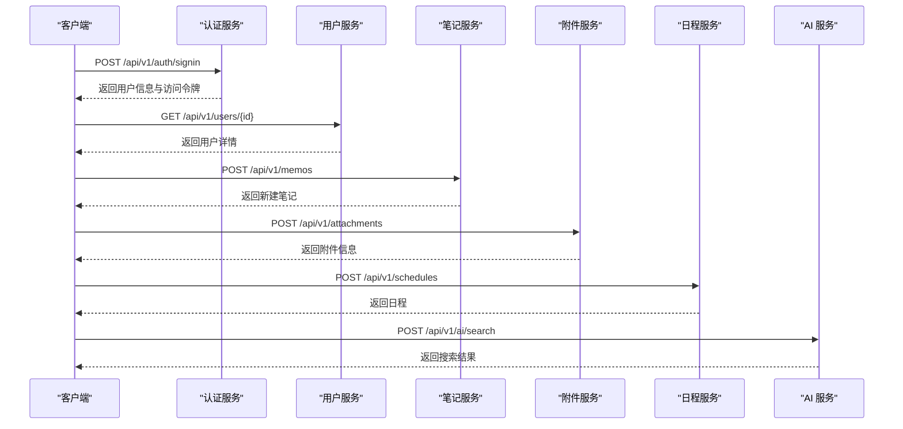
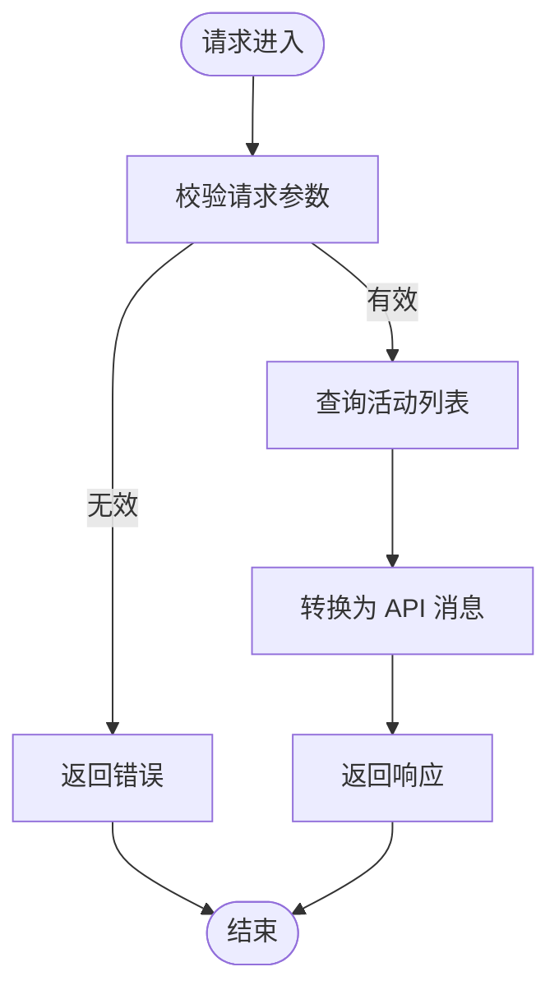
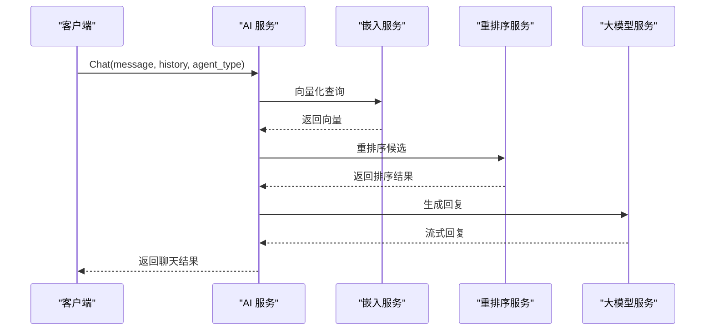
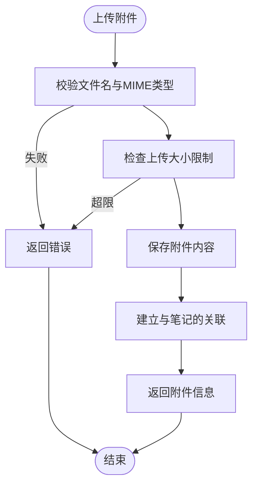
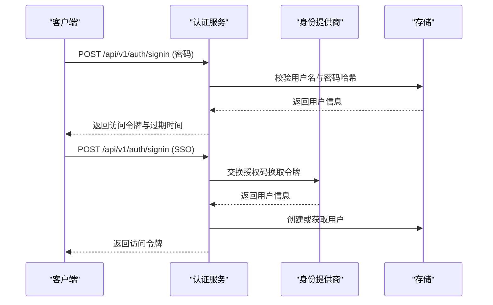
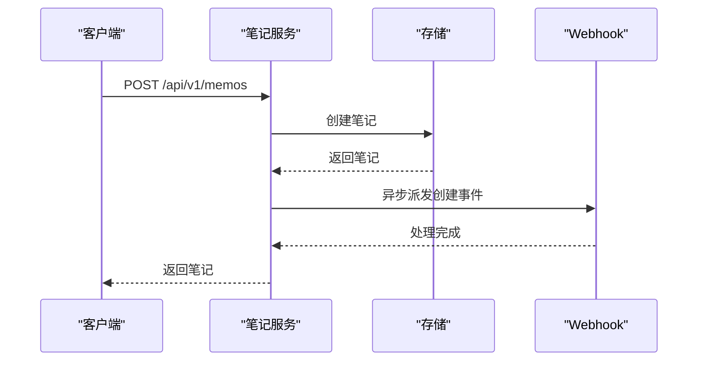
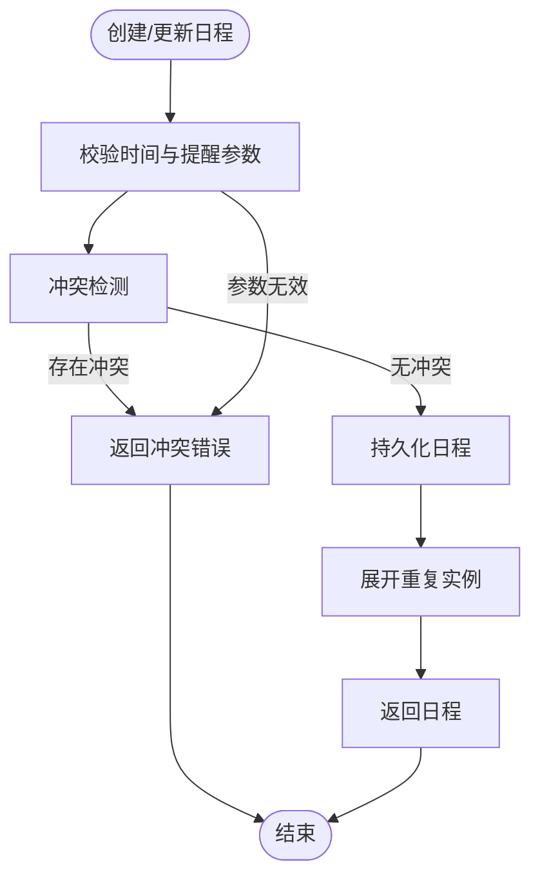
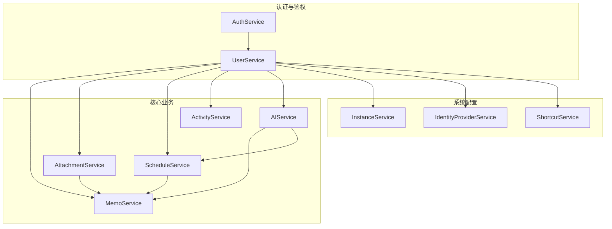

# 服务接口规范

<cite>
**本文档引用的文件**
- [activity_service.proto](file://proto/api/v1/activity_service.proto)
- [ai_service.proto](file://proto/api/v1/ai_service.proto)
- [attachment_service.proto](file://proto/api/v1/attachment_service.proto)
- [auth_service.proto](file://proto/api/v1/auth_service.proto)
- [idp_service.proto](file://proto/api/v1/idp_service.proto)
- [instance_service.proto](file://proto/api/v1/instance_service.proto)
- [memo_service.proto](file://proto/api/v1/memo_service.proto)
- [schedule_service.proto](file://proto/api/v1/schedule_service.proto)
- [shortcut_service.proto](file://proto/api/v1/shortcut_service.proto)
- [user_service.proto](file://proto/api/v1/user_service.proto)
- [activity_service.go](file://server/router/api/v1/activity_service.go)
- [ai_service.go](file://server/router/api/v1/ai_service.go)
- [attachment_service.go](file://server/router/api/v1/attachment_service.go)
- [auth_service.go](file://server/router/api/v1/auth_service.go)
- [idp_service.go](file://server/router/api/v1/idp_service.go)
- [instance_service.go](file://server/router/api/v1/instance_service.go)
- [memo_service.go](file://server/router/api/v1/memo_service.go)
- [schedule_service.go](file://server/router/api/v1/schedule_service.go)
- [shortcut_service.go](file://server/router/api/v1/shortcut_service.go)
- [user_service.go](file://server/router/api/v1/user_service.go)
</cite>

## 目录
1. [简介](#简介)
2. [项目结构](#项目结构)
3. [核心组件](#核心组件)
4. [架构概览](#架构概览)
5. [详细组件分析](#详细组件分析)
6. [依赖分析](#依赖分析)
7. [性能考虑](#性能考虑)
8. [故障排除指南](#故障排除指南)
9. [结论](#结论)

## 简介

本文件为 Memos 项目的各服务模块 API 接口规范文档。项目采用 Protocol Buffers 定义 API 接口契约，通过 Connect/HTTP 和 gRPC 提供服务。本文档按服务类型组织，涵盖活动服务、AI 服务、附件服务、认证服务、身份提供商服务、实例服务、笔记服务、日程服务、快捷方式服务和用户服务。

每个服务模块均包含以下内容：
- 业务功能概述
- 接口方法定义（HTTP 方法、路径、请求/响应消息）
- 参数验证与业务规则
- 服务间依赖关系与调用顺序
- 配置选项与性能考虑

## 项目结构

项目采用分层架构，API 层位于 `server/router/api/v1/`，协议定义位于 `proto/api/v1/`，数据访问层在 `store/`，插件与工具位于 `plugin/`。

```mermaid
graph TB
subgraph "API 层"
A1["活动服务<br/>activity_service.go"]
A2["AI 服务<br/>ai_service.go"]
A3["附件服务<br/>attachment_service.go"]
A4["认证服务<br/>auth_service.go"]
A5["身份提供商服务<br/>idp_service.go"]
A6["实例服务<br/>instance_service.go"]
A7["笔记服务<br/>memo_service.go"]
A8["日程服务<br/>schedule_service.go"]
A9["快捷方式服务<br/>shortcut_service.go"]
A10["用户服务<br/>user_service.go"]
end
subgraph "协议定义"
P1["activity_service.proto"]
P2["ai_service.proto"]
P3["attachment_service.proto"]
P4["auth_service.proto"]
P5["idp_service.proto"]
P6["instance_service.proto"]
P7["memo_service.proto"]
P8["schedule_service.proto"]
P9["shortcut_service.proto"]
P10["user_service.proto"]
end
subgraph "存储层"
S1["store/"]
end
A1 --> P1
A2 --> P2
A3 --> P3
A4 --> P4
A5 --> P5
A6 --> P6
A7 --> P7
A8 --> P8
A9 --> P9
A10 --> P10
A1 --> S1
A2 --> S1
A3 --> S1
A4 --> S1
A5 --> S1
A6 --> S1
A7 --> S1
A8 --> S1
A9 --> S1
A10 --> S1
```

**图表来源**
- [activity_service.go](file://server/router/api/v1/activity_service.go#L1-L139)
- [ai_service.go](file://server/router/api/v1/ai_service.go#L1-L74)
- [attachment_service.go](file://server/router/api/v1/attachment_service.go#L1-L465)
- [auth_service.go](file://server/router/api/v1/auth_service.go#L1-L613)
- [idp_service.go](file://server/router/api/v1/idp_service.go#L1-L239)
- [instance_service.go](file://server/router/api/v1/instance_service.go#L1-L294)
- [memo_service.go](file://server/router/api/v1/memo_service.go#L1-L831)
- [schedule_service.go](file://server/router/api/v1/schedule_service.go#L1-L826)
- [shortcut_service.go](file://server/router/api/v1/shortcut_service.go#L1-L346)
- [user_service.go](file://server/router/api/v1/user_service.go#L1-L1443)

**章节来源**
- [activity_service.proto](file://proto/api/v1/activity_service.proto#L1-L126)
- [ai_service.proto](file://proto/api/v1/ai_service.proto#L1-L371)
- [attachment_service.proto](file://proto/api/v1/attachment_service.proto#L1-L151)
- [auth_service.proto](file://proto/api/v1/auth_service.proto#L1-L115)
- [idp_service.proto](file://proto/api/v1/idp_service.proto#L1-L148)
- [instance_service.proto](file://proto/api/v1/instance_service.proto#L1-L181)
- [memo_service.proto](file://proto/api/v1/memo_service.proto#L1-L512)
- [schedule_service.proto](file://proto/api/v1/schedule_service.proto#L1-L166)
- [shortcut_service.proto](file://proto/api/v1/shortcut_service.proto#L1-L125)
- [user_service.proto](file://proto/api/v1/user_service.proto#L1-L677)

## 核心组件

### 活动服务 (ActivityService)
- 业务功能：提供系统活动记录的查询与检索，支持分页与资源命名。
- 关键接口：
  - `ListActivities`: 获取活动列表（HTTP GET `/api/v1/activities`）
  - `GetActivity`: 获取指定活动详情（HTTP GET `/api/v1/{name=activities/*}`）

**章节来源**
- [activity_service.proto](file://proto/api/v1/activity_service.proto#L13-L24)
- [activity_service.go](file://server/router/api/v1/activity_service.go#L17-L65)

### AI 服务 (AIService)
- 业务功能：提供语义搜索、标签建议、聊天对话、相关笔记查询、AI 会话管理等。
- 关键接口：
  - `SemanticSearch`: 语义搜索（HTTP POST `/api/v1/ai/search`）
  - `SuggestTags`: 标签建议（HTTP POST `/api/v1/ai/suggest-tags`）
  - `Chat`: 聊天对话（HTTP POST `/api/v1/ai/chat`，流式返回）
  - `GetRelatedMemos`: 查询相关笔记（HTTP GET `/api/v1/{name=memos/*}/related`）
  - `ListAIConversations` / `GetAIConversation` / `CreateAIConversation` / `UpdateAIConversation` / `DeleteAIConversation` / `AddContextSeparator` / `ListMessages`: AI 会话管理

**章节来源**
- [ai_service.proto](file://proto/api/v1/ai_service.proto#L12-L110)
- [ai_service.go](file://server/router/api/v1/ai_service.go#L20-L74)

### 附件服务 (AttachmentService)
- 业务功能：提供附件的上传、列表、查询、更新、删除与二进制内容读取。
- 关键接口：
  - `CreateAttachment`: 创建附件（HTTP POST `/api/v1/attachments`）
  - `ListAttachments`: 列出附件（HTTP GET `/api/v1/attachments`）
  - `GetAttachment`: 获取附件（HTTP GET `/api/v1/{name=attachments/*}`）
  - `UpdateAttachment`: 更新附件（HTTP PATCH `/api/v1/{attachment.name=attachments/*}`）
  - `DeleteAttachment`: 删除附件（HTTP DELETE `/api/v1/{name=attachments/*}`）

**章节来源**
- [attachment_service.proto](file://proto/api/v1/attachment_service.proto#L15-L46)
- [attachment_service.go](file://server/router/api/v1/attachment_service.go#L47-L295)

### 认证服务 (AuthService)
- 业务功能：提供当前用户信息查询、登录、登出、刷新令牌等会话管理能力。
- 关键接口：
  - `GetCurrentUser`: 获取当前用户（HTTP GET `/api/v1/auth/me`）
  - `SignIn`: 用户登录（HTTP POST `/api/v1/auth/signin`）
  - `SignOut`: 用户登出（HTTP POST `/api/v1/auth/signout`）
  - `RefreshToken`: 刷新访问令牌（HTTP POST `/api/v1/auth/refresh`）

**章节来源**
- [auth_service.proto](file://proto/api/v1/auth_service.proto#L13-L46)
- [auth_service.go](file://server/router/api/v1/auth_service.go#L32-L357)

### 身份提供商服务 (IdentityProviderService)
- 业务功能：提供身份提供商的增删改查，支持 OAuth2 配置与凭据脱敏。
- 关键接口：
  - `ListIdentityProviders` / `GetIdentityProvider` / `CreateIdentityProvider` / `UpdateIdentityProvider` / `DeleteIdentityProvider`

**章节来源**
- [idp_service.proto](file://proto/api/v1/idp_service.proto#L14-L49)
- [idp_service.go](file://server/router/api/v1/idp_service.go#L16-L159)

### 实例服务 (InstanceService)
- 业务功能：提供实例配置查询与更新，支持通用设置、存储设置、笔记相关设置。
- 关键接口：
  - `GetInstanceProfile`: 获取实例配置概要（HTTP GET `/api/v1/instance/profile`）
  - `GetInstanceSetting` / `UpdateInstanceSetting`: 获取与更新实例设置

**章节来源**
- [instance_service.proto](file://proto/api/v1/instance_service.proto#L13-L33)
- [instance_service.go](file://server/router/api/v1/instance_service.go#L16-L106)

### 笔记服务 (MemoService)
- 业务功能：提供笔记的 CRUD、附件关联、关系管理、评论、反应等。
- 关键接口：
  - `CreateMemo` / `ListMemos` / `GetMemo` / `UpdateMemo` / `DeleteMemo`
  - `SetMemoAttachments` / `ListMemoAttachments`
  - `SetMemoRelations` / `ListMemoRelations`
  - `CreateMemoComment` / `ListMemoComments`
  - `ListMemoReactions` / `UpsertMemoReaction` / `DeleteMemoReaction`

**章节来源**
- [memo_service.proto](file://proto/api/v1/memo_service.proto#L17-L106)
- [memo_service.go](file://server/router/api/v1/memo_service.go#L24-L544)

### 日程服务 (ScheduleService)
- 业务功能：提供日程的创建、查询、更新、删除、冲突检测与自然语言解析创建。
- 关键接口：
  - `CreateSchedule` / `ListSchedules` / `GetSchedule` / `UpdateSchedule` / `DeleteSchedule`
  - `CheckConflict`: 冲突检测（HTTP POST `/api/v1/schedules:checkConflict`）
  - `ParseAndCreateSchedule`: 自然语言解析创建（HTTP POST `/api/v1/schedules:parseAndCreate`）

**章节来源**
- [schedule_service.proto](file://proto/api/v1/schedule_service.proto#L12-L66)
- [schedule_service.go](file://server/router/api/v1/schedule_service.go#L178-L723)

### 快捷方式服务 (ShortcutService)
- 业务功能：提供用户快捷方式的增删改查与过滤器校验。
- 关键接口：
  - `ListShortcuts` / `GetShortcut` / `CreateShortcut` / `UpdateShortcut` / `DeleteShortcut`

**章节来源**
- [shortcut_service.proto](file://proto/api/v1/shortcut_service.proto#L14-L50)
- [shortcut_service.go](file://server/router/api/v1/shortcut_service.go#L46-L321)

### 用户服务 (UserService)
- 业务功能：提供用户管理、统计、设置、个人访问令牌、Webhook 等。
- 关键接口：
  - `ListUsers` / `GetUser` / `CreateUser` / `UpdateUser` / `DeleteUser`
  - `ListAllUserStats` / `GetUserStats`
  - `GetUserSetting` / `UpdateUserSetting` / `ListUserSettings`
  - `ListPersonalAccessTokens` / `CreatePersonalAccessToken` / `DeletePersonalAccessToken`
  - `ListUserWebhooks` / `CreateUserWebhook` / `UpdateUserWebhook` / `DeleteUserWebhook`
  - `ListUserNotifications` / `UpdateUserNotification` / `DeleteUserNotification`

**章节来源**
- [user_service.proto](file://proto/api/v1/user_service.proto#L16-L159)
- [user_service.go](file://server/router/api/v1/user_service.go#L32-L677)

## 架构概览

**图表来源**
- [auth_service.go](file://server/router/api/v1/auth_service.go#L64-L190)
- [user_service.go](file://server/router/api/v1/user_service.go#L73-L104)
- [memo_service.go](file://server/router/api/v1/memo_service.go#L24-L145)
- [attachment_service.go](file://server/router/api/v1/attachment_service.go#L47-L141)
- [schedule_service.go](file://server/router/api/v1/schedule_service.go#L178-L212)
- [ai_service.go](file://server/router/api/v1/ai_service.go#L48-L55)

## 详细组件分析

### 活动服务 (ActivityService)
- 业务规则：
  - 支持分页参数 page_size 与 page_token
  - 资源名称格式为 `activities/{id}`
- 参数验证：
  - GetActivity 请求必须提供有效的 name 字段
- 性能考虑：
  - 当前未实现分页令牌的完整逻辑，建议后续完善分页与索引优化

**图表来源**
- [activity_service.go](file://server/router/api/v1/activity_service.go#L17-L65)

**章节来源**
- [activity_service.proto](file://proto/api/v1/activity_service.proto#L96-L126)
- [activity_service.go](file://server/router/api/v1/activity_service.go#L17-L65)

### AI 服务 (AIService)
- 业务规则：
  - 支持语义搜索、标签建议、聊天（流式）、相关笔记查询
  - 支持 AI 会话管理与上下文分隔符
  - Agent 类型枚举支持多种代理（Memo、Schedule、Amazing、Creative）
- 参数验证：
  - ChatRequest 支持历史消息、时区、查询模式、代理类型、会话持久化等
- 性能考虑：
  - 全局 AI 速率限制器
  - 建议对嵌入向量与重排序进行缓存与批量处理

**图表来源**
- [ai_service.go](file://server/router/api/v1/ai_service.go#L20-L55)
- [ai_service.proto](file://proto/api/v1/ai_service.proto#L150-L204)

**章节来源**
- [ai_service.proto](file://proto/api/v1/ai_service.proto#L12-L110)
- [ai_service.go](file://server/router/api/v1/ai_service.go#L20-L74)

### 附件服务 (AttachmentService)
- 业务规则：
  - 支持本地存储、数据库存储与外部链接存储
  - 文件名与 MIME 类型校验，上传大小限制
- 参数验证：
  - CreateAttachment 需要 filename、type、content
  - 支持关联到笔记
- 性能考虑：
  - 上传缓冲区限制为 32MiB
  - 建议对缩略图进行缓存与懒加载

**图表来源**
- [attachment_service.go](file://server/router/api/v1/attachment_service.go#L47-L141)

**章节来源**
- [attachment_service.proto](file://proto/api/v1/attachment_service.proto#L83-L151)
- [attachment_service.go](file://server/router/api/v1/attachment_service.go#L47-L295)

### 认证服务 (AuthService)
- 业务规则：
  - 支持密码登录与 SSO 登录（OAuth2）
  - 刷新令牌轮换与滑动窗口会话
  - 密码策略与注册限制
- 参数验证：
  - SignInRequest 支持 PasswordCredentials 与 SSOCredentials
  - SSO 需要 idp_id、code、redirect_uri、可选 code_verifier
- 性能考虑：
  - 刷新令牌旋转减少会话泄露风险
  - 建议对用户代理解析与设备指纹进行缓存

**图表来源**
- [auth_service.go](file://server/router/api/v1/auth_service.go#L64-L190)
- [auth_service.proto](file://proto/api/v1/auth_service.proto#L55-L115)

**章节来源**
- [auth_service.proto](file://proto/api/v1/auth_service.proto#L13-L46)
- [auth_service.go](file://server/router/api/v1/auth_service.go#L32-L357)

### 身份提供商服务 (IdentityProviderService)
- 业务规则：
  - 支持 OAuth2 配置与凭据脱敏
  - 仅主机角色可管理
- 参数验证：
  - UpdateIdentityProvider 需要 update_mask 指定字段
- 性能考虑：
  - 对敏感配置（如 client_secret）进行条件脱敏

**章节来源**
- [idp_service.proto](file://proto/api/v1/idp_service.proto#L14-L49)
- [idp_service.go](file://server/router/api/v1/idp_service.go#L16-L159)

### 实例服务 (InstanceService)
- 业务规则：
  - 支持通用设置、存储设置、笔记相关设置
  - 存储设置仅主机可查看与修改
- 参数验证：
  - GetInstanceSetting 支持 BASIC、GENERAL、MEMO_RELATED、STORAGE 等键
- 性能考虑：
  - 缓存实例所有者信息以减少查询

**章节来源**
- [instance_service.proto](file://proto/api/v1/instance_service.proto#L35-L82)
- [instance_service.go](file://server/router/api/v1/instance_service.go#L16-L106)

### 笔记服务 (MemoService)
- 业务规则：
  - 支持笔记可见性控制（私有、受保护、公开）
  - 内容长度限制与负载重建
  - Webhook 事件派发（创建、更新、删除）
- 参数验证：
  - CreateMemo 支持自定义 memo_id 格式校验
  - UpdateMemo 支持字段级更新掩码
- 性能考虑：
  - 分页与过滤器编译（CEL 表达式）
  - 批量加载反应与附件以减少查询次数

**图表来源**
- [memo_service.go](file://server/router/api/v1/memo_service.go#L24-L145)

**章节来源**
- [memo_service.proto](file://proto/api/v1/memo_service.proto#L17-L106)
- [memo_service.go](file://server/router/api/v1/memo_service.go#L24-L544)

### 日程服务 (ScheduleService)
- 业务规则：
  - 支持重复规则解析与实例展开
  - 冲突检测与时间范围校验
  - 自然语言解析创建（需 LLM 服务）
- 参数验证：
  - 时间戳正数校验、结束时间不早于开始时间
  - 提醒数量上限（默认 10 个）
- 性能考虑：
  - 默认查询窗口与实例总数限制防止性能问题
  - 重复规则解析与实例生成需注意时间复杂度

**图表来源**
- [schedule_service.go](file://server/router/api/v1/schedule_service.go#L178-L212)

**章节来源**
- [schedule_service.proto](file://proto/api/v1/schedule_service.proto#L12-L66)
- [schedule_service.go](file://server/router/api/v1/schedule_service.go#L178-L723)

### 快捷方式服务 (ShortcutService)
- 业务规则：
  - 用户专属快捷方式集合
  - 过滤器表达式编译校验
- 参数验证：
  - CreateShortcut 需要非空标题与有效过滤器
  - UpdateShortcut 需要 update_mask
- 性能考虑：
  - 过滤器编译使用方言适配（PostgreSQL/SQLite）

**章节来源**
- [shortcut_service.proto](file://proto/api/v1/shortcut_service.proto#L14-L50)
- [shortcut_service.go](file://server/router/api/v1/shortcut_service.go#L46-L321)

### 用户服务 (UserService)
- 业务规则：
  - 角色权限控制（HOST、ADMIN、USER）
  - 用户设置（通用、Webhook 等）
  - 个人访问令牌（PAT）生命周期管理
- 参数验证：
  - CreateUser 支持首次用户自动 HOST 角色
  - UpdateUser 支持字段级更新掩码与敏感字段限制
- 性能考虑：
  - 用户设置默认值填充与缓存
  - PAT 哈希存储与过期过滤

**章节来源**
- [user_service.proto](file://proto/api/v1/user_service.proto#L16-L159)
- [user_service.go](file://server/router/api/v1/user_service.go#L32-L677)

## 依赖分析

**图表来源**
- [auth_service.go](file://server/router/api/v1/auth_service.go#L32-L357)
- [user_service.go](file://server/router/api/v1/user_service.go#L32-L677)
- [memo_service.go](file://server/router/api/v1/memo_service.go#L24-L544)
- [attachment_service.go](file://server/router/api/v1/attachment_service.go#L47-L295)
- [schedule_service.go](file://server/router/api/v1/schedule_service.go#L178-L723)
- [activity_service.go](file://server/router/api/v1/activity_service.go#L17-L65)
- [ai_service.go](file://server/router/api/v1/ai_service.go#L20-L55)
- [instance_service.go](file://server/router/api/v1/instance_service.go#L16-L106)
- [idp_service.go](file://server/router/api/v1/idp_service.go#L16-L159)
- [shortcut_service.go](file://server/router/api/v1/shortcut_service.go#L46-L321)

**章节来源**
- [auth_service.go](file://server/router/api/v1/auth_service.go#L32-L357)
- [user_service.go](file://server/router/api/v1/user_service.go#L32-L677)

## 性能考虑

- 速率限制：AI 服务全局速率限制器
- 分页与过滤：笔记、附件、日程等均支持分页与过滤器编译
- 缓存策略：实例所有者信息缓存、用户代理解析缓存
- 存储优化：附件上传缓冲区限制、缩略图缓存
- 并发与批处理：建议对嵌入向量与重排序进行批量处理
- 查询限制：日程实例展开设置硬性上限，防止过度计算

## 故障排除指南

- 认证相关错误：
  - 未认证：检查访问令牌与 Cookie 设置
  - 刷新令牌无效：确认刷新令牌轮换与滑动窗口会话
- 权限相关错误：
  - 主机/管理员权限不足：确认用户角色与操作范围
- 参数验证错误：
  - 文件名非法：避免路径遍历与特殊字符
  - MIME 类型无效：确保符合标准格式
  - 内容长度超限：检查实例设置中的内容长度限制
- 业务规则错误：
  - 笔记可见性被禁用：检查实例设置中的公开可见性限制
  - 日程冲突：使用冲突检测接口或调整时间范围
  - 快捷方式过滤器无效：检查 CEL 表达式语法

**章节来源**
- [auth_service.go](file://server/router/api/v1/auth_service.go#L240-L357)
- [attachment_service.go](file://server/router/api/v1/attachment_service.go#L415-L440)
- [memo_service.go](file://server/router/api/v1/memo_service.go#L76-L86)
- [schedule_service.go](file://server/router/api/v1/schedule_service.go#L595-L652)
- [shortcut_service.go](file://server/router/api/v1/shortcut_service.go#L323-L345)

## 结论

本文档系统梳理了 Memos 项目的各服务模块 API 接口规范，明确了业务功能、接口方法、参数验证与业务规则，并提供了服务间依赖关系与调用顺序说明。通过遵循本文档的规范与最佳实践，可以确保系统的稳定性、安全性与高性能运行。