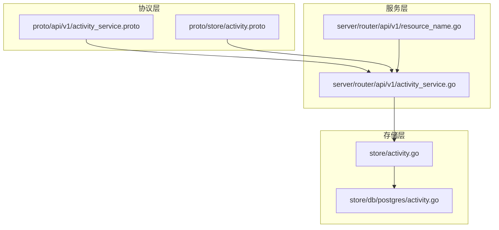
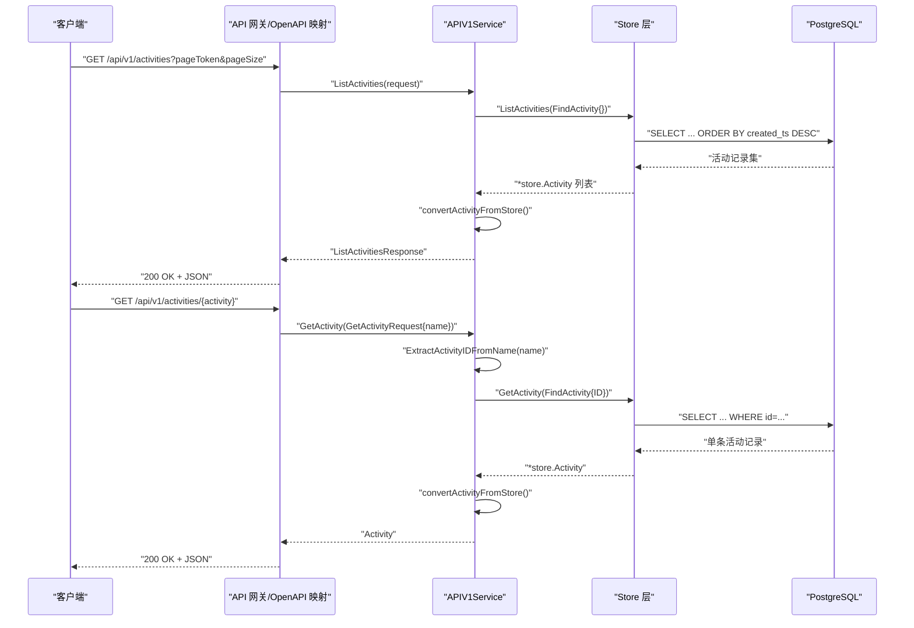
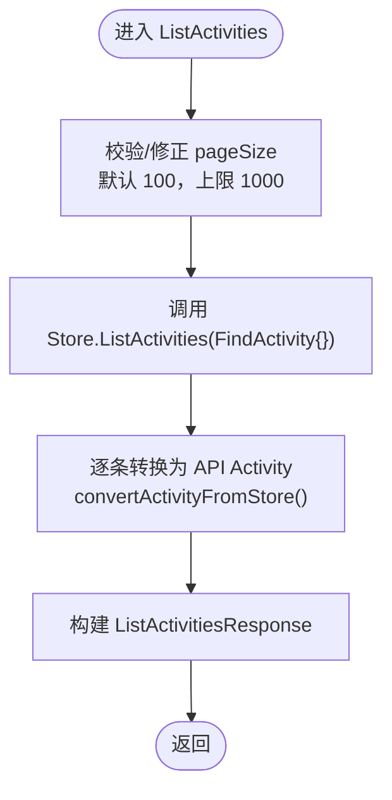
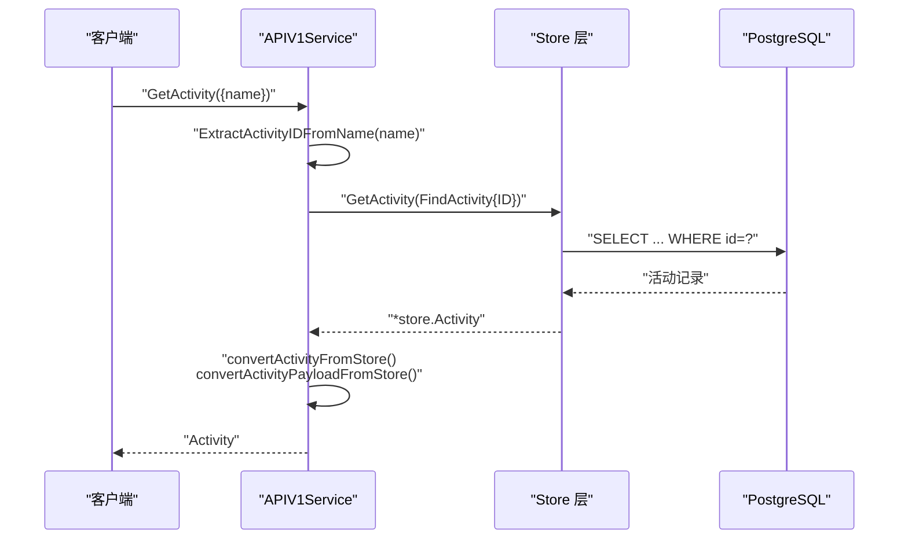
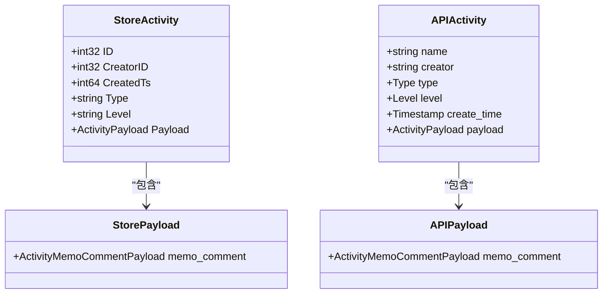
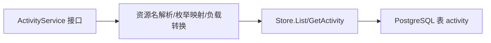

# 活动服务 API

<cite>
**本文引用的文件**
- [proto/api/v1/activity_service.proto](file://proto/api/v1/activity_service.proto)
- [proto/store/activity.proto](file://proto/store/activity.proto)
- [server/router/api/v1/activity_service.go](file://server/router/api/v1/activity_service.go)
- [server/router/api/v1/resource_name.go](file://server/router/api/v1/resource_name.go)
- [store/activity.go](file://store/activity.go)
- [store/db/postgres/activity.go](file://store/db/postgres/activity.go)
- [proto/gen/openapi.yaml](file://proto/gen/openapi.yaml)
- [server/router/api/v1/acl_config_test.go](file://server/router/api/v1/acl_config_test.go)
</cite>

## 目录
1. [简介](#简介)
2. [项目结构](#项目结构)
3. [核心组件](#核心组件)
4. [架构总览](#架构总览)
5. [详细组件分析](#详细组件分析)
6. [依赖关系分析](#依赖关系分析)
7. [性能考量](#性能考量)
8. [故障排查指南](#故障排查指南)
9. [结论](#结论)
10. [附录](#附录)

## 简介
本文件系统性地文档化“活动服务 API”，涵盖以下内容：
- 活动服务的核心功能：活动列表查询与活动详情获取
- Activity 实体的数据结构、字段语义与资源命名规范
- ListActivities 与 GetActivity 的请求参数、响应格式与业务规则
- 活动类型（MEMO_COMMENT）与级别（INFO/WARN/ERROR）枚举值说明
- 具体的 API 调用示例与错误处理指南

## 项目结构
活动服务 API 的实现由三部分组成：
- 协议层：定义服务接口与消息结构
- 服务层：实现 RPC 逻辑，负责数据转换与调用存储层
- 存储层：持久化与查询活动数据

图表来源
- [proto/api/v1/activity_service.proto](file://proto/api/v1/activity_service.proto#L1-L126)
- [proto/store/activity.proto](file://proto/store/activity.proto#L1-L15)
- [server/router/api/v1/activity_service.go](file://server/router/api/v1/activity_service.go#L1-L139)
- [server/router/api/v1/resource_name.go](file://server/router/api/v1/resource_name.go#L1-L159)
- [store/activity.go](file://store/activity.go#L1-L65)
- [store/db/postgres/activity.go](file://store/db/postgres/activity.go#L1-L82)

章节来源
- [proto/api/v1/activity_service.proto](file://proto/api/v1/activity_service.proto#L1-L126)
- [server/router/api/v1/activity_service.go](file://server/router/api/v1/activity_service.go#L1-L139)
- [store/activity.go](file://store/activity.go#L1-L65)

## 核心组件
- ActivityService：提供 ListActivities 与 GetActivity 两个方法
- Activity 实体：包含标识、创建者、类型、级别、创建时间与负载等字段
- ActivityPayload：承载具体活动的负载信息（当前支持“评论”类型）
- 枚举类型：Type（活动类型）、Level（活动级别）

章节来源
- [proto/api/v1/activity_service.proto](file://proto/api/v1/activity_service.proto#L13-L126)
- [store/activity.go](file://store/activity.go#L29-L45)

## 架构总览
活动服务采用“协议驱动 + 服务转换 + 存储访问”的分层架构。HTTP/JSON 通过 OpenAPI 描述映射到 gRPC/Connect 接口，服务层完成资源名解析、枚举映射与负载转换，最终由存储层访问数据库。

图表来源
- [proto/gen/openapi.yaml](file://proto/gen/openapi.yaml#L9-L71)
- [server/router/api/v1/activity_service.go](file://server/router/api/v1/activity_service.go#L17-L65)
- [store/db/postgres/activity.go](file://store/db/postgres/activity.go#L37-L81)
- [server/router/api/v1/resource_name.go](file://server/router/api/v1/resource_name.go#L148-L158)

## 详细组件分析

### Activity 实体与资源命名规范
- 资源命名前缀
  - 用户资源：users/{id}
  - 备忘录资源：memos/{uid}
  - 活动资源：activities/{id}
- Activity 字段
  - name：资源全名，格式为 activities/{id}
  - creator：创建者资源名，格式为 users/{id}
  - type：活动类型（枚举）
  - level：活动级别（枚举）
  - create_time：创建时间（Timestamp）
  - payload：活动负载（oneof），当前支持 memo_comment
- Payload 结构
  - memo_comment：包含 comment memo 与 related memo 的资源名

章节来源
- [server/router/api/v1/resource_name.go](file://server/router/api/v1/resource_name.go#L12-L22)
- [server/router/api/v1/resource_name.go](file://server/router/api/v1/resource_name.go#L148-L158)
- [proto/api/v1/activity_service.proto](file://proto/api/v1/activity_service.proto#L26-L94)
- [proto/store/activity.proto](file://proto/store/activity.proto#L7-L14)

### ListActivities 接口
- 功能：分页列出活动，按创建时间倒序
- 请求参数
  - pageSize：最大返回数量，默认 100；上限 1000
  - pageToken：上一页返回的分页标记（当前实现未启用分页逻辑）
- 响应
  - activities：活动数组
  - next_page_token：下一页标记（当前实现为空）
- 业务规则
  - 默认/越界时自动修正 pageSize
  - 当前未实现基于 pageToken 的分页，后续可扩展

图表来源
- [server/router/api/v1/activity_service.go](file://server/router/api/v1/activity_service.go#L17-L46)
- [store/activity.go](file://store/activity.go#L51-L53)

章节来源
- [proto/api/v1/activity_service.proto](file://proto/api/v1/activity_service.proto#L96-L116)
- [proto/gen/openapi.yaml](file://proto/gen/openapi.yaml#L15-L32)
- [server/router/api/v1/activity_service.go](file://server/router/api/v1/activity_service.go#L17-L46)

### GetActivity 接口
- 功能：根据资源名获取指定活动
- 请求参数
  - name：activities/{id} 形式的资源名
- 业务规则
  - 解析 name 中的活动 ID
  - 从存储层按 ID 查询活动
  - 将存储层对象转换为 API Activity，并解析 payload 中的 memo 与 related_memo 资源名
- 错误处理
  - name 格式无效或 ID 非法：InvalidArgument
  - 查询失败：Internal
  - memo 不存在：NotFound

图表来源
- [server/router/api/v1/activity_service.go](file://server/router/api/v1/activity_service.go#L48-L65)
- [server/router/api/v1/resource_name.go](file://server/router/api/v1/resource_name.go#L148-L158)
- [store/db/postgres/activity.go](file://store/db/postgres/activity.go#L37-L81)

章节来源
- [proto/api/v1/activity_service.proto](file://proto/api/v1/activity_service.proto#L118-L126)
- [proto/gen/openapi.yaml](file://proto/gen/openapi.yaml#L52-L58)
- [server/router/api/v1/activity_service.go](file://server/router/api/v1/activity_service.go#L48-L65)

### 数据模型与转换
- 存储层 Activity 结构
  - 包含标准字段（CreatorID、CreatedTs）与领域字段（Type、Level、Payload）
- 类型与级别映射
  - Type：MEMO_COMMENT → API 枚举 MEMO_COMMENT
  - Level：INFO → API 枚举 INFO；其他 → LEVEL_UNSPECIFIED
- 负载转换
  - 将存储层 payload 中的 memo_id 与 related_memo_id 解析为 API 层的资源名（memos/{uid}）

图表来源
- [store/activity.go](file://store/activity.go#L29-L45)
- [proto/api/v1/activity_service.proto](file://proto/api/v1/activity_service.proto#L26-L94)
- [proto/store/activity.proto](file://proto/store/activity.proto#L7-L14)

章节来源
- [server/router/api/v1/activity_service.go](file://server/router/api/v1/activity_service.go#L70-L102)
- [server/router/api/v1/activity_service.go](file://server/router/api/v1/activity_service.go#L104-L138)
- [store/db/postgres/activity.go](file://store/db/postgres/activity.go#L68-L74)

### 枚举值说明
- 活动类型（Type）
  - TYPE_UNSPECIFIED：未指定
  - MEMO_COMMENT：备忘录评论活动
- 活动级别（Level）
  - LEVEL_UNSPECIFIED：未指定
  - INFO：信息级别
  - WARN：警告级别
  - ERROR：错误级别

章节来源
- [proto/api/v1/activity_service.proto](file://proto/api/v1/activity_service.proto#L58-L76)

## 依赖关系分析
- 协议与实现耦合
  - API 协议定义了资源名、字段行为与 HTTP 映射
  - 服务层负责资源名解析、枚举映射与 payload 资源名解析
- 存储层抽象
  - Store 层屏蔽底层数据库差异，提供统一的查询接口
- 分页与安全
  - 分页参数存在但当前未启用；OpenAPI 文档定义了分页参数
  - ACL 测试覆盖 GetActivity 方法需要鉴权

图表来源
- [server/router/api/v1/activity_service.go](file://server/router/api/v1/activity_service.go#L17-L65)
- [store/db/postgres/activity.go](file://store/db/postgres/activity.go#L37-L81)

章节来源
- [proto/gen/openapi.yaml](file://proto/gen/openapi.yaml#L9-L45)
- [server/router/api/v1/acl_config_test.go](file://server/router/api/v1/acl_config_test.go#L63-L64)

## 性能考量
- 查询排序：按创建时间倒序，适合滚动加载
- 分页：pageSize 参数已定义，建议后续实现基于 pageToken 的分页以提升大列表场景的性能
- 负载解析：在转换 payload 时会额外查询两条 memo 记录，建议在批量场景中考虑缓存或合并查询

## 故障排查指南
- 常见错误码
  - InvalidArgument：请求参数非法（如 name 格式不正确）
  - NotFound：关联资源不存在（如 memo 不存在）
  - Internal：服务器内部错误（数据库访问失败、序列化/反序列化异常等）
- 定位要点
  - ListActivities：检查 pageSize 合法范围与 Store 查询是否成功
  - GetActivity：确认 name 是否符合 activities/{id} 格式，ID 是否为整数
  - Payload 解析：确认 memo 与 related_memo 对应的资源是否存在

章节来源
- [server/router/api/v1/activity_service.go](file://server/router/api/v1/activity_service.go#L28-L31)
- [server/router/api/v1/activity_service.go](file://server/router/api/v1/activity_service.go#L49-L52)
- [server/router/api/v1/activity_service.go](file://server/router/api/v1/activity_service.go#L114-L119)

## 结论
活动服务 API 提供了简洁明确的活动查询能力，具备清晰的资源命名与枚举体系。当前实现满足基本需求，建议后续完善分页机制与错误细化，以进一步提升可用性与可维护性。

## 附录

### API 调用示例
- 列出活动
  - HTTP GET /api/v1/activities?pageSize=50&pageToken=
  - 返回：ListActivitiesResponse（activities 数组）
- 获取活动详情
  - HTTP GET /api/v1/activities/{id}
  - 返回：Activity 对象

章节来源
- [proto/gen/openapi.yaml](file://proto/gen/openapi.yaml#L9-L71)

### 权限与安全
- GetActivity 方法需要鉴权（受保护方法）

章节来源
- [server/router/api/v1/acl_config_test.go](file://server/router/api/v1/acl_config_test.go#L63-L64)