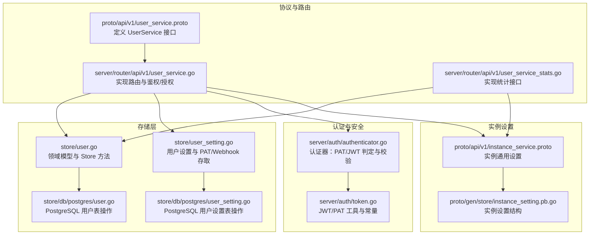
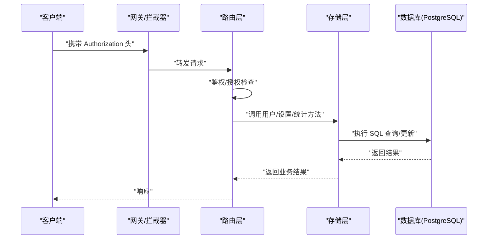
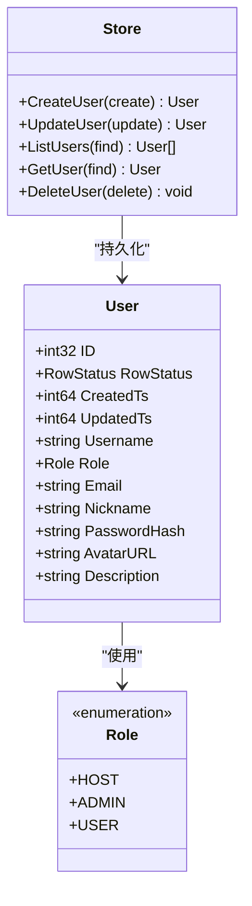
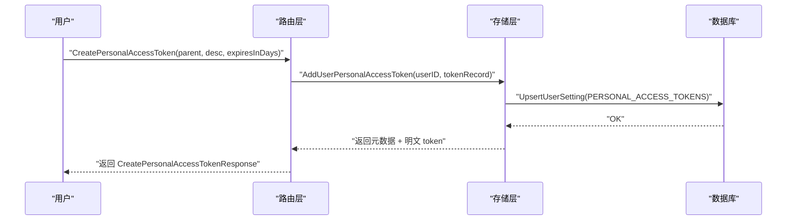
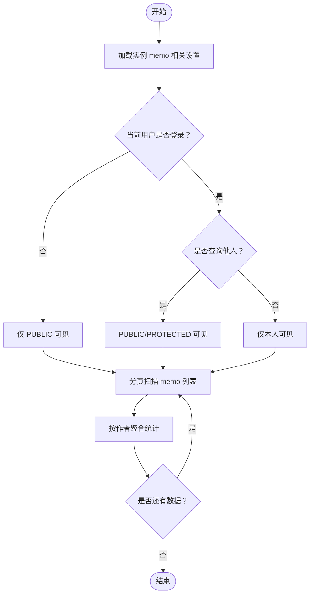
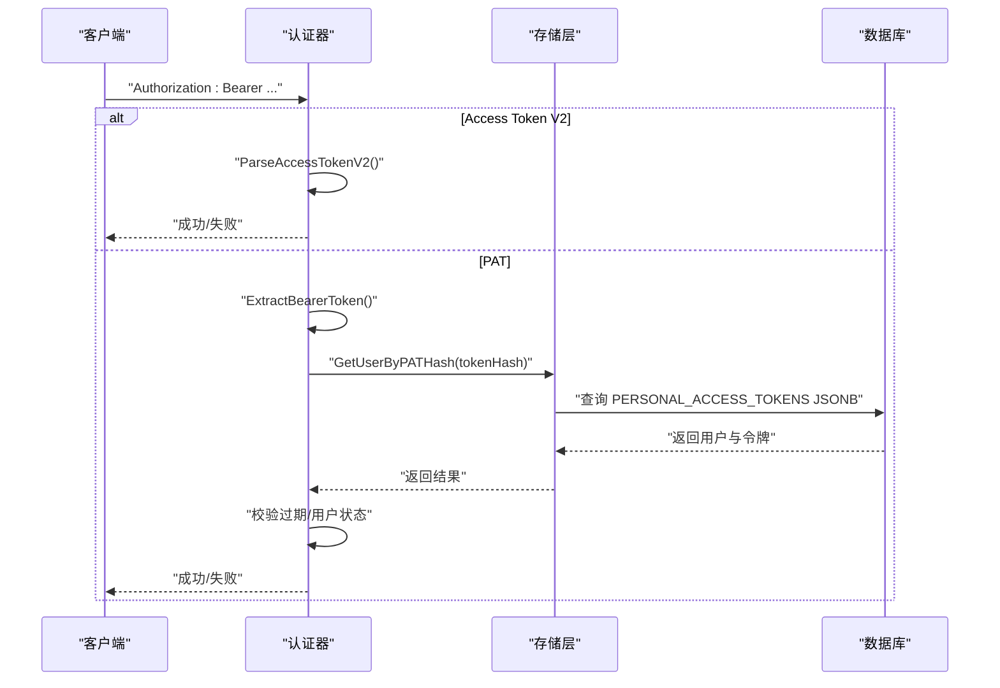
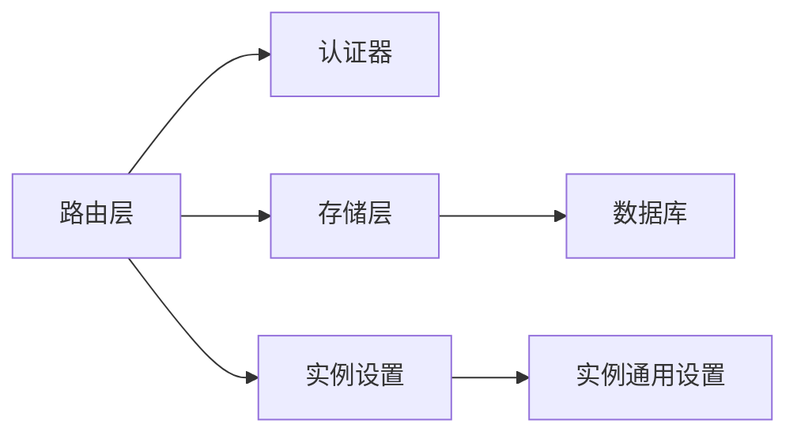

# 用户服务 API

<cite>
**本文引用的文件列表**
- [proto/api/v1/user_service.proto](file://proto/api/v1/user_service.proto)
- [server/router/api/v1/user_service.go](file://server/router/api/v1/user_service.go)
- [server/router/api/v1/user_service_stats.go](file://server/router/api/v1/user_service_stats.go)
- [store/user.go](file://store/user.go)
- [store/db/postgres/user.go](file://store/db/postgres/user.go)
- [store/user_setting.go](file://store/user_setting.go)
- [store/db/postgres/user_setting.go](file://store/db/postgres/user_setting.go)
- [server/auth/token.go](file://server/auth/token.go)
- [server/auth/authenticator.go](file://server/auth/authenticator.go)
- [proto/api/v1/instance_service.proto](file://proto/api/v1/instance_service.proto)
- [proto/gen/store/instance_setting.pb.go](file://proto/gen/store/instance_setting.pb.go)
</cite>

## 目录
1. [简介](#简介)
2. [项目结构](#项目结构)
3. [核心组件](#核心组件)
4. [架构总览](#架构总览)
5. [详细组件分析](#详细组件分析)
6. [依赖关系分析](#依赖关系分析)
7. [性能考量](#性能考量)
8. [故障排查指南](#故障排查指南)
9. [结论](#结论)
10. [附录](#附录)

## 简介
本文件为“用户服务 API”的权威技术文档，覆盖用户管理、配置与个人资料的完整接口规范；详述 User 实体数据结构、角色系统与权限控制；记录用户注册、更新与删除的流程；阐述用户统计、活跃度分析与行为追踪能力；并提供安全配置与隐私保护要点。文档面向开发者与运维人员，兼顾可读性与准确性。

## 项目结构
用户服务 API 基于 Connect/HTTP 协议定义，后端通过 Store 抽象层访问数据库，认证采用 JWT 访问令牌、刷新令牌与长时令牌（PAT）三种方式。统计分析模块基于内存分页扫描与聚合，结合实例设置进行可见性过滤。

图表来源
- [proto/api/v1/user_service.proto](file://proto/api/v1/user_service.proto#L16-L159)
- [server/router/api/v1/user_service.go](file://server/router/api/v1/user_service.go#L32-L323)
- [server/router/api/v1/user_service_stats.go](file://server/router/api/v1/user_service_stats.go#L17-L236)
- [store/user.go](file://store/user.go#L44-L162)
- [store/db/postgres/user.go](file://store/db/postgres/user.go#L13-L179)
- [store/user_setting.go](file://store/user_setting.go#L13-L487)
- [store/db/postgres/user_setting.go](file://store/db/postgres/user_setting.go#L13-L111)
- [server/auth/token.go](file://server/auth/token.go#L25-L53)
- [server/auth/authenticator.go](file://server/auth/authenticator.go#L101-L165)
- [proto/api/v1/instance_service.proto](file://proto/api/v1/instance_service.proto#L84-L112)
- [proto/gen/store/instance_setting.pb.go](file://proto/gen/store/instance_setting.pb.go#L314-L329)

章节来源
- [proto/api/v1/user_service.proto](file://proto/api/v1/user_service.proto#L16-L159)
- [server/router/api/v1/user_service.go](file://server/router/api/v1/user_service.go#L32-L323)
- [server/router/api/v1/user_service_stats.go](file://server/router/api/v1/user_service_stats.go#L17-L236)
- [store/user.go](file://store/user.go#L44-L162)
- [store/db/postgres/user.go](file://store/db/postgres/user.go#L13-L179)
- [store/user_setting.go](file://store/user_setting.go#L13-L487)
- [store/db/postgres/user_setting.go](file://store/db/postgres/user_setting.go#L13-L111)
- [server/auth/token.go](file://server/auth/token.go#L25-L53)
- [server/auth/authenticator.go](file://server/auth/authenticator.go#L101-L165)
- [proto/api/v1/instance_service.proto](file://proto/api/v1/instance_service.proto#L84-L112)
- [proto/gen/store/instance_setting.pb.go](file://proto/gen/store/instance_setting.pb.go#L314-L329)

## 核心组件
- 用户实体与角色
  - User 实体包含标识、状态、角色、用户名、邮箱、昵称、头像、描述等字段，并有创建/更新时间戳。
  - 角色枚举：HOST（宿主）、ADMIN（管理员）、USER（普通用户），用于权限判定。
- 用户设置与个性化
  - 支持通用设置（语言、默认可见性、主题）与 Webhooks 设置。
  - 个人访问令牌（PAT）与刷新令牌（Refresh Token）作为认证凭据。
- 统计与活跃度
  - 提供单用户与全站用户统计，包括 memo 显示时间序列、类型统计、标签计数、置顶 memo 列表与总数。
- 安全与隐私
  - JWT 访问令牌短时有效；PAT 长时有效但仅在创建时返回明文值；支持实例级注册与字段变更限制。

章节来源
- [store/user.go](file://store/user.go#L44-L60)
- [proto/api/v1/user_service.proto](file://proto/api/v1/user_service.proto#L161-L215)
- [server/router/api/v1/user_service.go](file://server/router/api/v1/user_service.go#L106-L181)
- [store/user_setting.go](file://store/user_setting.go#L13-L17)
- [server/router/api/v1/user_service_stats.go](file://server/router/api/v1/user_service_stats.go#L17-L236)
- [server/auth/token.go](file://server/auth/token.go#L25-L53)

## 架构总览
用户服务 API 通过 Connect/HTTP 暴露，路由层负责鉴权与授权，调用 Store 层执行数据库操作；认证器支持 JWT 访问令牌与 PAT；统计模块按需聚合 memo 数据并考虑实例可见性策略。

图表来源
- [server/router/api/v1/user_service.go](file://server/router/api/v1/user_service.go#L32-L323)
- [store/db/postgres/user.go](file://store/db/postgres/user.go#L13-L179)
- [store/db/postgres/user_setting.go](file://store/db/postgres/user_setting.go#L13-L111)

## 详细组件分析

### 用户实体与角色系统
- 数据结构
  - 字段：name、role、username、email、display_name、avatar_url、description、password（输入）、state、create_time、update_time。
  - 角色：HOST、ADMIN、USER；状态：Normal/Archived（由 RowStatus 表示）。
- 权限控制
  - 列表与获取：需要已登录；HOST/ADMIN 可列取所有用户。
  - 更新：仅本人或管理员可更新；HOST 可调整角色；部分字段受实例设置限制（如不可改名、不可改昵称）。
  - 删除：仅本人或管理员可删除。
- 注册流程
  - 首个用户自动成为 HOST（无需认证）。
  - 后续注册受实例设置控制（是否允许注册）；HOST 可指定角色；非 HOST 注册默认 USER。

图表来源
- [store/user.go](file://store/user.go#L44-L94)
- [store/db/postgres/user.go](file://store/db/postgres/user.go#L13-L179)

章节来源
- [store/user.go](file://store/user.go#L44-L94)
- [proto/api/v1/user_service.proto](file://proto/api/v1/user_service.proto#L161-L215)
- [server/router/api/v1/user_service.go](file://server/router/api/v1/user_service.go#L32-L323)

### 用户设置与个性化
- 设置键
  - GENERAL：语言、默认可见性、主题。
  - WEBHOOKS：用户级 Webhooks 列表。
- 访问与更新
  - 仅本人可查看/更新对应设置；GENERAL 通过 UpdateUserSetting 更新。
- Webhooks
  - 支持列出、创建、更新、删除；名称格式 users/{user}/webhooks/{webhook}。
- 个人访问令牌（PAT）
  - 创建时仅返回一次明文令牌；后续仅返回元数据；支持设置过期时间；支持删除。

图表来源
- [server/router/api/v1/user_service.go](file://server/router/api/v1/user_service.go#L569-L635)
- [store/user_setting.go](file://store/user_setting.go#L216-L235)
- [store/db/postgres/user_setting.go](file://store/db/postgres/user_setting.go#L13-L26)

章节来源
- [store/user_setting.go](file://store/user_setting.go#L13-L17)
- [server/router/api/v1/user_service.go](file://server/router/api/v1/user_service.go#L520-L677)
- [store/user_setting.go](file://store/user_setting.go#L201-L287)
- [store/db/postgres/user_setting.go](file://store/db/postgres/user_setting.go#L73-L111)

### 用户统计与活跃度分析
- 全站统计
  - 遍历 memo 列表，按作者聚合显示时间戳、标签计数、memo 类型统计（链接/代码/任务/未完成任务）、置顶 memo 列表与总数。
- 单用户统计
  - 与全站类似，但限定作者；根据当前用户身份与实例设置决定可见范围（PUBLIC/PROTECTED）。
- 可见性与显示时间
  - 受实例设置影响：可选择以创建时间或更新时间作为显示时间。

图表来源
- [server/router/api/v1/user_service_stats.go](file://server/router/api/v1/user_service_stats.go#L17-L236)
- [proto/api/v1/instance_service.proto](file://proto/api/v1/instance_service.proto#L84-L112)
- [proto/gen/store/instance_setting.pb.go](file://proto/gen/store/instance_setting.pb.go#L314-L329)

章节来源
- [server/router/api/v1/user_service_stats.go](file://server/router/api/v1/user_service_stats.go#L17-L236)
- [proto/api/v1/instance_service.proto](file://proto/api/v1/instance_service.proto#L84-L112)
- [proto/gen/store/instance_setting.pb.go](file://proto/gen/store/instance_setting.pb.go#L314-L329)

### 认证与安全配置
- 访问令牌（JWT）
  - 短时有效（默认 15 分钟），用于 API 调用；支持解析与验证。
- 刷新令牌（JWT）
  - 长效（默认 30 天），用于换取新访问令牌；需数据库校验撤销。
- 个人访问令牌（PAT）
  - 长效令牌，创建时返回一次明文值；数据库仅保存哈希；支持过期与最后使用时间记录。
- 认证优先级
  - 先尝试 Access Token V2（无状态），再尝试 PAT；均失败则拒绝。

图表来源
- [server/auth/authenticator.go](file://server/auth/authenticator.go#L136-L165)
- [server/auth/token.go](file://server/auth/token.go#L133-L187)
- [store/db/postgres/user_setting.go](file://store/db/postgres/user_setting.go#L73-L111)

章节来源
- [server/auth/token.go](file://server/auth/token.go#L25-L53)
- [server/auth/authenticator.go](file://server/auth/authenticator.go#L101-L165)
- [store/db/postgres/user_setting.go](file://store/db/postgres/user_setting.go#L73-L111)

### 用户通知与行为追踪
- 通知来源
  - 基于 Inbox 存储层，当前实现聚焦 MEMO_COMMENT 类型。
- 权限
  - 仅通知接收者可查看/更新/删除。
- 字段映射
  - 将存储层 Inbox 映射为 API UserNotification，含发送者、状态、类型、创建时间、关联活动 ID 等。

章节来源
- [server/router/api/v1/user_service.go](file://server/router/api/v1/user_service.go#L1232-L1442)
- [store/user_setting.go](file://store/user_setting.go#L13-L17)

## 依赖关系分析
- 路由层依赖
  - 鉴权：从请求头提取令牌，优先 Access Token V2，其次 PAT；必要时回退到刷新令牌。
  - 授权：基于当前用户角色与资源归属判断（本人/管理员/HOST）。
- 存储层依赖
  - 用户：Create/List/Get/Update/Delete。
  - 设置：Upsert/List/Get，以及 PAT/Webhook 的增删改查。
- 实例设置依赖
  - 控制注册开关、字段变更限制、显示时间策略等。

图表来源
- [server/router/api/v1/user_service.go](file://server/router/api/v1/user_service.go#L32-L323)
- [server/auth/authenticator.go](file://server/auth/authenticator.go#L136-L165)
- [store/user_setting.go](file://store/user_setting.go#L13-L17)
- [proto/api/v1/instance_service.proto](file://proto/api/v1/instance_service.proto#L84-L112)

章节来源
- [server/router/api/v1/user_service.go](file://server/router/api/v1/user_service.go#L32-L323)
- [server/auth/authenticator.go](file://server/auth/authenticator.go#L136-L165)
- [store/user_setting.go](file://store/user_setting.go#L13-L17)
- [proto/api/v1/instance_service.proto](file://proto/api/v1/instance_service.proto#L84-L112)

## 性能考量
- 分页与批量处理
  - 统计模块采用固定批次大小（如 1000）分页扫描，避免一次性加载过多数据。
- 缓存
  - 用户与设置均具备缓存层，减少重复查询。
- 过滤与可见性
  - 依据实例设置与当前用户身份动态构造过滤条件，降低无效数据扫描。
- 数据库索引
  - 用户设置表对 (key, user_id) 建有唯一索引，确保 Upsert 高效。

章节来源
- [server/router/api/v1/user_service_stats.go](file://server/router/api/v1/user_service_stats.go#L47-L128)
- [store/user.go](file://store/user.go#L122-L151)
- [store/user_setting.go](file://store/user_setting.go#L79-L103)
- [store/db/postgres/user_setting.go](file://store/db/postgres/user_setting.go#L13-L26)

## 故障排查指南
- 常见错误码
  - 未认证：用户未登录。
  - 权限不足：非本人且非管理员/HOST。
  - 参数非法：用户名格式不合法、更新路径无效、过滤表达式不支持。
  - 资源不存在：用户/令牌/通知不存在。
- 注册限制
  - 若实例禁止注册，非 HOST 用户无法注册；首用户不受此限制。
- 字段变更限制
  - 若实例禁止更改用户名/昵称，更新将被拒绝。
- PAT 使用
  - 仅在创建时返回明文；过期或用户被归档将导致认证失败。
- 统计异常
  - 若实例设置变更，需重新计算可见范围；确认过滤条件与显示时间策略。

章节来源
- [server/router/api/v1/user_service.go](file://server/router/api/v1/user_service.go#L118-L130)
- [server/router/api/v1/user_service.go](file://server/router/api/v1/user_service.go#L229-L239)
- [server/auth/authenticator.go](file://server/auth/authenticator.go#L101-L124)
- [server/router/api/v1/user_service_stats.go](file://server/router/api/v1/user_service_stats.go#L31-L44)

## 结论
用户服务 API 提供了完整的用户生命周期管理、个性化配置与统计分析能力，配合多层级权限控制与多种认证方式，满足不同场景下的安全与可用性需求。建议在生产环境中：
- 严格启用实例级注册与字段变更限制；
- 对 PAT 进行最小权限与定期轮换；
- 合理配置统计批大小与缓存策略；
- 在前端与后端保持一致的可见性与显示时间策略。

## 附录

### 接口清单与权限矩阵
- 用户管理
  - ListUsers：需要已登录；HOST/ADMIN 可列取。
  - GetUser：支持 ID 或用户名；需要已登录。
  - CreateUser：首用户自动 HOST；后续受实例设置与调用者角色约束。
  - UpdateUser：本人或管理员/HOST；部分字段受实例设置限制。
  - DeleteUser：本人或管理员/HOST。
- 用户设置
  - GetUserSetting/UpdateUserSetting/ListUserSettings：仅本人可操作。
  - ListPersonalAccessTokens/CreatePersonalAccessToken/DeletePersonalAccessToken：仅本人或管理员/HOST。
  - ListUserWebhooks/CreateUserWebhook/UpdateUserWebhook/DeleteUserWebhook：本人或管理员/HOST。
- 用户通知
  - ListUserNotifications/UpdateUserNotification/DeleteUserNotification：仅通知接收者。
- 统计
  - ListAllUserStats/GetUserStats：根据实例设置与当前用户身份决定可见范围。

章节来源
- [proto/api/v1/user_service.proto](file://proto/api/v1/user_service.proto#L16-L159)
- [server/router/api/v1/user_service.go](file://server/router/api/v1/user_service.go#L32-L323)
- [server/router/api/v1/user_service_stats.go](file://server/router/api/v1/user_service_stats.go#L17-L236)