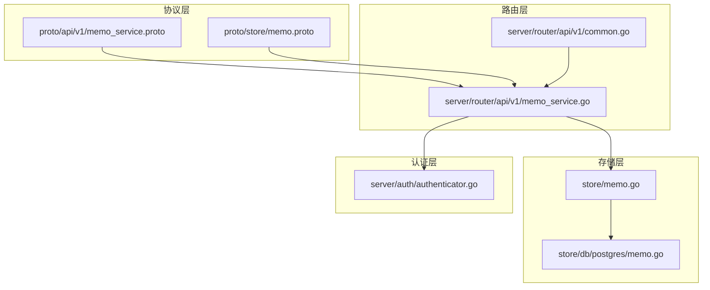
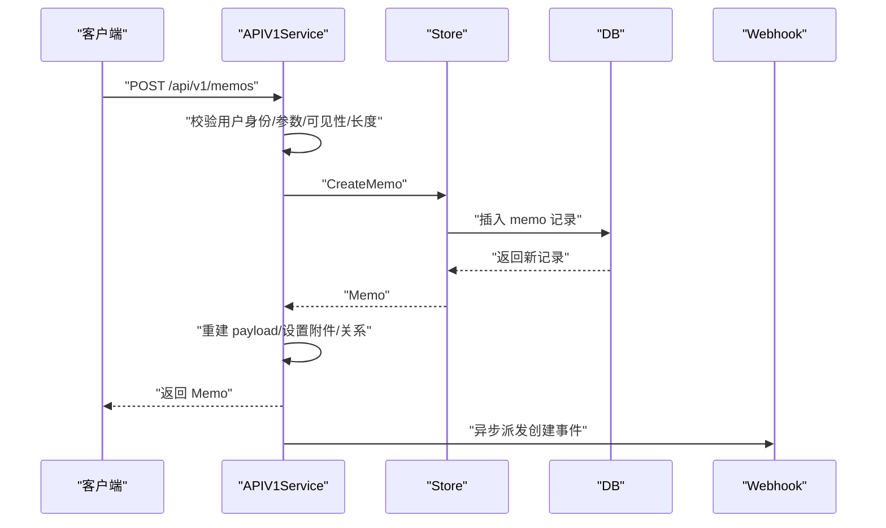
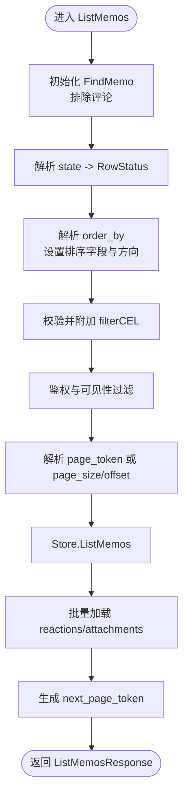

# 笔记 CRUD 操作

<cite>
**本文引用的文件列表**
- [proto/api/v1/memo_service.proto](file://proto/api/v1/memo_service.proto)
- [proto/store/memo.proto](file://proto/store/memo.proto)
- [store/memo.go](file://store/memo.go)
- [store/db/postgres/memo.go](file://store/db/postgres/memo.go)
- [server/router/api/v1/memo_service.go](file://server/router/api/v1/memo_service.go)
- [server/router/api/v1/common.go](file://server/router/api/v1/common.go)
- [server/auth/authenticator.go](file://server/auth/authenticator.go)
</cite>

## 目录
1. [简介](#简介)
2. [项目结构与关键组件](#项目结构与关键组件)
3. [核心数据模型：Memo 实体](#核心数据模型memo-实体)
4. [API 总览与路由映射](#api-总览与路由映射)
5. [CreateMemo 创建笔记](#creatememo-创建笔记)
6. [ListMemos 列出笔记](#listmemos-列出笔记)
7. [GetMemo 获取单个笔记](#getmemo-获取单个笔记)
8. [UpdateMemo 更新笔记](#updatememo-更新笔记)
9. [DeleteMemo 删除笔记](#deletememo-删除笔记)
10. [可见性控制与权限校验](#可见性控制与权限校验)
11. [分页、排序、过滤与性能](#分页排序过滤与性能)
12. [错误码与异常处理](#错误码与异常处理)
13. [最佳实践与常见场景](#最佳实践与常见场景)
14. [结论](#结论)

## 简介
本文件面向后端与前端开发者，系统化梳理笔记 CRUD 的完整 API 规范，覆盖 CreateMemo、ListMemos、GetMemo、UpdateMemo、DeleteMemo 等核心接口；明确 Memo 实体字段语义与约束；详解分页、排序、过滤参数用法；阐述可见性控制（PRIVATE、PROTECTED、PUBLIC）与权限校验策略；并提供错误处理、权限验证与性能优化的最佳实践及典型使用场景。

## 项目结构与关键组件
- 协议层：定义了 MemoService 的 RPC 接口与消息类型，包括 Memo、Visibility 枚举、分页与过滤字段等。
- 存储层：定义了存储侧的 Memo 结构、查询条件 FindMemo、更新 UpdateMemo、删除 DeleteMemo，以及数据库驱动实现。
- 路由层：MemoService 的具体实现，负责鉴权、参数校验、业务规则执行、调用 Store 层、转换响应格式。
- 认证层：统一的认证与授权逻辑，贯穿所有 API。

图表来源
- [proto/api/v1/memo_service.proto](file://proto/api/v1/memo_service.proto#L17-L106)
- [proto/store/memo.proto](file://proto/store/memo.proto#L7-L27)
- [store/memo.go](file://store/memo.go#L35-L107)
- [store/db/postgres/memo.go](file://store/db/postgres/memo.go#L51-L196)
- [server/router/api/v1/memo_service.go](file://server/router/api/v1/memo_service.go#L24-L144)
- [server/router/api/v1/common.go](file://server/router/api/v1/common.go#L13-L64)
- [server/auth/authenticator.go](file://server/auth/authenticator.go#L17-L50)

章节来源
- [proto/api/v1/memo_service.proto](file://proto/api/v1/memo_service.proto#L17-L106)
- [store/memo.go](file://store/memo.go#L35-L107)
- [server/router/api/v1/memo_service.go](file://server/router/api/v1/memo_service.go#L24-L144)

## 核心数据模型：Memo 实体
Memo 是笔记的核心数据模型，既定义在协议层也定义在存储层，二者保持一致的字段与约束。

- 字段概览（协议层）
  - name：资源标识符，格式为 memos/{memo}，memo 为用户自定义 ID 或 UUID。
  - state：笔记状态（NORMAL/ARCHIVED），对应存储层 RowStatus。
  - creator：创建者资源名 users/{user}。
  - create_time/update_time/display_time：时间戳，可选；未设置时服务端会填充默认值。
  - content：Markdown 内容，必填。
  - visibility：可见性枚举（PRIVATE/PROTECTED/PUBLIC）。
  - tags：从内容中提取的标签（输出项）。
  - pinned：是否置顶。
  - attachments/relations/reactions：关联附件、关系、反应（输出项或通过其他接口管理）。
  - property：计算属性集合（如是否包含链接、任务清单、代码块、未完成任务等）。
  - parent/snippet/location：父级笔记、纯文本摘要、位置信息。

- 字段概览（存储层）
  - ID/UID：系统生成唯一标识与用户自定义唯一标识。
  - RowStatus/CreatorID/CreatedTs/UpdatedTs：标准字段。
  - Content/Visibility/Pinned/Payload：领域字段与负载（包含 tags、property、location 等）。
  - ParentUID：父级笔记 UID（可选）。

- 字段约束与默认行为
  - content 长度受实例设置限制，超限将返回 InvalidArgument。
  - display_time 与 create_time/update_time 的赋值遵循实例设置（是否以更新时间显示）。
  - visibility 受系统设置限制，若禁用 PUBLIC，设置为 PUBLIC 将返回 PermissionDenied。
  - UID 必须符合正则匹配，否则返回 InvalidArgument。

章节来源
- [proto/api/v1/memo_service.proto](file://proto/api/v1/memo_service.proto#L153-L231)
- [proto/store/memo.proto](file://proto/store/memo.proto#L7-L27)
- [store/memo.go](file://store/memo.go#L35-L55)

## API 总览与路由映射
- CreateMemo
  - HTTP: POST /api/v1/memos
  - 请求体: Memo（可选 memo_id）
  - 响应: Memo
- ListMemos
  - HTTP: GET /api/v1/memos
  - 查询参数: page_size/page_token/state/order_by/filter/show_deleted
  - 响应: ListMemosResponse（含 next_page_token）
- GetMemo
  - HTTP: GET /api/v1/{name=memos/*}
  - 响应: Memo
- UpdateMemo
  - HTTP: PATCH /api/v1/{memo.name=memos/*}
  - 请求体: Memo + FieldMask（update_mask）
  - 响应: Memo
- DeleteMemo
  - HTTP: DELETE /api/v1/{name=memos/*}
  - 响应: Empty
- 其他相关接口（本文件不展开）
  - SetMemoAttachments/ListMemoAttachments
  - SetMemoRelations/ListMemoRelations
  - CreateMemoComment/ListMemoComments
  - ListMemoReactions/UpsertMemoReaction/DeleteMemoReaction

章节来源
- [proto/api/v1/memo_service.proto](file://proto/api/v1/memo_service.proto#L17-L106)

## CreateMemo 创建笔记
- 请求流程
  - 鉴权：必须已登录，否则返回 Unauthenticated。
  - 自定义 memo_id 校验：若提供需满足正则要求；否则生成 UUID。
  - 时间戳处理：优先使用显式 create_time/update_time；若提供 display_time，则依据实例设置决定写入 create_time 或 update_time。
  - 可见性限制：若系统禁止 PUBLIC 且请求为 PUBLIC，返回 PermissionDenied。
  - 内容长度限制：超过上限返回 InvalidArgument。
  - 负载重建：根据 Markdown 内容重建 payload（tags、property、location 等）。
  - 关联附件/关系：若提供 attachments/relations，先设置再返回。
  - 成功后触发 Webhook（异步）。
- 响应
  - 返回完整的 Memo 对象（包含 tags、reactions、attachments 等按需加载）。

图表来源
- [server/router/api/v1/memo_service.go](file://server/router/api/v1/memo_service.go#L24-L144)
- [store/memo.go](file://store/memo.go#L109-L114)
- [store/db/postgres/memo.go](file://store/db/postgres/memo.go#L16-L48)

章节来源
- [server/router/api/v1/memo_service.go](file://server/router/api/v1/memo_service.go#L24-L144)
- [store/memo.go](file://store/memo.go#L109-L114)

## ListMemos 列出笔记
- 分页与令牌
  - page_size 默认 10，最大 1000；若提供 page_token，则忽略 page_size 并按令牌中的 limit/offset 解析。
  - next_page_token 用于下一页请求。
- 过滤与排序
  - filter：CEL 表达式，支持基于 Memo 字段与计算属性的过滤。
  - order_by：AIP-132 风格，支持多字段组合，如 pinned desc, display_time desc；默认 display_time desc。
  - 支持字段：pinned、display_time、create_time、update_time、name。
- 权限与可见性
  - 未登录：仅返回 PUBLIC。
  - 已登录：返回 creator_id == 当前用户 或 visibility ∈ {PUBLIC, PROTECTED} 的笔记。
  - 若显式指定 CreatorID 且非当前用户，则 visibility 限定为 {PUBLIC, PROTECTED}。
- 时间排序策略
  - 若启用“以更新时间显示”，则默认按 updated_ts 排序；否则按 created_ts 排序。
- 批量加载关联
  - 同步批量查询 reactions 与 attachments，减少多次往返。

图表来源
- [server/router/api/v1/memo_service.go](file://server/router/api/v1/memo_service.go#L147-L286)
- [server/router/api/v1/memo_service.go](file://server/router/api/v1/memo_service.go#L777-L830)
- [store/db/postgres/memo.go](file://store/db/postgres/memo.go#L51-L196)
- [server/router/api/v1/common.go](file://server/router/api/v1/common.go#L13-L18)

章节来源
- [server/router/api/v1/memo_service.go](file://server/router/api/v1/memo_service.go#L147-L286)
- [server/router/api/v1/memo_service.go](file://server/router/api/v1/memo_service.go#L777-L830)
- [store/db/postgres/memo.go](file://store/db/postgres/memo.go#L51-L196)
- [server/router/api/v1/common.go](file://server/router/api/v1/common.go#L13-L18)

## GetMemo 获取单个笔记
- 资源名解析：从 name 中提取 memo UID。
- 权限校验：
  - 若笔记非 PUBLIC：必须已登录；若为 PRIVATE 且不是作者，返回 PermissionDenied。
- 关联加载：同步加载 reactions 与 attachments。
- 响应：返回完整 Memo。

章节来源
- [server/router/api/v1/memo_service.go](file://server/router/api/v1/memo_service.go#L289-L335)

## UpdateMemo 更新笔记
- 参数校验：必须提供 update_mask，至少包含一个要更新的字段路径。
- 权限：仅作者或管理员可更新。
- 支持字段与行为：
  - content：校验长度并重建 payload。
  - visibility：受系统设置限制，PUBLIC 可能被拒绝。
  - pinned/state/create_time/update_time/display_time/location/attachments/relations：分别处理并持久化。
  - display_time：依据实例设置决定写入 create_time 或 update_time。
- 成功后触发 Webhook（异步）。

章节来源
- [server/router/api/v1/memo_service.go](file://server/router/api/v1/memo_service.go#L337-L476)

## DeleteMemo 删除笔记
- 权限：仅作者或管理员可删除。
- 清理策略：
  - 先删除该笔记的所有评论（memo_relation.type=COMMENT）。
  - 清理与该笔记相关的 memo_relation 记录。
  - 删除与该笔记关联的附件。
  - 最终删除 memo 记录。
- 成功后触发 Webhook（异步）。

章节来源
- [server/router/api/v1/memo_service.go](file://server/router/api/v1/memo_service.go#L478-L544)
- [store/memo.go](file://store/memo.go#L140-L159)

## 可见性控制与权限校验
- 可见性枚举
  - PRIVATE：仅作者可见。
  - PROTECTED：作者与登录用户可见。
  - PUBLIC：所有人可见。
- 系统设置
  - 若禁用 PUBLIC，创建/更新时将拒绝 PUBLIC。
- 用户角色
  - 管理员（Admin/Host）拥有更高权限，可对他人笔记进行更新/删除。

章节来源
- [proto/api/v1/memo_service.proto](file://proto/api/v1/memo_service.proto#L108-L113)
- [server/router/api/v1/memo_service.go](file://server/router/api/v1/memo_service.go#L77-L79)
- [server/router/api/v1/memo_service.go](file://server/router/api/v1/memo_service.go#L386-L394)
- [server/router/api/v1/common.go](file://server/router/api/v1/common.go#L66-L68)

## 分页、排序、过滤与性能
- 分页
  - page_size 默认 10，最大 1000；next_page_token 采用 base64 编码的 PageToken。
- 排序
  - order_by 支持多字段组合，字段包括 pinned、display_time、create_time、update_time、name；默认 display_time desc。
  - 若仅指定 pinned，仍需补充默认时间排序。
- 过滤
  - filter 使用 CEL 表达式，支持基于 Memo 字段与计算属性的复杂过滤。
- 性能优化
  - 批量查询 reactions 与 attachments，避免 N+1。
  - 限制单次查询上限（数据库层限制为 10000，路由层限制为 1000）。
  - 前端无限滚动与预取策略（参考前端组件）。

章节来源
- [server/router/api/v1/memo_service.go](file://server/router/api/v1/memo_service.go#L147-L286)
- [server/router/api/v1/memo_service.go](file://server/router/api/v1/memo_service.go#L777-L830)
- [store/db/postgres/memo.go](file://store/db/postgres/memo.go#L138-L154)
- [server/router/api/v1/common.go](file://server/router/api/v1/common.go#L13-L18)

## 错误码与异常处理
- 常见错误码
  - Unauthenticated：未登录访问需要认证的资源。
  - PermissionDenied：无权限（非作者或非管理员）。
  - NotFound：资源不存在。
  - InvalidArgument：参数非法（如 memo_id 格式、content 过长、order_by/过滤表达式无效）。
  - AlreadyExists：自定义 memo_id 已存在（唯一约束）。
  - Internal：服务器内部错误（数据库异常、序列化失败等）。
- 处理要点
  - 参数校验前置：memo_id 正则、content 长度、update_mask、order_by 语法。
  - 数据库唯一约束捕获：转换为 AlreadyExists。
  - 身份与权限检查：统一在路由层执行。
  - 异常包装与日志：便于定位问题。

章节来源
- [server/router/api/v1/memo_service.go](file://server/router/api/v1/memo_service.go#L24-L144)
- [server/router/api/v1/memo_service.go](file://server/router/api/v1/memo_service.go#L337-L476)
- [server/router/api/v1/memo_service.go](file://server/router/api/v1/memo_service.go#L478-L544)

## 最佳实践与常见场景
- 创建笔记
  - 若希望固定时间展示，传入 display_time；若希望固定创建时间，传入 create_time；若希望固定更新时间，传入 update_time。
  - 如需附件/关系，可在创建时一并提交，或后续通过 SetMemoAttachments/SetMemoRelations。
- 列表查询
  - 使用 filter 组合多种条件（如 tags、时间范围、状态）。
  - 使用 order_by 控制排序，结合 pinned 优先级。
  - 使用 page_token 实现稳定分页。
- 更新笔记
  - 使用 FieldMask 精准更新，避免全量写入。
  - 更新 visibility 前确认系统设置。
- 删除笔记
  - 删除前确保不再需要评论与附件，系统会自动清理。
- 权限与可见性
  - 严格区分 PRIVATE/PROTECTED/PUBLIC 的适用场景。
  - 管理员操作需谨慎，避免越权修改他人笔记。

## 结论
本文档系统化梳理了笔记 CRUD 的 API 规范、数据模型、权限与可见性控制、分页排序过滤与性能优化策略，并提供了错误处理与最佳实践建议。建议在前后端对接时严格遵循协议层定义与路由层实现细节，确保一致性与稳定性。