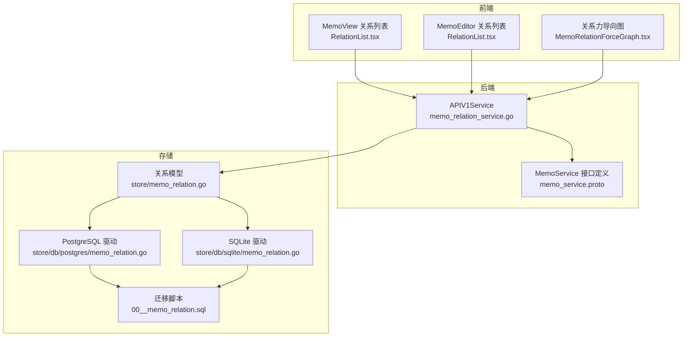
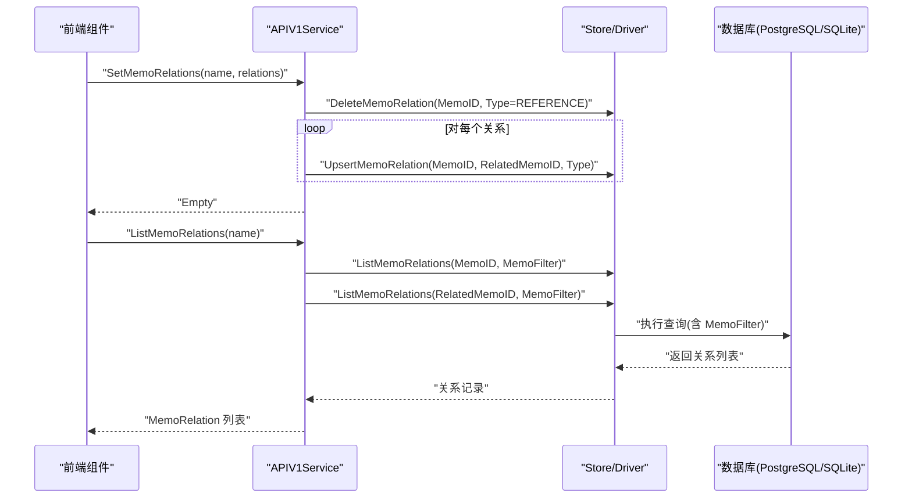
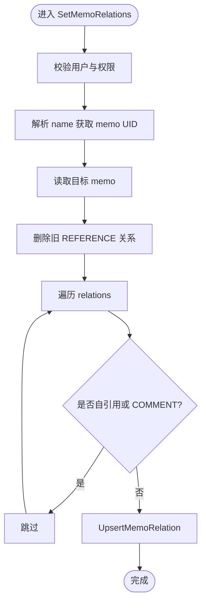
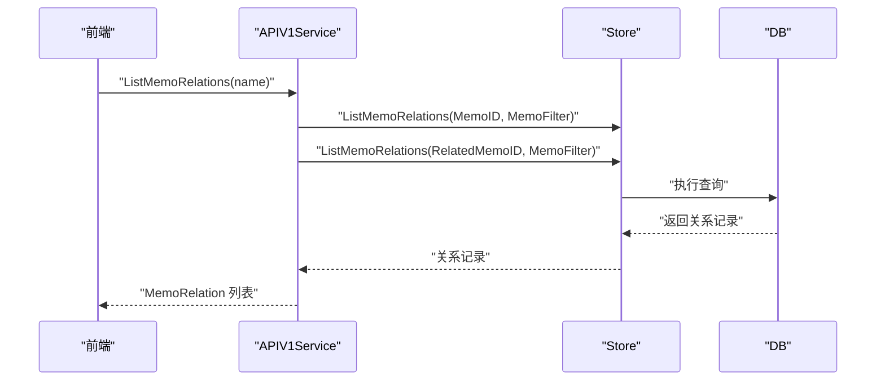
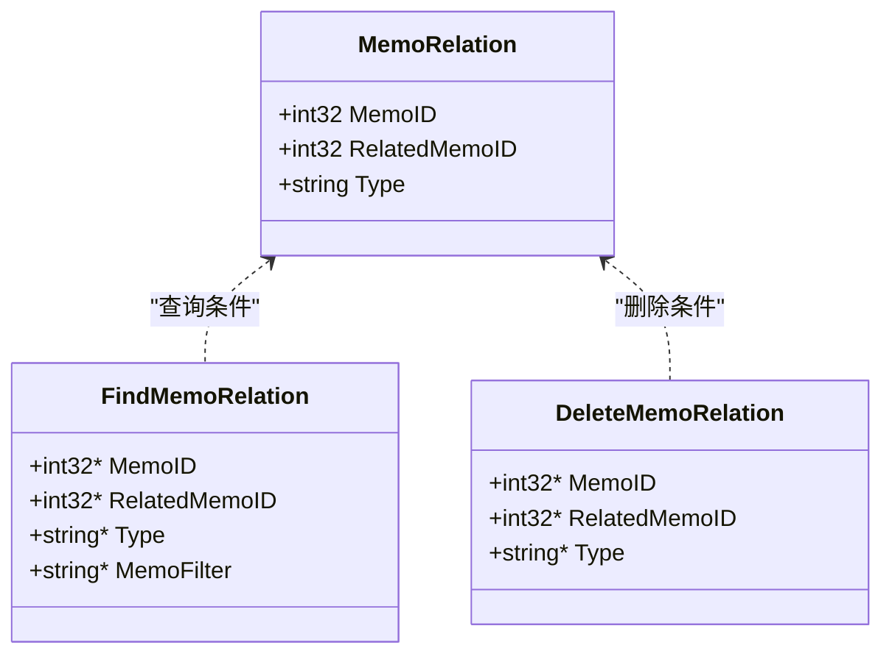
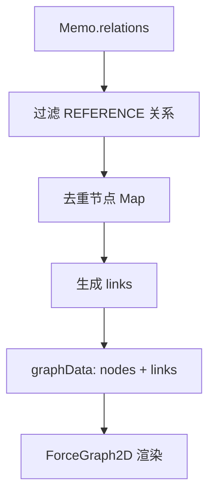
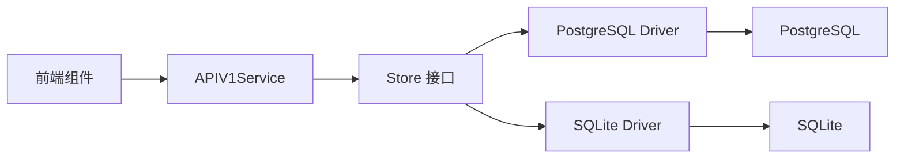

# 笔记关系系统

<cite>
**本文引用的文件列表**
- [memo_service.proto](file://proto/api/v1/memo_service.proto)
- [memo_relation_service.go](file://server/router/api/v1/memo_relation_service.go)
- [memo_relation.go](file://store/memo_relation.go)
- [postgres/memo_relation.go](file://store/db/postgres/memo_relation.go)
- [sqlite/memo_relation.go](file://store/db/sqlite/memo_relation.go)
- [00__memo_relation.sql](file://store/migration/sqlite/0.13/00__memo_relation.sql)
- [MemoRelationForceGraph.tsx](file://web/src/components/MemoRelationForceGraph/MemoRelationForceGraph.tsx)
- [utils.ts](file://web/src/components/MemoRelationForceGraph/utils.ts)
- [RelationList.tsx](file://web/src/components/MemoView/components/metadata/RelationList.tsx)
- [RelationList.tsx](file://web/src/components/MemoEditor/components/RelationList.tsx)
</cite>

## 目录
1. [简介](#简介)
2. [项目结构](#项目结构)
3. [核心组件](#核心组件)
4. [架构总览](#架构总览)
5. [详细组件分析](#详细组件分析)
6. [依赖关系分析](#依赖关系分析)
7. [性能考量](#性能考量)
8. [故障排查指南](#故障排查指南)
9. [结论](#结论)
10. [附录](#附录)

## 简介
本文件为“笔记关系系统”的详细API与实现文档，聚焦以下目标：
- 规范 SetMemoRelations 与 ListMemoRelations 接口的请求/响应格式、权限与行为约束
- 明确 MemoRelation 的数据结构与关系类型（REFERENCE、COMMENT）
- 解释笔记间引用关系的建立、维护与查询机制
- 说明关系的双向性与可见性过滤策略
- 提供关系图谱构建与可视化展示的技术实现
- 给出关系查询的性能优化策略与索引设计建议
- 提供使用示例与关系管理最佳实践

## 项目结构
围绕笔记关系系统的关键代码分布在如下层次：
- 前端 Web 层：关系可视化组件与编辑器/详情页的关系列表组件
- 后端 API 层：MemoService 的 SetMemoRelations 与 ListMemoRelations 实现
- 存储层：关系模型定义、存储接口与数据库驱动（PostgreSQL/SQLite）

图表来源
- [memo_relation_service.go](file://server/router/api/v1/memo_relation_service.go#L1-L182)
- [memo_service.proto](file://proto/api/v1/memo_service.proto#L62-L74)
- [memo_relation.go](file://store/memo_relation.go#L1-L45)
- [postgres/memo_relation.go](file://store/db/postgres/memo_relation.go#L1-L137)
- [sqlite/memo_relation.go](file://store/db/sqlite/memo_relation.go#L1-L123)
- [00__memo_relation.sql](file://store/migration/sqlite/0.13/00__memo_relation.sql#L1-L7)
- [MemoRelationForceGraph.tsx](file://web/src/components/MemoRelationForceGraph/MemoRelationForceGraph.tsx#L1-L62)
- [RelationList.tsx](file://web/src/components/MemoView/components/metadata/RelationList.tsx#L1-L34)
- [RelationList.tsx](file://web/src/components/MemoEditor/components/RelationList.tsx#L41-L93)

章节来源
- [memo_relation_service.go](file://server/router/api/v1/memo_relation_service.go#L1-L182)
- [memo_service.proto](file://proto/api/v1/memo_service.proto#L62-L74)

## 核心组件
- 关系模型与类型
  - 类型枚举：REFERENCE、COMMENT
  - 结构字段：MemoID、RelatedMemoID、Type
- API 接口
  - SetMemoRelations：设置某笔记的引用关系（删除旧引用，写入新引用）
  - ListMemoRelations：列出某笔记的引用关系（含正向与反向）
- 存储层
  - Upsert/Delete/List 关系记录
  - 支持基于 MemoFilter 的可见性过滤
- 前端组件
  - 关系列表渲染与筛选
  - 力导向图可视化（仅显示 REFERENCE）

章节来源
- [memo_relation.go](file://store/memo_relation.go#L7-L20)
- [memo_service.proto](file://proto/api/v1/memo_service.proto#L358-L385)
- [memo_relation_service.go](file://server/router/api/v1/memo_relation_service.go#L16-L75)
- [memo_relation_service.go](file://server/router/api/v1/memo_relation_service.go#L77-L131)
- [postgres/memo_relation.go](file://store/db/postgres/memo_relation.go#L12-L39)
- [sqlite/memo_relation.go](file://store/db/sqlite/memo_relation.go#L12-L39)
- [MemoRelationForceGraph.tsx](file://web/src/components/MemoRelationForceGraph/MemoRelationForceGraph.tsx#L19-L62)
- [RelationList.tsx](file://web/src/components/MemoView/components/metadata/RelationList.tsx#L17-L34)

## 架构总览
下图展示了从前端到后端再到存储的整体流程，以及关系图谱的可视化路径。

图表来源
- [memo_relation_service.go](file://server/router/api/v1/memo_relation_service.go#L16-L75)
- [memo_relation_service.go](file://server/router/api/v1/memo_relation_service.go#L77-L131)
- [postgres/memo_relation.go](file://store/db/postgres/memo_relation.go#L41-L114)
- [sqlite/memo_relation.go](file://store/db/sqlite/memo_relation.go#L41-L98)

## 详细组件分析

### API：SetMemoRelations
- 请求
  - name：目标笔记资源名（memos/{uid}）
  - relations：关系数组，每项包含 related_memo.name 与 type
- 行为
  - 校验用户身份与权限
  - 解析目标笔记 UID，获取笔记对象
  - 删除该笔记的所有 REFERENCE 类型关系
  - 逐条插入新的 REFERENCE 关系（忽略 COMMENT 类型；忽略自引用）
- 返回
  - 空响应

图表来源
- [memo_relation_service.go](file://server/router/api/v1/memo_relation_service.go#L16-L75)

章节来源
- [memo_relation_service.go](file://server/router/api/v1/memo_relation_service.go#L16-L75)
- [memo_service.proto](file://proto/api/v1/memo_service.proto#L387-L397)

### API：ListMemoRelations
- 请求
  - name：目标笔记资源名
  - 可选分页参数（page_size、page_token）
- 行为
  - 解析 name 获取 memo UID，读取笔记
  - 计算 MemoFilter（根据当前用户与笔记可见性）
  - 分别查询“以该 memo 为起点”和“以该 memo 为终点”的关系
  - 将存储层记录转换为 API 层 MemoRelation（含 snippet）
- 返回
  - relations：MemoRelation 数组
  - next_page_token：分页令牌

图表来源
- [memo_relation_service.go](file://server/router/api/v1/memo_relation_service.go#L77-L131)
- [postgres/memo_relation.go](file://store/db/postgres/memo_relation.go#L41-L114)
- [sqlite/memo_relation.go](file://store/db/sqlite/memo_relation.go#L41-L98)

章节来源
- [memo_relation_service.go](file://server/router/api/v1/memo_relation_service.go#L77-L131)
- [memo_service.proto](file://proto/api/v1/memo_service.proto#L399-L420)

### 数据模型：MemoRelation
- 字段
  - MemoID：源笔记 ID
  - RelatedMemoID：目标笔记 ID
  - Type：关系类型（REFERENCE、COMMENT）
- 查询条件
  - MemoID、RelatedMemoID、Type、MemoFilter
- 删除条件
  - MemoID、RelatedMemoID、Type

图表来源
- [memo_relation.go](file://store/memo_relation.go#L16-L33)

章节来源
- [memo_relation.go](file://store/memo_relation.go#L7-L20)
- [memo_relation.go](file://store/memo_relation.go#L22-L33)

### 关系类型：REFERENCE 与 COMMENT
- REFERENCE
  - 表示“引用”关系，通常用于构建笔记之间的引用网络
  - 在 SetMemoRelations 中会被写入；在 ListMemoRelations 中被返回
- COMMENT
  - 表示“评论”关系，属于独立的评论体系，不参与 SetMemoRelations 的更新
  - 在 ListMemoRelations 中也会返回，但不会影响 SetMemoRelations 的写入

章节来源
- [memo_service.proto](file://proto/api/v1/memo_service.proto#L366-L371)
- [memo_relation_service.go](file://server/router/api/v1/memo_relation_service.go#L47-L72)
- [memo_relation_service.go](file://server/router/api/v1/memo_relation_service.go#L163-L181)

### 可见性与双向性
- 可见性过滤
  - ListMemoRelations 会根据当前用户与笔记可见性动态构造 MemoFilter
  - 仅返回对当前用户可见的笔记所构成的关系
- 双向性
  - 通过两次查询合并结果实现双向展示：
    - 以 MemoID 查询“以该 memo 为起点”的关系
    - 以 RelatedMemoID 查询“以该 memo 为终点”的关系

章节来源
- [memo_relation_service.go](file://server/router/api/v1/memo_relation_service.go#L91-L96)
- [memo_relation_service.go](file://server/router/api/v1/memo_relation_service.go#L98-L125)

### 关系图谱构建与可视化
- 前端图谱组件
  - 使用 react-force-graph-2d 构建力导向图
  - 仅展示 REFERENCE 类型关系
  - 节点标签截取笔记 ID 片段，支持点击跳转
- 数据转换
  - 将 MemoRelation 列表转换为节点与边集合
  - 去重节点，按 source/target 建立边

图表来源
- [MemoRelationForceGraph.tsx](file://web/src/components/MemoRelationForceGraph/MemoRelationForceGraph.tsx#L52-L57)
- [utils.ts](file://web/src/components/MemoRelationForceGraph/utils.ts#L5-L36)

章节来源
- [MemoRelationForceGraph.tsx](file://web/src/components/MemoRelationForceGraph/MemoRelationForceGraph.tsx#L19-L62)
- [utils.ts](file://web/src/components/MemoRelationForceGraph/utils.ts#L1-L36)

### 前端关系列表组件
- MemoView/MemoEditor 中的关系列表
  - 支持区分“引用该笔记”与“被引用”
  - 依据 MemoRelation_Type 进行筛选与展示

章节来源
- [RelationList.tsx](file://web/src/components/MemoView/components/metadata/RelationList.tsx#L17-L34)
- [RelationList.tsx](file://web/src/components/MemoEditor/components/RelationList.tsx#L41-L93)

## 依赖关系分析
- 后端依赖链
  - APIV1Service 依赖 Store 接口
  - Store 接口由具体 Driver 实现（PostgreSQL/SQLite）
  - Driver 依赖数据库原生查询与参数化
- 前端依赖链
  - 关系列表与图谱组件依赖 MemoService 的 ListMemoRelations 返回值
  - 图谱组件依赖 utils.ts 的数据转换函数

图表来源
- [memo_relation_service.go](file://server/router/api/v1/memo_relation_service.go#L1-L182)
- [postgres/memo_relation.go](file://store/db/postgres/memo_relation.go#L1-L137)
- [sqlite/memo_relation.go](file://store/db/sqlite/memo_relation.go#L1-L123)

章节来源
- [memo_relation_service.go](file://server/router/api/v1/memo_relation_service.go#L1-L182)
- [postgres/memo_relation.go](file://store/db/postgres/memo_relation.go#L1-L137)
- [sqlite/memo_relation.go](file://store/db/sqlite/memo_relation.go#L1-L123)

## 性能考量
- 查询路径
  - ListMemoRelations 会执行两次查询（正向与反向），并在服务端合并
  - MemoFilter 通过表达式引擎编译为 SQL 子句，避免全表扫描
- 索引与唯一约束
  - SQLite 迁移脚本定义了唯一约束（memo_id, related_memo_id, type）
  - PostgreSQL 驱动使用 ON CONFLICT 更新，减少重复写入
- 建议的索引设计
  - 基础索引
    - memo_id
    - related_memo_id
    - type
  - 复合索引（可选）
    - (memo_id, type)
    - (related_memo_id, type)
  - 注意：SQLite 的 UNIQUE 约束已提供唯一性保障；PostgreSQL 的 ON CONFLICT 已优化重复键处理
- 缓存与分页
  - 建议在应用层对关系列表进行短期缓存，降低频繁查询压力
  - 分页参数（page_size/page_token）已在 API 中提供，建议配合后端分页实现

章节来源
- [00__memo_relation.sql](file://store/migration/sqlite/0.13/00__memo_relation.sql#L1-L7)
- [postgres/memo_relation.go](file://store/db/postgres/memo_relation.go#L12-L39)
- [sqlite/memo_relation.go](file://store/db/sqlite/memo_relation.go#L12-L39)
- [memo_relation_service.go](file://server/router/api/v1/memo_relation_service.go#L91-L96)

## 故障排查指南
- 权限错误
  - 未登录或非超级用户修改他人笔记关系会返回未认证或权限拒绝
- 资源不存在
  - name 解析失败或笔记不存在会返回无效参数或未找到
- 写入失败
  - Upsert/Delete 失败可能由数据库约束或并发导致
- 查询为空
  - 若笔记不可见或无任何关系，ListMemoRelations 返回空列表
- 图谱不显示
  - 仅 REFERENCE 类型会出现在图谱中；确认 relations 中包含 REFERENCE

章节来源
- [memo_relation_service.go](file://server/router/api/v1/memo_relation_service.go#L16-L75)
- [memo_relation_service.go](file://server/router/api/v1/memo_relation_service.go#L77-L131)

## 结论
- SetMemoRelations 与 ListMemoRelations 提供了稳定的关系管理能力
- REFERENCE 与 COMMENT 的分离使关系与评论体系清晰
- 双向查询与可见性过滤确保了关系视图的完整性与安全性
- 前端图谱组件提供了直观的关系可视化
- 建议结合索引与缓存策略进一步优化大规模场景下的查询性能

## 附录

### API 规范摘要
- SetMemoRelations
  - 方法：PATCH /api/v1/{name=memos/*}/relations
  - 请求体：SetMemoRelationsRequest{name, relations}
  - 行为：删除旧 REFERENCE，写入新 REFERENCE
- ListMemoRelations
  - 方法：GET /api/v1/{name=memos/*}/relations
  - 请求体：ListMemoRelationsRequest{name[, page_size, page_token]}
  - 响应：ListMemoRelationsResponse{relations, next_page_token}

章节来源
- [memo_service.proto](file://proto/api/v1/memo_service.proto#L62-L74)
- [memo_service.proto](file://proto/api/v1/memo_service.proto#L387-L420)

### 使用示例与最佳实践
- 建立引用关系
  - 通过 SetMemoRelations 设置一组 REFERENCE 关系
  - 避免自引用与 COMMENT 类型
- 查询关系
  - 使用 ListMemoRelations 获取双向关系
  - 结合前端关系列表组件进行展示
- 可视化
  - 使用 MemoRelationForceGraph 展示 REFERENCE 关系图谱
  - 仅展示 REFERENCE，避免 COMMENT 干扰
- 性能优化
  - 为 memo_id、related_memo_id、type 建立索引
  - 对高频查询结果进行短期缓存
  - 控制单次请求的关系数量，必要时启用分页

章节来源
- [memo_relation_service.go](file://server/router/api/v1/memo_relation_service.go#L16-L75)
- [memo_relation_service.go](file://server/router/api/v1/memo_relation_service.go#L77-L131)
- [MemoRelationForceGraph.tsx](file://web/src/components/MemoRelationForceGraph/MemoRelationForceGraph.tsx#L52-L57)