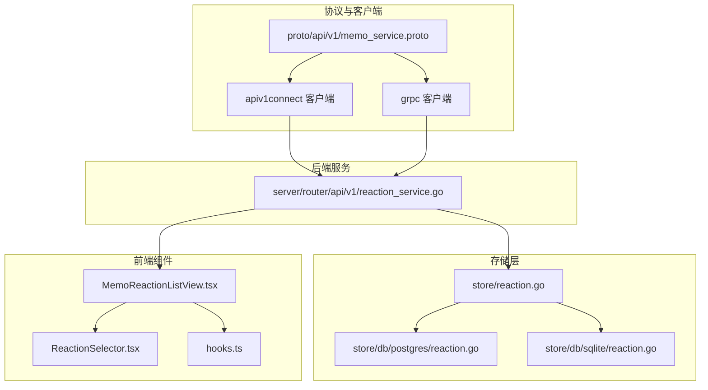
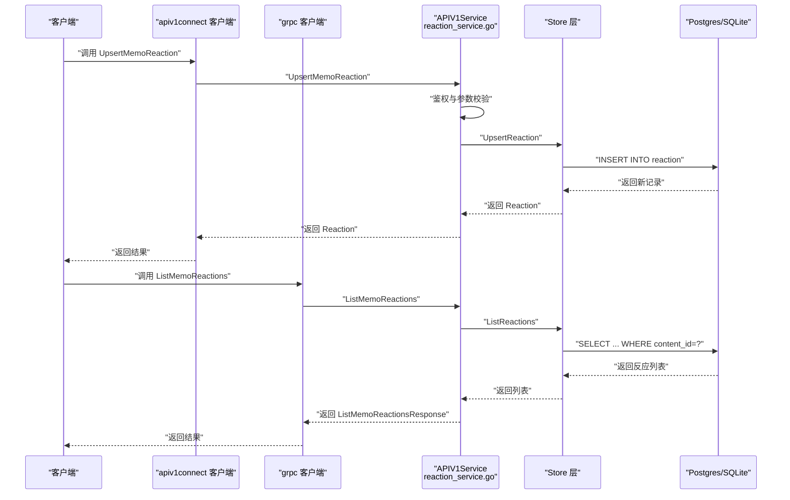
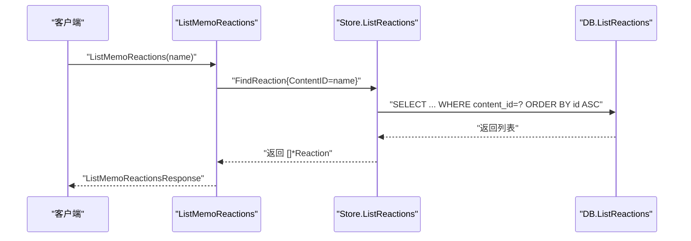
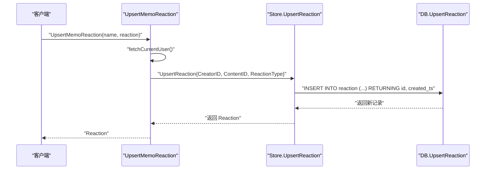
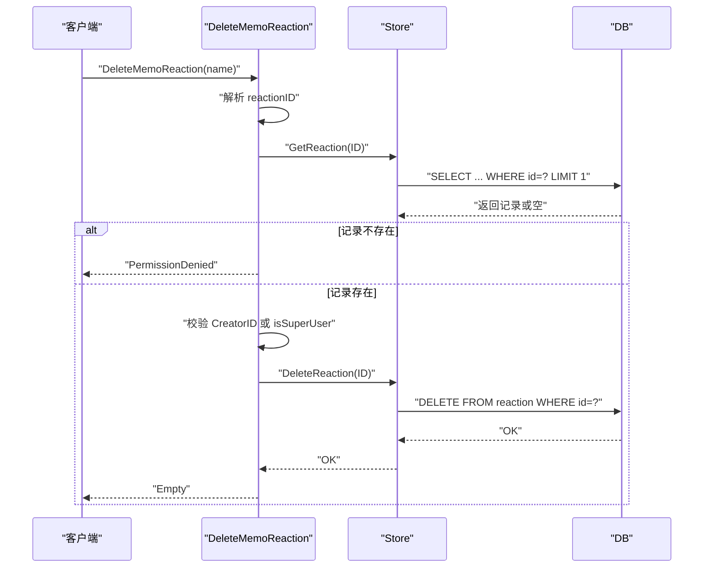
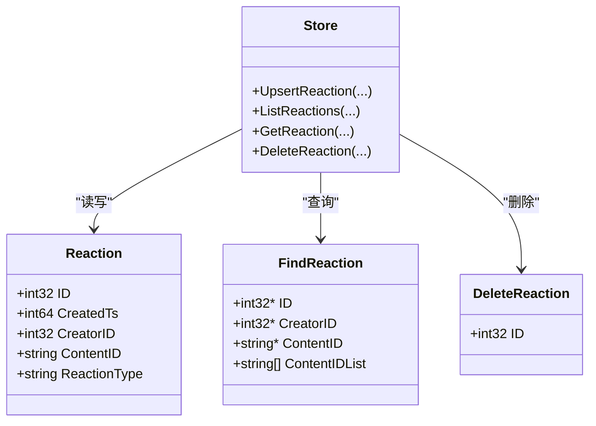
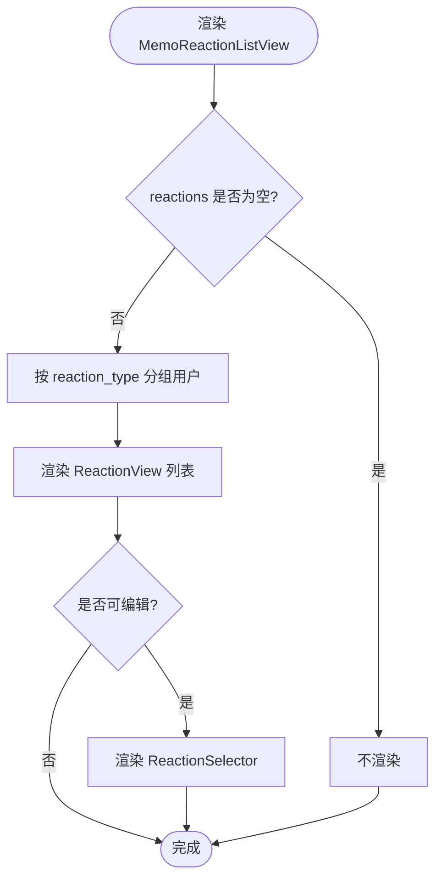
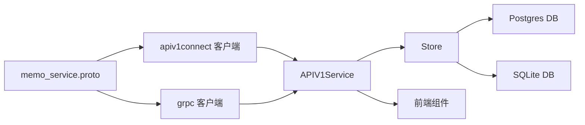

# 笔记反应系统

<cite>
**本文引用的文件**
- [proto/api/v1/memo_service.proto](file://proto/api/v1/memo_service.proto)
- [server/router/api/v1/reaction_service.go](file://server/router/api/v1/reaction_service.go)
- [store/reaction.go](file://store/reaction.go)
- [store/db/postgres/reaction.go](file://store/db/postgres/reaction.go)
- [store/db/sqlite/reaction.go](file://store/db/sqlite/reaction.go)
- [proto/gen/api/v1/apiv1connect/memo_service.connect.go](file://proto/gen/api/v1/apiv1connect/memo_service.connect.go)
- [proto/gen/api/v1/memo_service_grpc.pb.go](file://proto/gen/api/v1/memo_service_grpc.pb.go)
- [web/src/components/MemoReactionListView/MemoReactionListView.tsx](file://web/src/components/MemoReactionListView/MemoReactionListView.tsx)
- [web/src/components/MemoReactionListView/ReactionSelector.tsx](file://web/src/components/MemoReactionListView/ReactionSelector.tsx)
- [web/src/components/MemoReactionListView/hooks.ts](file://web/src/components/MemoReactionListView/hooks.ts)
- [store/migration/sqlite/0.20/00__reaction.sql](file://store/migration/sqlite/0.20/00__reaction.sql)
- [store/migration/sqlite/LATEST.sql](file://store/migration/sqlite/LATEST.sql)
- [store/migration/postgres/LATEST.sql](file://store/migration/postgres/LATEST.sql)
</cite>

## 目录
1. [简介](#简介)
2. [项目结构](#项目结构)
3. [核心组件](#核心组件)
4. [架构总览](#架构总览)
5. [详细组件分析](#详细组件分析)
6. [依赖关系分析](#依赖关系分析)
7. [性能考量](#性能考量)
8. [故障排查指南](#故障排查指南)
9. [结论](#结论)
10. [附录](#附录)

## 简介
本文件为“笔记反应系统”的完整 API 文档，覆盖以下接口与能力：
- 列出笔记反应：ListMemoReactions
- 新增/更新笔记反应：UpsertMemoReaction
- 删除笔记反应：DeleteMemoReaction
- Reaction 实体数据结构与反应类型定义
- 用户对笔记的点赞、表情反应等互动功能
- 反应统计、去重处理与权限控制机制
- 反应历史记录与趋势分析的实现思路
- 性能优化与缓存策略
- 完整接口示例与用户体验优化建议

## 项目结构
围绕反应系统的相关模块分布如下：
- 协议与客户端：proto/api/v1/memo_service.proto 定义了 Reaction 消息与三个反应接口；apiv1connect 与 grpc 客户端生成文件提供调用入口。
- 后端服务：server/router/api/v1/reaction_service.go 实现三个接口的业务逻辑（鉴权、权限校验、转换消息）。
- 存储层：store/reaction.go 定义实体与查询结构；postgres/sqlite 的 reaction.go 提供具体数据库操作。
- 前端组件：web/src/components/MemoReactionListView 下的列表视图、选择器与 hooks，负责展示与交互。

图表来源
- [proto/api/v1/memo_service.proto](file://proto/api/v1/memo_service.proto#L88-L105)
- [server/router/api/v1/reaction_service.go](file://server/router/api/v1/reaction_service.go#L17-L94)
- [store/reaction.go](file://store/reaction.go#L7-L41)
- [store/db/postgres/reaction.go](file://store/db/postgres/reaction.go#L10-L101)
- [store/db/sqlite/reaction.go](file://store/db/sqlite/reaction.go#L12-L136)
- [web/src/components/MemoReactionListView/MemoReactionListView.tsx](file://web/src/components/MemoReactionListView/MemoReactionListView.tsx#L14-L34)
- [web/src/components/MemoReactionListView/ReactionSelector.tsx](file://web/src/components/MemoReactionListView/ReactionSelector.tsx#L15-L63)

章节来源
- [proto/api/v1/memo_service.proto](file://proto/api/v1/memo_service.proto#L88-L151)
- [server/router/api/v1/reaction_service.go](file://server/router/api/v1/reaction_service.go#L17-L107)
- [store/reaction.go](file://store/reaction.go#L7-L41)
- [store/db/postgres/reaction.go](file://store/db/postgres/reaction.go#L10-L101)
- [store/db/sqlite/reaction.go](file://store/db/sqlite/reaction.go#L12-L136)
- [web/src/components/MemoReactionListView/MemoReactionListView.tsx](file://web/src/components/MemoReactionListView/MemoReactionListView.tsx#L14-L34)
- [web/src/components/MemoReactionListView/ReactionSelector.tsx](file://web/src/components/MemoReactionListView/ReactionSelector.tsx#L15-L63)

## 核心组件
- Reaction 实体与消息
  - 字段：name、creator、content_id、reaction_type、create_time
  - 资源命名规则：memos/{memo}/reactions/{reaction}
  - 反应类型：字符串，如“👍”、“❤️”、“😄”，由实例设置决定
- 三个核心接口
  - ListMemoReactions：按笔记资源名列出所有反应
  - UpsertMemoReaction：新增或更新当前用户的反应
  - DeleteMemoReaction：删除指定反应（需权限）

章节来源
- [proto/api/v1/memo_service.proto](file://proto/api/v1/memo_service.proto#L115-L151)
- [proto/api/v1/memo_service.proto](file://proto/api/v1/memo_service.proto#L466-L511)

## 架构总览
从客户端到数据库的整体调用链路如下：

图表来源
- [proto/gen/api/v1/apiv1connect/memo_service.connect.go](file://proto/gen/api/v1/apiv1connect/memo_service.connect.go#L185-L202)
- [proto/gen/api/v1/memo_service_grpc.pb.go](file://proto/gen/api/v1/memo_service_grpc.pb.go#L201-L219)
- [server/router/api/v1/reaction_service.go](file://server/router/api/v1/reaction_service.go#L17-L94)
- [store/reaction.go](file://store/reaction.go#L27-L41)
- [store/db/postgres/reaction.go](file://store/db/postgres/reaction.go#L10-L83)
- [store/db/sqlite/reaction.go](file://store/db/sqlite/reaction.go#L12-L89)

## 详细组件分析

### 接口一：ListMemoReactions（列出笔记反应）
- 功能：根据笔记资源名列出该笔记下的所有反应
- 请求参数：name（笔记资源名）、可选分页参数
- 返回：reactions 列表、next_page_token、total_size
- 权限：无需登录即可访问（仅读取）
- 数据来源：Store.ListReactions → DB 查询 content_id

图表来源
- [server/router/api/v1/reaction_service.go](file://server/router/api/v1/reaction_service.go#L17-L33)
- [store/reaction.go](file://store/reaction.go#L31-L33)
- [store/db/postgres/reaction.go](file://store/db/postgres/reaction.go#L25-L83)
- [store/db/sqlite/reaction.go](file://store/db/sqlite/reaction.go#L28-L89)

章节来源
- [proto/api/v1/memo_service.proto](file://proto/api/v1/memo_service.proto#L466-L490)
- [server/router/api/v1/reaction_service.go](file://server/router/api/v1/reaction_service.go#L17-L33)
- [store/reaction.go](file://store/reaction.go#L31-L33)
- [store/db/postgres/reaction.go](file://store/db/postgres/reaction.go#L25-L83)
- [store/db/sqlite/reaction.go](file://store/db/sqlite/reaction.go#L28-L89)

### 接口二：UpsertMemoReaction（新增/更新笔记反应）
- 功能：为当前用户在指定笔记上新增或更新一条反应
- 请求参数：name（笔记资源名）、reaction（包含 content_id、reaction_type）
- 返回：新增或更新后的 Reaction
- 权限：必须登录；未登录返回 401
- 去重策略：当前实现为插入新记录；若需去重（同一用户对同一笔记只保留最新反应），可在 Upsert 时增加条件（例如基于用户与内容的唯一约束）
- 数据来源：Store.UpsertReaction → DB INSERT

图表来源
- [server/router/api/v1/reaction_service.go](file://server/router/api/v1/reaction_service.go#L35-L55)
- [store/reaction.go](file://store/reaction.go#L27-L29)
- [store/db/postgres/reaction.go](file://store/db/postgres/reaction.go#L10-L23)
- [store/db/sqlite/reaction.go](file://store/db/sqlite/reaction.go#L12-L26)

章节来源
- [proto/api/v1/memo_service.proto](file://proto/api/v1/memo_service.proto#L492-L502)
- [server/router/api/v1/reaction_service.go](file://server/router/api/v1/reaction_service.go#L35-L55)
- [store/reaction.go](file://store/reaction.go#L27-L29)
- [store/db/postgres/reaction.go](file://store/db/postgres/reaction.go#L10-L23)
- [store/db/sqlite/reaction.go](file://store/db/sqlite/reaction.go#L12-L26)

### 接口三：DeleteMemoReaction（删除笔记反应）
- 功能：删除指定的反应记录
- 请求参数：name（反应资源名，格式为 memos/{memo}/reactions/{reaction}）
- 权限：必须登录；删除者必须是创建者或超级用户，否则返回 403
- 隐私保护：若找不到记录，返回 403 以避免信息泄露
- 数据来源：Store.GetReaction → Store.DeleteReaction → DB DELETE

图表来源
- [server/router/api/v1/reaction_service.go](file://server/router/api/v1/reaction_service.go#L57-L94)
- [store/reaction.go](file://store/reaction.go#L35-L41)
- [store/db/postgres/reaction.go](file://store/db/postgres/reaction.go#L85-L101)
- [store/db/sqlite/reaction.go](file://store/db/sqlite/reaction.go#L92-L136)

章节来源
- [proto/api/v1/memo_service.proto](file://proto/api/v1/memo_service.proto#L504-L511)
- [server/router/api/v1/reaction_service.go](file://server/router/api/v1/reaction_service.go#L57-L94)
- [store/reaction.go](file://store/reaction.go#L35-L41)
- [store/db/postgres/reaction.go](file://store/db/postgres/reaction.go#L85-L101)
- [store/db/sqlite/reaction.go](file://store/db/sqlite/reaction.go#L92-L136)

### Reaction 实体与数据模型
- 存储层字段：ID、CreatedTs、CreatorID、ContentID、ReactionType
- 查询结构：FindReaction 支持按 ID、CreatorID、ContentID、ContentIDList 过滤
- 删除结构：DeleteReaction 仅包含 ID
- 资源命名：Reaction.name = memos/{memo}/reactions/{id}

图表来源
- [store/reaction.go](file://store/reaction.go#L7-L41)

章节来源
- [store/reaction.go](file://store/reaction.go#L7-L41)

### 前端组件与交互
- 列表视图：MemoReactionListView.tsx 将 reactions 按 reaction_type 分组展示，并在非归档状态下显示 ReactionSelector
- 选择器：ReactionSelector.tsx 展示实例配置的反应集合，支持点击切换
- Hooks：hooks.ts 提供 reactions -> 用户分组映射与反应动作封装（含查询缓存集成）

图表来源
- [web/src/components/MemoReactionListView/MemoReactionListView.tsx](file://web/src/components/MemoReactionListView/MemoReactionListView.tsx#L14-L34)
- [web/src/components/MemoReactionListView/ReactionSelector.tsx](file://web/src/components/MemoReactionListView/ReactionSelector.tsx#L15-L63)
- [web/src/components/MemoReactionListView/hooks.ts](file://web/src/components/MemoReactionListView/hooks.ts#L12-L28)

章节来源
- [web/src/components/MemoReactionListView/MemoReactionListView.tsx](file://web/src/components/MemoReactionListView/MemoReactionListView.tsx#L14-L34)
- [web/src/components/MemoReactionListView/ReactionSelector.tsx](file://web/src/components/MemoReactionListView/ReactionSelector.tsx#L15-L63)
- [web/src/components/MemoReactionListView/hooks.ts](file://web/src/components/MemoReactionListView/hooks.ts#L12-L28)

## 依赖关系分析
- 协议层与客户端
  - memo_service.proto 定义了三个接口与 Reaction 消息
  - apiv1connect 与 grpc 客户端生成文件提供调用入口
- 服务层
  - APIV1Service 对接 Store 层，进行鉴权、参数校验与消息转换
- 存储层
  - Store 抽象出 Upsert/List/Get/Delete
  - Postgres/SQLite 具体实现 SQL 查询与返回
- 前端
  - 组件通过 hooks 与服务端交互，使用 React Query 缓存

图表来源
- [proto/api/v1/memo_service.proto](file://proto/api/v1/memo_service.proto#L88-L105)
- [proto/gen/api/v1/apiv1connect/memo_service.connect.go](file://proto/gen/api/v1/apiv1connect/memo_service.connect.go#L185-L202)
- [proto/gen/api/v1/memo_service_grpc.pb.go](file://proto/gen/api/v1/memo_service_grpc.pb.go#L201-L219)
- [server/router/api/v1/reaction_service.go](file://server/router/api/v1/reaction_service.go#L17-L94)
- [store/reaction.go](file://store/reaction.go#L27-L41)
- [store/db/postgres/reaction.go](file://store/db/postgres/reaction.go#L10-L101)
- [store/db/sqlite/reaction.go](file://store/db/sqlite/reaction.go#L12-L136)

章节来源
- [proto/api/v1/memo_service.proto](file://proto/api/v1/memo_service.proto#L88-L105)
- [server/router/api/v1/reaction_service.go](file://server/router/api/v1/reaction_service.go#L17-L94)
- [store/reaction.go](file://store/reaction.go#L27-L41)
- [store/db/postgres/reaction.go](file://store/db/postgres/reaction.go#L10-L101)
- [store/db/sqlite/reaction.go](file://store/db/sqlite/reaction.go#L12-L136)

## 性能考量
- 查询优化
  - ListReactions 已按 content_id 过滤并排序，建议在 content_id 上建立索引
  - 若需要批量查询多个笔记的反应，可利用 ContentIDList 参数减少多次往返
- 写入优化
  - Upsert 采用单条 INSERT，建议在高并发场景下评估是否引入“去重 Upsert”（基于用户+内容的唯一约束）以减少重复记录
- 缓存策略
  - 前端使用 React Query 缓存，建议对 ListMemoReactions 的响应进行缓存与失效策略管理
  - 可考虑对热门笔记的反应总数与分组统计做短期缓存（如 Redis）
- 批量操作
  - 若前端需要同时更新多个笔记的反应，可考虑合并请求或批量接口（当前未提供）

## 故障排查指南
- 401 未认证
  - Upsert/Delete 需要登录；请检查鉴权流程与 Token
- 403 权限不足
  - Delete 时若非创建者且非超级用户会拒绝；确认用户身份与笔记归属
  - Delete 时若记录不存在也返回 403，用于防止信息泄露
- 500 服务器错误
  - 数据库连接异常、SQL 执行失败、转换消息失败等情况
- 前端无显示
  - 若 reactions 为空，MemoReactionListView 不渲染；请确认 ListMemoReactions 返回值与前端缓存状态

章节来源
- [server/router/api/v1/reaction_service.go](file://server/router/api/v1/reaction_service.go#L35-L94)

## 结论
本反应系统提供了简洁而完整的笔记互动能力：列出、新增/更新、删除反应，并具备基础的权限控制与前端展示。后续可进一步完善：
- 去重 Upsert（同一用户对同一笔记仅保留一条反应）
- 反应统计与趋势分析（按时间窗口聚合）
- 批量接口与缓存策略
- 更丰富的反应类型与自定义表情支持

## 附录

### 数据库模式
- SQLite（迁移脚本）
  - 早期版本：store/migration/sqlite/0.20/00__reaction.sql
  - 最新版本：store/migration/sqlite/LATEST.sql 中包含 reaction 表定义
- PostgreSQL（迁移脚本）
  - 最新版本：store/migration/postgres/LATEST.sql 中包含 reaction 表定义

章节来源
- [store/migration/sqlite/0.20/00__reaction.sql](file://store/migration/sqlite/0.20/00__reaction.sql)
- [store/migration/sqlite/LATEST.sql](file://store/migration/sqlite/LATEST.sql)
- [store/migration/postgres/LATEST.sql](file://store/migration/postgres/LATEST.sql)