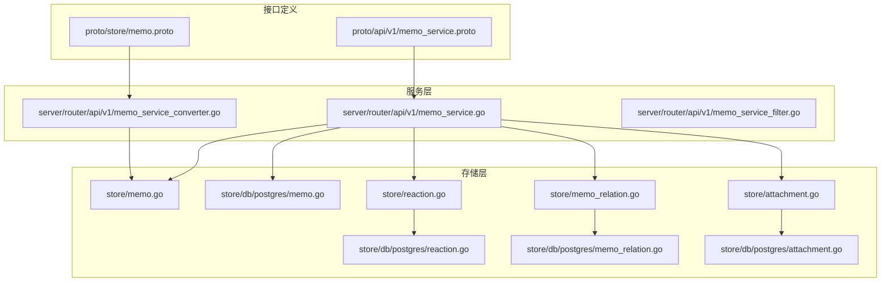
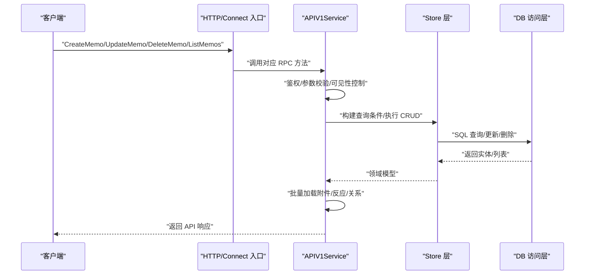
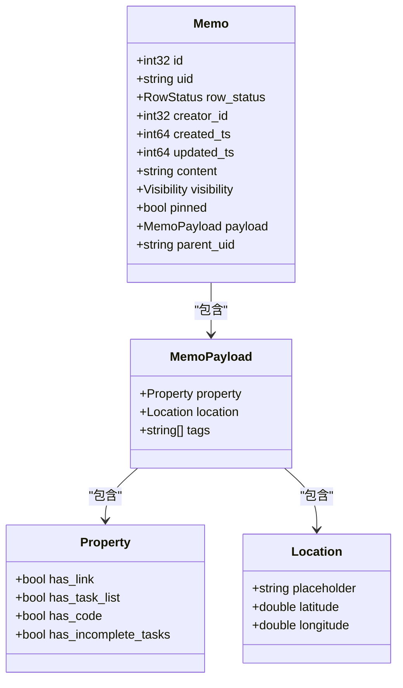
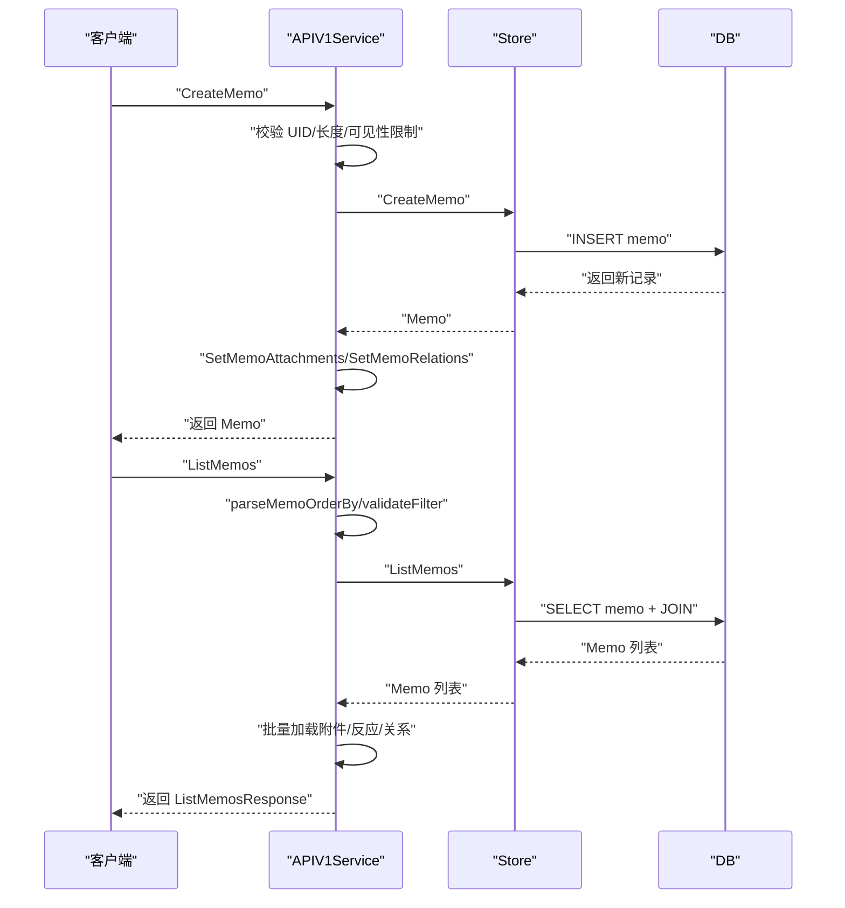
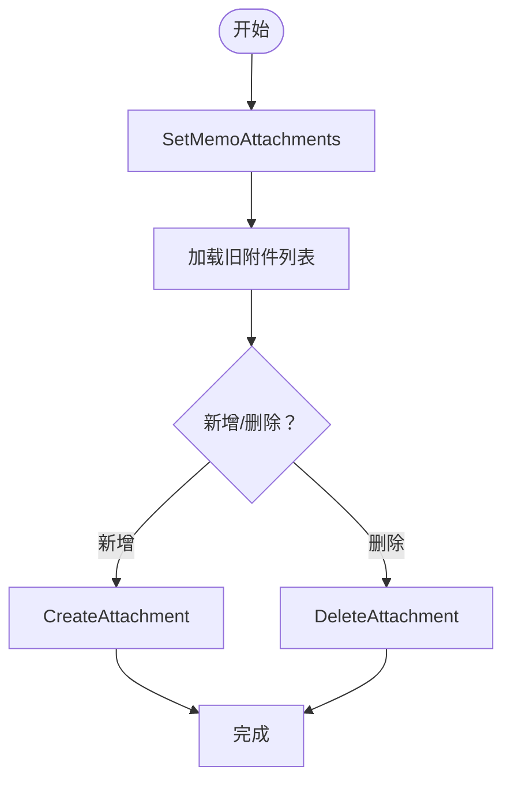
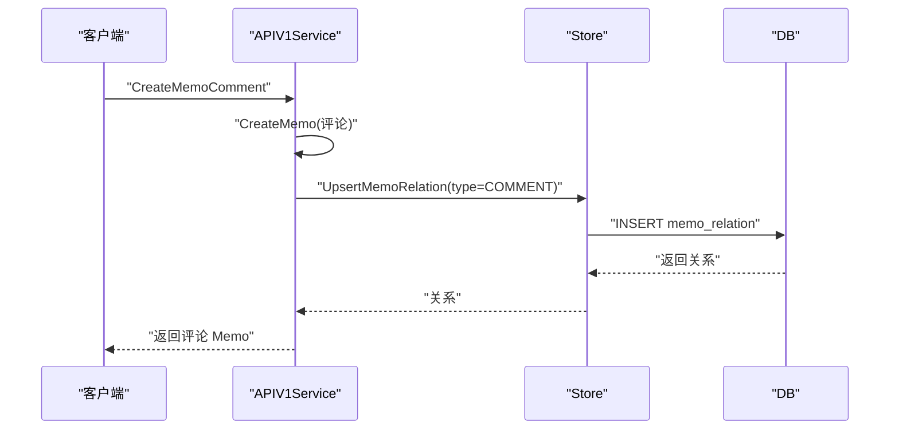
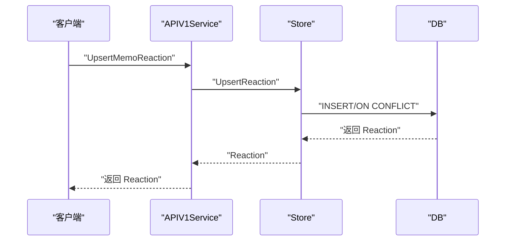
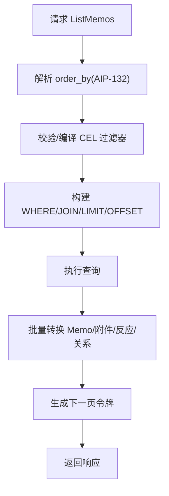
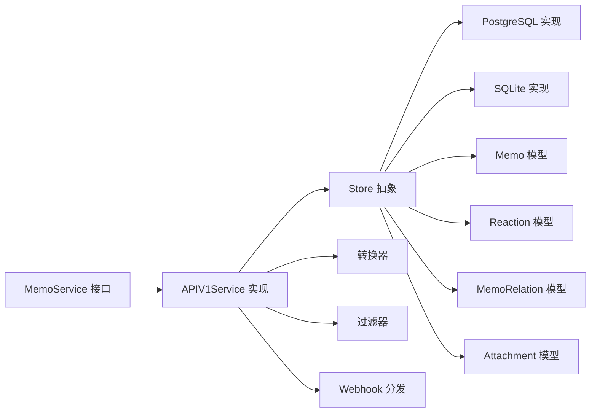

# 笔记服务 API

<cite>
**本文引用的文件**
- [proto/api/v1/memo_service.proto](file://proto/api/v1/memo_service.proto)
- [proto/store/memo.proto](file://proto/store/memo.proto)
- [store/memo.go](file://store/memo.go)
- [store/db/postgres/memo.go](file://store/db/postgres/memo.go)
- [server/router/api/v1/memo_service.go](file://server/router/api/v1/memo_service.go)
- [server/router/api/v1/memo_service_converter.go](file://server/router/api/v1/memo_service_converter.go)
- [store/reaction.go](file://store/reaction.go)
- [store/db/postgres/reaction.go](file://store/db/postgres/reaction.go)
- [store/memo_relation.go](file://store/memo_relation.go)
- [store/db/postgres/memo_relation.go](file://store/db/postgres/memo_relation.go)
- [store/attachment.go](file://store/attachment.go)
- [store/db/postgres/attachment.go](file://store/db/postgres/attachment.go)
- [server/router/api/v1/memo_service_filter.go](file://server/router/api/v1/memo_service_filter.go)
</cite>

## 目录
1. [简介](#简介)
2. [项目结构](#项目结构)
3. [核心组件](#核心组件)
4. [架构总览](#架构总览)
5. [详细组件分析](#详细组件分析)
6. [依赖关系分析](#依赖关系分析)
7. [性能考虑](#性能考虑)
8. [故障排查指南](#故障排查指南)
9. [结论](#结论)
10. [附录](#附录)

## 简介
本文件为“笔记服务 API”的综合技术文档，覆盖笔记的 CRUD 操作、附件管理、关系管理与反应（点赞）功能的完整接口规范；详细说明 Memo 实体的数据结构、标签系统与可见性控制；文档化笔记搜索、过滤与排序的高级能力；并提供性能优化与最佳实践建议。目标读者包括后端开发者、前端集成工程师与运维人员。

## 项目结构
笔记服务 API 基于 Protocol Buffers 定义接口契约，后端通过 Go 语言实现服务层与数据访问层，使用 PostgreSQL/SQLite 作为持久化存储，并在服务层完成资源名称解析、权限校验、过滤与排序等逻辑。

图表来源
- [proto/api/v1/memo_service.proto](file://proto/api/v1/memo_service.proto#L1-L106)
- [proto/store/memo.proto](file://proto/store/memo.proto#L1-L28)
- [server/router/api/v1/memo_service.go](file://server/router/api/v1/memo_service.go#L1-L831)
- [server/router/api/v1/memo_service_converter.go](file://server/router/api/v1/memo_service_converter.go#L1-L135)
- [store/memo.go](file://store/memo.go#L1-L160)
- [store/db/postgres/memo.go](file://store/db/postgres/memo.go#L1-L357)
- [store/reaction.go](file://store/reaction.go#L1-L42)
- [store/db/postgres/reaction.go](file://store/db/postgres/reaction.go#L1-L102)
- [store/memo_relation.go](file://store/memo_relation.go#L1-L46)
- [store/db/postgres/memo_relation.go](file://store/db/postgres/memo_relation.go#L1-L137)
- [store/attachment.go](file://store/attachment.go#L1-L154)
- [store/db/postgres/attachment.go](file://store/db/postgres/attachment.go#L1-L200)

章节来源
- [proto/api/v1/memo_service.proto](file://proto/api/v1/memo_service.proto#L1-L106)
- [server/router/api/v1/memo_service.go](file://server/router/api/v1/memo_service.go#L1-L831)

## 核心组件
- 接口契约：基于 Protocol Buffers 定义 MemoService 服务及消息类型，统一前后端交互协议。
- 服务实现：处理鉴权、参数校验、权限控制、过滤与排序、分页、资源转换与 Webhook 分发。
- 存储抽象：定义 Memo、Reaction、MemoRelation、Attachment 的领域模型与查询条件。
- 数据访问：PostgreSQL/SQLite 实现具体查询、更新、删除逻辑，支持全文检索与向量相似度检索。

章节来源
- [proto/api/v1/memo_service.proto](file://proto/api/v1/memo_service.proto#L1-L512)
- [server/router/api/v1/memo_service.go](file://server/router/api/v1/memo_service.go#L24-L145)
- [store/memo.go](file://store/memo.go#L35-L160)

## 架构总览
笔记服务采用分层架构：接口层（HTTP/Connect）、服务层（业务编排）、存储层（领域模型与查询）、数据层（数据库）。服务层负责资源名称解析、用户鉴权、可见性控制、过滤与排序、批量加载关联数据（附件、反应、关系），并将结果转换为 API 响应格式。

图表来源
- [server/router/api/v1/memo_service.go](file://server/router/api/v1/memo_service.go#L24-L287)
- [store/db/postgres/memo.go](file://store/db/postgres/memo.go#L51-L197)

## 详细组件分析

### Memo 实体与数据模型
- 资源标识：name 为资源名，格式为 memos/{memo}；UID 为用户自定义唯一标识符。
- 标准字段：行状态（Normal/Archived）、创建者 ID、创建/更新时间戳。
- 领域字段：内容（Markdown）、可见性（Private/Protected/Public）、是否置顶、负载（MemoPayload）。
- 负载（MemoPayload）包含：标签数组、位置信息、计算属性（链接/任务/代码/未完成任务）。
- 关联字段：父 Memo UID（评论场景）、片段（Snippet，纯文本摘要）。

图表来源
- [proto/store/memo.proto](file://proto/store/memo.proto#L7-L27)
- [store/memo.go](file://store/memo.go#L35-L55)

章节来源
- [proto/store/memo.proto](file://proto/store/memo.proto#L1-L28)
- [store/memo.go](file://store/memo.go#L35-L55)

### 可见性控制与权限策略
- 可见性枚举：Private（仅自己）、Protected（受保护，允许特定范围可见）、Public（公开）。
- 权限规则：
  - 获取单条笔记：非公开笔记需认证且满足可见性条件（私有仅作者可读，受保护需作者或当前用户可见）。
  - 列表默认排除评论（ExcludeComments），支持过滤器表达式与排序。
  - 更新/删除：仅作者或管理员可操作。
  - 创建时根据实例设置限制 Public 可见性。

章节来源
- [proto/api/v1/memo_service.proto](file://proto/api/v1/memo_service.proto#L108-L113)
- [server/router/api/v1/memo_service.go](file://server/router/api/v1/memo_service.go#L293-L334)
- [server/router/api/v1/memo_service.go](file://server/router/api/v1/memo_service.go#L337-L476)
- [server/router/api/v1/memo_service.go](file://server/router/api/v1/memo_service.go#L478-L544)

### 笔记 CRUD 接口规范
- CreateMemo
  - 请求：CreateMemoRequest（包含 Memo 与可选 memo_id）。
  - 行为：生成/校验 UID、设置显示时间与时间戳、内容长度限制、重建负载（标签/属性/位置）、设置附件与关系、触发 Webhook。
- ListMemos
  - 请求：ListMemosRequest（分页、排序、过滤、状态、显示已删除）。
  - 行为：解析 order_by（AIP-132 规范）、应用过滤器（CEL）、按可见性与用户身份拼接过滤条件、批量加载附件/反应/关系、生成下一页令牌。
- GetMemo
  - 请求：GetMemoRequest（资源名）。
  - 行为：解析 UID、鉴权与可见性校验、加载附件与反应。
- UpdateMemo
  - 请求：UpdateMemoRequest（带 FieldMask）。
  - 行为：逐字段更新（content/visibility/pinned/state/create_time/update_time/display_time/location/attachments/relations），重建负载、触发 Webhook。
- DeleteMemo
  - 请求：DeleteMemoRequest（资源名与可选 force）。
  - 行为：删除评论、清理关系与附件、删除笔记记录。

图表来源
- [server/router/api/v1/memo_service.go](file://server/router/api/v1/memo_service.go#L24-L145)
- [server/router/api/v1/memo_service.go](file://server/router/api/v1/memo_service.go#L147-L287)

章节来源
- [proto/api/v1/memo_service.proto](file://proto/api/v1/memo_service.proto#L17-L106)
- [server/router/api/v1/memo_service.go](file://server/router/api/v1/memo_service.go#L24-L544)

### 附件管理
- 设置附件：SetMemoAttachments（对指定 Memo 设置附件集合）。
- 列出附件：ListMemoAttachments（分页列出附件）。
- 删除附件：DeleteAttachment（支持本地文件清理）。
- 附件模型：包含文件名、二进制/外部链接、存储类型、OCR/提取文本、所属 Memo 等。

图表来源
- [server/router/api/v1/memo_service.go](file://server/router/api/v1/memo_service.go#L108-L133)
- [store/attachment.go](file://store/attachment.go#L86-L154)

章节来源
- [proto/api/v1/memo_service.proto](file://proto/api/v1/memo_service.proto#L49-L61)
- [store/attachment.go](file://store/attachment.go#L15-L154)

### 关系管理（评论/引用）
- 关系类型：REFERENCE（引用）、COMMENT（评论）。
- 设置关系：SetMemoRelations（对指定 Memo 设置关系集合）。
- 列出关系：ListMemoRelations（分页列出关系，含目标 Memo 简要信息）。
- 评论创建：CreateMemoComment（创建子 Memo 并建立 COMMENT 关系，异步通知）。

图表来源
- [server/router/api/v1/memo_service.go](file://server/router/api/v1/memo_service.go#L546-L615)
- [store/memo_relation.go](file://store/memo_relation.go#L35-L45)
- [store/db/postgres/memo_relation.go](file://store/db/postgres/memo_relation.go#L12-L39)

章节来源
- [proto/api/v1/memo_service.proto](file://proto/api/v1/memo_service.proto#L62-L87)
- [server/router/api/v1/memo_service.go](file://server/router/api/v1/memo_service.go#L546-L709)
- [store/memo_relation.go](file://store/memo_relation.go#L7-L46)

### 反应（点赞）功能
- 列出反应：ListMemoReactions（分页列出反应）。
- 新增/更新反应：UpsertMemoReaction（幂等插入/更新）。
- 删除反应：DeleteMemoReaction（按资源名删除）。
- 反应模型：包含创建者、内容 ID（Memo 资源名）、反应类型（如表情符号）。

图表来源
- [server/router/api/v1/memo_service.go](file://server/router/api/v1/memo_service.go#L88-L105)
- [store/reaction.go](file://store/reaction.go#L27-L41)
- [store/db/postgres/reaction.go](file://store/db/postgres/reaction.go#L10-L23)

章节来源
- [proto/api/v1/memo_service.proto](file://proto/api/v1/memo_service.proto#L88-L105)
- [server/router/api/v1/memo_service.go](file://server/router/api/v1/memo_service.go#L88-L105)
- [store/reaction.go](file://store/reaction.go#L7-L42)

### 搜索、过滤与排序
- 过滤（Filter）：支持 CEL 表达式，服务端通过过滤引擎编译为 SQL 条件；支持多字段组合与 Memo 自身过滤。
- 排序（Order By）：遵循 AIP-132，支持多个字段，如 pinned desc, display_time desc；默认按 display_time desc。
- 分页：支持 page_token 与 page_size，服务端生成下一页令牌。
- 内容长度限制：根据实例设置限制 Memo 内容长度。
- 片段生成：基于 Markdown 服务生成纯文本片段。

图表来源
- [server/router/api/v1/memo_service.go](file://server/router/api/v1/memo_service.go#L147-L287)
- [server/router/api/v1/memo_service.go](file://server/router/api/v1/memo_service.go#L777-L831)
- [server/router/api/v1/memo_service_filter.go](file://server/router/api/v1/memo_service_filter.go#L1-L200)

章节来源
- [proto/api/v1/memo_service.proto](file://proto/api/v1/memo_service.proto#L253-L291)
- [server/router/api/v1/memo_service.go](file://server/router/api/v1/memo_service.go#L147-L287)
- [server/router/api/v1/memo_service.go](file://server/router/api/v1/memo_service.go#L777-L831)

### 资源名称与转换
- 资源名前缀：Memo 使用固定前缀拼接 UID 生成 name。
- 转换器：将 Store 领域模型转换为 API 响应消息，包括可见性、位置、属性、父 Memo、片段等。

章节来源
- [server/router/api/v1/memo_service_converter.go](file://server/router/api/v1/memo_service_converter.go#L16-L76)
- [server/router/api/v1/memo_service_converter.go](file://server/router/api/v1/memo_service_converter.go#L112-L135)

## 依赖关系分析

图表来源
- [server/router/api/v1/memo_service.go](file://server/router/api/v1/memo_service.go#L1-L831)
- [store/memo.go](file://store/memo.go#L1-L160)
- [store/reaction.go](file://store/reaction.go#L1-L42)
- [store/memo_relation.go](file://store/memo_relation.go#L1-L46)
- [store/attachment.go](file://store/attachment.go#L1-L154)

章节来源
- [server/router/api/v1/memo_service.go](file://server/router/api/v1/memo_service.go#L1-L831)
- [store/memo.go](file://store/memo.go#L1-L160)

## 性能考虑
- 批量加载：ListMemos 中一次性批量加载附件、反应与关系，减少 N+1 查询。
- 分页与上限：默认分页大小与最大限制，避免超大数据集一次性返回。
- 过滤与排序：基于 AIP-132 的排序与 CEL 过滤，结合数据库索引与 WHERE 条件优化。
- 内容长度限制：防止超长内容导致的内存与传输压力。
- Webhook 异步：创建/更新/删除事件通过异步方式分发，降低主流程延迟。
- 存储层优化：PostgreSQL 支持全文检索与向量相似度检索（Embedding），SQLite 提供 LIKE 回退方案。

章节来源
- [server/router/api/v1/memo_service.go](file://server/router/api/v1/memo_service.go#L240-L280)
- [server/router/api/v1/memo_service.go](file://server/router/api/v1/memo_service.go#L200-L217)
- [store/db/postgres/memo.go](file://store/db/postgres/memo.go#L138-L154)
- [store/db/postgres/memo.go](file://store/db/postgres/memo.go#L279-L340)

## 故障排查指南
- 参数错误（InvalidArgument）：如 memo_id 格式不合法、order_by 字段或方向非法、更新掩码为空。
- 权限拒绝（PermissionDenied）：非公开笔记未认证或无权限访问；尝试将 Public 可见性设置被系统禁用。
- 未找到（NotFound）：资源不存在。
- 唯一约束冲突（AlreadyExists）：自定义 memo_id 已存在。
- 内容过长（InvalidArgument）：超过实例设置的内容长度限制。
- 数据库错误：查询失败、更新失败、删除失败，检查 SQL 语句与连接状态。

章节来源
- [server/router/api/v1/memo_service.go](file://server/router/api/v1/memo_service.go#L34-L104)
- [server/router/api/v1/memo_service.go](file://server/router/api/v1/memo_service.go#L162-L175)
- [server/router/api/v1/memo_service.go](file://server/router/api/v1/memo_service.go#L342-L364)
- [server/router/api/v1/memo_service.go](file://server/router/api/v1/memo_service.go#L386-L394)

## 结论
笔记服务 API 以清晰的接口契约与严谨的服务层实现，提供了完整的笔记 CRUD、附件、关系与反应能力，并内置可见性控制、过滤排序与分页机制。通过批量加载与异步 Webhook，兼顾了性能与扩展性。建议在生产环境中启用合适的索引、合理设置分页与内容长度限制，并结合实例设置进行可见性策略管控。

## 附录

### 接口一览（按功能分类）
- 笔记 CRUD
  - CreateMemo
  - ListMemos
  - GetMemo
  - UpdateMemo
  - DeleteMemo
- 附件
  - SetMemoAttachments
  - ListMemoAttachments
- 关系
  - SetMemoRelations
  - ListMemoRelations
  - CreateMemoComment
  - ListMemoComments
- 反应
  - ListMemoReactions
  - UpsertMemoReaction
  - DeleteMemoReaction

章节来源
- [proto/api/v1/memo_service.proto](file://proto/api/v1/memo_service.proto#L17-L106)